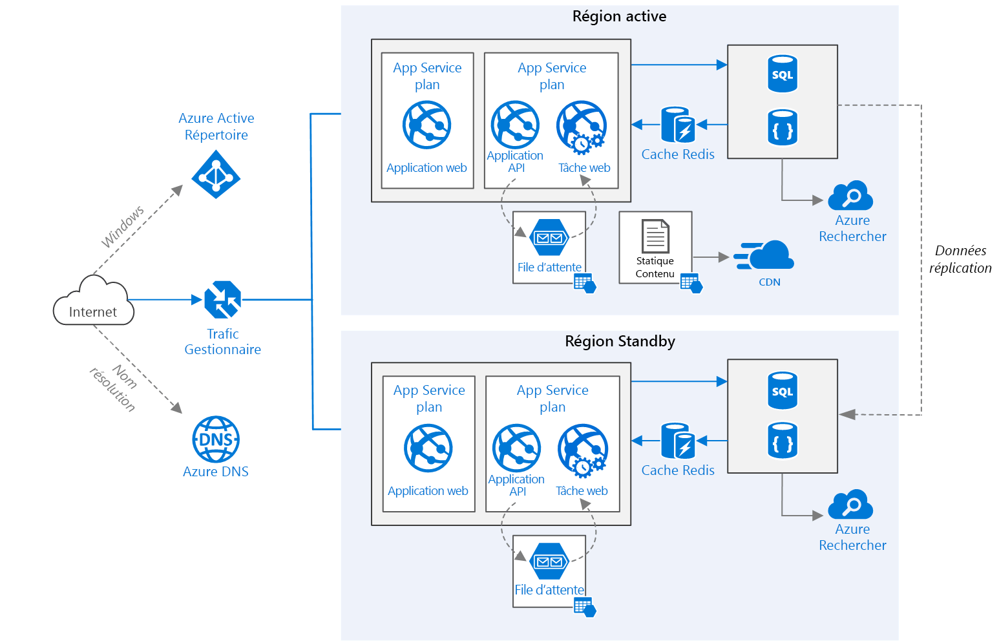

# <a name="run-a-web-application-in-multiple-regions"></a><span data-ttu-id="3cda2-103">Exécuter une application web dans plusieurs régions</span><span class="sxs-lookup"><span data-stu-id="3cda2-103">Run a web application in multiple regions</span></span>
[!INCLUDE [header](../../_includes/header.md)]

<span data-ttu-id="3cda2-104">Cette architecture de référence indique comment exécuter une application Azure App Service dans plusieurs régions afin de bénéficier d’une haute disponibilité.</span><span class="sxs-lookup"><span data-stu-id="3cda2-104">This reference architecture shows how to run an Azure App Service application in multiple regions to achieve high availability.</span></span> 

 

<span data-ttu-id="3cda2-106">*Téléchargez un [fichier Visio][visio-download] de cette architecture.*</span><span class="sxs-lookup"><span data-stu-id="3cda2-106">*Download a [Visio file][visio-download] of this architecture.*</span></span>

## <a name="architecture"></a><span data-ttu-id="3cda2-107">Architecture</span><span class="sxs-lookup"><span data-stu-id="3cda2-107">Architecture</span></span> 

<span data-ttu-id="3cda2-108">Cette architecture repose sur celle illustrée dans l’article [Améliorer l’évolutivité dans une application web][guidance-web-apps-scalability].</span><span class="sxs-lookup"><span data-stu-id="3cda2-108">This architecture builds on the one shown in [Improve scalability in a web application][guidance-web-apps-scalability].</span></span> <span data-ttu-id="3cda2-109">Les principales différences entre ces deux architectures sont les suivantes :</span><span class="sxs-lookup"><span data-stu-id="3cda2-109">The main differences are:</span></span>

* <span data-ttu-id="3cda2-110">**Régions primaires et secondaires**.</span><span class="sxs-lookup"><span data-stu-id="3cda2-110">**Primary and secondary regions**.</span></span> <span data-ttu-id="3cda2-111">Cette architecture utilise deux régions pour garantir une meilleure disponibilité.</span><span class="sxs-lookup"><span data-stu-id="3cda2-111">This architecture uses two regions to achieve higher availability.</span></span> <span data-ttu-id="3cda2-112">L’application est déployée dans chaque région.</span><span class="sxs-lookup"><span data-stu-id="3cda2-112">The application is deployed to each region.</span></span> <span data-ttu-id="3cda2-113">Pendant les opérations normales, le trafic réseau est routé vers la région primaire.</span><span class="sxs-lookup"><span data-stu-id="3cda2-113">During normal operations, network traffic is routed to the primary region.</span></span> <span data-ttu-id="3cda2-114">Si la région primaire n’est plus disponible, le trafic est routé vers la région secondaire.</span><span class="sxs-lookup"><span data-stu-id="3cda2-114">If the primary region becomes unavailable, traffic is routed to the secondary region.</span></span> 
* <span data-ttu-id="3cda2-115">**Azure DNS**.</span><span class="sxs-lookup"><span data-stu-id="3cda2-115">**Azure DNS**.</span></span> <span data-ttu-id="3cda2-116">[Azure DNS][azure-dns] est un service d’hébergement pour les domaines DNS qui offre une résolution de noms à l’aide de l’infrastructure Microsoft Azure.</span><span class="sxs-lookup"><span data-stu-id="3cda2-116">[Azure DNS][azure-dns] is a hosting service for DNS domains, providing name resolution using Microsoft Azure infrastructure.</span></span> <span data-ttu-id="3cda2-117">En hébergeant vos domaines dans Azure, vous pouvez gérer vos enregistrements DNS avec les mêmes informations d’identification, les mêmes API, les mêmes outils et la même facturation que vos autres services Azure.</span><span class="sxs-lookup"><span data-stu-id="3cda2-117">By hosting your domains in Azure, you can manage your DNS records using the same credentials, APIs, tools, and billing as your other Azure services.</span></span>
* <span data-ttu-id="3cda2-118">**Azure Traffic Manager**.</span><span class="sxs-lookup"><span data-stu-id="3cda2-118">**Azure Traffic Manager**.</span></span> <span data-ttu-id="3cda2-119">[Traffic Manager][traffic-manager] route les demandes entrantes vers la région primaire.</span><span class="sxs-lookup"><span data-stu-id="3cda2-119">[Traffic Manager][traffic-manager] routes incoming requests to the primary region.</span></span> <span data-ttu-id="3cda2-120">Si l’application qui s’exécute dans cette région n’est plus disponible, Traffic Manager bascule vers la région secondaire.</span><span class="sxs-lookup"><span data-stu-id="3cda2-120">If the application running that region becomes unavailable, Traffic Manager fails over to the secondary region.</span></span>
* <span data-ttu-id="3cda2-121">**Géoréplication** de SQL Database et de Cosmos DB.</span><span class="sxs-lookup"><span data-stu-id="3cda2-121">**Geo-replication** of SQL Database and Cosmos DB.</span></span> 

<span data-ttu-id="3cda2-122">Une architecture multirégion peut offrir une meilleure disponibilité qu’un déploiement dans une seule région.</span><span class="sxs-lookup"><span data-stu-id="3cda2-122">A multi-region architecture can provide higher availability than deploying to a single region.</span></span> <span data-ttu-id="3cda2-123">Si une interruption de service régionale affecte la région primaire, vous pouvez utiliser [Traffic Manager][traffic-manager] pour basculer vers la région secondaire.</span><span class="sxs-lookup"><span data-stu-id="3cda2-123">If a regional outage affects the primary region, you can use [Traffic Manager][traffic-manager] to fail over to the secondary region.</span></span> <span data-ttu-id="3cda2-124">Cette architecture peut également se révéler utile en cas de défaillance d’un sous-système spécifique de l’application.</span><span class="sxs-lookup"><span data-stu-id="3cda2-124">This architecture can also help if an individual subsystem of the application fails.</span></span>

<span data-ttu-id="3cda2-125">Plusieurs approches générales permettent de bénéficier d’une haute disponibilité dans l’ensemble des régions :</span><span class="sxs-lookup"><span data-stu-id="3cda2-125">There are several general approaches to achieving high availability across regions:</span></span> 

* <span data-ttu-id="3cda2-126">Mode actif/passif avec serveur de secours.</span><span class="sxs-lookup"><span data-stu-id="3cda2-126">Active/passive with hot standby.</span></span> <span data-ttu-id="3cda2-127">Le trafic est dirigé vers une région, tandis que l’autre région est en attente sur le serveur de secours.</span><span class="sxs-lookup"><span data-stu-id="3cda2-127">Traffic goes to one region, while the other waits on hot standby.</span></span> <span data-ttu-id="3cda2-128">Le terme « serveur de secours » signifie que les machines virtuelles de la région secondaire sont allouées et en cours d’exécution en permanence.</span><span class="sxs-lookup"><span data-stu-id="3cda2-128">Hot standby means the VMs in the secondary region are allocated and running at all times.</span></span>
* <span data-ttu-id="3cda2-129">Mode actif/passif avec reprise progressive.</span><span class="sxs-lookup"><span data-stu-id="3cda2-129">Active/passive with cold standby.</span></span> <span data-ttu-id="3cda2-130">Le trafic est dirigé vers une région, tandis que l’autre région est en attente sur le centre de données de reprise progressive.</span><span class="sxs-lookup"><span data-stu-id="3cda2-130">Traffic goes to one region, while the other waits on cold standby.</span></span> <span data-ttu-id="3cda2-131">Le terme « reprise progressive » signifie que les machines virtuelles de la région secondaire ne sont pas allouées tant qu’elles ne sont pas requises pour le basculement.</span><span class="sxs-lookup"><span data-stu-id="3cda2-131">Cold standby means the VMs in the secondary region are not allocated until needed for failover.</span></span> <span data-ttu-id="3cda2-132">La mise en œuvre de cette approche se révèle moins coûteuse, mais nécessite davantage de temps en cas de défaillance.</span><span class="sxs-lookup"><span data-stu-id="3cda2-132">This approach costs less to run, but will generally take longer to come online during a failure.</span></span>
* <span data-ttu-id="3cda2-133">Mode actif/actif.</span><span class="sxs-lookup"><span data-stu-id="3cda2-133">Active/active.</span></span> <span data-ttu-id="3cda2-134">Les deux régions sont actives, et la charge de travail des requêtes est équilibrée entre les régions.</span><span class="sxs-lookup"><span data-stu-id="3cda2-134">Both regions are active, and requests are load balanced between them.</span></span> <span data-ttu-id="3cda2-135">Si l’une des régions n’est plus disponible, elle est mise hors service.</span><span class="sxs-lookup"><span data-stu-id="3cda2-135">If one region becomes unavailable, it is taken out of rotation.</span></span> 

<span data-ttu-id="3cda2-136">Cette architecture de référence est axée sur le mode actif/passif avec serveur de secours, et utilise Traffic Manager pour le basculement.</span><span class="sxs-lookup"><span data-stu-id="3cda2-136">This reference architecture focuses on active/passive with hot standby, using Traffic Manager for failover.</span></span> 


## <a name="recommendations"></a><span data-ttu-id="3cda2-137">Recommandations</span><span class="sxs-lookup"><span data-stu-id="3cda2-137">Recommendations</span></span>

<span data-ttu-id="3cda2-138">Vos exigences peuvent différer de celles de l’architecture décrite ici.</span><span class="sxs-lookup"><span data-stu-id="3cda2-138">Your requirements might differ from the architecture described here.</span></span> <span data-ttu-id="3cda2-139">Utilisez les recommandations de cette section comme point de départ.</span><span class="sxs-lookup"><span data-stu-id="3cda2-139">Use the recommendations in this section as a starting point.</span></span>

### <a name="regional-pairing"></a><span data-ttu-id="3cda2-140">Association régionale</span><span class="sxs-lookup"><span data-stu-id="3cda2-140">Regional pairing</span></span>
<span data-ttu-id="3cda2-141">Chaque région Azure est associée à une autre région de la même zone géographique.</span><span class="sxs-lookup"><span data-stu-id="3cda2-141">Each Azure region is paired with another region within the same geography.</span></span> <span data-ttu-id="3cda2-142">En général, choisissez des régions de la même paire régionale (par exemple, Est des États-Unis 2 et Centre des États-Unis).</span><span class="sxs-lookup"><span data-stu-id="3cda2-142">In general, choose regions from the same regional pair (for example, East US 2 and Central US).</span></span> <span data-ttu-id="3cda2-143">Cette approche offre les avantages suivants :</span><span class="sxs-lookup"><span data-stu-id="3cda2-143">Benefits of doing so include:</span></span>

* <span data-ttu-id="3cda2-144">Dans l’éventualité d’une interruption de service générale, la récupération d’au moins une région de chaque paire est prioritaire.</span><span class="sxs-lookup"><span data-stu-id="3cda2-144">If there is a broad outage, recovery of at least one region out of every pair is prioritized.</span></span>
* <span data-ttu-id="3cda2-145">Les mises à jour planifiées du système Azure sont déployées dans les régions associées de manière séquentielle afin de minimiser les temps d’arrêt possibles.</span><span class="sxs-lookup"><span data-stu-id="3cda2-145">Planned Azure system updates are rolled out to paired regions sequentially to minimize possible downtime.</span></span>
* <span data-ttu-id="3cda2-146">Dans la plupart des cas, les paires régionales appartiennent à la même zone géographique afin de répondre aux exigences en matière de résidence des données.</span><span class="sxs-lookup"><span data-stu-id="3cda2-146">In most cases, regional pairs reside within the same geography to meet data residency requirements.</span></span>

<span data-ttu-id="3cda2-147">Toutefois, assurez-vous que les deux régions prennent en charge tous les services Azure requis pour votre application.</span><span class="sxs-lookup"><span data-stu-id="3cda2-147">However, make sure that both regions support all of the Azure services needed for your application.</span></span> <span data-ttu-id="3cda2-148">Consultez la page répertoriant les [services par région][services-by-region].</span><span class="sxs-lookup"><span data-stu-id="3cda2-148">See [Services by region][services-by-region].</span></span> <span data-ttu-id="3cda2-149">Pour plus d’informations sur les paires régionales, consultez l’article [Continuité des activités et récupération d’urgence (BCDR) : régions jumelées d’Azure][regional-pairs].</span><span class="sxs-lookup"><span data-stu-id="3cda2-149">For more information about regional pairs, see [Business continuity and disaster recovery (BCDR): Azure Paired Regions][regional-pairs].</span></span>

### <a name="resource-groups"></a><span data-ttu-id="3cda2-150">Groupes de ressources</span><span class="sxs-lookup"><span data-stu-id="3cda2-150">Resource groups</span></span>
<span data-ttu-id="3cda2-151">Envisagez de placer la région primaire, la région secondaire et Traffic Manager dans des [groupes de ressources][resource groups] distincts.</span><span class="sxs-lookup"><span data-stu-id="3cda2-151">Consider placing the primary region, secondary region, and Traffic Manager into separate [resource groups][resource groups].</span></span> <span data-ttu-id="3cda2-152">Cette approche vous permet de gérer les ressources déployées dans chaque région sous la forme d’une collection unique.</span><span class="sxs-lookup"><span data-stu-id="3cda2-152">This lets you manage the resources deployed to each region as a single collection.</span></span>

### <a name="traffic-manager-configuration"></a><span data-ttu-id="3cda2-153">Configuration de Traffic Manager</span><span class="sxs-lookup"><span data-stu-id="3cda2-153">Traffic Manager configuration</span></span> 

<span data-ttu-id="3cda2-154">**Routage**.</span><span class="sxs-lookup"><span data-stu-id="3cda2-154">**Routing**.</span></span> <span data-ttu-id="3cda2-155">Traffic Manager prend en charge plusieurs [algorithmes de routage][tm-routing].</span><span class="sxs-lookup"><span data-stu-id="3cda2-155">Traffic Manager supports several [routing algorithms][tm-routing].</span></span> <span data-ttu-id="3cda2-156">Pour le scénario décrit dans cet article, utilisez le routage *par priorité* (auparavant désigné sous le terme de routage *par basculement*).</span><span class="sxs-lookup"><span data-stu-id="3cda2-156">For the scenario described in this article, use *priority* routing (formerly called *failover* routing).</span></span> <span data-ttu-id="3cda2-157">Lorsque cette méthode de routage est configurée, Traffic Manager envoie toutes les requêtes à la région primaire, sauf si le point de terminaison de cette région devient inaccessible.</span><span class="sxs-lookup"><span data-stu-id="3cda2-157">With this setting, Traffic Manager sends all requests to the primary region unless the endpoint for that region becomes unreachable.</span></span> <span data-ttu-id="3cda2-158">Dans ce dernier cas, les requêtes basculent automatiquement vers la région secondaire.</span><span class="sxs-lookup"><span data-stu-id="3cda2-158">At that point, it automatically fails over to the secondary region.</span></span> <span data-ttu-id="3cda2-159">Consultez [Configurer la méthode de routage de basculement][tm-configure-failover].</span><span class="sxs-lookup"><span data-stu-id="3cda2-159">See [Configure Failover routing method][tm-configure-failover].</span></span>

<span data-ttu-id="3cda2-160">**Sonde d’intégrité**.</span><span class="sxs-lookup"><span data-stu-id="3cda2-160">**Health probe**.</span></span> <span data-ttu-id="3cda2-161">Traffic Manager utilise une sonde HTTP (ou HTTPS) pour surveiller la disponibilité de chaque point de terminaison.</span><span class="sxs-lookup"><span data-stu-id="3cda2-161">Traffic Manager uses an HTTP (or HTTPS) probe to monitor the availability of each endpoint.</span></span> <span data-ttu-id="3cda2-162">Cette sonde offre à Traffic Manager un test de réussite/échec pour le basculement vers la région secondaire.</span><span class="sxs-lookup"><span data-stu-id="3cda2-162">The probe gives Traffic Manager a pass/fail test for failing over to the secondary region.</span></span> <span data-ttu-id="3cda2-163">Elle envoie une requête à un chemin d’URL spécifié.</span><span class="sxs-lookup"><span data-stu-id="3cda2-163">It works by sending a request to a specified URL path.</span></span> <span data-ttu-id="3cda2-164">Si la sonde obtient une réponse autre que 200 dans le délai d’expiration imparti, elle échoue.</span><span class="sxs-lookup"><span data-stu-id="3cda2-164">If it gets a non-200 response within a timeout period, the probe fails.</span></span> <span data-ttu-id="3cda2-165">Après quatre échecs de requêtes, Traffic Manager marque le point de terminaison comme détérioré et bascule vers l’autre point de terminaison.</span><span class="sxs-lookup"><span data-stu-id="3cda2-165">After four failed requests, Traffic Manager marks the endpoint as degraded and fails over to the other endpoint.</span></span> <span data-ttu-id="3cda2-166">Pour plus d’informations, consultez l’article [Surveillance et basculement des points de terminaison Traffic Manager][tm-monitoring].</span><span class="sxs-lookup"><span data-stu-id="3cda2-166">For details, see [Traffic Manager endpoint monitoring and failover][tm-monitoring].</span></span>

<span data-ttu-id="3cda2-167">Une bonne pratique consiste à créer un point de terminaison de sonde d’intégrité qui signale l’intégrité globale de l’application et à utiliser ce point de terminaison pour la sonde d’intégrité.</span><span class="sxs-lookup"><span data-stu-id="3cda2-167">As a best practice, create a health probe endpoint that reports the overall health of the application and use this endpoint for the health probe.</span></span> <span data-ttu-id="3cda2-168">Le point de terminaison doit vérifier les dépendances critiques telles que les applications App Service, la file d’attente de stockage et SQL Database.</span><span class="sxs-lookup"><span data-stu-id="3cda2-168">The endpoint should check critical dependencies such as the App Service apps, storage queue, and SQL Database.</span></span> <span data-ttu-id="3cda2-169">Dans le cas contraire, la sonde risque de signaler un point de terminaison intègre alors que des parties critiques de l’application sont défaillantes.</span><span class="sxs-lookup"><span data-stu-id="3cda2-169">Otherwise, the probe might report a healthy endpoint when critical parts of the application are actually failing.</span></span>

<span data-ttu-id="3cda2-170">En revanche, n’utilisez pas la sonde d’intégrité pour vérifier des services de priorité inférieure.</span><span class="sxs-lookup"><span data-stu-id="3cda2-170">On the other hand, don't use the health probe to check lower priority services.</span></span> <span data-ttu-id="3cda2-171">Par exemple, si un service de messagerie tombe en panne, l’application peut basculer vers un second fournisseur ou simplement différer l’envoi des e-mails.</span><span class="sxs-lookup"><span data-stu-id="3cda2-171">For example, if an email service goes down the application can switch to a second provider or just send emails later.</span></span> <span data-ttu-id="3cda2-172">Cette situation n’est pas suffisamment prioritaire pour entraîner le basculement de l’application.</span><span class="sxs-lookup"><span data-stu-id="3cda2-172">This is not a high enough priority to cause the application to fail over.</span></span> <span data-ttu-id="3cda2-173">Pour plus d’informations, consultez [Modèle de surveillance de point de terminaison d’intégrité][health-endpoint-monitoring-pattern].</span><span class="sxs-lookup"><span data-stu-id="3cda2-173">For more information, see [Health Endpoint Monitoring Pattern][health-endpoint-monitoring-pattern].</span></span>
 
### <a name="sql-database"></a><span data-ttu-id="3cda2-174">Base de données SQL</span><span class="sxs-lookup"><span data-stu-id="3cda2-174">SQL Database</span></span>
<span data-ttu-id="3cda2-175">Utilisez la [géoréplication active][sql-replication] pour créer un réplica secondaire lisible dans une autre région.</span><span class="sxs-lookup"><span data-stu-id="3cda2-175">Use [Active Geo-Replication][sql-replication] to create a readable secondary replica in a different region.</span></span> <span data-ttu-id="3cda2-176">Vous pouvez posséder jusqu’à quatre réplicas secondaires lisibles.</span><span class="sxs-lookup"><span data-stu-id="3cda2-176">You can have up to four readable secondary replicas.</span></span> <span data-ttu-id="3cda2-177">Basculez vers une base de données secondaire si votre base de données primaire est défaillante ou doit être mise hors connexion.</span><span class="sxs-lookup"><span data-stu-id="3cda2-177">Fail over to a secondary database if your primary database fails or needs to be taken offline.</span></span> <span data-ttu-id="3cda2-178">La géoréplication active peut être configurée pour toute base de données faisant partie d’un pool de bases de données élastique.</span><span class="sxs-lookup"><span data-stu-id="3cda2-178">Active Geo-Replication can be configured for any database in any elastic database pool.</span></span>

### <a name="cosmos-db"></a><span data-ttu-id="3cda2-179">Cosmos DB</span><span class="sxs-lookup"><span data-stu-id="3cda2-179">Cosmos DB</span></span>
<span data-ttu-id="3cda2-180">Cosmos DB prend en charge la géoréplication entre régions.</span><span class="sxs-lookup"><span data-stu-id="3cda2-180">Cosmos DB supports geo-replication across regions.</span></span> <span data-ttu-id="3cda2-181">L’une des régions est désignée comme étant accessible en écriture, tandis que les autres régions sont des réplicas en lecture seule.</span><span class="sxs-lookup"><span data-stu-id="3cda2-181">One region is designated as writable and the others are read-only replicas.</span></span>

<span data-ttu-id="3cda2-182">Dans l’éventualité d’une interruption de service régionale, vous pouvez procéder à un basculement en désignant une autre région comme étant accessible en écriture.</span><span class="sxs-lookup"><span data-stu-id="3cda2-182">If there is a regional outage, you can fail over by selecting another region to be the write region.</span></span> <span data-ttu-id="3cda2-183">Le Kit de développement logiciel (SDK) client envoie automatiquement des requêtes d’écriture à la région accessible en écriture ; vous n’avez donc pas besoin de mettre à jour la configuration du client après un basculement.</span><span class="sxs-lookup"><span data-stu-id="3cda2-183">The client SDK automatically sends write requests to the current write region, so you don't need to update the client configuration after a failover.</span></span> <span data-ttu-id="3cda2-184">Pour plus d’informations, consultez l’article [Comment distribuer des données mondialement avec Azure Cosmos DB][docdb-geo].</span><span class="sxs-lookup"><span data-stu-id="3cda2-184">For more information, see [How to distribute data globally with Azure Cosmos DB?][docdb-geo]</span></span>

> [!NOTE]
> <span data-ttu-id="3cda2-185">Tous les réplicas appartiennent au même groupe de ressources.</span><span class="sxs-lookup"><span data-stu-id="3cda2-185">All of the replicas belong to the same resource group.</span></span>
>
>

### <a name="storage"></a><span data-ttu-id="3cda2-186">Stockage</span><span class="sxs-lookup"><span data-stu-id="3cda2-186">Storage</span></span>
<span data-ttu-id="3cda2-187">Pour le service Stockage Azure, utilisez un [stockage géographiquement redondant avec accès en lecture][ra-grs] (RA-GRS).</span><span class="sxs-lookup"><span data-stu-id="3cda2-187">For Azure Storage, use [read-access geo-redundant storage][ra-grs] (RA-GRS).</span></span> <span data-ttu-id="3cda2-188">Dans le cadre d’un stockage RA-GRS, les données sont répliquées vers une région secondaire.</span><span class="sxs-lookup"><span data-stu-id="3cda2-188">With RA-GRS storage, the data is replicated to a secondary region.</span></span> <span data-ttu-id="3cda2-189">Vous disposez d’un accès en lecture seule aux données de la région secondaire par le biais d’un point de terminaison distinct.</span><span class="sxs-lookup"><span data-stu-id="3cda2-189">You have read-only access to the data in the secondary region through a separate endpoint.</span></span> <span data-ttu-id="3cda2-190">En cas d’interruption de service régionale ou de situation d’urgence, l’équipe Stockage Azure peut décider de procéder à un basculement géographique vers la région secondaire.</span><span class="sxs-lookup"><span data-stu-id="3cda2-190">If there is a regional outage or disaster, the Azure Storage team might decide to perform a geo-failover to the secondary region.</span></span> <span data-ttu-id="3cda2-191">Ce basculement ne nécessite aucune action de la part du client.</span><span class="sxs-lookup"><span data-stu-id="3cda2-191">There is no customer action required for this failover.</span></span>

<span data-ttu-id="3cda2-192">Pour le service Stockage File d’attente, créez une file d’attente de sauvegarde dans la région secondaire.</span><span class="sxs-lookup"><span data-stu-id="3cda2-192">For Queue storage, create a backup queue in the secondary region.</span></span> <span data-ttu-id="3cda2-193">Pendant le basculement, l’application peut utiliser la file d’attente de sauvegarde jusqu’à ce que la région primaire redevienne disponible.</span><span class="sxs-lookup"><span data-stu-id="3cda2-193">During failover, the app can use the backup queue until the primary region becomes available again.</span></span> <span data-ttu-id="3cda2-194">De cette façon, l’application peut continuer à traiter les nouvelles requêtes.</span><span class="sxs-lookup"><span data-stu-id="3cda2-194">That way, the application can still process new requests.</span></span>

## <a name="availability-considerations"></a><span data-ttu-id="3cda2-195">Considérations relatives à la disponibilité</span><span class="sxs-lookup"><span data-stu-id="3cda2-195">Availability considerations</span></span>


### <a name="traffic-manager"></a><span data-ttu-id="3cda2-196">Traffic Manager</span><span class="sxs-lookup"><span data-stu-id="3cda2-196">Traffic Manager</span></span>

<span data-ttu-id="3cda2-197">Traffic Manager procède à un basculement automatique si la région primaire n’est plus disponible.</span><span class="sxs-lookup"><span data-stu-id="3cda2-197">Traffic Manager automatically fails over if the primary region becomes unavailable.</span></span> <span data-ttu-id="3cda2-198">Lors de ce basculement, l’application reste inaccessible au client pendant un certain laps de temps.</span><span class="sxs-lookup"><span data-stu-id="3cda2-198">When Traffic Manager fails over, there is a period of time when clients cannot reach the application.</span></span> <span data-ttu-id="3cda2-199">Cette durée dépend des facteurs suivants :</span><span class="sxs-lookup"><span data-stu-id="3cda2-199">The duration is affected by the following factors:</span></span>

* <span data-ttu-id="3cda2-200">La sonde d’intégrité doit détecter que le centre de données principal est devenu inaccessible.</span><span class="sxs-lookup"><span data-stu-id="3cda2-200">The health probe must detect that the primary data center has become unreachable.</span></span>
* <span data-ttu-id="3cda2-201">Les serveurs DNS (Domain Name Service) doivent mettre à jour les enregistrements DNS mis en cache pour l’adresse IP, qui dépend de la durée de vie (TTL) DNS.</span><span class="sxs-lookup"><span data-stu-id="3cda2-201">Domain name service (DNS) servers must update the cached DNS records for the IP address, which depends on the DNS time-to-live (TTL).</span></span> <span data-ttu-id="3cda2-202">La valeur TTL par défaut est de 300 secondes (5 minutes), mais vous pouvez configurer cette valeur lorsque vous créez le profil Traffic Manager.</span><span class="sxs-lookup"><span data-stu-id="3cda2-202">The default TTL is 300 seconds (5 minutes), but you can configure this value when you create the Traffic Manager profile.</span></span>

<span data-ttu-id="3cda2-203">Pour plus d’informations, consultez l’article [À propos de la surveillance avec Traffic Manager][tm-monitoring].</span><span class="sxs-lookup"><span data-stu-id="3cda2-203">For details, see [About Traffic Manager Monitoring][tm-monitoring].</span></span>

<span data-ttu-id="3cda2-204">Traffic Manager est un point de défaillance possible dans le système.</span><span class="sxs-lookup"><span data-stu-id="3cda2-204">Traffic Manager is a possible failure point in the system.</span></span> <span data-ttu-id="3cda2-205">Si le service échoue, les clients ne peuvent plus accéder à votre application pendant le temps d’arrêt.</span><span class="sxs-lookup"><span data-stu-id="3cda2-205">If the service fails, clients cannot access your application during the downtime.</span></span> <span data-ttu-id="3cda2-206">Examinez le [Contrat de niveau de service (SLA) pour Traffic Manager][tm-sla] et déterminez si Traffic Manager peut à lui seul répondre à vos exigences métiers en matière de haute disponibilité.</span><span class="sxs-lookup"><span data-stu-id="3cda2-206">Review the [Traffic Manager service level agreement (SLA)][tm-sla] and determine whether using Traffic Manager alone meets your business requirements for high availability.</span></span> <span data-ttu-id="3cda2-207">Si tel n’est pas le cas, envisagez d’ajouter une autre solution de gestion du trafic en guise de restauration automatique.</span><span class="sxs-lookup"><span data-stu-id="3cda2-207">If not, consider adding another traffic management solution as a failback.</span></span> <span data-ttu-id="3cda2-208">Si le service Azure Traffic Manager échoue, modifiez vos enregistrements de nom canonique (CNAME) dans DNS pour les faire pointer vers l’autre service de gestion du trafic.</span><span class="sxs-lookup"><span data-stu-id="3cda2-208">If the Azure Traffic Manager service fails, change your canonical name (CNAME) records in DNS to point to the other traffic management service.</span></span> <span data-ttu-id="3cda2-209">Cette opération doit être effectuée manuellement, et votre application reste inaccessible tant que ces modifications DNS n’ont pas été propagées.</span><span class="sxs-lookup"><span data-stu-id="3cda2-209">This step must be performed manually, and your application will be unavailable until the DNS changes are propagated.</span></span>

### <a name="sql-database"></a><span data-ttu-id="3cda2-210">Base de données SQL</span><span class="sxs-lookup"><span data-stu-id="3cda2-210">SQL Database</span></span>
<span data-ttu-id="3cda2-211">L’objectif de point de récupération (RPO) et le temps de récupération estimé (ERT) pour SQL Database sont décrits dans l’article [Vue d’ensemble de la continuité de l’activité avec la base de données Azure SQL][sql-rpo].</span><span class="sxs-lookup"><span data-stu-id="3cda2-211">The recovery point objective (RPO) and estimated recovery time (ERT) for SQL Database are documented in [Overview of business continuity with Azure SQL Database][sql-rpo].</span></span> 

### <a name="storage"></a><span data-ttu-id="3cda2-212">Stockage</span><span class="sxs-lookup"><span data-stu-id="3cda2-212">Storage</span></span>
<span data-ttu-id="3cda2-213">Le stockage RA-GRS assure un stockage durable, mais il est important que vous compreniez ce qui peut se produire en cas d’interruption de service :</span><span class="sxs-lookup"><span data-stu-id="3cda2-213">RA-GRS storage provides durable storage, but it's important to understand what can happen during an outage:</span></span>

* <span data-ttu-id="3cda2-214">Si le stockage cesse d’être disponible, les données ne vous sont plus accessibles en écriture pendant un certain laps de temps.</span><span class="sxs-lookup"><span data-stu-id="3cda2-214">If a storage outage occurs, there will be a period of time when you don't have write-access to the data.</span></span> <span data-ttu-id="3cda2-215">Pendant l’interruption de service, vous pouvez continuer à lire les données à partir du point de terminaison secondaire.</span><span class="sxs-lookup"><span data-stu-id="3cda2-215">You can still read from the secondary endpoint during the outage.</span></span>
* <span data-ttu-id="3cda2-216">Si une interruption de service régionale ou une situation d’urgence affectent l’emplacement primaire et que les données ne sont pas récupérables, l’équipe Stockage Azure peut décider de procéder à un basculement géographique vers la région secondaire.</span><span class="sxs-lookup"><span data-stu-id="3cda2-216">If a regional outage or disaster affects the primary location and the data there cannot be recovered, the Azure Storage team may decide to perform a geo-failover to the secondary region.</span></span>
* <span data-ttu-id="3cda2-217">La réplication des données vers la région secondaire est effectuée de manière asynchrone.</span><span class="sxs-lookup"><span data-stu-id="3cda2-217">Data replication to the secondary region is performed asynchronously.</span></span> <span data-ttu-id="3cda2-218">Par conséquent, un basculement géographique peut occasionner une perte de données si ces données ne sont pas récupérables à partir de la région primaire.</span><span class="sxs-lookup"><span data-stu-id="3cda2-218">Therefore, if a geo-failover is performed, some data loss is possible if the data can't be recovered from the primary region.</span></span>
* <span data-ttu-id="3cda2-219">Les défaillances passagères, telles qu’une indisponibilité du réseau, n’entraînent pas un basculement du stockage.</span><span class="sxs-lookup"><span data-stu-id="3cda2-219">Transient failures, such as a network outage, will not trigger a storage failover.</span></span> <span data-ttu-id="3cda2-220">Concevez votre application de façon à la rendre résistante aux défaillances passagères.</span><span class="sxs-lookup"><span data-stu-id="3cda2-220">Design your application to be resilient to transient failures.</span></span> <span data-ttu-id="3cda2-221">Les méthodes d’atténuation des risques possibles sont les suivantes :</span><span class="sxs-lookup"><span data-stu-id="3cda2-221">Possible mitigations:</span></span>
  
  * <span data-ttu-id="3cda2-222">lecture à partir de la région secondaire ;</span><span class="sxs-lookup"><span data-stu-id="3cda2-222">Read from the secondary region.</span></span>
  * <span data-ttu-id="3cda2-223">basculement temporaire vers un autre compte de stockage pour les nouvelles opérations d’écriture (par exemple, pour la mise en file d’attente des messages) ;</span><span class="sxs-lookup"><span data-stu-id="3cda2-223">Temporarily switch to another storage account for new write operations (for example, to queue messages).</span></span>
  * <span data-ttu-id="3cda2-224">copie des données de la région secondaire vers un autre compte de stockage ;</span><span class="sxs-lookup"><span data-stu-id="3cda2-224">Copy data from the secondary region to another storage account.</span></span>
  * <span data-ttu-id="3cda2-225">fourniture de fonctionnalités réduites jusqu’à la restauration automatique du système.</span><span class="sxs-lookup"><span data-stu-id="3cda2-225">Provide reduced functionality until the system fails back.</span></span>

<span data-ttu-id="3cda2-226">Pour plus d’informations, consultez l’article [Que faire en cas de panne du stockage Azure][storage-outage].</span><span class="sxs-lookup"><span data-stu-id="3cda2-226">For more information, see [What to do if an Azure Storage outage occurs][storage-outage].</span></span>

## <a name="manageability-considerations"></a><span data-ttu-id="3cda2-227">Considérations relatives à la facilité de gestion</span><span class="sxs-lookup"><span data-stu-id="3cda2-227">Manageability Considerations</span></span>

### <a name="traffic-manager"></a><span data-ttu-id="3cda2-228">Traffic Manager</span><span class="sxs-lookup"><span data-stu-id="3cda2-228">Traffic Manager</span></span>

<span data-ttu-id="3cda2-229">En cas de basculement de Traffic Manager, nous vous recommandons de procéder à une restauration manuelle plutôt que d’implémenter une restauration automatique.</span><span class="sxs-lookup"><span data-stu-id="3cda2-229">If Traffic Manager fails over, we recommend performing a manual failback rather than implementing an automatic failback.</span></span> <span data-ttu-id="3cda2-230">Dans le cas contraire, l’application risque d’alterner continuellement entre les régions.</span><span class="sxs-lookup"><span data-stu-id="3cda2-230">Otherwise, you can create a situation where the application flips back and forth between regions.</span></span> <span data-ttu-id="3cda2-231">Vérifiez que tous les sous-systèmes de l’application sont intègres avant d’effectuer la restauration automatique.</span><span class="sxs-lookup"><span data-stu-id="3cda2-231">Verify that all application subsystems are healthy before failing back.</span></span>

<span data-ttu-id="3cda2-232">Notez que Traffic Manager procède à une restauration automatique par défaut.</span><span class="sxs-lookup"><span data-stu-id="3cda2-232">Note that Traffic Manager automatically fails back by default.</span></span> <span data-ttu-id="3cda2-233">Pour éviter cela, diminuez manuellement la priorité de la région primaire après un événement de basculement.</span><span class="sxs-lookup"><span data-stu-id="3cda2-233">To prevent this, manually lower the priority of the primary region after a failover event.</span></span> <span data-ttu-id="3cda2-234">Par exemple, supposez que la région primaire a la priorité 1, et que la base de données secondaire a la priorité 2.</span><span class="sxs-lookup"><span data-stu-id="3cda2-234">For example, suppose the primary region is priority 1 and the secondary is priority 2.</span></span> <span data-ttu-id="3cda2-235">Après un basculement, définissez la priorité de la région primaire sur la valeur 3 afin d’empêcher la restauration automatique.</span><span class="sxs-lookup"><span data-stu-id="3cda2-235">After a failover, set the primary region to priority 3, to prevent automatic failback.</span></span> <span data-ttu-id="3cda2-236">Lorsque vous êtes prêt à rebasculer vers cette région, redéfinissez sa priorité sur la valeur 1.</span><span class="sxs-lookup"><span data-stu-id="3cda2-236">When you are ready to switch back, update the priority to 1.</span></span>

<span data-ttu-id="3cda2-237">Les commandes permettant de mettre à jour la priorité sont indiquées ci-après.</span><span class="sxs-lookup"><span data-stu-id="3cda2-237">The following commands update the priority.</span></span>

<span data-ttu-id="3cda2-238">**PowerShell**</span><span class="sxs-lookup"><span data-stu-id="3cda2-238">**PowerShell**</span></span>

```bat
$endpoint = Get-AzureRmTrafficManagerEndpoint -Name <endpoint> -ProfileName <profile> -ResourceGroupName <resource-group> -Type AzureEndpoints
$endpoint.Priority = 3
Set-AzureRmTrafficManagerEndpoint -TrafficManagerEndpoint $endpoint
```

<span data-ttu-id="3cda2-239">Pour plus d’informations, consultez l’article [Applets de commande Azure Traffic Manager][tm-ps].</span><span class="sxs-lookup"><span data-stu-id="3cda2-239">For more information, see [Azure Traffic Manager Cmdlets][tm-ps].</span></span>

<span data-ttu-id="3cda2-240">**Interface de ligne de commande Azure (CLI)**</span><span class="sxs-lookup"><span data-stu-id="3cda2-240">**Azure command line interface (CLI)**</span></span>

```bat
azure network traffic-manager endpoint set --name <endpoint> --profile-name <profile> --resource-group <resource-group> --type AzureEndpoints --priority 3
```    

### <a name="sql-database"></a><span data-ttu-id="3cda2-241">Base de données SQL</span><span class="sxs-lookup"><span data-stu-id="3cda2-241">SQL Database</span></span>
<span data-ttu-id="3cda2-242">Si la base de données primaire est défaillante, effectuez un basculement manuel vers la base de données secondaire.</span><span class="sxs-lookup"><span data-stu-id="3cda2-242">If the primary database fails, perform a manual failover to the secondary database.</span></span> <span data-ttu-id="3cda2-243">Consultez l’article [Restaurer une base de données SQL Azure ou basculer vers une base de données secondaire][sql-failover].</span><span class="sxs-lookup"><span data-stu-id="3cda2-243">See [Restore an Azure SQL Database or failover to a secondary][sql-failover].</span></span> <span data-ttu-id="3cda2-244">La base de données secondaire reste en lecture seule jusqu’à ce que vous basculiez vers cette dernière.</span><span class="sxs-lookup"><span data-stu-id="3cda2-244">The secondary database remains read-only until you fail over.</span></span>


<!-- links -->

[azure-sql-db]: https://azure.microsoft.com/documentation/services/sql-database/
[azure-dns]: /azure/dns/dns-overview
[docdb-geo]: /azure/documentdb/documentdb-distribute-data-globally
[guidance-web-apps-scalability]: ./scalable-web-app.md
[health-endpoint-monitoring-pattern]: https://msdn.microsoft.com/library/dn589789.aspx
[ra-grs]: /azure/storage/storage-redundancy#read-access-geo-redundant-storage
[regional-pairs]: /azure/best-practices-availability-paired-regions
[resource groups]: /azure/azure-resource-manager/resource-group-overview#resource-groups
[services-by-region]: https://azure.microsoft.com/regions/#services
[sql-failover]: /azure/sql-database/sql-database-disaster-recovery
[sql-replication]: /azure/sql-database/sql-database-geo-replication-overview
[sql-rpo]: /azure/sql-database/sql-database-business-continuity#sql-database-features-that-you-can-use-to-provide-business-continuity
[storage-outage]: /azure/storage/storage-disaster-recovery-guidance
[tm-configure-failover]: /azure/traffic-manager/traffic-manager-configure-failover-routing-method
[tm-monitoring]: /azure/traffic-manager/traffic-manager-monitoring
[tm-ps]: https://msdn.microsoft.com/library/mt125941.aspx
[tm-routing]: /azure/traffic-manager/traffic-manager-routing-methods
[tm-sla]: https://azure.microsoft.com/support/legal/sla/traffic-manager/v1_0/
[traffic-manager]: https://azure.microsoft.com/services/traffic-manager/
[visio-download]: https://archcenter.azureedge.net/cdn/app-service-reference-architectures.vsdx
