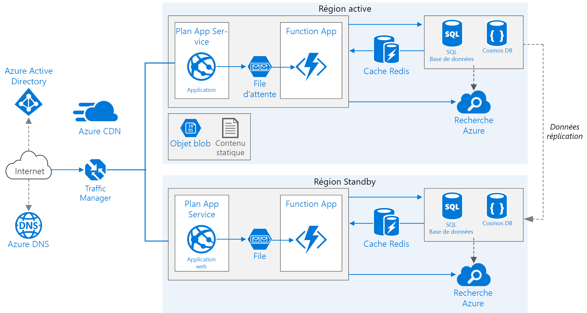

# <a name="run-a-web-application-in-multiple-regions"></a>Exécuter une application web dans plusieurs régions
[!INCLUDE [header](../../_includes/header.md)]

Cette architecture de référence indique comment exécuter une application Azure App Service dans plusieurs régions afin de bénéficier d’une haute disponibilité. 

 

*Téléchargez un [fichier Visio][visio-download] de cette architecture.*

## <a name="architecture"></a>Architecture 

Cette architecture repose sur celle illustrée dans l’article [Améliorer l’évolutivité dans une application web][guidance-web-apps-scalability]. Les principales différences entre ces deux architectures sont les suivantes :

* **Régions primaires et secondaires**. Cette architecture utilise deux régions pour garantir une meilleure disponibilité. L’application est déployée dans chaque région. Pendant les opérations normales, le trafic réseau est routé vers la région primaire. Si la région primaire n’est plus disponible, le trafic est routé vers la région secondaire. 
* **Azure DNS**. [Azure DNS][azure-dns] est un service d’hébergement pour les domaines DNS qui offre une résolution de noms à l’aide de l’infrastructure Microsoft Azure. En hébergeant vos domaines dans Azure, vous pouvez gérer vos enregistrements DNS avec les mêmes informations d’identification, les mêmes API, les mêmes outils et la même facturation que vos autres services Azure.
* **Azure Traffic Manager**. [Traffic Manager][traffic-manager] route les demandes entrantes vers la région primaire. Si l’application qui s’exécute dans cette région n’est plus disponible, Traffic Manager bascule vers la région secondaire.
* **Géoréplication** de SQL Database et de Cosmos DB. 

Une architecture multirégion peut offrir une meilleure disponibilité qu’un déploiement dans une seule région. Si une interruption de service régionale affecte la région primaire, vous pouvez utiliser [Traffic Manager][traffic-manager] pour basculer vers la région secondaire. Cette architecture peut également se révéler utile en cas de défaillance d’un sous-système spécifique de l’application.

Plusieurs approches générales permettent de bénéficier d’une haute disponibilité dans l’ensemble des régions : 

* Mode actif/passif avec serveur de secours. Le trafic est dirigé vers une région, tandis que l’autre région est en attente sur le serveur de secours. Le terme « serveur de secours » signifie que les machines virtuelles de la région secondaire sont allouées et en cours d’exécution en permanence.
* Mode actif/passif avec reprise progressive. Le trafic est dirigé vers une région, tandis que l’autre région est en attente sur le centre de données de reprise progressive. Le terme « reprise progressive » signifie que les machines virtuelles de la région secondaire ne sont pas allouées tant qu’elles ne sont pas requises pour le basculement. La mise en œuvre de cette approche se révèle moins coûteuse, mais nécessite davantage de temps en cas de défaillance.
* Mode actif/actif. Les deux régions sont actives, et la charge de travail des requêtes est équilibrée entre les régions. Si l’une des régions n’est plus disponible, elle est mise hors service. 

Cette architecture de référence est axée sur le mode actif/passif avec serveur de secours, et utilise Traffic Manager pour le basculement. 


## <a name="recommendations"></a>Recommandations

Vos exigences peuvent différer de celles de l’architecture décrite ici. Utilisez les recommandations de cette section comme point de départ.

### <a name="regional-pairing"></a>Association régionale
Chaque région Azure est associée à une autre région de la même zone géographique. En général, choisissez des régions de la même paire régionale (par exemple, USA Est 2 et USA Centre). Cette approche offre les avantages suivants :

* Dans l’éventualité d’une interruption de service générale, la récupération d’au moins une région de chaque paire est prioritaire.
* Les mises à jour planifiées du système Azure sont déployées dans les régions associées de manière séquentielle afin de minimiser les temps d’arrêt possibles.
* Dans la plupart des cas, les paires régionales appartiennent à la même zone géographique afin de répondre aux exigences en matière de résidence des données.

Toutefois, assurez-vous que les deux régions prennent en charge tous les services Azure requis pour votre application. Consultez la page répertoriant les [services par région][services-by-region]. Pour plus d’informations sur les paires régionales, consultez l’article [Continuité des activités et récupération d’urgence (BCDR) : régions jumelées d’Azure][regional-pairs].

### <a name="resource-groups"></a>Groupes de ressources
Envisagez de placer la région primaire, la région secondaire et Traffic Manager dans des [groupes de ressources][resource groups] distincts. Cette approche vous permet de gérer les ressources déployées dans chaque région sous la forme d’une collection unique.

### <a name="traffic-manager-configuration"></a>Configuration de Traffic Manager 

**Routage**. Traffic Manager prend en charge plusieurs [algorithmes de routage][tm-routing]. Pour le scénario décrit dans cet article, utilisez le routage *par priorité* (auparavant désigné sous le terme de routage *par basculement*). Lorsque cette méthode de routage est configurée, Traffic Manager envoie toutes les requêtes à la région primaire, sauf si le point de terminaison de cette région devient inaccessible. Dans ce dernier cas, les requêtes basculent automatiquement vers la région secondaire. Consultez [Configurer la méthode de routage de basculement][tm-configure-failover].

**Sonde d’intégrité**. Traffic Manager utilise une sonde HTTP (ou HTTPS) pour surveiller la disponibilité de chaque point de terminaison. Cette sonde offre à Traffic Manager un test de réussite/échec pour le basculement vers la région secondaire. Elle envoie une requête à un chemin d’URL spécifié. Si la sonde obtient une réponse autre que 200 dans le délai d’expiration imparti, elle échoue. Après quatre échecs de requêtes, Traffic Manager marque le point de terminaison comme détérioré et bascule vers l’autre point de terminaison. Pour plus d’informations, consultez l’article [Surveillance et basculement des points de terminaison Traffic Manager][tm-monitoring].

Une bonne pratique consiste à créer un point de terminaison de sonde d’intégrité qui signale l’intégrité globale de l’application et à utiliser ce point de terminaison pour la sonde d’intégrité. Le point de terminaison doit vérifier les dépendances critiques telles que les applications App Service, la file d’attente de stockage et SQL Database. Dans le cas contraire, la sonde risque de signaler un point de terminaison intègre alors que des parties critiques de l’application sont défaillantes.

En revanche, n’utilisez pas la sonde d’intégrité pour vérifier des services de priorité inférieure. Par exemple, si un service de messagerie tombe en panne, l’application peut basculer vers un second fournisseur ou simplement différer l’envoi des e-mails. Cette situation n’est pas suffisamment prioritaire pour entraîner le basculement de l’application. Pour plus d’informations, consultez [Modèle de surveillance de point de terminaison d’intégrité][health-endpoint-monitoring-pattern].
 
### <a name="sql-database"></a>Base de données SQL
Utilisez la [géoréplication active][sql-replication] pour créer un réplica secondaire lisible dans une autre région. Vous pouvez posséder jusqu’à quatre réplicas secondaires lisibles. Basculez vers une base de données secondaire si votre base de données primaire est défaillante ou doit être mise hors connexion. La géoréplication active peut être configurée pour toute base de données faisant partie d’un pool de bases de données élastique.

### <a name="cosmos-db"></a>Cosmos DB
Cosmos DB prend en charge la géoréplication entre régions. L’une des régions est désignée comme étant accessible en écriture, tandis que les autres régions sont des réplicas en lecture seule.

Dans l’éventualité d’une interruption de service régionale, vous pouvez procéder à un basculement en désignant une autre région comme étant accessible en écriture. Le Kit de développement logiciel (SDK) client envoie automatiquement des requêtes d’écriture à la région accessible en écriture ; vous n’avez donc pas besoin de mettre à jour la configuration du client après un basculement. Pour en savoir plus, voir [Comment distribuer des données mondialement avec Azure Cosmos DB][cosmosdb-geo].

> [!NOTE]
> Tous les réplicas appartiennent au même groupe de ressources.
>
>

### <a name="storage"></a>Stockage
Pour le service Stockage Azure, utilisez un [stockage géographiquement redondant avec accès en lecture][ra-grs] (RA-GRS). Dans le cadre d’un stockage RA-GRS, les données sont répliquées vers une région secondaire. Vous disposez d’un accès en lecture seule aux données de la région secondaire par le biais d’un point de terminaison distinct. En cas d’interruption de service régionale ou de situation d’urgence, l’équipe Stockage Azure peut décider de procéder à un basculement géographique vers la région secondaire. Ce basculement ne nécessite aucune action de la part du client.

Pour le service Stockage File d’attente, créez une file d’attente de sauvegarde dans la région secondaire. Pendant le basculement, l’application peut utiliser la file d’attente de sauvegarde jusqu’à ce que la région primaire redevienne disponible. De cette façon, l’application peut continuer à traiter les nouvelles requêtes.

## <a name="availability-considerations"></a>Considérations relatives à la disponibilité


### <a name="traffic-manager"></a>Traffic Manager

Traffic Manager procède à un basculement automatique si la région primaire n’est plus disponible. Lors de ce basculement, l’application reste inaccessible au client pendant un certain laps de temps. Cette durée dépend des facteurs suivants :

* La sonde d’intégrité doit détecter que le centre de données principal est devenu inaccessible.
* Les serveurs DNS (Domain Name Service) doivent mettre à jour les enregistrements DNS mis en cache pour l’adresse IP, qui dépend de la durée de vie (TTL) DNS. La valeur TTL par défaut est de 300 secondes (5 minutes), mais vous pouvez configurer cette valeur lorsque vous créez le profil Traffic Manager.

Pour plus d’informations, consultez l’article [À propos de la surveillance avec Traffic Manager][tm-monitoring].

Traffic Manager est un point de défaillance possible dans le système. Si le service échoue, les clients ne peuvent plus accéder à votre application pendant le temps d’arrêt. Examinez le [Contrat de niveau de service (SLA) pour Traffic Manager][tm-sla] et déterminez si Traffic Manager peut à lui seul répondre à vos exigences métiers en matière de haute disponibilité. Si tel n’est pas le cas, envisagez d’ajouter une autre solution de gestion du trafic en guise de restauration automatique. Si le service Azure Traffic Manager échoue, modifiez vos enregistrements de nom canonique (CNAME) dans DNS pour les faire pointer vers l’autre service de gestion du trafic. Cette opération doit être effectuée manuellement, et votre application reste inaccessible tant que ces modifications DNS n’ont pas été propagées.

### <a name="sql-database"></a>Base de données SQL
L’objectif de point de récupération (RPO) et le temps de récupération estimé (ERT) pour SQL Database sont décrits dans l’article [Vue d’ensemble de la continuité de l’activité avec la base de données Azure SQL][sql-rpo]. 

### <a name="storage"></a>Stockage
Le stockage RA-GRS assure un stockage durable, mais il est important que vous compreniez ce qui peut se produire en cas d’interruption de service :

* Si le stockage cesse d’être disponible, les données ne vous sont plus accessibles en écriture pendant un certain laps de temps. Pendant l’interruption de service, vous pouvez continuer à lire les données à partir du point de terminaison secondaire.
* Si une interruption de service régionale ou une situation d’urgence affectent l’emplacement primaire et que les données ne sont pas récupérables, l’équipe Stockage Azure peut décider de procéder à un basculement géographique vers la région secondaire.
* La réplication des données vers la région secondaire est effectuée de manière asynchrone. Par conséquent, un basculement géographique peut occasionner une perte de données si ces données ne sont pas récupérables à partir de la région primaire.
* Les défaillances passagères, telles qu’une indisponibilité du réseau, n’entraînent pas un basculement du stockage. Concevez votre application de façon à la rendre résistante aux défaillances passagères. Les méthodes d’atténuation des risques possibles sont les suivantes :
  
  * lecture à partir de la région secondaire ;
  * basculement temporaire vers un autre compte de stockage pour les nouvelles opérations d’écriture (par exemple, pour la mise en file d’attente des messages) ;
  * copie des données de la région secondaire vers un autre compte de stockage ;
  * fourniture de fonctionnalités réduites jusqu’à la restauration automatique du système.

Pour plus d’informations, consultez l’article [Que faire en cas de panne du stockage Azure][storage-outage].

## <a name="manageability-considerations"></a>Considérations relatives à la facilité de gestion

### <a name="traffic-manager"></a>Traffic Manager

En cas de basculement de Traffic Manager, nous vous recommandons de procéder à une restauration manuelle plutôt que d’implémenter une restauration automatique. Dans le cas contraire, l’application risque d’alterner continuellement entre les régions. Vérifiez que tous les sous-systèmes de l’application sont intègres avant d’effectuer la restauration automatique.

Notez que Traffic Manager procède à une restauration automatique par défaut. Pour éviter cela, diminuez manuellement la priorité de la région primaire après un événement de basculement. Par exemple, supposez que la région primaire a la priorité 1, et que la base de données secondaire a la priorité 2. Après un basculement, définissez la priorité de la région primaire sur la valeur 3 afin d’empêcher la restauration automatique. Lorsque vous êtes prêt à rebasculer vers cette région, redéfinissez sa priorité sur la valeur 1.

Les commandes permettant de mettre à jour la priorité sont indiquées ci-après.

**PowerShell**

```bat
$endpoint = Get-AzureRmTrafficManagerEndpoint -Name <endpoint> -ProfileName <profile> -ResourceGroupName <resource-group> -Type AzureEndpoints
$endpoint.Priority = 3
Set-AzureRmTrafficManagerEndpoint -TrafficManagerEndpoint $endpoint
```

Pour plus d’informations, consultez l’article [Applets de commande Azure Traffic Manager][tm-ps].

**Interface de ligne de commande Azure (CLI)**

```bat
azure network traffic-manager endpoint set --name <endpoint> --profile-name <profile> --resource-group <resource-group> --type AzureEndpoints --priority 3
```    

### <a name="sql-database"></a>Base de données SQL
Si la base de données primaire est défaillante, effectuez un basculement manuel vers la base de données secondaire. Consultez l’article [Restaurer une base de données SQL Azure ou basculer vers une base de données secondaire][sql-failover]. La base de données secondaire reste en lecture seule jusqu’à ce que vous basculiez vers cette dernière.


<!-- links -->

[azure-sql-db]: https://azure.microsoft.com/documentation/services/sql-database/
[azure-dns]: /azure/dns/dns-overview
[cosmosdb-geo]: /azure/cosmos-db/distribute-data-globally
[guidance-web-apps-scalability]: ./scalable-web-app.md
[health-endpoint-monitoring-pattern]: https://msdn.microsoft.com/library/dn589789.aspx
[ra-grs]: /azure/storage/storage-redundancy#read-access-geo-redundant-storage
[regional-pairs]: /azure/best-practices-availability-paired-regions
[resource groups]: /azure/azure-resource-manager/resource-group-overview#resource-groups
[services-by-region]: https://azure.microsoft.com/regions/#services
[sql-failover]: /azure/sql-database/sql-database-disaster-recovery
[sql-replication]: /azure/sql-database/sql-database-geo-replication-overview
[sql-rpo]: /azure/sql-database/sql-database-business-continuity#sql-database-features-that-you-can-use-to-provide-business-continuity
[storage-outage]: /azure/storage/storage-disaster-recovery-guidance
[tm-configure-failover]: /azure/traffic-manager/traffic-manager-configure-failover-routing-method
[tm-monitoring]: /azure/traffic-manager/traffic-manager-monitoring
[tm-ps]: /powershell/module/azurerm.trafficmanager
[tm-routing]: /azure/traffic-manager/traffic-manager-routing-methods
[tm-sla]: https://azure.microsoft.com/support/legal/sla/traffic-manager/v1_0/
[traffic-manager]: https://azure.microsoft.com/services/traffic-manager/
[visio-download]: https://archcenter.blob.core.windows.net/cdn/app-service-reference-architectures.vsdx
