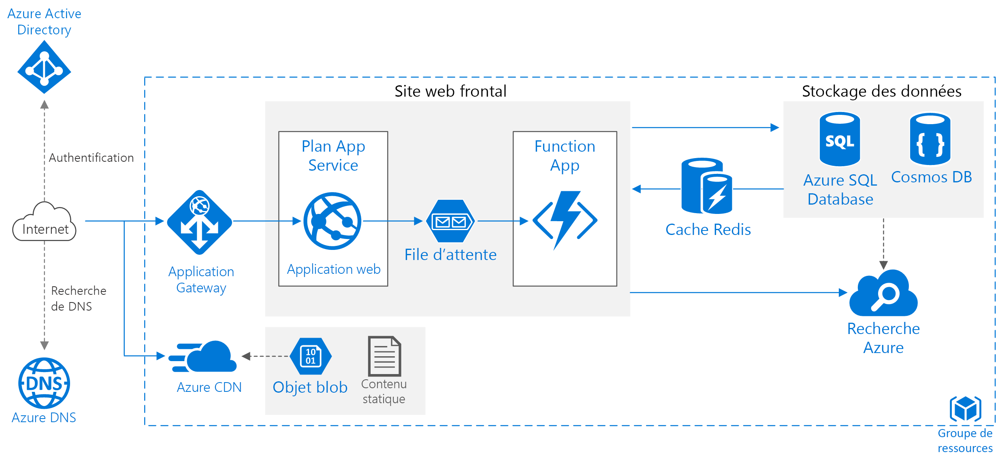

# Améliorer la scalabilité dans une application web AzureImprove scalability in an Azure web application

Cette architecture de référence présente des pratiques éprouvées pour améliorer la scalabilité et le niveau de performance d’une application web Azure App Service.This reference architecture shows proven practices for improving scalability and performance in an Azure App Service web application.

*Téléchargez un [fichier Visio][visio-download] de cette architecture.**Download a [Visio file][visio-download] of this architecture.*

## ArchitectureArchitecture

Cette architecture repose sur celle décrite dans l’article [Application web de base][basic-web-app].This architecture builds on the one shown in [Basic web application][basic-web-app]. Ses composants sont les suivants :It includes the following components:

- **Groupe de ressources**.**Resource group**. Un [groupe de ressources][resource-group] est un conteneur logique pour les ressources Azure.A [resource group][resource-group] is a logical container for Azure resources.
- **[Application web][app-service-web-app]**.**[Web app][app-service-web-app]**. Une application moderne classique peut inclure un site web et une ou plusieurs API web RESTful.A typical modern application might include both a website and one or more RESTful web APIs. Une API web peut être consommée par les clients de navigateur par le biais d’AJAX, par les applications clientes natives ou par les applications côté serveur.A web API might be consumed by browser clients through AJAX, by native client applications, or by server-side applications. Pour des considérations sur la conception d’API web, consultez [Guide de conception d’API][api-guidance].For considerations on designing web APIs, see [API design guidance][api-guidance].
- **Function App**.**Function App**. Utilisez les [applications de fonction][functions] pour exécuter des tâches en arrière-plan.Use [Function Apps][functions] to run background tasks. Les fonctions sont appelées par un déclencheur, comme un événement de minuteur ou un message placé dans la file d’attente.Functions are invoked by a trigger, such as a timer event or a message being placed on queue. Pour les tâches avec état s’exécutant sur le long terme, utilisez [Durable Functions][durable-functions].For long-running stateful tasks, use [Durable Functions][durable-functions].
- **File d’attente**.**Queue**. Dans l’architecture illustrée ici, l’application met en file d’attente des tâches exécutées en arrière-plan en plaçant un message dans la file d’attente [Stockage File d’attente Azure][queue-storage].In the architecture shown here, the application queues background tasks by putting a message onto an [Azure Queue storage][queue-storage] queue. Le message déclenche une application de fonction.The message triggers a function app. Vous pouvez également utiliser des files d’attente Service Bus.Alternatively, you can use Service Bus queues. Pour obtenir une comparaison, consultez [Files d’attente Azure et files d’attente Service Bus : comparaison et différences][queues-compared].For a comparison, see [Azure Queues and Service Bus queues - compared and contrasted][queues-compared].
- **Cache**.**Cache**. Stockez les données semi-statiques dans [Cache Redis Azure][azure-redis].Store semi-static data in [Azure Redis Cache][azure-redis].
- **CDN**.**CDN**. Utilisez [Azure Content Delivery Network][azure-cdn] (CDN) pour mettre en cache le contenu disponible publiquement afin de réduire la latence et d’accélérer la remise du contenu.Use [Azure Content Delivery Network][azure-cdn] (CDN) to cache publicly available content for lower latency and faster delivery of content.
- **Stockage des données**.**Data storage**. Utilisez [Azure SQL Database][sql-db] pour les données relationnelles.Use [Azure SQL Database][sql-db] for relational data. Pour les données non relationnelles, utilisez plutôt [Cosmos DB][cosmosdb].For non-relational data, consider [Cosmos DB][cosmosdb].
- **Recherche Azure**.**Azure Search**. Utilisez [Recherche Azure][azure-search] pour ajouter des fonctionnalités de recherche telles que les suggestions de recherche, la recherche partielle et la recherche spécifique à une langue.Use [Azure Search][azure-search] to add search functionality such as search suggestions, fuzzy search, and language-specific search. Recherche Azure est généralement utilisé conjointement avec un autre magasin de données, surtout si le magasin de données principal requiert la cohérence stricte.Azure Search is typically used in conjunction with another data store, especially if the primary data store requires strict consistency. Dans cette approche, stockez les données faisant autorité dans l’autre magasin de données et l’index de recherche dans Recherche Azure.In this approach, store authoritative data in the other data store and the search index in Azure Search. Recherche Azure peut également servir à consolider un index de recherche unique à partir de plusieurs magasins de données.Azure Search can also be used to consolidate a single search index from multiple data stores.
- **Azure DNS**.**Azure DNS**. [Azure DNS][azure-dns] est un service d’hébergement pour les domaines DNS qui offre une résolution de noms à l’aide de l’infrastructure Microsoft Azure.[Azure DNS][azure-dns] is a hosting service for DNS domains, providing name resolution using Microsoft Azure infrastructure. En hébergeant vos domaines dans Azure, vous pouvez gérer vos enregistrements DNS avec les mêmes informations d’identification, les mêmes API, les mêmes outils et la même facturation que vos autres services Azure.By hosting your domains in Azure, you can manage your DNS records using the same credentials, APIs, tools, and billing as your other Azure services.
- **Passerelle d’application**.**Application gateway**. [Application Gateway](/azure/application-gateway/) est un équilibreur de charge de couche 7.[Application Gateway](/azure/application-gateway/) is a layer 7 load balancer. Dans cette architecture, il achemine les requêtes HTTP vers le serveur web frontal.In this architecture, it routes HTTP requests to the web front end. La passerelle Application Gateway fournit également un [pare-feu d’applications web](/azure/application-gateway/waf-overview) (WAF) qui protège l’application contre les vulnérabilités et exploitations courantes.Application Gateway also provides a [web application firewall](/azure/application-gateway/waf-overview) (WAF) that protects the application from common exploits and vulnerabilities.

## RecommandationsRecommendations

Vos exigences peuvent différer de celles de l’architecture décrite ici.Your requirements might differ from the architecture described here. Utilisez les recommandations de cette section comme point de départ.Use the recommendations in this section as a starting point.

### Applications App ServiceApp Service apps

Nous vous recommandons de créer l’application web et l’API web en tant qu’applications App Service distinctes.We recommend creating the web application and the web API as separate App Service apps. Vous pouvez ainsi les exécuter dans des plans App Service distincts et donc les mettre à l’échelle indépendamment l’une de l’autre.This design lets you run them in separate App Service plans so they can be scaled independently. Si vous n’avez pas besoin de ce niveau de scalabilité dès le départ, vous pouvez déployer les applications sur le même plan et les déplacer ultérieurement dans des plans distincts si cela est nécessaire.If you don't need that level of scalability initially, you can deploy the apps into the same plan and move them into separate plans later if necessary.

> [!NOTE]
> Pour les plans De base, Standard et Premium, vous êtes facturé pour les instances de machine virtuelle dans le plan, pas par application.For the Basic, Standard, and Premium plans, you are billed for the VM instances in the plan, not per app. Consultez [Tarification App Service][app-service-pricing].See [App Service Pricing][app-service-pricing]
>

### CacheCache

Vous pouvez améliorer le niveau de performance et la scalabilité en utilisant [Cache Redis Azure][azure-redis] pour mettre en cache des données.You can improve performance and scalability by using [Azure Redis Cache][azure-redis] to cache some data. Envisagez d’utiliser Cache Redis pour :Consider using Redis Cache for:

- Les données de transaction semi-statiques.Semi-static transaction data.
- L’état de la session.Session state.
- La sortie HTML.HTML output. Cela peut être utile dans les applications qui restituent une sortie HTML complexe.This can be useful in applications that render complex HTML output.

Pour plus d’informations sur la conception d’une stratégie de mise en cache, consultez [Conseils sur la mise en cache][caching-guidance].For more detailed guidance on designing a caching strategy, see [Caching guidance][caching-guidance].

### CDNCDN

Utilisez [Azure CDN][azure-cdn] pour mettre en cache du contenu statique.Use [Azure CDN][azure-cdn] to cache static content. L’avantage principal d’un CDN est qu’il réduit la latence pour l’utilisateur ; en effet, le contenu est mis en cache sur un serveur Edge de périphérie qui est géographiquement proche de l’utilisateur.The main benefit of a CDN is to reduce latency for users, because content is cached at an edge server that is geographically close to the user. CDN peut également réduire la charge qui pèse sur l’application, car ce trafic n’est pas géré par l’application.CDN can also reduce load on the application, because that traffic is not being handled by the application.

Si votre application se compose principalement de pages statiques, envisagez d’utiliser [CDN pour mettre en cache la totalité de l’application][cdn-app-service].If your app consists mostly of static pages, consider using [CDN to cache the entire app][cdn-app-service]. Sinon, placez le contenu statique, tel que les images, les feuilles de style en cascade et les fichiers HTML, dans [Stockage Azure et utilisez CDN pour mettre en cache ces fichiers][cdn-storage-account].Otherwise, put static content such as images, CSS, and HTML files, into [Azure Storage and use CDN to cache those files][cdn-storage-account].

> [!NOTE]
> Azure CDN ne peut pas servir du contenu qui nécessite une authentification.Azure CDN cannot serve content that requires authentication.
>

Pour plus d’informations, consultez [Aide relative au réseau de distribution de contenu (CDN)][cdn-guidance].For more detailed guidance, see [Content Delivery Network (CDN) guidance][cdn-guidance].

### StockageStorage

Les applications modernes traitent souvent de grandes quantités de données.Modern applications often process large amounts of data. Afin de trouver une bonne adaptation pour le cloud, il est important de choisir le type de stockage adéquat.In order to scale for the cloud, it's important to choose the right storage type. Voici quelques recommandations de base :Here are some baseline recommendations.

| Éléments à stockerWhat you want to store | ExemplesExample | Stockage recommandéRecommended storage |
| --- | --- | --- |
| FichiersFiles |Images, documents, fichiers PDFImages, documents, PDFs |un stockage Azure BlobAzure Blob Storage |
| Paires clé/valeurKey/Value pairs |Données de profil utilisateur recherchées par ID d’utilisateurUser profile data looked up by user ID |Stockage de tables AzureAzure Table storage |
| Messages courts destinés à déclencher un traitement supplémentaireShort messages intended to trigger further processing |Demandes de commandeOrder requests |Stockage File d’attente Azure, file d’attente Service Bus ou rubrique Service BusAzure Queue storage, Service Bus queue, or Service Bus topic |
| Données non relationnelles avec un schéma flexible nécessitant une interrogation de baseNon-relational data with a flexible schema requiring basic querying |Catalogue produitsProduct catalog |Base de données de document, comme Azure Cosmos DB, MongoDB ou Apache CouchDBDocument database, such as Azure Cosmos DB, MongoDB, or Apache CouchDB |
| Données relationnelles nécessitant une prise en charge des requêtes enrichie, un schéma strict et/ou une cohérence forteRelational data requiring richer query support, strict schema, and/or strong consistency |Inventaire de produitsProduct inventory |Azure SQL DatabaseAzure SQL Database |

Voir [Choisir le magasin de données correct][datastore].See [Choose the right data store][datastore].

## Considérations relatives à l’extensibilitéScalability considerations

Le principal avantage de Azure App Service est la possibilité de mettre à l’échelle votre application en fonction de la charge.A major benefit of Azure App Service is the ability to scale your application based on load. Voici quelques considérations à prendre en compte pendant la planification de la mise à l’échelle de votre application.Here are some considerations to keep in mind when planning to scale your application.

### application App ServiceApp Service app

Si votre solution inclut plusieurs applications App Service, envisagez de les déployer sur des plans App Service distincts.If your solution includes several App Service apps, consider deploying them to separate App Service plans. Cette approche vous permet de les mettre à l’échelle indépendamment, car elles s’exécutent sur des instances distinctes.This approach enables you to scale them independently because they run on separate instances.

De même, envisagez de placer une application de fonction dans son propre plan afin que les tâches en arrière-plan ne s’exécutent pas sur les instances qui gèrent les requêtes HTTP.Similarly, consider putting a function app into its own plan so that background tasks don't run on the same instances that handle HTTP requests. Si les tâches en arrière-plan s’exécutent par intermittence, envisagez d’utiliser un [plan de consommation][functions-consumption-plan] facturé en fonction du nombre d’exécutions, et non du nombre d’heures.If background tasks run intermittently, consider using a [consumption plan][functions-consumption-plan], which is billed based on the number of executions, rather than hourly.

### Base de données SQLSQL Database

Augmentez la scalabilité d’une base de données SQL en *partitionnant* celle-ci.Increase scalability of a SQL database by *sharding* the database. Le partitionnement fait référence au partitionnement horizontal de la base de données.Sharding refers to partitioning the database horizontally. Le partitionnement vous permet de faire évoluer horizontalement la base de données à l’aide [d’outils de base de données élastique][sql-elastic].Sharding allows you to scale out the database horizontally using [Elastic Database tools][sql-elastic]. Les avantages du partitionnement peuvent être les suivants :Potential benefits of sharding include:

- Meilleur débit de transactions.Better transaction throughput.
- Les requêtes peuvent s’exécuter plus rapidement sur un sous-ensemble des données.Queries can run faster over a subset of the data.

### Recherche AzureAzure Search

Recherche Azure supprime la surcharge liées aux recherches de données complexes à partir du magasin de données principal, et peut évoluer pour gérer la charge.Azure Search removes the overhead of performing complex data searches from the primary data store, and it can scale to handle load. Consultez [Mettre à l’échelle les niveaux de ressources pour interroger et indexer les charges de travail dans Recherche Azure][azure-search-scaling].See [Scale resource levels for query and indexing workloads in Azure Search][azure-search-scaling].

## Considérations relatives à la sécuritéSecurity considerations

Cette section répertorie les considérations relatives à la sécurité qui sont spécifiques aux services Azure décrits dans cet article.This section lists security considerations that are specific to the Azure services described in this article. Il ne s’agit pas d’une liste complète de bonnes pratiques relatives à la sécurité.It's not a complete list of security best practices. Pour certaines considérations supplémentaires relatives à la sécurité, consultez [Sécuriser une application dans Azure App Service][app-service-security].For some additional security considerations, see [Secure an app in Azure App Service][app-service-security].

### Partage des ressources cross-origin (CORS)Cross-Origin Resource Sharing (CORS)

Si vous créez un site web et une API en tant qu’applications distinctes, le site web ne peut pas effectuer d’appels AJAX côté client à l’API, sauf si vous activez CORS.If you create a website and web API as separate apps, the website cannot make client-side AJAX calls to the API unless you enable CORS.

> [!NOTE]
> La sécurité des navigateurs empêche une page web d’adresser des demandes AJAX à un autre domaine.Browser security prevents a web page from making AJAX requests to another domain. Cette restriction est appelée stratégie de même origine et empêche un site malveillant de lire des données sensibles à partir d’un autre site.This restriction is called the same-origin policy, and prevents a malicious site from reading sentitive data from another site. CORS est une norme W3C qui permet à un serveur d’assouplir la stratégie de même origine et d’autoriser certaines requêtes cross-origin tout en en rejetant d’autres.CORS is a W3C standard that allows a server to relax the same-origin policy and allow some cross-origin requests while rejecting others.
>

App Services prend en charge CORS, sans que vous ayez besoin d’écrire un code d’application.App Services has built-in support for CORS, without needing to write any application code. Consultez [Consommer une application API à partir de JavaScript à l’aide de CORS][cors].See [Consume an API app from JavaScript using CORS][cors]. Ajoutez le site web à la liste des origines autorisées pour l’API.Add the website to the list of allowed origins for the API.

### Chiffrement de la base de données SQLSQL Database encryption

Utilisez [Transparent Data Encryption][sql-encryption] si vous avez besoin de chiffrer les données au repos dans la base de données.Use [Transparent Data Encryption][sql-encryption] if you need to encrypt data at rest in the database. Cette fonctionnalité effectue le chiffrement et le déchiffrement en temps réel d’une base de données entière (y compris les sauvegardes et les fichiers journaux des transactions) et ne nécessite aucune modification de l’application.This feature performs real-time encryption and decryption of an entire database (including backups and transaction log files) and requires no changes to the application. Le chiffrement étant source de latence, il est judicieux de placer les données à sécuriser dans leur propre base de données et d’activer le chiffrement uniquement pour cette base de données.Encryption does add some latency, so it's a good practice to separate the data that must be secure into its own database and enable encryption only for that database.

<!-- links -->

[api-guidance]: ../../best-practices/api-design.md
[app-service-security]: /azure/app-service-web/web-sites-security
[app-service-web-app]: /azure/app-service-web/app-service-web-overview
[app-service-api-app]: /azure/app-service-api/app-service-api-apps-why-best-platform
[app-service-pricing]: https://azure.microsoft.com/pricing/details/app-service/
[azure-cdn]: https://azure.microsoft.com/services/cdn/
[azure-dns]: /azure/dns/dns-overview
[azure-redis]: https://azure.microsoft.com/services/cache/
[azure-search]: /azure/search
[azure-search-scaling]: /azure/search/search-capacity-planning
[basic-web-app]: basic-web-app.md
[basic-web-app-scalability]: basic-web-app.md#scalability-considerations
[caching-guidance]: ../../best-practices/caching.md
[cdn-app-service]: /azure/app-service-web/cdn-websites-with-cdn
[cdn-storage-account]: /azure/cdn/cdn-create-a-storage-account-with-cdn
[cdn-guidance]: ../../best-practices/cdn.md
[cors]: /azure/app-service-api/app-service-api-cors-consume-javascript
[cosmosdb]: /azure/cosmos-db/
[datastore]: ../..//guide/technology-choices/data-store-overview.md
[durable-functions]: /azure/azure-functions/durable-functions-overview
[functions]: /azure/azure-functions/functions-overview
[functions-consumption-plan]: /azure/azure-functions/functions-scale#consumption-plan
[queue-storage]: /azure/storage/storage-dotnet-how-to-use-queues
[queues-compared]: /azure/service-bus-messaging/service-bus-azure-and-service-bus-queues-compared-contrasted
[resource-group]: /azure/azure-resource-manager/resource-group-overview#resource-groups
[sql-db]: /azure/sql-database/
[sql-elastic]: /azure/sql-database/sql-database-elastic-scale-introduction
[sql-encryption]: https://msdn.microsoft.com/library/dn948096.aspx
[tm]: https://azure.microsoft.com/services/traffic-manager/
[visio-download]: https://archcenter.blob.core.windows.net/cdn/app-service-reference-architectures.vsdx
[web-app-multi-region]: ./multi-region.md
