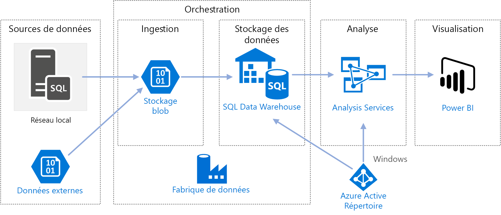
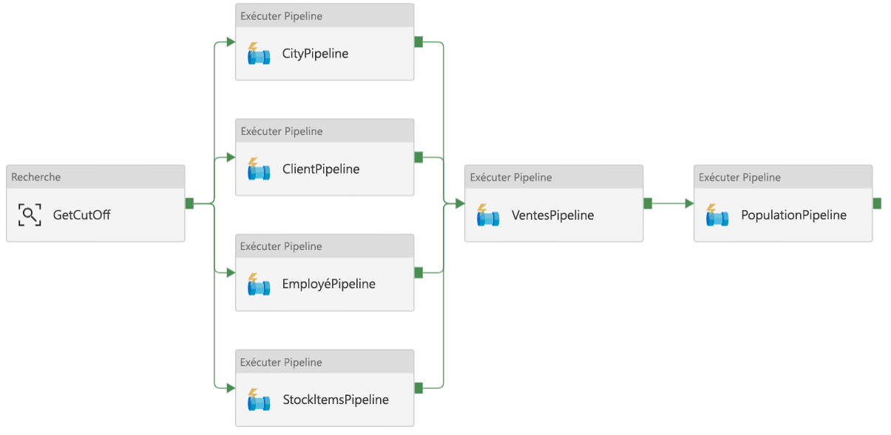
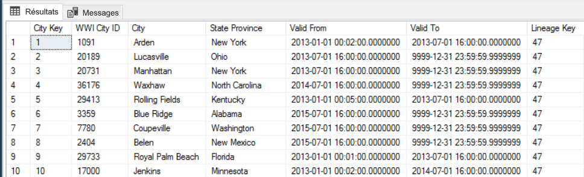
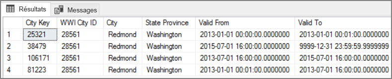
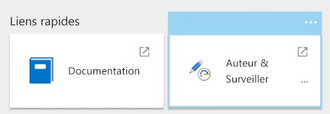
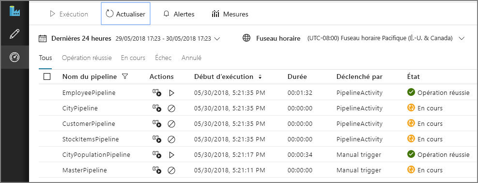
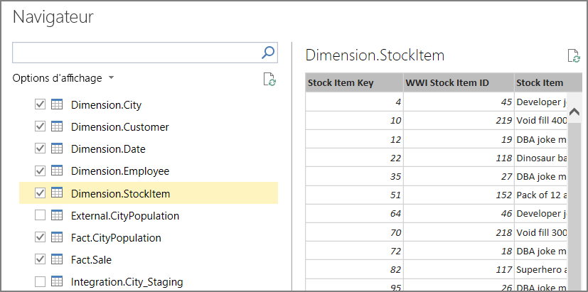
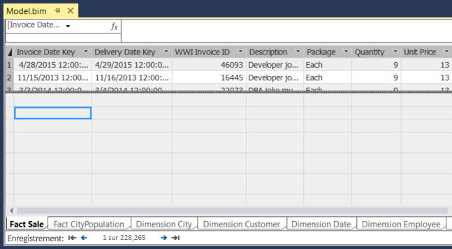
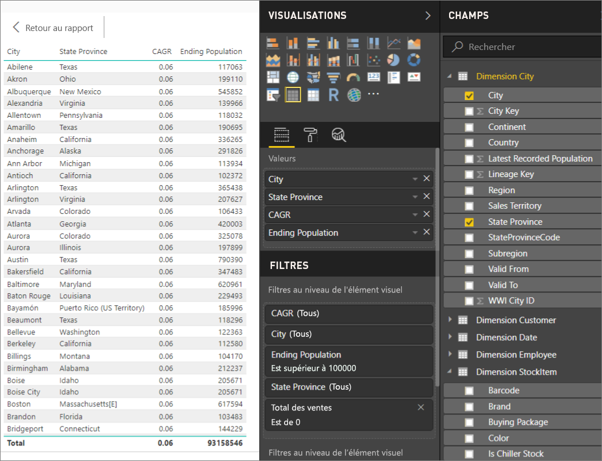

# <a name="automated-enterprise-bi-with-sql-data-warehouse-and-azure-data-factory"></a><span data-ttu-id="02227-103">BI d’entreprise automatisée avec SQL Data Warehouse et Azure Data Factory</span><span class="sxs-lookup"><span data-stu-id="02227-103">Automated enterprise BI with SQL Data Warehouse and Azure Data Factory</span></span>

<span data-ttu-id="02227-104">Cette architecture de référence indique comment effectuer un chargement incrémentiel dans un pipeline [ELT](../../data-guide/relational-data/etl.md#extract-load-and-transform-elt) (Extract-Load-Transform).</span><span class="sxs-lookup"><span data-stu-id="02227-104">This reference architecture shows how to perform incremental loading in an [ELT](../../data-guide/relational-data/etl.md#extract-load-and-transform-elt) (extract-load-transform) pipeline.</span></span> <span data-ttu-id="02227-105">Elle utilise Azure Data Factory pour automatiser le pipeline ELT.</span><span class="sxs-lookup"><span data-stu-id="02227-105">It uses Azure Data Factory to automate the ELT pipeline.</span></span> <span data-ttu-id="02227-106">Ce pipeline déplace de façon incrémentielle les données OLTP les plus récentes d’une base de données SQL Server locale vers une instance SQL Data Warehouse.</span><span class="sxs-lookup"><span data-stu-id="02227-106">The pipeline incrementally moves the latest OLTP data from an on-premises SQL Server database into SQL Data Warehouse.</span></span> <span data-ttu-id="02227-107">Les données transactionnelles sont transformées en un modèle tabulaire à des fins d’analyse.</span><span class="sxs-lookup"><span data-stu-id="02227-107">Transactional data is transformed into a tabular model for analysis.</span></span> [<span data-ttu-id="02227-108">**Déployez cette solution**.</span><span class="sxs-lookup"><span data-stu-id="02227-108">**Deploy this solution**.</span></span>](#deploy-the-solution)



<span data-ttu-id="02227-109">Cette architecture repose sur celle qui est décrite dans la section [Enterprise BI avec SQL Data Warehouse](./enterprise-bi-sqldw.md), mais ajoute des fonctionnalités qui sont importantes pour les scénarios d’entreposage de données d’entreprise.</span><span class="sxs-lookup"><span data-stu-id="02227-109">This architecture builds on the one shown in [Enterprise BI with SQL Data Warehouse](./enterprise-bi-sqldw.md), but adds some features that are important for enterprise data warehousing scenarios.</span></span>

-   <span data-ttu-id="02227-110">Automatisation du pipeline à l’aide de Data Factory.</span><span class="sxs-lookup"><span data-stu-id="02227-110">Automation of the pipeline using Data Factory.</span></span>
-   <span data-ttu-id="02227-111">Chargement incrémentiel.</span><span class="sxs-lookup"><span data-stu-id="02227-111">Incremental loading.</span></span>
-   <span data-ttu-id="02227-112">Intégration de plusieurs sources de données.</span><span class="sxs-lookup"><span data-stu-id="02227-112">Integrating multiple data sources.</span></span>
-   <span data-ttu-id="02227-113">Chargement des données binaires comme les données géospatiales et les images.</span><span class="sxs-lookup"><span data-stu-id="02227-113">Loading binary data such as geospatial data and images.</span></span>

## <a name="architecture"></a><span data-ttu-id="02227-114">Architecture</span><span class="sxs-lookup"><span data-stu-id="02227-114">Architecture</span></span>

<span data-ttu-id="02227-115">L’architecture est constituée des composants suivants.</span><span class="sxs-lookup"><span data-stu-id="02227-115">The architecture consists of the following components.</span></span>

### <a name="data-sources"></a><span data-ttu-id="02227-116">Sources de données</span><span class="sxs-lookup"><span data-stu-id="02227-116">Data sources</span></span>

<span data-ttu-id="02227-117">**Serveur SQL Server local**.</span><span class="sxs-lookup"><span data-stu-id="02227-117">**On-premises SQL Server**.</span></span> <span data-ttu-id="02227-118">Les données source sont situées dans une base de données SQL Server locale.</span><span class="sxs-lookup"><span data-stu-id="02227-118">The source data is located in a SQL Server database on premises.</span></span> <span data-ttu-id="02227-119">Pour simuler l’environnement local, les scripts de déploiement de cette architecture approvisionnent une machine virtuelle dans Azure disposant de SQL Server.</span><span class="sxs-lookup"><span data-stu-id="02227-119">To simulate the on-premises environment, the deployment scripts for this architecture provision a virtual machine in Azure with SQL Server installed.</span></span> <span data-ttu-id="02227-120">[L’exemple de base de données OLTP Wide World Importers] [wwi] est utilisé comme base de données source.</span><span class="sxs-lookup"><span data-stu-id="02227-120">The [Wide World Importers OLTP sample database][wwi] is used as the source database.</span></span>

<span data-ttu-id="02227-121">**Données externes**.</span><span class="sxs-lookup"><span data-stu-id="02227-121">**External data**.</span></span> <span data-ttu-id="02227-122">Un scénario courant de gestion des entrepôts de données consiste à intégrer plusieurs sources de données.</span><span class="sxs-lookup"><span data-stu-id="02227-122">A common scenario for data warehouses is to integrate multiple data sources.</span></span> <span data-ttu-id="02227-123">Cette architecture de référence charge un jeu de données externe qui contient la population par ville et par année, et l’intègre dans les données de la base de données OLTP.</span><span class="sxs-lookup"><span data-stu-id="02227-123">This reference architecture loads an external data set that contains city populations by year, and integrates it with the data from the OLTP database.</span></span> <span data-ttu-id="02227-124">Vous pouvez utiliser ces données pour répondre à des questions du type : « La croissance des ventes dans chaque région correspond-elle, voire dépasse-t-elle la croissance de la population ? »</span><span class="sxs-lookup"><span data-stu-id="02227-124">You can use this data for insights such as: "Does sales growth in each region match or exceed population growth?"</span></span>

### <a name="ingestion-and-data-storage"></a><span data-ttu-id="02227-125">Ingestion et stockage de données</span><span class="sxs-lookup"><span data-stu-id="02227-125">Ingestion and data storage</span></span>

<span data-ttu-id="02227-126">**Stockage d'objets blob**.</span><span class="sxs-lookup"><span data-stu-id="02227-126">**Blob Storage**.</span></span> <span data-ttu-id="02227-127">Le stockage d’objets blob est utilisé en tant que zone de processus de site pour les données sources, avant leur chargement dans SQL Data Warehouse.</span><span class="sxs-lookup"><span data-stu-id="02227-127">Blob storage is used as a staging area for the source data before loading it into SQL Data Warehouse.</span></span>

<span data-ttu-id="02227-128">**Azure SQL Data Warehouse**.</span><span class="sxs-lookup"><span data-stu-id="02227-128">**Azure SQL Data Warehouse**.</span></span> <span data-ttu-id="02227-129">[SQL Data Warehouse](/azure/sql-data-warehouse/) est un système distribué conçu pour réaliser des analyses sur de grandes quantités de données.</span><span class="sxs-lookup"><span data-stu-id="02227-129">[SQL Data Warehouse](/azure/sql-data-warehouse/) is a distributed system designed to perform analytics on large data.</span></span> <span data-ttu-id="02227-130">Il prend en charge le traitement MPP (Massive Parallel Processing), le rendant ainsi adapté à l’exécution d’analyses hautes performances.</span><span class="sxs-lookup"><span data-stu-id="02227-130">It supports massive parallel processing (MPP), which makes it suitable for running high-performance analytics.</span></span> 

<span data-ttu-id="02227-131">**Azure Data Factory**.</span><span class="sxs-lookup"><span data-stu-id="02227-131">**Azure Data Factory**.</span></span> <span data-ttu-id="02227-132">[Data Factory] [adf] est un service géré qui orchestre et automatise le déplacement et la transformation des données.</span><span class="sxs-lookup"><span data-stu-id="02227-132">[Data Factory][adf] is a managed service that orchestrates and automates data movement and data transformation.</span></span> <span data-ttu-id="02227-133">Dans cette architecture, il coordonne les différentes étapes du processus ELT.</span><span class="sxs-lookup"><span data-stu-id="02227-133">In this architecture, it coordinates the various stages of the ELT process.</span></span>

### <a name="analysis-and-reporting"></a><span data-ttu-id="02227-134">Analyse et rapports</span><span class="sxs-lookup"><span data-stu-id="02227-134">Analysis and reporting</span></span>

<span data-ttu-id="02227-135">**Azure Analysis Services**.</span><span class="sxs-lookup"><span data-stu-id="02227-135">**Azure Analysis Services**.</span></span> <span data-ttu-id="02227-136">[Analysis Services](/azure/analysis-services/) est un service entièrement géré qui fournit des capacités de modélisation des données.</span><span class="sxs-lookup"><span data-stu-id="02227-136">[Analysis Services](/azure/analysis-services/) is a fully managed service that provides data modeling capabilities.</span></span> <span data-ttu-id="02227-137">Le modèle sémantique est chargé dans Analysis Services.</span><span class="sxs-lookup"><span data-stu-id="02227-137">The semantic model is loaded into Analysis Services.</span></span>

<span data-ttu-id="02227-138">**Power BI**.</span><span class="sxs-lookup"><span data-stu-id="02227-138">**Power BI**.</span></span> <span data-ttu-id="02227-139">Power BI est une suite d’outils d’analyse métier pour analyser les données et obtenir des informations métier.</span><span class="sxs-lookup"><span data-stu-id="02227-139">Power BI is a suite of business analytics tools to analyze data for business insights.</span></span> <span data-ttu-id="02227-140">Dans cette architecture, il demande le modèle sémantique stockée dans Analysis Services.</span><span class="sxs-lookup"><span data-stu-id="02227-140">In this architecture, it queries the semantic model stored in Analysis Services.</span></span>

### <a name="authentication"></a><span data-ttu-id="02227-141">Authentification</span><span class="sxs-lookup"><span data-stu-id="02227-141">Authentication</span></span>

<span data-ttu-id="02227-142">**Azure Active Directory** (Azure AD) authentifie les utilisateurs qui se connectent au serveur Analysis Services via Power BI.</span><span class="sxs-lookup"><span data-stu-id="02227-142">**Azure Active Directory** (Azure AD) authenticates users who connect to the Analysis Services server through Power BI.</span></span>

<span data-ttu-id="02227-143">Data Factory peut également utiliser Azure AD pour s’authentifier auprès de SQL Data Warehouse, en utilisant un principal de service ou une identité MSI (Managed Service Identity).</span><span class="sxs-lookup"><span data-stu-id="02227-143">Data Factory can use also use Azure AD to authenticate to SQL Data Warehouse, by using a service principal or Managed Service Identity (MSI).</span></span> <span data-ttu-id="02227-144">Par souci de simplicité, l’exemple de déploiement utilise l’authentification SQL Server.</span><span class="sxs-lookup"><span data-stu-id="02227-144">For simplicity, the example deployment uses SQL Server authentication.</span></span>

## <a name="data-pipeline"></a><span data-ttu-id="02227-145">Pipeline de données</span><span class="sxs-lookup"><span data-stu-id="02227-145">Data pipeline</span></span>

<span data-ttu-id="02227-146">Dans [Azure Data Factory] [adf], un pipeline est un regroupement logique d’activités qui permet de coordonner une tâche. Dans ce cas, il s’agit du chargement et de la transformation des données dans SQL Data Warehouse.</span><span class="sxs-lookup"><span data-stu-id="02227-146">In [Azure Data Factory][adf], a pipeline is a logical grouping of activities used to coordinate a task &mdash; in this case, loading and transforming data into SQL Data Warehouse.</span></span> 

<span data-ttu-id="02227-147">Cette architecture de référence définit un pipeline principal qui exécute une suite de pipelines enfants.</span><span class="sxs-lookup"><span data-stu-id="02227-147">This reference architecture defines a master pipeline that runs a sequence of child pipelines.</span></span> <span data-ttu-id="02227-148">Chaque pipeline enfant charge les données dans une ou plusieurs tables d’entrepôt de données.</span><span class="sxs-lookup"><span data-stu-id="02227-148">Each child pipeline loads data into one or more data warehouse tables.</span></span>



## <a name="incremental-loading"></a><span data-ttu-id="02227-149">Chargement incrémentiel</span><span class="sxs-lookup"><span data-stu-id="02227-149">Incremental loading</span></span>

<span data-ttu-id="02227-150">Lorsque vous exécutez un processus ETL ou ELT automatisé, il s’avère plus efficace de charger uniquement les données modifiées depuis l’exécution précédente.</span><span class="sxs-lookup"><span data-stu-id="02227-150">When you run an automated ETL or ELT process, it's most efficient to load only the data that changed since the previous run.</span></span> <span data-ttu-id="02227-151">Il s’agit d’un *chargement incrémentiel*, par opposition à un chargement complet, qui porte sur toutes les données.</span><span class="sxs-lookup"><span data-stu-id="02227-151">This is called an *incremental load*, as opposed to a full load that loads all of the data.</span></span> <span data-ttu-id="02227-152">Pour effectuer un chargement incrémentiel, vous avez besoin d’une méthode d’identification des données modifiées.</span><span class="sxs-lookup"><span data-stu-id="02227-152">To perform an incremental load, you need a way to identify which data has changed.</span></span> <span data-ttu-id="02227-153">L’approche la plus courante consiste à utiliser une valeur *limite supérieure*, qui se traduit par le suivi de la valeur la plus récente d’une colonne de la table source, soit une colonne DateHeure, soit une colonne d’entier unique.</span><span class="sxs-lookup"><span data-stu-id="02227-153">The most common approach is to use a *high water mark* value, which means tracking the latest value of some column in the source table, either a datetime column or a unique integer column.</span></span> 

<span data-ttu-id="02227-154">Depuis SQL Server 2016, vous pouvez utiliser des [tables temporelles](/sql/relational-databases/tables/temporal-tables).</span><span class="sxs-lookup"><span data-stu-id="02227-154">Starting with SQL Server 2016, you can use [temporal tables](/sql/relational-databases/tables/temporal-tables).</span></span> <span data-ttu-id="02227-155">Il s’agit de tables de système par version qui conservent un historique complet des modifications apportées aux données.</span><span class="sxs-lookup"><span data-stu-id="02227-155">These are system-versioned tables that keep a full history of data changes.</span></span> <span data-ttu-id="02227-156">Le moteur de base de données enregistre automatiquement l’historique de chaque modification dans une table d’historique distincte.</span><span class="sxs-lookup"><span data-stu-id="02227-156">The database engine automatically records the history of every change in a separate history table.</span></span> <span data-ttu-id="02227-157">Vous pouvez interroger les données d’historique en ajoutant une clause FOR SYSTEM_TIME à une requête.</span><span class="sxs-lookup"><span data-stu-id="02227-157">You can query the historical data by adding a FOR SYSTEM_TIME clause to a query.</span></span> <span data-ttu-id="02227-158">En interne, le moteur de base de données interroge la table d’historique, mais cette opération est transparente pour l’application.</span><span class="sxs-lookup"><span data-stu-id="02227-158">Internally, the database engine queries the history table, but this is transparent to the application.</span></span> 

> [!NOTE]
> <span data-ttu-id="02227-159">Pour les versions antérieures de SQL Server, vous pouvez utiliser la fonction [Capture des changements de données](/sql/relational-databases/track-changes/about-change-data-capture-sql-server) (CDC).</span><span class="sxs-lookup"><span data-stu-id="02227-159">For earlier versions of SQL Server, you can use [Change Data Capture](/sql/relational-databases/track-changes/about-change-data-capture-sql-server) (CDC).</span></span> <span data-ttu-id="02227-160">Cette approche est moins pratique que les tables temporelles, car vous devez interroger une table de modifications distincte, et les modifications font l’objet d’un suivi par numéro séquentiel dans le journal plutôt que par horodatage.</span><span class="sxs-lookup"><span data-stu-id="02227-160">This approach is less convenient than temporal tables, because you have to query a separate change table, and changes are tracked by a log sequence number, rather than a timestamp.</span></span> 

<span data-ttu-id="02227-161">Les tables temporelles sont utiles pour les données de dimension, qui peuvent changer au fil du temps.</span><span class="sxs-lookup"><span data-stu-id="02227-161">Temporal tables are useful for dimension data, which can change over time.</span></span> <span data-ttu-id="02227-162">Les tables de faits représentent généralement une transaction immuable, comme une vente. De ce fait, il n’est pas utile de conserver l’historique des versions du système.</span><span class="sxs-lookup"><span data-stu-id="02227-162">Fact tables usually represent an immutable transaction such as a sale, in which case keeping the system version history doesn't make sense.</span></span> <span data-ttu-id="02227-163">Au lieu de cela, les transactions incluent généralement une colonne qui représente la date de transaction, qui peut être utilisée en tant que la valeur de filigrane.</span><span class="sxs-lookup"><span data-stu-id="02227-163">Instead, transactions usually have a column that represents the transaction date, which can be used as the watermark value.</span></span> <span data-ttu-id="02227-164">Par exemple, dans la base de données OLTP Wide World Importers, les tables Sales.Invoices et Sales.InvoiceLines incluent un champ `LastEditedWhen` dont la valeur par défaut est `sysdatetime()`.</span><span class="sxs-lookup"><span data-stu-id="02227-164">For example, in the Wide World Importers OLTP databse, the Sales.Invoices and Sales.InvoiceLines tables have a `LastEditedWhen` field that defaults to `sysdatetime()`.</span></span> 

<span data-ttu-id="02227-165">Voici le flux général du pipeline ELT :</span><span class="sxs-lookup"><span data-stu-id="02227-165">Here is the general flow for the ELT pipeline:</span></span>

1. <span data-ttu-id="02227-166">Pour chaque table de la base de données source, effectuez le suivi de l’heure de coupure lors de l’exécution du dernier travail ELT.</span><span class="sxs-lookup"><span data-stu-id="02227-166">For each table in the source database, track the cutoff time when the last ELT job ran.</span></span> <span data-ttu-id="02227-167">Stockez ces informations dans l’entrepôt de données.</span><span class="sxs-lookup"><span data-stu-id="02227-167">Store this information in the data warehouse.</span></span> <span data-ttu-id="02227-168">(Lors de la configuration initiale, toutes les heures sont définies sur « 1-1-1900 ».)</span><span class="sxs-lookup"><span data-stu-id="02227-168">(On initial setup, all times are set to '1-1-1900'.)</span></span>

2. <span data-ttu-id="02227-169">Lors de l’étape d’exportation des données, l’heure de coupure est transmise sous la forme d’un paramètre à un ensemble de procédures stockées dans la base de données source.</span><span class="sxs-lookup"><span data-stu-id="02227-169">During the data export step, the cutoff time is passed as a parameter to a set of stored procedures in the source database.</span></span> <span data-ttu-id="02227-170">Ces procédures stockées demandent au système tous les enregistrements ayant été modifiés ou créés après l’heure de coupure.</span><span class="sxs-lookup"><span data-stu-id="02227-170">These stored procedures query for any records that were changed or created after the cutoff time.</span></span> <span data-ttu-id="02227-171">Pour la table de faits Sales, la colonne `LastEditedWhen` est utilisée.</span><span class="sxs-lookup"><span data-stu-id="02227-171">For the Sales fact table, the `LastEditedWhen` column is used.</span></span> <span data-ttu-id="02227-172">Dans le cas des données de dimension, les tables temporelles de système par version sont utilisées.</span><span class="sxs-lookup"><span data-stu-id="02227-172">For the dimension data, system-versioned temporal tables are used.</span></span>

3. <span data-ttu-id="02227-173">Lorsque la migration des données est terminée, mettez à jour la table qui stocke les heures de coupure.</span><span class="sxs-lookup"><span data-stu-id="02227-173">When the data migration is complete, update the table that stores the cutoff times.</span></span>

<span data-ttu-id="02227-174">Il est également utile d’enregistrer un *lignage* pour chaque processus ELT exécuté.</span><span class="sxs-lookup"><span data-stu-id="02227-174">It's also useful to record a *lineage* for each ELT run.</span></span> <span data-ttu-id="02227-175">Pour un enregistrement donné, le lignage associe cet enregistrement avec le processus ELT exécuté qui a produit les données.</span><span class="sxs-lookup"><span data-stu-id="02227-175">For a given record, the lineage associates that record with the ELT run that produced the data.</span></span> <span data-ttu-id="02227-176">Pour chaque exécution du processus ETL, un enregistrement de lignage est créé pour chaque table, montrant les heures de début et de fin du chargement.</span><span class="sxs-lookup"><span data-stu-id="02227-176">For each ETL run, a new lineage record is created for every table, showing the starting and ending load times.</span></span> <span data-ttu-id="02227-177">Les clés de lignage pour chaque enregistrement sont stockées dans les tables de dimension et de faits.</span><span class="sxs-lookup"><span data-stu-id="02227-177">The lineage keys for each record are stored in the dimension and fact tables.</span></span>



<span data-ttu-id="02227-178">Lorsqu’un nouveau lot de données est chargé dans l’entrepôt de données, actualisez le modèle Analysis Services tabulaire.</span><span class="sxs-lookup"><span data-stu-id="02227-178">After a new batch of data is loaded into the warehouse, refresh the Analysis Services tabular model.</span></span> <span data-ttu-id="02227-179">Voir [Actualisation asynchrone avec l’API REST](/azure/analysis-services/analysis-services-async-refresh).</span><span class="sxs-lookup"><span data-stu-id="02227-179">See [Asynchronous refresh with the REST API](/azure/analysis-services/analysis-services-async-refresh).</span></span>

## <a name="data-cleansing"></a><span data-ttu-id="02227-180">Nettoyage des données</span><span class="sxs-lookup"><span data-stu-id="02227-180">Data cleansing</span></span>

<span data-ttu-id="02227-181">Le nettoyage des données doit faire partie du processus ELT.</span><span class="sxs-lookup"><span data-stu-id="02227-181">Data cleansing should be part of the ELT process.</span></span> <span data-ttu-id="02227-182">Dans cette architecture de référence, la table incluant la population urbaine fournit des données incorrectes, car certaines villes sont associées à une population égale à zéro, sans doute parce qu’aucune donnée n’est disponible.</span><span class="sxs-lookup"><span data-stu-id="02227-182">In this reference architecture, one source of bad data is the city population table, where some cities have zero population, perhaps because no data was available.</span></span> <span data-ttu-id="02227-183">Lors du traitement, le pipeline ELT supprime ces villes de la table incluant la population urbaine.</span><span class="sxs-lookup"><span data-stu-id="02227-183">During processing, the ELT pipeline removes those cities from the city population table.</span></span> <span data-ttu-id="02227-184">Effectuez le nettoyage des données sur les tables de mise en lots plutôt que sur les tables externes.</span><span class="sxs-lookup"><span data-stu-id="02227-184">Perform data cleansing on staging tables, rather than external tables.</span></span>

<span data-ttu-id="02227-185">Voici la procédure stockée qui supprime les villes dont la population est égale à zéro de la table incluant la population urbaine.</span><span class="sxs-lookup"><span data-stu-id="02227-185">Here is the stored procedure that removes the cities with zero population from the City Population table.</span></span> <span data-ttu-id="02227-186">(Vous trouverez le fichier source [ici](https://github.com/mspnp/reference-architectures/blob/master/data/enterprise_bi_sqldw_advanced/azure/sqldw_scripts/citypopulation/%5BIntegration%5D.%5BMigrateExternalCityPopulationData%5D.sql).)</span><span class="sxs-lookup"><span data-stu-id="02227-186">(You can find the source file [here](https://github.com/mspnp/reference-architectures/blob/master/data/enterprise_bi_sqldw_advanced/azure/sqldw_scripts/citypopulation/%5BIntegration%5D.%5BMigrateExternalCityPopulationData%5D.sql).)</span></span> 

```sql
DELETE FROM [Integration].[CityPopulation_Staging]
WHERE RowNumber in (SELECT DISTINCT RowNumber
FROM [Integration].[CityPopulation_Staging]
WHERE POPULATION = 0
GROUP BY RowNumber
HAVING COUNT(RowNumber) = 4)
```

## <a name="external-data-sources"></a><span data-ttu-id="02227-187">Sources de données externes</span><span class="sxs-lookup"><span data-stu-id="02227-187">External data sources</span></span>

<span data-ttu-id="02227-188">Souvent, les entrepôts de données consolident les données provenant de plusieurs sources.</span><span class="sxs-lookup"><span data-stu-id="02227-188">Data warehouses often consolidate data from multiple sources.</span></span> <span data-ttu-id="02227-189">Cette architecture de référence charge une source de données externe qui contient des données démographiques.</span><span class="sxs-lookup"><span data-stu-id="02227-189">This reference architecture loads an external data source that contains demographics data.</span></span> <span data-ttu-id="02227-190">Ce jeu de données est disponible dans le stockage d’objets blob Azure associé à l’exemple [WorldWideImportersDW](https://github.com/Microsoft/sql-server-samples/tree/master/samples/databases/wide-world-importers/sample-scripts/polybase).</span><span class="sxs-lookup"><span data-stu-id="02227-190">This dataset is available in Azure blob storage as part of the [WorldWideImportersDW](https://github.com/Microsoft/sql-server-samples/tree/master/samples/databases/wide-world-importers/sample-scripts/polybase) sample.</span></span>

<span data-ttu-id="02227-191">Azure Data Factory peut copier directement les données depuis le stockage d’objets blob, à l’aide du [connecteur de stockage d’objets blob](/azure/data-factory/connector-azure-blob-storage).</span><span class="sxs-lookup"><span data-stu-id="02227-191">Azure Data Factory can copy directly from blob storage, using the [blob storage connector](/azure/data-factory/connector-azure-blob-storage).</span></span> <span data-ttu-id="02227-192">Toutefois, ce connecteur nécessite une chaîne de connexion ou d’une signature d’accès partagé, afin qu’elle ne puisse être utilisée pour copier un objet blob avec un accès en lecture public.</span><span class="sxs-lookup"><span data-stu-id="02227-192">However, the connector requires a connection string or a shared access signature, so it can't be used to copy a blob with public read access.</span></span> <span data-ttu-id="02227-193">Pour résoudre ce problème, vous pouvez utiliser PolyBase pour créer une table externe sur le stockage d’objets blob, puis copier les tables externes dans SQL Data Warehouse.</span><span class="sxs-lookup"><span data-stu-id="02227-193">As a workaround, you can use PolyBase to create an external table over Blob storage and then copy the external tables into SQL Data Warehouse.</span></span> 

## <a name="handling-large-binary-data"></a><span data-ttu-id="02227-194">Gestion de données binaires volumineuses</span><span class="sxs-lookup"><span data-stu-id="02227-194">Handling large binary data</span></span> 

<span data-ttu-id="02227-195">Dans la base de données source, la table Cities inclut une colonne Location qui présente un type de données spatiales [geography](/sql/t-sql/spatial-geography/spatial-types-geography).</span><span class="sxs-lookup"><span data-stu-id="02227-195">In the source database, the Cities table has a Location column that holds a [geography](/sql/t-sql/spatial-geography/spatial-types-geography) spatial data type.</span></span> <span data-ttu-id="02227-196">SQL Data Warehouse ne prend pas en charge le type **geography** en mode natif. Ce champ est donc converti en type **varbinary** pendant le chargement.</span><span class="sxs-lookup"><span data-stu-id="02227-196">SQL Data Warehouse doesn't support the **geography** type natively, so this field is converted to a **varbinary** type during loading.</span></span> <span data-ttu-id="02227-197">(Voir [Utilisation de solutions de contournement pour les types de données non pris en charge](/azure/sql-data-warehouse/sql-data-warehouse-tables-data-types#unsupported-data-types).)</span><span class="sxs-lookup"><span data-stu-id="02227-197">(See [Workarounds for unsupported data types](/azure/sql-data-warehouse/sql-data-warehouse-tables-data-types#unsupported-data-types).)</span></span>

<span data-ttu-id="02227-198">Toutefois, PolyBase prend en charge une taille de colonne maximale de `varbinary(8000)`, ce qui signifie que certaines données peuvent être tronquées.</span><span class="sxs-lookup"><span data-stu-id="02227-198">However, PolyBase supports a maximum column size of `varbinary(8000)`, which means some data could be truncated.</span></span> <span data-ttu-id="02227-199">Pour résoudre ce problème, vous pouvez scinder les données en segments pendant l’exportation, puis les réassembler, comme suit :</span><span class="sxs-lookup"><span data-stu-id="02227-199">A workaround for this problem is to break the data up into chunks during export, and then reassemble the chunks, as follows:</span></span>

1. <span data-ttu-id="02227-200">Créez une table de mise en lots temporaire pour la colonne Location.</span><span class="sxs-lookup"><span data-stu-id="02227-200">Create a temporary staging table for the Location column.</span></span>

2. <span data-ttu-id="02227-201">Pour chaque ville, fractionnez les données de localisation en segments de 8 000 octets, ce qui entraîne la création de 1 &ndash; N lignes pour chaque ville.</span><span class="sxs-lookup"><span data-stu-id="02227-201">For each city, split the location data into 8000-byte chunks, resulting in 1 &ndash; N rows for each city.</span></span>

3. <span data-ttu-id="02227-202">Pour les réassembler, convertissez les lignes en colonnes avec l’opérateur T-SQL [PIVOT](/sql/t-sql/queries/from-using-pivot-and-unpivot), puis concaténez les valeurs des colonnes pour chaque ville.</span><span class="sxs-lookup"><span data-stu-id="02227-202">To reassemble the chunks, use the T-SQL [PIVOT](/sql/t-sql/queries/from-using-pivot-and-unpivot) operator to convert rows into columns and then concatenate the column values for each city.</span></span>

<span data-ttu-id="02227-203">La difficulté, c’est que chaque ville peut être scindée en un nombre de lignes spécifique, selon la taille des données géographiques.</span><span class="sxs-lookup"><span data-stu-id="02227-203">The challenge is that each city will be split into a different number of rows, depending on the size of geography data.</span></span> <span data-ttu-id="02227-204">Pour que l’opérateur PIVOT fonctionne, chaque ville doit présenter le même nombre de lignes.</span><span class="sxs-lookup"><span data-stu-id="02227-204">For the PIVOT operator to work, every city must have the same number of rows.</span></span> <span data-ttu-id="02227-205">À cette fin, la requête T-SQL (que vous pouvez afficher [ici][MergeLocation]) s’efforce de remplir les lignes avec des valeurs vides, afin que chaque ville présente le même nombre de colonnes après l’exécution de l’opérateur PIVOT.</span><span class="sxs-lookup"><span data-stu-id="02227-205">To make this work, the T-SQL query (which you can view [here][MergeLocation]) does some tricks to pad out the rows with blank values, so that every city has the same number of columns after the pivot.</span></span> <span data-ttu-id="02227-206">La requête obtenue s’avère beaucoup plus rapide qu’un bouclage dans les lignes, au cas par cas.</span><span class="sxs-lookup"><span data-stu-id="02227-206">The resulting query turns out to be much faster than looping through the rows one at a time.</span></span>

<span data-ttu-id="02227-207">La même approche est utilisée pour les données d’image.</span><span class="sxs-lookup"><span data-stu-id="02227-207">The same approach is used for image data.</span></span>

## <a name="slowly-changing-dimensions"></a><span data-ttu-id="02227-208">Dimensions à variation lente</span><span class="sxs-lookup"><span data-stu-id="02227-208">Slowly changing dimensions</span></span>

<span data-ttu-id="02227-209">Les données de dimension sont relativement statiques, mais elle peuvent changer.</span><span class="sxs-lookup"><span data-stu-id="02227-209">Dimension data is relatively static, but it can change.</span></span> <span data-ttu-id="02227-210">Par exemple, un produit peut être réaffecté à une autre catégorie.</span><span class="sxs-lookup"><span data-stu-id="02227-210">For example, a product might get reassigned to a different product category.</span></span> <span data-ttu-id="02227-211">Il existe plusieurs approches permettant de gérer les dimensions à variation lente.</span><span class="sxs-lookup"><span data-stu-id="02227-211">There are several approaches to handling slowly changing dimensions.</span></span> <span data-ttu-id="02227-212">Une technique courante, appelée [Type 2](https://wikipedia.org/wiki/Slowly_changing_dimension#Type_2:_add_new_row), consiste à ajouter un nouvel enregistrement chaque fois qu’une dimension est modifiée.</span><span class="sxs-lookup"><span data-stu-id="02227-212">A common technique, called [Type 2](https://wikipedia.org/wiki/Slowly_changing_dimension#Type_2:_add_new_row), is to add a new record whenever a dimension changes.</span></span> 

<span data-ttu-id="02227-213">Pour implémenter l’approche Type 2, les tables de dimension requièrent des colonnes supplémentaires, qui spécifient la plage de dates effective d’un enregistrement donné.</span><span class="sxs-lookup"><span data-stu-id="02227-213">In order to implement the Type 2 approach, dimension tables need additional columns that specify the effective date range for a given record.</span></span> <span data-ttu-id="02227-214">En outre, les clés primaires de la base de données source sont dupliquées, donc la table de dimension doit avoir une clé primaire artificielle.</span><span class="sxs-lookup"><span data-stu-id="02227-214">Also, primary keys from the source database will be duplicated, so the dimension table must have an artificial primary key.</span></span>

<span data-ttu-id="02227-215">L’illustration suivante représente la table Dimension.City.</span><span class="sxs-lookup"><span data-stu-id="02227-215">The following image shows the Dimension.City table.</span></span> <span data-ttu-id="02227-216">La colonne `WWI City ID` est la clé primaire provenant de la base de données source.</span><span class="sxs-lookup"><span data-stu-id="02227-216">The `WWI City ID` column is the primary key from the source database.</span></span> <span data-ttu-id="02227-217">La colonne `City Key` est une clé artificielle générée lors du pipeline ETL.</span><span class="sxs-lookup"><span data-stu-id="02227-217">The `City Key` column is an artificial key generated during the ETL pipeline.</span></span> <span data-ttu-id="02227-218">Notez également que la table inclut des colonnes `Valid From` et `Valid To`, qui définissent la plage lorsque chaque ligne était valide.</span><span class="sxs-lookup"><span data-stu-id="02227-218">Also notice that the table has `Valid From` and `Valid To` columns, which define the range when each row was valid.</span></span> <span data-ttu-id="02227-219">Les valeurs actuelles incluent un paramètre `Valid To` égal à « 9999-12-31 ».</span><span class="sxs-lookup"><span data-stu-id="02227-219">Current values have a `Valid To` equal to '9999-12-31'.</span></span>


<span data-ttu-id="02227-220">L’avantage de cette approche est qu’elle conserve les données d’historique, qui peuvent être utiles pour l’analyse.</span><span class="sxs-lookup"><span data-stu-id="02227-220">The advantage of this approach is that it preserves historical data, which can be valuable for analysis.</span></span> <span data-ttu-id="02227-221">Toutefois, cela signifie également que la même entité sera associée à plusieurs lignes.</span><span class="sxs-lookup"><span data-stu-id="02227-221">However, it also means there will be multiple rows for the same entity.</span></span> <span data-ttu-id="02227-222">Par exemple, voici les enregistrements qui correspondent à la valeur `WWI City ID` = 28561 :</span><span class="sxs-lookup"><span data-stu-id="02227-222">For example, here are the records that match `WWI City ID` = 28561:</span></span>



<span data-ttu-id="02227-223">Associez chaque fait de la table Sales avec une ligne unique de la table de dimension City correspondant à la date de la facture.</span><span class="sxs-lookup"><span data-stu-id="02227-223">For each Sales fact, you want to associate that fact with a single row in City dimension table, corresponding to the invoice date.</span></span> <span data-ttu-id="02227-224">Dans le cadre du processus ETL, créez une colonne supplémentaire.</span><span class="sxs-lookup"><span data-stu-id="02227-224">As part of the ETL process, create an additional column that</span></span> 

<span data-ttu-id="02227-225">La requête T-SQL suivante crée une table temporaire qui associe chaque facture à la clé City Key correcte de la table de dimension City.</span><span class="sxs-lookup"><span data-stu-id="02227-225">The following T-SQL query creates a temporary table that associates each invoice with the correct City Key from the City dimension table.</span></span>

```sql
CREATE TABLE CityHolder
WITH (HEAP , DISTRIBUTION = HASH([WWI Invoice ID]))
AS
SELECT DISTINCT s1.[WWI Invoice ID] AS [WWI Invoice ID],
                c.[City Key] AS [City Key]
    FROM [Integration].[Sale_Staging] s1
    CROSS APPLY (
                SELECT TOP 1 [City Key]
                    FROM [Dimension].[City]
                WHERE [WWI City ID] = s1.[WWI City ID]
                    AND s1.[Last Modified When] > [Valid From]
                    AND s1.[Last Modified When] <= [Valid To]
                ORDER BY [Valid From], [City Key] DESC
                ) c

```

<span data-ttu-id="02227-226">Cette table est utilisée pour remplir une colonne dans la table de faits Sales :</span><span class="sxs-lookup"><span data-stu-id="02227-226">This table is used to populate a column in the Sales fact table:</span></span>

```sql
UPDATE [Integration].[Sale_Staging]
SET [Integration].[Sale_Staging].[WWI Customer ID] =  CustomerHolder.[WWI Customer ID]
```

<span data-ttu-id="02227-227">Cette colonne permet à une requête Power BI de rechercher l’enregistrement City correct pour une facture client donnée.</span><span class="sxs-lookup"><span data-stu-id="02227-227">This column enables a Power BI query to find the correct City record for a given sales invoice.</span></span>

## <a name="security-considerations"></a><span data-ttu-id="02227-228">Considérations relatives à la sécurité</span><span class="sxs-lookup"><span data-stu-id="02227-228">Security considerations</span></span>

<span data-ttu-id="02227-229">Pour renforcer la sécurité, vous pouvez utiliser des [points de terminaison de service réseau virtuel](/azure/virtual-network/virtual-network-service-endpoints-overview) pour sécuriser les ressources du service Azure à votre réseau virtuel.</span><span class="sxs-lookup"><span data-stu-id="02227-229">For additional security, you can use [Virtual Network service endpoints](/azure/virtual-network/virtual-network-service-endpoints-overview) to secure Azure service resources to only your virtual network.</span></span> <span data-ttu-id="02227-230">Cela supprime complètement tout accès Internet public à ces ressources, en autorisant le trafic uniquement à partir de votre réseau virtuel.</span><span class="sxs-lookup"><span data-stu-id="02227-230">This fully removes public Internet access to those resources, allowing traffic only from your virtual network.</span></span>

<span data-ttu-id="02227-231">Grâce à cette approche, vous créez un réseau virtuel dans Azure, puis créez des points de terminaison de service privés pour les services Azure.</span><span class="sxs-lookup"><span data-stu-id="02227-231">With this approach, you create a VNet in Azure and then create private service endpoints for Azure services.</span></span> <span data-ttu-id="02227-232">Ces services sont ensuite limités au trafic à partir de ce réseau virtuel.</span><span class="sxs-lookup"><span data-stu-id="02227-232">Those services are then restricted to traffic from that virtual network.</span></span> <span data-ttu-id="02227-233">Vous pouvez également y accéder à partir de votre réseau local, via une passerelle.</span><span class="sxs-lookup"><span data-stu-id="02227-233">You can also reach them from your on-premises network through a gateway.</span></span>

<span data-ttu-id="02227-234">Soyez conscient des limitations suivantes :</span><span class="sxs-lookup"><span data-stu-id="02227-234">Be aware of the following limitations:</span></span>

- <span data-ttu-id="02227-235">Au moment où cette architecture de référence a été créée, les points de terminaison de service de réseau virtuel étaient pris en charge pour le stockage Azure et Azure SQL Data Warehouse, mais non pour le service Azure Analysis.</span><span class="sxs-lookup"><span data-stu-id="02227-235">At the time this reference architecture was created, VNet service endpoints are supported for Azure Storage and Azure SQL Data Warehouse, but not for Azure Analysis Service.</span></span> <span data-ttu-id="02227-236">Vérifiez l’état le plus récent [ici](https://azure.microsoft.com/updates/?product=virtual-network).</span><span class="sxs-lookup"><span data-stu-id="02227-236">Check the latest status [here](https://azure.microsoft.com/updates/?product=virtual-network).</span></span> 

- <span data-ttu-id="02227-237">Si les points de terminaison de service sont activés pour le stockage Azure, PolyBase ne peut pas copier des données à partir du stockage vers SQL Data Warehouse.</span><span class="sxs-lookup"><span data-stu-id="02227-237">If service endpoints are enabled for Azure Storage, PolyBase cannot copy data from Storage into SQL Data Warehouse.</span></span> <span data-ttu-id="02227-238">Il existe une atténuation pour ce problème.</span><span class="sxs-lookup"><span data-stu-id="02227-238">There is a mitigation for this issue.</span></span> <span data-ttu-id="02227-239">Pour en savoir plus, voir [Impact de l’utilisation des points de terminaison de service de réseau virtuel avec le stockage Azure](/azure/sql-database/sql-database-vnet-service-endpoint-rule-overview?toc=%2fazure%2fvirtual-network%2ftoc.json#impact-of-using-vnet-service-endpoints-with-azure-storage).</span><span class="sxs-lookup"><span data-stu-id="02227-239">For more information, see [Impact of using VNet Service Endpoints with Azure storage](/azure/sql-database/sql-database-vnet-service-endpoint-rule-overview?toc=%2fazure%2fvirtual-network%2ftoc.json#impact-of-using-vnet-service-endpoints-with-azure-storage).</span></span> 

- <span data-ttu-id="02227-240">Pour déplacer des données locales vers le stockage Azure, vous devrez créer une liste verte regroupant les adresses IP publiques de votre système local ou associées à ExpressRoute.</span><span class="sxs-lookup"><span data-stu-id="02227-240">To move data from on-premises into Azure Storage, you will need to whitelist public IP addresses from your on-premises or ExpressRoute.</span></span> <span data-ttu-id="02227-241">Pour en savoir plus, voir [Sécurisation des services Azure pour des réseaux virtuels](/azure/virtual-network/virtual-network-service-endpoints-overview#securing-azure-services-to-virtual-networks).</span><span class="sxs-lookup"><span data-stu-id="02227-241">For details, see [Securing Azure services to virtual networks](/azure/virtual-network/virtual-network-service-endpoints-overview#securing-azure-services-to-virtual-networks).</span></span>

- <span data-ttu-id="02227-242">Pour permettre à Analysis Services de lire les données à partir de SQL Data Warehouse, déployez une machine virtuelle Windows sur le réseau virtuel qui contient le point de terminaison de service SQL Data Warehouse.</span><span class="sxs-lookup"><span data-stu-id="02227-242">To enable Analysis Services to read data from SQL Data Warehouse, deploy a Windows VM to the virtual network that contains the SQL Data Warehouse service endpoint.</span></span> <span data-ttu-id="02227-243">Installez la [passerelle de données locale Azure](/azure/analysis-services/analysis-services-gateway) sur cette machine virtuelle.</span><span class="sxs-lookup"><span data-stu-id="02227-243">Install [Azure On-premises Data Gateway](/azure/analysis-services/analysis-services-gateway) on this VM.</span></span> <span data-ttu-id="02227-244">Ensuite, connectez votre service Azure Analysis à la passerelle de données.</span><span class="sxs-lookup"><span data-stu-id="02227-244">Then connect your Azure Analysis service to the data gateway.</span></span>

## <a name="deploy-the-solution"></a><span data-ttu-id="02227-245">Déployer la solution</span><span class="sxs-lookup"><span data-stu-id="02227-245">Deploy the solution</span></span>

<span data-ttu-id="02227-246">Un déploiement de cette architecture de référence est disponible sur [GitHub][ref-arch-repo-folder].</span><span class="sxs-lookup"><span data-stu-id="02227-246">A deployment for this reference architecture is available on [GitHub][ref-arch-repo-folder].</span></span> <span data-ttu-id="02227-247">Il déploie les éléments suivants :</span><span class="sxs-lookup"><span data-stu-id="02227-247">It deploys the following:</span></span>

  * <span data-ttu-id="02227-248">Une machine virtuelle pour simuler un serveur de base de données local.</span><span class="sxs-lookup"><span data-stu-id="02227-248">A Windows VM to simulate an on-premises database server.</span></span> <span data-ttu-id="02227-249">Sont inclus SQL Server 2017 et les outils associés, et Power BI Desktop.</span><span class="sxs-lookup"><span data-stu-id="02227-249">It includes SQL Server 2017 and related tools, along with Power BI Desktop.</span></span>
  * <span data-ttu-id="02227-250">Un compte de stockage Azure qui fournit le stockage d’objets blob pour conserver des données exportées de la base de données SQL Server.</span><span class="sxs-lookup"><span data-stu-id="02227-250">An Azure storage account that provides Blob storage to hold data exported from the SQL Server database.</span></span>
  * <span data-ttu-id="02227-251">Une instance Azure SQL Data Warehouse.</span><span class="sxs-lookup"><span data-stu-id="02227-251">An Azure SQL Data Warehouse instance.</span></span>
  * <span data-ttu-id="02227-252">Une instance Azure Analysis Services.</span><span class="sxs-lookup"><span data-stu-id="02227-252">An Azure Analysis Services instance.</span></span>
  * <span data-ttu-id="02227-253">Azure Data Factory et le pipeline Data Factory associé au travail ELT.</span><span class="sxs-lookup"><span data-stu-id="02227-253">Azure Data Factory and the Data Factory pipeline for the ELT job.</span></span>

### <a name="prerequisites"></a><span data-ttu-id="02227-254">Prérequis</span><span class="sxs-lookup"><span data-stu-id="02227-254">Prerequisites</span></span>

[!INCLUDE [ref-arch-prerequisites.md](../../../includes/ref-arch-prerequisites.md)]

### <a name="variables"></a><span data-ttu-id="02227-255">variables</span><span class="sxs-lookup"><span data-stu-id="02227-255">Variables</span></span>

<span data-ttu-id="02227-256">Les étapes qui suivent incluent des variables définies par l’utilisateur.</span><span class="sxs-lookup"><span data-stu-id="02227-256">The steps that follow include some user-defined variables.</span></span> <span data-ttu-id="02227-257">Vous devez les remplacer par les valeurs que vous définissez.</span><span class="sxs-lookup"><span data-stu-id="02227-257">You will need to replace these with values that you define.</span></span>

- <span data-ttu-id="02227-258">`<data_factory_name>`.</span><span class="sxs-lookup"><span data-stu-id="02227-258">`<data_factory_name>`.</span></span> <span data-ttu-id="02227-259">Nom de l’instance Data Factory.</span><span class="sxs-lookup"><span data-stu-id="02227-259">Data Factory name.</span></span>
- <span data-ttu-id="02227-260">`<analysis_server_name>`.</span><span class="sxs-lookup"><span data-stu-id="02227-260">`<analysis_server_name>`.</span></span> <span data-ttu-id="02227-261">Nom du serveur Analysis Services.</span><span class="sxs-lookup"><span data-stu-id="02227-261">Analysis Services server name.</span></span>
- <span data-ttu-id="02227-262">`<active_directory_upn>`.</span><span class="sxs-lookup"><span data-stu-id="02227-262">`<active_directory_upn>`.</span></span> <span data-ttu-id="02227-263">Votre nom d’utilisateur principal (UPN) Azure Active Directory.</span><span class="sxs-lookup"><span data-stu-id="02227-263">Your Azure Active Directory user principal name (UPN).</span></span> <span data-ttu-id="02227-264">Par exemple : `user@contoso.com`.</span><span class="sxs-lookup"><span data-stu-id="02227-264">For example, `user@contoso.com`.</span></span>
- <span data-ttu-id="02227-265">`<data_warehouse_server_name>`.</span><span class="sxs-lookup"><span data-stu-id="02227-265">`<data_warehouse_server_name>`.</span></span> <span data-ttu-id="02227-266">Nom du serveur SQL Data Warehouse.</span><span class="sxs-lookup"><span data-stu-id="02227-266">SQL Data Warehouse server name.</span></span>
- <span data-ttu-id="02227-267">`<data_warehouse_password>`.</span><span class="sxs-lookup"><span data-stu-id="02227-267">`<data_warehouse_password>`.</span></span> <span data-ttu-id="02227-268">Mot de passe administrateur de SQL Data Warehouse.</span><span class="sxs-lookup"><span data-stu-id="02227-268">SQL Data Warehouse administrator password.</span></span>
- <span data-ttu-id="02227-269">`<resource_group_name>`.</span><span class="sxs-lookup"><span data-stu-id="02227-269">`<resource_group_name>`.</span></span> <span data-ttu-id="02227-270">Nom du groupe de ressources.</span><span class="sxs-lookup"><span data-stu-id="02227-270">The name of the resource group.</span></span>
- <span data-ttu-id="02227-271">`<region>`.</span><span class="sxs-lookup"><span data-stu-id="02227-271">`<region>`.</span></span> <span data-ttu-id="02227-272">Région Azure dans laquelle les ressources seront déployées.</span><span class="sxs-lookup"><span data-stu-id="02227-272">The Azure region where the resources will be deployed.</span></span>
- <span data-ttu-id="02227-273">`<storage_account_name>`.</span><span class="sxs-lookup"><span data-stu-id="02227-273">`<storage_account_name>`.</span></span> <span data-ttu-id="02227-274">Nom du compte de stockage.</span><span class="sxs-lookup"><span data-stu-id="02227-274">Storage account name.</span></span> <span data-ttu-id="02227-275">Il doit respecter les [règles de dénomination](../../best-practices/naming-conventions.md#naming-rules-and-restrictions) des comptes de stockage.</span><span class="sxs-lookup"><span data-stu-id="02227-275">Must follow the [naming rules](../../best-practices/naming-conventions.md#naming-rules-and-restrictions) for Storage accounts.</span></span>
- <span data-ttu-id="02227-276">`<sql-db-password>`.</span><span class="sxs-lookup"><span data-stu-id="02227-276">`<sql-db-password>`.</span></span> <span data-ttu-id="02227-277">Mot de passe de connexion SQL Server.</span><span class="sxs-lookup"><span data-stu-id="02227-277">SQL Server login password.</span></span>

### <a name="deploy-azure-data-factory"></a><span data-ttu-id="02227-278">Déployer Azure Data Factory</span><span class="sxs-lookup"><span data-stu-id="02227-278">Deploy Azure Data Factory</span></span>

1. <span data-ttu-id="02227-279">Accédez au dossier `data\enterprise_bi_sqldw_advanced\azure\templates` du [référentiel GitHub][ref-arch-repo].</span><span class="sxs-lookup"><span data-stu-id="02227-279">Navigate to the `data\enterprise_bi_sqldw_advanced\azure\templates` folder of the [GitHub repository][ref-arch-repo].</span></span>

2. <span data-ttu-id="02227-280">Exécutez la commande Azure CLI suivante pour créer un groupe de ressources.</span><span class="sxs-lookup"><span data-stu-id="02227-280">Run the following Azure CLI command to create a resource group.</span></span>  

    ```bash
    az group create --name <resource_group_name> --location <region>  
    ```

    <span data-ttu-id="02227-281">Spécifiez une région qui prend en charge SQL Data Warehouse, Azure Analysis Services et Data Factory version 2.</span><span class="sxs-lookup"><span data-stu-id="02227-281">Specify a region that supports SQL Data Warehouse, Azure Analysis Services, and Data Factory v2.</span></span> <span data-ttu-id="02227-282">Voir [Produits Azure par région](https://azure.microsoft.com/global-infrastructure/services/).</span><span class="sxs-lookup"><span data-stu-id="02227-282">See [Azure Products by Region](https://azure.microsoft.com/global-infrastructure/services/)</span></span>

3. <span data-ttu-id="02227-283">Exécutez la commande suivante</span><span class="sxs-lookup"><span data-stu-id="02227-283">Run the following command</span></span>

    ```
    az group deployment create --resource-group <resource_group_name> \
        --template-file adf-create-deploy.json \
        --parameters factoryName=<data_factory_name> location=<location>
    ```

<span data-ttu-id="02227-284">Ensuite, utilisez le portail Azure pour obtenir la clé d’authentification du [runtime d’intégration](/azure/data-factory/concepts-integration-runtime) Azure Data Factory, comme suit :</span><span class="sxs-lookup"><span data-stu-id="02227-284">Next, use the Azure Portal to get the authentication key for the Azure Data Factory [integration runtime](/azure/data-factory/concepts-integration-runtime), as follows:</span></span>

1. <span data-ttu-id="02227-285">Dans le [portail Azure](https://portal.azure.com/), accédez à l’instance Data Factory.</span><span class="sxs-lookup"><span data-stu-id="02227-285">In the [Azure Portal](https://portal.azure.com/), navigate to the Data Factory instance.</span></span>

2. <span data-ttu-id="02227-286">Dans le panneau Data Factory, cliquez sur **Créer et surveiller**.</span><span class="sxs-lookup"><span data-stu-id="02227-286">In the Data Factory blade, click **Author & Monitor**.</span></span> <span data-ttu-id="02227-287">Le portail Azure Data Factory s’ouvre dans une autre fenêtre du navigateur.</span><span class="sxs-lookup"><span data-stu-id="02227-287">This opens the Azure Data Factory portal in another browser window.</span></span>

    

3. <span data-ttu-id="02227-288">Dans le portail Azure Data Factory, sélectionnez l’icône de crayon (« Author »).</span><span class="sxs-lookup"><span data-stu-id="02227-288">In the Azure Data Factory portal, select the pencil icon ("Author").</span></span> 

4. <span data-ttu-id="02227-289">Cliquez sur **Connexions**, puis sélectionnez **Runtimes d’intégration**.</span><span class="sxs-lookup"><span data-stu-id="02227-289">Click **Connections**, and then select **Integration Runtimes**.</span></span>

5. <span data-ttu-id="02227-290">Sous **sourceIntegrationRuntime**, cliquez sur l’icône de crayon (« Modifier »).</span><span class="sxs-lookup"><span data-stu-id="02227-290">Under **sourceIntegrationRuntime**, click the pencil icon ("Edit").</span></span>

    > [!NOTE]
    > <span data-ttu-id="02227-291">Le portail affiche l’état « Non disponible ».</span><span class="sxs-lookup"><span data-stu-id="02227-291">The portal will show the status as "unavailable".</span></span> <span data-ttu-id="02227-292">Ce comportement est attendu tant que vous n’avez pas déployé le serveur local.</span><span class="sxs-lookup"><span data-stu-id="02227-292">This is expected until you deploy the on-premises server.</span></span>

6. <span data-ttu-id="02227-293">Recherchez le paramètre **Key1** et copiez la valeur de la clé d’authentification.</span><span class="sxs-lookup"><span data-stu-id="02227-293">Find **Key1** and copy the value of the authentication key.</span></span>

<span data-ttu-id="02227-294">Il vous faut la clé d’authentification pour l’étape suivante.</span><span class="sxs-lookup"><span data-stu-id="02227-294">You will need the authentication key for the next step.</span></span>

### <a name="deploy-the-simulated-on-premises-server"></a><span data-ttu-id="02227-295">Déployer le serveur local simulé</span><span class="sxs-lookup"><span data-stu-id="02227-295">Deploy the simulated on-premises server</span></span>

<span data-ttu-id="02227-296">Cette étape déploie une machine virtuelle en tant que serveur local simulé, qui inclut SQL Server 2017 et les outils associés.</span><span class="sxs-lookup"><span data-stu-id="02227-296">This step deploys a VM as a simulated on-premises server, which includes SQL Server 2017 and related tools.</span></span> <span data-ttu-id="02227-297">Elle charge également [l’exemple de base de données OLTP Wide World Importers][wwi] dans SQL Server.</span><span class="sxs-lookup"><span data-stu-id="02227-297">It also loads the [Wide World Importers OLTP database][wwi] into SQL Server.</span></span>

1. <span data-ttu-id="02227-298">Accédez au dossier `data\enterprise_bi_sqldw_advanced\onprem\templates` du référentiel.</span><span class="sxs-lookup"><span data-stu-id="02227-298">Navigate to the `data\enterprise_bi_sqldw_advanced\onprem\templates` folder of the repository.</span></span>

2. <span data-ttu-id="02227-299">Dans le fichier `onprem.parameters.json`, recherchez `adminPassword`.</span><span class="sxs-lookup"><span data-stu-id="02227-299">In the `onprem.parameters.json` file, search for `adminPassword`.</span></span> <span data-ttu-id="02227-300">Il s’agit du mot de passe vous permettant de vous connecter à la machine virtuelle SQL Server.</span><span class="sxs-lookup"><span data-stu-id="02227-300">This is the password to log into the SQL Server VM.</span></span> <span data-ttu-id="02227-301">Remplacez la valeur par un autre mot de passe.</span><span class="sxs-lookup"><span data-stu-id="02227-301">Replace the value with another password.</span></span>

3. <span data-ttu-id="02227-302">Dans le même fichier, recherchez l’élément `SqlUserCredentials`.</span><span class="sxs-lookup"><span data-stu-id="02227-302">In the same file, search for `SqlUserCredentials`.</span></span> <span data-ttu-id="02227-303">Cette propriété spécifie les informations d’identification du compte SQL Server.</span><span class="sxs-lookup"><span data-stu-id="02227-303">This property specifies the SQL Server account credentials.</span></span> <span data-ttu-id="02227-304">Remplacez le mot de passe par une autre valeur.</span><span class="sxs-lookup"><span data-stu-id="02227-304">Replace the password with a different value.</span></span>

4. <span data-ttu-id="02227-305">Dans le même fichier, collez la clé d’authentification du runtime d’intégration dans le paramètre `IntegrationRuntimeGatewayKey`, comme indiqué ci-dessous :</span><span class="sxs-lookup"><span data-stu-id="02227-305">In the same file, paste the Integration Runtime authentication key into the `IntegrationRuntimeGatewayKey` parameter, as shown below:</span></span>

    ```json
    "protectedSettings": {
        "configurationArguments": {
            "SqlUserCredentials": {
                "userName": ".\\adminUser",
                "password": "<sql-db-password>"
            },
            "IntegrationRuntimeGatewayKey": "<authentication key>"
        }
    ```

5. <span data-ttu-id="02227-306">Exécutez la commande ci-dessous.</span><span class="sxs-lookup"><span data-stu-id="02227-306">Run the following command.</span></span>

    ```bash
    azbb -s <subscription_id> -g <resource_group_name> -l <region> -p onprem.parameters.json --deploy
    ```

<span data-ttu-id="02227-307">Cette étape peut prendre 20 à 30 minutes.</span><span class="sxs-lookup"><span data-stu-id="02227-307">This step may take 20 to 30 minutes to complete.</span></span> <span data-ttu-id="02227-308">Elle inclut l’exécution d’un script [DSC](/powershell/dsc/overview) pour installer les outils et restaurer la base de données.</span><span class="sxs-lookup"><span data-stu-id="02227-308">It includes running a [DSC](/powershell/dsc/overview) script to install the tools and restore the database.</span></span> 

### <a name="deploy-azure-resources"></a><span data-ttu-id="02227-309">Déployer des ressources Azure</span><span class="sxs-lookup"><span data-stu-id="02227-309">Deploy Azure resources</span></span>

<span data-ttu-id="02227-310">Cette étape déploie SQL Data Warehouse, Azure Analysis Services et Data Factory.</span><span class="sxs-lookup"><span data-stu-id="02227-310">This step provisions SQL Data Warehouse, Azure Analysis Services, and Data Factory.</span></span>

1. <span data-ttu-id="02227-311">Accédez au dossier `data\enterprise_bi_sqldw_advanced\azure\templates` du [référentiel GitHub][ref-arch-repo].</span><span class="sxs-lookup"><span data-stu-id="02227-311">Navigate to the `data\enterprise_bi_sqldw_advanced\azure\templates` folder of the [GitHub repository][ref-arch-repo].</span></span>

2. <span data-ttu-id="02227-312">Exécutez la commande d’interface de ligne de commande Azure suivante.</span><span class="sxs-lookup"><span data-stu-id="02227-312">Run the following Azure CLI command.</span></span> <span data-ttu-id="02227-313">Remplacez les valeurs de paramètres affichées entre crochets.</span><span class="sxs-lookup"><span data-stu-id="02227-313">Replace the parameter values shown in angle brackets.</span></span>

    ```bash
    az group deployment create --resource-group <resource_group_name> \
     --template-file azure-resources-deploy.json \
     --parameters "dwServerName"="<data_warehouse_server_name>" \
     "dwAdminLogin"="adminuser" "dwAdminPassword"="<data_warehouse_password>" \ 
     "storageAccountName"="<storage_account_name>" \
     "analysisServerName"="<analysis_server_name>" \
     "analysisServerAdmin"="<user@contoso.com>"
    ```

    - <span data-ttu-id="02227-314">Le paramètre `storageAccountName` doit respecter les [règles d’attribution de noms](../../best-practices/naming-conventions.md#naming-rules-and-restrictions) des comptes de stockage.</span><span class="sxs-lookup"><span data-stu-id="02227-314">The `storageAccountName` parameter must follow the [naming rules](../../best-practices/naming-conventions.md#naming-rules-and-restrictions) for Storage accounts.</span></span> 
    - <span data-ttu-id="02227-315">Pour le paramètre `analysisServerAdmin`, utilisez votre nom d’utilisateur principal (UPN) Azure Active Directory.</span><span class="sxs-lookup"><span data-stu-id="02227-315">For the `analysisServerAdmin` parameter, use your Azure Active Directory user principal name (UPN).</span></span>

3. <span data-ttu-id="02227-316">Exécutez la commande Azure CLI suivante pour obtenir la clé d’accès du compte de stockage.</span><span class="sxs-lookup"><span data-stu-id="02227-316">Run the following Azure CLI command to get the access key for the storage account.</span></span> <span data-ttu-id="02227-317">Vous aurez besoin de cette clé lors de l’étape suivante.</span><span class="sxs-lookup"><span data-stu-id="02227-317">You will use this key in the next step.</span></span>

    ```bash
    az storage account keys list -n <storage_account_name> -g <resource_group_name> --query [0].value
    ```

4. <span data-ttu-id="02227-318">Exécutez la commande d’interface de ligne de commande Azure suivante.</span><span class="sxs-lookup"><span data-stu-id="02227-318">Run the following Azure CLI command.</span></span> <span data-ttu-id="02227-319">Remplacez les valeurs de paramètres affichées entre crochets.</span><span class="sxs-lookup"><span data-stu-id="02227-319">Replace the parameter values shown in angle brackets.</span></span> 

    ```bash
    az group deployment create --resource-group <resource_group_name> \
    --template-file adf-pipeline-deploy.json \
    --parameters "factoryName"="<data_factory_name>" \
    "sinkDWConnectionString"="Server=tcp:<data_warehouse_server_name>.database.windows.net,1433;Initial Catalog=wwi;Persist Security Info=False;User ID=adminuser;Password=<data_warehouse_password>;MultipleActiveResultSets=False;Encrypt=True;TrustServerCertificate=False;Connection Timeout=30;" \
    "blobConnectionString"="DefaultEndpointsProtocol=https;AccountName=<storage_account_name>;AccountKey=<storage_account_key>;EndpointSuffix=core.windows.net" \
    "sourceDBConnectionString"="Server=sql1;Database=WideWorldImporters;User Id=adminuser;Password=<sql-db-password>;Trusted_Connection=True;"
    ```

    <span data-ttu-id="02227-320">Les chaînes de connexion incluent des sous-chaînes affichées entre crochets, qui doivent être remplacées.</span><span class="sxs-lookup"><span data-stu-id="02227-320">The connection strings have substrings shown in angle brackets that must be replaced.</span></span> <span data-ttu-id="02227-321">Pour le paramètre `<storage_account_key>`, utilisez la clé que vous avez obtenue à l’étape précédente.</span><span class="sxs-lookup"><span data-stu-id="02227-321">For `<storage_account_key>`, use the key that you got in the previous step.</span></span> <span data-ttu-id="02227-322">Pour l’élément `<sql-db-password>`, utilisez le mot de passe du compte SQL Server que vous avez précédemment spécifié dans le fichier `onprem.parameters.json`.</span><span class="sxs-lookup"><span data-stu-id="02227-322">For `<sql-db-password>`, use the SQL Server account password that you specified in the `onprem.parameters.json` file previously.</span></span>

### <a name="run-the-data-warehouse-scripts"></a><span data-ttu-id="02227-323">Exécuter les scripts d’entrepôt de données</span><span class="sxs-lookup"><span data-stu-id="02227-323">Run the data warehouse scripts</span></span>

1. <span data-ttu-id="02227-324">Dans le [portail Azure](https://portal.azure.com/), recherchez la machine virtuelle locale, appelée `sql-vm1`.</span><span class="sxs-lookup"><span data-stu-id="02227-324">In the [Azure Portal](https://portal.azure.com/), find the on-premises VM, which is named `sql-vm1`.</span></span> <span data-ttu-id="02227-325">Le nom d’utilisateur et le mot de passe de la machine virtuelle sont spécifiés dans le fichier `onprem.parameters.json`.</span><span class="sxs-lookup"><span data-stu-id="02227-325">The user name and password for the VM are specified in the `onprem.parameters.json` file.</span></span>

2. <span data-ttu-id="02227-326">Cliquez sur **Connect** et utilisez le Bureau à distance pour vous connecter à la machine virtuelle.</span><span class="sxs-lookup"><span data-stu-id="02227-326">Click **Connect** and use Remote Desktop to connect to the VM.</span></span>

3. <span data-ttu-id="02227-327">À partir de votre session Bureau à distance, ouvrez une invite de commandes et accédez au dossier suivant sur la machine virtuelle :</span><span class="sxs-lookup"><span data-stu-id="02227-327">From your Remote Desktop session, open a command prompt and navigate to the following folder on the VM:</span></span>

    ```
    cd C:\SampleDataFiles\reference-architectures\data\enterprise_bi_sqldw_advanced\azure\sqldw_scripts
    ```

4. <span data-ttu-id="02227-328">Exécutez la commande suivante :</span><span class="sxs-lookup"><span data-stu-id="02227-328">Run the following command:</span></span>

    ```
    deploy_database.cmd -S <data_warehouse_server_name>.database.windows.net -d wwi -U adminuser -P <data_warehouse_password> -N -I
    ```

    <span data-ttu-id="02227-329">Pour les éléments `<data_warehouse_server_name>` et `<data_warehouse_password>`, utilisez le nom et le mot de passe du serveur de l’entrepôt de données précédemment utilisés.</span><span class="sxs-lookup"><span data-stu-id="02227-329">For `<data_warehouse_server_name>` and `<data_warehouse_password>`, use the data warehouse server name and password from earlier.</span></span>

<span data-ttu-id="02227-330">Vous pouvez utiliser SQL Server Management Studio (SSMS) pour vous connecter à une base de données Azure SQL Data Warehouse afin de vérifier cette étape.</span><span class="sxs-lookup"><span data-stu-id="02227-330">To verify this step, you can use SQL Server Management Studio (SSMS) to connect to the SQL Data Warehouse database.</span></span> <span data-ttu-id="02227-331">Vous devez voir apparaître les schémas de table de base de données.</span><span class="sxs-lookup"><span data-stu-id="02227-331">You should see the database table schemas.</span></span>

### <a name="run-the-data-factory-pipeline"></a><span data-ttu-id="02227-332">Exécuter le pipeline Data Factory</span><span class="sxs-lookup"><span data-stu-id="02227-332">Run the Data Factory pipeline</span></span>

1. <span data-ttu-id="02227-333">À partir de la même session Bureau à distance, ouvrez une fenêtre PowerShell.</span><span class="sxs-lookup"><span data-stu-id="02227-333">From the same Remote Desktop session, open a PowerShell window.</span></span>

2. <span data-ttu-id="02227-334">Exécutez la commande PowerShell suivante.</span><span class="sxs-lookup"><span data-stu-id="02227-334">Run the following PowerShell command.</span></span> <span data-ttu-id="02227-335">Cliquez sur **Oui** lorsque vous y êtes invité.</span><span class="sxs-lookup"><span data-stu-id="02227-335">Choose **Yes** when prompted.</span></span>

    ```powershell
    Install-Module -Name AzureRM -AllowClobber
    ```

3. <span data-ttu-id="02227-336">Exécutez la commande PowerShell suivante.</span><span class="sxs-lookup"><span data-stu-id="02227-336">Run the following PowerShell command.</span></span> <span data-ttu-id="02227-337">À l’invite, entrez vos informations d’identification Azure.</span><span class="sxs-lookup"><span data-stu-id="02227-337">Enter your Azure credentials when prompted.</span></span>

    ```powershell
    Connect-AzureRmAccount 
    ```

4. <span data-ttu-id="02227-338">Exécutez les commandes PowerShell suivantes.</span><span class="sxs-lookup"><span data-stu-id="02227-338">Run the following PowerShell commands.</span></span> <span data-ttu-id="02227-339">Remplacez les valeurs figurant entre crochets.</span><span class="sxs-lookup"><span data-stu-id="02227-339">Replace the values in angle brackets.</span></span>

    ```powershell
    Set-AzureRmContext -SubscriptionId <subscription id>

    Invoke-AzureRmDataFactoryV2Pipeline -DataFactory <data-factory-name> -PipelineName "MasterPipeline" -ResourceGroupName <resource_group_name>

5. In the Azure Portal, navigate to the Data Factory instance that was created earlier.

6. In the Data Factory blade, click **Author & Monitor**. This opens the Azure Data Factory portal in another browser window.

    

7. In the Azure Data Factory portal, click the **Monitor** icon. 

8. Verify that the pipeline completes successfully. It can take a few minutes.

    


## Build the Analysis Services model

In this step, you will create a tabular model that imports data from the data warehouse. Then you will deploy the model to Azure Analysis Services.

**Create a new tabular project**

1. From your Remote Desktop session, launch SQL Server Data Tools 2015.

2. Select **File** > **New** > **Project**.

3. In the **New Project** dialog, under **Templates**, select  **Business Intelligence** > **Analysis Services** > **Analysis Services Tabular Project**. 

4. Name the project and click **OK**.

5. In the **Tabular model designer** dialog, select **Integrated workspace**  and set **Compatibility level** to `SQL Server 2017 / Azure Analysis Services (1400)`. 

6. Click **OK**.


**Import data**

1. In the **Tabular Model Explorer** window, right-click the project and select **Import from Data Source**.

2. Select **Azure SQL Data Warehouse** and click **Connect**.

3. For **Server**, enter the fully qualified name of your Azure SQL Data Warehouse server. You can get this value from the Azure Portal. For **Database**, enter `wwi`. Click **OK**.

4. In the next dialog, choose **Database** authentication and enter your Azure SQL Data Warehouse user name and password, and click **OK**.

5. In the **Navigator** dialog, select the checkboxes for the **Fact.\*** and **Dimension.\*** tables.

    

6. Click **Load**. When processing is complete, click **Close**. You should now see a tabular view of the data.

**Create measures**

1. In the model designer, select the **Fact Sale** table.

2. Click a cell in the the measure grid. By default, the measure grid is displayed below the table. 

    

3. In the formula bar, enter the following and press ENTER:

    ```
    <span data-ttu-id="02227-340">Total des ventes :=SUM('Fact Sale'[total incluant les taxes])</span><span class="sxs-lookup"><span data-stu-id="02227-340">Total Sales:=SUM('Fact Sale'[Total Including Tax])</span></span>
    ```

4. Repeat these steps to create the following measures:

    ```
    <span data-ttu-id="02227-341">Nombre d’années =(MAX('Fact CityPopulation'[NumAnnée])-MIN('Fact CityPopulation'[NumAnnée]))+1</span><span class="sxs-lookup"><span data-stu-id="02227-341">Number of Years:=(MAX('Fact CityPopulation'[YearNumber])-MIN('Fact CityPopulation'[YearNumber]))+1</span></span>
    
    <span data-ttu-id="02227-342">Population de départ :=CALCULATE(SUM('Fact CityPopulation'[Population]),FILTER('Fact CityPopulation','Fact CityPopulation'[NumAnnée]=MIN('Fact CityPopulation'[NumAnnée])))</span><span class="sxs-lookup"><span data-stu-id="02227-342">Beginning Population:=CALCULATE(SUM('Fact CityPopulation'[Population]),FILTER('Fact CityPopulation','Fact CityPopulation'[YearNumber]=MIN('Fact CityPopulation'[YearNumber])))</span></span>
    
    <span data-ttu-id="02227-343">Population finale :=CALCULATE(SUM('Fact CityPopulation'[Population]),FILTER('Fact CityPopulation','Fact CityPopulation'[NumAnnée]=MIN('Fact CityPopulation'[NumAnnée])))</span><span class="sxs-lookup"><span data-stu-id="02227-343">Ending Population:=CALCULATE(SUM('Fact CityPopulation'[Population]),FILTER('Fact CityPopulation','Fact CityPopulation'[YearNumber]=MAX('Fact CityPopulation'[YearNumber])))</span></span>
    
    <span data-ttu-id="02227-344">Croissance :=IFERROR((([Population finale]/[Population de départ])^(1/[Nombre d’années]))-1,0)</span><span class="sxs-lookup"><span data-stu-id="02227-344">CAGR:=IFERROR((([Ending Population]/[Beginning Population])^(1/[Number of Years]))-1,0)</span></span>
    ```

    

For more information about creating measures in SQL Server Data Tools, see [Measures](/sql/analysis-services/tabular-models/measures-ssas-tabular).

**Create relationships**

1. In the **Tabular Model Explorer** window, right-click the project and select **Model View** > **Diagram View**.

2. Drag the **[Fact Sale].[City Key]** field to the **[Dimension City].[City Key]** field to create a relationship.  

3. Drag the **[Face CityPopulation].[City Key]** field to the **[Dimension City].[City Key]** field.  

    

**Deploy the model**

1. From the **File** menu, choose **Save All**.

2. In **Solution Explorer**, right-click the project and select **Properties**. 

3. Under **Server**, enter the URL of your Azure Analysis Services instance. You can get this value from the Azure Portal. In the portal, select the Analysis Services resource, click the Overview pane, and look for the **Server Name** property. It will be similar to `asazure://westus.asazure.windows.net/contoso`. Click **OK**.

    

4. In **Solution Explorer**, right-click the project and select **Deploy**. Sign into Azure if prompted. When processing is complete, click **Close**.

5. In the Azure portal, view the details for your Azure Analysis Services instance. Verify that your model appears in the list of models.

    

## Analyze the data in Power BI Desktop

In this step, you will use Power BI to create a report from the data in Analysis Services.

1. From your Remote Desktop session, launch Power BI Desktop.

2. In the Welcome Scren, click **Get Data**.

3. Select **Azure** > **Azure Analysis Services database**. Click **Connect**

    

4. Enter the URL of your Analysis Services instance, then click **OK**. Sign into Azure if prompted.

5. In the **Navigator** dialog, expand the tabular project, select the model, and click **OK**.

2. In the **Visualizations** pane, select the **Table** icon. In the Report view, resize the visualization to make it larger.

6. In the **Fields** pane, expand **Dimension City**.

7. From **Dimension City**, drag **City** and **State Province** to the **Values** well.

9. In the **Fields** pane, expand **Fact Sale**.

10. From **Fact Sale**, drag **CAGR**, **Ending Population**,  and **Total Sales** to the **Value** well.

11. Under **Visual Level Filters**, select **Ending Population**. Set the filter to "is greater than 100000" and click **Apply filter**.

12. Under **Visual Level Filters**, select **Total Sales**. Set the filter to "is 0" and click **Apply filter**.



The table now shows cities with population greater than 100,000 and zero sales. CAGR  stands for Compounded Annual Growth Rate and measures the rate of population growth per city. You could use this value to find cities with high growth rates, for example. However, note that the values for CAGR in the model aren't accurate, because they are derived from sample data.

To learn more about Power BI Desktop, see [Getting started with Power BI Desktop](/power-bi/desktop-getting-started).


[adf]: //azure/data-factory
[azure-cli-2]: //azure/install-azure-cli
[azbb-repo]: https://github.com/mspnp/template-building-blocks
[azbb-wiki]: https://github.com/mspnp/template-building-blocks/wiki/Install-Azure-Building-Blocks
[MergeLocation]: https://github.com/mspnp/reference-architectures/blob/master/data/enterprise_bi_sqldw_advanced/azure/sqldw_scripts/city/%5BIntegration%5D.%5BMergeLocation%5D.sql
[ref-arch-repo]: https://github.com/mspnp/reference-architectures
[ref-arch-repo-folder]: https://github.com/mspnp/reference-architectures/tree/master/data/enterprise_bi_sqldw_advanced
[wwi]: //sql/sample/world-wide-importers/wide-world-importers-oltp-database
