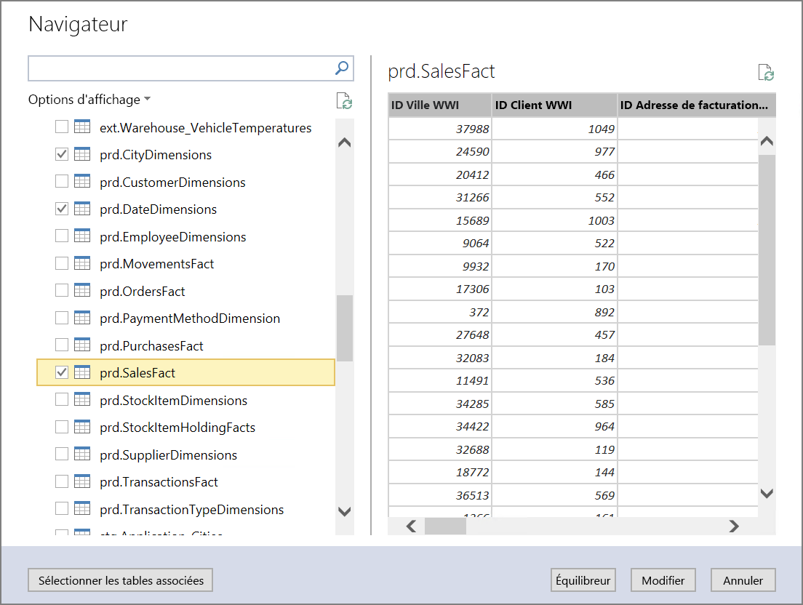
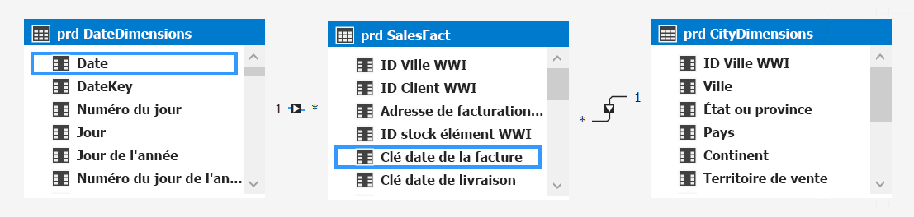
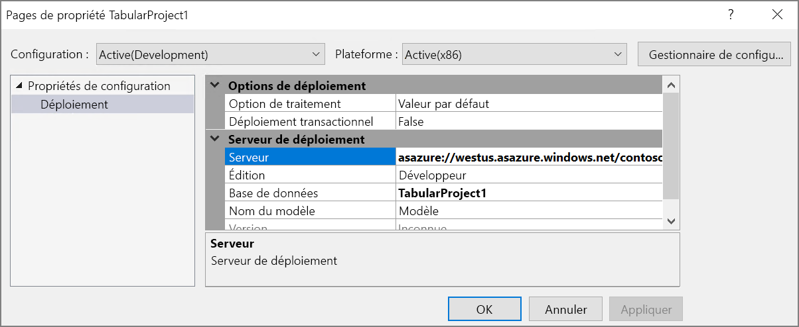
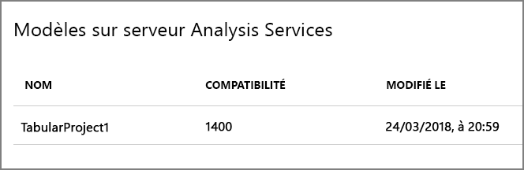
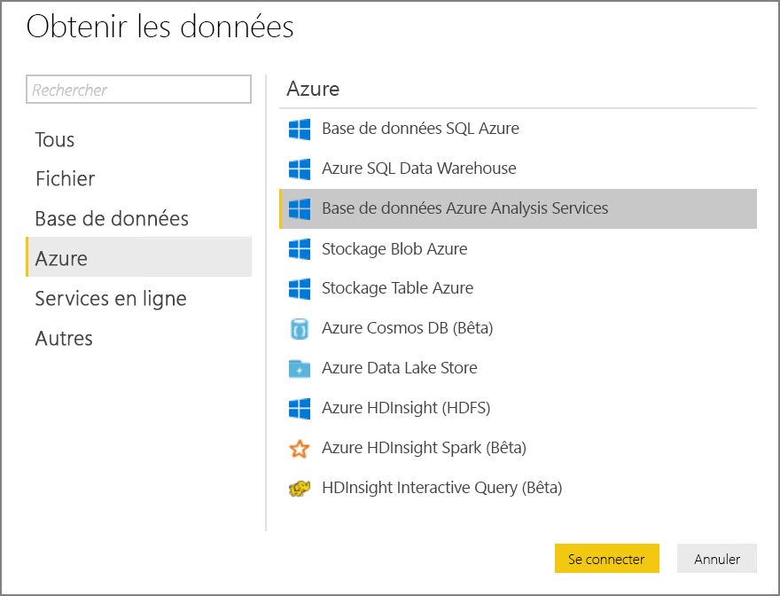
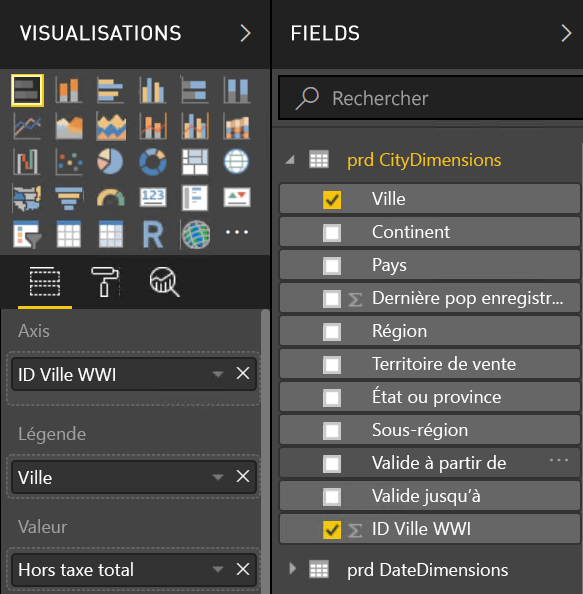
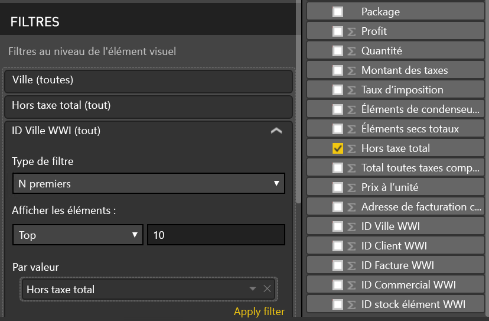
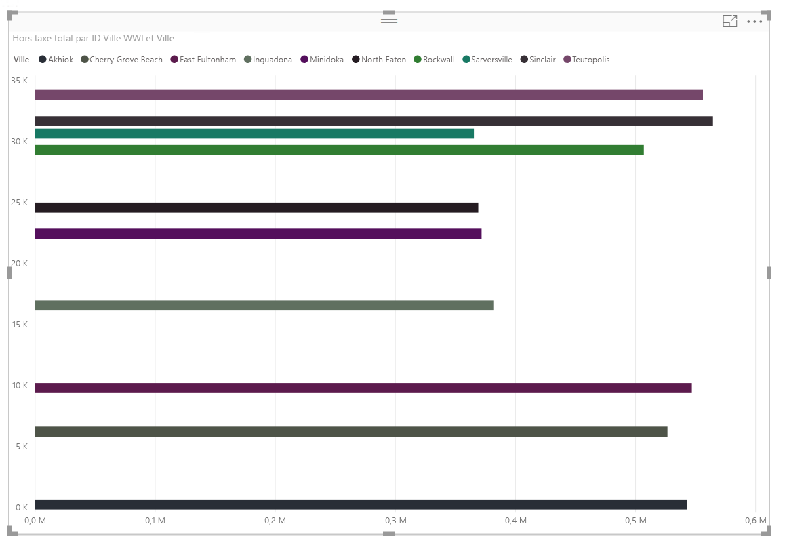

# <a name="enterprise-bi-with-sql-data-warehouse"></a><span data-ttu-id="f7a8b-103">Enterprise BI avec SQL Data Warehouse</span><span class="sxs-lookup"><span data-stu-id="f7a8b-103">Enterprise BI with SQL Data Warehouse</span></span>

<span data-ttu-id="f7a8b-104">Cette architecture de référence implémente un pipeline [ELT](../../data-guide/relational-data/etl.md#extract-load-and-transform-elt) (extract-load-transform) qui déplace des données d’une base de données SQL Server vers SQL Data Warehouse et qui transforme les données pour les analyser.</span><span class="sxs-lookup"><span data-stu-id="f7a8b-104">This reference architecture implements an [ELT](../../data-guide/relational-data/etl.md#extract-load-and-transform-elt) (extract-load-transform) pipeline that moves data from an on-premises SQL Server database into SQL Data Warehouse and transforms the data for analysis.</span></span> [<span data-ttu-id="f7a8b-105">**Déployez cette solution**.</span><span class="sxs-lookup"><span data-stu-id="f7a8b-105">**Deploy this solution**.</span></span>](#deploy-the-solution)


<span data-ttu-id="f7a8b-106">**Scénario**: Une organisation dispose d’un jeu de données OLTP important stocké dans une base de données SQL Server locale.</span><span class="sxs-lookup"><span data-stu-id="f7a8b-106">**Scenario**: An organization has a large OLTP data set stored in a SQL Server database on premises.</span></span> <span data-ttu-id="f7a8b-107">L’organisation souhaite utiliser SQL Data Warehouse pour réaliser une analyse avec Power BI.</span><span class="sxs-lookup"><span data-stu-id="f7a8b-107">The organization wants to use SQL Data Warehouse to perform analysis using Power BI.</span></span> 

<span data-ttu-id="f7a8b-108">Cette architecture de référence est conçue pour des tâches uniques ou à la demande.</span><span class="sxs-lookup"><span data-stu-id="f7a8b-108">This reference architecture is designed for one-time or on-demand jobs.</span></span> <span data-ttu-id="f7a8b-109">Si vous devez déplacer des données continuellement (toutes les heures ou tous les joueurs), nous vous recommandons d’utiliser Azure Data Factory pour définir un flux de travail automatisé.</span><span class="sxs-lookup"><span data-stu-id="f7a8b-109">If you need to move data on a continuing basis (hourly or daily), we recommend using Azure Data Factory to define an automated workflow.</span></span> <span data-ttu-id="f7a8b-110">Pour accéder à une architecture de référence qui utilise Data Factory, voir [BI d’entreprise automatisée avec SQL Data Warehouse et Azure Data Factory](./enterprise-bi-adf.md).</span><span class="sxs-lookup"><span data-stu-id="f7a8b-110">For a reference architecture that uses Data Factory, see [Automated enterprise BI with SQL Data Warehouse and Azure Data Factory](./enterprise-bi-adf.md).</span></span>

## <a name="architecture"></a><span data-ttu-id="f7a8b-111">Architecture</span><span class="sxs-lookup"><span data-stu-id="f7a8b-111">Architecture</span></span>

<span data-ttu-id="f7a8b-112">L’architecture est constituée des composants suivants.</span><span class="sxs-lookup"><span data-stu-id="f7a8b-112">The architecture consists of the following components.</span></span>

### <a name="data-source"></a><span data-ttu-id="f7a8b-113">Source de données</span><span class="sxs-lookup"><span data-stu-id="f7a8b-113">Data source</span></span>

<span data-ttu-id="f7a8b-114">**SQL Server**.</span><span class="sxs-lookup"><span data-stu-id="f7a8b-114">**SQL Server**.</span></span> <span data-ttu-id="f7a8b-115">Les données source sont situées dans une base de données SQL Server locale.</span><span class="sxs-lookup"><span data-stu-id="f7a8b-115">The source data is located in a SQL Server database on premises.</span></span> <span data-ttu-id="f7a8b-116">Pour simuler l’environnement local, les scripts de déploiement de cette architecture approvisionnent une machine virtuelle dans Azure disposant de SQL Server.</span><span class="sxs-lookup"><span data-stu-id="f7a8b-116">To simulate the on-premises environment, the deployment scripts for this architecture provision a VM in Azure with SQL Server installed.</span></span> <span data-ttu-id="f7a8b-117">[L’exemple de base de données OLTP Wide World Importers][wwi] est utilisé comme base de données source.</span><span class="sxs-lookup"><span data-stu-id="f7a8b-117">The [Wide World Importers OLTP sample database][wwi] is used as the source data.</span></span>

### <a name="ingestion-and-data-storage"></a><span data-ttu-id="f7a8b-118">Ingestion et stockage de données</span><span class="sxs-lookup"><span data-stu-id="f7a8b-118">Ingestion and data storage</span></span>

<span data-ttu-id="f7a8b-119">**Stockage d'objets blob**.</span><span class="sxs-lookup"><span data-stu-id="f7a8b-119">**Blob Storage**.</span></span> <span data-ttu-id="f7a8b-120">Le stockage d’objets blob est utilisé comme zone de préparation à la copie des données, avant de les charger dans SQL Data Warehouse.</span><span class="sxs-lookup"><span data-stu-id="f7a8b-120">Blob storage is used as a staging area to copy the data before loading it into SQL Data Warehouse.</span></span>

<span data-ttu-id="f7a8b-121">**Azure SQL Data Warehouse**.</span><span class="sxs-lookup"><span data-stu-id="f7a8b-121">**Azure SQL Data Warehouse**.</span></span> <span data-ttu-id="f7a8b-122">[SQL Data Warehouse](/azure/sql-data-warehouse/) est un système distribué conçu pour réaliser des analyses sur de grandes quantités de données.</span><span class="sxs-lookup"><span data-stu-id="f7a8b-122">[SQL Data Warehouse](/azure/sql-data-warehouse/) is a distributed system designed to perform analytics on large data.</span></span> <span data-ttu-id="f7a8b-123">Il prend en charge le traitement MPP (Massive Parallel Processing), le rendant ainsi adapté à l’exécution d’analyses hautes performances.</span><span class="sxs-lookup"><span data-stu-id="f7a8b-123">It supports massive parallel processing (MPP), which makes it suitable for running high-performance analytics.</span></span> 

### <a name="analysis-and-reporting"></a><span data-ttu-id="f7a8b-124">Analyse et rapports</span><span class="sxs-lookup"><span data-stu-id="f7a8b-124">Analysis and reporting</span></span>

<span data-ttu-id="f7a8b-125">**Azure Analysis Services**.</span><span class="sxs-lookup"><span data-stu-id="f7a8b-125">**Azure Analysis Services**.</span></span> <span data-ttu-id="f7a8b-126">[Analysis Services](/azure/analysis-services/) est un service entièrement géré qui fournit des capacités de modélisation des données.</span><span class="sxs-lookup"><span data-stu-id="f7a8b-126">[Analysis Services](/azure/analysis-services/) is a fully managed service that provides data modeling capabilities.</span></span> <span data-ttu-id="f7a8b-127">Utilisez Analysis Services pour créer un modèle sémantique que les utilisateurs peuvent demander.</span><span class="sxs-lookup"><span data-stu-id="f7a8b-127">Use Analysis Services to create a semantic model that users can query.</span></span> <span data-ttu-id="f7a8b-128">Analysis Services est particulièrement utile dans un scénario de tableau de bord BI.</span><span class="sxs-lookup"><span data-stu-id="f7a8b-128">Analysis Services is especially useful in a BI dashboard scenario.</span></span> <span data-ttu-id="f7a8b-129">Dans cette architecture, Analysis Services lit les données de l’entrepôt de données pour traiter le modèle sémantique, et délivrer efficacement les requêtes du tableau de bord.</span><span class="sxs-lookup"><span data-stu-id="f7a8b-129">In this architecture, Analysis Services reads data from the data warehouse to process the semantic model, and efficiently serves dashboard queries.</span></span> <span data-ttu-id="f7a8b-130">Il prend aussi en charge la concurrence élastique, en adaptant les réplicas en vue d’un traitement des requêtes plus rapide.</span><span class="sxs-lookup"><span data-stu-id="f7a8b-130">It also supports elastic concurrency, by scaling out replicas for faster query processing.</span></span>

<span data-ttu-id="f7a8b-131">À l’heure actuelle, Azure Analysis Services prend en charge les modèles tabulaires, mais pas les modèles multidimensionnels.</span><span class="sxs-lookup"><span data-stu-id="f7a8b-131">Currently, Azure Analysis Services supports tabular models but not multidimensional models.</span></span> <span data-ttu-id="f7a8b-132">Les modèles tabulaires utilisent des constructions de modélisation relationnelle (tables et colonnes), tandis que les modèles multidimensionnels utilisent des constructions de modélisation de traitement analytique en ligne (cubes, dimensions, et mesures).</span><span class="sxs-lookup"><span data-stu-id="f7a8b-132">Tabular models use relational modeling constructs (tables and columns), whereas multidimensional models use OLAP modeling constructs (cubes, dimensions, and measures).</span></span> <span data-ttu-id="f7a8b-133">Si vous avez besoin de modèles multidimensionnels, utilisez SQL Server Analysis Services (SSAS).</span><span class="sxs-lookup"><span data-stu-id="f7a8b-133">If you require multidimensional models, use SQL Server Analysis Services (SSAS).</span></span> <span data-ttu-id="f7a8b-134">Pour en savoir plus, consultez [Comparaison des solutions tabulaires et multidimensionnelles](/sql/analysis-services/comparing-tabular-and-multidimensional-solutions-ssas).</span><span class="sxs-lookup"><span data-stu-id="f7a8b-134">For more information, see [Comparing tabular and multidimensional solutions](/sql/analysis-services/comparing-tabular-and-multidimensional-solutions-ssas).</span></span>

<span data-ttu-id="f7a8b-135">**Power BI**.</span><span class="sxs-lookup"><span data-stu-id="f7a8b-135">**Power BI**.</span></span> <span data-ttu-id="f7a8b-136">Power BI est une suite d’outils d’analyse métier pour analyser les données et obtenir des informations métier.</span><span class="sxs-lookup"><span data-stu-id="f7a8b-136">Power BI is a suite of business analytics tools to analyze data for business insights.</span></span> <span data-ttu-id="f7a8b-137">Dans cette architecture, il demande le modèle sémantique stockée dans Analysis Services.</span><span class="sxs-lookup"><span data-stu-id="f7a8b-137">In this architecture, it queries the semantic model stored in Analysis Services.</span></span>

### <a name="authentication"></a><span data-ttu-id="f7a8b-138">Authentification</span><span class="sxs-lookup"><span data-stu-id="f7a8b-138">Authentication</span></span>

<span data-ttu-id="f7a8b-139">**Azure Active Directory** (Azure AD) authentifie les utilisateurs qui se connectent au serveur Analysis Services via Power BI.</span><span class="sxs-lookup"><span data-stu-id="f7a8b-139">**Azure Active Directory** (Azure AD) authenticates users who connect to the Analysis Services server through Power BI.</span></span>

## <a name="data-pipeline"></a><span data-ttu-id="f7a8b-140">Pipeline de données</span><span class="sxs-lookup"><span data-stu-id="f7a8b-140">Data pipeline</span></span>
 
<span data-ttu-id="f7a8b-141">Cette architecture de référence utilise l’exemple de base de données [WorldWideImporters](/sql/sample/world-wide-importers/wide-world-importers-oltp-database) en tant que source de données.</span><span class="sxs-lookup"><span data-stu-id="f7a8b-141">This reference architecture uses the [WorldWideImporters](/sql/sample/world-wide-importers/wide-world-importers-oltp-database) sample database as a data source.</span></span> <span data-ttu-id="f7a8b-142">Le pipeline de données comporte les étapes suivantes :</span><span class="sxs-lookup"><span data-stu-id="f7a8b-142">The data pipeline has the following stages:</span></span>

1. <span data-ttu-id="f7a8b-143">Exportez les données de SQL Server vers des fichiers plats (utilitaire BCP).</span><span class="sxs-lookup"><span data-stu-id="f7a8b-143">Export the data from SQL Server to flat files (bcp utility).</span></span>
2. <span data-ttu-id="f7a8b-144">Copiez les fichiers plats dans le Stockage Blob Azure (AzCopy).</span><span class="sxs-lookup"><span data-stu-id="f7a8b-144">Copy the flat files to Azure Blob Storage (AzCopy).</span></span>
3. <span data-ttu-id="f7a8b-145">Chargez les données dans SQL Data Warehouse à (PolyBase).</span><span class="sxs-lookup"><span data-stu-id="f7a8b-145">Load the data into SQL Data Warehouse (PolyBase).</span></span>
4. <span data-ttu-id="f7a8b-146">Transformez les données en schéma en étoile (T-SQL).</span><span class="sxs-lookup"><span data-stu-id="f7a8b-146">Transform the data into a star schema (T-SQL).</span></span>
5. <span data-ttu-id="f7a8b-147">Chargez un modèle sémantique dans Analysis Services (SQL Server Data Tools).</span><span class="sxs-lookup"><span data-stu-id="f7a8b-147">Load a semantic model into Analysis Services (SQL Server Data Tools).</span></span>


 
> [!NOTE]
> <span data-ttu-id="f7a8b-148">Pour les étapes 1 &ndash; 3, préférez l’utilisation de Redgate Data Platform Studio.</span><span class="sxs-lookup"><span data-stu-id="f7a8b-148">For steps 1 &ndash; 3, consider using Redgate Data Platform Studio.</span></span> <span data-ttu-id="f7a8b-149">Data Platform Studio applique les correctifs de compatibilité et optimisations les plus appropriés. Il s’agit donc du moyen le plus rapide pour vous familiariser avec SQL Data Warehouse.</span><span class="sxs-lookup"><span data-stu-id="f7a8b-149">Data Platform Studio applies the most appropriate compatibility fixes and optimizations, so it's the quickest way to get started with SQL Data Warehouse.</span></span> <span data-ttu-id="f7a8b-150">Pour en savoir plus, consultez [Chargement de données avec Redgate Data Platform Studio](/azure/sql-data-warehouse/sql-data-warehouse-load-with-redgate).</span><span class="sxs-lookup"><span data-stu-id="f7a8b-150">For more information, see [Load data with Redgate Data Platform Studio](/azure/sql-data-warehouse/sql-data-warehouse-load-with-redgate).</span></span> 

<span data-ttu-id="f7a8b-151">Les sections suivantes décrivent ces étapes plus en détail.</span><span class="sxs-lookup"><span data-stu-id="f7a8b-151">The next sections describe these stages in more detail.</span></span>

### <a name="export-data-from-sql-server"></a><span data-ttu-id="f7a8b-152">Exporter des données depuis SQL Server</span><span class="sxs-lookup"><span data-stu-id="f7a8b-152">Export data from SQL Server</span></span>

<span data-ttu-id="f7a8b-153">L’utilitaire [BCP](/sql/tools/bcp-utility) (programme de copie en bloc) constitue un moyen rapide de créer des fichiers texte plats à partir des tables SQL.</span><span class="sxs-lookup"><span data-stu-id="f7a8b-153">The [bcp](/sql/tools/bcp-utility) (bulk copy program) utility is a fast way to create flat text files from SQL tables.</span></span> <span data-ttu-id="f7a8b-154">Dans cette étape, vous sélectionnez les colonnes que vous souhaitez exporter, mais vous ne transformez pas les données.</span><span class="sxs-lookup"><span data-stu-id="f7a8b-154">In this step, you select the columns that you want to export, but don't transform the data.</span></span> <span data-ttu-id="f7a8b-155">Les transformations de données doivent se faire dans SQL Data Warehouse.</span><span class="sxs-lookup"><span data-stu-id="f7a8b-155">Any data transformations should happen in SQL Data Warehouse.</span></span>

<span data-ttu-id="f7a8b-156">**Recommandations**</span><span class="sxs-lookup"><span data-stu-id="f7a8b-156">**Recommendations**</span></span>

<span data-ttu-id="f7a8b-157">Si possible, prévoyez l’extraction des données lors des heures creuses afin de minimiser la contention des ressources dans l’environnement de production.</span><span class="sxs-lookup"><span data-stu-id="f7a8b-157">If possible, schedule data extraction during off-peak hours, to minimize resource contention in the production environment.</span></span> 

<span data-ttu-id="f7a8b-158">N’exécutez pas l’utilitaire BCP sur le serveur de base de données.</span><span class="sxs-lookup"><span data-stu-id="f7a8b-158">Avoid running bcp on the database server.</span></span> <span data-ttu-id="f7a8b-159">À la place, exécutez-le depuis une autre machine.</span><span class="sxs-lookup"><span data-stu-id="f7a8b-159">Instead, run it from another machine.</span></span> <span data-ttu-id="f7a8b-160">Écrivez les fichiers sur un disque local.</span><span class="sxs-lookup"><span data-stu-id="f7a8b-160">Write the files to a local drive.</span></span> <span data-ttu-id="f7a8b-161">Veillez à disposer de suffisamment de ressources d’E/S pour gérer les écritures simultanées.</span><span class="sxs-lookup"><span data-stu-id="f7a8b-161">Ensure that you have sufficient I/O resources to handle the concurrent writes.</span></span> <span data-ttu-id="f7a8b-162">Pour de meilleures performances, exportez les fichiers vers des disques de stockage rapides dédiés.</span><span class="sxs-lookup"><span data-stu-id="f7a8b-162">For best performance, export the files to dedicated fast storage drives.</span></span>

<span data-ttu-id="f7a8b-163">Vous pouvez accélérer le transfert réseau en enregistrant les données exportées dans un format compressé Gzip.</span><span class="sxs-lookup"><span data-stu-id="f7a8b-163">You can speed up the network transfer by saving the exported data in Gzip compressed format.</span></span> <span data-ttu-id="f7a8b-164">Toutefois, le chargement de fichiers compressés dans l’entrepôt est plus long qu’un chargement de fichiers décompressés. Il faut donc choisir entre un transfert réseau rapide et un chargement rapide.</span><span class="sxs-lookup"><span data-stu-id="f7a8b-164">However, loading compressed files into the warehouse is slower than loading uncompressed files, so there is a tradeoff between faster network transfer versus faster loading.</span></span> <span data-ttu-id="f7a8b-165">Si vous choisissez d’utiliser la compression Gzip, ne créez pas qu’un seul fichier Gzip.</span><span class="sxs-lookup"><span data-stu-id="f7a8b-165">If you decide to use Gzip compression, don't create a single Gzip file.</span></span> <span data-ttu-id="f7a8b-166">À la place, divisez les données en plusieurs fichiers compressés.</span><span class="sxs-lookup"><span data-stu-id="f7a8b-166">Instead, split the data into multiple compressed files.</span></span>

### <a name="copy-flat-files-into-blob-storage"></a><span data-ttu-id="f7a8b-167">Copier des fichiers plats dans le stockage d’objets blob</span><span class="sxs-lookup"><span data-stu-id="f7a8b-167">Copy flat files into blob storage</span></span>

<span data-ttu-id="f7a8b-168">L’utilitaire [AzCopy](/azure/storage/common/storage-use-azcopy) est conçu pour la copie hautes performances des données dans le Stockage Blob Azure.</span><span class="sxs-lookup"><span data-stu-id="f7a8b-168">The [AzCopy](/azure/storage/common/storage-use-azcopy) utility is designed for high-performance copying of data into Azure blob storage.</span></span>

<span data-ttu-id="f7a8b-169">**Recommandations**</span><span class="sxs-lookup"><span data-stu-id="f7a8b-169">**Recommendations**</span></span>

<span data-ttu-id="f7a8b-170">Créez un compte de stockage dans une région proche de l’emplacement des données source.</span><span class="sxs-lookup"><span data-stu-id="f7a8b-170">Create the storage account in a region near the location of the source data.</span></span> <span data-ttu-id="f7a8b-171">Déployez le compte de stockage et l’instance SQL Data Warehouse dans la même région.</span><span class="sxs-lookup"><span data-stu-id="f7a8b-171">Deploy the storage account and the SQL Data Warehouse instance in the same region.</span></span> 

<span data-ttu-id="f7a8b-172">N’exécutez pas AzCopy sur la machine qui exécute vos charges de travail de production, car l’unité centrale et la consommation d’E/S peuvent interférer avec elles.</span><span class="sxs-lookup"><span data-stu-id="f7a8b-172">Don't run AzCopy on the same machine that runs your production workloads, because the CPU and I/O consumption can interfere with the production workload.</span></span> 

<span data-ttu-id="f7a8b-173">Testez le chargement afin de déterminer la vitesse.</span><span class="sxs-lookup"><span data-stu-id="f7a8b-173">Test the upload first to see what the upload speed is like.</span></span> <span data-ttu-id="f7a8b-174">Vous pouvez utiliser l’option /NC dans AzCopy pour spécifier le nombre d’opérations de copie simultanées.</span><span class="sxs-lookup"><span data-stu-id="f7a8b-174">You can use the /NC option in AzCopy to specify the number of concurrent copy operations.</span></span> <span data-ttu-id="f7a8b-175">Commencez par la valeur par défaut, puis expérimentez avec ce paramètre pour ajuster les performances.</span><span class="sxs-lookup"><span data-stu-id="f7a8b-175">Start with the default value, then experiment with this setting to tune the performance.</span></span> <span data-ttu-id="f7a8b-176">Remarque : un trop grand nombre d’opérations simultanées dans un environnement à faible bande passante peut surcharger la connexion réseau et entraver la réussite des opérations.</span><span class="sxs-lookup"><span data-stu-id="f7a8b-176">In a low-bandwidth environment, too many concurrent operations can overwhelm the network connection and prevent the operations from completing successfully.</span></span>  

<span data-ttu-id="f7a8b-177">AzCopy déplace les données vers le stockage via l’Internet public.</span><span class="sxs-lookup"><span data-stu-id="f7a8b-177">AzCopy moves data to storage over the public internet.</span></span> <span data-ttu-id="f7a8b-178">Si ce n’est pas assez rapide, envisagez la configuration d’un circuit [ExpressRoute](/azure/expressroute/).</span><span class="sxs-lookup"><span data-stu-id="f7a8b-178">If this isn't fast enough, consider setting up an [ExpressRoute](/azure/expressroute/) circuit.</span></span> <span data-ttu-id="f7a8b-179">ExpressRoute est un service qui achemine vos données via une connexion privée dédiée vers Azure.</span><span class="sxs-lookup"><span data-stu-id="f7a8b-179">ExpressRoute is a service that routes your data through a dedicated private connection to Azure.</span></span> <span data-ttu-id="f7a8b-180">Si votre connexion réseau est trop lente, une autre option consiste à envoyer les données physiquement sur disque vers un centre de données Azure.</span><span class="sxs-lookup"><span data-stu-id="f7a8b-180">Another option, if your network connection is too slow, is to physically ship the data on disk to an Azure datacenter.</span></span> <span data-ttu-id="f7a8b-181">Pour plus d’informations, consultez l’article [Transférer des données vers et à partir d’Azure](/azure/architecture/data-guide/scenarios/data-transfer).</span><span class="sxs-lookup"><span data-stu-id="f7a8b-181">For more information, see [Transferring data to and from Azure](/azure/architecture/data-guide/scenarios/data-transfer).</span></span>

<span data-ttu-id="f7a8b-182">Lors d’une opération de copie, AzCopy crée un fichier journal temporaire, qui permet à AzCopy de redémarrer l’opération si elle est interrompue (à cause d’une erreur réseau, par exemple).</span><span class="sxs-lookup"><span data-stu-id="f7a8b-182">During a copy operation, AzCopy creates a temporary journal file, which enables AzCopy to restart the operation if it gets interrupted (for example, due to a network error).</span></span> <span data-ttu-id="f7a8b-183">Veillez à disposer de suffisamment d’espace disque pour stocker les fichiers journaux.</span><span class="sxs-lookup"><span data-stu-id="f7a8b-183">Make sure there is enough disk space to store the journal files.</span></span> <span data-ttu-id="f7a8b-184">Vous pouvez utiliser l’option /Z pour spécifier où sont écrits les fichiers journaux.</span><span class="sxs-lookup"><span data-stu-id="f7a8b-184">You can use the /Z option to specify where the journal files are written.</span></span>

### <a name="load-data-into-sql-data-warehouse"></a><span data-ttu-id="f7a8b-185">Chargement de données dans SQL Data Warehouse</span><span class="sxs-lookup"><span data-stu-id="f7a8b-185">Load data into SQL Data Warehouse</span></span>

<span data-ttu-id="f7a8b-186">Utilisez [PolyBase](/sql/relational-databases/polybase/polybase-guide) pour charger des fichiers du stockage d’objets blob vers l’entrepôt de données.</span><span class="sxs-lookup"><span data-stu-id="f7a8b-186">Use [PolyBase](/sql/relational-databases/polybase/polybase-guide) to load the files from blob storage into the data warehouse.</span></span> <span data-ttu-id="f7a8b-187">PolyBase est conçu pour tirer parti de l’architecture MPP (Massively Parallel Processing) de SQL Data Warehouse, ce qui en fait le moyen le plus rapide pour y charger des données.</span><span class="sxs-lookup"><span data-stu-id="f7a8b-187">PolyBase is designed to leverage the MPP (Massively Parallel Processing) architecture of SQL Data Warehouse, which makes it the fastest way to load data into SQL Data Warehouse.</span></span> 

<span data-ttu-id="f7a8b-188">Le chargement des données est un processus en deux étapes :</span><span class="sxs-lookup"><span data-stu-id="f7a8b-188">Loading the data is a two-step process:</span></span>

1. <span data-ttu-id="f7a8b-189">Créez un ensemble de tables externes pour les données.</span><span class="sxs-lookup"><span data-stu-id="f7a8b-189">Create a set of external tables for the data.</span></span> <span data-ttu-id="f7a8b-190">Une table externe est une définition de table qui pointe vers des données stockées à l’extérieur de l’entrepôt &mdash;. Dans notre cas, il s’agit des fichiers plats dans le stockage d’objets blob.</span><span class="sxs-lookup"><span data-stu-id="f7a8b-190">An external table is a table definition that points to data stored outside of the warehouse &mdash; in this case, the flat files in blob storage.</span></span> <span data-ttu-id="f7a8b-191">Cette étape ne déplace aucune donnée dans l’entrepôt.</span><span class="sxs-lookup"><span data-stu-id="f7a8b-191">This step does not move any data into the warehouse.</span></span>
2. <span data-ttu-id="f7a8b-192">Créez des tables de mise en lots, et chargez-y les données.</span><span class="sxs-lookup"><span data-stu-id="f7a8b-192">Create staging tables, and load the data into the staging tables.</span></span> <span data-ttu-id="f7a8b-193">Cette étape copie les données dans l’entrepôt.</span><span class="sxs-lookup"><span data-stu-id="f7a8b-193">This step copies the data into the warehouse.</span></span>

<span data-ttu-id="f7a8b-194">**Recommandations**</span><span class="sxs-lookup"><span data-stu-id="f7a8b-194">**Recommendations**</span></span>

<span data-ttu-id="f7a8b-195">Préférez utiliser SQL Data Warehouse lorsque vous disposez d’une importante quantité de données (supérieure à 1 To) et que vous exécutez une charge de travail d’analyse qui profiterait de ce parallélisme.</span><span class="sxs-lookup"><span data-stu-id="f7a8b-195">Consider SQL Data Warehouse when you have large amounts of data (more than 1 TB) and are running an analytics workload that will benefit from parallelism.</span></span> <span data-ttu-id="f7a8b-196">SQL Data Warehouse ne convient pas à des charges de travail OLTP ni à des jeux de données moins importants (inférieurs à 250 Go).</span><span class="sxs-lookup"><span data-stu-id="f7a8b-196">SQL Data Warehouse is not a good fit for OLTP workloads or smaller data sets (< 250GB).</span></span> <span data-ttu-id="f7a8b-197">Pour les jeux de données inférieurs à 250 Go, préférez utiliser Azure SQL Database ou SQL Server.</span><span class="sxs-lookup"><span data-stu-id="f7a8b-197">For data sets less than 250GB, consider Azure SQL Database or SQL Server.</span></span> <span data-ttu-id="f7a8b-198">Pour plus d’informations, consultez la page [Entreposage des données](../../data-guide/relational-data/data-warehousing.md).</span><span class="sxs-lookup"><span data-stu-id="f7a8b-198">For more information, see [Data warehousing](../../data-guide/relational-data/data-warehousing.md).</span></span>

<span data-ttu-id="f7a8b-199">Créez les tables de mise en lots comme tables de segments de mémoire, qui ne sont pas indexées.</span><span class="sxs-lookup"><span data-stu-id="f7a8b-199">Create the staging tables as heap tables, which are not indexed.</span></span> <span data-ttu-id="f7a8b-200">Les requêtes qui créent les tables de production créeront une analyse de table complète. Il n’y a donc aucune raison d’indexer les tables de mise en lots.</span><span class="sxs-lookup"><span data-stu-id="f7a8b-200">The queries that create the production tables will result in a full table scan, so there is no reason to index the staging tables.</span></span>

<span data-ttu-id="f7a8b-201">PolyBase tire automatiquement parti du parallélisme dans l’entrepôt.</span><span class="sxs-lookup"><span data-stu-id="f7a8b-201">PolyBase automatically takes advantage of parallelism in the warehouse.</span></span> <span data-ttu-id="f7a8b-202">Les performances de chargement s’adaptent à mesure que vous augmentez les DWU (Data Warehouse Units).</span><span class="sxs-lookup"><span data-stu-id="f7a8b-202">The load performance scales as you increase DWUs.</span></span> <span data-ttu-id="f7a8b-203">Pour de meilleures performances, utilisez une seule opération de chargement.</span><span class="sxs-lookup"><span data-stu-id="f7a8b-203">For best performance, use a single load operation.</span></span> <span data-ttu-id="f7a8b-204">Il n’y a pas d’améliorations de performances pour diviser les données entrantes et exécuter plusieurs chargements simultanés.</span><span class="sxs-lookup"><span data-stu-id="f7a8b-204">There is no performance benefit to breaking the input data into chunks and running multiple concurrent loads.</span></span>

<span data-ttu-id="f7a8b-205">PolyBase peut lire les fichiers compressés au format Gzip.</span><span class="sxs-lookup"><span data-stu-id="f7a8b-205">PolyBase can read Gzip compressed files.</span></span> <span data-ttu-id="f7a8b-206">Toutefois, seul un lecteur unique est utilisé par fichier compressé, car la décompression du fichier est une opération à un seul thread.</span><span class="sxs-lookup"><span data-stu-id="f7a8b-206">However, only a single reader is used per compressed file, because uncompressing the file is a single-threaded operation.</span></span> <span data-ttu-id="f7a8b-207">Évitez donc de charger un seul gros fichier compressé.</span><span class="sxs-lookup"><span data-stu-id="f7a8b-207">Therefore, avoid loading a single large compressed file.</span></span> <span data-ttu-id="f7a8b-208">À la place, divisez les données en plusieurs fichiers compressés, afin de tirer parti du parallélisme.</span><span class="sxs-lookup"><span data-stu-id="f7a8b-208">Instead, split the data into multiple compressed files, in order to take advantage of parallelism.</span></span> 

<span data-ttu-id="f7a8b-209">Soyez conscient des limitations suivantes :</span><span class="sxs-lookup"><span data-stu-id="f7a8b-209">Be aware of the following limitations:</span></span>

- <span data-ttu-id="f7a8b-210">PolyBase prend en charge une taille de colonne maximale de `varchar(8000)`, `nvarchar(4000)` ou `varbinary(8000)`.</span><span class="sxs-lookup"><span data-stu-id="f7a8b-210">PolyBase supports a maximum column size of `varchar(8000)`, `nvarchar(4000)`, or `varbinary(8000)`.</span></span> <span data-ttu-id="f7a8b-211">Si vos données dépassent ces limites, une option consiste à les diviser au moment de les exporter, puis de les réassembler après les avoir importées.</span><span class="sxs-lookup"><span data-stu-id="f7a8b-211">If you have data that exceeds these limits, one option is to break the data up into chunks when you export it, and then reassemble the chunks after import.</span></span> 

- <span data-ttu-id="f7a8b-212">PolyBase utilise un terminateur de ligne fixe \n ou un renvoi à la ligne.</span><span class="sxs-lookup"><span data-stu-id="f7a8b-212">PolyBase uses a fixed row terminator of \n or newline.</span></span> <span data-ttu-id="f7a8b-213">Cela peut entraîner des problèmes si les caractères de renvoi à la ligne apparaissent dans les données source.</span><span class="sxs-lookup"><span data-stu-id="f7a8b-213">This can cause problems if newline characters appear in the source data.</span></span>

- <span data-ttu-id="f7a8b-214">Votre schéma des données source peut contenir des types de données qui ne sont pas pris en charge dans SQL Data Warehouse.</span><span class="sxs-lookup"><span data-stu-id="f7a8b-214">Your source data schema might contain data types that are not supported in SQL Data Warehouse.</span></span>

<span data-ttu-id="f7a8b-215">Pour contourner ces limitations, vous pouvez créer une procédure stockée qui réalise les conversions nécessaires.</span><span class="sxs-lookup"><span data-stu-id="f7a8b-215">To work around these limitations, you can create a stored procedure that performs the necessary conversions.</span></span> <span data-ttu-id="f7a8b-216">Référencez cette procédure stockée lorsque vous exécutez l’utilitaire BCP.</span><span class="sxs-lookup"><span data-stu-id="f7a8b-216">Reference this stored procedure when you run bcp.</span></span> <span data-ttu-id="f7a8b-217">Autrement, [Redgate Data Platform Studio](/azure/sql-data-warehouse/sql-data-warehouse-load-with-redgate) convertit automatiquement les types de données qui ne sont pas pris en charge dans SQL Data Warehouse.</span><span class="sxs-lookup"><span data-stu-id="f7a8b-217">Alternatively, [Redgate Data Platform Studio](/azure/sql-data-warehouse/sql-data-warehouse-load-with-redgate) automatically converts data types that aren’t supported in SQL Data Warehouse.</span></span>

<span data-ttu-id="f7a8b-218">Pour plus d’informations, consultez les articles suivants :</span><span class="sxs-lookup"><span data-stu-id="f7a8b-218">For more information, see the following articles:</span></span>

- <span data-ttu-id="f7a8b-219">[Meilleures pratiques de chargement de données dans Azure SQL Data Warehouse](/azure/sql-data-warehouse/guidance-for-loading-data).</span><span class="sxs-lookup"><span data-stu-id="f7a8b-219">[Best practices for loading data into Azure SQL Data Warehouse](/azure/sql-data-warehouse/guidance-for-loading-data).</span></span>
- [<span data-ttu-id="f7a8b-220">Migration de votre schéma vers SQL Data Warehouse</span><span class="sxs-lookup"><span data-stu-id="f7a8b-220">Migrate your schemas to SQL Data Warehouse</span></span>](/azure/sql-data-warehouse/sql-data-warehouse-migrate-schema)
- [<span data-ttu-id="f7a8b-221">Conseils relatifs à la définition des types de données pour tables dans SQL Data Warehouse</span><span class="sxs-lookup"><span data-stu-id="f7a8b-221">Guidance for defining data types for tables in SQL Data Warehouse</span></span>](/azure/sql-data-warehouse/sql-data-warehouse-tables-data-types)

### <a name="transform-the-data"></a><span data-ttu-id="f7a8b-222">Transformer les données</span><span class="sxs-lookup"><span data-stu-id="f7a8b-222">Transform the data</span></span>

<span data-ttu-id="f7a8b-223">Transformez les données et les déplacer dans des tables de production.</span><span class="sxs-lookup"><span data-stu-id="f7a8b-223">Transform the data and move it into production tables.</span></span> <span data-ttu-id="f7a8b-224">Dans cette étape, les données sont transformées en schéma en étoile avec des tables de dimension et de faits, adaptées à la modélisation sémantique.</span><span class="sxs-lookup"><span data-stu-id="f7a8b-224">In this step, the data is transformed into a star schema with dimension tables and fact tables, suitable for semantic modeling.</span></span>

<span data-ttu-id="f7a8b-225">Créez les tables de production avec des index columstore en cluster, ce qui offre les meilleures performances globales de requête.</span><span class="sxs-lookup"><span data-stu-id="f7a8b-225">Create the production tables with clustered columnstore indexes, which offer the best overall query performance.</span></span> <span data-ttu-id="f7a8b-226">Les index columnstore sont optimisés pour les requêtes qui analysent de nombreux enregistrements.</span><span class="sxs-lookup"><span data-stu-id="f7a8b-226">Columnstore indexes are optimized for queries that scan many records.</span></span> <span data-ttu-id="f7a8b-227">Les index columnstore ne sont pas aussi efficaces pour les recherches singleton (rechercher une seule ligne).</span><span class="sxs-lookup"><span data-stu-id="f7a8b-227">Columnstore indexes don't perform as well for singleton lookups (that is, looking up a single row).</span></span> <span data-ttu-id="f7a8b-228">Si vous avez besoin d’effectuer fréquemment des recherches singleton, vous pouvez ajouter un index non cluster à une table.</span><span class="sxs-lookup"><span data-stu-id="f7a8b-228">If you need to perform frequent singleton lookups, you can add a non-clustered index to a table.</span></span> <span data-ttu-id="f7a8b-229">Les recherches singleton peuvent s’exécuter bien plus rapidement avec un index non cluster.</span><span class="sxs-lookup"><span data-stu-id="f7a8b-229">Singleton lookups can run significantly faster using a non-clustered index.</span></span> <span data-ttu-id="f7a8b-230">Toutefois, elles sont généralement moins fréquentes dans des scénarios d’entrepôt de données que des charges de travail OLTP.</span><span class="sxs-lookup"><span data-stu-id="f7a8b-230">However, singleton lookups are typically less common in data warehouse scenarios than OLTP workloads.</span></span> <span data-ttu-id="f7a8b-231">Pour plus d’informations, consultez [Indexage de tables dans SQL Data Warehouse](/azure/sql-data-warehouse/sql-data-warehouse-tables-index).</span><span class="sxs-lookup"><span data-stu-id="f7a8b-231">For more information, see [Indexing tables in SQL Data Warehouse](/azure/sql-data-warehouse/sql-data-warehouse-tables-index).</span></span>

> [!NOTE]
> <span data-ttu-id="f7a8b-232">Les tables columnstore cluster ne prennent pas en charge les types de données `varchar(max)`, `nvarchar(max)` ou `varbinary(max)`.</span><span class="sxs-lookup"><span data-stu-id="f7a8b-232">Clustered columnstore tables do not support `varchar(max)`, `nvarchar(max)`, or `varbinary(max)` data types.</span></span> <span data-ttu-id="f7a8b-233">Dans ces cas, préférez utiliser un segment de mémoire ou un index cluster.</span><span class="sxs-lookup"><span data-stu-id="f7a8b-233">In that case, consider a heap or clustered index.</span></span> <span data-ttu-id="f7a8b-234">Vous pouvez placer ces colonnes dans une table distincte.</span><span class="sxs-lookup"><span data-stu-id="f7a8b-234">You might put those columns into a separate table.</span></span>

<span data-ttu-id="f7a8b-235">Comme l’exemple de base de données n’est pas très important, nous avons créé des tables répliquées sans partition.</span><span class="sxs-lookup"><span data-stu-id="f7a8b-235">Because the sample database is not very large, we created replicated tables with no partitions.</span></span> <span data-ttu-id="f7a8b-236">Pour les charges de travail de production, l’utilisation de tables distribuées a des chances d’améliorer les performances de requête.</span><span class="sxs-lookup"><span data-stu-id="f7a8b-236">For production workloads, using distributed tables is likely to improve query performance.</span></span> <span data-ttu-id="f7a8b-237">Consultez le [Guide de conception des tables distribuées dans Azure SQL Data Warehouse](/azure/sql-data-warehouse/sql-data-warehouse-tables-distribute).</span><span class="sxs-lookup"><span data-stu-id="f7a8b-237">See [Guidance for designing distributed tables in Azure SQL Data Warehouse](/azure/sql-data-warehouse/sql-data-warehouse-tables-distribute).</span></span> <span data-ttu-id="f7a8b-238">Nos exemples de scripts exécutent les requêtes avec une [classe de ressources](/azure/sql-data-warehouse/resource-classes-for-workload-management) statique.</span><span class="sxs-lookup"><span data-stu-id="f7a8b-238">Our example scripts run the queries using a static [resource class](/azure/sql-data-warehouse/resource-classes-for-workload-management).</span></span>

### <a name="load-the-semantic-model"></a><span data-ttu-id="f7a8b-239">Charger le modèle sémantique</span><span class="sxs-lookup"><span data-stu-id="f7a8b-239">Load the semantic model</span></span>

<span data-ttu-id="f7a8b-240">Chargez les données dans un modèle tabulaire dans Azure Analysis Services.</span><span class="sxs-lookup"><span data-stu-id="f7a8b-240">Load the data into a tabular model in Azure Analysis Services.</span></span> <span data-ttu-id="f7a8b-241">Dans cette étape, vous créez un modèle de données sémantique avec SQL Server Data Tools (SSDT).</span><span class="sxs-lookup"><span data-stu-id="f7a8b-241">In this step, you create a semantic data model by using SQL Server Data Tools (SSDT).</span></span> <span data-ttu-id="f7a8b-242">Vous pouvez aussi créer un modèle en l’important depuis un fichier Power BI Desktop.</span><span class="sxs-lookup"><span data-stu-id="f7a8b-242">You can also create a model by importing it from a Power BI Desktop file.</span></span> <span data-ttu-id="f7a8b-243">Comme SQL Data Warehouse ne prend pas en charge les clés étrangères, vous devez ajouter les relations au modèle sémantique afin de joindre les tables.</span><span class="sxs-lookup"><span data-stu-id="f7a8b-243">Because SQL Data Warehouse does not support foreign keys, you must add the relationships to the semantic model, so that you can join across tables.</span></span>

### <a name="use-power-bi-to-visualize-the-data"></a><span data-ttu-id="f7a8b-244">Utiliser Power BI pour visualiser les données</span><span class="sxs-lookup"><span data-stu-id="f7a8b-244">Use Power BI to visualize the data</span></span>

<span data-ttu-id="f7a8b-245">Power BI prend en charge deux options pour la connexion à Azure Analysis Services :</span><span class="sxs-lookup"><span data-stu-id="f7a8b-245">Power BI supports two options for connecting to Azure Analysis Services:</span></span>

- <span data-ttu-id="f7a8b-246">Importation.</span><span class="sxs-lookup"><span data-stu-id="f7a8b-246">Import.</span></span> <span data-ttu-id="f7a8b-247">Les données sont importées dans le modèle Power BI.</span><span class="sxs-lookup"><span data-stu-id="f7a8b-247">The data is imported into the Power BI model.</span></span>
- <span data-ttu-id="f7a8b-248">Connexion active.</span><span class="sxs-lookup"><span data-stu-id="f7a8b-248">Live Connection.</span></span> <span data-ttu-id="f7a8b-249">Les données sont extraites directement depuis Analysis Services.</span><span class="sxs-lookup"><span data-stu-id="f7a8b-249">Data is pulled directly from Analysis Services.</span></span>

<span data-ttu-id="f7a8b-250">Nous vous recommandons l’option Connexion active car elle ne nécessite pas de copier des données dans le modèle Power BI.</span><span class="sxs-lookup"><span data-stu-id="f7a8b-250">We recommend Live Connection because it doesn't require copying data into the Power BI model.</span></span> <span data-ttu-id="f7a8b-251">De plus, DirectQuery veille à ce que les résultats soient toujours cohérents avec les données sources les plus récentes.</span><span class="sxs-lookup"><span data-stu-id="f7a8b-251">Also, using DirectQuery ensures that results are always consistent with the latest source data.</span></span> <span data-ttu-id="f7a8b-252">Pour plus d’informations, consultez [Connexion avec Power BI](/azure/analysis-services/analysis-services-connect-pbi).</span><span class="sxs-lookup"><span data-stu-id="f7a8b-252">For more information, see [Connect with Power BI](/azure/analysis-services/analysis-services-connect-pbi).</span></span>

<span data-ttu-id="f7a8b-253">**Recommandations**</span><span class="sxs-lookup"><span data-stu-id="f7a8b-253">**Recommendations**</span></span>

<span data-ttu-id="f7a8b-254">N’exécutez pas des requêtes de tableau de bord BI directement dans l’entrepôt de données.</span><span class="sxs-lookup"><span data-stu-id="f7a8b-254">Avoid running BI dashboard queries directly against the data warehouse.</span></span> <span data-ttu-id="f7a8b-255">Les tableaux de bord BI nécessitent des temps de réponse très lents. Les requêtes directes dans l’entrepôt de données peuvent ne pas être adaptées.</span><span class="sxs-lookup"><span data-stu-id="f7a8b-255">BI dashboards require very low response times, which direct queries against the warehouse may be unable to satisfy.</span></span> <span data-ttu-id="f7a8b-256">De plus, l’actualisation du tableau de bord comptera dans le nombre de requêtes simultanées, ce qui peut impacter les performances.</span><span class="sxs-lookup"><span data-stu-id="f7a8b-256">Also, refreshing the dashboard will count against the number of concurrent queries, which could impact performance.</span></span> 

<span data-ttu-id="f7a8b-257">Azure Analysis Services est conçu pour gérer les exigences de requête d’un tableau de bord BI. Il est donc recommandé d’effectuer des requêtes Analysis Services depuis Power BI.</span><span class="sxs-lookup"><span data-stu-id="f7a8b-257">Azure Analysis Services is designed to handle the query requirements of a BI dashboard, so the recommended practice is to query Analysis Services from Power BI.</span></span>

## <a name="scalability-considerations"></a><span data-ttu-id="f7a8b-258">Considérations relatives à l’extensibilité</span><span class="sxs-lookup"><span data-stu-id="f7a8b-258">Scalability considerations</span></span>

### <a name="sql-data-warehouse"></a><span data-ttu-id="f7a8b-259">SQL Data Warehouse</span><span class="sxs-lookup"><span data-stu-id="f7a8b-259">SQL Data Warehouse</span></span>

<span data-ttu-id="f7a8b-260">Avec SQL Data Warehouse, vous pouvez augmenter la taille de vos ressources de calcul à la demande.</span><span class="sxs-lookup"><span data-stu-id="f7a8b-260">With SQL Data Warehouse, you can scale out your compute resources on demand.</span></span> <span data-ttu-id="f7a8b-261">Le moteur de requête optimise les requêtes pour des traitements simultanés basés sur le nombre de nœuds de calcul, et déplace les données entre nœuds si nécessaire.</span><span class="sxs-lookup"><span data-stu-id="f7a8b-261">The query engine optimizes queries for parallel processing based on the number of compute nodes, and moves data between nodes as necessary.</span></span> <span data-ttu-id="f7a8b-262">Pour plus d’informations, consultez [Gérer le calcul dans Azure SQL Data Warehouse](/azure/sql-data-warehouse/sql-data-warehouse-manage-compute-overview).</span><span class="sxs-lookup"><span data-stu-id="f7a8b-262">For more information, see [Manage compute in Azure SQL Data Warehouse](/azure/sql-data-warehouse/sql-data-warehouse-manage-compute-overview).</span></span>

### <a name="analysis-services"></a><span data-ttu-id="f7a8b-263">Analysis Services</span><span class="sxs-lookup"><span data-stu-id="f7a8b-263">Analysis Services</span></span>

<span data-ttu-id="f7a8b-264">Pour les charges de travail de production, nous recommandons le niveau Standard pour Azure Analysis Services, car il prend en charge le partitionnement et DirectQuery.</span><span class="sxs-lookup"><span data-stu-id="f7a8b-264">For production workloads, we recommend the Standard Tier for Azure Analysis Services, because it supports partitioning and DirectQuery.</span></span> <span data-ttu-id="f7a8b-265">Dans un niveau, la taille de l’instance détermine la mémoire et la puissance de traitement.</span><span class="sxs-lookup"><span data-stu-id="f7a8b-265">Within a tier, the instance size determines the memory and processing power.</span></span> <span data-ttu-id="f7a8b-266">La puissance de traitement se mesure en QPU (Unité de traitement des requêtes).</span><span class="sxs-lookup"><span data-stu-id="f7a8b-266">Processing power is measured in Query Processing Units (QPUs).</span></span> <span data-ttu-id="f7a8b-267">Surveillez votre utilisation QPU pour sélectionner la taille appropriée.</span><span class="sxs-lookup"><span data-stu-id="f7a8b-267">Monitor your QPU usage to select the appropriate size.</span></span> <span data-ttu-id="f7a8b-268">Pour plus d’informations, voir [Surveiller les mesures du serveur](/azure/analysis-services/analysis-services-monitor).</span><span class="sxs-lookup"><span data-stu-id="f7a8b-268">For more information, see [Monitor server metrics](/azure/analysis-services/analysis-services-monitor).</span></span>

<span data-ttu-id="f7a8b-269">Sous une charge importante, les performances de requête peuvent se dégrader en raison de la simultanéité des requêtes.</span><span class="sxs-lookup"><span data-stu-id="f7a8b-269">Under high load, query performance can become degraded due to query concurrency.</span></span> <span data-ttu-id="f7a8b-270">Vous pouvez augmenter la taille d’Analyse Services en créant un pool de réplicas pour traiter des requêtes, dans le but de pouvoir réaliser plus de requêtes simultanément.</span><span class="sxs-lookup"><span data-stu-id="f7a8b-270">You can scale out Analysis Services by creating a pool of replicas to process queries, so that more queries can be performed concurrently.</span></span> <span data-ttu-id="f7a8b-271">Le traitement du modèle des données se fait toujours sur le serveur principal.</span><span class="sxs-lookup"><span data-stu-id="f7a8b-271">The work of processing the data model always happens on the primary server.</span></span> <span data-ttu-id="f7a8b-272">Par défaut, le serveur principal gère aussi les requêtes.</span><span class="sxs-lookup"><span data-stu-id="f7a8b-272">By default, the primary server also handles queries.</span></span> <span data-ttu-id="f7a8b-273">Optionnellement, vous pouvez désigner le serveur principal pour qu’il n’exécute que le traitement, afin que le pool de requêtes gère toutes les requêtes.</span><span class="sxs-lookup"><span data-stu-id="f7a8b-273">Optionally, you can designate the primary server to run processing exclusively, so that the query pool handles all queries.</span></span> <span data-ttu-id="f7a8b-274">Si vous avez des exigences de traitement élevées, vous devriez séparer le traitement et le pool de requêtes.</span><span class="sxs-lookup"><span data-stu-id="f7a8b-274">If you have high processing requirements, you should separate the processing from the query pool.</span></span> <span data-ttu-id="f7a8b-275">Si vous avez des charges de requêtes importantes, et un traitement relativement léger, vous pouvez inclure le serveur principal dans le pool de requêtes.</span><span class="sxs-lookup"><span data-stu-id="f7a8b-275">If you have high query loads, and relatively light processing, you can include the primary server in the query pool.</span></span> <span data-ttu-id="f7a8b-276">Pour en savoir plus, consultez [Extensibilité d’Azure Analysis Services](/azure/analysis-services/analysis-services-scale-out).</span><span class="sxs-lookup"><span data-stu-id="f7a8b-276">For more information, see [Azure Analysis Services scale-out](/azure/analysis-services/analysis-services-scale-out).</span></span> 

<span data-ttu-id="f7a8b-277">Pour réduire la quantité de traitement inutile, préférez utiliser des partitions pour diviser le modèle tabulaire en plusieurs parties logiques.</span><span class="sxs-lookup"><span data-stu-id="f7a8b-277">To reduce the amount of unnecessary processing, consider using partitions to divide the tabular model into logical parts.</span></span> <span data-ttu-id="f7a8b-278">Chaque partition peut être traitée séparément.</span><span class="sxs-lookup"><span data-stu-id="f7a8b-278">Each partition can be processed separately.</span></span> <span data-ttu-id="f7a8b-279">Pour plus d'informations, consultez [Partitions](/sql/analysis-services/tabular-models/partitions-ssas-tabular).</span><span class="sxs-lookup"><span data-stu-id="f7a8b-279">For more information, see [Partitions](/sql/analysis-services/tabular-models/partitions-ssas-tabular).</span></span>

## <a name="security-considerations"></a><span data-ttu-id="f7a8b-280">Considérations relatives à la sécurité</span><span class="sxs-lookup"><span data-stu-id="f7a8b-280">Security considerations</span></span>

### <a name="ip-whitelisting-of-analysis-services-clients"></a><span data-ttu-id="f7a8b-281">Liste verte IP des clients Analysis Services</span><span class="sxs-lookup"><span data-stu-id="f7a8b-281">IP whitelisting of Analysis Services clients</span></span>

<span data-ttu-id="f7a8b-282">Utilisez la fonctionnalité de pare-feu Analysis Services pour mettre les adresses IP client sur liste verte.</span><span class="sxs-lookup"><span data-stu-id="f7a8b-282">Consider using the Analysis Services firewall feature to whitelist client IP addresses.</span></span> <span data-ttu-id="f7a8b-283">S’il est activé, le pare-feu bloque toutes les connexions clients autres que celles spécifiées dans les règles du pare-feu.</span><span class="sxs-lookup"><span data-stu-id="f7a8b-283">If enabled, the firewall blocks all client connections other than those specified in the firewall rules.</span></span> <span data-ttu-id="f7a8b-284">Les règles par défaut mettent le service Power BI sur liste verte, mais vous pouvez désactiver cette règle si vous le souhaitez.</span><span class="sxs-lookup"><span data-stu-id="f7a8b-284">The default rules whitelist the Power BI service, but you can disable this rule if desired.</span></span> <span data-ttu-id="f7a8b-285">Pour plus d’informations, consultez [Hardening Azure Analysis Services with the new firewall capability](https://azure.microsoft.com/blog/hardening-azure-analysis-services-with-the-new-firewall-capability/)(Consolidation d’Azure Analysis Services avec la nouvelle capacité de pare-feu).</span><span class="sxs-lookup"><span data-stu-id="f7a8b-285">For more information, see [Hardening Azure Analysis Services with the new firewall capability](https://azure.microsoft.com/blog/hardening-azure-analysis-services-with-the-new-firewall-capability/).</span></span>

### <a name="authorization"></a><span data-ttu-id="f7a8b-286">Authorization</span><span class="sxs-lookup"><span data-stu-id="f7a8b-286">Authorization</span></span>

<span data-ttu-id="f7a8b-287">Azure Analysis Services utilise Azure Active Directory (Azure AD) pour authentifier les utilisateurs qui se connectent à un serveur Analysis Services.</span><span class="sxs-lookup"><span data-stu-id="f7a8b-287">Azure Analysis Services uses Azure Active Directory (Azure AD) to authenticate users who connect to an Analysis Services server.</span></span> <span data-ttu-id="f7a8b-288">Vous pouvez limiter les données qu’un utilisateur spécifique peut consulter en créant des rôles et en les assignant à des utilisateurs ou groupes Azure AD.</span><span class="sxs-lookup"><span data-stu-id="f7a8b-288">You can restrict what data a particular user is able to view, by creating roles and then assigning Azure AD users or groups to those roles.</span></span> <span data-ttu-id="f7a8b-289">Pour chaque rôle, vous pouvez :</span><span class="sxs-lookup"><span data-stu-id="f7a8b-289">For each role, you can:</span></span> 

- <span data-ttu-id="f7a8b-290">Protégez des tables ou des colonnes individuelles.</span><span class="sxs-lookup"><span data-stu-id="f7a8b-290">Protect tables or individual columns.</span></span> 
- <span data-ttu-id="f7a8b-291">Protégez des lignes individuelles basées sur des expressions filtrées.</span><span class="sxs-lookup"><span data-stu-id="f7a8b-291">Protect individual rows based on filter expressions.</span></span> 

<span data-ttu-id="f7a8b-292">Pour en savoir plus, consultez [Gérer les rôles et les utilisateurs de bases de données](/azure/analysis-services/analysis-services-database-users).</span><span class="sxs-lookup"><span data-stu-id="f7a8b-292">For more information, see [Manage database roles and users](/azure/analysis-services/analysis-services-database-users).</span></span>

## <a name="deploy-the-solution"></a><span data-ttu-id="f7a8b-293">Déployer la solution</span><span class="sxs-lookup"><span data-stu-id="f7a8b-293">Deploy the solution</span></span>

<span data-ttu-id="f7a8b-294">Un déploiement pour cette architecture de référence est disponible sur [GitHub][ref-arch-repo-folder].</span><span class="sxs-lookup"><span data-stu-id="f7a8b-294">A deployment for this reference architecture is available on [GitHub][ref-arch-repo-folder].</span></span> <span data-ttu-id="f7a8b-295">Il déploie les éléments suivants :</span><span class="sxs-lookup"><span data-stu-id="f7a8b-295">It deploys the following:</span></span>

  * <span data-ttu-id="f7a8b-296">Une machine virtuelle pour simuler un serveur de base de données local.</span><span class="sxs-lookup"><span data-stu-id="f7a8b-296">A Windows VM to simulate an on-premises database server.</span></span> <span data-ttu-id="f7a8b-297">Sont inclus SQL Server 2017 et les outils associés, et Power BI Desktop.</span><span class="sxs-lookup"><span data-stu-id="f7a8b-297">It includes SQL Server 2017 and related tools, along with Power BI Desktop.</span></span>
  * <span data-ttu-id="f7a8b-298">Un compte de stockage Azure qui fournit le stockage d’objets blob pour conserver des données exportées de la base de données SQL Server.</span><span class="sxs-lookup"><span data-stu-id="f7a8b-298">An Azure storage account that provides Blob storage to hold data exported from the SQL Server database.</span></span>
  * <span data-ttu-id="f7a8b-299">Une instance Azure SQL Data Warehouse.</span><span class="sxs-lookup"><span data-stu-id="f7a8b-299">An Azure SQL Data Warehouse instance.</span></span>
  * <span data-ttu-id="f7a8b-300">Une instance Azure Analysis Services.</span><span class="sxs-lookup"><span data-stu-id="f7a8b-300">An Azure Analysis Services instance.</span></span>

### <a name="prerequisites"></a><span data-ttu-id="f7a8b-301">Prérequis</span><span class="sxs-lookup"><span data-stu-id="f7a8b-301">Prerequisites</span></span>

[!INCLUDE [ref-arch-prerequisites.md](../../../includes/ref-arch-prerequisites.md)]

### <a name="deploy-the-simulated-on-premises-server"></a><span data-ttu-id="f7a8b-302">Déployer le serveur local simulé</span><span class="sxs-lookup"><span data-stu-id="f7a8b-302">Deploy the simulated on-premises server</span></span>

<span data-ttu-id="f7a8b-303">Tout d’abord, déployez une machine virtuelle comme serveur local simulé, qui inclut SQL Server 2017 et les outils associés.</span><span class="sxs-lookup"><span data-stu-id="f7a8b-303">First you'll deploy a VM as a simulated on-premises server, which includes SQL Server 2017 and related tools.</span></span> <span data-ttu-id="f7a8b-304">Cette étape charge aussi la [base de données OLTP Wide World Importers][wwi] dans SQL Server.</span><span class="sxs-lookup"><span data-stu-id="f7a8b-304">This step also loads the [Wide World Importers OLTP database][wwi] into SQL Server.</span></span>

1. <span data-ttu-id="f7a8b-305">Accédez au dossier `data\enterprise_bi_sqldw\onprem\templates` du référentiel.</span><span class="sxs-lookup"><span data-stu-id="f7a8b-305">Navigate to the `data\enterprise_bi_sqldw\onprem\templates` folder of the repository.</span></span>

2. <span data-ttu-id="f7a8b-306">Dans le fichier `onprem.parameters.json`, remplacez les valeurs de `adminUsername` et `adminPassword`.</span><span class="sxs-lookup"><span data-stu-id="f7a8b-306">In the `onprem.parameters.json` file, replace the values for `adminUsername` and `adminPassword`.</span></span> <span data-ttu-id="f7a8b-307">Modifiez aussi les valeurs dans la section `SqlUserCredentials` pour qu’elles correspondent au nom d’utilisateur et au mot de passe.</span><span class="sxs-lookup"><span data-stu-id="f7a8b-307">Also change the values in the `SqlUserCredentials` section to match the user name and password.</span></span> <span data-ttu-id="f7a8b-308">Notez le préfixe `.\\` dans la propriété userName.</span><span class="sxs-lookup"><span data-stu-id="f7a8b-308">Note the `.\\` prefix in the userName property.</span></span>
    
    ```bash
    "SqlUserCredentials": {
      "userName": ".\\username",
      "password": "password"
    }
    ```

3. <span data-ttu-id="f7a8b-309">Exécutez `azbb` comme montré ci-dessous pour déployer le serveur local.</span><span class="sxs-lookup"><span data-stu-id="f7a8b-309">Run `azbb` as shown below to deploy the on-premises server.</span></span>

    ```bash
    azbb -s <subscription_id> -g <resource_group_name> -l <region> -p onprem.parameters.json --deploy
    ```

    <span data-ttu-id="f7a8b-310">Spécifiez une région qui prend en charge SQL Data Warehouse et Azure Analysis Services.</span><span class="sxs-lookup"><span data-stu-id="f7a8b-310">Specify a region that supports SQL Data Warehouse and Azure Analysis Services.</span></span> <span data-ttu-id="f7a8b-311">Voir [Produits Azure par région](https://azure.microsoft.com/global-infrastructure/services/).</span><span class="sxs-lookup"><span data-stu-id="f7a8b-311">See [Azure Products by Region](https://azure.microsoft.com/global-infrastructure/services/)</span></span>

4. <span data-ttu-id="f7a8b-312">Le déploiement peut prendre 20 à 30 minutes, en incluant l’exécution du script [DSC](/powershell/dsc/overview) pour installer les outils et restaurer la base de données.</span><span class="sxs-lookup"><span data-stu-id="f7a8b-312">The deployment may take 20 to 30 minutes to complete, which includes running the [DSC](/powershell/dsc/overview) script to install the tools and restore the database.</span></span> <span data-ttu-id="f7a8b-313">Vérifiez le déploiement dans le portail Azure en passant en revue les ressources dans le groupe de ressources.</span><span class="sxs-lookup"><span data-stu-id="f7a8b-313">Verify the deployment in the Azure portal by reviewing the resources in the resource group.</span></span> <span data-ttu-id="f7a8b-314">Vous devriez voir la machine virtuelle `sql-vm1` et ses ressources associées.</span><span class="sxs-lookup"><span data-stu-id="f7a8b-314">You should see the `sql-vm1` virtual machine and its associated resources.</span></span>

### <a name="deploy-the-azure-resources"></a><span data-ttu-id="f7a8b-315">Déployer les ressources Azure</span><span class="sxs-lookup"><span data-stu-id="f7a8b-315">Deploy the Azure resources</span></span>

<span data-ttu-id="f7a8b-316">Cette étape approvisionne SQL Data Warehouse et Azure Analysis Services, ainsi qu’un compte de stockage.</span><span class="sxs-lookup"><span data-stu-id="f7a8b-316">This step provisions SQL Data Warehouse and Azure Analysis Services, along with a Storage account.</span></span> <span data-ttu-id="f7a8b-317">Si vous le souhaitez, vous pouvez exécuter cette étape parallèlement à l’étape précédente.</span><span class="sxs-lookup"><span data-stu-id="f7a8b-317">If you want, you can run this step in parallel with the previous step.</span></span>

1. <span data-ttu-id="f7a8b-318">Accédez au dossier `data\enterprise_bi_sqldw\azure\templates` du référentiel.</span><span class="sxs-lookup"><span data-stu-id="f7a8b-318">Navigate to the `data\enterprise_bi_sqldw\azure\templates` folder of the repository.</span></span>

2. <span data-ttu-id="f7a8b-319">Exécutez la commande Azure CLI suivante pour créer un groupe de ressources.</span><span class="sxs-lookup"><span data-stu-id="f7a8b-319">Run the following Azure CLI command to create a resource group.</span></span> <span data-ttu-id="f7a8b-320">Vous pouvez déployer les ressources dans un autre groupe de ressources que celui qu’indique l’étape précédente, mais la région doit être la même.</span><span class="sxs-lookup"><span data-stu-id="f7a8b-320">You can deploy to a different resource group than the previous step, but choose the same region.</span></span> 

    ```bash
    az group create --name <resource_group_name> --location <region>  
    ```

3. <span data-ttu-id="f7a8b-321">Exécutez la commande Azure CLI suivante pour déployer les ressources Azure.</span><span class="sxs-lookup"><span data-stu-id="f7a8b-321">Run the following Azure CLI command to deploy the Azure resources.</span></span> <span data-ttu-id="f7a8b-322">Remplacez les valeurs de paramètres affichées entre crochets.</span><span class="sxs-lookup"><span data-stu-id="f7a8b-322">Replace the parameter values shown in angle brackets.</span></span> 

    ```bash
    az group deployment create --resource-group <resource_group_name> \
     --template-file azure-resources-deploy.json \
     --parameters "dwServerName"="<server_name>" \
     "dwAdminLogin"="<admin_username>" "dwAdminPassword"="<password>" \ 
     "storageAccountName"="<storage_account_name>" \
     "analysisServerName"="<analysis_server_name>" \
     "analysisServerAdmin"="user@contoso.com"
    ```

    - <span data-ttu-id="f7a8b-323">Le paramètre `storageAccountName` doit respecter les [règles d’attribution de noms](../../best-practices/naming-conventions.md#naming-rules-and-restrictions) des comptes de stockage.</span><span class="sxs-lookup"><span data-stu-id="f7a8b-323">The `storageAccountName` parameter must follow the [naming rules](../../best-practices/naming-conventions.md#naming-rules-and-restrictions) for Storage accounts.</span></span>
    - <span data-ttu-id="f7a8b-324">Pour le paramètre `analysisServerAdmin`, utilisez votre nom d’utilisateur principal (UPN) Azure Active Directory.</span><span class="sxs-lookup"><span data-stu-id="f7a8b-324">For the `analysisServerAdmin` parameter, use your Azure Active Directory user principal name (UPN).</span></span>

4. <span data-ttu-id="f7a8b-325">Vérifiez le déploiement dans le portail Azure en passant en revue les ressources dans le groupe de ressources.</span><span class="sxs-lookup"><span data-stu-id="f7a8b-325">Verify the deployment in the Azure portal by reviewing the resources in the resource group.</span></span> <span data-ttu-id="f7a8b-326">Vous devriez voir un compte de stockage et les instances Azure SQL Data Warehouse et Analysis Services.</span><span class="sxs-lookup"><span data-stu-id="f7a8b-326">You should see a storage account, Azure SQL Data Warehouse instance, and Analysis Services instance.</span></span>

5. <span data-ttu-id="f7a8b-327">Utilisez le portail Azure pour obtenir la clé d’accès du compte de stockage.</span><span class="sxs-lookup"><span data-stu-id="f7a8b-327">Use the Azure portal to get the access key for the storage account.</span></span> <span data-ttu-id="f7a8b-328">Sélectionnez le compte de stockage pour l’ouvrir.</span><span class="sxs-lookup"><span data-stu-id="f7a8b-328">Select the storage account to open it.</span></span> <span data-ttu-id="f7a8b-329">Sous **Paramètres**, sélectionnez **Clés d’accès**.</span><span class="sxs-lookup"><span data-stu-id="f7a8b-329">Under **Settings**, select **Access keys**.</span></span> <span data-ttu-id="f7a8b-330">Copiez la valeur de la clé primaire.</span><span class="sxs-lookup"><span data-stu-id="f7a8b-330">Copy the primary key value.</span></span> <span data-ttu-id="f7a8b-331">Vous en aurez besoin à la prochaine étape.</span><span class="sxs-lookup"><span data-stu-id="f7a8b-331">You will use it in the next step.</span></span>

### <a name="export-the-source-data-to-azure-blob-storage"></a><span data-ttu-id="f7a8b-332">Exporter les données source dans le Stockage Blob Azure</span><span class="sxs-lookup"><span data-stu-id="f7a8b-332">Export the source data to Azure Blob storage</span></span> 

<span data-ttu-id="f7a8b-333">Dans cette étape, vous allez exécuter un script PowerShell qui utilise l’utilitaire BCP pour exporter la base de données SQL dans des fichiers plats sur la machine virtuelle, et qui utilise ensuite AzCopy pour copier ces fichiers dans le Stockage Blob Azure.</span><span class="sxs-lookup"><span data-stu-id="f7a8b-333">In this step, you will run a PowerShell script that uses bcp to export the SQL database to flat files on the VM, and then uses AzCopy to copy those files into Azure Blob Storage.</span></span>

1. <span data-ttu-id="f7a8b-334">Utilisez le Bureau à distance pour vous connecter à la machine virtuelle locale simulée.</span><span class="sxs-lookup"><span data-stu-id="f7a8b-334">Use Remote Desktop to connect to the simulated on-premises VM.</span></span>

2. <span data-ttu-id="f7a8b-335">Quand vous êtes connecté à la machine virtuelle, exécutez les commandes suivantes à partir d'une fenêtre PowerShell.</span><span class="sxs-lookup"><span data-stu-id="f7a8b-335">While logged into the VM, run the following commands from a PowerShell window.</span></span>  

    ```powershell
    cd 'C:\SampleDataFiles\reference-architectures\data\enterprise_bi_sqldw\onprem'

    .\Load_SourceData_To_Blob.ps1 -File .\sql_scripts\db_objects.txt -Destination 'https://<storage_account_name>.blob.core.windows.net/wwi' -StorageAccountKey '<storage_account_key>'
    ```

    <span data-ttu-id="f7a8b-336">Pour le paramètre `Destination`, remplacez `<storage_account_name>` par le nom du compte de stockage créé précédemment.</span><span class="sxs-lookup"><span data-stu-id="f7a8b-336">For the `Destination` parameter, replace `<storage_account_name>` with the name the Storage account that you created previously.</span></span> <span data-ttu-id="f7a8b-337">Pour le paramètre `StorageAccountKey`, utilisez la clé d’accès de ce compte de stockage.</span><span class="sxs-lookup"><span data-stu-id="f7a8b-337">For the `StorageAccountKey` parameter, use the access key for that Storage account.</span></span>

3. <span data-ttu-id="f7a8b-338">Dans le portail Azure, vérifiez que les données source sont copiées dans le stockage d’objets blob en accédant au compte de stockage, puis sélectionnez le service Blob et ouvrez le conteneur `wwi`.</span><span class="sxs-lookup"><span data-stu-id="f7a8b-338">In the Azure portal, verify that the source data was copied to Blob storage by navigating to the storage account, selecting the Blob service, and opening the `wwi` container.</span></span> <span data-ttu-id="f7a8b-339">Vous devriez voir une liste de tables avec le préfixe `WorldWideImporters_Application_*`.</span><span class="sxs-lookup"><span data-stu-id="f7a8b-339">You should see a list of tables prefaced with `WorldWideImporters_Application_*`.</span></span>

### <a name="run-the-data-warehouse-scripts"></a><span data-ttu-id="f7a8b-340">Exécuter les scripts d’entrepôt de données</span><span class="sxs-lookup"><span data-stu-id="f7a8b-340">Run the data warehouse scripts</span></span>

1. <span data-ttu-id="f7a8b-341">À partir de votre session Bureau à distance, lancez SQL Server Management Studio (SSMS).</span><span class="sxs-lookup"><span data-stu-id="f7a8b-341">From your Remote Desktop session, launch SQL Server Management Studio (SSMS).</span></span> 

2. <span data-ttu-id="f7a8b-342">Se connecter à SQL Data Warehouse</span><span class="sxs-lookup"><span data-stu-id="f7a8b-342">Connect to SQL Data Warehouse</span></span>

    - <span data-ttu-id="f7a8b-343">Type du serveur : moteur de base de données</span><span class="sxs-lookup"><span data-stu-id="f7a8b-343">Server type: Database Engine</span></span>
    
    - <span data-ttu-id="f7a8b-344">Nom du serveur : `<dwServerName>.database.windows.net`, où `<dwServerName>` correspond au nom que vous avez spécifié lors du déploiement des ressources Azure.</span><span class="sxs-lookup"><span data-stu-id="f7a8b-344">Server name: `<dwServerName>.database.windows.net`, where `<dwServerName>` is the name that you specified when you deployed the Azure resources.</span></span> <span data-ttu-id="f7a8b-345">Vous pouvez obtenir ce nom dans le portail Azure.</span><span class="sxs-lookup"><span data-stu-id="f7a8b-345">You can get this name from the Azure portal.</span></span>
    
    - <span data-ttu-id="f7a8b-346">Authentification : authentification SQL Server.</span><span class="sxs-lookup"><span data-stu-id="f7a8b-346">Authentication: SQL Server Authentication.</span></span> <span data-ttu-id="f7a8b-347">Utilisez les informations d’identification que vous avez spécifiées lors du déploiement des ressources Azure, dans les paramètres `dwAdminLogin` et `dwAdminPassword`.</span><span class="sxs-lookup"><span data-stu-id="f7a8b-347">Use the credentials that you specified when you deployed the Azure resources, in the `dwAdminLogin` and `dwAdminPassword` parameters.</span></span>

2. <span data-ttu-id="f7a8b-348">Accédez au dossier `C:\SampleDataFiles\reference-architectures\data\enterprise_bi_sqldw\azure\sqldw_scripts` sur la machine virtuelle.</span><span class="sxs-lookup"><span data-stu-id="f7a8b-348">Navigate to the `C:\SampleDataFiles\reference-architectures\data\enterprise_bi_sqldw\azure\sqldw_scripts` folder on the VM.</span></span> <span data-ttu-id="f7a8b-349">Vous allez exécuter les scripts dans ce dossier dans un ordre numérique, de `STEP_1` à `STEP_7`.</span><span class="sxs-lookup"><span data-stu-id="f7a8b-349">You will execute the scripts in this folder in numerical order, `STEP_1` through `STEP_7`.</span></span>

3. <span data-ttu-id="f7a8b-350">Sélectionnez la base de données `master` dans SSMS et ouvrez le script `STEP_1`.</span><span class="sxs-lookup"><span data-stu-id="f7a8b-350">Select the `master` database in SSMS and open the `STEP_1` script.</span></span> <span data-ttu-id="f7a8b-351">Modifiez la valeur du mot de passe dans la ligne suivante, puis exécutez le script.</span><span class="sxs-lookup"><span data-stu-id="f7a8b-351">Change the value of the password in the following line, then execute the script.</span></span>

    ```sql
    CREATE LOGIN LoaderRC20 WITH PASSWORD = '<change this value>';
    ```

4. <span data-ttu-id="f7a8b-352">Sélectionnez la base de données `wwi` dans SSMS.</span><span class="sxs-lookup"><span data-stu-id="f7a8b-352">Select the `wwi` database in SSMS.</span></span> <span data-ttu-id="f7a8b-353">Ouvrez le script `STEP_2` et exécutez-le.</span><span class="sxs-lookup"><span data-stu-id="f7a8b-353">Open the `STEP_2` script and execute the script.</span></span> <span data-ttu-id="f7a8b-354">Si vous obtenez une erreur, veillez à exécuter le script dans la base de données `wwi` et pas `master`.</span><span class="sxs-lookup"><span data-stu-id="f7a8b-354">If you get an error, make sure you are running the script against the `wwi` database and not `master`.</span></span>

5. <span data-ttu-id="f7a8b-355">Ouvrez une nouvelle connexion à SQL Data Warehouse, avec l’utilisateur `LoaderRC20` et le mot de passe indiqué dans le script `STEP_1`.</span><span class="sxs-lookup"><span data-stu-id="f7a8b-355">Open a new connection to SQL Data Warehouse, using the `LoaderRC20` user and the password indicated in the `STEP_1` script.</span></span>

6. <span data-ttu-id="f7a8b-356">Avec cette connexion, ouvrez le script `STEP_3`.</span><span class="sxs-lookup"><span data-stu-id="f7a8b-356">Using this connection, open the `STEP_3` script.</span></span> <span data-ttu-id="f7a8b-357">Définissez les valeurs suivantes dans le script :</span><span class="sxs-lookup"><span data-stu-id="f7a8b-357">Set the following values in the script:</span></span>

    - <span data-ttu-id="f7a8b-358">SECRET : Utilisez la clé d'accès de votre compte de stockage.</span><span class="sxs-lookup"><span data-stu-id="f7a8b-358">SECRET: Use the access key for your storage account.</span></span>
    - <span data-ttu-id="f7a8b-359">EMPLACEMENT : Utilisez le nom du compte de stockage comme suit : `wasbs://wwi@<storage_account_name>.blob.core.windows.net`.</span><span class="sxs-lookup"><span data-stu-id="f7a8b-359">LOCATION: Use the name of the storage account as follows: `wasbs://wwi@<storage_account_name>.blob.core.windows.net`.</span></span>

7. <span data-ttu-id="f7a8b-360">Avec la même connexion, exécutez les scripts `STEP_4` à `STEP_7` de manière séquentielle.</span><span class="sxs-lookup"><span data-stu-id="f7a8b-360">Using the same connection, execute scripts `STEP_4` through `STEP_7` sequentially.</span></span> <span data-ttu-id="f7a8b-361">Veillez à ce que chaque script ait fonctionné avant d’exécuter le suivant.</span><span class="sxs-lookup"><span data-stu-id="f7a8b-361">Verify that each script completes successfully before running the next.</span></span>

<span data-ttu-id="f7a8b-362">Dans SSMS, vous devriez voir un ensemble de tables `prd.*` dans la base de données `wwi`.</span><span class="sxs-lookup"><span data-stu-id="f7a8b-362">In SMSS, you should see a set of `prd.*` tables in the `wwi` database.</span></span> <span data-ttu-id="f7a8b-363">Pour vérifier que les données ont été générées, lancez la requête suivante :</span><span class="sxs-lookup"><span data-stu-id="f7a8b-363">To verify that the data was generated, run the following query:</span></span> 

```sql
SELECT TOP 10 * FROM prd.CityDimensions
```

## <a name="build-the-analysis-services-model"></a><span data-ttu-id="f7a8b-364">Créer le modèle Analysis Services</span><span class="sxs-lookup"><span data-stu-id="f7a8b-364">Build the Analysis Services model</span></span>

<span data-ttu-id="f7a8b-365">Dans cette étape, vous allez créer un modèle tabulaire qui importe des données depuis un entrepôt de données.</span><span class="sxs-lookup"><span data-stu-id="f7a8b-365">In this step, you will create a tabular model that imports data from the data warehouse.</span></span> <span data-ttu-id="f7a8b-366">Vous allez ensuite déployer ce modèle dans Azure Analysis Services.</span><span class="sxs-lookup"><span data-stu-id="f7a8b-366">Then you will deploy the model to Azure Analysis Services.</span></span>

1. <span data-ttu-id="f7a8b-367">À partir de votre session Bureau à distance, lancez SQL Server Data Tools 2015.</span><span class="sxs-lookup"><span data-stu-id="f7a8b-367">From your Remote Desktop session, launch SQL Server Data Tools 2015.</span></span>

2. <span data-ttu-id="f7a8b-368">Sélectionnez **Fichier** > **Nouveau** > **Projet**.</span><span class="sxs-lookup"><span data-stu-id="f7a8b-368">Select **File** > **New** > **Project**.</span></span>

3. <span data-ttu-id="f7a8b-369">Dans la boîte de dialogue **Nouveau projet**, sous **Modèles**, sélectionnez **Business Intelligence** > **Analysis Services** > **Projet tabulaire Analysis Services**.</span><span class="sxs-lookup"><span data-stu-id="f7a8b-369">In the **New Project** dialog, under **Templates**, select  **Business Intelligence** > **Analysis Services** > **Analysis Services Tabular Project**.</span></span> 

4. <span data-ttu-id="f7a8b-370">Nommez le projet, puis cliquez sur **OK**.</span><span class="sxs-lookup"><span data-stu-id="f7a8b-370">Name the project and click **OK**.</span></span>

5. <span data-ttu-id="f7a8b-371">Dans la boîte de dialogue **Concepteur de modèles tabulaires**, sélectionnez **Espace de travail intégré** et définissez le **Niveau de compatibilité** sur `SQL Server 2017 / Azure Analysis Services (1400)`.</span><span class="sxs-lookup"><span data-stu-id="f7a8b-371">In the **Tabular model designer** dialog, select **Integrated workspace**  and set **Compatibility level** to `SQL Server 2017 / Azure Analysis Services (1400)`.</span></span> <span data-ttu-id="f7a8b-372">Cliquez sur **OK**.</span><span class="sxs-lookup"><span data-stu-id="f7a8b-372">Click **OK**.</span></span>

6. <span data-ttu-id="f7a8b-373">Dans la fenêtre **Explorateur de modèles tabulaires**, cliquez avec le bouton droit sur le projet et sélectionnez **Importer depuis la source de données**.</span><span class="sxs-lookup"><span data-stu-id="f7a8b-373">In the **Tabular Model Explorer** window, right-click the project and select **Import from Data Source**.</span></span>

7. <span data-ttu-id="f7a8b-374">Sélectionnez **Azure SQL Data Warehouse** et cliquez sur **Connexion**.</span><span class="sxs-lookup"><span data-stu-id="f7a8b-374">Select **Azure SQL Data Warehouse** and click **Connect**.</span></span>

8. <span data-ttu-id="f7a8b-375">Dans **Serveur**, saisissez le nom complet du serveur Azure SQL Data Warehouse.</span><span class="sxs-lookup"><span data-stu-id="f7a8b-375">For **Server**, enter the fully qualified name of your Azure SQL Data Warehouse server.</span></span> <span data-ttu-id="f7a8b-376">Dans **Base de données**, saisissez `wwi`.</span><span class="sxs-lookup"><span data-stu-id="f7a8b-376">For **Database**, enter `wwi`.</span></span> <span data-ttu-id="f7a8b-377">Cliquez sur **OK**.</span><span class="sxs-lookup"><span data-stu-id="f7a8b-377">Click **OK**.</span></span>

9. <span data-ttu-id="f7a8b-378">Dans la boîte de dialogue suivante, choisissez l’authentification **Base de données** et saisissez votre nom d’utilisateur et mot de passe Azure SQL Data Warehouse, puis cliquez sur **OK**.</span><span class="sxs-lookup"><span data-stu-id="f7a8b-378">In the next dialog, choose **Database** authentication and enter your Azure SQL Data Warehouse user name and password, and click **OK**.</span></span>

10. <span data-ttu-id="f7a8b-379">Dans la boîte de dialogue **Navigateur**, cochez les cases **prd.CityDimensions**, **prd.DateDimensions**, et **prd.SalesFact**.</span><span class="sxs-lookup"><span data-stu-id="f7a8b-379">In the **Navigator** dialog, select the checkboxes for **prd.CityDimensions**, **prd.DateDimensions**, and **prd.SalesFact**.</span></span> 

    

11. <span data-ttu-id="f7a8b-380">Cliquez sur **Charger**.</span><span class="sxs-lookup"><span data-stu-id="f7a8b-380">Click **Load**.</span></span> <span data-ttu-id="f7a8b-381">Une fois le traitement terminé, cliquez sur **Fermer**.</span><span class="sxs-lookup"><span data-stu-id="f7a8b-381">When processing is complete, click **Close**.</span></span> <span data-ttu-id="f7a8b-382">Vous devriez maintenant voir un affichage tabulaire des données.</span><span class="sxs-lookup"><span data-stu-id="f7a8b-382">You should now see a tabular view of the data.</span></span>

12. <span data-ttu-id="f7a8b-383">Dans la fenêtre **Explorateur de modèles tabulaires**, cliquez avec le bouton droit sur le projet et sélectionnez **Affichage du modèle** > **Affichage en diagramme**.</span><span class="sxs-lookup"><span data-stu-id="f7a8b-383">In the **Tabular Model Explorer** window, right-click the project and select **Model View** > **Diagram View**.</span></span>

13. <span data-ttu-id="f7a8b-384">Faites glisser le champ **[prd.SalesFact].[WWI City ID]** dans le champ **[prd.CityDimensions].[WWI City ID]** pour créer une relation.</span><span class="sxs-lookup"><span data-stu-id="f7a8b-384">Drag the **[prd.SalesFact].[WWI City ID]** field to the **[prd.CityDimensions].[WWI City ID]** field to create a relationship.</span></span>  

14. <span data-ttu-id="f7a8b-385">Faites glisser le champ **[prd.SalesFact].[Invoice Date Key]** dans le champ **[prd.DateDimensions].[Date]**.</span><span class="sxs-lookup"><span data-stu-id="f7a8b-385">Drag the **[prd.SalesFact].[Invoice Date Key]** field to the **[prd.DateDimensions].[Date]** field.</span></span>  
    

15. <span data-ttu-id="f7a8b-386">Dans le menu **Fichier**, choisissez **Tout enregistrer**.</span><span class="sxs-lookup"><span data-stu-id="f7a8b-386">From the **File** menu, choose **Save All**.</span></span>  

16. <span data-ttu-id="f7a8b-387">Dans l’**Explorateur de solutions**, cliquez avec le bouton droit sur le projet et sélectionnez **Propriétés**.</span><span class="sxs-lookup"><span data-stu-id="f7a8b-387">In **Solution Explorer**, right-click the project and select **Properties**.</span></span> 

17. <span data-ttu-id="f7a8b-388">Sous **Serveur**, saisissez l’URL de votre instance Azure Analysis Services.</span><span class="sxs-lookup"><span data-stu-id="f7a8b-388">Under **Server**, enter the URL of your Azure Analysis Services instance.</span></span> <span data-ttu-id="f7a8b-389">Vous pouvez obtenir cette valeur à partir du Portail Azure.</span><span class="sxs-lookup"><span data-stu-id="f7a8b-389">You can get this value from the Azure Portal.</span></span> <span data-ttu-id="f7a8b-390">Dans le portail, sélectionnez la ressource Analysis Services, cliquez sur le volet Vue d’ensemble et cherchez la propriété **Nom du serveur**.</span><span class="sxs-lookup"><span data-stu-id="f7a8b-390">In the portal, select the Analysis Services resource, click the Overview pane, and look for the **Server Name** property.</span></span> <span data-ttu-id="f7a8b-391">Il doit ressembler à `asazure://westus.asazure.windows.net/contoso`.</span><span class="sxs-lookup"><span data-stu-id="f7a8b-391">It will be similar to `asazure://westus.asazure.windows.net/contoso`.</span></span> <span data-ttu-id="f7a8b-392">Cliquez sur **OK**.</span><span class="sxs-lookup"><span data-stu-id="f7a8b-392">Click **OK**.</span></span>

    

18. <span data-ttu-id="f7a8b-393">Dans l’**Explorateur de solutions**, cliquez avec le bouton droit sur le projet, puis sélectionnez **Déployer**.</span><span class="sxs-lookup"><span data-stu-id="f7a8b-393">In **Solution Explorer**, right-click the project and select **Deploy**.</span></span> <span data-ttu-id="f7a8b-394">Si vous y êtes invité, connectez-vous à Azure.</span><span class="sxs-lookup"><span data-stu-id="f7a8b-394">Sign into Azure if prompted.</span></span> <span data-ttu-id="f7a8b-395">Une fois le traitement terminé, cliquez sur **Fermer**.</span><span class="sxs-lookup"><span data-stu-id="f7a8b-395">When processing is complete, click **Close**.</span></span>

19. <span data-ttu-id="f7a8b-396">Dans le portail Azure, affichez les informations de votre instance Azure Analysis Services.</span><span class="sxs-lookup"><span data-stu-id="f7a8b-396">In the Azure portal, view the details for your Azure Analysis Services instance.</span></span> <span data-ttu-id="f7a8b-397">Vérifiez que votre modèle apparaît dans la liste des modèles.</span><span class="sxs-lookup"><span data-stu-id="f7a8b-397">Verify that your model appears in the list of models.</span></span>

    

## <a name="analyze-the-data-in-power-bi-desktop"></a><span data-ttu-id="f7a8b-398">Analyser les données dans Power BI Desktop</span><span class="sxs-lookup"><span data-stu-id="f7a8b-398">Analyze the data in Power BI Desktop</span></span>

<span data-ttu-id="f7a8b-399">Dans cette étape, vous allez utiliser Power BI pour créer un rapport des données dans Analysis Services.</span><span class="sxs-lookup"><span data-stu-id="f7a8b-399">In this step, you will use Power BI to create a report from the data in Analysis Services.</span></span>

1. <span data-ttu-id="f7a8b-400">À partir de votre session Bureau à distance, lancez Power BI Desktop.</span><span class="sxs-lookup"><span data-stu-id="f7a8b-400">From your Remote Desktop session, launch Power BI Desktop.</span></span>

2. <span data-ttu-id="f7a8b-401">À l’écran de bienvenue, cliquez sur **Obtenir les données**.</span><span class="sxs-lookup"><span data-stu-id="f7a8b-401">In the Welcome Scren, click **Get Data**.</span></span>

3. <span data-ttu-id="f7a8b-402">Sélectionnez **Azure** > **Base de données Azure Analysis Services**.</span><span class="sxs-lookup"><span data-stu-id="f7a8b-402">Select **Azure** > **Azure Analysis Services database**.</span></span> <span data-ttu-id="f7a8b-403">Cliquez sur **Connexion**</span><span class="sxs-lookup"><span data-stu-id="f7a8b-403">Click **Connect**</span></span>

    

4. <span data-ttu-id="f7a8b-404">Saisissez l’URL de votre instance Azure Analysis Services, puis cliquez sur **OK**.</span><span class="sxs-lookup"><span data-stu-id="f7a8b-404">Enter the URL of your Analysis Services instance, then click **OK**.</span></span> <span data-ttu-id="f7a8b-405">Si vous y êtes invité, connectez-vous à Azure.</span><span class="sxs-lookup"><span data-stu-id="f7a8b-405">Sign into Azure if prompted.</span></span>

5. <span data-ttu-id="f7a8b-406">Dans la boîte de dialogue **Navigateur**, développez le projet tabulaire déployé, sélectionnez le modèle créé, et cliquez sur **OK**.</span><span class="sxs-lookup"><span data-stu-id="f7a8b-406">In the **Navigator** dialog, expand the tabular project that you deployed, select the model that you created, and click **OK**.</span></span>

2. <span data-ttu-id="f7a8b-407">Dans le volet **Visualisations**, sélectionnez l’icône **Graphique à barres empilées**.</span><span class="sxs-lookup"><span data-stu-id="f7a8b-407">In the **Visualizations** pane, select the **Stacked Bar Chart** icon.</span></span> <span data-ttu-id="f7a8b-408">Dans la vue Rapport, redimensionnez la visualisation pour l’élargir.</span><span class="sxs-lookup"><span data-stu-id="f7a8b-408">In the Report view, resize the visualization to make it larger.</span></span>

6. <span data-ttu-id="f7a8b-409">Dans le volet **Champs**, développez **prd.CityDimensions**.</span><span class="sxs-lookup"><span data-stu-id="f7a8b-409">In the **Fields** pane, expand **prd.CityDimensions**.</span></span>

7. <span data-ttu-id="f7a8b-410">Faites glisser **prd.CityDimensions** > **WWI ID ville** dans la zone **Axe**.</span><span class="sxs-lookup"><span data-stu-id="f7a8b-410">Drag **prd.CityDimensions** > **WWI City ID** to the **Axis** well.</span></span>

8. <span data-ttu-id="f7a8b-411">Faites glisser **prd.CityDimensions** > **Ville** dans la zone **Légende**.</span><span class="sxs-lookup"><span data-stu-id="f7a8b-411">Drag **prd.CityDimensions** > **City** to the **Legend** well.</span></span>

9. <span data-ttu-id="f7a8b-412">Dans le volet **Champs**, développez **prd.SalesFact**.</span><span class="sxs-lookup"><span data-stu-id="f7a8b-412">In the **Fields** pane, expand **prd.SalesFact**.</span></span>

10. <span data-ttu-id="f7a8b-413">Faites glisser **prd.SalesFact** > **Hors taxe total** dans la zone **Valeur**.</span><span class="sxs-lookup"><span data-stu-id="f7a8b-413">Drag **prd.SalesFact** > **Total Excluding Tax** to the **Value** well.</span></span>

    

11. <span data-ttu-id="f7a8b-414">Sous **Filtres au niveau de l’élément visuel**, sélectionnez **WWI ID Ville**.</span><span class="sxs-lookup"><span data-stu-id="f7a8b-414">Under **Visual Level Filters**, select **WWI City ID**.</span></span>

12. <span data-ttu-id="f7a8b-415">Définissez **Type de filtre** sur `Top N`, et **Afficher éléments** sur `Top 10`.</span><span class="sxs-lookup"><span data-stu-id="f7a8b-415">Set the **Filter Type** to `Top N`, and set **Show Items** to `Top 10`.</span></span>

13. <span data-ttu-id="f7a8b-416">Faites glisser **prd.SalesFact** > **Hors taxe total** dans la zone **Par valeur**.</span><span class="sxs-lookup"><span data-stu-id="f7a8b-416">Drag **prd.SalesFact** > **Total Excluding Tax** to the **By Value** well</span></span>

    

14. <span data-ttu-id="f7a8b-417">Cliquez sur **Appliquer le filtre**.</span><span class="sxs-lookup"><span data-stu-id="f7a8b-417">Click **Apply Filter**.</span></span> <span data-ttu-id="f7a8b-418">La visualisation montre les 10 meilleures ventes totales par ville.</span><span class="sxs-lookup"><span data-stu-id="f7a8b-418">The visualization shows the top 10 total sales by city.</span></span>

    

<span data-ttu-id="f7a8b-419">Pour en savoir plus sur Power BI Desktop, consultez la section [Prise en main de Power BI Desktop](/power-bi/desktop-getting-started).</span><span class="sxs-lookup"><span data-stu-id="f7a8b-419">To learn more about Power BI Desktop, see [Getting started with Power BI Desktop](/power-bi/desktop-getting-started).</span></span>

## <a name="next-steps"></a><span data-ttu-id="f7a8b-420">Étapes suivantes</span><span class="sxs-lookup"><span data-stu-id="f7a8b-420">Next steps</span></span>

- <span data-ttu-id="f7a8b-421">Pour plus d’informations sur cette architecture de référence, visitez notre [référentiel GitHub][ref-arch-repo-folder].</span><span class="sxs-lookup"><span data-stu-id="f7a8b-421">For more information about this reference architecture, visit our [GitHub repository][ref-arch-repo-folder].</span></span>
- <span data-ttu-id="f7a8b-422">En savoir plus sur les [modules Azure][azbb-repo].</span><span class="sxs-lookup"><span data-stu-id="f7a8b-422">Learn about the [Azure Building Blocks][azbb-repo].</span></span>

<!-- links -->

[azure-cli-2]: /azure/install-azure-cli
[azbb-repo]: https://github.com/mspnp/template-building-blocks
[azbb-wiki]: https://github.com/mspnp/template-building-blocks/wiki/Install-Azure-Building-Blocks
[github-folder]: https://github.com/mspnp/reference-architectures/tree/master/data/enterprise_bi_sqldw
[ref-arch-repo]: https://github.com/mspnp/reference-architectures
[ref-arch-repo-folder]: https://github.com/mspnp/reference-architectures/tree/master/data/enterprise_bi_sqldw
[wwi]: /sql/sample/world-wide-importers/wide-world-importers-oltp-database
