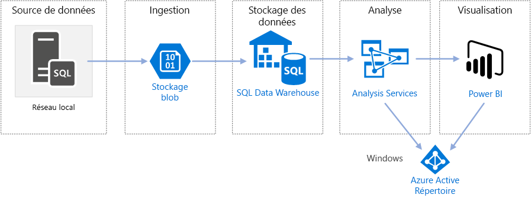
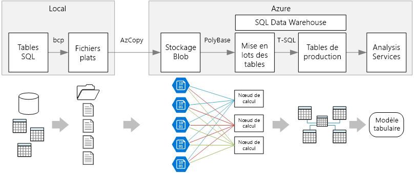

# Enterprise BI dans Azure avec SQL Data WarehouseEnterprise BI in Azure with SQL Data Warehouse

Cette architecture de référence implémente un pipeline [ELT](../../data-guide/relational-data/etl.md#extract-load-and-transform-elt) (extract-load-transform) qui déplace des données d’une base de données SQL Server vers SQL Data Warehouse et qui transforme les données pour les analyser.This reference architecture implements an [extract, load, and transform (ELT)](../../data-guide/relational-data/etl.md#extract-load-and-transform-elt) pipeline that moves data from an on-premises SQL Server database into SQL Data Warehouse and transforms the data for analysis.

Une implémentation de référence pour cette architecture est disponible sur [GitHub][github-folder].A reference implementation for this architecture is available on [GitHub][github-folder].

**Scénario** : Une organisation dispose d’un jeu de données OLTP volumineux stocké dans une base de données SQL Server locale.**Scenario**: An organization has a large OLTP data set stored in a SQL Server database on premises. L’organisation souhaite utiliser SQL Data Warehouse pour réaliser une analyse avec Power BI.The organization wants to use SQL Data Warehouse to perform analysis using Power BI.

Cette architecture de référence est conçue pour des tâches uniques ou à la demande.This reference architecture is designed for one-time or on-demand jobs. Si vous devez déplacer des données continuellement (toutes les heures ou tous les jours), nous vous recommandons d’utiliser Azure Data Factory pour définir un flux de travail automatisé.If you need to move data on a continuing basis (hourly or daily), we recommend using Azure Data Factory to define an automated workflow. Pour accéder à une architecture de référence qui utilise Data Factory, consultez [BI d’entreprise automatisée avec SQL Data Warehouse et Azure Data Factory][adf-ra].For a reference architecture that uses Data Factory, see [Automated enterprise BI with SQL Data Warehouse and Azure Data Factory][adf-ra].

## ArchitectureArchitecture

L’architecture est constituée des composants suivants.The architecture consists of the following components.

### Source de donnéesData source

**SQL Server**.**SQL Server**. Les données sources sont situées dans une base de données SQL Server locale.The source data is located in a SQL Server database on premises. Pour simuler l’environnement local, les scripts de déploiement de cette architecture approvisionnent une machine virtuelle dans Azure disposant de SQL Server.To simulate the on-premises environment, the deployment scripts for this architecture provision a VM in Azure with SQL Server installed. [L’exemple de base de données OLTP Wide World Importers][wwi] est utilisé comme base de données source.The [Wide World Importers OLTP sample database][wwi] is used as the source data.

### Ingestion et stockage de donnéesIngestion and data storage

**Stockage d'objets blob**.**Blob Storage**. Le stockage d’objets blob est utilisé comme zone de préparation à la copie des données, avant de les charger dans SQL Data Warehouse.Blob storage is used as a staging area to copy the data before loading it into SQL Data Warehouse.

**Azure SQL Data Warehouse**.**Azure SQL Data Warehouse**. [SQL Data Warehouse](/azure/sql-data-warehouse/) est un système distribué conçu pour réaliser des analyses sur de grandes quantités de données.[SQL Data Warehouse](/azure/sql-data-warehouse/) is a distributed system designed to perform analytics on large data. Il prend en charge le traitement MPP (Massive Parallel Processing), le rendant ainsi adapté à l’exécution d’analyses hautes performances.It supports massive parallel processing (MPP), which makes it suitable for running high-performance analytics.

### Analyse et rapportsAnalysis and reporting

**Azure Analysis Services**.**Azure Analysis Services**. [Analysis Services](/azure/analysis-services/) est un service entièrement géré qui fournit des capacités de modélisation des données.[Analysis Services](/azure/analysis-services/) is a fully managed service that provides data modeling capabilities. Utilisez Analysis Services pour créer un modèle sémantique que les utilisateurs peuvent demander.Use Analysis Services to create a semantic model that users can query. Analysis Services est particulièrement utile dans un scénario de tableau de bord BI.Analysis Services is especially useful in a BI dashboard scenario. Dans cette architecture, Analysis Services lit les données de l’entrepôt de données pour traiter le modèle sémantique, et délivrer efficacement les requêtes du tableau de bord.In this architecture, Analysis Services reads data from the data warehouse to process the semantic model, and efficiently serves dashboard queries. Il prend aussi en charge la concurrence élastique, en adaptant les réplicas en vue d’un traitement des requêtes plus rapide.It also supports elastic concurrency, by scaling out replicas for faster query processing.

À l’heure actuelle, Azure Analysis Services prend en charge les modèles tabulaires, mais pas les modèles multidimensionnels.Currently, Azure Analysis Services supports tabular models but not multidimensional models. Les modèles tabulaires utilisent des constructions de modélisation relationnelle (tables et colonnes), tandis que les modèles multidimensionnels utilisent des constructions de modélisation de traitement analytique en ligne (cubes, dimensions, et mesures).Tabular models use relational modeling constructs (tables and columns), whereas multidimensional models use OLAP modeling constructs (cubes, dimensions, and measures). Si vous avez besoin de modèles multidimensionnels, utilisez SQL Server Analysis Services (SSAS).If you require multidimensional models, use SQL Server Analysis Services (SSAS). Pour en savoir plus, consultez [Comparaison des solutions tabulaires et multidimensionnelles](/sql/analysis-services/comparing-tabular-and-multidimensional-solutions-ssas).For more information, see [Comparing tabular and multidimensional solutions](/sql/analysis-services/comparing-tabular-and-multidimensional-solutions-ssas).

**Power BI**.**Power BI**. Power BI est une suite d’outils d’analyse métier pour analyser les données et obtenir des informations métier.Power BI is a suite of business analytics tools to analyze data for business insights. Dans cette architecture, il demande le modèle sémantique stocké dans Analysis Services.In this architecture, it queries the semantic model stored in Analysis Services.

### AuthenticationAuthentication

**Azure Active Directory (Azure AD)** authentifie les utilisateurs qui se connectent au serveur Analysis Services via Power BI.**Azure Active Directory (Azure AD)** authenticates users who connect to the Analysis Services server through Power BI.

## Pipeline de donnéesData pipeline

Cette architecture de référence utilise l’exemple de base de données [WorldWideImporters](/sql/sample/world-wide-importers/wide-world-importers-oltp-database) en tant que source de données.This reference architecture uses the [WorldWideImporters](/sql/sample/world-wide-importers/wide-world-importers-oltp-database) sample database as a data source. Le pipeline de données comporte les étapes suivantes :The data pipeline has the following stages:

1. Exportez les données de SQL Server vers des fichiers plats (utilitaire BCP).Export the data from SQL Server to flat files (bcp utility).
2. Copiez les fichiers plats dans le Stockage Blob Azure (AzCopy).Copy the flat files to Azure Blob Storage (AzCopy).
3. Chargez les données dans SQL Data Warehouse à (PolyBase).Load the data into SQL Data Warehouse (PolyBase).
4. Transformez les données en schéma en étoile (T-SQL).Transform the data into a star schema (T-SQL).
5. Chargez un modèle sémantique dans Analysis Services (SQL Server Data Tools).Load a semantic model into Analysis Services (SQL Server Data Tools).

> [!NOTE]
> Pour les étapes 1 &ndash; 3, préférez l’utilisation de Redgate Data Platform Studio.For steps 1 &ndash; 3, consider using Redgate Data Platform Studio. Data Platform Studio applique les correctifs de compatibilité et optimisations les plus appropriés. Il s’agit donc du moyen le plus rapide pour vous familiariser avec SQL Data Warehouse.Data Platform Studio applies the most appropriate compatibility fixes and optimizations, so it's the quickest way to get started with SQL Data Warehouse. Pour en savoir plus, consultez [Chargement de données avec Redgate Data Platform Studio](/azure/sql-data-warehouse/sql-data-warehouse-load-with-redgate).For more information, see [Load data with Redgate Data Platform Studio](/azure/sql-data-warehouse/sql-data-warehouse-load-with-redgate).
>

Les sections suivantes décrivent ces étapes plus en détail.The next sections describe these stages in more detail.

### Exporter des données depuis SQL ServerExport data from SQL Server

L’utilitaire [BCP](/sql/tools/bcp-utility) (programme de copie en bloc) constitue un moyen rapide de créer des fichiers texte plats à partir des tables SQL.The [bcp](/sql/tools/bcp-utility) (bulk copy program) utility is a fast way to create flat text files from SQL tables. Dans cette étape, vous sélectionnez les colonnes que vous souhaitez exporter, mais vous ne transformez pas les données.In this step, you select the columns that you want to export, but don't transform the data. Les transformations de données doivent se faire dans SQL Data Warehouse.Any data transformations should happen in SQL Data Warehouse.

**Recommandations :****Recommendations:**

Si possible, prévoyez l’extraction des données lors des heures creuses afin de minimiser la contention des ressources dans l’environnement de production.If possible, schedule data extraction during off-peak hours, to minimize resource contention in the production environment.

N’exécutez pas l’utilitaire BCP sur le serveur de base de données.Avoid running bcp on the database server. À la place, exécutez-le depuis une autre machine.Instead, run it from another machine. Écrivez les fichiers sur un disque local.Write the files to a local drive. Veillez à disposer de suffisamment de ressources d’E/S pour gérer les écritures simultanées.Ensure that you have sufficient I/O resources to handle the concurrent writes. Pour de meilleures performances, exportez les fichiers vers des disques de stockage rapides dédiés.For best performance, export the files to dedicated fast storage drives.

Vous pouvez accélérer le transfert réseau en enregistrant les données exportées dans un format compressé Gzip.You can speed up the network transfer by saving the exported data in Gzip compressed format. Toutefois, le chargement de fichiers compressés dans l’entrepôt est plus long qu’un chargement de fichiers décompressés. Il faut donc choisir entre un transfert réseau rapide et un chargement rapide.However, loading compressed files into the warehouse is slower than loading uncompressed files, so there is a tradeoff between faster network transfer versus faster loading. Si vous choisissez d’utiliser la compression Gzip, ne créez pas qu’un seul fichier Gzip.If you decide to use Gzip compression, don't create a single Gzip file. À la place, divisez les données en plusieurs fichiers compressés.Instead, split the data into multiple compressed files.

### Copier des fichiers plats dans le stockage d’objets blobCopy flat files into blob storage

L’utilitaire [AzCopy](/azure/storage/common/storage-use-azcopy) est conçu pour la copie hautes performances des données dans le Stockage Blob Azure.The [AzCopy](/azure/storage/common/storage-use-azcopy) utility is designed for high-performance copying of data into Azure blob storage.

**Recommandations :****Recommendations:**

Créez un compte de stockage dans une région proche de l’emplacement des données source.Create the storage account in a region near the location of the source data. Déployez le compte de stockage et l’instance SQL Data Warehouse dans la même région.Deploy the storage account and the SQL Data Warehouse instance in the same region.

N’exécutez pas AzCopy sur la machine qui exécute vos charges de travail de production, car l’unité centrale et la consommation d’E/S peuvent interférer avec elles.Don't run AzCopy on the same machine that runs your production workloads, because the CPU and I/O consumption can interfere with the production workload.

Testez le chargement afin de déterminer la vitesse.Test the upload first to see what the upload speed is like. Vous pouvez utiliser l’option /NC dans AzCopy pour spécifier le nombre d’opérations de copie simultanées.You can use the /NC option in AzCopy to specify the number of concurrent copy operations. Commencez par la valeur par défaut, puis expérimentez avec ce paramètre pour ajuster les performances.Start with the default value, then experiment with this setting to tune the performance. Remarque : un trop grand nombre d’opérations simultanées dans un environnement à faible bande passante peut surcharger la connexion réseau et entraver la réussite des opérations.In a low-bandwidth environment, too many concurrent operations can overwhelm the network connection and prevent the operations from completing successfully.

AzCopy déplace les données vers le stockage via l’Internet public.AzCopy moves data to storage over the public internet. Si ce n’est pas assez rapide, envisagez la configuration d’un circuit [ExpressRoute](/azure/expressroute/).If this isn't fast enough, consider setting up an [ExpressRoute](/azure/expressroute/) circuit. ExpressRoute est un service qui achemine vos données via une connexion privée dédiée vers Azure.ExpressRoute is a service that routes your data through a dedicated private connection to Azure. Si votre connexion réseau est trop lente, une autre option consiste à envoyer les données physiquement sur disque vers un centre de données Azure.Another option, if your network connection is too slow, is to physically ship the data on disk to an Azure datacenter. Pour plus d’informations, consultez l’article [Transférer des données vers et à partir d’Azure](/azure/architecture/data-guide/scenarios/data-transfer).For more information, see [Transferring data to and from Azure](/azure/architecture/data-guide/scenarios/data-transfer).

Lors d’une opération de copie, AzCopy crée un fichier journal temporaire, qui permet à AzCopy de redémarrer l’opération si elle est interrompue (à cause d’une erreur réseau, par exemple).During a copy operation, AzCopy creates a temporary journal file, which enables AzCopy to restart the operation if it gets interrupted (for example, due to a network error). Veillez à disposer de suffisamment d’espace disque pour stocker les fichiers journaux.Make sure there is enough disk space to store the journal files. Vous pouvez utiliser l’option /Z pour spécifier où sont écrits les fichiers journaux.You can use the /Z option to specify where the journal files are written.

### Chargement de données dans SQL Data WarehouseLoad data into SQL Data Warehouse

Utilisez [PolyBase](/sql/relational-databases/polybase/polybase-guide) pour charger des fichiers du stockage d’objets blob vers l’entrepôt de données.Use [PolyBase](/sql/relational-databases/polybase/polybase-guide) to load the files from blob storage into the data warehouse. PolyBase est conçu pour tirer parti de l’architecture MPP (Massively Parallel Processing) de SQL Data Warehouse, ce qui en fait le moyen le plus rapide pour y charger des données.PolyBase is designed to leverage the MPP (Massively Parallel Processing) architecture of SQL Data Warehouse, which makes it the fastest way to load data into SQL Data Warehouse.

Le chargement des données est un processus en deux étapes :Loading the data is a two-step process:

1. Créez un ensemble de tables externes pour les données.Create a set of external tables for the data. Une table externe est une définition de table qui pointe vers des données stockées à l’extérieur de l’entrepôt &mdash;. Dans notre cas, il s’agit des fichiers plats dans le stockage d’objets blob.An external table is a table definition that points to data stored outside of the warehouse &mdash; in this case, the flat files in blob storage. Cette étape ne déplace aucune donnée dans l’entrepôt.This step does not move any data into the warehouse.
2. Créez des tables de mise en lots, et chargez-y les données.Create staging tables, and load the data into the staging tables. Cette étape copie les données dans l’entrepôt.This step copies the data into the warehouse.

**Recommandations :****Recommendations:**

Préférez utiliser SQL Data Warehouse lorsque vous disposez d’une importante quantité de données (supérieure à 1 To) et que vous exécutez une charge de travail d’analyse qui profiterait de ce parallélisme.Consider SQL Data Warehouse when you have large amounts of data (more than 1 TB) and are running an analytics workload that will benefit from parallelism. SQL Data Warehouse ne convient pas à des charges de travail OLTP ni à des jeux de données moins importants (inférieurs à 250 Go).SQL Data Warehouse is not a good fit for OLTP workloads or smaller data sets (< 250GB). Pour les jeux de données inférieurs à 250 Go, préférez utiliser Azure SQL Database ou SQL Server.For data sets less than 250GB, consider Azure SQL Database or SQL Server. Pour plus d’informations, consultez la page [Entreposage des données](../../data-guide/relational-data/data-warehousing.md).For more information, see [Data warehousing](../../data-guide/relational-data/data-warehousing.md).

Créez les tables de mise en lots comme tables de segments de mémoire, qui ne sont pas indexées.Create the staging tables as heap tables, which are not indexed. Les requêtes qui créent les tables de production créeront une analyse de table complète. Il n’y a donc aucune raison d’indexer les tables de mise en lots.The queries that create the production tables will result in a full table scan, so there is no reason to index the staging tables.

PolyBase tire automatiquement parti du parallélisme dans l’entrepôt.PolyBase automatically takes advantage of parallelism in the warehouse. Les performances de chargement s’adaptent à mesure que vous augmentez les DWU (Data Warehouse Units).The load performance scales as you increase DWUs. Pour de meilleures performances, utilisez une seule opération de chargement.For best performance, use a single load operation. Il n’y a pas d’améliorations de performances pour diviser les données entrantes et exécuter plusieurs chargements simultanés.There is no performance benefit to breaking the input data into chunks and running multiple concurrent loads.

PolyBase peut lire les fichiers compressés au format Gzip.PolyBase can read Gzip compressed files. Toutefois, seul un lecteur unique est utilisé par fichier compressé, car la décompression du fichier est une opération à un seul thread.However, only a single reader is used per compressed file, because uncompressing the file is a single-threaded operation. Évitez donc de charger un seul gros fichier compressé.Therefore, avoid loading a single large compressed file. À la place, divisez les données en plusieurs fichiers compressés, afin de tirer parti du parallélisme.Instead, split the data into multiple compressed files, in order to take advantage of parallelism.

Notez les limitations suivantes :Be aware of the following limitations:

- PolyBase prend en charge une taille de colonne maximale de `varchar(8000)`, `nvarchar(4000)` ou `varbinary(8000)`.PolyBase supports a maximum column size of `varchar(8000)`, `nvarchar(4000)`, or `varbinary(8000)`. Si vos données dépassent ces limites, une option consiste à les diviser au moment de les exporter, puis de les réassembler après les avoir importées.If you have data that exceeds these limits, one option is to break the data up into chunks when you export it, and then reassemble the chunks after import.

- PolyBase utilise un terminateur de ligne fixe \n ou un renvoi à la ligne.PolyBase uses a fixed row terminator of \n or newline. Cela peut entraîner des problèmes si les caractères de renvoi à la ligne apparaissent dans les données source.This can cause problems if newline characters appear in the source data.

- Votre schéma des données source peut contenir des types de données qui ne sont pas pris en charge dans SQL Data Warehouse.Your source data schema might contain data types that are not supported in SQL Data Warehouse.

Pour contourner ces limitations, vous pouvez créer une procédure stockée qui réalise les conversions nécessaires.To work around these limitations, you can create a stored procedure that performs the necessary conversions. Référencez cette procédure stockée lorsque vous exécutez l’utilitaire BCP.Reference this stored procedure when you run bcp. Autrement, [Redgate Data Platform Studio](/azure/sql-data-warehouse/sql-data-warehouse-load-with-redgate) convertit automatiquement les types de données qui ne sont pas pris en charge dans SQL Data Warehouse.Alternatively, [Redgate Data Platform Studio](/azure/sql-data-warehouse/sql-data-warehouse-load-with-redgate) automatically converts data types that aren’t supported in SQL Data Warehouse.

Pour plus d’informations, consultez les articles suivants :For more information, see the following articles:

- [Meilleures pratiques de chargement de données dans Azure SQL Data Warehouse](/azure/sql-data-warehouse/guidance-for-loading-data).[Best practices for loading data into Azure SQL Data Warehouse](/azure/sql-data-warehouse/guidance-for-loading-data).
- [Migration de votre schéma vers SQL Data WarehouseMigrate your schemas to SQL Data Warehouse](/azure/sql-data-warehouse/sql-data-warehouse-migrate-schema)
- [Conseils relatifs à la définition des types de données pour tables dans SQL Data WarehouseGuidance for defining data types for tables in SQL Data Warehouse](/azure/sql-data-warehouse/sql-data-warehouse-tables-data-types)

### Transformer les donnéesTransform the data

Transformez les données et les déplacer dans des tables de production.Transform the data and move it into production tables. Dans cette étape, les données sont transformées en schéma en étoile avec des tables de dimension et de faits, adaptées à la modélisation sémantique.In this step, the data is transformed into a star schema with dimension tables and fact tables, suitable for semantic modeling.

Créez les tables de production avec des index columstore en cluster, ce qui offre les meilleures performances globales de requête.Create the production tables with clustered columnstore indexes, which offer the best overall query performance. Les index columnstore sont optimisés pour les requêtes qui analysent de nombreux enregistrements.Columnstore indexes are optimized for queries that scan many records. Les index columnstore ne sont pas aussi efficaces pour les recherches singleton (rechercher une seule ligne).Columnstore indexes don't perform as well for singleton lookups (that is, looking up a single row). Si vous avez besoin d’effectuer fréquemment des recherches singleton, vous pouvez ajouter un index non cluster à une table.If you need to perform frequent singleton lookups, you can add a non-clustered index to a table. Les recherches singleton peuvent s’exécuter bien plus rapidement avec un index non cluster.Singleton lookups can run significantly faster using a non-clustered index. Toutefois, elles sont généralement moins fréquentes dans des scénarios d’entrepôt de données que des charges de travail OLTP.However, singleton lookups are typically less common in data warehouse scenarios than OLTP workloads. Pour plus d’informations, consultez [Indexage de tables dans SQL Data Warehouse](/azure/sql-data-warehouse/sql-data-warehouse-tables-index).For more information, see [Indexing tables in SQL Data Warehouse](/azure/sql-data-warehouse/sql-data-warehouse-tables-index).

> [!NOTE]
> Les tables columnstore cluster ne prennent pas en charge les types de données `varchar(max)`, `nvarchar(max)` ou `varbinary(max)`.Clustered columnstore tables do not support `varchar(max)`, `nvarchar(max)`, or `varbinary(max)` data types. Dans ces cas, préférez utiliser un segment de mémoire ou un index cluster.In that case, consider a heap or clustered index. Vous pouvez placer ces colonnes dans une table distincte.You might put those columns into a separate table.

Comme l’exemple de base de données n’est pas très important, nous avons créé des tables répliquées sans partition.Because the sample database is not very large, we created replicated tables with no partitions. Pour les charges de travail de production, l’utilisation de tables distribuées a des chances d’améliorer les performances de requête.For production workloads, using distributed tables is likely to improve query performance. Consultez le [Guide de conception des tables distribuées dans Azure SQL Data Warehouse](/azure/sql-data-warehouse/sql-data-warehouse-tables-distribute).See [Guidance for designing distributed tables in Azure SQL Data Warehouse](/azure/sql-data-warehouse/sql-data-warehouse-tables-distribute). Nos exemples de scripts exécutent les requêtes avec une [classe de ressources](/azure/sql-data-warehouse/resource-classes-for-workload-management) statique.Our example scripts run the queries using a static [resource class](/azure/sql-data-warehouse/resource-classes-for-workload-management).

### Charger le modèle sémantiqueLoad the semantic model

Chargez les données dans un modèle tabulaire dans Azure Analysis Services.Load the data into a tabular model in Azure Analysis Services. Dans cette étape, vous créez un modèle de données sémantique avec SQL Server Data Tools (SSDT).In this step, you create a semantic data model by using SQL Server Data Tools (SSDT). Vous pouvez aussi créer un modèle en l’important depuis un fichier Power BI Desktop.You can also create a model by importing it from a Power BI Desktop file. Comme SQL Data Warehouse ne prend pas en charge les clés étrangères, vous devez ajouter les relations au modèle sémantique afin de joindre les tables.Because SQL Data Warehouse does not support foreign keys, you must add the relationships to the semantic model, so that you can join across tables.

### Utiliser Power BI pour visualiser les donnéesUse Power BI to visualize the data

Power BI prend en charge deux options pour la connexion à Azure Analysis Services :Power BI supports two options for connecting to Azure Analysis Services:

- Importation.Import. Les données sont importées dans le modèle Power BI.The data is imported into the Power BI model.
- Connexion active.Live Connection. Les données sont extraites directement depuis Analysis Services.Data is pulled directly from Analysis Services.

Nous vous recommandons l’option Connexion active car elle ne nécessite pas de copier des données dans le modèle Power BI.We recommend Live Connection because it doesn't require copying data into the Power BI model. De plus, DirectQuery veille à ce que les résultats soient toujours cohérents avec les données sources les plus récentes.Also, using DirectQuery ensures that results are always consistent with the latest source data. Pour plus d’informations, consultez [Connexion avec Power BI](/azure/analysis-services/analysis-services-connect-pbi).For more information, see [Connect with Power BI](/azure/analysis-services/analysis-services-connect-pbi).

**Recommandations :****Recommendations:**

N’exécutez pas des requêtes de tableau de bord BI directement dans l’entrepôt de données.Avoid running BI dashboard queries directly against the data warehouse. Les tableaux de bord BI nécessitent des temps de réponse très lents. Les requêtes directes dans l’entrepôt de données peuvent ne pas être adaptées.BI dashboards require very low response times, which direct queries against the warehouse may be unable to satisfy. De plus, l’actualisation du tableau de bord comptera dans le nombre de requêtes simultanées, ce qui peut impacter les performances.Also, refreshing the dashboard will count against the number of concurrent queries, which could impact performance.

Azure Analysis Services est conçu pour gérer les exigences de requête d’un tableau de bord BI. Il est donc recommandé d’effectuer des requêtes Analysis Services depuis Power BI.Azure Analysis Services is designed to handle the query requirements of a BI dashboard, so the recommended practice is to query Analysis Services from Power BI.

## Considérations relatives à l’extensibilitéScalability considerations

### SQL Data WarehouseSQL Data Warehouse

Avec SQL Data Warehouse, vous pouvez augmenter la taille de vos ressources de calcul à la demande.With SQL Data Warehouse, you can scale out your compute resources on demand. Le moteur de requête optimise les requêtes pour des traitements simultanés basés sur le nombre de nœuds de calcul, et déplace les données entre nœuds si nécessaire.The query engine optimizes queries for parallel processing based on the number of compute nodes, and moves data between nodes as necessary. Pour plus d’informations, consultez [Gérer le calcul dans Azure SQL Data Warehouse](/azure/sql-data-warehouse/sql-data-warehouse-manage-compute-overview).For more information, see [Manage compute in Azure SQL Data Warehouse](/azure/sql-data-warehouse/sql-data-warehouse-manage-compute-overview).

### Analysis ServicesAnalysis Services

Pour les charges de travail de production, nous recommandons le niveau Standard pour Azure Analysis Services, car il prend en charge le partitionnement et DirectQuery.For production workloads, we recommend the Standard Tier for Azure Analysis Services, because it supports partitioning and DirectQuery. Dans un niveau, la taille de l’instance détermine la mémoire et la puissance de traitement.Within a tier, the instance size determines the memory and processing power. La puissance de traitement se mesure en QPU (Unité de traitement des requêtes).Processing power is measured in Query Processing Units (QPUs). Surveillez votre utilisation QPU pour sélectionner la taille appropriée.Monitor your QPU usage to select the appropriate size. Pour plus d’informations, voir [Surveiller les mesures du serveur](/azure/analysis-services/analysis-services-monitor).For more information, see [Monitor server metrics](/azure/analysis-services/analysis-services-monitor).

Sous une charge importante, les performances de requête peuvent se dégrader en raison de la simultanéité des requêtes.Under high load, query performance can become degraded due to query concurrency. Vous pouvez augmenter la taille d’Analyse Services en créant un pool de réplicas pour traiter des requêtes, dans le but de pouvoir réaliser plus de requêtes simultanément.You can scale out Analysis Services by creating a pool of replicas to process queries, so that more queries can be performed concurrently. Le traitement du modèle des données se fait toujours sur le serveur principal.The work of processing the data model always happens on the primary server. Par défaut, le serveur principal gère aussi les requêtes.By default, the primary server also handles queries. Optionnellement, vous pouvez désigner le serveur principal pour qu’il n’exécute que le traitement, afin que le pool de requêtes gère toutes les requêtes.Optionally, you can designate the primary server to run processing exclusively, so that the query pool handles all queries. Si vous avez des exigences de traitement élevées, vous devriez séparer le traitement et le pool de requêtes.If you have high processing requirements, you should separate the processing from the query pool. Si vous avez des charges de requêtes importantes, et un traitement relativement léger, vous pouvez inclure le serveur principal dans le pool de requêtes.If you have high query loads, and relatively light processing, you can include the primary server in the query pool. Pour en savoir plus, consultez [Extensibilité d’Azure Analysis Services](/azure/analysis-services/analysis-services-scale-out).For more information, see [Azure Analysis Services scale-out](/azure/analysis-services/analysis-services-scale-out).

Pour réduire la quantité de traitement inutile, préférez utiliser des partitions pour diviser le modèle tabulaire en plusieurs parties logiques.To reduce the amount of unnecessary processing, consider using partitions to divide the tabular model into logical parts. Chaque partition peut être traitée séparément.Each partition can be processed separately. Pour plus d'informations, consultez [Partitions](/sql/analysis-services/tabular-models/partitions-ssas-tabular).For more information, see [Partitions](/sql/analysis-services/tabular-models/partitions-ssas-tabular).

## Considérations relatives à la sécuritéSecurity considerations

### Liste verte IP des clients Analysis ServicesIP whitelisting of Analysis Services clients

Utilisez la fonctionnalité de pare-feu Analysis Services pour mettre les adresses IP client sur liste verte.Consider using the Analysis Services firewall feature to whitelist client IP addresses. S’il est activé, le pare-feu bloque toutes les connexions clients autres que celles spécifiées dans les règles du pare-feu.If enabled, the firewall blocks all client connections other than those specified in the firewall rules. Les règles par défaut mettent le service Power BI sur liste verte, mais vous pouvez désactiver cette règle si vous le souhaitez.The default rules whitelist the Power BI service, but you can disable this rule if desired. Pour plus d’informations, consultez [Hardening Azure Analysis Services with the new firewall capability](https://azure.microsoft.com/blog/hardening-azure-analysis-services-with-the-new-firewall-capability/)(Consolidation d’Azure Analysis Services avec la nouvelle capacité de pare-feu).For more information, see [Hardening Azure Analysis Services with the new firewall capability](https://azure.microsoft.com/blog/hardening-azure-analysis-services-with-the-new-firewall-capability/).

### AuthorizationAuthorization

Azure Analysis Services utilise Azure Active Directory (Azure AD) pour authentifier les utilisateurs qui se connectent à un serveur Analysis Services.Azure Analysis Services uses Azure Active Directory (Azure AD) to authenticate users who connect to an Analysis Services server. Vous pouvez limiter les données qu’un utilisateur spécifique peut consulter en créant des rôles et en les assignant à des utilisateurs ou groupes Azure AD.You can restrict what data a particular user is able to view, by creating roles and then assigning Azure AD users or groups to those roles. Pour chaque rôle, vous pouvez :For each role, you can:

- Protégez des tables ou des colonnes individuelles.Protect tables or individual columns.
- Protégez des lignes individuelles basées sur des expressions filtrées.Protect individual rows based on filter expressions.

Pour en savoir plus, consultez [Gérer les rôles et les utilisateurs de bases de données](/azure/analysis-services/analysis-services-database-users).For more information, see [Manage database roles and users](/azure/analysis-services/analysis-services-database-users).

## Déployer la solutionDeploy the solution

Pour déployer et exécuter l’implémentation de référence, suivez les étapes du [fichier Readme de GitHub][github-folder].To the deploy and run the reference implementation, follow the steps in the [GitHub readme][github-folder]. Il déploie les éléments suivants :It deploys the following:

- Une machine virtuelle pour simuler un serveur de base de données local.A Windows VM to simulate an on-premises database server. Sont inclus SQL Server 2017 et les outils associés, et Power BI Desktop.It includes SQL Server 2017 and related tools, along with Power BI Desktop.
- Un compte de stockage Azure qui fournit le stockage d’objets blob pour conserver des données exportées de la base de données SQL Server.An Azure storage account that provides Blob storage to hold data exported from the SQL Server database.
- Une instance Azure SQL Data Warehouse.An Azure SQL Data Warehouse instance.
- Une instance Azure Analysis Services.An Azure Analysis Services instance.

## Étapes suivantesNext steps

- Utilisez Azure Data Factory pour automatiser le pipeline ELT.Use Azure Data Factory to automate the ELT pipeline. Voir [BI d’entreprise automatisée avec SQL Data Warehouse et Azure Data Factory][adf-ra].See [Automated enterprise BI with SQL Data Warehouse and Azure Data Factory][adf-ra].

## Ressources associéesRelated resources

Vous pouvez consulter les [exemples de scénarios Azure](/azure/architecture/example-scenario) suivants, qui décrivent des solutions spécifiques utilisant certaines de ces technologies :You may want to review the following [Azure example scenarios](/azure/architecture/example-scenario) that demonstrate specific solutions using some of the same technologies:

- [Entreposage et analyse des données pour les ventes et le marketingData warehousing and analytics for sales and marketing](/azure/architecture/example-scenario/data/data-warehouse)
- [ETL hybride avec des instances SSIS locales existantes et Azure Data FactoryHybrid ETL with existing on-premises SSIS and Azure Data Factory](/azure/architecture/example-scenario/data/hybrid-etl-with-adf)

<!-- links -->

[adf-ra]: ./enterprise-bi-adf.md
[github-folder]: https://github.com/mspnp/reference-architectures/tree/master/data/enterprise_bi_sqldw
[wwi]: /sql/sample/world-wide-importers/wide-world-importers-oltp-database
