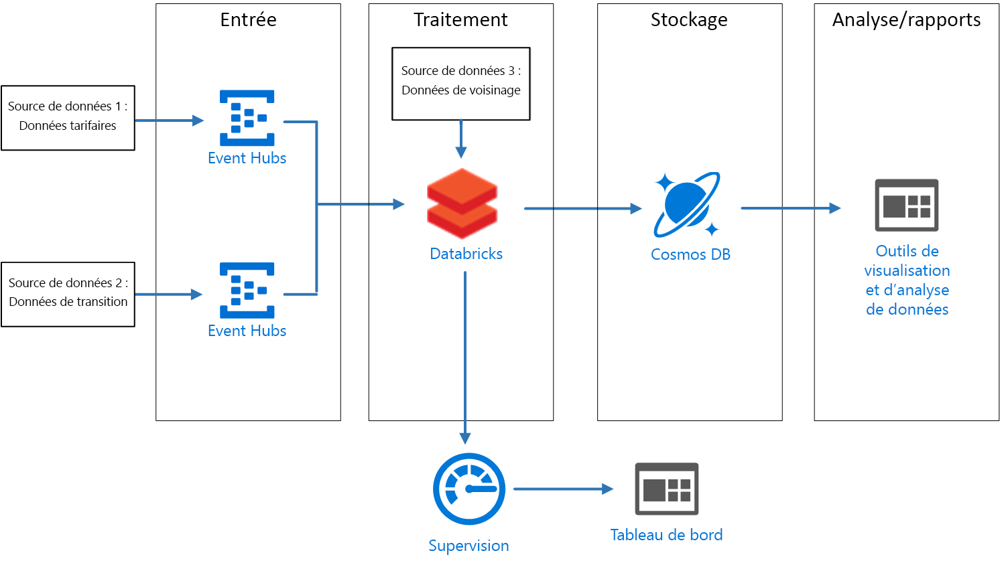
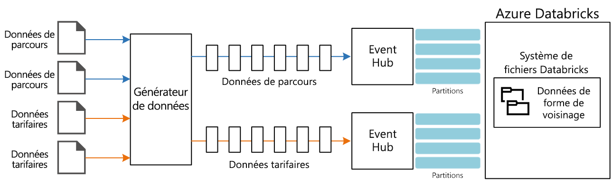

# <a name="create-a-stream-processing-pipeline-with-azure-databricks"></a>Créer un pipeline de traitement de flux avec Azure Databricks

Cette architecture de référence présente un pipeline de [traitement de flux](/azure/architecture/data-guide/big-data/real-time-processing) de bout en bout. Ce type de pipeline comprend quatre étapes : ingestion, traitement, stockage, analyse et création de rapports. Pour cette architecture de référence, le pipeline ingère des données issues de deux sources, effectue une jonction sur les enregistrements apparentés de chaque flux, enrichit le résultat et calcule une moyenne en temps réel. Les résultats sont stockés en vue d’une analyse plus approfondie. [**Déployez cette solution**](#deploy-the-solution).



**Scénario** : Une compagnie de taxis collecte des données sur chaque trajet effectué en taxi. Pour ce scénario, nous partons du principe que deux périphériques distincts envoient des données. Le taxi est équipé d’un compteur qui envoie les informations suivantes sur chaque course : durée, distance et lieux de prise en charge et de dépose. Un autre périphérique accepte les paiements des clients et envoie des données sur les tarifs. Afin de déterminer les tendances des usagers, la compagnie de taxis souhaite calculer le pourboire moyen par mile parcouru, en temps réel, pour chaque quartier.

## <a name="architecture"></a>Architecture

L’architecture est constituée des composants suivants.

**Sources de données**. Dans cette architecture, deux sources de données génèrent des flux de données en temps réel. Le premier flux de données contient des informations sur les courses, tandis que le second contient des informations sur les tarifs. L’architecture de référence comprend un générateur de données simulées qui lit le contenu d’un ensemble de fichiers statiques et envoie (push) les données vers Event Hubs. Les sources de données dans une application réelle seraient les appareils installés dans les taxis.

**Azure Event Hubs**. [Event Hubs](/azure/event-hubs/) est un service d’ingestion d’événements. Cette architecture utilise deux instances d’Event Hub, à savoir une par source de données. Chaque source de données envoie un flux de données à l’Event Hub associé.

**Azure Databricks**. [Databricks](/azure/azure-databricks/) est une plateforme d’analytique basée sur Apache Spark et optimisée pour la plateforme de services cloud Microsoft Azure. Databricks est utilisé pour mettre en corrélation les données de courses et de tarifs des taxis, mais aussi pour enrichir les données mises en corrélation avec les données de quartiers stockées dans le système de fichiers Databricks.

**Cosmos DB**. La sortie d’un travail Azure Databricks est une série d’enregistrements écrits dans [Cosmos DB](/azure/cosmos-db/) à l’aide de l’API Cassandra. Si l’API Cassandra est utilisée, c’est parce qu’elle prend en charge la modélisation de données de séries chronologiques.

**Azure Log Analytics**. Les données de journal d’application collectées par [Azure Monitor](/azure/monitoring-and-diagnostics/) sont stockées dans un [espace de travail Log Analytics](/azure/log-analytics). Il est possible d’utiliser des requêtes Log Analytics pour analyser et visualiser les métriques et inspecter les messages de journal pour identifier les problèmes au sein de l’application.

## <a name="data-ingestion"></a>Ingestion de données

<!-- markdownlint-disable MD033 -->

Pour simuler une source de données, cette architecture de référence utilise les [données des taxis de la ville de New York](https://uofi.app.box.com/v/NYCtaxidata/folder/2332218797) <sup>[[1]](#note1)</sup>. Ce jeu de données contient des données sur les courses de taxis à New York sur une période de quatre ans (2010 &ndash; 2013). Il contient deux types d’informations : Données de course et données de tarif. Les premières incluent la durée du trajet, la distance et les lieux de prise en charge et de dépose. Les secondes incluent le montant des tarifs des courses, des taxes et des pourboires. Les champs communs aux deux types d’enregistrement sont le numéro de médaillon (« taxi jaune »), le permis spécial et l’ID fournisseur. Ensemble ces trois champs identifient un taxi ainsi qu’un chauffeur. Les données sont stockées au format CSV.

> [1] <span id="note1">Donovan, Brian; Work, Dan (2016) : Données de trajet des taxis de New York (2010-2013). Université de l’Illinois, Urbana-Champaign. <https://doi.org/10.13012/J8PN93H8>

<!-- markdownlint-enable MD033 -->

Le générateur de données est une application .NET Core qui lit les enregistrements et les envoie à Azure Event Hubs. Le générateur envoie les données des courses au format JSON et les données relatives aux tarifs au format CSV.

Le service Event Hubs utilise des [partitions](/azure/event-hubs/event-hubs-features#partitions) pour segmenter les données. Ce système de partition permet à un consommateur de lire chaque partition en parallèle. Lorsque vous envoyez des données à Event Hubs, vous pouvez spécifier explicitement la clé de partition. Sinon, les enregistrements sont affectés aux partitions de manière alternée.

Dans ce scénario, les données de courses et de tarifs doivent se retrouver avec le même ID de partition pour un taxi donné. Cela permet à Databricks d’appliquer un degré de parallélisme quand il met en corrélation les deux flux. Un enregistrement dans la partition *n* des données des courses correspond à un enregistrement de la partition *n* des données relatives aux tarifs.



Dans le générateur de données, le modèle de données commun pour les deux types d’enregistrement comprend une propriété `PartitionKey`, qui est la concaténation de `Medallion`, `HackLicense` et `VendorId`.

```csharp
public abstract class TaxiData
{
    public TaxiData()
    {
    }

    [JsonProperty]
    public long Medallion { get; set; }

    [JsonProperty]
    public long HackLicense { get; set; }

    [JsonProperty]
    public string VendorId { get; set; }

    [JsonProperty]
    public DateTimeOffset PickupTime { get; set; }

    [JsonIgnore]
    public string PartitionKey
    {
        get => $"{Medallion}_{HackLicense}_{VendorId}";
    }
```

Cette propriété est utilisée pour fournir une clé de partition explicite lors de l’envoi des données vers Event Hubs :

```csharp
using (var client = pool.GetObject())
{
    return client.Value.SendAsync(new EventData(Encoding.UTF8.GetBytes(
        t.GetData(dataFormat))), t.PartitionKey);
}
```

### <a name="event-hubs"></a>Event Hubs

La capacité de débit du service Event Hubs est mesurée par les [unités de débit](/azure/event-hubs/event-hubs-features#throughput-units). Vous pouvez mettre automatiquement à l’échelle un Event Hub en activant [l’augmentation automatique](/azure/event-hubs/event-hubs-auto-inflate), qui ajuste automatiquement les unités de débit en fonction du trafic, jusqu’à la limite configurée.

## <a name="stream-processing"></a>Traitement des flux de données

Dans Azure Databricks, le traitement des données est assuré par un travail. Le travail est attribué à un cluster, qui en assure l’exécution. Le travail peut être du code personnalisé écrit en Java ou un [notebook](https://docs.databricks.com/user-guide/notebooks/index.html) Spark.

Dans cette architecture de référence, le travail est une archive Java avec des classes écrites en Java et Scala. Au moment de spécifier l’archive Java pour un travail Databricks, la classe doit être spécifiée en vue d’une exécution par le cluster Databricks. Ici, la méthode **main** de la classe **com.microsoft.pnp.TaxiCabReader** contient la logique de traitement des données.

### <a name="reading-the-stream-from-the-two-event-hub-instances"></a>Lecture du flux à partir des deux instances de hub d’événements

La logique de traitement des données utilise [Spark Structured Streaming](https://spark.apache.org/docs/2.1.2/structured-streaming-programming-guide.html) pour lire dans les deux instances de hub d’événements Azure :

```scala
val rideEventHubOptions = EventHubsConf(rideEventHubConnectionString)
      .setConsumerGroup(conf.taxiRideConsumerGroup())
      .setStartingPosition(EventPosition.fromStartOfStream)
    val rideEvents = spark.readStream
      .format("eventhubs")
      .options(rideEventHubOptions.toMap)
      .load

    val fareEventHubOptions = EventHubsConf(fareEventHubConnectionString)
      .setConsumerGroup(conf.taxiFareConsumerGroup())
      .setStartingPosition(EventPosition.fromStartOfStream)
    val fareEvents = spark.readStream
      .format("eventhubs")
      .options(fareEventHubOptions.toMap)
      .load
```

### <a name="enriching-the-data-with-the-neighborhood-information"></a>Enrichissement des données avec les informations de quartiers

Les données de courses comprennent les coordonnées de latitude et de longitude des lieux de prise en charge et de dépôt des clients. Même si ces coordonnées sont utiles, elles ne sont pas facilement exploitables pour l’analyse. Par conséquent, ces données sont enrichies avec les données de quartiers lues dans un [fichier de forme](https://en.wikipedia.org/wiki/Shapefile).

De format binaire, le fichier de forme ne s’analyse pas facilement, mais la bibliothèque [GeoTools](http://geotools.org/) propose des outils pour les données géospatiales qui utilisent le format de fichier de forme. Cette bibliothèque est utilisée dans la classe **com.microsoft.pnp.GeoFinder** pour déterminer le nom du quartier en fonction des coordonnées de prise en charge et de dépôt.

```scala
val neighborhoodFinder = (lon: Double, lat: Double) => {
      NeighborhoodFinder.getNeighborhood(lon, lat).get()
    }
```

### <a name="joining-the-ride-and-fare-data"></a>Jonction des données de courses et de tarifs

Dans un premier temps, les données de courses et de tarifs sont transformées :

```scala
    val rides = transformedRides
      .filter(r => {
        if (r.isNullAt(r.fieldIndex("errorMessage"))) {
          true
        }
        else {
          malformedRides.add(1)
          false
        }
      })
      .select(
        $"ride.*",
        to_neighborhood($"ride.pickupLon", $"ride.pickupLat")
          .as("pickupNeighborhood"),
        to_neighborhood($"ride.dropoffLon", $"ride.dropoffLat")
          .as("dropoffNeighborhood")
      )
      .withWatermark("pickupTime", conf.taxiRideWatermarkInterval())

    val fares = transformedFares
      .filter(r => {
        if (r.isNullAt(r.fieldIndex("errorMessage"))) {
          true
        }
        else {
          malformedFares.add(1)
          false
        }
      })
      .select(
        $"fare.*",
        $"pickupTime"
      )
      .withWatermark("pickupTime", conf.taxiFareWatermarkInterval())
```

Les données de courses sont ensuite jointes aux données de tarifs :

```scala
val mergedTaxiTrip = rides.join(fares, Seq("medallion", "hackLicense", "vendorId", "pickupTime"))
```

### <a name="processing-the-data-and-inserting-into-cosmos-db"></a>Traitement des données et insertion dans Cosmos DB

Le montant du tarif moyen pour chaque quartier est calculé pour un intervalle de temps donné :

```scala
val maxAvgFarePerNeighborhood = mergedTaxiTrip.selectExpr("medallion", "hackLicense", "vendorId", "pickupTime", "rateCode", "storeAndForwardFlag", "dropoffTime", "passengerCount", "tripTimeInSeconds", "tripDistanceInMiles", "pickupLon", "pickupLat", "dropoffLon", "dropoffLat", "paymentType", "fareAmount", "surcharge", "mtaTax", "tipAmount", "tollsAmount", "totalAmount", "pickupNeighborhood", "dropoffNeighborhood")
      .groupBy(window($"pickupTime", conf.windowInterval()), $"pickupNeighborhood")
      .agg(
        count("*").as("rideCount"),
        sum($"fareAmount").as("totalFareAmount"),
        sum($"tipAmount").as("totalTipAmount")
      )
      .select($"window.start", $"window.end", $"pickupNeighborhood", $"rideCount", $"totalFareAmount", $"totalTipAmount")
```

Il est ensuite inséré dans Cosmos DB :

```scala
maxAvgFarePerNeighborhood
      .writeStream
      .queryName("maxAvgFarePerNeighborhood_cassandra_insert")
      .outputMode(OutputMode.Append())
      .foreach(new CassandraSinkForeach(connector))
      .start()
      .awaitTermination()
```

## <a name="security-considerations"></a>Considérations relatives à la sécurité

L’accès à l’espace de travail Azure Database est contrôlé à l’aide de la [console administrateur](https://docs.databricks.com/administration-guide/admin-settings/index.html). La console administrateur comprend une fonctionnalité qui permet d’ajouter des utilisateurs, de gérer les autorisations utilisateur et de configurer l’authentification unique. Le contrôle d’accès pour les espaces de travail, les clusters, les travaux et les tables peut aussi être défini via la console administrateur.

### <a name="managing-secrets"></a>Gestion des secrets

Azure Databricks comprend un [magasin des secrets](https://docs.azuredatabricks.net/user-guide/secrets/index.html) dans lequel sont stockés les secrets, notamment les chaînes de connexion, les clés d’accès, les noms d’utilisateur et les mots de passe. Les secrets contenus dans le magasin des secrets Azure Databricks sont partitionnés par **étendues** (scope) :

```bash
databricks secrets create-scope --scope "azure-databricks-job"
```

Les secrets sont ajoutés au niveau de l’étendue :

```bash
databricks secrets put --scope "azure-databricks-job" --key "taxi-ride"
```

> [!NOTE]
> Il est possible d’utiliser une étendue adossée à Azure Key Vault à la place de l’étendue Azure Databricks native. Pour en savoir plus, consultez la page relative aux [étendues adossées à Azure Key Vault](https://docs.azuredatabricks.net/user-guide/secrets/secret-scopes.html#azure-key-vault-backed-scopes).

Dans le code, les secrets sont accessibles via les [utilitaires de secrets](https://docs.databricks.com/user-guide/dev-tools/dbutils.html#secrets-utilities) Azure Databricks.

## <a name="monitoring-considerations"></a>Surveillance - Éléments à prendre en compte

Azure Databricks est basé sur Apache Spark et tous deux utilisent [log4j](https://logging.apache.org/log4j/2.x/) comme bibliothèque standard pour la journalisation. En plus de la journalisation par défaut fournie par Apache Spark, cette architecture de référence envoie des journaux et des métriques à [Azure Log Analytics](/azure/log-analytics/).

La classe **com.microsoft.pnp.TaxiCabReader** configure le système de journalisation Apache Spark pour envoyer ses journaux à Azure Log Analytics en utilisant les valeurs contenues dans le fichier **log4j.properties**. Si les messages du journaliseur Apache Spark sont des chaînes, Azure Log Analytics nécessite de son côté des messages de journal au format JSON. La classe **com.microsoft.pnp.log4j.LogAnalyticsAppender** transforme ces messages au format JSON :

```scala

    @Override
    protected void append(LoggingEvent loggingEvent) {
        if (this.layout == null) {
            this.setLayout(new JSONLayout());
        }

        String json = this.getLayout().format(loggingEvent);
        try {
            this.client.send(json, this.logType);
        } catch(IOException ioe) {
            LogLog.warn("Error sending LoggingEvent to Log Analytics", ioe);
        }
    }

```

Comme la classe **com.microsoft.pnp.TaxiCabReader** traite les messages relatifs aux courses et aux tarifs, il est possible que l’un des deux soit mal formé et donc non valide. Dans un environnement de production, il est important d’analyser ces messages mal formés pour identifier un problème au niveau des sources de données et le résoudre rapidement pour éviter toute perte de données. La classe **com.microsoft.pnp.TaxiCabReader** inscrit un accumulateur Apache Spark qui assure le suivi du nombre d’enregistrements relatifs aux courses et aux tarifs mal formés :

```scala
    @transient val appMetrics = new AppMetrics(spark.sparkContext)
    appMetrics.registerGauge("metrics.malformedrides", AppAccumulators.getRideInstance(spark.sparkContext))
    appMetrics.registerGauge("metrics.malformedfares", AppAccumulators.getFareInstance(spark.sparkContext))
    SparkEnv.get.metricsSystem.registerSource(appMetrics)
```

Apache Spark utilise la bibliothèque Dropwizard pour envoyer des métriques, et certains champs de métriques Dropwizard natifs sont incompatibles avec Azure Log Analytics. Par conséquent, cette architecture de référence comprend un récepteur et un rapporteur Dropwizard personnalisés. Elle met en forme les métriques dans le format attendu par Azure Log Analytics. Quand Apache Spark transmet des métriques, les métriques personnalisées pour les données de course et de tarif malformées sont aussi envoyées.

La dernière métrique à être journalisée dans l’espace de travail Azure Log Analytics est la progression cumulative du travail Spark Structured Streaming. Cette opération s’effectue via un écouteur StreamingQuery personnalisé implémenté dans la classe **com.microsoft.pnp.StreamingMetricsListener**. Cette classe est inscrite dans la session Apache Spark au moment où le travail s’exécute :

```scala
spark.streams.addListener(new StreamingMetricsListener())
```

Les méthodes contenues dans StreamingMetricsListener sont appelées par le runtime Apache Spark chaque fois qu’un événement Structured Streaming se produit ; les messages de journal et les métriques sont alors envoyés à l’espace de travail Azure Log Analytics. Vous pouvez utiliser les requêtes suivantes dans votre espace de travail pour superviser l’application :

### <a name="latency-and-throughput-for-streaming-queries"></a>Latence et débit pour les requêtes de streaming

```shell
taxijob_CL
| where TimeGenerated > startofday(datetime(<date>)) and TimeGenerated < endofday(datetime(<date>))
| project  mdc_inputRowsPerSecond_d, mdc_durationms_triggerExecution_d
| render timechart
```

### <a name="exceptions-logged-during-stream-query-execution"></a>Exceptions journalisées pendant l’exécution de requête de flux

```shell
taxijob_CL
| where TimeGenerated > startofday(datetime(<date>)) and TimeGenerated < endofday(datetime(<date>))
| where Level contains "Error"
```

### <a name="accumulation-of-malformed-fare-and-ride-data"></a>Accumulation de données de course et de tarif mal formées

```shell
SparkMetric_CL
| where TimeGenerated > startofday(datetime(<date>)) and TimeGenerated < endofday(datetime(<date>))
| render timechart
| where name_s contains "metrics.malformedrides"

SparkMetric_CL
| where TimeGenerated > startofday(datetime(<date>)) and TimeGenerated < endofday(datetime(<date>))
| render timechart
| where name_s contains "metrics.malformedfares"
```

### <a name="job-execution-to-trace-resiliency"></a>Exécution du travail pour tracer la résilience

```shell
SparkMetric_CL
| where TimeGenerated > startofday(datetime(<date>)) and TimeGenerated < endofday(datetime(<date>))
| render timechart
| where name_s contains "driver.DAGScheduler.job.allJobs"
```

Pour plus d’informations, consultez [surveillance Azure Databricks](../../databricks-monitoring/index.md).

## <a name="deploy-the-solution"></a>Déployer la solution

Pour déployer et exécuter l’implémentation de référence, suivez les étapes du [fichier Readme de GitHub](https://github.com/mspnp/azure-databricks-streaming-analytics).
