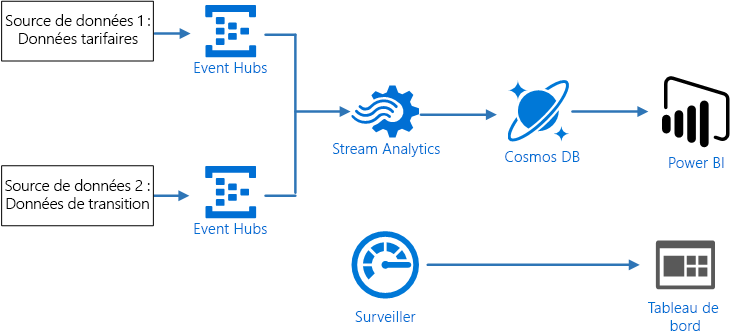
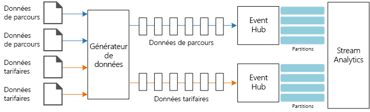
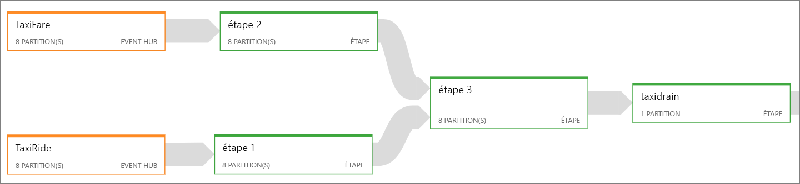
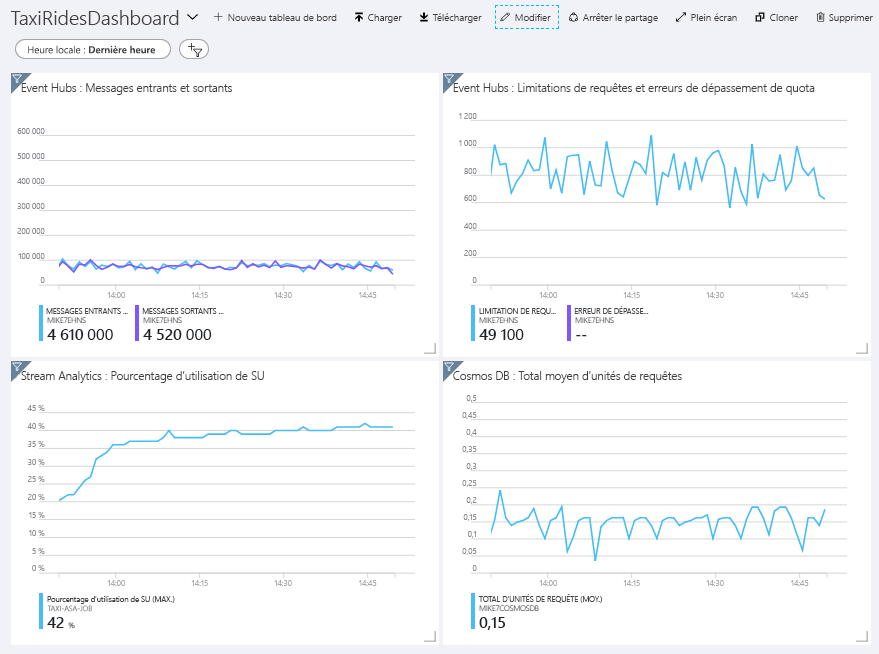
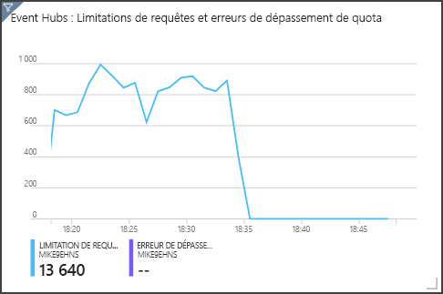

# <a name="stream-processing-with-azure-stream-analytics"></a><span data-ttu-id="8ef6f-103">Traitement de flux de données avec Azure Stream Analytics</span><span class="sxs-lookup"><span data-stu-id="8ef6f-103">Stream processing with Azure Stream Analytics</span></span>

<span data-ttu-id="8ef6f-104">Cette architecture de référence présente un pipeline de traitement de flux de données de bout en bout.</span><span class="sxs-lookup"><span data-stu-id="8ef6f-104">This reference architecture shows an end-to-end stream processing pipeline.</span></span> <span data-ttu-id="8ef6f-105">Le pipeline ingère les données provenant des deux sources, met en corrélation les enregistrements dans les deux flux, puis calcule une moyenne mobile dans une fenêtre de temps.</span><span class="sxs-lookup"><span data-stu-id="8ef6f-105">The pipeline ingests data from two sources, correlates records in the two streams, and calculates a rolling average across a time window.</span></span> <span data-ttu-id="8ef6f-106">Les résultats sont stockés en vue d’une analyse plus approfondie.</span><span class="sxs-lookup"><span data-stu-id="8ef6f-106">The results are stored for further analysis.</span></span> 

<span data-ttu-id="8ef6f-107">Une implémentation de référence pour cette architecture est disponible sur [GitHub][github].</span><span class="sxs-lookup"><span data-stu-id="8ef6f-107">A reference implementation for this architecture is available on [GitHub][github].</span></span> 



<span data-ttu-id="8ef6f-108">**Scénario** : une compagnie de taxis collecte des données sur chaque trajet effectué en taxi.</span><span class="sxs-lookup"><span data-stu-id="8ef6f-108">**Scenario**: A taxi company collects data about each taxi trip.</span></span> <span data-ttu-id="8ef6f-109">Pour ce scénario, nous partons du principe que deux périphériques distincts envoient des données.</span><span class="sxs-lookup"><span data-stu-id="8ef6f-109">For this scenario, we assume there are two separate devices sending data.</span></span> <span data-ttu-id="8ef6f-110">Le taxi est équipé d’un compteur qui envoie les informations suivantes sur chaque course : durée, distance et lieux de prise en charge et de dépose.</span><span class="sxs-lookup"><span data-stu-id="8ef6f-110">The taxi has a meter that sends information about each ride &mdash; the duration, distance, and pickup and dropoff locations.</span></span> <span data-ttu-id="8ef6f-111">Un autre périphérique accepte les paiements des clients et envoie des données sur les tarifs.</span><span class="sxs-lookup"><span data-stu-id="8ef6f-111">A separate device accepts payments from customers and sends data about fares.</span></span> <span data-ttu-id="8ef6f-112">La compagnie de taxis souhaite calculer le pourboire moyen par mile (1,6 km) parcouru, en temps réel, afin de déterminer les tendances.</span><span class="sxs-lookup"><span data-stu-id="8ef6f-112">The taxi company wants to calculate the average tip per mile driven, in real time, in order to spot trends.</span></span>

## <a name="architecture"></a><span data-ttu-id="8ef6f-113">Architecture</span><span class="sxs-lookup"><span data-stu-id="8ef6f-113">Architecture</span></span>

<span data-ttu-id="8ef6f-114">L’architecture est constituée des composants suivants.</span><span class="sxs-lookup"><span data-stu-id="8ef6f-114">The architecture consists of the following components.</span></span>

<span data-ttu-id="8ef6f-115">**Sources de données**.</span><span class="sxs-lookup"><span data-stu-id="8ef6f-115">**Data sources**.</span></span> <span data-ttu-id="8ef6f-116">Dans cette architecture, deux sources de données génèrent des flux de données en temps réel.</span><span class="sxs-lookup"><span data-stu-id="8ef6f-116">In this architecture, there are two data sources that generate data streams in real time.</span></span> <span data-ttu-id="8ef6f-117">Le premier flux de données contient des informations sur les courses, tandis que le second contient des informations sur les tarifs.</span><span class="sxs-lookup"><span data-stu-id="8ef6f-117">The first stream contains ride information, and the second contains fare information.</span></span> <span data-ttu-id="8ef6f-118">L’architecture de référence comprend un générateur de données simulées qui lit le contenu d’un ensemble de fichiers statiques et envoie (push) les données vers Event Hubs.</span><span class="sxs-lookup"><span data-stu-id="8ef6f-118">The reference architecture includes a simulated data generator that reads from a set of static files and pushes the data to Event Hubs.</span></span> <span data-ttu-id="8ef6f-119">Dans une application réelle, les sources de données seraient des périphériques installés dans les taxis.</span><span class="sxs-lookup"><span data-stu-id="8ef6f-119">In a real application, the data sources would be devices installed in the taxi cabs.</span></span>

<span data-ttu-id="8ef6f-120">**Azure Event Hubs**.</span><span class="sxs-lookup"><span data-stu-id="8ef6f-120">**Azure Event Hubs**.</span></span> <span data-ttu-id="8ef6f-121">[Event Hubs](/azure/event-hubs/) est un service d’ingestion d’événements.</span><span class="sxs-lookup"><span data-stu-id="8ef6f-121">[Event Hubs](/azure/event-hubs/) is an event ingestion service.</span></span> <span data-ttu-id="8ef6f-122">Cette architecture utilise deux instances d’Event Hub, à savoir une par source de données.</span><span class="sxs-lookup"><span data-stu-id="8ef6f-122">This architecture uses two event hub instances, one for each data source.</span></span> <span data-ttu-id="8ef6f-123">Chaque source de données envoie un flux de données à l’Event Hub associé.</span><span class="sxs-lookup"><span data-stu-id="8ef6f-123">Each data source sends a stream of data to the associated event hub.</span></span>

<span data-ttu-id="8ef6f-124">**Azure Stream Analytics**.</span><span class="sxs-lookup"><span data-stu-id="8ef6f-124">**Azure Stream Analytics**.</span></span> <span data-ttu-id="8ef6f-125">[Stream Analytics](/azure/stream-analytics/) est un moteur de traitement des événements.</span><span class="sxs-lookup"><span data-stu-id="8ef6f-125">[Stream Analytics](/azure/stream-analytics/) is an event-processing engine.</span></span> <span data-ttu-id="8ef6f-126">Un travail Stream Analytics lit les flux de données provenant des deux instances d’Event Hub et effectue le traitement des flux de données.</span><span class="sxs-lookup"><span data-stu-id="8ef6f-126">A Stream Analytics job reads the data streams from the two event hubs and performs stream processing.</span></span>

<span data-ttu-id="8ef6f-127">**Cosmos DB**.</span><span class="sxs-lookup"><span data-stu-id="8ef6f-127">**Cosmos DB**.</span></span> <span data-ttu-id="8ef6f-128">La sortie du travail Stream Analytics est une série d’enregistrements, qui sont écrits sous forme de documents JSON dans une base de données de documents Cosmos DB.</span><span class="sxs-lookup"><span data-stu-id="8ef6f-128">The output from the Stream Analytics job is a series of records, which are written as JSON documents to a Cosmos DB document database.</span></span>

<span data-ttu-id="8ef6f-129">**Microsoft Power BI**.</span><span class="sxs-lookup"><span data-stu-id="8ef6f-129">**Microsoft Power BI**.</span></span> <span data-ttu-id="8ef6f-130">Power BI est une suite d’outils d’analyse métier pour analyser les données et obtenir des informations métier.</span><span class="sxs-lookup"><span data-stu-id="8ef6f-130">Power BI is a suite of business analytics tools to analyze data for business insights.</span></span> <span data-ttu-id="8ef6f-131">Dans cette architecture, elle charge les données de Cosmos DB.</span><span class="sxs-lookup"><span data-stu-id="8ef6f-131">In this architecture, it loads the data from Cosmos DB.</span></span> <span data-ttu-id="8ef6f-132">Les utilisateurs sont ainsi en mesure d’analyser l’ensemble complet des données historiques qui ont été collectées.</span><span class="sxs-lookup"><span data-stu-id="8ef6f-132">This allows users to analyze the complete set of historical data that's been collected.</span></span> <span data-ttu-id="8ef6f-133">Vous pouvez également transmettre en continu les résultats directement de Stream Analytics à Power BI pour disposer d’une vue en temps réel des données.</span><span class="sxs-lookup"><span data-stu-id="8ef6f-133">You could also stream the results directly from Stream Analytics to Power BI for a real-time view of the data.</span></span> <span data-ttu-id="8ef6f-134">Pour plus d’informations, voir [Streaming en temps réel dans Power BI](/power-bi/service-real-time-streaming).</span><span class="sxs-lookup"><span data-stu-id="8ef6f-134">For more information, see [Real-time streaming in Power BI](/power-bi/service-real-time-streaming).</span></span>

<span data-ttu-id="8ef6f-135">**Azure Monitor**.</span><span class="sxs-lookup"><span data-stu-id="8ef6f-135">**Azure Monitor**.</span></span> <span data-ttu-id="8ef6f-136">[Azure Monitor](/azure/monitoring-and-diagnostics/) collecte les mesures de performances sur les services Azure déployés dans la solution.</span><span class="sxs-lookup"><span data-stu-id="8ef6f-136">[Azure Monitor](/azure/monitoring-and-diagnostics/) collects performance metrics about the Azure services deployed in the solution.</span></span> <span data-ttu-id="8ef6f-137">En les visualisant dans un tableau de bord, vous pouvez obtenir des informations sur l’intégrité de la solution.</span><span class="sxs-lookup"><span data-stu-id="8ef6f-137">By visualizing these in a dashboard, you can get insights into the health of the solution.</span></span> 

## <a name="data-ingestion"></a><span data-ttu-id="8ef6f-138">Ingestion de données</span><span class="sxs-lookup"><span data-stu-id="8ef6f-138">Data ingestion</span></span>

<span data-ttu-id="8ef6f-139">Pour simuler une source de données, cette architecture de référence utilise les [données des taxis de la ville de New York](https://uofi.app.box.com/v/NYCtaxidata/folder/2332218797) <sup>[[1]](#note1)</sup>.</span><span class="sxs-lookup"><span data-stu-id="8ef6f-139">To simulate a data source, this reference architecture uses the [New York City Taxi Data](https://uofi.app.box.com/v/NYCtaxidata/folder/2332218797) dataset<sup>[[1]](#note1)</sup>.</span></span> <span data-ttu-id="8ef6f-140">Ce jeu de données contient des données sur les courses de taxi effectuées à New York sur une période de 4 ans (2010 à 2013).</span><span class="sxs-lookup"><span data-stu-id="8ef6f-140">This dataset contains data about taxi trips in New York City over a 4-year period (2010 &ndash; 2013).</span></span> <span data-ttu-id="8ef6f-141">Il contient deux types d’enregistrement : les données sur les courses et les données sur les tarifs.</span><span class="sxs-lookup"><span data-stu-id="8ef6f-141">It contains two types of record: Ride data and fare data.</span></span> <span data-ttu-id="8ef6f-142">Les premières incluent la durée du trajet, la distance et les lieux de prise en charge et de dépose.</span><span class="sxs-lookup"><span data-stu-id="8ef6f-142">Ride data includes trip duration, trip distance, and pickup and dropoff location.</span></span> <span data-ttu-id="8ef6f-143">Les secondes incluent le montant des tarifs des courses, des taxes et des pourboires.</span><span class="sxs-lookup"><span data-stu-id="8ef6f-143">Fare data includes fare, tax, and tip amounts.</span></span> <span data-ttu-id="8ef6f-144">Les champs communs aux deux types d’enregistrement sont le numéro de médaillon (« taxi jaune »), le permis spécial et l’ID fournisseur.</span><span class="sxs-lookup"><span data-stu-id="8ef6f-144">Common fields in both record types include medallion number, hack license, and vendor ID.</span></span> <span data-ttu-id="8ef6f-145">Ensemble ces trois champs identifient un taxi ainsi qu’un chauffeur.</span><span class="sxs-lookup"><span data-stu-id="8ef6f-145">Together these three fields uniquely identify a taxi plus a driver.</span></span> <span data-ttu-id="8ef6f-146">Les données sont stockées au format CSV.</span><span class="sxs-lookup"><span data-stu-id="8ef6f-146">The data is stored in CSV format.</span></span> 

<span data-ttu-id="8ef6f-147">[1] <span id="note1">Donovan, Brian ; Work, Dan (2016): New York City Taxi Trip Data (2010-2013) (Données relatives aux courses des taxis de New York).</span><span class="sxs-lookup"><span data-stu-id="8ef6f-147">[1] <span id="note1">Donovan, Brian; Work, Dan (2016): New York City Taxi Trip Data (2010-2013).</span></span> <span data-ttu-id="8ef6f-148">Université de l’Illinois, Urbana-Champaign.</span><span class="sxs-lookup"><span data-stu-id="8ef6f-148">University of Illinois at Urbana-Champaign.</span></span> <span data-ttu-id="8ef6f-149">https://doi.org/10.13012/J8PN93H8</span><span class="sxs-lookup"><span data-stu-id="8ef6f-149">https://doi.org/10.13012/J8PN93H8</span></span>

<span data-ttu-id="8ef6f-150">Le générateur de données est une application .NET Core qui lit les enregistrements et les envoie à Azure Event Hubs.</span><span class="sxs-lookup"><span data-stu-id="8ef6f-150">The data generator is a .NET Core application that reads the records and sends them to Azure Event Hubs.</span></span> <span data-ttu-id="8ef6f-151">Le générateur envoie les données des courses au format JSON et les données relatives aux tarifs au format CSV.</span><span class="sxs-lookup"><span data-stu-id="8ef6f-151">The generator sends ride data in JSON format and fare data in CSV format.</span></span> 

<span data-ttu-id="8ef6f-152">Le service Event Hubs utilise des [partitions](/azure/event-hubs/event-hubs-features#partitions) pour segmenter les données.</span><span class="sxs-lookup"><span data-stu-id="8ef6f-152">Event Hubs uses [partitions](/azure/event-hubs/event-hubs-features#partitions) to segment the data.</span></span> <span data-ttu-id="8ef6f-153">Ce système de partition permet à un consommateur de lire chaque partition en parallèle.</span><span class="sxs-lookup"><span data-stu-id="8ef6f-153">Partitions allow a consumer to read each partition in parallel.</span></span> <span data-ttu-id="8ef6f-154">Lorsque vous envoyez des données à Event Hubs, vous pouvez spécifier explicitement la clé de partition.</span><span class="sxs-lookup"><span data-stu-id="8ef6f-154">When you send data to Event Hubs, you can specify the partition key explicitly.</span></span> <span data-ttu-id="8ef6f-155">Sinon, les enregistrements sont affectés aux partitions de manière alternée.</span><span class="sxs-lookup"><span data-stu-id="8ef6f-155">Otherwise, records are assigned to partitions in round-robin fashion.</span></span> 

<span data-ttu-id="8ef6f-156">Dans ce scénario particulier, les données relatives aux courses et aux tarifs doivent se retrouver avec le même ID de partition pour un taxi donné.</span><span class="sxs-lookup"><span data-stu-id="8ef6f-156">In this particular scenario, ride data and fare data should end up with the same partition ID for a given taxi cab.</span></span> <span data-ttu-id="8ef6f-157">Cela permet à Stream Analytics d’appliquer un degré de parallélisme lorsqu’il met en corrélation les deux flux de données.</span><span class="sxs-lookup"><span data-stu-id="8ef6f-157">This enables Stream Analytics to apply a degree of parallelism when it correlates the two streams.</span></span> <span data-ttu-id="8ef6f-158">Un enregistrement dans la partition *n* des données des courses correspond à un enregistrement de la partition *n* des données relatives aux tarifs.</span><span class="sxs-lookup"><span data-stu-id="8ef6f-158">A record in partition *n* of the ride data will match a record in partition *n* of the fare data.</span></span>



<span data-ttu-id="8ef6f-159">Dans le générateur de données, le modèle de données commun pour les deux types d’enregistrement comprend une propriété `PartitionKey`, qui est la concaténation de `Medallion`, `HackLicense` et `VendorId`.</span><span class="sxs-lookup"><span data-stu-id="8ef6f-159">In the data generator, the common data model for both record types has a `PartitionKey` property which is the concatenation of `Medallion`, `HackLicense`, and `VendorId`.</span></span>

```csharp
public abstract class TaxiData
{
    public TaxiData()
    {
    }

    [JsonProperty]
    public long Medallion { get; set; }

    [JsonProperty]
    public long HackLicense { get; set; }

    [JsonProperty]
    public string VendorId { get; set; }

    [JsonProperty]
    public DateTimeOffset PickupTime { get; set; }

    [JsonIgnore]
    public string PartitionKey
    {
        get => $"{Medallion}_{HackLicense}_{VendorId}";
    }
```

<span data-ttu-id="8ef6f-160">Cette propriété est utilisée pour fournir une clé de partition explicite lors de l’envoi des données vers Event Hubs :</span><span class="sxs-lookup"><span data-stu-id="8ef6f-160">This property is used to provide an explicit partition key when sending to Event Hubs:</span></span>

```csharp
using (var client = pool.GetObject())
{
    return client.Value.SendAsync(new EventData(Encoding.UTF8.GetBytes(
        t.GetData(dataFormat))), t.PartitionKey);
}
```

## <a name="stream-processing"></a><span data-ttu-id="8ef6f-161">Traitement des flux de données</span><span class="sxs-lookup"><span data-stu-id="8ef6f-161">Stream processing</span></span>

<span data-ttu-id="8ef6f-162">Le travail de traitement des flux de données est défini à l’aide d’une requête SQL comprenant plusieurs étapes distinctes.</span><span class="sxs-lookup"><span data-stu-id="8ef6f-162">The stream processing job is defined using a SQL query with several distinct steps.</span></span> <span data-ttu-id="8ef6f-163">Les deux premières étapes sélectionnent simplement les enregistrements dans les deux flux d’entrée.</span><span class="sxs-lookup"><span data-stu-id="8ef6f-163">The first two steps simply select records from the two input streams.</span></span>

```sql
WITH
Step1 AS (
    SELECT PartitionId,
           TRY_CAST(Medallion AS nvarchar(max)) AS Medallion,
           TRY_CAST(HackLicense AS nvarchar(max)) AS HackLicense,
           VendorId,
           TRY_CAST(PickupTime AS datetime) AS PickupTime,
           TripDistanceInMiles
    FROM [TaxiRide] PARTITION BY PartitionId
),
Step2 AS (
    SELECT PartitionId,
           medallion AS Medallion,
           hack_license AS HackLicense,
           vendor_id AS VendorId,
           TRY_CAST(pickup_datetime AS datetime) AS PickupTime,
           tip_amount AS TipAmount
    FROM [TaxiFare] PARTITION BY PartitionId
),
```

<span data-ttu-id="8ef6f-164">L’étape suivante joint les deux flux d’entrée pour sélectionner des enregistrements correspondants dans chaque flux.</span><span class="sxs-lookup"><span data-stu-id="8ef6f-164">The next step joins the two input streams to select matching records from each stream.</span></span>

```sql
Step3 AS (
  SELECT
         tr.Medallion,
         tr.HackLicense,
         tr.VendorId,
         tr.PickupTime,
         tr.TripDistanceInMiles,
         tf.TipAmount
    FROM [Step1] tr
    PARTITION BY PartitionId
    JOIN [Step2] tf PARTITION BY PartitionId
      ON tr.Medallion = tf.Medallion
     AND tr.HackLicense = tf.HackLicense
     AND tr.VendorId = tf.VendorId
     AND tr.PickupTime = tf.PickupTime
     AND tr.PartitionId = tf.PartitionId
     AND DATEDIFF(minute, tr, tf) BETWEEN 0 AND 15
)
```

<span data-ttu-id="8ef6f-165">Cette requête joint des enregistrements dans un ensemble de champs qui identifient de manière unique les enregistrements correspondants (Medallion, HackLicense, VendorId et PickupTime).</span><span class="sxs-lookup"><span data-stu-id="8ef6f-165">This query joins records on a set of fields that uniquely identify matching records (Medallion, HackLicense, VendorId, and PickupTime).</span></span> <span data-ttu-id="8ef6f-166">L’instruction `JOIN` inclut également l’ID de partition.</span><span class="sxs-lookup"><span data-stu-id="8ef6f-166">The `JOIN` statement also includes the partition ID.</span></span> <span data-ttu-id="8ef6f-167">Comme mentionné, ce procédé tire parti du fait que les enregistrements correspondants ont toujours le même ID de partition dans ce scénario.</span><span class="sxs-lookup"><span data-stu-id="8ef6f-167">As mentioned, this takes advantage of the fact that matching records always have the same partition ID in this scenario.</span></span>

<span data-ttu-id="8ef6f-168">Dans Stream Analytics, les jointures sont *temporelles*, ce qui signifie que les enregistrements sont joints au sein d’une fenêtre de temps donnée.</span><span class="sxs-lookup"><span data-stu-id="8ef6f-168">In Stream Analytics, joins are *temporal*, meaning records are joined within a particular window of time.</span></span> <span data-ttu-id="8ef6f-169">Dans le cas contraire, le travail devrait peut-être attendre indéfiniment une correspondance.</span><span class="sxs-lookup"><span data-stu-id="8ef6f-169">Otherwise, the job might need to wait indefinitely for a match.</span></span> <span data-ttu-id="8ef6f-170">La fonction [DATEDIFF](https://msdn.microsoft.com/azure/stream-analytics/reference/join-azure-stream-analytics) spécifie la durée pouvant séparer deux enregistrements correspondants.</span><span class="sxs-lookup"><span data-stu-id="8ef6f-170">The [DATEDIFF](https://msdn.microsoft.com/azure/stream-analytics/reference/join-azure-stream-analytics) function specifies how far two matching records can be separated in time for a match.</span></span> 

<span data-ttu-id="8ef6f-171">La dernière étape du travail calcule le pourboire moyen par mile, groupé par fenêtre récurrente de 5 minutes.</span><span class="sxs-lookup"><span data-stu-id="8ef6f-171">The last step in the job computes the average tip per mile, grouped by a hopping window of 5 minutes.</span></span>

```sql
SELECT System.Timestamp AS WindowTime,
       SUM(tr.TipAmount) / SUM(tr.TripDistanceInMiles) AS AverageTipPerMile
  INTO [TaxiDrain]
  FROM [Step3] tr
  GROUP BY HoppingWindow(Duration(minute, 5), Hop(minute, 1))
```

<span data-ttu-id="8ef6f-172">Stream Analytics fournit plusieurs [fonctions de fenêtrage](/azure/stream-analytics/stream-analytics-window-functions).</span><span class="sxs-lookup"><span data-stu-id="8ef6f-172">Stream Analytics provides several [windowing functions](/azure/stream-analytics/stream-analytics-window-functions).</span></span> <span data-ttu-id="8ef6f-173">Une fenêtre récurrente avance dans le temps en fonction d’une période fixe, dans ce cas 1 minute par saut.</span><span class="sxs-lookup"><span data-stu-id="8ef6f-173">A hopping window moves forward in time by a fixed period, in this case 1 minute per hop.</span></span> <span data-ttu-id="8ef6f-174">Le résultat revient à calculer une moyenne mobile sur les 5 dernières minutes.</span><span class="sxs-lookup"><span data-stu-id="8ef6f-174">The result is to calculate a moving average over the past 5 minutes.</span></span>

<span data-ttu-id="8ef6f-175">Dans l’architecture illustrée ici, seuls les résultats du travail Stream Analytics sont enregistrés dans Cosmos DB.</span><span class="sxs-lookup"><span data-stu-id="8ef6f-175">In the architecture shown here, only the results of the Stream Analytics job are saved to Cosmos DB.</span></span> <span data-ttu-id="8ef6f-176">Pour un scénario de type Big Data, pensez également à utiliser [Event Hubs Capture](/azure/event-hubs/event-hubs-capture-overview) pour enregistrer les données d’événement brutes dans le stockage Blob Azure.</span><span class="sxs-lookup"><span data-stu-id="8ef6f-176">For a big data scenario, consider also using [Event Hubs Capture](/azure/event-hubs/event-hubs-capture-overview) to save the raw event data into Azure Blob storage.</span></span> <span data-ttu-id="8ef6f-177">En conservant les données brutes, vous pourrez exécuter des requêtes par lot sur vos données historiques ultérieurement afin de dériver les nouvelles informations à partir des données.</span><span class="sxs-lookup"><span data-stu-id="8ef6f-177">Keeping the raw data will allow you to run batch queries over your historical data at later time, in order to derive new insights from the data.</span></span>

## <a name="scalability-considerations"></a><span data-ttu-id="8ef6f-178">Considérations relatives à l’extensibilité</span><span class="sxs-lookup"><span data-stu-id="8ef6f-178">Scalability considerations</span></span>

### <a name="event-hubs"></a><span data-ttu-id="8ef6f-179">Event Hubs</span><span class="sxs-lookup"><span data-stu-id="8ef6f-179">Event Hubs</span></span>

<span data-ttu-id="8ef6f-180">La capacité de débit du service Event Hubs est mesurée par les [unités de débit](/azure/event-hubs/event-hubs-features#throughput-units).</span><span class="sxs-lookup"><span data-stu-id="8ef6f-180">The throughput capacity of Event Hubs is measured in [throughput units](/azure/event-hubs/event-hubs-features#throughput-units).</span></span> <span data-ttu-id="8ef6f-181">Vous pouvez mettre automatiquement à l’échelle un Event Hub en activant [l’augmentation automatique](/azure/event-hubs/event-hubs-auto-inflate), qui ajuste automatiquement les unités de débit en fonction du trafic, jusqu’à la limite configurée.</span><span class="sxs-lookup"><span data-stu-id="8ef6f-181">You can autoscale an event hub by enabling [auto-inflate](/azure/event-hubs/event-hubs-auto-inflate), which automatically scales the throughput units based on traffic, up to a configured maximum.</span></span> 

### <a name="stream-analytics"></a><span data-ttu-id="8ef6f-182">Stream Analytics</span><span class="sxs-lookup"><span data-stu-id="8ef6f-182">Stream Analytics</span></span>

<span data-ttu-id="8ef6f-183">Pour Stream Analytics, les ressources de calcul allouées à un travail sont mesurées en unités de streaming.</span><span class="sxs-lookup"><span data-stu-id="8ef6f-183">For Stream Analytics, the computing resources allocated to a job are measured in Streaming Units.</span></span> <span data-ttu-id="8ef6f-184">La mise à l’échelle des travaux Stream Analytics est améliorée si ceux-ci peuvent être parallélisés.</span><span class="sxs-lookup"><span data-stu-id="8ef6f-184">Stream Analytics jobs scale best if the job can be parallelized.</span></span> <span data-ttu-id="8ef6f-185">De cette façon, Stream Analytics peut distribuer le travail entre plusieurs nœuds de calcul.</span><span class="sxs-lookup"><span data-stu-id="8ef6f-185">That way, Stream Analytics can distribute the job across multiple compute nodes.</span></span>

<span data-ttu-id="8ef6f-186">Pour l’entrée du service Event Hubs, utilisez le mot clé `PARTITION BY` pour partitionner le travail Stream Analytics.</span><span class="sxs-lookup"><span data-stu-id="8ef6f-186">For Event Hubs input, use the `PARTITION BY` keyword to partition the Stream Analytics job.</span></span> <span data-ttu-id="8ef6f-187">Les données sont divisées en sous-ensembles basés sur les partitions du service Event Hubs.</span><span class="sxs-lookup"><span data-stu-id="8ef6f-187">The data will be divided into subsets based on the Event Hubs partitions.</span></span> 

<span data-ttu-id="8ef6f-188">Les fonctions de fenêtrage et les jointures temporelles requièrent des unités de streaming supplémentaires.</span><span class="sxs-lookup"><span data-stu-id="8ef6f-188">Windowing functions and temporal joins require additional SU.</span></span> <span data-ttu-id="8ef6f-189">Si possible, utilisez `PARTITION BY` afin que chaque partition soit traitée séparément.</span><span class="sxs-lookup"><span data-stu-id="8ef6f-189">When possible, use `PARTITION BY` so that each partition is processed separately.</span></span> <span data-ttu-id="8ef6f-190">Pour plus d’informations, voir [Comprendre et ajuster les unités de streaming](/azure/stream-analytics/stream-analytics-streaming-unit-consumption#windowed-aggregates).</span><span class="sxs-lookup"><span data-stu-id="8ef6f-190">For more information, see [Understand and adjust Streaming Units](/azure/stream-analytics/stream-analytics-streaming-unit-consumption#windowed-aggregates).</span></span>

<span data-ttu-id="8ef6f-191">S’il n’est pas possible de paralléliser l’intégralité du travail Stream Analytics, essayez de le fractionner en plusieurs étapes, en commençant par une ou plusieurs étapes parallèles.</span><span class="sxs-lookup"><span data-stu-id="8ef6f-191">If it's not possible to parallelize the entire Stream Analytics job, try to break the job into multiple steps, starting with one or more parallel steps.</span></span> <span data-ttu-id="8ef6f-192">De cette façon, les premières étapes peuvent s’exécuter en parallèle.</span><span class="sxs-lookup"><span data-stu-id="8ef6f-192">That way, the first steps can run in parallel.</span></span> <span data-ttu-id="8ef6f-193">Par exemple, dans cette architecture de référence :</span><span class="sxs-lookup"><span data-stu-id="8ef6f-193">For example, in this reference architecture:</span></span>

- <span data-ttu-id="8ef6f-194">Les étapes 1 et 2 sont des instructions `SELECT` simples qui sélectionnent des enregistrements dans une seule et même partition.</span><span class="sxs-lookup"><span data-stu-id="8ef6f-194">Steps 1 and 2 are simple `SELECT` statements that select records within a single partition.</span></span> 
- <span data-ttu-id="8ef6f-195">L’étape 3 effectue une jointure partitionnée entre deux flux d’entrée.</span><span class="sxs-lookup"><span data-stu-id="8ef6f-195">Step 3 performs a partitioned join across two input streams.</span></span> <span data-ttu-id="8ef6f-196">Cette étape tire parti du fait que les enregistrements correspondants partagent la même clé de partition et qu’ils sont donc assurés de disposer du même ID de partition dans chaque flux d’entrée.</span><span class="sxs-lookup"><span data-stu-id="8ef6f-196">This step takes advantage of the fact that matching records share the same partition key, and so are guaranteed to have the same partition ID in each input stream.</span></span>
- <span data-ttu-id="8ef6f-197">L’étape 4 est agrégée dans toutes les partitions.</span><span class="sxs-lookup"><span data-stu-id="8ef6f-197">Step 4 aggregates across all of the partitions.</span></span> <span data-ttu-id="8ef6f-198">Elle ne peut pas être parallélisée.</span><span class="sxs-lookup"><span data-stu-id="8ef6f-198">This step cannot be parallelized.</span></span>

<span data-ttu-id="8ef6f-199">Consultez le [diagramme de travail](/azure/stream-analytics/stream-analytics-job-diagram-with-metrics) Stream Analytics pour voir le nombre de partitions affectées à chaque étape du travail.</span><span class="sxs-lookup"><span data-stu-id="8ef6f-199">Use the Stream Analytics [job diagram](/azure/stream-analytics/stream-analytics-job-diagram-with-metrics) to see how many partitions are assigned to each step in the job.</span></span> <span data-ttu-id="8ef6f-200">Le diagramme de travail suivant illustre cette architecture de référence :</span><span class="sxs-lookup"><span data-stu-id="8ef6f-200">The following diagram shows the job diagram for this reference architecture:</span></span>



### <a name="cosmos-db"></a><span data-ttu-id="8ef6f-201">Cosmos DB</span><span class="sxs-lookup"><span data-stu-id="8ef6f-201">Cosmos DB</span></span>

<span data-ttu-id="8ef6f-202">La capacité de débit pour Cosmos DB est mesurée en [unités de requête](/azure/cosmos-db/request-units) (RU).</span><span class="sxs-lookup"><span data-stu-id="8ef6f-202">Throughput capacity for Cosmos DB is measured in [Request Units](/azure/cosmos-db/request-units) (RU).</span></span> <span data-ttu-id="8ef6f-203">Pour mettre à l’échelle un conteneur Cosmos DB au-delà de 10 000 RU, vous devez spécifier une [clé de partition](/azure/cosmos-db/partition-data) lorsque vous créez le conteneur, puis inclure la clé de partition dans chaque document.</span><span class="sxs-lookup"><span data-stu-id="8ef6f-203">In order to scale a Cosmos DB container past 10,000 RU, you must specify a [partition key](/azure/cosmos-db/partition-data) when you create the container, and include the partition key in every document.</span></span> 

<span data-ttu-id="8ef6f-204">Dans cette architecture de référence, les nouveaux documents sont créés une seule fois par minute (intervalle de fenêtre récurrente). Les besoins en débit sont donc assez faibles.</span><span class="sxs-lookup"><span data-stu-id="8ef6f-204">In this reference architecture, new documents are created only once per minute (the hopping window interval), so the throughput requirements are quite low.</span></span> <span data-ttu-id="8ef6f-205">C’est pour cette raison qu’il est inutile d’affecter une clé de partition dans ce scénario.</span><span class="sxs-lookup"><span data-stu-id="8ef6f-205">For that reason, there's no need to assign a partition key in this scenario.</span></span>

## <a name="monitoring-considerations"></a><span data-ttu-id="8ef6f-206">Surveillance - Éléments à prendre en compte</span><span class="sxs-lookup"><span data-stu-id="8ef6f-206">Monitoring considerations</span></span>

<span data-ttu-id="8ef6f-207">Avec des solutions de traitement des flux de données, il est important de surveiller les performances et l’intégrité du système.</span><span class="sxs-lookup"><span data-stu-id="8ef6f-207">With any stream processing solution, it's important to monitor the performance and health of the system.</span></span> <span data-ttu-id="8ef6f-208">[Azure Monitor](/azure/monitoring-and-diagnostics/) collecte des journaux de métriques et de diagnostics pour les services Azure utilisés dans l’architecture.</span><span class="sxs-lookup"><span data-stu-id="8ef6f-208">[Azure Monitor](/azure/monitoring-and-diagnostics/) collects metrics and diagnostics logs for the Azure services used in the architecture.</span></span> <span data-ttu-id="8ef6f-209">Azure Monitor est intégré à la plateforme Azure et ne nécessite pas de code supplémentaire dans votre application.</span><span class="sxs-lookup"><span data-stu-id="8ef6f-209">Azure Monitor is built into the Azure platform and does not require any additional code in your application.</span></span>

<span data-ttu-id="8ef6f-210">Signaux d’avertissement indiquant que vous devez faire évoluer la ressource Azure appropriée :</span><span class="sxs-lookup"><span data-stu-id="8ef6f-210">Any of the following warning signals indicate that you should scale out the relevant Azure resource:</span></span>

- <span data-ttu-id="8ef6f-211">Le service Event Hubs limite les requêtes ou est proche du quota quotidien des messages.</span><span class="sxs-lookup"><span data-stu-id="8ef6f-211">Event Hubs throttles requests or is close to the daily message quota.</span></span>
- <span data-ttu-id="8ef6f-212">Le travail Stream Analytics utilise toujours plus de 80 % des unités de streaming allouées.</span><span class="sxs-lookup"><span data-stu-id="8ef6f-212">The Stream Analytics job consistently uses more than 80% of allocated Streaming Units (SU).</span></span>
- <span data-ttu-id="8ef6f-213">Cosmos DB commence à limiter les requêtes.</span><span class="sxs-lookup"><span data-stu-id="8ef6f-213">Cosmos DB begins to throttle requests.</span></span>

<span data-ttu-id="8ef6f-214">L’architecture de référence inclut un tableau de bord personnalisé, qui est déployé sur le portail Azure.</span><span class="sxs-lookup"><span data-stu-id="8ef6f-214">The reference architecture includes a custom dashboard, which is deployed to the Azure portal.</span></span> <span data-ttu-id="8ef6f-215">Après avoir déployé l’architecture, vous pouvez afficher le tableau de bord en ouvrant le [portail Azure](https://portal.azure.com) et en sélectionnant `TaxiRidesDashboard` dans la liste des tableaux de bord.</span><span class="sxs-lookup"><span data-stu-id="8ef6f-215">After you deploy the architecture, you can view the dashboard by opening the [Azure Portal](https://portal.azure.com) and selecting `TaxiRidesDashboard` from list of dashboards.</span></span> <span data-ttu-id="8ef6f-216">Pour plus d’informations sur la création et le déploiement de tableaux de bord personnalisés dans le portail Azure, voir [Créer par programmation des tableaux de bord Azure](/azure/azure-portal/azure-portal-dashboards-create-programmatically).</span><span class="sxs-lookup"><span data-stu-id="8ef6f-216">For more information about creating and deploying custom dashboards in the Azure portal, see [Programmatically create Azure Dashboards](/azure/azure-portal/azure-portal-dashboards-create-programmatically).</span></span>

<span data-ttu-id="8ef6f-217">L’illustration suivante présente le tableau de bord une fois que le travail Stream Analytics a été exécuté pendant environ une heure.</span><span class="sxs-lookup"><span data-stu-id="8ef6f-217">The following image shows the dashboard after the Stream Analytics job ran for about an hour.</span></span>



<span data-ttu-id="8ef6f-218">Le panneau affiché dans l’angle inférieur gauche indique que la consommation d’unités de streaming pour le travail Stream Analytics augmente pendant les 15 premières minutes, puis se stabilise.</span><span class="sxs-lookup"><span data-stu-id="8ef6f-218">The panel on the lower left shows that the SU consumption for the Stream Analytics job climbs during the first 15 minutes and then levels off.</span></span> <span data-ttu-id="8ef6f-219">Il s’agit d’un modèle standard, car le travail atteint un état stable.</span><span class="sxs-lookup"><span data-stu-id="8ef6f-219">This is a typical pattern as the job reaches a steady state.</span></span> 

<span data-ttu-id="8ef6f-220">Notez que le service Event Hubs limite les requêtes (illustré dans le panneau supérieur droit).</span><span class="sxs-lookup"><span data-stu-id="8ef6f-220">Notice that Event Hubs is throttling requests, shown in the upper right panel.</span></span> <span data-ttu-id="8ef6f-221">Une demande limitée occasionnelle n’est pas un problème, car le Kit de développement logiciel (SDK) client du service Event Hubs exécute une nouvelle tentative à la réception d’une erreur de limitation.</span><span class="sxs-lookup"><span data-stu-id="8ef6f-221">An occasional throttled request is not a problem, because the Event Hubs client SDK automatically retries when it receives a throttling error.</span></span> <span data-ttu-id="8ef6f-222">Toutefois, si vous observez régulièrement des erreurs de limitation, cela signifie que l’Event Hub a besoin de davantage d’unités de débit.</span><span class="sxs-lookup"><span data-stu-id="8ef6f-222">However, if you see consistent throttling errors, it means the event hub needs more throughput units.</span></span> <span data-ttu-id="8ef6f-223">Le graphique suivant montre une série de tests utilisant la fonction d’augmentation automatique d’Event Hubs, qui ajuste automatiquement les unités de débit en fonction des besoins.</span><span class="sxs-lookup"><span data-stu-id="8ef6f-223">The following graph shows a test run using the Event Hubs auto-inflate feature, which automatically scales out the throughput units as needed.</span></span> 



<span data-ttu-id="8ef6f-224">La fonction d’augmentation automatique a été activée au niveau de la marque de 06:35.</span><span class="sxs-lookup"><span data-stu-id="8ef6f-224">Auto-inflate was enabled at about the 06:35 mark.</span></span> <span data-ttu-id="8ef6f-225">Vous pouvez observer la chute p du nombre de requêtes limitées, car le service Event Hubs est automatiquement mis à l’échelle jusqu’à 3 unités de débit.</span><span class="sxs-lookup"><span data-stu-id="8ef6f-225">You can see the p drop in throttled requests, as Event Hubs automatically scaled up to 3 throughput units.</span></span>

<span data-ttu-id="8ef6f-226">L’effet secondaire de ce processus est l’augmentation de l’utilisation des unités de streaming dans le travail Stream Analytics.</span><span class="sxs-lookup"><span data-stu-id="8ef6f-226">Interestingly, this had the side effect of increasing the SU utilization in the Stream Analytics job.</span></span> <span data-ttu-id="8ef6f-227">Via la limitation des requêtes, le service Event Hubs réduit artificiellement le taux d’ingestion des données pour le travail Stream Analytics.</span><span class="sxs-lookup"><span data-stu-id="8ef6f-227">By throttling, Event Hubs was artificially reducing the ingestion rate for the Stream Analytics job.</span></span> <span data-ttu-id="8ef6f-228">Il est assez courant que la résolution d’un problème de goulot d’étranglement de performances en révèle un autre.</span><span class="sxs-lookup"><span data-stu-id="8ef6f-228">It's actually common that resolving one performance bottleneck reveals another.</span></span> <span data-ttu-id="8ef6f-229">Dans ce cas, l’allocation d’unités de streaming supplémentaires pour le travail Stream Analytics a résolu le problème.</span><span class="sxs-lookup"><span data-stu-id="8ef6f-229">In this case, allocating additional SU for the Stream Analytics job resolved the issue.</span></span>

## <a name="deploy-the-solution"></a><span data-ttu-id="8ef6f-230">Déployer la solution</span><span class="sxs-lookup"><span data-stu-id="8ef6f-230">Deploy the solution</span></span>

<span data-ttu-id="8ef6f-231">Pour déployer et exécuter l’implémentation de référence, suivez les étapes du [fichier Readme de GitHub][github].</span><span class="sxs-lookup"><span data-stu-id="8ef6f-231">To the deploy and run the reference implementation, follow the steps in the [GitHub readme][github].</span></span> 


[github]: https://github.com/mspnp/reference-architectures/tree/master/data/streaming_asa