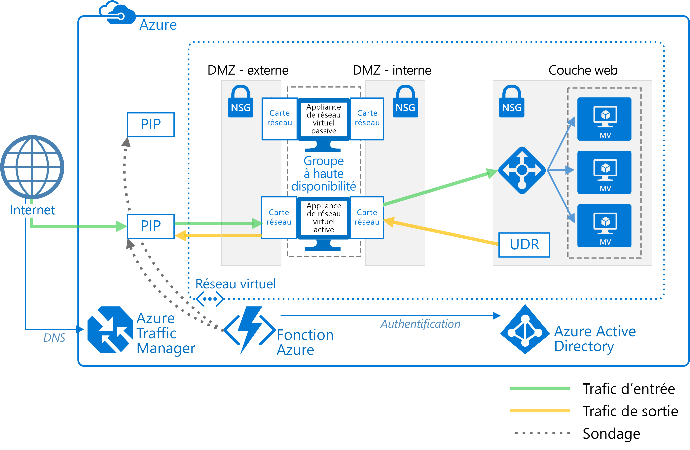

# Déployer des appliances virtuelles réseau hautement disponiblesDeploy highly available network virtual appliances

Cet article explique comment déployer des appliances virtuelles réseau pour la haute disponibilité dans Azure.This article shows how to deploy a set of network virtual appliances (NVAs) for high availability in Azure. Une appliance virtuelle réseau est généralement utilisée pour contrôler le flux de trafic réseau à partir d’un réseau de périmètre, également appelé DMZ, vers d’autres réseaux ou sous-réseaux.An NVA is typically used to control the flow of network traffic from a perimeter network, also known as a DMZ, to other networks or subnets. Pour en savoir plus sur l’implémentation d’une zone DMZ dans Azure, consultez [Microsoft cloud services and network security][cloud-security] (Services de cloud computing Microsoft et sécurité réseau).To learn about implementing a DMZ in Azure, see [Microsoft cloud services and network security][cloud-security]. L’article inclut des exemples d’architecture pour l’entrée ou la sortie uniquement, et pour les deux à la fois.The article includes example architectures for ingress only, egress only, and both ingress and egress.

**Configuration requise :** Cet article nécessite une connaissance élémentaire des réseaux Azure, des [équilibreurs de charge Azure][lb-overview] et des [routes définies par l’utilisateur][udr-overview].**Prerequisites:** This article assumes a basic understanding of Azure networking, [Azure load balancers][lb-overview], and [user-defined routes][udr-overview] (UDRs).

## Diagrammes architecturauxArchitecture diagrams

Une appliance virtuelle réseau peut être déployée sur une zone DMZ dans bon nombre d’architectures différentes.An NVA can be deployed to a DMZ in many different architectures. Par exemple, l’exemple suivant illustre l’utilisation d’une [appliance virtuelle réseau] [ nva-scenario] pour l’entrée.For example, the following figure illustrates the use of a [single NVA][nva-scenario] for ingress.

![[0]][0]![[0]][0]

Dans cette architecture, l’appliance virtuelle réseau assure une limite réseau sécurisée par la vérification de l’ensemble du trafic réseau entrant et sortant et la transmission uniquement du trafic répondant aux règles de sécurité du réseau.In this architecture, the NVA provides a secure network boundary by checking all inbound and outbound network traffic and passing only the traffic that meets network security rules. Toutefois, le fait que tout le trafic réseau doive traverser l’appliance virtuelle réseau signifie que cette dernière est un point unique de défaillance au sein du réseau.However, the fact that all network traffic must pass through the NVA means that the NVA is a single point of failure in the network. Si celle-ci échoue, il n’existe aucun autre chemin d’accès pour le trafic réseau et tous les sous-réseaux principaux sont indisponibles.If the NVA fails, there is no other path for network traffic and all the back-end subnets are unavailable.

Pour rendre une appliance virtuelle réseau hautement disponible, déployez plusieurs appliances virtuelles réseau dans un groupe à haute disponibilité.To make an NVA highly available, deploy more than one NVA into an availability set.

Les architectures suivantes décrivent les ressources et la configuration nécessaire pour des appliances virtuelles réseau hautement disponibles :The following architectures describe the resources and configuration necessary for highly available NVAs:

<!-- markdownlint-disable MD033 -->

| SolutionSolution | AvantagesBenefits | ConsidérationsConsiderations |
| --- | --- | --- |
| [Entrée avec appliances virtuelles réseau de couche 7][ingress-with-layer-7][Ingress with layer 7 NVAs][ingress-with-layer-7] |Tous les nœuds d’appliance virtuelle réseau sont actifs.All NVA nodes are active |Nécessite une appliance virtuelle réseau pouvant arrêter les connexions et utiliser SNATRequires an NVA that can terminate connections and use SNAT  Requiert un ensemble distinct d’appliances virtuelles réseau pour le trafic provenant d’Internet et d’AzureRequires a separate set of NVAs for traffic coming from the Internet and from Azure   Peut uniquement être utilisé pour le trafic provenant de l’extérieur d’AzureCan only be used for traffic originating outside Azure |
| [Sortie avec appliances virtuelles réseau de couche 7][egress-with-layer-7][Egress with layer 7 NVAs][egress-with-layer-7] |Tous les nœuds d’appliance virtuelle réseau sont actifs.All NVA nodes are active | Nécessite une appliance virtuelle réseau pouvant arrêter les connexions et implémente la traduction des adresses réseau source (SNAT)Requires an NVA that can terminate connections and implements source network address translation (SNAT)
| [Entrée-sortie avec appliances virtuelles réseau de couche 7][ingress-egress-with-layer-7][Ingress-Egress with layer 7 NVAs][ingress-egress-with-layer-7] |Tous les nœuds sont actifs.All nodes are active Capable de gérer le trafic provenant d’Azure.Able to handle traffic originated in Azure |Nécessite une appliance virtuelle réseau pouvant arrêter les connexions et utiliser SNATRequires an NVA that can terminate connections and use SNAT Requiert un ensemble distinct d’appliances virtuelles réseau pour le trafic provenant d’Internet et d’AzureRequires a separate set of NVAs for traffic coming from the Internet and from Azure |
| [Commutateur PIP-UDR][pip-udr-switch][PIP-UDR switch][pip-udr-switch] |Ensemble unique d’appliances virtuelles réseau pour tout le traficSingle set of NVAs for all traffic Peut gérer tout le trafic (aucune limite sur les règles de port)Can handle all traffic (no limit on port rules) |Actif/PassifActive-passive Requiert un processus de basculementRequires a failover process |
| [PIP-UDR sans SNATPIP-UDR without SNAT](#pip-udr-nvas-without-snat) | Ensemble unique d’appliances virtuelles réseau pour tout le traficSingle set of NVAs for all traffic Peut gérer tout le trafic (aucune limite sur les règles de port)Can handle all traffic (no limit on port rules) Ne nécessite pas de configuration SNAT pour les requêtes entrantesDoes not require configuring SNAT for inbound requests |Actif/PassifActive-passive Requiert un processus de basculementRequires a failover process Le sondage et la logique de basculement sont exécutés en dehors du réseau virtuelProbing and failover logic run outside the virtual network |

<!-- markdown-enable MD033 -->

## Entrée avec appliances virtuelles réseau de couche 7Ingress with layer 7 NVAs

La figure suivante montre une architecture à haute disponibilité qui implémente une zone DMZ d’entrée derrière un équilibreur de charge accessible sur Internet.The following figure shows a high availability architecture that implements an ingress DMZ behind an internet-facing load balancer. Cette architecture est conçue pour fournir une connectivité HTTP ou HTTPS aux charges de travail Azure pour le trafic de couche 7 :This architecture is designed to provide connectivity to Azure workloads for layer 7 traffic, such as HTTP or HTTPS:

![[1]][1]![[1]][1]

L’avantage de cette architecture réside dans le fait que toutes les appliances virtuelles réseau sont actives et qu’en cas d’échec de l’une d’entre elles l’équilibreur de charge dirige le trafic réseau vers l’autre appliance virtuelle.The benefit of this architecture is that all NVAs are active, and if one fails the load balancer directs network traffic to the other NVA. Les deux appliances virtuelles réseau acheminent le trafic vers l’équilibreur de charge interne. Ainsi, le trafic est maintenu tant que l’une d’entre elles est active.Both NVAs route traffic to the internal load balancer so as long as one NVA is active, traffic continues to flow. Les appliances virtuelles réseau doivent arrêter le trafic SSL destiné aux machines virtuelles de la couche web.The NVAs are required to terminate SSL traffic intended for the web tier VMs. Ces appliances virtuelles réseau ne peuvent pas être étendues pour gérer le trafic local, car celui-ci nécessite un autre ensemble dédié d’appliances virtuelles réseau possédant leurs propres itinéraires réseau.These NVAs cannot be extended to handle on-premises traffic because on-premises traffic requires another dedicated set of NVAs with their own network routes.

> [!NOTE]
> Cette architecture est utilisée dans l’architecture de référence de la [zone DMZ située entre Azure et votre centre de données local][dmz-on-prem] et celle de la [zone DMZ située entre Azure et Internet][dmz-internet].This architecture is used in the [DMZ between Azure and your on-premises datacenter][dmz-on-prem] reference architecture and the [DMZ between Azure and the Internet][dmz-internet] reference architecture. Chacune de ces architectures de référence inclue une solution de déploiement utilisable.Each of these reference architectures includes a deployment solution that you can use. Suivez les liens ci-après pour plus d’informations.Follow the links for more information.

## Sortie avec appliances virtuelles réseau de couche 7Egress with layer 7 NVAs

L’architecture précédente peut être développée de manière à fournir une zone DMZ de sortie pour les requêtes provenant de la charge de travail Azure.The previous architecture can be expanded to provide an egress DMZ for requests originating in the Azure workload. L’architecture suivante est conçue pour assurer une haute disponibilité des appliances virtuelles réseau de la zone DMZ pour le trafic de couche 7, tel que HTTP ou HTTPS :The following architecture is designed to provide high availability of the NVAs in the DMZ for layer 7 traffic, such as HTTP or HTTPS:

![[2]][2]![[2]][2]

Dans cette architecture, tout le trafic provenant d’Azure est acheminé vers un équilibreur de charge interne.In this architecture, all traffic originating in Azure is routed to an internal load balancer. Ce dernier répartit les requêtes sortantes entre un ensemble d’appliances virtuelles réseau.The load balancer distributes outgoing requests between a set of NVAs. Celles-ci dirigent le trafic vers Internet à l’aide de leurs adresses IP publiques individuelles.These NVAs direct traffic to the Internet using their individual public IP addresses.

> [!NOTE]
> Cette architecture est utilisée dans l’architecture de référence de la [zone DMZ située entre Azure et votre centre de données local][dmz-on-prem] et celle de la [zone DMZ située entre Azure et Internet][dmz-internet].This architecture is used in the [DMZ between Azure and your on-premises datacenter][dmz-on-prem] reference architecture and the [DMZ between Azure and the Internet][dmz-internet] reference architecture. Chacune de ces architectures de référence inclue une solution de déploiement utilisable.Each of these reference architectures includes a deployment solution that you can use. Suivez les liens ci-après pour plus d’informations.Follow the links for more information.

## Entrée-sortie avec appliances virtuelles réseau de couche 7Ingress-egress with layer 7 NVAs

Les deux architectures précédentes comportaient une zone DMZ distincte pour l’entrée et la sortie.In the two previous architectures, there was a separate DMZ for ingress and egress. L’architecture suivante montre comment créer une zone DMZ pouvant être utilisée pour l’entrée et la sortie du trafic de couche 7, tel que HTTP ou HTTPS :The following architecture demonstrates how to create a DMZ that can be used for both ingress and egress for layer 7 traffic, such as HTTP or HTTPS:

![[4]][4]

Dans cette architecture, les appliances virtuelles réseau traitent les requêtes entrantes à partir de la passerelle d’application.In this architecture, the NVAs process incoming requests from the application gateway. Les appliances virtuelles réseau traitent également des requêtes sortantes issues des machines virtuelles de la charge de travail du pool principal de l’équilibreur de charge.The NVAs also process outgoing requests from the workload VMs in the back-end pool of the load balancer. Étant donné que le trafic entrant est routé avec une passerelle d’application et que le trafic sortant est routé avec un équilibreur de charge, les appliances virtuelles réseau sont responsables du maintien de l’affinité de session.Because incoming traffic is routed with an application gateway and outgoing traffic is routed with a load balancer, the NVAs are responsible for maintaining session affinity. Autrement dit, la passerelle d’application gère un mappage de requêtes entrantes et sortantes afin de pouvoir envoyer la réponse correcte au demandeur d’origine.That is, the application gateway maintains a mapping of inbound and outbound requests so it can forward the correct response to the original requestor. Toutefois, l’équilibreur de charge interne n’a pas accès aux mappages de la passerelle d’application et utilise sa propre logique pour envoyer des réponses aux appliances virtuelles réseau.However, the internal load balancer does not have access to the application gateway mappings, and uses its own logic to send responses to the NVAs. Il est possible que l’équilibreur de charge puisse envoyer une réponse à une appliance virtuelle réseau qui n’a pas initialement reçu la requête issue de la passerelle d’application.It's possible the load balancer could send a response to an NVA that did not initially receive the request from the application gateway. Dans ce cas, les appliances virtuelles réseau doivent communiquer et se transférer la réponse entre elles afin que l’appliance virtuelle réseau appropriée puisse transférer la réponse vers la passerelle d’application.In this case, the NVAs must communicate and transfer the response between them so the correct NVA can forward the response to the application gateway.

> [!NOTE]
> Vous pouvez également résoudre le problème de routage asymétrique en s’assurant que les appliances virtuelles réseau effectuent la traduction des adresses réseau sources entrantes (SNAT).You can also solve the asymmetric routing issue by ensuring the NVAs perform inbound source network address translation (SNAT). Cela remplacerait l’IP source d’origine du demandeur par une des adresses IP de l’appliance virtuelle réseau utilisée sur le flux entrant.This would replace the original source IP of the requestor to one of the IP addresses of the NVA used on the inbound flow. Cela garantit de pouvoir utiliser plusieurs appliances virtuelles réseau à la fois, tout en conservant la symétrie de l’itinéraire.This ensures that you can use multiple NVAs at a time, while preserving the route symmetry.

## Commutateur PIP-UDR avec appliances virtuelles réseau de couche 4PIP-UDR switch with layer 4 NVAs

L’architecture suivante illustre une architecture comportant une appliance virtuelle réseau active et une autre appliance passive.The following architecture demonstrates an architecture with one active and one passive NVA. Cette architecture gère à la fois l’entrée et la sortie pour le trafic de couche 4 :This architecture handles both ingress and egress for layer 4 traffic:

![[3]][3]![[3]][3]

> [!TIP]
> Pour cette architecture, une solution complète est disponible sur [GitHub][pnp-ha-nva].A complete solution for this architecture is available on [GitHub][pnp-ha-nva].

Cette architecture est similaire à la première architecture abordée dans cet article.This architecture is similar to the first architecture discussed in this article. Cette architecture incluait une seule appliance virtuelle réseau acceptant et filtrant les requêtes entrantes de couche 4.That architecture included a single NVA accepting and filtering incoming layer 4 requests. Cette architecture ajoute une deuxième appliance virtuelle réseau pour garantir une haute disponibilité.This architecture adds a second passive NVA to provide high availability. Si l’appliance virtuelle réseau échoue, l’appliance virtuelle réseau passive est activée et les UDR et PIP sont modifiés de manière à pointer vers les cartes d’interface réseau de l’appliance virtuelle réseau active.If the active NVA fails, the passive NVA is made active and the UDR and PIP are changed to point to the NICs on the now active NVA. Ces modifications apportées à l’UDR et au PIP peuvent être effectuées manuellement ou à l’aide d’un processus automatisé.These changes to the UDR and PIP can either be done manually or using an automated process. Le processus automatisé est généralement un démon ou tout autre service d’analyse s’exécutant dans Azure.The automated process is typically daemon or other monitoring service running in Azure. Il interroge une sonde d’intégrité située sur l’appliance virtuelle réseau active et déclenche le commutateur UDR et PIP lorsqu’il détecte un échec de cette dernière.It queries a health probe on the active NVA and performs the UDR and PIP switch when it detects a failure of the NVA.

L’illustration précédente montre un exemple de cluster [ZooKeeper][zookeeper] proposant un démon à haute disponibilité.The preceding figure shows an example [ZooKeeper][zookeeper] cluster providing a high availability daemon. Au sein du cluster ZooKeeper, un quorum de nœuds choisit une amorce de début.Within the ZooKeeper cluster, a quorum of nodes elects a leader. Si l’amorce de début échoue, les nœuds restants en élisent une nouvelle.If the leader fails, the remaining nodes hold an election to elect a new leader. Pour cette architecture, le nœud de l’amorce de début exécute le démon qui interroge le point de terminaison d’intégrité situé sur l’appliance virtuelle réseau.For this architecture, the leader node executes the daemon that queries the health endpoint on the NVA. Si l’appliance virtuelle réseau ne répond pas à la sonde d’intégrité, le démon active l’appliance virtuelle réseau.If the NVA fails to respond to the health probe, the daemon activates the passive NVA. Le démon appelle ensuite l’API REST Azure pour retirer le PIP de l’appliance virtuelle réseau défaillante et l’associe à l’appliance virtuelle réseau qui vient d’être activée.The daemon then calls the Azure REST API to remove the PIP from the failed NVA and attaches it to newly activated NVA. Le démon modifie ensuite l’UDR de manière à pointer vers l’adresse IP interne de l’appliance virtuelle réseau venant d’être activée.The daemon then modifies the UDR to point to the newly activated NVA's internal IP address.

N’incluez pas les nœuds Zookeeper dans un sous-réseau uniquement accessible à l’aide d’un itinéraire incluant l’appliance virtuelle réseau.Do not include the ZooKeeper nodes in a subnet that is only accessible using a route that includes the NVA. Dans le cas contraire, les nœuds Zookeeper sont inaccessibles en cas d’échec de l’appliance virtuelle réseau.Otherwise, the ZooKeeper nodes are inaccessible if the NVA fails. Si le démon échoue pour une raison quelconque, vous ne pourrez accéder à aucun des nœuds ZooKeeper pour diagnostiquer le problème.Should the daemon fail for any reason, you won't be able to access any of the ZooKeeper nodes to diagnose the problem.

Pour voir la solution complète, y compris un exemple de code, consultez les fichiers du [dépôt GitHub][pnp-ha-nva].To see the complete solution including sample code, see the files in the [GitHub repository][pnp-ha-nva].

## Appliances virtuelles réseau PIP-UDR sans SNATPIP-UDR NVAs without SNAT

Cette architecture utilise deux machines virtuelles Azure pour héberger le pare-feu d’appliance virtuelle réseau dans une configuration de type actif-passif qui prend en charge le basculement automatisé, mais qui ne nécessite pas de SNAT (Source Network Address Translation).This architecture uses two Azure virtual machines to host the NVA firewall in an active-passive configuration that supports automated failover but does not require Source Network Address Translation (SNAT).

> [!TIP]
> Pour cette architecture, une solution complète est disponible sur [GitHub][ha-nva-fo].A complete solution for this architecture is available on [GitHub][ha-nva-fo].

Cette solution est conçue pour les clients Azure qui ne peuvent pas configurer le SNAT pour les requêtes dans leur pare-feu d’appliance virtuelle réseau.This solution is designed for Azure customers who cannot configure SNAT for inbound requests on their NVA firewalls. Le SNAT masque l’adresse IP client source d’origine.SNAT hides the original source client IP address. Si vous devez journaliser les adresses IP d’origine ou les utiliser dans d’autres composants de sécurité multiniveau situés derrière vos appliances virtuelles réseau, cette solution offre une approche de base.If you need to log the original IPs or used them within other layered security components behind your NVAs, this solution offers a basic approach.

Le basculement des entrées de la table de routes définies par l’utilisateur est automatisé par une adresse de tronçon suivant qui est définie sur l’adresse IP d’une interface, sur la machine virtuelle où le pare-feu d’appliance virtuelle réseau est actif.The failover of UDR table entries is automated by a next-hop address set to the IP address of an interface on the active NVA firewall virtual machine. La logique du basculement automatisé est hébergée dans une application de fonction que vous créez à l’aide d’[Azure Functions](/azure/azure-functions/).The automated failover logic is hosted in a function app that you create using [Azure Functions](/azure/azure-functions/). Le code de basculement s’exécute comme une fonction serverless dans Azure Functions.The failover code runs as a serverless function inside Azure Functions. Le déploiement est pratique, économique ainsi que facile à gérer et à personnaliser.Deployment is convenient, cost-effective, and easy to maintain and customize. En outre, l’application de fonction est hébergée dans Azure Functions.Elle n’a donc aucune dépendance au réseau virtuel.In addition, the function app is hosted within Azure Functions, so it has no dependencies on the virtual network. Si les modifications apportées au réseau virtuel impactent les pare-feu d’appliance virtuelle réseau, l’application de fonction continue de s’exécuter indépendamment.If changes to the virtual network impact the NVA firewalls, the function app continues to run independently. Les tests sont également plus précis, car ils ont lieu en dehors du réseau virtuel et utilisent la même route que les requêtes client entrantes.Testing is more accurate as well, because it takes place outside the virtual network using the same route as the inbound client requests.

Pour vérifier la disponibilité du pare-feu d’appliance virtuelle réseau, le code de l’application de fonction le sonde de deux manières :To check the availability of the NVA firewall, the function app code probes it in one of two ways:

- En supervisant l’état des machines virtuelles Azure qui hébergent le pare-feu d’appliance virtuelle réseauBy monitoring the state of the Azure virtual machines hosting the NVA firewall.

- En vérifiant si un port est ouvert entre le pare-feu et le serveur web back-endBy testing whether there is an open port through the firewall to the back-end web server. Avec cette option, l’appliance virtuelle réseau doit exposer un socket via PIP pour le code de l’application de fonction à tester.For this option, the NVA must expose a socket via PIP for the function app code to test.

Vous choisissez le type de sonde que vous souhaitez utiliser au moment de configurer l’application de fonction.You choose the type of probe you want to use when you configure the function app. Pour voir la solution complète, y compris un exemple de code, consultez les fichiers du [dépôt GitHub][ha-nva-fo].To see the complete solution including sample code, see the files in the [GitHub repository][ha-nva-fo].

## Étapes suivantesNext steps

- Découvrez comment [implémenter une zone DMZ située entre Azure et votre centre de données local] [ dmz-on-prem] à l’aide des appliances virtuelles réseau de couche 7.Learn how to [implement a DMZ between Azure and your on-premises datacenter][dmz-on-prem] using layer-7 NVAs.
- Découvrez comment [implémenter une zone DMZ située entre Azure et Internet][dmz-internet] à l’aide des appliances virtuelles réseau de couche 7.Learn how to [implement a DMZ between Azure and the Internet][dmz-internet] using layer-7 NVAs.
- [Problèmes d’appliance virtuelle réseau dans AzureTroubleshoot network virtual appliance issues in Azure](/azure/virtual-network/virtual-network-troubleshoot-nva)

<!-- links -->

[cloud-security]: /azure/best-practices-network-security
[dmz-on-prem]: ./secure-vnet-hybrid.md
[dmz-internet]: ./secure-vnet-dmz.md
[egress-with-layer-7]: #egress-with-layer-7-nvas
[ingress-with-layer-7]: #ingress-with-layer-7-nvas
[ingress-egress-with-layer-7]: #ingress-egress-with-layer-7-nvas
[lb-overview]: /azure/load-balancer/load-balancer-overview/
[nva-scenario]: /azure/virtual-network/virtual-network-scenario-udr-gw-nva/
[pip-udr-switch]: #pip-udr-switch-with-layer-4-nvas
[udr-overview]: /azure/virtual-network/virtual-networks-udr-overview/
[zookeeper]: https://zookeeper.apache.org/
[pnp-ha-nva]: https://github.com/mspnp/ha-nva
[ha-nva-fo]: https://aka.ms/ha-nva-fo

<!-- images -->

[0]: ./images/nva-ha/single-nva.png "Architecture d’appliances virtuelle réseau unique"
[1]: ./images/nva-ha/l7-ingress.png "Entrée de couche 7"
[2]: ./images/nva-ha/l7-ingress-egress.png "Sortie de couche 7"
[3]: ./images/nva-ha/active-passive.png "Cluster actif-passif"
[4]: ./images/nva-ha/l7-ingress-egress-ag.png
