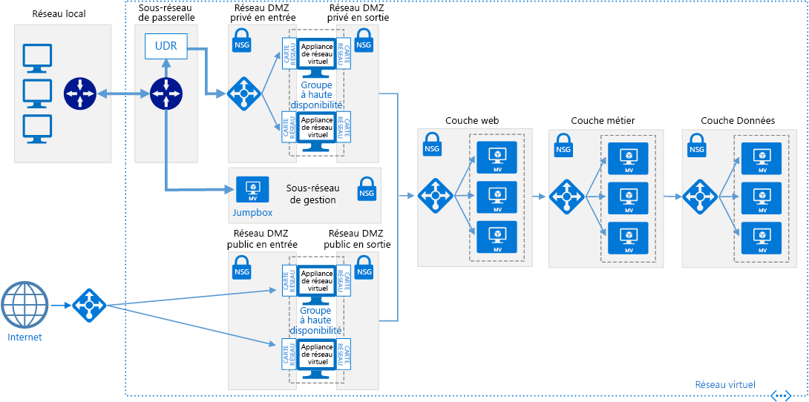
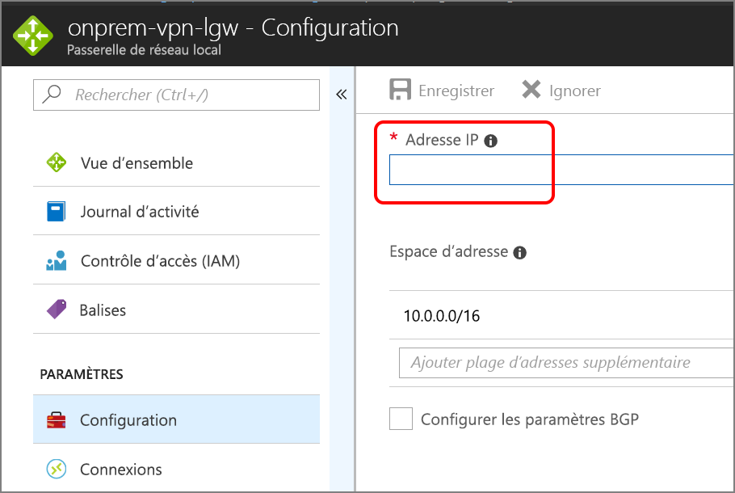

# <a name="implement-a-dmz-between-azure-and-the-internet"></a>Implémenter une zone DMZ entre Azure et Internet

Cette architecture de référence montre un réseau sécurisé hybride qui étend un réseau local sur Azure et accepte également le trafic Internet. [**Déployez cette solution**](#deploy-the-solution).



*Téléchargez un [fichier Visio][visio-download] de cette architecture.*

Cette architecture de référence étend l’architecture décrite dans [Implementing a DMZ between Azure and your on-premises datacenter][implementing-a-secure-hybrid-network-architecture] (Implémenter une zone DMZ entre Azure et votre centre de données local). Elle ajoute une zone DMZ qui gère le trafic Internet, en plus de la zone DMZ privée qui gère le trafic issu du réseau local.

Utilisations courantes de cette architecture :

- Les applications hybrides où les charges de travail s’exécutent en partie en local et dans Azure.
- Infrastructure Azure qui achemine le trafic entrant en provenance du réseau local et d’Internet.

## <a name="architecture"></a>Architecture

L’architecture est constituée des composants suivants.

- **Adresse IP publique**. Adresse IP publique du point de terminaison public. Les utilisateurs externes connectés à Internet peuvent accéder au système via cette adresse.
- **Appliance virtuelle réseau**. Cette architecture inclut un pool distinct d’appliances virtuelles réseau pour le trafic provenant d’Internet.
- **Équilibreur de charge Azure**. Toutes les demandes entrantes provenant d’Internet passent par l’équilibreur de charge et sont distribuées aux appliances virtuelles réseau dans la zone DMZ publique.
- **Sous-réseau entrant de zone DMZ publique**. Ce sous-réseau accepte les requêtes issues de l’équilibreur de charge Azure. Les requêtes entrantes sont transmises à une des appliances virtuelles réseau de la zone DMZ publique.
- **Sous-réseau sortant de zone DMZ publique**. Les requêtes approuvées par l’appliance virtuelle réseau passent à travers ce sous-réseau vers l’équilibreur de charge interne pour la couche web.

## <a name="recommendations"></a>Recommandations

Les recommandations suivantes s’appliquent à la plupart des scénarios. Suivez ces recommandations, sauf si vous avez un besoin spécifique qui vous oblige à les ignorer.

### <a name="nva-recommendations"></a>Recommandations en matière d’appliances virtuelles réseau

Utilisez un ensemble d’appliances virtuelles réseau pour le trafic provenant d’Internet, et un autre ensemble pour le trafic émanant du niveau local. L’utilisation d’un seul ensemble d’appliances virtuelles réseau pour ces deux types de trafics réseau constitue un risque pour la sécurité, car elle n’offre aucun périmètre de sécurité entre les deux. L’utilisation d’appliances virtuelles réseau distinctes simplifie la vérification des règles de sécurité et permet d’identifier clairement les règles auxquelles correspondent les différentes requêtes réseau entrantes. Un ensemble d’appliances virtuelles réseau implémente les règles pour le trafic Internet uniquement, et l’autre celles du trafic local uniquement.

Incluez une appliance virtuelle réseau de couche 7 pour mettre fin aux connexions d’application au niveau de l’appliance virtuelle réseau et assurer la compatibilité avec les couches principales. Cela garantit une connectivité symétrique où le trafic de réponse issu des couches principales est renvoyé via l’appliance virtuelle réseau.

### <a name="public-load-balancer-recommendations"></a>Recommandations relatives à l’équilibreur de charge public

À des fins d’évolutivité et de disponibilité, déployez les appliances virtuelles réseau de la zone DMZ publique dans un [groupe à haute disponibilité][availability-set] et utilisez un [équilibreur de charge accessible sur Internet][load-balancer]pour répartir les requêtes Internet sur les appliances virtuelles réseau du groupe à haute disponibilité.

Configurer l’équilibreur de charge pour accepter les requêtes uniquement sur les ports nécessaires au trafic Internet. Par exemple, limitez les requêtes HTTP entrantes vers le port 80 et les requêtes HTTPS entrantes vers le port 443.

## <a name="scalability-considerations"></a>Considérations relatives à l’extensibilité

Même si votre architecture requiert initialement une appliance virtuelle réseau unique dans la zone DMZ publique, nous recommandons de placer un équilibreur de charge devant la zone DMZ publique dès le début. Cela facilite l’évolution ultérieure vers plusieurs appliances virtuelles réseau, si nécessaire.

## <a name="availability-considerations"></a>Considérations relatives à la disponibilité

L’équilibreur de charge accessible sur Internet requiert que chaque appliance virtuelle réseau de la zone DMZ du sous-réseau entrant de la zone publique DMZ implémente une [sonde d’intégrité][lb-probe]. Une sonde d’intégrité qui ne répond pas sur ce point de terminaison est considérée comme étant indisponible. Par conséquent, l’équilibreur de charge doit diriger les requêtes vers d’autres appliances virtuelles réseau du même groupe à haute disponibilité. Notez que si toutes les appliances virtuelles réseau ne répondent pas, votre application échoue. Il est donc important de configurer l’analyse afin d’alerter DevOps lorsque le nombre d’instances d’appliances virtuelles réseau saines tombe en dessous d’un seuil défini.

## <a name="manageability-considerations"></a>Considérations relatives à la facilité de gestion

L’ensemble de l’analyse et de la gestion des appliances virtuelles réseau de la zone publique DMZ doit être effectuée par la jumpbox dans le sous-réseau de gestion. Comme indiqué dans [Implementing a DMZ between Azure and your on-premises datacenter][implementing-a-secure-hybrid-network-architecture] (Implémenter une zone DMZ entre Azure et votre centre de données local), définissez un itinéraire de réseau unique à partir du réseau local via la passerelle menant au jumpbox afin de restreindre accès.

Si la connectivité de la passerelle de votre réseau local vers Azure est interrompue, vous pouvez toujours atteindre le jumpbox en déployant une adresse IP publique, en l’ajoutant au jumpbox et en vous connectant à partir d’Internet.

## <a name="security-considerations"></a>Considérations relatives à la sécurité

Cette architecture de référence implémente plusieurs niveaux de sécurité :

- L’équilibreur de charge accessible sur Internet dirige les requêtes vers les appliances virtuelles réseau au sein du sous-réseau DMZ public et uniquement sur les ports nécessaires à l’application.
- Les règles du groupe de sécurité réseau pour les sous-réseaux de la zone DMZ publique entrants et sortants empêchent la compromission des appliances virtuelles réseau par le blocage des requêtes se trouvant en dehors des règles du groupe de sécurité réseau.
- La configuration du routage NAT pour les appliances virtuelles réseau dirige les requêtes entrantes sur les ports 80 et 443 vers l’équilibreur de charge de la couche web, mais ignore les requêtes sur tous les autres ports.

Vous devez journaliser toutes les requêtes entrantes sur tous les ports. Effectuez un audit régulier des journaux en accordant une attention particulière aux requêtes qui se trouvent en dehors des paramètres attendus, comme cela peut indiquer des tentatives d’intrusion.

## <a name="deploy-the-solution"></a>Déployer la solution

Un déploiement pour une architecture de référence implémentant ces recommandations est disponible sur [GitHub][github-folder].

### <a name="prerequisites"></a>Prérequis

[!INCLUDE [ref-arch-prerequisites.md](../../../includes/ref-arch-prerequisites.md)]

### <a name="deploy-resources"></a>Déployer des ressources

1. Accédez au dossier `/dmz/secure-vnet-dmz` du référentiel GitHub des architectures de référence.

2. Exécutez la commande suivante :

    ```bash
    azbb -s <subscription_id> -g <resource_group_name> -l <region> -p onprem.json --deploy
    ```

3. Exécutez la commande suivante :

    ```bash
    azbb -s <subscription_id> -g <resource_group_name> -l <region> -p secure-vnet-hybrid.json --deploy
    ```

### <a name="connect-the-on-premises-and-azure-gateways"></a>Connecter les passerelles Azure et locales

Lors de cette étape, vous allez connecter les deux passerelles réseau local.

1. Dans le portail Azure, accédez au groupe de ressources que vous avez créé.

2. Recherchez la ressource appelée `ra-vpn-vgw-pip` et copiez l’adresse IP affichée dans le panneau **Vue d’ensemble**.

3. Recherchez la ressource appelée `onprem-vpn-lgw`.

4. Cliquez sur le panneau **Configuration**. Sous **Adresse IP**, collez l’adresse IP identifiée à l’étape 2.

    

5. Cliquez sur **Enregistrer** et attendez que l’opération soit terminée. Elle peut durer environ 5 minutes.

6. Recherchez la ressource appelée `onprem-vpn-gateway1-pip`. Copiez l’adresse IP indiquée dans le panneau **Vue d’ensemble**.

7. Recherchez la ressource appelée `ra-vpn-lgw`.

8. Cliquez sur le panneau **Configuration**. Sous **Adresse IP**, collez l’adresse IP identifiée à l’étape 6.

9. Cliquez sur **Enregistrer** et attendez que l’opération soit terminée.

10. Pour vérifier la connexion, accédez au panneau **Connexions** de chaque passerelle. L’état doit être **Connecté**.

### <a name="verify-that-network-traffic-reaches-the-web-tier"></a>Vérifiez que le trafic réseau atteint le niveau web.

1. Dans le portail Azure, accédez au groupe de ressources que vous avez créé.

2. Recherchez la ressource appelée `pub-dmz-lb`, qui correspond à l’équilibreur de charge placé devant la zone DMZ publique.

3. Copiez l’adresse IP publique du panneau **Vue d’ensemble** et ouvrez cette adresse dans un navigateur web. Vous devez voir apparaître la page d’accueil du serveur Apache2 par défaut.

4. Recherchez la ressource appelée `int-dmz-lb`, qui correspond à l’équilibreur de charge placé devant la zone DMZ privée. Copiez l’adresse IP privée dans le panneau **Vue d’ensemble**.

5. Trouvez la machine virtuelle nommée `jb-vm1`. Cliquez sur **Connect** et utilisez le Bureau à distance pour vous connecter à la machine virtuelle. Le nom d’utilisateur et le mot de passe sont spécifiés dans le fichier onprem.json.

6. À partir de la session Bureau à distance, ouvrez un navigateur web et accédez à l’adresse IP identifiée à l’étape 4. Vous devez voir apparaître la page d’accueil du serveur Apache2 par défaut.

[availability-set]: /azure/virtual-machines/virtual-machines-windows-manage-availability
[github-folder]: https://github.com/mspnp/reference-architectures/tree/master/dmz/secure-vnet-dmz

[implementing-a-secure-hybrid-network-architecture]: ./secure-vnet-hybrid.md
[iptables]: https://help.ubuntu.com/community/IptablesHowTo
[lb-probe]: /azure/load-balancer/load-balancer-custom-probe-overview
[load-balancer]: /azure/load-balancer/load-balancer-Internet-overview
[network-security-group]: /azure/virtual-network/virtual-networks-nsg

[visio-download]: https://archcenter.blob.core.windows.net/cdn/dmz-reference-architectures.vsdx
