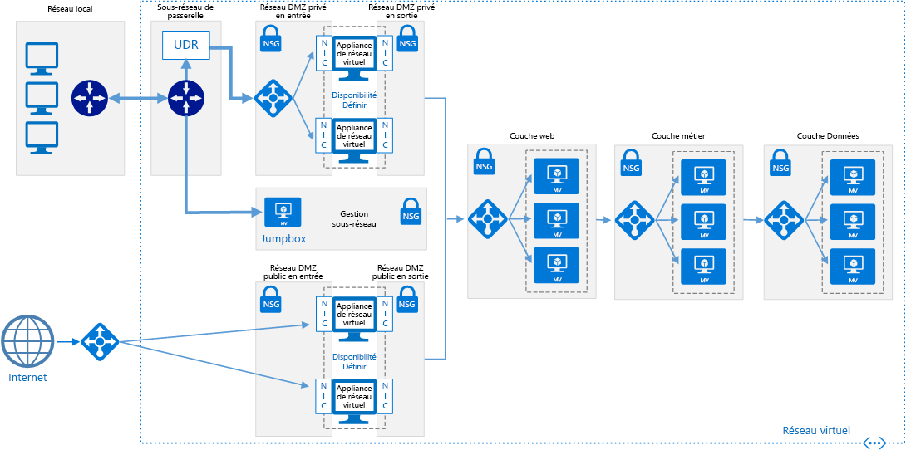

# <a name="implement-a-dmz-between-azure-and-the-internet"></a><span data-ttu-id="08761-103">Implémenter une zone DMZ entre Azure et Internet</span><span class="sxs-lookup"><span data-stu-id="08761-103">Implement a DMZ between Azure and the Internet</span></span>

<span data-ttu-id="08761-104">Cette architecture de référence montre un réseau sécurisé hybride qui étend un réseau local sur Azure et accepte également le trafic Internet.</span><span class="sxs-lookup"><span data-stu-id="08761-104">This reference architecture shows a secure hybrid network that extends an on-premises network to Azure and also accepts Internet traffic.</span></span> <span data-ttu-id="08761-105">[**Déployez cette solution**](#deploy-the-solution).</span><span class="sxs-lookup"><span data-stu-id="08761-105">[**Deploy this solution**](#deploy-the-solution).</span></span>

> [!NOTE]
> <span data-ttu-id="08761-106">Vous pouvez suivre ce scénario avec le [Pare-feu Azure](/azure/firewall/), service de sécurité réseau basé sur le cloud.</span><span class="sxs-lookup"><span data-stu-id="08761-106">This scenario can also be accomplished using [Azure Firewall](/azure/firewall/), a cloud-based network security service.</span></span>



<span data-ttu-id="08761-108">*Téléchargez un [fichier Visio][visio-download] de cette architecture.*</span><span class="sxs-lookup"><span data-stu-id="08761-108">*Download a [Visio file][visio-download] of this architecture.*</span></span>

<span data-ttu-id="08761-109">Cette architecture de référence étend l’architecture décrite dans [Implementing a DMZ between Azure and your on-premises datacenter][implementing-a-secure-hybrid-network-architecture] (Implémenter une zone DMZ entre Azure et votre centre de données local).</span><span class="sxs-lookup"><span data-stu-id="08761-109">This reference architecture extends the architecture described in [Implementing a DMZ between Azure and your on-premises datacenter][implementing-a-secure-hybrid-network-architecture].</span></span> <span data-ttu-id="08761-110">Elle ajoute une zone DMZ qui gère le trafic Internet, en plus de la zone DMZ privée qui gère le trafic issu du réseau local.</span><span class="sxs-lookup"><span data-stu-id="08761-110">It adds a public DMZ that handles Internet traffic, in addition to the private DMZ that handles traffic from the on-premises network.</span></span>

<span data-ttu-id="08761-111">Utilisations courantes de cette architecture :</span><span class="sxs-lookup"><span data-stu-id="08761-111">Typical uses for this architecture include:</span></span>

- <span data-ttu-id="08761-112">Les applications hybrides où les charges de travail s’exécutent en partie en local et dans Azure.</span><span class="sxs-lookup"><span data-stu-id="08761-112">Hybrid applications where workloads run partly on-premises and partly in Azure.</span></span>
- <span data-ttu-id="08761-113">Infrastructure Azure qui achemine le trafic entrant en provenance du réseau local et d’Internet.</span><span class="sxs-lookup"><span data-stu-id="08761-113">Azure infrastructure that routes incoming traffic from on-premises and the Internet.</span></span>

## <a name="architecture"></a><span data-ttu-id="08761-114">Architecture</span><span class="sxs-lookup"><span data-stu-id="08761-114">Architecture</span></span>

<span data-ttu-id="08761-115">L’architecture est constituée des composants suivants.</span><span class="sxs-lookup"><span data-stu-id="08761-115">The architecture consists of the following components.</span></span>

- <span data-ttu-id="08761-116">**Adresse IP publique**.</span><span class="sxs-lookup"><span data-stu-id="08761-116">**Public IP address (PIP)**.</span></span> <span data-ttu-id="08761-117">Adresse IP publique du point de terminaison public.</span><span class="sxs-lookup"><span data-stu-id="08761-117">The IP address of the public endpoint.</span></span> <span data-ttu-id="08761-118">Les utilisateurs externes connectés à Internet peuvent accéder au système via cette adresse.</span><span class="sxs-lookup"><span data-stu-id="08761-118">External users connected to the Internet can access the system through this address.</span></span>
- <span data-ttu-id="08761-119">**Appliance virtuelle réseau**.</span><span class="sxs-lookup"><span data-stu-id="08761-119">**Network virtual appliance (NVA)**.</span></span> <span data-ttu-id="08761-120">Cette architecture inclut un pool distinct d’appliances virtuelles réseau pour le trafic provenant d’Internet.</span><span class="sxs-lookup"><span data-stu-id="08761-120">This architecture includes a separate pool of NVAs for traffic originating on the Internet.</span></span>
- <span data-ttu-id="08761-121">**Équilibreur de charge Azure**.</span><span class="sxs-lookup"><span data-stu-id="08761-121">**Azure load balancer**.</span></span> <span data-ttu-id="08761-122">Toutes les demandes entrantes provenant d’Internet passent par l’équilibreur de charge et sont distribuées aux appliances virtuelles réseau dans la zone DMZ publique.</span><span class="sxs-lookup"><span data-stu-id="08761-122">All incoming requests from the Internet pass through the load balancer and are distributed to the NVAs in the public DMZ.</span></span>
- <span data-ttu-id="08761-123">**Sous-réseau entrant de zone DMZ publique**.</span><span class="sxs-lookup"><span data-stu-id="08761-123">**Public DMZ inbound subnet**.</span></span> <span data-ttu-id="08761-124">Ce sous-réseau accepte les requêtes issues de l’équilibreur de charge Azure.</span><span class="sxs-lookup"><span data-stu-id="08761-124">This subnet accepts requests from the Azure load balancer.</span></span> <span data-ttu-id="08761-125">Les requêtes entrantes sont transmises à une des appliances virtuelles réseau de la zone DMZ publique.</span><span class="sxs-lookup"><span data-stu-id="08761-125">Incoming requests are passed to one of the NVAs in the public DMZ.</span></span>
- <span data-ttu-id="08761-126">**Sous-réseau sortant de zone DMZ publique**.</span><span class="sxs-lookup"><span data-stu-id="08761-126">**Public DMZ outbound subnet**.</span></span> <span data-ttu-id="08761-127">Les requêtes approuvées par l’appliance virtuelle réseau passent à travers ce sous-réseau vers l’équilibreur de charge interne pour la couche web.</span><span class="sxs-lookup"><span data-stu-id="08761-127">Requests that are approved by the NVA pass through this subnet to the internal load balancer for the web tier.</span></span>

## <a name="recommendations"></a><span data-ttu-id="08761-128">Recommandations</span><span class="sxs-lookup"><span data-stu-id="08761-128">Recommendations</span></span>

<span data-ttu-id="08761-129">Les recommandations suivantes s’appliquent à la plupart des scénarios.</span><span class="sxs-lookup"><span data-stu-id="08761-129">The following recommendations apply for most scenarios.</span></span> <span data-ttu-id="08761-130">Suivez ces recommandations, sauf si vous avez un besoin spécifique qui vous oblige à les ignorer.</span><span class="sxs-lookup"><span data-stu-id="08761-130">Follow these recommendations unless you have a specific requirement that overrides them.</span></span>

### <a name="nva-recommendations"></a><span data-ttu-id="08761-131">Recommandations en matière d’appliances virtuelles réseau</span><span class="sxs-lookup"><span data-stu-id="08761-131">NVA recommendations</span></span>

<span data-ttu-id="08761-132">Utilisez un ensemble d’appliances virtuelles réseau pour le trafic provenant d’Internet, et un autre ensemble pour le trafic émanant du niveau local.</span><span class="sxs-lookup"><span data-stu-id="08761-132">Use one set of NVAs for traffic originating on the Internet, and another for traffic originating on-premises.</span></span> <span data-ttu-id="08761-133">L’utilisation d’un seul ensemble d’appliances virtuelles réseau pour ces deux types de trafics réseau constitue un risque pour la sécurité, car elle n’offre aucun périmètre de sécurité entre les deux.</span><span class="sxs-lookup"><span data-stu-id="08761-133">Using only one set of NVAs for both is a security risk, because it provides no security perimeter between the two sets of network traffic.</span></span> <span data-ttu-id="08761-134">L’utilisation d’appliances virtuelles réseau distinctes simplifie la vérification des règles de sécurité et permet d’identifier clairement les règles auxquelles correspondent les différentes requêtes réseau entrantes.</span><span class="sxs-lookup"><span data-stu-id="08761-134">Using separate NVAs reduces the complexity of checking security rules, and makes it clear which rules correspond to each incoming network request.</span></span> <span data-ttu-id="08761-135">Un ensemble d’appliances virtuelles réseau implémente les règles pour le trafic Internet uniquement, et l’autre celles du trafic local uniquement.</span><span class="sxs-lookup"><span data-stu-id="08761-135">One set of NVAs implements rules for Internet traffic only, while another set of NVAs implement rules for on-premises traffic only.</span></span>

<span data-ttu-id="08761-136">Incluez une appliance virtuelle réseau de couche 7 pour mettre fin aux connexions d’application au niveau de l’appliance virtuelle réseau et assurer la compatibilité avec les couches principales.</span><span class="sxs-lookup"><span data-stu-id="08761-136">Include a layer-7 NVA to terminate application connections at the NVA level and maintain compatibility with the backend tiers.</span></span> <span data-ttu-id="08761-137">Cela garantit une connectivité symétrique où le trafic de réponse issu des couches principales est renvoyé via l’appliance virtuelle réseau.</span><span class="sxs-lookup"><span data-stu-id="08761-137">This guarantees symmetric connectivity where response traffic from the backend tiers returns through the NVA.</span></span>

### <a name="public-load-balancer-recommendations"></a><span data-ttu-id="08761-138">Recommandations relatives à l’équilibreur de charge public</span><span class="sxs-lookup"><span data-stu-id="08761-138">Public load balancer recommendations</span></span>

<span data-ttu-id="08761-139">À des fins d’évolutivité et de disponibilité, déployez les appliances virtuelles réseau de la zone DMZ publique dans un [groupe à haute disponibilité][availability-set] et utilisez un [équilibreur de charge accessible sur Internet][load-balancer]pour répartir les requêtes Internet sur les appliances virtuelles réseau du groupe à haute disponibilité.</span><span class="sxs-lookup"><span data-stu-id="08761-139">For scalability and availability, deploy the public DMZ NVAs in an [availability set][availability-set] and use an [Internet facing load balancer][load-balancer] to distribute Internet requests across the NVAs in the availability set.</span></span>

<span data-ttu-id="08761-140">Configurer l’équilibreur de charge pour accepter les requêtes uniquement sur les ports nécessaires au trafic Internet.</span><span class="sxs-lookup"><span data-stu-id="08761-140">Configure the load balancer to accept requests only on the ports necessary for Internet traffic.</span></span> <span data-ttu-id="08761-141">Par exemple, limitez les requêtes HTTP entrantes vers le port 80 et les requêtes HTTPS entrantes vers le port 443.</span><span class="sxs-lookup"><span data-stu-id="08761-141">For example, restrict inbound HTTP requests to port 80 and inbound HTTPS requests to port 443.</span></span>

## <a name="scalability-considerations"></a><span data-ttu-id="08761-142">Considérations relatives à l’extensibilité</span><span class="sxs-lookup"><span data-stu-id="08761-142">Scalability considerations</span></span>

<span data-ttu-id="08761-143">Même si votre architecture requiert initialement une appliance virtuelle réseau unique dans la zone DMZ publique, nous recommandons de placer un équilibreur de charge devant la zone DMZ publique dès le début.</span><span class="sxs-lookup"><span data-stu-id="08761-143">Even if your architecture initially requires a single NVA in the public DMZ, we recommend putting a load balancer in front of the public DMZ from the beginning.</span></span> <span data-ttu-id="08761-144">Cela facilite l’évolution ultérieure vers plusieurs appliances virtuelles réseau, si nécessaire.</span><span class="sxs-lookup"><span data-stu-id="08761-144">That will make it easier to scale to multiple NVAs in the future, if needed.</span></span>

## <a name="availability-considerations"></a><span data-ttu-id="08761-145">Considérations relatives à la disponibilité</span><span class="sxs-lookup"><span data-stu-id="08761-145">Availability considerations</span></span>

<span data-ttu-id="08761-146">L’équilibreur de charge accessible sur Internet requiert que chaque appliance virtuelle réseau de la zone DMZ du sous-réseau entrant de la zone publique DMZ implémente une [sonde d’intégrité][lb-probe].</span><span class="sxs-lookup"><span data-stu-id="08761-146">The Internet facing load balancer requires each NVA in the public DMZ inbound subnet to implement a [health probe][lb-probe].</span></span> <span data-ttu-id="08761-147">Une sonde d’intégrité qui ne répond pas sur ce point de terminaison est considérée comme étant indisponible. Par conséquent, l’équilibreur de charge doit diriger les requêtes vers d’autres appliances virtuelles réseau du même groupe à haute disponibilité.</span><span class="sxs-lookup"><span data-stu-id="08761-147">A health probe that fails to respond on this endpoint is considered to be unavailable, and the load balancer will direct requests to other NVAs in the same availability set.</span></span> <span data-ttu-id="08761-148">Notez que si toutes les appliances virtuelles réseau ne répondent pas, votre application échoue. Il est donc important de configurer l’analyse afin d’alerter DevOps lorsque le nombre d’instances d’appliances virtuelles réseau saines tombe en dessous d’un seuil défini.</span><span class="sxs-lookup"><span data-stu-id="08761-148">Note that if all NVAs fail to respond, your application will fail, so it's important to have monitoring configured to alert DevOps when the number of healthy NVA instances falls below a defined threshold.</span></span>

## <a name="manageability-considerations"></a><span data-ttu-id="08761-149">Considérations relatives à la facilité de gestion</span><span class="sxs-lookup"><span data-stu-id="08761-149">Manageability considerations</span></span>

<span data-ttu-id="08761-150">L’ensemble de l’analyse et de la gestion des appliances virtuelles réseau de la zone publique DMZ doit être effectuée par la jumpbox dans le sous-réseau de gestion.</span><span class="sxs-lookup"><span data-stu-id="08761-150">All monitoring and management for the NVAs in the public DMZ should be performed by the jumpbox in the management subnet.</span></span> <span data-ttu-id="08761-151">Comme indiqué dans [Implementing a DMZ between Azure and your on-premises datacenter][implementing-a-secure-hybrid-network-architecture] (Implémenter une zone DMZ entre Azure et votre centre de données local), définissez un itinéraire de réseau unique à partir du réseau local via la passerelle menant au jumpbox afin de restreindre accès.</span><span class="sxs-lookup"><span data-stu-id="08761-151">As discussed in [Implementing a DMZ between Azure and your on-premises datacenter][implementing-a-secure-hybrid-network-architecture], define a single network route from the on-premises network through the gateway to the jumpbox, in order to restrict access.</span></span>

<span data-ttu-id="08761-152">Si la connectivité de la passerelle de votre réseau local vers Azure est interrompue, vous pouvez toujours atteindre le jumpbox en déployant une adresse IP publique, en l’ajoutant au jumpbox et en vous connectant à partir d’Internet.</span><span class="sxs-lookup"><span data-stu-id="08761-152">If gateway connectivity from your on-premises network to Azure is down, you can still reach the jumpbox by deploying a public IP address, adding it to the jumpbox, and logging in from the Internet.</span></span>

## <a name="security-considerations"></a><span data-ttu-id="08761-153">Considérations relatives à la sécurité</span><span class="sxs-lookup"><span data-stu-id="08761-153">Security considerations</span></span>

<span data-ttu-id="08761-154">Cette architecture de référence implémente plusieurs niveaux de sécurité :</span><span class="sxs-lookup"><span data-stu-id="08761-154">This reference architecture implements multiple levels of security:</span></span>

- <span data-ttu-id="08761-155">L’équilibreur de charge accessible sur Internet dirige les requêtes vers les appliances virtuelles réseau au sein du sous-réseau DMZ public et uniquement sur les ports nécessaires à l’application.</span><span class="sxs-lookup"><span data-stu-id="08761-155">The Internet facing load balancer directs requests to the NVAs in the inbound public DMZ subnet, and only on the ports necessary for the application.</span></span>
- <span data-ttu-id="08761-156">Les règles du groupe de sécurité réseau pour les sous-réseaux de la zone DMZ publique entrants et sortants empêchent la compromission des appliances virtuelles réseau par le blocage des requêtes se trouvant en dehors des règles du groupe de sécurité réseau.</span><span class="sxs-lookup"><span data-stu-id="08761-156">The NSG rules for the inbound and outbound public DMZ subnets prevent the NVAs from being compromised, by blocking requests that fall outside of the NSG rules.</span></span>
- <span data-ttu-id="08761-157">La configuration du routage NAT pour les appliances virtuelles réseau dirige les requêtes entrantes sur les ports 80 et 443 vers l’équilibreur de charge de la couche web, mais ignore les requêtes sur tous les autres ports.</span><span class="sxs-lookup"><span data-stu-id="08761-157">The NAT routing configuration for the NVAs directs incoming requests on port 80 and port 443 to the web tier load balancer, but ignores requests on all other ports.</span></span>

<span data-ttu-id="08761-158">Vous devez journaliser toutes les requêtes entrantes sur tous les ports.</span><span class="sxs-lookup"><span data-stu-id="08761-158">You should log all incoming requests on all ports.</span></span> <span data-ttu-id="08761-159">Effectuez un audit régulier des journaux en accordant une attention particulière aux requêtes qui se trouvent en dehors des paramètres attendus, comme cela peut indiquer des tentatives d’intrusion.</span><span class="sxs-lookup"><span data-stu-id="08761-159">Regularly audit the logs, paying attention to requests that fall outside of expected parameters, as these may indicate intrusion attempts.</span></span>

## <a name="deploy-the-solution"></a><span data-ttu-id="08761-160">Déployer la solution</span><span class="sxs-lookup"><span data-stu-id="08761-160">Deploy the solution</span></span>

<span data-ttu-id="08761-161">Un déploiement pour une architecture de référence implémentant ces recommandations est disponible sur [GitHub][github-folder].</span><span class="sxs-lookup"><span data-stu-id="08761-161">A deployment for a reference architecture that implements these recommendations is available on [GitHub][github-folder].</span></span>

### <a name="prerequisites"></a><span data-ttu-id="08761-162">Prérequis</span><span class="sxs-lookup"><span data-stu-id="08761-162">Prerequisites</span></span>

[!INCLUDE [ref-arch-prerequisites.md](../../../includes/ref-arch-prerequisites.md)]

### <a name="deploy-resources"></a><span data-ttu-id="08761-163">Déployer des ressources</span><span class="sxs-lookup"><span data-stu-id="08761-163">Deploy resources</span></span>

1. <span data-ttu-id="08761-164">Accédez au dossier `/dmz/secure-vnet-dmz` du référentiel GitHub des architectures de référence.</span><span class="sxs-lookup"><span data-stu-id="08761-164">Navigate to the `/dmz/secure-vnet-dmz` folder of the reference architectures GitHub repository.</span></span>

2. <span data-ttu-id="08761-165">Exécutez la commande suivante :</span><span class="sxs-lookup"><span data-stu-id="08761-165">Run the following command:</span></span>

    ```bash
    azbb -s <subscription_id> -g <resource_group_name> -l <region> -p onprem.json --deploy
    ```

3. <span data-ttu-id="08761-166">Exécutez la commande suivante :</span><span class="sxs-lookup"><span data-stu-id="08761-166">Run the following command:</span></span>

    ```bash
    azbb -s <subscription_id> -g <resource_group_name> -l <region> -p secure-vnet-hybrid.json --deploy
    ```

### <a name="connect-the-on-premises-and-azure-gateways"></a><span data-ttu-id="08761-167">Connecter les passerelles Azure et locales</span><span class="sxs-lookup"><span data-stu-id="08761-167">Connect the on-premises and Azure gateways</span></span>

<span data-ttu-id="08761-168">Lors de cette étape, vous allez connecter les deux passerelles réseau local.</span><span class="sxs-lookup"><span data-stu-id="08761-168">In this step, you will connect the two local network gateways.</span></span>

1. <span data-ttu-id="08761-169">Dans le portail Azure, accédez au groupe de ressources que vous avez créé.</span><span class="sxs-lookup"><span data-stu-id="08761-169">In the Azure Portal, navigate to the resource group that you created.</span></span>

2. <span data-ttu-id="08761-170">Recherchez la ressource appelée `ra-vpn-vgw-pip` et copiez l’adresse IP affichée dans le panneau **Vue d’ensemble**.</span><span class="sxs-lookup"><span data-stu-id="08761-170">Find the resource named `ra-vpn-vgw-pip` and copy the IP address shown in the **Overview** blade.</span></span>

3. <span data-ttu-id="08761-171">Recherchez la ressource appelée `onprem-vpn-lgw`.</span><span class="sxs-lookup"><span data-stu-id="08761-171">Find the resource named `onprem-vpn-lgw`.</span></span>

4. <span data-ttu-id="08761-172">Cliquez sur le panneau **Configuration**.</span><span class="sxs-lookup"><span data-stu-id="08761-172">Click the **Configuration** blade.</span></span> <span data-ttu-id="08761-173">Sous **Adresse IP**, collez l’adresse IP identifiée à l’étape 2.</span><span class="sxs-lookup"><span data-stu-id="08761-173">Under **IP address**, paste in the IP address from step 2.</span></span>

    

5. <span data-ttu-id="08761-175">Cliquez sur **Enregistrer** et attendez que l’opération soit terminée.</span><span class="sxs-lookup"><span data-stu-id="08761-175">Click **Save** and wait for the operation to complete.</span></span> <span data-ttu-id="08761-176">Elle peut durer environ 5 minutes.</span><span class="sxs-lookup"><span data-stu-id="08761-176">It can take about 5 minutes.</span></span>

6. <span data-ttu-id="08761-177">Recherchez la ressource appelée `onprem-vpn-gateway1-pip`.</span><span class="sxs-lookup"><span data-stu-id="08761-177">Find the resource named `onprem-vpn-gateway1-pip`.</span></span> <span data-ttu-id="08761-178">Copiez l’adresse IP indiquée dans le panneau **Vue d’ensemble**.</span><span class="sxs-lookup"><span data-stu-id="08761-178">Copy the IP address shown in the **Overview** blade.</span></span>

7. <span data-ttu-id="08761-179">Recherchez la ressource appelée `ra-vpn-lgw`.</span><span class="sxs-lookup"><span data-stu-id="08761-179">Find the resource named `ra-vpn-lgw`.</span></span>

8. <span data-ttu-id="08761-180">Cliquez sur le panneau **Configuration**.</span><span class="sxs-lookup"><span data-stu-id="08761-180">Click the **Configuration** blade.</span></span> <span data-ttu-id="08761-181">Sous **Adresse IP**, collez l’adresse IP identifiée à l’étape 6.</span><span class="sxs-lookup"><span data-stu-id="08761-181">Under **IP address**, paste in the IP address from step 6.</span></span>

9. <span data-ttu-id="08761-182">Cliquez sur **Enregistrer** et attendez que l’opération soit terminée.</span><span class="sxs-lookup"><span data-stu-id="08761-182">Click **Save** and wait for the operation to complete.</span></span>

10. <span data-ttu-id="08761-183">Pour vérifier la connexion, accédez au panneau **Connexions** de chaque passerelle.</span><span class="sxs-lookup"><span data-stu-id="08761-183">To verify the connection, go to the **Connections** blade for each gateway.</span></span> <span data-ttu-id="08761-184">L’état doit être **Connecté**.</span><span class="sxs-lookup"><span data-stu-id="08761-184">The status should be **Connected**.</span></span>

### <a name="verify-that-network-traffic-reaches-the-web-tier"></a><span data-ttu-id="08761-185">Vérifiez que le trafic réseau atteint le niveau web.</span><span class="sxs-lookup"><span data-stu-id="08761-185">Verify that network traffic reaches the web tier</span></span>

1. <span data-ttu-id="08761-186">Dans le portail Azure, accédez au groupe de ressources que vous avez créé.</span><span class="sxs-lookup"><span data-stu-id="08761-186">In the Azure Portal, navigate to the resource group that you created.</span></span>

2. <span data-ttu-id="08761-187">Recherchez la ressource appelée `pub-dmz-lb`, qui correspond à l’équilibreur de charge placé devant la zone DMZ publique.</span><span class="sxs-lookup"><span data-stu-id="08761-187">Find the resource named `pub-dmz-lb`, which is the load balancer in front of the public DMZ.</span></span>

3. <span data-ttu-id="08761-188">Copiez l’adresse IP publique du panneau **Vue d’ensemble** et ouvrez cette adresse dans un navigateur web.</span><span class="sxs-lookup"><span data-stu-id="08761-188">Copy the public IP addess from the **Overview** blade and open this address in a web browser.</span></span> <span data-ttu-id="08761-189">Vous devez voir apparaître la page d’accueil du serveur Apache2 par défaut.</span><span class="sxs-lookup"><span data-stu-id="08761-189">You should see the default Apache2 server home page.</span></span>

4. <span data-ttu-id="08761-190">Recherchez la ressource appelée `int-dmz-lb`, qui correspond à l’équilibreur de charge placé devant la zone DMZ privée.</span><span class="sxs-lookup"><span data-stu-id="08761-190">Find the resource named `int-dmz-lb`, which is the load balancer in front of the private DMZ.</span></span> <span data-ttu-id="08761-191">Copiez l’adresse IP privée dans le panneau **Vue d’ensemble**.</span><span class="sxs-lookup"><span data-stu-id="08761-191">Copy the private IP address from the **Overview** blade.</span></span>

5. <span data-ttu-id="08761-192">Trouvez la machine virtuelle nommée `jb-vm1`.</span><span class="sxs-lookup"><span data-stu-id="08761-192">Find the VM named `jb-vm1`.</span></span> <span data-ttu-id="08761-193">Cliquez sur **Connect** et utilisez le Bureau à distance pour vous connecter à la machine virtuelle.</span><span class="sxs-lookup"><span data-stu-id="08761-193">Click **Connect** and use Remote Desktop to connect to the VM.</span></span> <span data-ttu-id="08761-194">Le nom d’utilisateur et le mot de passe sont spécifiés dans le fichier onprem.json.</span><span class="sxs-lookup"><span data-stu-id="08761-194">The user name and password are specified in the onprem.json file.</span></span>

6. <span data-ttu-id="08761-195">À partir de la session Bureau à distance, ouvrez un navigateur web et accédez à l’adresse IP identifiée à l’étape 4.</span><span class="sxs-lookup"><span data-stu-id="08761-195">From the Remote Desktop Session, open a web browser and navigate to the IP address from step 4.</span></span> <span data-ttu-id="08761-196">Vous devez voir apparaître la page d’accueil du serveur Apache2 par défaut.</span><span class="sxs-lookup"><span data-stu-id="08761-196">You should see the default Apache2 server home page.</span></span>

[availability-set]: /azure/virtual-machines/virtual-machines-windows-manage-availability
[github-folder]: https://github.com/mspnp/reference-architectures/tree/master/dmz/secure-vnet-dmz

[implementing-a-secure-hybrid-network-architecture]: ./secure-vnet-hybrid.md
[iptables]: https://help.ubuntu.com/community/IptablesHowTo
[lb-probe]: /azure/load-balancer/load-balancer-custom-probe-overview
[load-balancer]: /azure/load-balancer/load-balancer-Internet-overview
[network-security-group]: /azure/virtual-network/virtual-networks-nsg

[visio-download]: https://archcenter.blob.core.windows.net/cdn/dmz-reference-architectures.vsdx
