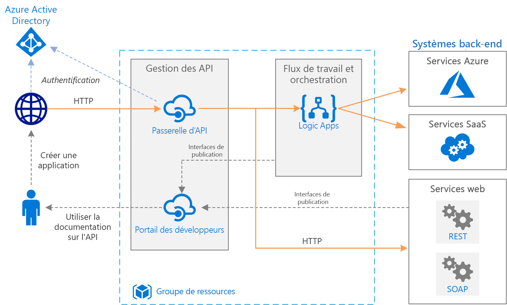

# Intégration d’entreprise de base sur Azure

Cette architecture de référence utilise [Azure Integration Services][integration-services] pour orchestrer des appels aux systèmes principaux d’entreprise. Les systèmes principaux peuvent inclure des systèmes SaaS (Logiciel en tant que service), des services Azure et des services web existants dans votre entreprise.

Azure Integration Services est une collection de services pour intégrer des applications et des données. Cette architecture utilise deux de ces services : [Logic Apps][logic-apps] pour orchestrer les workflows, et [Gestion des API][apim] pour créer des catalogues d’API. Cette architecture est suffisante pour les scénarios d’intégration de base où le workflow est déclenché par des appels synchrones à des services back-end. Une architecture plus sophistiquée utilisant des [files d’attente et des événements](./queues-events.md) s’appuie sur cette architecture de base.

## Architecture

Elle comporte les composants suivants :

- **Systèmes principaux**. Les différents systèmes back-end déployés par l’entreprise ou dont elle dépend se trouvent du côté droit du diagramme. Il peut s’agir de systèmes SaaS, d’autres services Azure, ou de services web qui exposent des points de terminaison REST ou SOAP.

- **Azure Logic Apps**. [Logic Apps][logic-apps] est une plateforme serverless pour la création de workflows d’entreprise qui intègrent des applications, des données et des services. Dans cette architecture, les applications logiques sont déclenchées par des requêtes HTTP. Vous pouvez également imbriquer des workflows pour une orchestration plus complexe. Logic Apps utilise des [connecteurs][logic-apps-connectors] pour s’intégrer à des services couramment utilisés. Logic Apps propose des centaines de connecteurs, et vous pouvez créer des connecteurs personnalisés.

- **Azure API Management** : [Gestion des API][apim] est un service managé pour la publication de catalogues d’API HTTP, qui promeut la réutilisation et la découvrabilité. Gestion des API se compose de deux composants associés :

  - **Passerelle API**. La passerelle API accepte des appels HTTP et les dirige vers le serveur principal.

  - **Portail des développeurs**. Chaque instance de Gestion des API Azure fournit un accès au [portail des développeurs][apim-dev-portal]. Ce portail permet aux développeurs un accès à la documentation et à des exemples de code pour appeler les API. Vous pouvez également tester les API dans le portail des développeurs.

  Dans cette architecture, les API composites sont générées par [l’importation d’applications logiques][apim-logic-app] en tant qu’API. Vous pouvez également importer des services web existants grâce à [l’importation de spécifications OpenAPI][apim-openapi] (Swagger) ou [l’importation d’API SOAP][apim-soap] à partir de spécifications WSDL.

  La passerelle API permet de découpler les clients frontaux depuis le serveur principal. Par exemple, elle peut réécrire les URL, ou transformer des requêtes avant qu’elles atteignent le serveur principal. Elle gère également les nombreux problèmes transversaux comme l’authentification, la prise en charge du partage des ressources cross-origin (CORS) et la mise en cache des réponses.

- **Azure DNS**. [Azure DNS][dns] est un service d’hébergement pour les domaines DNS. Azure DNS offre une résolution de noms à l’aide de l’infrastructure Microsoft Azure. En hébergeant vos domaines dans Azure, vous pouvez gérer vos enregistrements DNS en utilisant les mêmes informations d’identification, les mêmes API, les mêmes outils et la même facturation que pour vos autres services Azure. Pour utiliser un nom de domaine personnalisé, tel que contoso.com, créez des enregistrements DNS qui mappent le nom de domaine personnalisé sur l’adresse IP. Pour plus d’informations, consultez [Configurer un nom de domaine personnalisé dans Gestion des API][apim-domain].

- **Azure Active Directory (Azure AD)**. Utilisez [Azure AD][aad] pour authentifier des clients qui appellent la passerelle API. Azure AD prend en charge le protocole OpenID Connect (OIDC). Les clients obtiennent un jeton d’accès à partir d’Azure AD et la passerelle API [valide le jeton][apim-jwt] pour autoriser la requête. Lorsque vous utilisez le niveau Standard ou Premium de Gestion des API, Azure AD peut également sécuriser l’accès au portail des développeurs.

## Recommandations

Vos exigences spécifiques peuvent différer de l’architecture générique indiquée ici. Utilisez les recommandations de cette section comme point de départ.

### Gestion des API

Utilisez les niveaux De base, Standard ou Premium de Gestion des API. Ces niveaux offrent un contrat de niveau de service de production et prennent en charge le scale-out au sein de la région Azure. La capacité de débit pour Gestion des API est mesurée en *unités*. Chaque niveau tarifaire a un scale-out maximal. Le niveau Premium prend également en charge le scale-out dans plusieurs régions Azure. Choisissez votre niveau en fonction de votre ensemble de fonctionnalités et du niveau de débit requis. Pour plus d’informations, consultez [Tarification de Gestion des API][apim-pricing] et la [Capacité d’une instance du service Gestion des API Azure][apim-capacity].

Chaque instance du service Gestion des API Azure a un nom de domaine par défaut, qui est un sous-domaine de `azure-api.net`, par exemple `contoso.azure-api.net`. Envisagez de configurer un [domaine personnalisé][apim-domain] pour votre organisation.

### Logic Apps

Logic Apps fonctionne mieux dans les scénarios qui ne nécessitent pas de latence faible pour une réponse, par exemple les appels d’API asynchrones ou à exécution semi-longue. Si une latence faible est nécessaire, par exemple dans un appel qui bloque une interface utilisateur, utilisez une autre technologie. Par exemple, utilisez Azure Functions ou une API web déployée sur Azure App Service. Utilisez Gestion des API pour proposer l’API à vos consommateurs d’API.

### Région

Pour réduire la latence du réseau, placez Gestion des API et Logic Apps dans la même région. En général, choisissez la région la plus proche de vos utilisateurs (ou la plus proche de vos services principaux).

Le groupe de ressources a également une région. Cette région indique l’emplacement de stockage des métadonnées de déploiement et l’emplacement d’exécution du modèle de déploiement. Pour améliorer la disponibilité pendant le déploiement, placez le groupe de ressources et les ressources dans la même région.

## Considérations relatives à l’extensibilité

Pour augmenter la scalabilité de Gestion des API, ajoutez des [stratégies de mise en cache][apim-caching] quand cela est nécessaire. La mise en cache permet également de réduire la charge sur les services principaux.

Pour offrir une plus grande capacité, vous pouvez faire monter en charge les niveaux De base, Standard et Premium de Gestion des API Azure au sein d’une région Azure. Pour analyser l’utilisation de votre service, dans le menu **Métriques**, sélectionnez l’option **Métrique de capacité**, puis effectuez une montée ou descente en puissance selon le cas. Le processus de mise à niveau ou de mise à l’échelle peut durer entre 15 et 45 minutes.

Recommandations pour la mise à l’échelle d’un service Gestion des API :

- Prenez en compte les modèles de trafic pendant une mise à l’échelle. Les clients utilisant des modèles de trafic plus volatiles ont besoin de davantage de capacité.

- Une capacité constante supérieure à 66 % peut indiquer un besoin de monter en puissance.

- Une capacité constante inférieure à 20 % peut indiquer une opportunité de descendre en puissance.

- Avant d’activer la charge en production, effectuez toujours un test de charge de votre service Gestion des API avec une charge représentative.

Avec le niveau Premium, vous pouvez faire évoluer une instance de Gestion des API dans plusieurs régions Azure. Cela permet à Gestion des API de profiter d’un contrat de niveau de service plus élevé et vous permet de provisionner des services à proximité des utilisateurs dans plusieurs régions.

Le modèle serverless de Logic Apps signifie que les administrateurs n’ont pas besoin de planifier la scalabilité des services. Le service s’ajuste automatiquement pour répondre à la demande.

## Considérations relatives à la disponibilité

Passez en revue le contrat de niveau de service pour chaque service :

- [Contrat de niveau de service de Gestion des API][apim-sla]
- [Contrat de niveau de service de Logic Apps][logic-apps-sla]

Si vous déployez Gestion des API sur deux régions ou plus avec un niveau Premium, ce service est éligible pour un contrat SLA supérieur. Voir [Tarification de Gestion des API][apim-pricing].

### Sauvegardes

[Sauvegardez][apim-backup] régulièrement votre configuration de Gestion des API. Stockez vos fichiers de sauvegarde dans un emplacement ou une région Azure qui diffère de celle où le service est déployé. Selon votre [RTO][rto], choisissez une stratégie de récupération d’urgence :

- Dans un événement de reprise d’activité, provisionnez une nouvelle instance Gestion des API, restaurez la sauvegarde dans la nouvelle instance et redirigez les enregistrements DNS.

- Conservez une instance passive du service Gestion des API dans une autre région Azure. Restaurez régulièrement des sauvegardes sur cette instance, pour la maintenir synchronisée avec le service actif. Pour restaurer le service durant un événement de reprise d’activité, vous devez uniquement rediriger les enregistrements DNS. Cette approche entraîne des coûts supplémentaires, car vous payez pour l’instance passive ; elle réduit cependant le temps de récupération.

Pour les applications logiques, nous recommandons une approche de configuration sous forme de code pour effectuer la sauvegarde et la restauration. Étant donné que les applications logiques sont sans serveur, vous pouvez les recréer rapidement à partir de modèles Azure Resource Manager. Enregistrez les modèles dans le contrôle de code source, intégrez les modèles à votre processus de déploiement continu/intégration continue (CI/CD). Dans un événement de récupération d’urgence, déployez le modèle dans une nouvelle région.

Si vous déployez une application logique dans une autre région, mettez à jour la configuration de Gestion des API. Vous pouvez mettre à jour la propriété **back-end** de l’API à l’aide d’un script PowerShell de base.

## Considérations relatives à la facilité de gestion

Créez des groupes de ressources distincts pour les environnements de production, de développement et de test. Des groupes de ressources distincts simplifient la gestion des déploiements, la suppression des déploiements de tests et l’attribution des droits d’accès.

Lorsque vous attribuez des ressources à des groupes de ressources, considérez les facteurs suivants :

- **Cycle de vie**. D’une façon générale, placez les ressources dotées d’un même cycle de vie dans un même groupe de ressources.

- **Accès**. Pour appliquer des stratégies d’accès aux ressources dans un groupe, vous pouvez utiliser le [contrôle d’accès en fonction du rôle][rbac] (RBAC).

- **Facturation**. Vous pouvez afficher les coûts cumulés pour le groupe de ressources.

- **Niveau tarifaire pour Gestion des API**. Utilisez le niveau Développeur pour les environnements de développement et de test. Pour réduire les coûts durant la préproduction, déployez un réplica de votre environnement de production, exécutez vos tests, puis arrêtez.

### Déploiement

Utilisez les [modèles Azure Resource Manager][arm] pour déployer les ressources Azure. Les modèles facilitent l’automatisation des déploiements en utilisant PowerShell ou l’interface de ligne de commande Azure.

Placez Gestion des API Azure et toutes les applications logiques individuelles dans leurs propres modèles Resource Manager distincts. En utilisant des modèles distincts, vous pouvez stocker les ressources dans les systèmes de contrôle de code source. Vous pouvez déployer les modèles, ensemble ou individuellement, dans le cadre d’un processus CI/CD.

### Versions

Chaque fois que vous changez la configuration d’une application logique ou que vous déployez une mise à jour par le biais d’un modèle Resource Manager, Azure conserve une copie de cette version et conserve toutes les versions qui ont un historique d’exécution. Vous pouvez utiliser ces versions pour suivre les modifications historiques ou pour promouvoir une version en tant que configuration actuelle de l’application logique. Par exemple, vous pouvez restaurer une application logique vers une version antérieure.

Gestion des API prend en charge deux concepts de contrôle de version distincts, mais complémentaires :

- Les *versions* offrent aux consommateurs d’API la possibilité de choisir une version d’API en fonction de leurs besoins, par exemple, v1, v2, bêta ou production.

- Les *révisions* permettent aux administrateurs d’API d’apporter des modifications mineures dans une API et de déployer ces modifications, ainsi que d’un journal des modifications pour informer les consommateurs de l’API des modifications.

Vous pouvez effectuer une révision dans un environnement de développement et déployer cette modification entre d’autres environnements à l’aide de modèles Resource Manager. Pour plus d’informations, consultez [Publier plusieurs versions d’une API de manière prévisible][apim-versions]

Vous pouvez également utiliser des révisions pour tester une API avant de valider et de rendre les modifications accessibles aux utilisateurs. Toutefois, cette méthode n’est pas recommandée pour les tests de charge ou les tests d’intégration. Au lieu de cela, utilisez des environnements de préproduction et de test distincts.

## Diagnostics et surveillance

Utilisez [Azure Monitor][monitor] pour la supervision opérationnelle dans Gestion des API et Logic Apps. Azure Monitor fournit des informations basées sur les métriques configurées pour chaque service, et est activé par défaut. Pour plus d'informations, consultez les pages suivantes :

- [Surveiller les API publiées][apim-monitor]
- [Surveiller l’état, configurer la journalisation des diagnostics et activer les alertes pour Azure Logic Apps][logic-apps-monitor]

Chaque service a également ces options :

- Pour une analyse approfondie et la création de tableaux de bord, envoyez les journaux Logic Apps à [Azure Log Analytics][logic-apps-log-analytics].

- Pour la supervision DevOps, configurez Azure Application Insights pour le service Gestion des API.

- Gestion des API prend en charge le [modèle de solution Power BI pour l’analyse personnalisée d’API][apim-pbi]. Vous pouvez utiliser ce modèle de solution pour créer votre propre solution d’analytique. Pour les utilisateurs professionnels, Power BI met des rapports à disposition.

## Considérations relatives à la sécurité

Bien que la liste ci-après ne décrive pas complètement toutes les bonnes pratiques liées à la sécurité, vous y trouverez quelques considérations sur la sécurité qui s’appliquent spécifiquement à cette architecture :

- Le service Gestion des API Azure a une adresse IP publique fixe. Limitez l’accès pour appeler des points de terminaison Logic Apps uniquement à l’adresse IP de Gestion des API. Pour plus d’informations, consultez [Limiter les adresses IP entrantes][logic-apps-restrict-ip].

- Pour que les utilisateurs aient des niveaux d’accès appropriés, utilisez le contrôle d’accès en fonction du rôle (RBAC).

- Sécurisez les points de terminaison des API publiques dans Gestion des API à l’aide d’OAuth ou d’OpenID Connect. Pour sécuriser les points de terminaison des API publiques, configurez un fournisseur d’identité et ajoutez une stratégie de validation de jeton JSON Web Token (JWT). Pour plus d’informations, consultez [Guide pratique pour protéger une API à l’aide d’OAuth 2.0 avec Azure Active Directory et Gestion des API][apim-oauth].

- Connectez-vous aux services principaux à partir de Gestion des API en utilisant des certificats mutuels.

- Appliquez le protocole HTTPS sur les API de Gestion des API.

### Stockage des secrets

Ne recherchez jamais des mots de passe, clés d’accès ou chaînes de connexion dans un contrôle de code source. Si ces valeurs sont nécessaires, sécurisez-les et déployez-les à l’aide des méthodes appropriées.

Si une application logique nécessite des valeurs sensibles que vous ne pouvez pas créer dans un connecteur, stockez ces valeurs dans Azure Key Vault et référencez-les à partir d’un modèle Resource Manager. Utilisez des paramètres de modèle de déploiement, ainsi que des fichiers de paramètres pour chaque environnement. Pour plus d’informations, consultez [Sécuriser les paramètres et les entrées dans un flux de travail][logic-apps-secure].

Gestion des API gère les secrets à l’aide d’objets appelés *valeurs nommées* ou *propriétés nommées*. Ces objets stockent de manière sécurisée les valeurs auxquelles vous pouvez accéder par le biais des stratégies de Gestion des API. Pour plus d’informations, consultez [Guide pratique pour utiliser des valeurs nommées dans les stratégies Gestion des API Azure][apim-properties].

## Considérations relatives au coût

Vous êtes facturé pour toutes les instances de Gestion des API lorsqu’elles sont en cours d’exécution. Si vous avez effectué un scale-up et que vous n’avez pas besoin de ce niveau de performances tout le temps, faites un scale-down manuellement ou configurez [l’autoscaling][apim-autoscale].

Logic Apps utilise un modèle [serverless](/azure/logic-apps/logic-apps-serverless-overview). La facturation est calculée en fonction de l’action et de l’exécution du connecteur. Pour plus d’informations, consultez [Tarifs Logic Apps](https://azure.microsoft.com/pricing/details/logic-apps/). Actuellement, il n’existe aucune considération de niveau pour Logic Apps.

## Étapes suivantes

Pour une fiabilité et une scalabilité supérieures, utilisez des files d’attente de messages et des événements pour découpler les systèmes back-end. Ce modèle est illustré dans l’architecture de référence suivante dans cette série : [Intégration d’entreprise avec des files d’attente de messages et des événements](./queues-events.md).

<!-- links -->

[aad]: /azure/active-directory
[apim]: /azure/api-management
[apim-autoscale]: /azure/api-management/api-management-howto-autoscale
[apim-backup]: /azure/api-management/api-management-howto-disaster-recovery-backup-restore
[apim-caching]: /azure/api-management/api-management-howto-cache
[apim-capacity]: /azure/api-management/api-management-capacity
[apim-dev-portal]: /azure/api-management/api-management-key-concepts#a-namedeveloper-portal-a-developer-portal
[apim-domain]: /azure/api-management/configure-custom-domain
[apim-jwt]: /azure/api-management/policies/authorize-request-based-on-jwt-claims
[apim-logic-app]: /azure/api-management/import-logic-app-as-api
[apim-monitor]: /azure/api-management/api-management-howto-use-azure-monitor
[apim-oauth]: /azure/api-management/api-management-howto-protect-backend-with-aad
[apim-openapi]: /azure/api-management/import-api-from-oas
[apim-pbi]: https://aka.ms/apimpbi
[apim-pricing]: https://azure.microsoft.com/pricing/details/api-management/
[apim-properties]: /azure/api-management/api-management-howto-properties
[apim-sla]: https://azure.microsoft.com/support/legal/sla/api-management/
[apim-soap]: /azure/api-management/import-soap-api
[apim-versions]: /azure/api-management/api-management-get-started-publish-versions
[arm]: /azure/azure-resource-manager/resource-group-authoring-templates
[dns]: /azure/dns/
[integration-services]: https://azure.microsoft.com/product-categories/integration/
[logic-apps]: /azure/logic-apps/logic-apps-overview
[logic-apps-connectors]: /azure/connectors/apis-list
[logic-apps-log-analytics]: /azure/logic-apps/logic-apps-monitor-your-logic-apps-oms
[logic-apps-monitor]: /azure/logic-apps/logic-apps-monitor-your-logic-apps
[logic-apps-restrict-ip]: /azure/logic-apps/logic-apps-securing-a-logic-app#restrict-incoming-ip-addresses
[logic-apps-secure]: /azure/logic-apps/logic-apps-securing-a-logic-app#secure-parameters-and-inputs-within-a-workflow
[logic-apps-sla]: https://azure.microsoft.com/support/legal/sla/logic-apps
[monitor]: /azure/azure-monitor/overview
[rbac]: /azure/role-based-access-control/overview
[rto]: ../../resiliency/index.md#rto-and-rpo