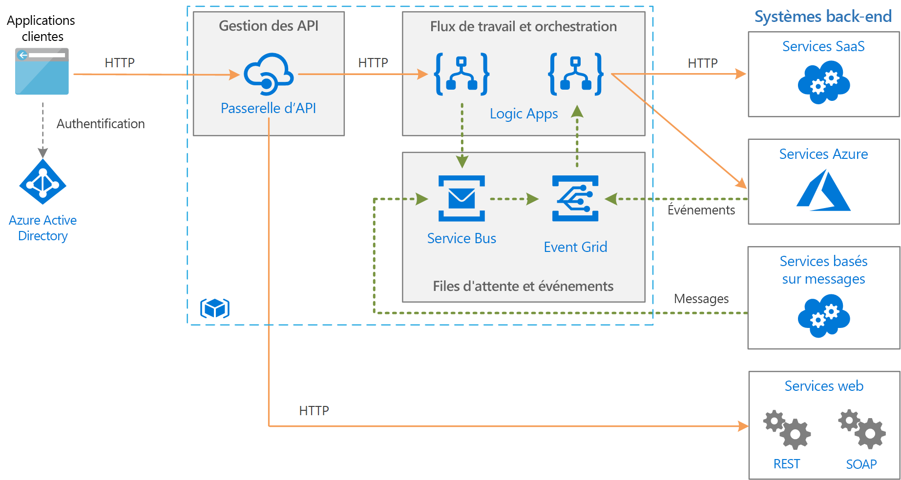

# Intégration d’entreprise sur Azure avec des files d’attente de messages et des événementsEnterprise integration on Azure using message queues and events

Cette architecture de référence intègre des systèmes back-end d’entreprise, avec des files d’attente de messages et des événements, pour découpler les services et obtenir ainsi une scalabilité et une fiabilité supérieures.This reference architecture integrates enterprise backend systems, using message queues and events to decouple services for greater scalability and reliability. Les systèmes principaux peuvent inclure des systèmes SaaS (Logiciel en tant que service), des services Azure et des services web existants dans votre entreprise.The backend systems may include software as a service (SaaS) systems, Azure services, and existing web services in your enterprise.

## ArchitectureArchitecture

L’architecture illustrée ici s’appuie sur une architecture plus simple, qui est illustrée dans [Intégration d’entreprise de base][basic-enterprise-integration].The architecture shown here builds on a simpler architecture that is shown in [Basic enterprise integration][basic-enterprise-integration]. Cette architecture utilise [Logic Apps][logic-apps] pour orchestrer les workflows, et [Gestion des API][apim] pour créer des catalogues d’API.That architecture uses [Logic Apps][logic-apps] to orchestrate workflows and [API Management][apim] to create catalogs of APIs.

Cette version de l’architecture ajoute deux composants qui permettent de rendre le système plus fiable et plus scalable :This version of the architecture adds two components that help make the system more reliable and scalable:

- **[Azure Service Bus][service-bus]**.**[Azure Service Bus][service-bus]**. Service Bus est un courtier de messages sécurisé et fiable.Service Bus is a secure, reliable message broker.

- **[Azure Event Grid][event-grid]**.**[Azure Event Grid][event-grid]**. Event Grid est un service de routage d’événements.Event Grid is an event routing service. Il utilise un modèle de gestion des événements [publication/abonnement](../../patterns/publisher-subscriber.md) (pub/sub).It uses a [publish/subscribe](../../patterns/publisher-subscriber.md) (pub/sub) eventing model.

La communication asynchrone avec un courtier de messages offre plusieurs avantages par rapport aux appels synchrones, directs à des services back-end :Asynchronous communication using a message broker provides a number of advantages over making direct, synchronous calls to backend services:

- Fournit un nivellement de la charge pour gérer les pics des charges de travail avec le [Modèle de nivellement de charge basé sur une file d’attente](../../patterns/queue-based-load-leveling.md).Provides load-leveling to handle bursts in workloads, using the [Queue-Based Load Leveling pattern](../../patterns/queue-based-load-leveling.md).
- Effectue un suivi fiable de la progression des workflows à exécution longue qui impliquent plusieurs étapes ou plusieurs applications.Reliably tracks the progress of long-running workflows that involve multiple steps or multiple applications.
- Aide à découpler les applications.Helps to decouple applications.
- S’intègre à des systèmes existants basés sur les messages.Integrates with existing message-based systems.
- Permet la mise en file d’attente des travaux quand un système back-end n’est pas disponible.Allows work to be queued when a backend system is not available.

Event Grid permet aux différents composants du système de réagir aux événements au fur et à mesure qu’ils se produisent, au lieu de s’appuyer sur l’interrogation ou sur des tâches planifiées.Event Grid enables the various components in the system to react to events as they happen, rather than relying on polling or scheduled tasks. Comme avec une file d’attente de messages, il permet de découpler les applications et les services.As with a message queue, it helps decouple applications and services. Une application ou un service peut publier des événements : les abonnés intéressés en sont alors avertis.An application or service can publish events, and any interested subscribers will be notified. De nouveaux abonnés peuvent être ajoutés sans mettre à jour l’expéditeur.New subscribers can be added without updating the sender.

De nombreux services Azure prennent en charge l’envoi d’événements à Event Grid.Many Azure services support sending events to Event Grid. Par exemple, une application logique peut être à l’écoute d’un événement, par exemple quand de nouveaux fichiers sont ajoutés à un magasin d’objets blob.For example, a logic app can listen for an event when new files are added to a blob store. Ce modèle permet des workflows réactifs, où le chargement d’un fichier ou le placement d’un message dans une file d’attente lance une série de processus.This pattern enables reactive workflows, where uploading a file or putting a message on a queue kicks off a series of processes. Les processus peuvent être exécutés en parallèle ou dans une séquence spécifique.The processes might be executed in parallel or in a specific sequence.

## RecommandationsRecommendations

Les recommandations décrites dans [Intégration d’entreprise de base][basic-enterprise-integration] s’appliquent à cette architecture.The recommendations described in [Basic enterprise integration][basic-enterprise-integration] apply to this architecture. Les recommandations suivantes s’appliquent également :The following recommendations also apply:

### Service BusService Bus

Service Bus a deux modes de remise, *extraction (pull)* et *envoi (push)*.Service Bus has two delivery modes, *pull* or *push*. Dans le modèle d’extraction, le récepteur interroge de façon continue pour déterminer s’il y a de nouveaux messages.In the pull model, the receiver continuously polls for new messages. L’interrogation peut être inefficace, surtout si vous avez de nombreuses files d’attente qui reçoivent chacune quelques messages, ou si l’intervalle de temps entre les messages est important.Polling can be inefficient, especially if you have many queues that each receive a few messages, or if there a lot of time between messages. Dans le modèle d’envoi, Service Bus envoie un événement via Event Grid quand il y a des nouveaux messages.In the push model, Service Bus sends an event through Event Grid when there are new messages. Le destinataire s’abonne à l’événement.The receiver subscribes to the event. Quand l’événement est déclenché, le destinataire extrait de Service Bus le lot de messages suivant.When the event is triggered, the receiver pulls the next batch of messages from Service Bus.

Quand vous créez une application logique pour consommer des messages Service Bus, nous recommandons d’utiliser le modèle d’envoi avec intégration d’Event Grid.When you create a logic app to consume Service Bus messages, we recommend using the push model with Event Grid integration. Il est souvent plus économique, car l’application logique n’a pas besoin d’interroger Service Bus.It's often more cost efficient, because the logic app doesn't need to poll Service Bus. Pour plus d’informations, consultez [Vue d’ensemble de l’intégration d’Azure Service Bus à Event Grid](/azure/service-bus-messaging/service-bus-to-event-grid-integration-concept).For more information, see [Azure Service Bus to Event Grid integration overview](/azure/service-bus-messaging/service-bus-to-event-grid-integration-concept). Actuellement, le [niveau Premium](https://azure.microsoft.com/pricing/details/service-bus/) de Service Bus est nécessaire pour les notifications Event Grid.Currently, Service Bus [Premium tier](https://azure.microsoft.com/pricing/details/service-bus/) is required for Event Grid notifications.

Utilisez [PeekLock](/azure/service-bus-messaging/service-bus-messaging-overview#queues) pour accéder à un groupe de messages.Use [PeekLock](/azure/service-bus-messaging/service-bus-messaging-overview#queues) for accessing a group of messages. Lorsque vous utilisez PeekLock, l’application logique peut suivre des étapes pour valider chaque message avant de terminer ou d’abandonner le message.When you use PeekLock, the logic app can perform steps to validate each message before completing or abandoning the message. Cette approche protège contre la perte accidentelle de messages.This approach protects against accidental message loss.

### Event GridEvent Grid

Quand un déclencheur Event Grid est activé, cela signifie *qu’au moins un* événement s’est produit.When an Event Grid trigger fires, it means *at least one* event happened. Par exemple, quand une application logique reçoit un déclencheur Event Grid pour un message Service Bus, elle doit supposer que plusieurs messages peuvent être disponibles pour être traités.For example, when a logic app gets an Event Grid triggers for a Service Bus message, it should assume that several messages might be available to process.

Event Grid utilise un modèle serverless.Event Grid uses a serverless model. La facturation est calculée en fonction du nombre d’opérations (exécutions d’événement).Billing is calculated based on the number of operations (event executions). Pour plus d’informations, consultez [Prix d’Event Grid](https://azure.microsoft.com/pricing/details/event-grid/).For more information, see [Event Grid pricing](https://azure.microsoft.com/pricing/details/event-grid/). Actuellement, aucune considération relative aux niveaux ne s’applique à Event Grid.Currently, there are no tier considerations for Event Grid.

## Considérations relatives à l’extensibilitéScalability considerations

Pour bénéficier d’une meilleure extensibilité, le niveau Premium de Service Bus peut augmenter le nombre d’unités de messagerie.To achieve higher scalability, the Service Bus Premium tier can scale out the number of messaging units. Les configurations de niveau Premium peuvent avoir une, deux ou quatre unités de messagerie.Premium tier configurations can have one, two, or four messaging units. Pour plus d’informations sur le dimensionnement de Service Bus, consultez [Bonnes pratiques relatives aux améliorations de performances à l’aide de la messagerie Service Bus](/azure/service-bus-messaging/service-bus-performance-improvements).For more information about scaling Service Bus, see [Best practices for performance improvements by using Service Bus Messaging](/azure/service-bus-messaging/service-bus-performance-improvements).

## Considérations relatives à la disponibilitéAvailability considerations

Passez en revue le contrat de niveau de service pour chaque service :Review the SLA for each service:

- [Contrat de niveau de service de Gestion des API][apim-sla][API Management SLA][apim-sla]
- [Contrat SLA d’Event Grid][event-grid-sla][Event Grid SLA][event-grid-sla]
- [Contrat de niveau de service de Logic Apps][logic-apps-sla][Logic Apps SLA][logic-apps-sla]
- [Contrat SLA de Service Bus][sb-sla][Service Bus SLA][sb-sla]

Pour permettre un basculement en cas de panne grave, envisagez d’implémenter la géo-reprise d'activité après sinistre dans Service Bus Premium.To enable failover if a serious outage occurs, consider implementing geo-disaster recovery in Service Bus Premium. Pour plus d’informations, consultez [Géo-reprise d'activité après sinistre avec Azure Service Bus](/azure/service-bus-messaging/service-bus-geo-dr).For more information, see [Azure Service Bus geo-disaster recovery](/azure/service-bus-messaging/service-bus-geo-dr).

## Considérations relatives à la sécuritéSecurity considerations

Pour sécuriser Service Bus, utilisez une signature d’accès partagé.To secure Service Bus, use shared access signature (SAS). Par exemple, vous pouvez accorder à un utilisateur l’accès à des ressources Service Bus avec des droits spécifiques en utilisant l’[authentification SAS](/azure/service-bus-messaging/service-bus-sas).You can grant a user access to Service Bus resources with specific rights by using [SAS authentication](/azure/service-bus-messaging/service-bus-sas). Pour plus d’informations, consultez [Authentification et autorisation Service Bus](/azure/service-bus-messaging/service-bus-authentication-and-authorization).For more information, see [Service Bus authentication and authorization](/azure/service-bus-messaging/service-bus-authentication-and-authorization).

Si vous devez exposer une file d’attente Service Bus en tant que point de terminaison HTTP (pour la publication de nouveaux messages, par exemple), utilisez Gestion des API pour la sécuriser en exposant le point de terminaison.If you need to expose a Service Bus queue as an HTTP endpoint, for example, to post new messages, use API Management to secure the queue by fronting the endpoint. Vous pouvez alors sécuriser le point de terminaison avec des certificats ou une authentification OAuth si besoin.You can then secure the endpoint with certificates or OAuth authentication as appropriate. Le moyen le plus simple de sécuriser un point de terminaison consiste à utiliser une application logique avec un déclencheur de requête/réponse HTTP comme intermédiaire.The easiest way to secure an endpoint is using a logic app with an HTTP request/response trigger as an intermediary.

Le service Event Grid sécurise la distribution des événements au moyen d’un code de validation.The Event Grid service secures event delivery through a validation code. Si vous utilisez Logic Apps pour consommer l’événement, la validation est automatiquement effectuée.If you use Logic Apps to consume the event, validation is automatically performed. Pour en savoir plus, consultez la page [Sécurité et authentification pour Event Grid](/azure/event-grid/security-authentication).For more information, see [Event Grid security and authentication](/azure/event-grid/security-authentication).

[apim]: /azure/api-management
[apim-sla]: https://azure.microsoft.com/support/legal/sla/api-management/
[event-grid]: /azure/event-grid/
[event-grid-sla]: https://azure.microsoft.com/support/legal/sla/event-grid
[logic-apps]: /azure/logic-apps/logic-apps-overview
[logic-apps-sla]: https://azure.microsoft.com/support/legal/sla/logic-apps
[sb-sla]: https://azure.microsoft.com/support/legal/sla/service-bus/
[service-bus]: /azure/service-bus-messaging/
[basic-enterprise-integration]: ./basic-enterprise-integration.md
