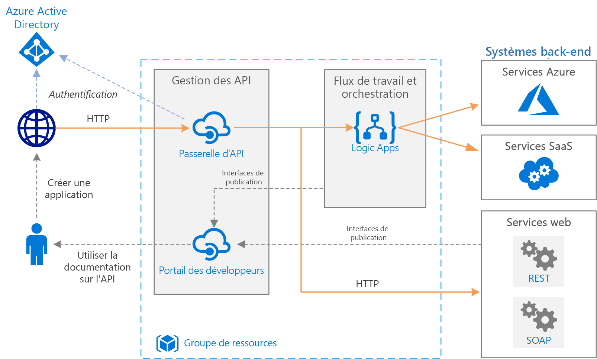

# Intégration d’entreprise simpleSimple enterprise integration

Cette architecture de référence utilise [Azure Integration Services][integration-services] pour orchestrer des appels aux systèmes principaux d’entreprise.This reference architecture uses [Azure Integration Services][integration-services] to orchestrate calls to enterprise backend systems. Les systèmes principaux peuvent inclure des systèmes SaaS (Logiciel en tant que service), des services Azure et des services web existants dans votre entreprise.The backend systems may include software as a service (SaaS) systems, Azure services, and existing web services in your enterprise.

Azure Integration Services est une collection de services pour intégrer des applications et des données.Azure Integration Services is a collection of services for integrating applications and data. Cette architecture utilise deux de ces services : [Logic Apps][logic-apps] pour orchestrer des workflows, et [Gestion des API][apim] pour créer des catalogues d’API.This architecture uses two of those services: [Logic Apps][logic-apps] to orchestrate workflows, and [API Management][apim] to create catalogs of APIs.

## ArchitectureArchitecture

Elle comporte les composants suivants :The architecture has the following components:

- **Systèmes principaux**.**Backend systems**. Les différents systèmes principaux déployés ou dont dépend l’entreprise sont situés sur le côté droit du diagramme.On the right-hand side of the diagram are the various backend systems that the enterprise has deployed or relies on. Il peut s’agir de systèmes SaaS, d’autres services Azure, ou de services web qui exposent des points de terminaison REST ou SOAP.These might include SaaS systems, other Azure services, or web services that expose REST or SOAP endpoints.

- **Azure Logic Apps**.**Azure Logic Apps**. [Logic Apps][logic-apps] est une plateforme serverless pour la création de workflows d’entreprise qui intègrent des applications, des données et des services.[Logic Apps][logic-apps] is a serverless platform for building enterprise workflows that integrate applications, data, and services. Dans cette architecture, les applications logiques sont déclenchées par des requêtes HTTP.In this architecture, the logic apps are triggered by HTTP requests. Vous pouvez également imbriquer des workflows pour une orchestration plus complexe.You can also nest workflows for more complex orchestration. Logic Apps utilise des [connecteurs][logic-apps-connectors] pour s’intégrer à des services couramment utilisés.Logic Apps uses [connectors][logic-apps-connectors] to integrate with commonly used services. Logic Apps propose des centaines de connecteurs, et vous pouvez créer des connecteurs personnalisés.Logic Apps offers hundreds of connectors, and you can create custom connectors.

- **Azure API Management** :**Azure API Management**. [Gestion des API][apim] est un service géré pour la publication de catalogues d’API HTTP, afin de promouvoir la réutilisation et la détectabilité.[API Management][apim] is a managed service for publishing catalogs of HTTP APIs, to promote re-use and discoverability. Gestion des API se compose de deux composants associés :API Management consists of two related components:

    - **Passerelle API**.**API gateway**. La passerelle API accepte des appels HTTP et les dirige vers le serveur principal.The API gateway accepts HTTP calls and routes them to the backend. 

    - **Portail des développeurs**.**Developer portal**. Chaque instance de Gestion des API Azure fournit un accès au [portail des développeurs][apim-dev-portal].Each instance of Azure API Management provides access to a [developer portal][apim-dev-portal]. Ce portail permet aux développeurs un accès à la documentation et à des exemples de code pour appeler les API.This portal gives your developers access to documentation and code samples for calling the APIs. Vous pouvez également tester les API dans le portail des développeurs.You can also test APIs in the developer portal.

    Dans cette architecture, les API composites sont générées par [l’importation d’applications logiques][apim-logic-app] en tant qu’API.In this architecture, composite APIs are built by [importing logic apps][apim-logic-app] as APIs. Vous pouvez également importer des services web existants grâce à [l’importation de spécifications OpenAPI][apim-openapi] (Swagger) ou [l’importation d’API SOAP][apim-soap] à partir de spécifications WSDL.You can also import existing web services by [importing OpenAPI][apim-openapi] (Swagger) specifications or [importing SOAP APIs][apim-soap] from WSDL specifications. 

    La passerelle API permet de découpler les clients frontaux depuis le serveur principal.The API gateway helps to decouple front-end clients from the back end. Par exemple, elle peut réécrire les URL, ou transformer des requêtes avant qu’elles atteignent le serveur principal.For example, it can rewrite URLs, or transform requests before they reach the backend. Elle gère également les nombreux problèmes transversaux comme l’authentification, la prise en charge du partage des ressources cross-origin (CORS) et la mise en cache des réponses.It also handles many cross-cutting concerns such as authentication, cross-origin resource sharing (CORS) support, and response caching.

- **Azure DNS**.**Azure DNS**. [Azure DNS][dns] est un service d’hébergement pour les domaines DNS.[Azure DNS][dns] is a hosting service for DNS domains. Azure DNS offre une résolution de noms à l’aide de l’infrastructure Microsoft Azure.Azure DNS provides name resolution by using the Microsoft Azure infrastructure. En hébergeant vos domaines dans Azure, vous pouvez gérer vos enregistrements DNS en utilisant les mêmes informations d’identification, les mêmes API, les mêmes outils et la même facturation que pour vos autres services Azure.By hosting your domains in Azure, you can manage your DNS records by using the same credentials, APIs, tools, and billing that you use for your other Azure services. Pour utiliser un nom de domaine personnalisé, tel que contoso.com, créez des enregistrements DNS qui mappent le nom de domaine personnalisé sur l’adresse IP.To use a custom domain name, such as contoso.com, create DNS records that map the custom domain name to the IP address. Pour plus d’informations, consultez [Configurer un nom de domaine personnalisé dans Gestion des API][apim-domain].For more information, see [Configure a custom domain name in API Management][apim-domain].

- **Azure Active Directory (Azure AD)**.**Azure Active Directory (Azure AD)**. Utilisez [Azure AD][aad] pour authentifier des clients qui appellent la passerelle API.Use [Azure AD][aad] to authenticate clients that call the API gateway. Azure AD prend en charge le protocole OpenID Connect (OIDC).Azure AD supports the OpenID Connect (OIDC) protocol. Les clients obtiennent un jeton d’accès à partir d’Azure AD et la passerelle API [valide le jeton][apim-jwt] pour autoriser la requête.Clients obtain an access token from Azure AD, and API Gateway [validates the token][apim-jwt] to authorize the request. Lorsque vous utilisez le niveau Standard ou Premium de Gestion des API, Azure AD peut également sécuriser l’accès au portail des développeurs.When using the Standard or Premium tier of API Management, Azure AD can also secure access to the developer portal.

## RecommandationsRecommendations

Vos exigences spécifiques peuvent différer de l’architecture générique indiquée ici.Your specific requirements might differ from the generic architecture shown here. Utilisez les recommandations de cette section comme point de départ.Use the recommendations in this section as a starting point.

### API ManagementAPI Management

Utilisez les niveaux De base, Standard ou Premium de Gestion des API.Use the API Management Basic, Standard, or Premium tiers. Ces niveaux offrent un contrat de niveau de service de production et prennent en charge le scale-out au sein de la région Azure.These tiers offer a production service level agreement (SLA) and support scale out within the Azure region. La capacité de débit pour Gestion des API est mesurée en *unités*.Throughput capacity for API Management is measured in *units*. Chaque niveau de tarification possède un scale out maximal. Le niveau Premium prend également en charge le scale-out dans plusieurs régions Azure.Each pricing tier has a maximum scale out. The Premium tier also supports scale out across multiple Azure regions. Choisissez votre niveau en fonction de votre ensemble de fonctionnalités et du niveau de débit requis.Choose your tier based on your feature set and the level of required throughput. Pour plus d’informations, consultez [Tarification de Gestion des API][apim-pricing] et la [Capacité d’une instance du service Gestion des API Azure][apim-capacity].For more information, see [API Management pricing][apim-pricing] and [Capacity of an Azure API Management instance][apim-capacity].

Chaque instance du service Gestion des API Azure a un nom de domaine par défaut, qui est un sous-domaine de `azure-api.net` & mdash par exemple, `contoso.azure-api.net`.Each Azure API Management instance has a default domain name, which is a subdomain of `azure-api.net` &mdash for example, `contoso.azure-api.net`. Envisagez de configurer un [domaine personnalisé][apim-domain] pour votre organisation.Consider configuring a [custom domain][apim-domain] for your organization.

### Logic AppsLogic Apps 

Logic Apps fonctionne mieux dans les scénarios qui ne nécessitent pas une faible latence.Logic Apps works best in scenarios that don't require low latency. Par exemple, Logic Apps convient le mieux pour les appels d’API asynchrones ou de mi-longueur.For example, Logic Apps works best for asynchronous or semi long-running API calls. Si une latence faible est requise, par exemple, un appel qui bloque une interface utilisateur, implémentez votre API ou cette opération à l’aide d’une technologie différente.If low latency is required, for example, a call that blocks a user interface, implement your API or operation by using a different technology. Par exemple, utilisez Azure Functions ou une API web déployée à l’aide d’Azure App Service.For example, use Azure Functions or a Web API that you deploy by using Azure App Service. Utilisez Gestion des API pour proposer l’API à vos consommateurs d’API.Use API Management to front the API to your API consumers.

### RégionRegion

Pour réduire la latence du réseau, placez Gestion des API et Logic Apps dans la même région.To minimize network latency, put API Management and Logic Apps in the same region. En général, choisissez la région la plus proche de vos utilisateurs (ou la plus proche de vos services principaux).In general, choose the region that's closest to your users (or closest to your backend services).

Le groupe de ressources a également une région.The resource group also has a region. Cette région indique l’emplacement de stockage des métadonnées de déploiement et l’emplacement d’exécution du modèle de déploiement.This region specifies where to store deployment metadata and where to execute the deployment template. Pour améliorer la disponibilité pendant le déploiement, placez le groupe de ressources et les ressources dans la même région.To improve availability during deployment, put the resource group and resources in the same region.

## Considérations relatives à l’extensibilitéScalability considerations

Pour augmenter la scalabilité de Gestion des API, ajoutez des [stratégies de mise en cache][apim-caching] quand cela est nécessaire.To increase the scalability of API Management, add [caching policies][apim-caching] where appropriate. La mise en cache permet également de réduire la charge sur les services principaux.Caching also helps reduce the load on back-end services.

Pour offrir une plus grande capacité, vous pouvez faire monter en charge les niveaux De base, Standard et Premium de Gestion des API Azure au sein d’une région Azure.To offer greater capacity, you can scale out Azure API Management Basic, Standard, and Premium tiers in an Azure region. Pour analyser l’utilisation de votre service, dans le menu **Métriques**, sélectionnez l’option **Métrique de capacité**, puis effectuez une montée ou descente en puissance selon le cas.To analyze the usage for your service, on the **Metrics** menu, select the **Capacity Metric** option and then scale up or scale down as appropriate. Le processus de mise à niveau ou de mise à l’échelle peut durer entre 15 et 45 minutes.The upgrade or scale process can take from 15 to 45 minutes to apply.

Recommandations pour la mise à l’échelle d’un service Gestion des API :Recommendations for scaling an API Management service:

- Prenez en compte les modèles de trafic pendant une mise à l’échelle.Consider traffic patterns when scaling. Les clients utilisant des modèles de trafic plus volatiles ont besoin de davantage de capacité.Customers with more volatile traffic patterns need more capacity.

- Une capacité constante supérieure à 66 % peut indiquer un besoin de monter en puissance.Consistent capacity that's greater than 66% might indicate a need to scale up.

- Une capacité constante inférieure à 20 % peut indiquer une opportunité de descendre en puissance.Consistent capacity that's under 20% might indicate an opportunity to scale down.

- Avant d’activer la charge en production, effectuez toujours un test de charge de votre service Gestion des API avec une charge représentative.Before you enable the load in production, always load-test your API Management service with a representative load.

Avec le niveau Premium, vous pouvez faire évoluer une instance de Gestion des API dans plusieurs régions Azure.With the Premium tier, you can scale an API Management instance across multiple Azure regions. Cela permet à Gestion des API de profiter d’un contrat de niveau de service plus élevé et vous permet de provisionner des services à proximité des utilisateurs dans plusieurs régions.This makes API Management eligible for a higher SLA, and lets you provision services near users in multiple regions.

Le modèle serverless de Logic Apps signifie que les administrateurs n’ont pas besoin de planifier la scalabilité des services.The Logic Apps serverless model means administrators don't have to plan for service scalability. Le service s’ajuste automatiquement pour répondre à la demande.The service automatically scales to meet demand.

## Considérations relatives à la disponibilitéAvailability considerations

Passez en revue le contrat de niveau de service pour chaque service :Review the SLA for each service:

- [Contrat de niveau de service de Gestion des API][apim-sla][API Management SLA][apim-sla]
- [Contrat de niveau de service de Logic Apps][logic-apps-sla][Logic Apps SLA][logic-apps-sla]

Lorsque Gestion des API est déployé sur deux régions ou plus avec un niveau Premium, ce service est éligible pour un contrat de niveau de service plus élevé.If deploy API Management across two or more regions with Premium tier, it is eligible for a higher SLA. Voir [Tarification de Gestion des API][apim-pricing].See [API Management pricing][apim-pricing].

### SauvegardesBackups

[Sauvegardez][apim-backup] régulièrement votre configuration de Gestion des API.Regularly [back up][apim-backup] your API Management configuration. Stockez vos fichiers de sauvegarde dans un emplacement ou une région Azure qui diffère de celle où le service est déployé.Store your backup files in a location or Azure region that differs from the region where the service is deployed. Selon votre [RTO][rto], choisissez une stratégie de récupération d’urgence :Based on your [RTO][rto], choose a disaster recovery strategy:

* Dans un événement de reprise d’activité, provisionnez une nouvelle instance Gestion des API, restaurez la sauvegarde dans la nouvelle instance et redirigez les enregistrements DNS.In a disaster recovery event, provision a new API Management instance, restore the backup to the new instance, and repoint the DNS records.

* Conservez une instance passive du service Gestion des API dans une autre région Azure.Keep a passive instance of the API Management service in another Azure region. Restaurez régulièrement des sauvegardes sur cette instance, pour la maintenir synchronisée avec le service actif.Regularly restore backups to that instance, to keep it in sync with the active service. Pour restaurer le service durant un événement de reprise d’activité, vous devez uniquement rediriger les enregistrements DNS.To restore the service during a disaster recovery event, you need only repoint the DNS records. Cette approche entraîne des coûts supplémentaires, car vous payez pour l’instance passive, mais cela réduit le temps de récupération.This approach incurs additional cost because you are paying for the passive instance, but reduces the time to recover. 

Pour les applications logiques, nous vous recommandons une approche de configuration sous forme de code pour effectuer les sauvegardes et la restauration.For logic apps, we recommend a configuration-as-code approach to backup and restoring. Étant donné que les applications logiques sont sans serveur, vous pouvez les recréer rapidement à partir de modèles Azure Resource Manager.Because logic apps are serverless, you can quickly recreate them from Azure Resource Manager templates. Enregistrez les modèles dans le contrôle de code source, intégrez les modèles à votre processus de déploiement continu/intégration continue (CI/CD).Save the templates in source control, integrate the templates with your continuous integration/continuous deployment (CI/CD) process. Dans un événement de récupération d’urgence, déployez le modèle dans une nouvelle région.In a disaster recovery event, deploy the template to a new region.

Si vous déployez une application logique dans une autre région, mettez à jour la configuration de Gestion des API.If you deploy a logic app to a different region, update the configuration in API Management. Vous pouvez mettre à jour la propriété **back-end** de l’API à l’aide d’un script PowerShell de base.You can update the API's **Backend** property by using a basic PowerShell script.

## Considérations relatives à la facilité de gestionManageability considerations

Créez des groupes de ressources distincts pour les environnements de production, de développement et de test.Create separate resource groups for production, development, and test environments. Des groupes de ressources distincts simplifient la gestion des déploiements, la suppression des déploiements de tests et l’attribution des droits d’accès.Separate resource groups make it easier to manage deployments, delete test deployments, and assign access rights.

Lorsque vous attribuez des ressources à des groupes de ressources, considérez les facteurs suivants :When you assign resources to resource groups, consider these factors:

* **Cycle de vie**.**Lifecycle**. D’une façon générale, placez les ressources dotées d’un même cycle de vie dans un même groupe de ressources.In general, put resources that have the same lifecycle in the same resource group.

* **Accès**.**Access**. Pour appliquer des stratégies d’accès aux ressources dans un groupe, vous pouvez utiliser le [contrôle d’accès en fonction du rôle][rbac] (RBAC).To apply access policies to the resources in a group, you can use [role-based access control][rbac] (RBAC).

* **Facturation**.**Billing**. Vous pouvez afficher les coûts cumulés pour le groupe de ressources.You can view rollup costs for the resource group.

* **Niveau tarifaire pour Gestion des API**.**Pricing tier for API Management**. Utilisez le niveau Développeur pour les environnements de développement et de test.Use the Developer tier for development and test environments. Pour réduire les coûts durant la préproduction, déployez un réplica de votre environnement de production, exécutez vos tests, puis arrêtez.To minimize costs during preproduction, deploy a replica of your production environment, run your tests, and then shut down.

### DéploiementDeployment

Utilisez les [modèles Azure Resource Manager][arm] pour déployer les ressources Azure.Use [Azure Resource Manager templates][arm] to deploy the Azure resources. Les modèles facilitent l’automatisation des déploiements en utilisant PowerShell ou l’interface de ligne de commande Azure.Templates make it easier to automate deployments using PowerShell or the Azure CLI.

Placez Gestion des API Azure et toutes les applications logiques individuelles dans leurs propres modèles Resource Manager distincts.Put API Management and any individual logic apps in their own separate Resource Manager templates. En utilisant des modèles distincts, vous pouvez stocker les ressources dans les systèmes de contrôle de code source.By using separate templates, you can store the resources in source control systems. Vous pouvez alors déployer ces modèles ensemble ou individuellement dans le cadre d’un processus d’intégration continue/déploiement continu (CI/CD).You can then deploy these templates together or individually as part of a continuous integration/continuous deployment (CI/CD) process.

### VersionsVersions

Chaque fois que vous changez la configuration d’une application logique ou que vous déployez une mise à jour par le biais d’un modèle Resource Manager, Azure conserve une copie de cette version et conserve toutes les versions qui ont un historique d’exécution.Each time you change a logic app's configuration or deploy an update through a Resource Manager template, Azure keeps a copy of that version and keeps all versions that have a run history. Vous pouvez utiliser ces versions pour suivre les modifications historiques ou pour promouvoir une version en tant que configuration actuelle de l’application logique.You can use these versions to track historical changes or promote a version as the logic app's current configuration. Par exemple, vous pouvez restaurer une application logique vers une version antérieure.For example, you can roll back a logic app to a previous version.

Gestion des API prend en charge deux concepts de contrôle de version distincts, mais complémentaires :API Management supports two distinct but complementary versioning concepts:

* Les *versions* offrent aux consommateurs d’API la possibilité de choisir une version d’API en fonction de leurs besoins, par exemple, v1, v2, bêta ou production.*Versions* allow API consumers to choose an API version based on their needs, for example, v1, v2, beta, or production.

* Les *révisions* permettent aux administrateurs d’API d’apporter des modifications mineures dans une API et de déployer ces modifications, ainsi que d’un journal des modifications pour informer les consommateurs de l’API des modifications.*Revisions* allow API administrators to make non-breaking changes in an API and deploy those changes, along with a change log to inform API consumers about the changes.

Vous pouvez effectuer une révision dans un environnement de développement et déployer cette modification entre d’autres environnements à l’aide de modèles Resource Manager.You can make a revision in a development environment and deploy that change in other environments by using Resource Manager templates. Pour plus d’informations, consultez [Publier plusieurs versions d’une API de manière prévisible][apim-versions]For more information, see [Publish multiple versions of your API][apim-versions]

Vous pouvez également utiliser des révisions pour tester une API avant de valider et de rendre les modifications accessibles aux utilisateurs.You can also use revisions to test an API before making the changes current and accessible to users. Toutefois, cette méthode n’est pas recommandée pour les tests de charge ou les tests d’intégration.However, this method isn't recommended for load testing or integration testing. Utilisez plutôt des environnements de préproduction et de test distincts.Instead, use separate test or preproduction environments.

## Diagnostics et surveillanceDiagnostics and monitoring

Utilisez [Azure Monitor][monitor] pour la supervision opérationnelle dans Gestion des API et Logic Apps.Use [Azure Monitor][monitor] for operational monitoring in both API Management and Logic Apps. Azure Monitor fournit des informations basées sur les métriques configurées pour chaque service, et est activé par défaut.Azure Monitor provides information based on the metrics configured for each service and is enabled by default. Pour plus d'informations, consultez les pages suivantes :For more information, see:

- [Surveiller les API publiées][apim-monitor][Monitor published APIs][apim-monitor]
- [Surveiller l’état, configurer la journalisation des diagnostics et activer les alertes pour Azure Logic Apps][logic-apps-monitor][Monitor status, set up diagnostics logging, and turn on alerts for Azure Logic Apps][logic-apps-monitor]

Chaque service a également ces options :Each service also has these options:

* Pour une analyse approfondie et la création de tableaux de bord, envoyez les journaux Logic Apps à [Azure Log Analytics][logic-apps-log-analytics].For deeper analysis and dashboarding, send Logic Apps logs to [Azure Log Analytics][logic-apps-log-analytics].

* Pour la supervision DevOps, configurez Azure Application Insights pour le service Gestion des API.For DevOps monitoring, configure Azure Application Insights for API Management.

* Gestion des API prend en charge le [modèle de solution Power BI pour l’analyse personnalisée d’API][apim-pbi].API Management supports the [Power BI solution template for custom API analytics][apim-pbi]. Vous pouvez utiliser ce modèle de solution pour créer votre propre solution d’analytique.You can use this solution template for creating your own analytics solution. Pour les utilisateurs professionnels, Power BI met des rapports à disposition.For business users, Power BI makes reports available.

## Considérations relatives à la sécuritéSecurity considerations

Bien que la liste ci-après ne décrive pas complètement toutes les bonnes pratiques liées à la sécurité, vous y trouverez quelques considérations sur la sécurité qui s’appliquent spécifiquement à cette architecture :Although this list doesn't completely describe all security best practices, here are some security considerations that apply specifically to this architecture:

* Le service Gestion des API Azure a une adresse IP publique fixe.The Azure API Management service has a fixed public IP address. Limitez l’accès pour appeler des points de terminaison Logic Apps uniquement à l’adresse IP de Gestion des API.Restrict access for calling Logic Apps endpoints to only the IP address of API Management. Pour plus d’informations, consultez [Limiter les adresses IP entrantes][logic-apps-restrict-ip].For more information, see [Restrict incoming IP addresses][logic-apps-restrict-ip].

* Pour que les utilisateurs aient des niveaux d’accès appropriés, utilisez le contrôle d’accès en fonction du rôle (RBAC).To make sure users have appropriate access levels, use role-based access control (RBAC).

* Sécurisez les points de terminaison des API publiques dans Gestion des API à l’aide d’OAuth ou d’OpenID Connect.Secure public API endpoints in API Management by using OAuth or OpenID Connect. Pour sécuriser les points de terminaison des API publiques, configurez un fournisseur d’identité et ajoutez une stratégie de validation de jeton JSON Web Token (JWT).To secure public API endpoints, configure an identity provider, and add a JSON Web Token (JWT) validation policy. Pour plus d’informations, consultez [Guide pratique pour protéger une API à l’aide d’OAuth 2.0 avec Azure Active Directory et Gestion des API][apim-oauth].For more information, see [Protect an API by using OAuth 2.0 with Azure Active Directory and API Management][apim-oauth].

* Connectez-vous aux services principaux à partir de Gestion des API en utilisant des certificats mutuels.Connect to back-end services from API Management by using mutual certificates.

* Appliquez le protocole HTTPS sur les API de Gestion des API.Enforce HTTPS on the API Management APIs.

### Stockage des secretsStoring secrets

Ne recherchez jamais des mots de passe, clés d’accès ou chaînes de connexion dans un contrôle de code source.Never check passwords, access keys, or connection strings into source control. Si ces valeurs sont nécessaires, sécurisez-les et déployez-les à l’aide des méthodes appropriées.If these values are required, secure and deploy these values by using the appropriate techniques. 

Si une application logique nécessite des valeurs sensibles que vous ne pouvez pas créer dans un connecteur, stockez ces valeurs dans Azure Key Vault et référencez-les à partir d’un modèle Resource Manager.If a logic app requires any sensitive values that you can't create within a connector, store those values in Azure Key Vault and reference them from a Resource Manager template. Utilisez des paramètres de modèle de déploiement, ainsi que des fichiers de paramètres pour chaque environnement.Use deployment template parameters and parameter files for each environment. Pour plus d’informations, consultez [Sécuriser les paramètres et les entrées dans un flux de travail][logic-apps-secure].For more information, see [Secure parameters and inputs within a workflow][logic-apps-secure].

Gestion des API gère les secrets à l’aide d’objets appelés *valeurs nommées* ou *propriétés nommées*.API Management manages secrets by using objects called *named values* or *properties*. Ces objets stockent de manière sécurisée les valeurs auxquelles vous pouvez accéder par le biais des stratégies de Gestion des API.These objects securely store values that you can access through API Management policies. Pour plus d’informations, consultez [Guide pratique pour utiliser des valeurs nommées dans les stratégies Gestion des API Azure][apim-properties].For more information, see [How to use Named Values in Azure API Management policies][apim-properties].

## Considérations relatives au coûtCost considerations

Vous êtes facturé pour toutes les instances de Gestion des API lorsqu’elles sont en cours d’exécution.You are charged for all API Management instances when they are running. Si vous avez effectué un scale-up et que vous n’avez pas besoin de ce niveau de performances tout le temps, faites un scale-down manuellement ou configurez [l’autoscaling][apim-autoscale].If you have scaled up and don't need that level of performance all the time, manually scale down or configure [autoscaling][apim-autoscale].

Logic Apps utilise un modèle [serverless](/azure/logic-apps/logic-apps-serverless-overview).Logic Apps uses a [serverless](/azure/logic-apps/logic-apps-serverless-overview) model. La facturation est calculée en fonction de l’action et de l’exécution du connecteur.Billing is calculated based on action and connector execution. Pour plus d’informations, consultez [Tarifs Logic Apps](https://azure.microsoft.com/pricing/details/logic-apps/).For more information, see [Logic Apps pricing](https://azure.microsoft.com/pricing/details/logic-apps/). Actuellement, il n’existe aucune considération de niveau pour Logic Apps.Currently, there are no tier considerations for Logic Apps.

## Étapes suivantesNext steps

* Découvrez [l’intégration d’entreprise avec files d’attente et événements](/azure/logic-apps/logic-apps-architectures-enterprise-integration-with-queues-events).Learn about [enterprise integration with queues and events](/azure/logic-apps/logic-apps-architectures-enterprise-integration-with-queues-events)

<!-- links -->

[aad]: /azure/active-directory
[apim]: /azure/api-management
[apim-autoscale]: /azure/api-management/api-management-howto-autoscale
[apim-backup]: /azure/api-management/api-management-howto-disaster-recovery-backup-restore
[apim-caching]: /azure/api-management/api-management-howto-cache
[apim-capacity]: /azure/api-management/api-management-capacity
[apim-dev-portal]: /azure/api-management/api-management-key-concepts#a-namedeveloper-portal-a-developer-portal
[apim-domain]: /azure/api-management/configure-custom-domain
[apim-jwt]: /azure/api-management/policies/authorize-request-based-on-jwt-claims
[apim-logic-app]: /azure/api-management/import-logic-app-as-api
[apim-monitor]: /azure/api-management/api-management-howto-use-azure-monitor
[apim-oauth]: /azure/api-management/api-management-howto-protect-backend-with-aad
[apim-openapi]: /azure/api-management/import-api-from-oas
[apim-pbi]: http://aka.ms/apimpbi
[apim-pricing]: https://azure.microsoft.com/pricing/details/api-management/
[apim-properties]: /azure/api-management/api-management-howto-properties
[apim-sla]: https://azure.microsoft.com/support/legal/sla/api-management/
[apim-soap]: /azure/api-management/import-soap-api
[apim-versions]: /azure/api-management/api-management-get-started-publish-versions
[arm]: /azure/azure-resource-manager/resource-group-authoring-templates
[dns]: /azure/dns/
[integration-services]: https://azure.microsoft.com/product-categories/integration/
[logic-apps]: /azure/logic-apps/logic-apps-overview
[logic-apps-connectors]: /azure/connectors/apis-list
[logic-apps-log-analytics]: /azure/logic-apps/logic-apps-monitor-your-logic-apps-oms
[logic-apps-monitor]: /azure/logic-apps/logic-apps-monitor-your-logic-apps
[logic-apps-restrict-ip]: /azure/logic-apps/logic-apps-securing-a-logic-app#restrict-incoming-ip-addresses
[logic-apps-secure]: /azure/logic-apps/logic-apps-securing-a-logic-app#secure-parameters-and-inputs-within-a-workflow
[logic-apps-sla]: https://azure.microsoft.com/support/legal/sla/logic-apps
[monitor]: /azure/azure-monitor/overview
[rbac]: /azure/role-based-access-control/overview
[rto]: ../../resiliency/index.md#rto-and-rpo