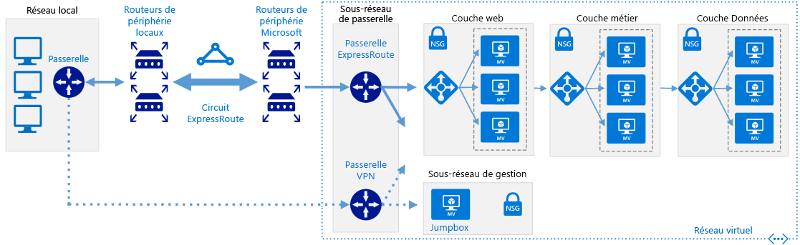

# <a name="connect-an-on-premises-network-to-azure-using-expressroute-with-vpn-failover"></a><span data-ttu-id="0f93b-103">Connecter un réseau local à Azure à l’aide d’ExpressRoute avec basculement VPN</span><span class="sxs-lookup"><span data-stu-id="0f93b-103">Connect an on-premises network to Azure using ExpressRoute with VPN failover</span></span>

<span data-ttu-id="0f93b-104">Cette architecture de référence montre comment connecter un réseau local à un réseau virtuel Azure (VNet) à l’aide d’ExpressRoute, avec un réseau privé virtuel (VPN) de site à site en tant que connexion de basculement.</span><span class="sxs-lookup"><span data-stu-id="0f93b-104">This reference architecture shows how to connect an on-premises network to an Azure virtual network (VNet) using ExpressRoute, with a site-to-site virtual private network (VPN) as a failover connection.</span></span> <span data-ttu-id="0f93b-105">Le trafic circule entre le réseau local et réseau virtuel Azure via une connexion ExpressRoute.</span><span class="sxs-lookup"><span data-stu-id="0f93b-105">Traffic flows between the on-premises network and the Azure VNet through an ExpressRoute connection.</span></span> <span data-ttu-id="0f93b-106">En cas de perte de connectivité au niveau du circuit ExpressRoute, le trafic est acheminé via un tunnel VPN IPSec.</span><span class="sxs-lookup"><span data-stu-id="0f93b-106">If there is a loss of connectivity in the ExpressRoute circuit, traffic is routed through an IPSec VPN tunnel.</span></span> <span data-ttu-id="0f93b-107">[**Déployez cette solution**](#deploy-the-solution).</span><span class="sxs-lookup"><span data-stu-id="0f93b-107">[**Deploy this solution**](#deploy-the-solution).</span></span>

<span data-ttu-id="0f93b-108">Notez que si le circuit ExpressRoute n’est pas disponible, l’itinéraire VPN gérera uniquement les connexions d’homologation privées.</span><span class="sxs-lookup"><span data-stu-id="0f93b-108">Note that if the ExpressRoute circuit is unavailable, the VPN route will only handle private peering connections.</span></span> <span data-ttu-id="0f93b-109">Les connexions d’homologation publique et Microsoft transiteront via Internet.</span><span class="sxs-lookup"><span data-stu-id="0f93b-109">Public peering and Microsoft peering connections will pass over the Internet.</span></span>



<span data-ttu-id="0f93b-111">*Téléchargez un [fichier Visio][visio-download] de cette architecture.*</span><span class="sxs-lookup"><span data-stu-id="0f93b-111">*Download a [Visio file][visio-download] of this architecture.*</span></span>

## <a name="architecture"></a><span data-ttu-id="0f93b-112">Architecture</span><span class="sxs-lookup"><span data-stu-id="0f93b-112">Architecture</span></span>

<span data-ttu-id="0f93b-113">L’architecture est constituée des composants suivants.</span><span class="sxs-lookup"><span data-stu-id="0f93b-113">The architecture consists of the following components.</span></span>

- <span data-ttu-id="0f93b-114">**Réseau local**.</span><span class="sxs-lookup"><span data-stu-id="0f93b-114">**On-premises network**.</span></span> <span data-ttu-id="0f93b-115">Un réseau local privé s’exécutant au sein d’une organisation.</span><span class="sxs-lookup"><span data-stu-id="0f93b-115">A private local-area network running within an organization.</span></span>

- <span data-ttu-id="0f93b-116">**Appliance VPN**.</span><span class="sxs-lookup"><span data-stu-id="0f93b-116">**VPN appliance**.</span></span> <span data-ttu-id="0f93b-117">Périphérique ou service qui assure la connectivité externe au réseau local.</span><span class="sxs-lookup"><span data-stu-id="0f93b-117">A device or service that provides external connectivity to the on-premises network.</span></span> <span data-ttu-id="0f93b-118">L’appliance VPN peut être un périphérique matériel ou une solution logicielle telle que le service RRAS (Routing and Remote Access Service) dans Windows Server 2012.</span><span class="sxs-lookup"><span data-stu-id="0f93b-118">The VPN appliance may be a hardware device, or it can be a software solution such as the Routing and Remote Access Service (RRAS) in Windows Server 2012.</span></span> <span data-ttu-id="0f93b-119">Pour obtenir la liste des périphériques VPN pris en charge et des informations sur la configuration de certains périphériques VPN pour la connexion à Azure, consultez [À propos des périphériques VPN pour les connexions de la passerelle VPN de site à site][vpn-appliance].</span><span class="sxs-lookup"><span data-stu-id="0f93b-119">For a list of supported VPN appliances and information on configuring selected VPN appliances for connecting to Azure, see [About VPN devices for Site-to-Site VPN Gateway connections][vpn-appliance].</span></span>

- <span data-ttu-id="0f93b-120">**Circuit ExpressRoute**.</span><span class="sxs-lookup"><span data-stu-id="0f93b-120">**ExpressRoute circuit**.</span></span> <span data-ttu-id="0f93b-121">Un circuit de couche 2 ou 3 fourni par le fournisseur de connectivité et qui relie le réseau local à Azure via les routeurs de périphérie.</span><span class="sxs-lookup"><span data-stu-id="0f93b-121">A layer 2 or layer 3 circuit supplied by the connectivity provider that joins the on-premises network with Azure through the edge routers.</span></span> <span data-ttu-id="0f93b-122">Le circuit utilise l’infrastructure matérielle gérée par le fournisseur de connectivité.</span><span class="sxs-lookup"><span data-stu-id="0f93b-122">The circuit uses the hardware infrastructure managed by the connectivity provider.</span></span>

- <span data-ttu-id="0f93b-123">**Passerelle de réseau virtuel ExpressRoute**.</span><span class="sxs-lookup"><span data-stu-id="0f93b-123">**ExpressRoute virtual network gateway**.</span></span> <span data-ttu-id="0f93b-124">La passerelle de réseau virtuel ExpressRoute permet au réseau virtuel de se connecter au circuit ExpressRoute utilisé pour la connectivité avec votre réseau local.</span><span class="sxs-lookup"><span data-stu-id="0f93b-124">The ExpressRoute virtual network gateway enables the VNet to connect to the ExpressRoute circuit used for connectivity with your on-premises network.</span></span>

- <span data-ttu-id="0f93b-125">**Passerelle de réseau virtuel VPN**.</span><span class="sxs-lookup"><span data-stu-id="0f93b-125">**VPN virtual network gateway**.</span></span> <span data-ttu-id="0f93b-126">La passerelle de réseau virtuel VPN permet au réseau virtuel de se connecter à l’appliance VPN sur le réseau local.</span><span class="sxs-lookup"><span data-stu-id="0f93b-126">The VPN virtual network gateway enables the VNet to connect to the VPN appliance in the on-premises network.</span></span> <span data-ttu-id="0f93b-127">La passerelle de réseau virtuel VPN est configurée pour accepter les requêtes provenant du réseau local uniquement via l’appliance VPN.</span><span class="sxs-lookup"><span data-stu-id="0f93b-127">The VPN virtual network gateway is configured to accept requests from the on-premises network only through the VPN appliance.</span></span> <span data-ttu-id="0f93b-128">Pour plus d’informations, consultez [Connecter un réseau local à Microsoft Azure Virtual Network][connect-to-an-Azure-vnet].</span><span class="sxs-lookup"><span data-stu-id="0f93b-128">For more information, see [Connect an on-premises network to a Microsoft Azure virtual network][connect-to-an-Azure-vnet].</span></span>

- <span data-ttu-id="0f93b-129">**Connexion VPN**.</span><span class="sxs-lookup"><span data-stu-id="0f93b-129">**VPN connection**.</span></span> <span data-ttu-id="0f93b-130">La connexion a des propriétés qui spécifient le type de connexion (IPSec) et la clé partagée avec l’appliance VPN locale pour chiffrer le trafic.</span><span class="sxs-lookup"><span data-stu-id="0f93b-130">The connection has properties that specify the connection type (IPSec) and the key shared with the on-premises VPN appliance to encrypt traffic.</span></span>

- <span data-ttu-id="0f93b-131">**Réseau virtuel Azure**.</span><span class="sxs-lookup"><span data-stu-id="0f93b-131">**Azure Virtual Network (VNet)**.</span></span> <span data-ttu-id="0f93b-132">Chaque réseau virtuel se trouve dans une région Azure unique et peut héberger plusieurs niveaux d’application.</span><span class="sxs-lookup"><span data-stu-id="0f93b-132">Each VNet resides in a single Azure region, and can host multiple application tiers.</span></span> <span data-ttu-id="0f93b-133">Les niveaux d’application peuvent être segmentés à l’aide de sous-réseaux dans chaque réseau virtuel.</span><span class="sxs-lookup"><span data-stu-id="0f93b-133">Application tiers can be segmented using subnets in each VNet.</span></span>

- <span data-ttu-id="0f93b-134">**Sous-réseau de passerelle**.</span><span class="sxs-lookup"><span data-stu-id="0f93b-134">**Gateway subnet**.</span></span> <span data-ttu-id="0f93b-135">Les passerelles de réseau virtuel sont conservées dans le même sous-réseau.</span><span class="sxs-lookup"><span data-stu-id="0f93b-135">The virtual network gateways are held in the same subnet.</span></span>

- <span data-ttu-id="0f93b-136">**Application cloud**.</span><span class="sxs-lookup"><span data-stu-id="0f93b-136">**Cloud application**.</span></span> <span data-ttu-id="0f93b-137">L’application hébergée dans Azure.</span><span class="sxs-lookup"><span data-stu-id="0f93b-137">The application hosted in Azure.</span></span> <span data-ttu-id="0f93b-138">Elle peut inclure plusieurs niveaux, avec plusieurs sous-réseaux connectés à l’aide d’équilibreurs de charge Azure.</span><span class="sxs-lookup"><span data-stu-id="0f93b-138">It might include multiple tiers, with multiple subnets connected through Azure load balancers.</span></span> <span data-ttu-id="0f93b-139">Pour plus d’informations sur l’infrastructure d’application, consultez [Running Windows VM workloads][windows-vm-ra] (Exécution de charges de travail de machine virtuelle Windows) et [Exécution de charges de travail de machine virtuelle Linux][linux-vm-ra].</span><span class="sxs-lookup"><span data-stu-id="0f93b-139">For more information about the application infrastructure, see [Running Windows VM workloads][windows-vm-ra] and [Running Linux VM workloads][linux-vm-ra].</span></span>

## <a name="recommendations"></a><span data-ttu-id="0f93b-140">Recommandations</span><span class="sxs-lookup"><span data-stu-id="0f93b-140">Recommendations</span></span>

<span data-ttu-id="0f93b-141">Les recommandations suivantes s’appliquent à la plupart des scénarios.</span><span class="sxs-lookup"><span data-stu-id="0f93b-141">The following recommendations apply for most scenarios.</span></span> <span data-ttu-id="0f93b-142">Suivez ces recommandations, sauf si vous avez un besoin spécifique qui vous oblige à les ignorer.</span><span class="sxs-lookup"><span data-stu-id="0f93b-142">Follow these recommendations unless you have a specific requirement that overrides them.</span></span>

### <a name="vnet-and-gatewaysubnet"></a><span data-ttu-id="0f93b-143">Réseau virtuel et sous-réseau GatewaySubnet</span><span class="sxs-lookup"><span data-stu-id="0f93b-143">VNet and GatewaySubnet</span></span>

<span data-ttu-id="0f93b-144">Créez la passerelle de réseau virtuel ExpressRoute et la passerelle de réseau virtuel VPN sur le même réseau virtuel.</span><span class="sxs-lookup"><span data-stu-id="0f93b-144">Create the ExpressRoute virtual network gateway and the VPN virtual network gateway in the same VNet.</span></span> <span data-ttu-id="0f93b-145">Cela signifie qu’ils doivent partager le même sous-réseau nommé *GatewaySubnet*.</span><span class="sxs-lookup"><span data-stu-id="0f93b-145">This means that they should share the same subnet named *GatewaySubnet*.</span></span>

<span data-ttu-id="0f93b-146">Si le réseau virtuel contient déjà un sous-réseau nommé *GatewaySubnet*, vérifiez qu’il possède un espace d’adressage défini sur /27 ou plus.</span><span class="sxs-lookup"><span data-stu-id="0f93b-146">If the VNet already includes a subnet named *GatewaySubnet*, ensure that it has a /27 or larger address space.</span></span> <span data-ttu-id="0f93b-147">Si le sous-réseau existant est trop petit, utilisez la commande PowerShell suivante pour supprimer le sous-réseau :</span><span class="sxs-lookup"><span data-stu-id="0f93b-147">If the existing subnet is too small, use the following PowerShell command to remove the subnet:</span></span>

```powershell
$vnet = Get-AzureRmVirtualNetworkGateway -Name <yourvnetname> -ResourceGroupName <yourresourcegroup>
Remove-AzureRmVirtualNetworkSubnetConfig -Name GatewaySubnet -VirtualNetwork $vnet
```

<span data-ttu-id="0f93b-148">Si le réseau virtuel ne contient aucun sous-réseau nommé **GatewaySubnet**, créez-en un à l’aide de la commande Powershell suivante :</span><span class="sxs-lookup"><span data-stu-id="0f93b-148">If the VNet does not contain a subnet named **GatewaySubnet**, create a new one using the following Powershell command:</span></span>

```powershell
$vnet = Get-AzureRmVirtualNetworkGateway -Name <yourvnetname> -ResourceGroupName <yourresourcegroup>
Add-AzureRmVirtualNetworkSubnetConfig -Name "GatewaySubnet" -VirtualNetwork $vnet -AddressPrefix "10.200.255.224/27"
$vnet = Set-AzureRmVirtualNetwork -VirtualNetwork $vnet
```

### <a name="vpn-and-expressroute-gateways"></a><span data-ttu-id="0f93b-149">Passerelles VPN et ExpressRoute</span><span class="sxs-lookup"><span data-stu-id="0f93b-149">VPN and ExpressRoute gateways</span></span>

<span data-ttu-id="0f93b-150">Vérifiez que votre organisation répond à la [configuration requise d’ExpressRoute] [ expressroute-prereq] pour se connecter à Azure.</span><span class="sxs-lookup"><span data-stu-id="0f93b-150">Verify that your organization meets the [ExpressRoute prerequisite requirements][expressroute-prereq] for connecting to Azure.</span></span>

<span data-ttu-id="0f93b-151">Si vous disposez déjà d’une passerelle de réseau virtuel VPN dans votre réseau virtuel Azure, utilisez la commande Powershell suivante pour la supprimer :</span><span class="sxs-lookup"><span data-stu-id="0f93b-151">If you already have a VPN virtual network gateway in your Azure VNet, use the following  Powershell command to remove it:</span></span>

```powershell
Remove-AzureRmVirtualNetworkGateway -Name <yourgatewayname> -ResourceGroupName <yourresourcegroup>
```

<span data-ttu-id="0f93b-152">Suivez les instructions de l’article [Implémentation d’une architecture réseau hybride avec Azure ExpressRoute][implementing-expressroute] pour établir votre connexion ExpressRoute.</span><span class="sxs-lookup"><span data-stu-id="0f93b-152">Follow the instructions in [Implementing a hybrid network architecture with Azure ExpressRoute][implementing-expressroute] to establish your ExpressRoute connection.</span></span>

<span data-ttu-id="0f93b-153">Suivez les instructions de l’article [Implémentation d’une architecture réseau hybride avec Azure et un VPN local][implementing-vpn] pour établir votre connexion de passerelle de réseau virtuel VPN.</span><span class="sxs-lookup"><span data-stu-id="0f93b-153">Follow the instructions in [Implementing a hybrid network architecture with Azure and On-premises VPN][implementing-vpn] to establish your VPN virtual network gateway connection.</span></span>

<span data-ttu-id="0f93b-154">Après avoir établi les connexions de passerelle de réseau virtuel, testez l’environnement comme suit :</span><span class="sxs-lookup"><span data-stu-id="0f93b-154">After you have established the virtual network gateway connections, test the environment as follows:</span></span>

1. <span data-ttu-id="0f93b-155">Vérifiez que vous pouvez vous connecter au réseau virtuel Azure à partir de votre réseau local.</span><span class="sxs-lookup"><span data-stu-id="0f93b-155">Make sure you can connect from your on-premises network to your Azure VNet.</span></span>
2. <span data-ttu-id="0f93b-156">Contactez votre fournisseur pour arrêter la connectivité ExpressRoute à des fins de test.</span><span class="sxs-lookup"><span data-stu-id="0f93b-156">Contact your provider to stop ExpressRoute connectivity for testing.</span></span>
3. <span data-ttu-id="0f93b-157">Vérifiez que vous pouvez toujours vous connecter au réseau virtuel Azure à partir de votre réseau local à l’aide de la connexion de passerelle de réseau virtuel VPN.</span><span class="sxs-lookup"><span data-stu-id="0f93b-157">Verify that you can still connect from your on-premises network to your Azure VNet using the VPN virtual network gateway connection.</span></span>
4. <span data-ttu-id="0f93b-158">Contactez votre fournisseur pour rétablir la connectivité ExpressRoute.</span><span class="sxs-lookup"><span data-stu-id="0f93b-158">Contact your provider to reestablish ExpressRoute connectivity.</span></span>

## <a name="considerations"></a><span data-ttu-id="0f93b-159">Considérations</span><span class="sxs-lookup"><span data-stu-id="0f93b-159">Considerations</span></span>

<span data-ttu-id="0f93b-160">Pour connaître les considérations relatives à ExpressRoute, consultez l’article [Implémentation d’une architecture réseau hybride avec Azure ExpressRoute][guidance-expressroute].</span><span class="sxs-lookup"><span data-stu-id="0f93b-160">For ExpressRoute considerations, see the [Implementing a Hybrid Network Architecture with Azure ExpressRoute][guidance-expressroute] guidance.</span></span>

<span data-ttu-id="0f93b-161">Pour connaître les considérations relatives au VPN de site à site, consultez l’article [Implémentation d’une architecture réseau hybride avec Azure et un VPN local][guidance-vpn].</span><span class="sxs-lookup"><span data-stu-id="0f93b-161">For site-to-site VPN considerations, see the [Implementing a Hybrid Network Architecture with Azure and On-premises VPN][guidance-vpn] guidance.</span></span>

<span data-ttu-id="0f93b-162">Pour connaître les considérations de sécurité générales relatives à Azure, consultez l’article [Services de cloud computing et sécurité réseau Microsoft][best-practices-security].</span><span class="sxs-lookup"><span data-stu-id="0f93b-162">For general Azure security considerations, see [Microsoft cloud services and network security][best-practices-security].</span></span>

## <a name="deploy-the-solution"></a><span data-ttu-id="0f93b-163">Déployer la solution</span><span class="sxs-lookup"><span data-stu-id="0f93b-163">Deploy the solution</span></span>

<span data-ttu-id="0f93b-164">**Conditions préalables**.</span><span class="sxs-lookup"><span data-stu-id="0f93b-164">**Prerequisites**.</span></span> <span data-ttu-id="0f93b-165">Vous devez disposer d’une infrastructure locale existante déjà configurée avec une appliance réseau appropriée.</span><span class="sxs-lookup"><span data-stu-id="0f93b-165">You must have an existing on-premises infrastructure already configured with a suitable network appliance.</span></span>

<span data-ttu-id="0f93b-166">Pour déployer la solution, procédez comme suit :</span><span class="sxs-lookup"><span data-stu-id="0f93b-166">To deploy the solution, perform the following steps.</span></span>

<!-- markdownlint-disable MD033 -->

1. <span data-ttu-id="0f93b-167">Cliquez sur le bouton ci-dessous :</span><span class="sxs-lookup"><span data-stu-id="0f93b-167">Click the button below:</span></span><br><a href="https://portal.azure.com/#create/Microsoft.Template/uri/https%3A%2F%2Fraw.githubusercontent.com%2Fmspnp%2Freference-architectures%2Fmaster%2Fhybrid-networking%2Fexpressroute-vpn-failover%2Fazuredeploy.json" target="_blank"></a>

2. <span data-ttu-id="0f93b-168">Attendez que le lien s’ouvre dans le portail Azure, puis procédez comme suit :</span><span class="sxs-lookup"><span data-stu-id="0f93b-168">Wait for the link to open in the Azure portal, then follow these steps:</span></span>
   - <span data-ttu-id="0f93b-169">Le nom du **groupe de ressources** est déjà défini dans le fichier de paramètres ; sélectionnez **Créer nouveau** et entrez `ra-hybrid-vpn-er-rg` dans la zone de texte.</span><span class="sxs-lookup"><span data-stu-id="0f93b-169">The **Resource group** name is already defined in the parameter file, so select **Create New** and enter `ra-hybrid-vpn-er-rg` in the text box.</span></span>
   - <span data-ttu-id="0f93b-170">Sélectionnez la région à partir de la zone déroulante **Emplacement**.</span><span class="sxs-lookup"><span data-stu-id="0f93b-170">Select the region from the **Location** drop down box.</span></span>
   - <span data-ttu-id="0f93b-171">Ne modifiez pas les zones de texte **Template Root Uri** (Uri racine de modèle) ou **Parameter Root Uri** (Uri racine de paramètre).</span><span class="sxs-lookup"><span data-stu-id="0f93b-171">Do not edit the **Template Root Uri** or the **Parameter Root Uri** text boxes.</span></span>
   - <span data-ttu-id="0f93b-172">Passez en revue les termes et conditions, puis cochez la case **J’accepte les termes et conditions mentionnés ci-dessus**.</span><span class="sxs-lookup"><span data-stu-id="0f93b-172">Review the terms and conditions, then click the **I agree to the terms and conditions stated above** checkbox.</span></span>
   - <span data-ttu-id="0f93b-173">Cliquez sur le bouton **Acheter**.</span><span class="sxs-lookup"><span data-stu-id="0f93b-173">Click the **Purchase** button.</span></span>

3. <span data-ttu-id="0f93b-174">Attendez la fin du déploiement.</span><span class="sxs-lookup"><span data-stu-id="0f93b-174">Wait for the deployment to complete.</span></span>

4. <span data-ttu-id="0f93b-175">Cliquez sur le bouton ci-dessous :</span><span class="sxs-lookup"><span data-stu-id="0f93b-175">Click the button below:</span></span><br><a href="https://portal.azure.com/#create/Microsoft.Template/uri/https%3A%2F%2Fraw.githubusercontent.com%2Fmspnp%2Freference-architectures%2Fmaster%2Fhybrid-networking%2Fexpressroute-vpn-failover%2Fazuredeploy-expressRouteCircuit.json" target="_blank"></a>

5. <span data-ttu-id="0f93b-176">Attendez que le lien s’ouvre dans le portail Azure, appuyez sur Entrée, puis procédez comme suit :</span><span class="sxs-lookup"><span data-stu-id="0f93b-176">Wait for the link to open in the Azure portal, then enter then follow these steps:</span></span>
   - <span data-ttu-id="0f93b-177">Sélectionnez **Utiliser l’existant** dans la section **Groupe de ressources** et saisissez `ra-hybrid-vpn-er-rg` dans la zone de texte.</span><span class="sxs-lookup"><span data-stu-id="0f93b-177">Select **Use existing** in the **Resource group** section and enter `ra-hybrid-vpn-er-rg` in the text box.</span></span>
   - <span data-ttu-id="0f93b-178">Sélectionnez la région à partir de la zone déroulante **Emplacement**.</span><span class="sxs-lookup"><span data-stu-id="0f93b-178">Select the region from the **Location** drop down box.</span></span>
   - <span data-ttu-id="0f93b-179">Ne modifiez pas les zones de texte **Template Root Uri** (Uri racine de modèle) ou **Parameter Root Uri** (Uri racine de paramètre).</span><span class="sxs-lookup"><span data-stu-id="0f93b-179">Do not edit the **Template Root Uri** or the **Parameter Root Uri** text boxes.</span></span>
   - <span data-ttu-id="0f93b-180">Passez en revue les termes et conditions, puis cochez la case **J’accepte les termes et conditions mentionnés ci-dessus**.</span><span class="sxs-lookup"><span data-stu-id="0f93b-180">Review the terms and conditions, then click the **I agree to the terms and conditions stated above** checkbox.</span></span>
   - <span data-ttu-id="0f93b-181">Cliquez sur le bouton **Acheter**.</span><span class="sxs-lookup"><span data-stu-id="0f93b-181">Click the **Purchase** button.</span></span>

<!-- markdownlint-enable MD033 -->

<!-- links -->

[windows-vm-ra]: ../virtual-machines-windows/index.md
[linux-vm-ra]: ../virtual-machines-linux/index.md
[resource-manager-overview]: /azure/azure-resource-manager/resource-group-overview
[vpn-appliance]: /azure/vpn-gateway/vpn-gateway-about-vpn-devices
[azure-vpn-gateway]: /azure/vpn-gateway/vpn-gateway-about-vpngateways
[connect-to-an-Azure-vnet]: https://technet.microsoft.com/library/dn786406.aspx
[expressroute-prereq]: /azure/expressroute/expressroute-prerequisites
[implementing-expressroute]: ./expressroute.md
[implementing-vpn]: ./vpn.md
[guidance-expressroute]: ./expressroute.md
[guidance-vpn]: ./vpn.md
[best-practices-security]: /azure/best-practices-network-security
[visio-download]: https://archcenter.blob.core.windows.net/cdn/hybrid-network-architectures.vsdx
