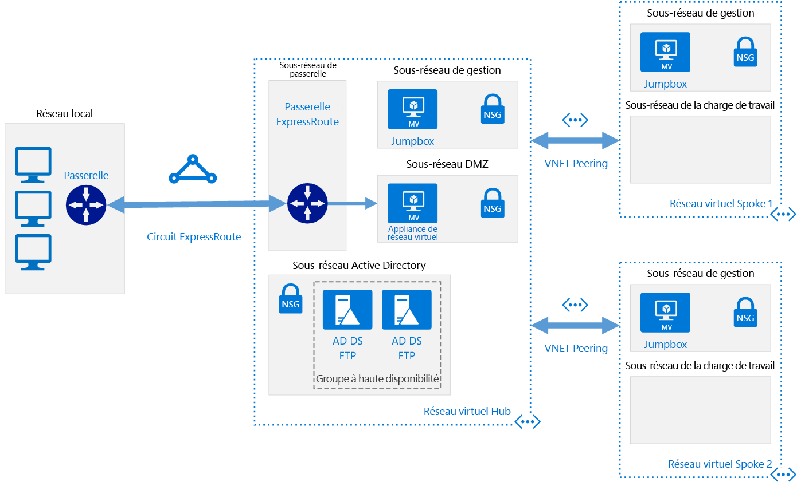

# <a name="implement-a-hub-spoke-network-topology-with-shared-services-in-azure"></a>Implémentation d’une topologie de réseau hub-and-spoke avec des services partagés dans Azure

Cette architecture de référence s’appuie sur l’architecture de référence [hub-and-spoke][guidance-hub-spoke] de manière à inclure dans le hub des services partagés qui peuvent être utilisés par tous les spokes. Les premiers services que vous devez partager, en tant que première étape de la migration d’un centre de données vers le cloud et la création d’un [centre de données virtuel], sont l’identité et la sécurité. Cette architecture de référence vous montre comment étendre vos services Active Directory à partir de votre centre de données local vers Azure, et comment ajouter une appliance virtuelle réseau qui peut jouer le rôle de pare-feu dans une topologie hub-and-spoke.  [**Déployez cette solution**](#deploy-the-solution).



*Téléchargez un [fichier Visio][visio-download] de cette architecture.*

Cette topologie présente les avantages suivants :

- **Réduction les coûts** en centralisant les services qui peuvent être partagés par plusieurs charges de travail, comme les appliances virtuelles réseau et les serveurs DNS.
- **Surmonter les limites des abonnements** en appairant les réseaux virtuels de différents abonnements avec le hub central.
- **Séparation des préoccupations** entre le service informatique central (SecOps, InfraOps) et les charges de travail (DevOps).

Utilisations courantes de cette architecture :

- Charges de travail déployées sur des environnements différents, tels que les environnements de développement, de test et de production, qui requièrent des services partagés tels que DNS, IDS, NTP ou AD DS. Les services partagés sont placés dans le réseau virtuel hub, tandis que chaque environnement est déployé sur un membre spoke pour garantir l’isolation.
- Charges de travail ne nécessitant pas de connectivité entre elles, mais nécessitant un accès aux services partagés.
- Entreprises nécessitant un contrôle centralisé des aspects de la sécurité, tel qu’un pare-feu dans le hub en tant que zone DMZ et une gestion séparée des charges de travail dans chaque membre spoke.

## <a name="architecture"></a>Architecture

L’architecture est constituée des composants suivants.

- **Réseau local**. Un réseau local privé qui s’exécute au sein d’une organisation.

- **Périphérique VPN**. Périphérique ou service qui assure la connectivité externe au réseau local. Le périphérique VPN peut être un périphérique matériel ou une solution logicielle telle que le service RRAS (Routing and Remote Access Service) dans Windows Server 2012. Pour obtenir la liste des périphériques VPN pris en charge et des informations sur la configuration de certains périphériques VPN pour la connexion à Azure, consultez [À propos des périphériques VPN pour les connexions de la passerelle VPN de site à site][vpn-appliance].

- **Passerelle de réseau virtuel VPN ou passerelle ExpressRoute**. La passerelle de réseau virtuel permet au réseau virtuel de se connecter au périphérique VPN, ou circuit ExpressRoute, utilisé pour la connectivité avec votre réseau local. Pour plus d’informations, consultez [Connecter un réseau local à Microsoft Azure Virtual Network][connect-to-an-Azure-vnet].

> [!NOTE]
> Les scripts de déploiement pour cette architecture de référence utilisent une passerelle VPN pour la connectivité et un réseau virtuel dans Azure pour simuler votre réseau local.

- **Réseau virtuel hub**. Réseau virtuel Azure utilisé comme hub dans la topologie hub-and-spoke. Le hub est le point central de la connectivité à votre réseau local et un emplacement pour héberger les services que peuvent utiliser les différentes charges de travail hébergées dans les réseaux virtuels spokes.

- **Sous-réseau de passerelle**. Les passerelles de réseau virtuel sont conservées dans le même sous-réseau.

- **Sous-réseau de services partagés**. Sous-réseau dans le réseau virtuel hub utilisé pour héberger les services que peuvent partager tous les membres spokes, tels que DNS ou AD DS.

- **Sous-réseau de DMZ**. Sous-réseau du réseau virtuel du hub utilisé pour héberger les appliances virtuelles réseau qui peuvent jouer le rôle d’appliances de sécurité, comme les pare-feu.

- **Réseaux virtuels spokes**. Un ou plusieurs réseaux virtuels Azure qui sont utilisés comme membres spokes dans la topologie hub-and-spoke. Les membres spokes peuvent servir à isoler les charges de travail dans leurs propres réseaux virtuels, qui sont alors gérées séparément des autres membres spokes. Chaque charge de travail peut inclure plusieurs niveaux, avec plusieurs sous-réseaux connectés à l’aide d’équilibreurs de charge Azure. Pour plus d’informations sur l’infrastructure d’application, consultez [Running Windows VM workloads][windows-vm-ra] (Exécution de charges de travail de machine virtuelle Windows) et [Exécution de charges de travail de machine virtuelle Linux][linux-vm-ra].

- **Appairage de réseaux virtuels**. Deux réseaux virtuels dans la même région Azure peuvent être connectés à l’aide d’une [connexion d’appairage][vnet-peering]. Les connexions d’appairage sont des connexions non transitives et à faible latence entre des réseaux virtuels. Une fois appairés, les réseaux virtuels échangent le trafic à l’aide de la dorsale principale d’Azure, sans avoir besoin d’un routeur. Dans une topologie de réseau hub-and-spoke, vous utilisez l’appairage de réseaux virtuels pour connecter le hub à chaque membre spoke.

> [!NOTE]
> Cet article couvre uniquement les déploiements [Resource Manager](/azure/azure-resource-manager/resource-group-overview), mais vous pouvez également connecter un réseau virtuel classique à un réseau virtuel Resource Manager dans un même abonnement. De cette façon, vos membres spokes peuvent héberger des déploiements classiques tout en tirant parti des services partagés dans le hub.

## <a name="recommendations"></a>Recommandations

Toutes les recommandations de l’architecture de référence [hub-and-spoke][guidance-hub-spoke] concernent également celle des services partagés.

De plus, les recommandations suivantes s’appliquent à la plupart des scénarios relatifs aux services partagés. Suivez ces recommandations, sauf si vous avez un besoin spécifique qui vous oblige à les ignorer.

### <a name="identity"></a>Identité

La plupart des organisations incluent un environnement Active Directory Directory Services (AD DS) dans leur centre de données local. Pour faciliter la gestion des ressources déplacées vers Azure à partir de votre réseau local et qui dépendent d’AD DS, il est recommandé d’héberger les contrôleurs de domaine AD DS dans Azure.

Si vous devez utiliser des objets de stratégie de groupe, que vous souhaitez contrôler séparément pour Azure et votre environnement local, utilisez un site Active Directory différent pour chaque région Azure. Placez vos contrôleurs de domaine dans un réseau virtuel central (hub) auquel les charges de travail dépendantes peuvent accéder.

### <a name="security"></a>Sécurité

Lorsque vous déplacez des charges de travail depuis votre environnement local vers Azure, certaines d’entre elles doivent être hébergées sur des machines virtuelles. Pour des raisons de conformité, vous devrez peut-être appliquer des restrictions sur le trafic qui traverse ces charges de travail.

Vous pouvez utiliser les appliances virtuelles réseau dans Azure pour héberger différents types de services de gestion de la sécurité et des performances. Si vous êtes familiarisé avec un ensemble donné d’appliances locales, il est recommandé d’utiliser les mêmes appliances virtualisées dans Azure, le cas échéant.

> [!NOTE]
> Les scripts de déploiement de cette architecture de référence utilisent une machine virtuelle Ubuntu avec transfert d’IP activé pour imiter une appliance virtuelle réseau.

## <a name="considerations"></a>Considérations

### <a name="overcoming-vnet-peering-limits"></a>Surmonter les limites d’appairage de réseaux virtuels

Veillez à prendre en compte le [nombre maximal d’appairages de réseaux virtuels par réseau virtuel][vnet-peering-limit] dans Azure. Si vous décidez que vous avez besoin d’un nombre de membres spokes supérieur à celui autorisé par la limite, envisagez de créer une topologie hub-and-spoke/hub-and-spoke, où les membres spokes du premier niveau de membres spokes font également office de hubs. Le diagramme qui suit montre cette topologie.


Déterminez également les services qui sont partagés dans le hub, afin que ce dernier puisse prendre en charge un plus grand nombre de membres spokes. Par exemple, si votre hub fournit des services de pare-feu, tenez compte des limites de bande passante de votre solution de pare-feu quand vous ajoutez plusieurs membres spokes. Vous pourriez souhaiter transférer certains de ces services partagés vers un second niveau de hubs.

## <a name="deploy-the-solution"></a>Déployer la solution

Un déploiement pour cette architecture est disponible sur [GitHub][ref-arch-repo]. Le déploiement crée les groupes de ressources suivants dans votre abonnement :

- hub-adds-rg
- hub-nva-rg
- hub-vnet-rg
- onprem-vnet-rg
- spoke1-vnet-rg
- spoke2-vent-rg

Les fichiers de paramètre modèle font référence à ces noms. Si vous les modifiez, mettez à jour les fichiers de paramètres afin qu’ils correspondent.

### <a name="prerequisites"></a>Prérequis

[!INCLUDE [ref-arch-prerequisites.md](../../../includes/ref-arch-prerequisites.md)]

### <a name="deploy-the-simulated-on-premises-datacenter-using-azbb"></a>Déployer le centre de données local simulé à l’aide d’azbb

Cette étape déploie le centre de données local simulé en tant que réseau virtuel Azure.

1. Accédez au dossier `hybrid-networking\shared-services-stack\` du dépôt GitHub.

2. Ouvrez le fichier `onprem.json` .

3. Recherchez toutes les instances de `UserName`, `adminUserName`, `Password` et `adminPassword`. Dans les paramètres, entrez des valeurs pour le nom d’utilisateur et le mot de passe, et enregistrez le fichier.

4. Exécutez la commande suivante :

   ```bash
   azbb -s <subscription_id> -g onprem-vnet-rg -l <location> -p onprem.json --deploy
   ```

5. Attendez que le déploiement se termine. Ce déploiement crée un réseau virtuel, une machine virtuelle exécutant Windows et une passerelle VPN. La création de la passerelle VPN peut prendre plus de 40 minutes.

### <a name="deploy-the-hub-vnet"></a>Déployer le réseau virtuel du hub

Cette étape déploie le réseau virtuel hub et le connecte au réseau virtuel local simulé.

1. Ouvrez le fichier `hub-vnet.json` .

2. Recherchez `adminPassword` et entrez un nom d’utilisateur et un mot de passe dans les paramètres.

3. Recherchez toutes les instances de `sharedKey` et entrez une valeur pour une clé partagée. Enregistrez le fichier .

   ```json
   "sharedKey": "abc123",
   ```

4. Exécutez la commande suivante :

   ```bash
   azbb -s <subscription_id> -g hub-vnet-rg -l <location> -p hub-vnet.json --deploy
   ```

5. Attendez que le déploiement se termine. Ce déploiement crée un réseau virtuel, une machine virtuelle, une passerelle VPN et une connexion à la passerelle créée à la section précédente. La passerelle VPN peut prendre plus de 40 minutes pour s’exécuter.

### <a name="deploy-ad-ds-in-azure"></a>Déployer AD DS dans Azure

Cette étape déploie des contrôleurs de domaine AD DS dans Azure.

1. Ouvrez le fichier `hub-adds.json` .

2. Recherchez toutes les instances de `Password` et `adminPassword`. Dans les paramètres, entrez des valeurs pour le nom d’utilisateur et le mot de passe, et enregistrez le fichier.

3. Exécutez la commande suivante :

   ```bash
   azbb -s <subscription_id> -g hub-adds-rg -l <location> -p hub-adds.json --deploy
   ```

Cette étape de déploiement peut prendre plusieurs minutes, car elle lie les deux machines virtuelles au domaine hébergé dans le centre de données local simulé et installe AD DS sur ces dernières.

### <a name="deploy-the-spoke-vnets"></a>Déployer les réseaux virtuels spokes

Cette étape déploie les réseaux virtuels spokes.

1. Ouvrez le fichier `spoke1.json` .

2. Recherchez `adminPassword` et entrez un nom d’utilisateur et un mot de passe dans les paramètres.

3. Exécutez la commande suivante :

   ```bash
   azbb -s <subscription_id> -g spoke1-vnet-rg -l <location> -p spoke1.json --deploy
   ```

4. Répétez les étapes 1 et 2 pour le fichier `spoke2.json`.

5. Exécutez la commande suivante :

   ```bash
   azbb -s <subscription_id> -g spoke2-vnet-rg -l <location> -p spoke2.json --deploy
   ```

### <a name="peer-the-hub-vnet-to-the-spoke-vnets"></a>Homologuer le réseau virtuel hub aux réseaux virtuels spokes

Pour créer une connexion d’homologation entre le réseau virtuel hub et les réseaux virtuels spokes, exécutez la commandes suivante :

```bash
azbb -s <subscription_id> -g hub-vnet-rg -l <location> -p hub-vnet-peering.json --deploy
```

### <a name="deploy-the-nva"></a>Déployer l’appliance virtuelle réseau (NVA)

Cette étape déploie une NVA dans le sous-réseau `dmz`.

1. Ouvrez le fichier `hub-nva.json` .

2. Recherchez `adminPassword` et entrez un nom d’utilisateur et un mot de passe dans les paramètres.

3. Exécutez la commande suivante :

   ```bash
   azbb -s <subscription_id> -g hub-nva-rg -l <location> -p hub-nva.json --deploy
   ```

### <a name="test-connectivity"></a>Tester la connectivité

Testez la connectivité entre l’environnement local simulé et le réseau virtuel du hub.

1. Utilisez le portail Azure pour trouver la machine virtuelle appelée `jb-vm1` dans le groupe de ressources `onprem-jb-rg`.

2. Cliquez sur `Connect` pour ouvrir une session Bureau à distance vers la machine virtuelle. Utilisez le mot de passe spécifié dans le fichier de paramètre `onprem.json`.

3. Ouvrez une console PowerShell dans la machine virtuelle et utilisez la cmdlet `Test-NetConnection` pour vérifier que vous pouvez vous connecter à la machine virtuelle du serveur de rebond dans le réseau virtuel du hub.

   ```powershell
   Test-NetConnection 10.0.0.68 -CommonTCPPort RDP
   ```

Le résultat doit être semblable à ce qui suit :

```powershell
ComputerName     : 10.0.0.68
RemoteAddress    : 10.0.0.68
RemotePort       : 3389
InterfaceAlias   : Ethernet 2
SourceAddress    : 192.168.1.000
TcpTestSucceeded : True
```

> [!NOTE]
> Par défaut, les machines virtuelles Windows Server n’autorisent pas les réponses ICMP dans Azure. Si vous souhaitez utiliser `ping` pour tester la connectivité, vous devez activer le trafic ICMP dans le pare-feu Windows avancé et ce, pour chaque machine virtuelle.

Répétez ces étapes pour tester la connectivité avec les réseaux virtuels spokes :

```powershell
Test-NetConnection 10.1.0.68 -CommonTCPPort RDP
Test-NetConnection 10.2.0.68 -CommonTCPPort RDP
```

<!-- links -->

[azure-cli-2]: /azure/install-azure-cli
[azbb]: https://github.com/mspnp/template-building-blocks/wiki/Install-Azure-Building-Blocks
[guidance-hub-spoke]: ./hub-spoke.md
[azure-vpn-gateway]: /azure/vpn-gateway/vpn-gateway-about-vpngateways
[best-practices-security]: /azure/best-practices-network-securit
[connect-to-an-Azure-vnet]: https://technet.microsoft.com/library/dn786406.aspx
[guidance-expressroute]: ./expressroute.md
[guidance-vpn]: ./vpn.md
[linux-vm-ra]: ../virtual-machines-linux/index.md
[hybrid-ha]: ./expressroute-vpn-failover.md
[naming conventions]: /azure/guidance/guidance-naming-conventions
[resource-manager-overview]: /azure/azure-resource-manager/resource-group-overview
[centre de données virtuel]: https://aka.ms/vdc
[vnet-peering]: /azure/virtual-network/virtual-network-peering-overview
[vnet-peering-limit]: /azure/azure-subscription-service-limits#networking-limits
[vpn-appliance]: /azure/vpn-gateway/vpn-gateway-about-vpn-devices
[windows-vm-ra]: ../virtual-machines-windows/index.md

[visio-download]: https://archcenter.blob.core.windows.net/cdn/hybrid-network-hub-spoke.vsdx
[ref-arch-repo]: https://github.com/mspnp/reference-architectures
