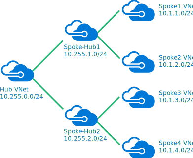

# <a name="implement-a-hub-spoke-network-topology-with-shared-services-in-azure"></a><span data-ttu-id="eeb71-103">Implémentation d’une topologie de réseau hub-and-spoke avec des services partagés dans Azure</span><span class="sxs-lookup"><span data-stu-id="eeb71-103">Implement a hub-spoke network topology with shared services in Azure</span></span>

<span data-ttu-id="eeb71-104">Cette architecture de référence s’appuie sur l’architecture de référence [hub-and-spoke][guidance-hub-spoke] de manière à inclure dans le hub des services partagés qui peuvent être utilisés par tous les spokes.</span><span class="sxs-lookup"><span data-stu-id="eeb71-104">This reference architecture builds on the [hub-spoke][guidance-hub-spoke] reference architecture to include shared services in the hub that can be consumed by all spokes.</span></span> <span data-ttu-id="eeb71-105">Les premiers services que vous devez partager, en tant que première étape de la migration d’un centre de données vers le cloud et la création d’un [centre de données virtuel], sont l’identité et la sécurité.</span><span class="sxs-lookup"><span data-stu-id="eeb71-105">As a first step toward migrating a datacenter to the cloud, and building a [virtual datacenter], the first services you need to share are identity and security.</span></span> <span data-ttu-id="eeb71-106">Cette architecture de référence vous montre comment étendre vos services Active Directory à partir de votre centre de données local vers Azure, et comment ajouter une appliance virtuelle réseau qui peut jouer le rôle de pare-feu dans une topologie hub-and-spoke.</span><span class="sxs-lookup"><span data-stu-id="eeb71-106">This reference architecture shows you how to extend your Active Directory services from your on-premises datacenter to Azure, and how to add a network virtual appliance (NVA) that can act as a firewall, in a hub-spoke topology.</span></span>  <span data-ttu-id="eeb71-107">[**Déployez cette solution**](#deploy-the-solution).</span><span class="sxs-lookup"><span data-stu-id="eeb71-107">[**Deploy this solution**](#deploy-the-solution).</span></span>


<span data-ttu-id="eeb71-109">*Téléchargez un [fichier Visio][visio-download] de cette architecture.*</span><span class="sxs-lookup"><span data-stu-id="eeb71-109">*Download a [Visio file][visio-download] of this architecture*</span></span>

<span data-ttu-id="eeb71-110">Cette topologie présente les avantages suivants :</span><span class="sxs-lookup"><span data-stu-id="eeb71-110">The benefits of this topology include:</span></span>

- <span data-ttu-id="eeb71-111">**Réduction les coûts** en centralisant les services qui peuvent être partagés par plusieurs charges de travail, comme les appliances virtuelles réseau et les serveurs DNS.</span><span class="sxs-lookup"><span data-stu-id="eeb71-111">**Cost savings** by centralizing services that can be shared by multiple workloads, such as network virtual appliances (NVAs) and DNS servers, in a single location.</span></span>
- <span data-ttu-id="eeb71-112">**Surmonter les limites des abonnements** en appairant les réseaux virtuels de différents abonnements avec le hub central.</span><span class="sxs-lookup"><span data-stu-id="eeb71-112">**Overcome subscriptions limits** by peering VNets from different subscriptions to the central hub.</span></span>
- <span data-ttu-id="eeb71-113">**Séparation des préoccupations** entre le service informatique central (SecOps, InfraOps) et les charges de travail (DevOps).</span><span class="sxs-lookup"><span data-stu-id="eeb71-113">**Separation of concerns** between central IT (SecOps, InfraOps) and workloads (DevOps).</span></span>

<span data-ttu-id="eeb71-114">Utilisations courantes de cette architecture :</span><span class="sxs-lookup"><span data-stu-id="eeb71-114">Typical uses for this architecture include:</span></span>

- <span data-ttu-id="eeb71-115">Charges de travail déployées sur des environnements différents, tels que les environnements de développement, de test et de production, qui requièrent des services partagés tels que DNS, IDS, NTP ou AD DS.</span><span class="sxs-lookup"><span data-stu-id="eeb71-115">Workloads deployed in different environments, such as development, testing, and production, that require shared services such as DNS, IDS, NTP, or AD DS.</span></span> <span data-ttu-id="eeb71-116">Les services partagés sont placés dans le réseau virtuel hub, tandis que chaque environnement est déployé sur un membre spoke pour garantir l’isolation.</span><span class="sxs-lookup"><span data-stu-id="eeb71-116">Shared services are placed in the hub VNet, while each environment is deployed to a spoke to maintain isolation.</span></span>
- <span data-ttu-id="eeb71-117">Charges de travail ne nécessitant pas de connectivité entre elles, mais nécessitant un accès aux services partagés.</span><span class="sxs-lookup"><span data-stu-id="eeb71-117">Workloads that do not require connectivity to each other, but require access to shared services.</span></span>
- <span data-ttu-id="eeb71-118">Entreprises nécessitant un contrôle centralisé des aspects de la sécurité, tel qu’un pare-feu dans le hub en tant que zone DMZ et une gestion séparée des charges de travail dans chaque membre spoke.</span><span class="sxs-lookup"><span data-stu-id="eeb71-118">Enterprises that require central control over security aspects, such as a firewall in the hub as a DMZ, and segregated management for the workloads in each spoke.</span></span>

## <a name="architecture"></a><span data-ttu-id="eeb71-119">Architecture</span><span class="sxs-lookup"><span data-stu-id="eeb71-119">Architecture</span></span>

<span data-ttu-id="eeb71-120">L’architecture est constituée des composants suivants.</span><span class="sxs-lookup"><span data-stu-id="eeb71-120">The architecture consists of the following components.</span></span>

- <span data-ttu-id="eeb71-121">**Réseau local**.</span><span class="sxs-lookup"><span data-stu-id="eeb71-121">**On-premises network**.</span></span> <span data-ttu-id="eeb71-122">Un réseau local privé qui s’exécute au sein d’une organisation.</span><span class="sxs-lookup"><span data-stu-id="eeb71-122">A private local-area network running within an organization.</span></span>

- <span data-ttu-id="eeb71-123">**Périphérique VPN**.</span><span class="sxs-lookup"><span data-stu-id="eeb71-123">**VPN device**.</span></span> <span data-ttu-id="eeb71-124">Périphérique ou service qui assure la connectivité externe au réseau local.</span><span class="sxs-lookup"><span data-stu-id="eeb71-124">A device or service that provides external connectivity to the on-premises network.</span></span> <span data-ttu-id="eeb71-125">Le périphérique VPN peut être un périphérique matériel ou une solution logicielle telle que le service RRAS (Routing and Remote Access Service) dans Windows Server 2012.</span><span class="sxs-lookup"><span data-stu-id="eeb71-125">The VPN device may be a hardware device, or a software solution such as the Routing and Remote Access Service (RRAS) in Windows Server 2012.</span></span> <span data-ttu-id="eeb71-126">Pour obtenir la liste des périphériques VPN pris en charge et des informations sur la configuration de certains périphériques VPN pour la connexion à Azure, consultez [À propos des périphériques VPN pour les connexions de la passerelle VPN de site à site][vpn-appliance].</span><span class="sxs-lookup"><span data-stu-id="eeb71-126">For a list of supported VPN appliances and information on configuring selected VPN appliances for connecting to Azure, see [About VPN devices for Site-to-Site VPN Gateway connections][vpn-appliance].</span></span>

- <span data-ttu-id="eeb71-127">**Passerelle de réseau virtuel VPN ou passerelle ExpressRoute**.</span><span class="sxs-lookup"><span data-stu-id="eeb71-127">**VPN virtual network gateway or ExpressRoute gateway**.</span></span> <span data-ttu-id="eeb71-128">La passerelle de réseau virtuel permet au réseau virtuel de se connecter au périphérique VPN, ou circuit ExpressRoute, utilisé pour la connectivité avec votre réseau local.</span><span class="sxs-lookup"><span data-stu-id="eeb71-128">The virtual network gateway enables the VNet to connect to the VPN device, or ExpressRoute circuit, used for connectivity with your on-premises network.</span></span> <span data-ttu-id="eeb71-129">Pour plus d’informations, consultez [Connecter un réseau local à Microsoft Azure Virtual Network][connect-to-an-Azure-vnet].</span><span class="sxs-lookup"><span data-stu-id="eeb71-129">For more information, see [Connect an on-premises network to a Microsoft Azure virtual network][connect-to-an-Azure-vnet].</span></span>

> [!NOTE]
> <span data-ttu-id="eeb71-130">Les scripts de déploiement pour cette architecture de référence utilisent une passerelle VPN pour la connectivité et un réseau virtuel dans Azure pour simuler votre réseau local.</span><span class="sxs-lookup"><span data-stu-id="eeb71-130">The deployment scripts for this reference architecture use a VPN gateway for connectivity, and a VNet in Azure to simulate your on-premises network.</span></span>

- <span data-ttu-id="eeb71-131">**Réseau virtuel hub**.</span><span class="sxs-lookup"><span data-stu-id="eeb71-131">**Hub VNet**.</span></span> <span data-ttu-id="eeb71-132">Réseau virtuel Azure utilisé comme hub dans la topologie hub-and-spoke.</span><span class="sxs-lookup"><span data-stu-id="eeb71-132">Azure VNet used as the hub in the hub-spoke topology.</span></span> <span data-ttu-id="eeb71-133">Le hub est le point central de la connectivité à votre réseau local et un emplacement pour héberger les services que peuvent utiliser les différentes charges de travail hébergées dans les réseaux virtuels spokes.</span><span class="sxs-lookup"><span data-stu-id="eeb71-133">The hub is the central point of connectivity to your on-premises network, and a place to host services that can be consumed by the different workloads hosted in the spoke VNets.</span></span>

- <span data-ttu-id="eeb71-134">**Sous-réseau de passerelle**.</span><span class="sxs-lookup"><span data-stu-id="eeb71-134">**Gateway subnet**.</span></span> <span data-ttu-id="eeb71-135">Les passerelles de réseau virtuel sont conservées dans le même sous-réseau.</span><span class="sxs-lookup"><span data-stu-id="eeb71-135">The virtual network gateways are held in the same subnet.</span></span>

- <span data-ttu-id="eeb71-136">**Sous-réseau de services partagés**.</span><span class="sxs-lookup"><span data-stu-id="eeb71-136">**Shared services subnet**.</span></span> <span data-ttu-id="eeb71-137">Sous-réseau dans le réseau virtuel hub utilisé pour héberger les services que peuvent partager tous les membres spokes, tels que DNS ou AD DS.</span><span class="sxs-lookup"><span data-stu-id="eeb71-137">A subnet in the hub VNet used to host services that can be shared among all spokes, such as DNS or AD DS.</span></span>

- <span data-ttu-id="eeb71-138">**Sous-réseau de DMZ**.</span><span class="sxs-lookup"><span data-stu-id="eeb71-138">**DMZ subnet**.</span></span> <span data-ttu-id="eeb71-139">Sous-réseau du réseau virtuel du hub utilisé pour héberger les appliances virtuelles réseau qui peuvent jouer le rôle d’appliances de sécurité, comme les pare-feu.</span><span class="sxs-lookup"><span data-stu-id="eeb71-139">A subnet in the hub VNet used to host NVAs that can act as security appliances, such as firewalls.</span></span>

- <span data-ttu-id="eeb71-140">**Réseaux virtuels spokes**.</span><span class="sxs-lookup"><span data-stu-id="eeb71-140">**Spoke VNets**.</span></span> <span data-ttu-id="eeb71-141">Un ou plusieurs réseaux virtuels Azure qui sont utilisés comme membres spokes dans la topologie hub-and-spoke.</span><span class="sxs-lookup"><span data-stu-id="eeb71-141">One or more Azure VNets that are used as spokes in the hub-spoke topology.</span></span> <span data-ttu-id="eeb71-142">Les membres spokes peuvent servir à isoler les charges de travail dans leurs propres réseaux virtuels, qui sont alors gérées séparément des autres membres spokes.</span><span class="sxs-lookup"><span data-stu-id="eeb71-142">Spokes can be used to isolate workloads in their own VNets, managed separately from other spokes.</span></span> <span data-ttu-id="eeb71-143">Chaque charge de travail peut inclure plusieurs niveaux, avec plusieurs sous-réseaux connectés à l’aide d’équilibreurs de charge Azure.</span><span class="sxs-lookup"><span data-stu-id="eeb71-143">Each workload might include multiple tiers, with multiple subnets connected through Azure load balancers.</span></span> <span data-ttu-id="eeb71-144">Pour plus d’informations sur l’infrastructure d’application, consultez [Running Windows VM workloads][windows-vm-ra] (Exécution de charges de travail de machine virtuelle Windows) et [Exécution de charges de travail de machine virtuelle Linux][linux-vm-ra].</span><span class="sxs-lookup"><span data-stu-id="eeb71-144">For more information about the application infrastructure, see [Running Windows VM workloads][windows-vm-ra] and [Running Linux VM workloads][linux-vm-ra].</span></span>

- <span data-ttu-id="eeb71-145">**Appairage de réseaux virtuels**.</span><span class="sxs-lookup"><span data-stu-id="eeb71-145">**VNet peering**.</span></span> <span data-ttu-id="eeb71-146">Deux réseaux virtuels dans la même région Azure peuvent être connectés à l’aide d’une [connexion d’appairage][vnet-peering].</span><span class="sxs-lookup"><span data-stu-id="eeb71-146">Two VNets in the same Azure region can be connected using a [peering connection][vnet-peering].</span></span> <span data-ttu-id="eeb71-147">Les connexions d’appairage sont des connexions non transitives et à faible latence entre des réseaux virtuels.</span><span class="sxs-lookup"><span data-stu-id="eeb71-147">Peering connections are non-transitive, low latency connections between VNets.</span></span> <span data-ttu-id="eeb71-148">Une fois appairés, les réseaux virtuels échangent le trafic à l’aide de la dorsale principale d’Azure, sans avoir besoin d’un routeur.</span><span class="sxs-lookup"><span data-stu-id="eeb71-148">Once peered, the VNets exchange traffic by using the Azure backbone, without the need for a router.</span></span> <span data-ttu-id="eeb71-149">Dans une topologie de réseau hub-and-spoke, vous utilisez l’appairage de réseaux virtuels pour connecter le hub à chaque membre spoke.</span><span class="sxs-lookup"><span data-stu-id="eeb71-149">In a hub-spoke network topology, you use VNet peering to connect the hub to each spoke.</span></span>

> [!NOTE]
> <span data-ttu-id="eeb71-150">Cet article couvre uniquement les déploiements [Resource Manager](/azure/azure-resource-manager/resource-group-overview), mais vous pouvez également connecter un réseau virtuel classique à un réseau virtuel Resource Manager dans un même abonnement.</span><span class="sxs-lookup"><span data-stu-id="eeb71-150">This article only covers [Resource Manager](/azure/azure-resource-manager/resource-group-overview) deployments, but you can also connect a classic VNet to a Resource Manager VNet in the same subscription.</span></span> <span data-ttu-id="eeb71-151">De cette façon, vos membres spokes peuvent héberger des déploiements classiques tout en tirant parti des services partagés dans le hub.</span><span class="sxs-lookup"><span data-stu-id="eeb71-151">That way, your spokes can host classic deployments and still benefit from services shared in the hub.</span></span>

## <a name="recommendations"></a><span data-ttu-id="eeb71-152">Recommandations</span><span class="sxs-lookup"><span data-stu-id="eeb71-152">Recommendations</span></span>

<span data-ttu-id="eeb71-153">Toutes les recommandations de l’architecture de référence [hub-and-spoke][guidance-hub-spoke] concernent également celle des services partagés.</span><span class="sxs-lookup"><span data-stu-id="eeb71-153">All the recommendations for the [hub-spoke][guidance-hub-spoke] reference architecture also apply to the shared services reference architecture.</span></span>

<span data-ttu-id="eeb71-154">De plus, les recommandations suivantes s’appliquent à la plupart des scénarios relatifs aux services partagés.</span><span class="sxs-lookup"><span data-stu-id="eeb71-154">Also, the following recommendations apply for most scenarios under shared services.</span></span> <span data-ttu-id="eeb71-155">Suivez ces recommandations, sauf si vous avez un besoin spécifique qui vous oblige à les ignorer.</span><span class="sxs-lookup"><span data-stu-id="eeb71-155">Follow these recommendations unless you have a specific requirement that overrides them.</span></span>

### <a name="identity"></a><span data-ttu-id="eeb71-156">Identité</span><span class="sxs-lookup"><span data-stu-id="eeb71-156">Identity</span></span>

<span data-ttu-id="eeb71-157">La plupart des organisations incluent un environnement Active Directory Directory Services (AD DS) dans leur centre de données local.</span><span class="sxs-lookup"><span data-stu-id="eeb71-157">Most enterprise organizations have an Active Directory Directory Services (ADDS) environment in their on-premises datacenter.</span></span> <span data-ttu-id="eeb71-158">Pour faciliter la gestion des ressources déplacées vers Azure à partir de votre réseau local et qui dépendent d’AD DS, il est recommandé d’héberger les contrôleurs de domaine AD DS dans Azure.</span><span class="sxs-lookup"><span data-stu-id="eeb71-158">To facilitate management of assets moved to Azure from your on-premises network that depend on ADDS, it is recommended to host ADDS domain controllers in Azure.</span></span>

<span data-ttu-id="eeb71-159">Si vous devez utiliser des objets de stratégie de groupe, que vous souhaitez contrôler séparément pour Azure et votre environnement local, utilisez un site Active Directory différent pour chaque région Azure.</span><span class="sxs-lookup"><span data-stu-id="eeb71-159">If you make use of Group Policy Objects, that you want to control separately for Azure and your on-premises environment, use a different AD site for each Azure region.</span></span> <span data-ttu-id="eeb71-160">Placez vos contrôleurs de domaine dans un réseau virtuel central (hub) auquel les charges de travail dépendantes peuvent accéder.</span><span class="sxs-lookup"><span data-stu-id="eeb71-160">Place your domain controllers in a central VNet (hub) that dependent workloads can access.</span></span>

### <a name="security"></a><span data-ttu-id="eeb71-161">Sécurité</span><span class="sxs-lookup"><span data-stu-id="eeb71-161">Security</span></span>

<span data-ttu-id="eeb71-162">Lorsque vous déplacez des charges de travail depuis votre environnement local vers Azure, certaines d’entre elles doivent être hébergées sur des machines virtuelles.</span><span class="sxs-lookup"><span data-stu-id="eeb71-162">As you move workloads from your on-premises environment to Azure, some of these workloads will require to be hosted in VMs.</span></span> <span data-ttu-id="eeb71-163">Pour des raisons de conformité, vous devrez peut-être appliquer des restrictions sur le trafic qui traverse ces charges de travail.</span><span class="sxs-lookup"><span data-stu-id="eeb71-163">For compliance reasons, you may need to enforce restrictions on traffic traversing those workloads.</span></span>

<span data-ttu-id="eeb71-164">Vous pouvez utiliser les appliances virtuelles réseau dans Azure pour héberger différents types de services de gestion de la sécurité et des performances.</span><span class="sxs-lookup"><span data-stu-id="eeb71-164">You can use network virtual appliances (NVAs) in Azure to host different types of security and performance services.</span></span> <span data-ttu-id="eeb71-165">Si vous êtes familiarisé avec un ensemble donné d’appliances locales, il est recommandé d’utiliser les mêmes appliances virtualisées dans Azure, le cas échéant.</span><span class="sxs-lookup"><span data-stu-id="eeb71-165">If you are familiar with a given set of appliances on-premises today, it is recommended to use the same virtualized appliances in Azure, where applicable.</span></span>

> [!NOTE]
> <span data-ttu-id="eeb71-166">Les scripts de déploiement de cette architecture de référence utilisent une machine virtuelle Ubuntu avec transfert d’IP activé pour imiter une appliance virtuelle réseau.</span><span class="sxs-lookup"><span data-stu-id="eeb71-166">The deployment scripts for this reference architecture use an Ubuntu VM with IP forwarding enabled to mimic a network virtual appliance.</span></span>

## <a name="considerations"></a><span data-ttu-id="eeb71-167">Considérations</span><span class="sxs-lookup"><span data-stu-id="eeb71-167">Considerations</span></span>

### <a name="overcoming-vnet-peering-limits"></a><span data-ttu-id="eeb71-168">Surmonter les limites d’appairage de réseaux virtuels</span><span class="sxs-lookup"><span data-stu-id="eeb71-168">Overcoming VNet peering limits</span></span>

<span data-ttu-id="eeb71-169">Veillez à prendre en compte le [nombre maximal d’appairages de réseaux virtuels par réseau virtuel][vnet-peering-limit] dans Azure.</span><span class="sxs-lookup"><span data-stu-id="eeb71-169">Make sure you consider the [limitation on number of VNets peerings per VNet][vnet-peering-limit] in Azure.</span></span> <span data-ttu-id="eeb71-170">Si vous décidez que vous avez besoin d’un nombre de membres spokes supérieur à celui autorisé par la limite, envisagez de créer une topologie hub-and-spoke/hub-and-spoke, où les membres spokes du premier niveau de membres spokes font également office de hubs.</span><span class="sxs-lookup"><span data-stu-id="eeb71-170">If you decide you need more spokes than the limit will allow, consider creating a hub-spoke-hub-spoke topology, where the first level of spokes also act as hubs.</span></span> <span data-ttu-id="eeb71-171">Le diagramme qui suit montre cette topologie.</span><span class="sxs-lookup"><span data-stu-id="eeb71-171">The following diagram shows this approach.</span></span>



<span data-ttu-id="eeb71-173">Déterminez également les services qui sont partagés dans le hub, afin que ce dernier puisse prendre en charge un plus grand nombre de membres spokes.</span><span class="sxs-lookup"><span data-stu-id="eeb71-173">Also consider what services are shared in the hub, to ensure the hub scales for a larger number of spokes.</span></span> <span data-ttu-id="eeb71-174">Par exemple, si votre hub fournit des services de pare-feu, tenez compte des limites de bande passante de votre solution de pare-feu quand vous ajoutez plusieurs membres spokes.</span><span class="sxs-lookup"><span data-stu-id="eeb71-174">For instance, if your hub provides firewall services, consider the bandwidth limits of your firewall solution when adding multiple spokes.</span></span> <span data-ttu-id="eeb71-175">Vous pourriez souhaiter transférer certains de ces services partagés vers un second niveau de hubs.</span><span class="sxs-lookup"><span data-stu-id="eeb71-175">You might want to move some of these shared services to a second level of hubs.</span></span>

## <a name="deploy-the-solution"></a><span data-ttu-id="eeb71-176">Déployer la solution</span><span class="sxs-lookup"><span data-stu-id="eeb71-176">Deploy the solution</span></span>

<span data-ttu-id="eeb71-177">Un déploiement pour cette architecture est disponible sur [GitHub][ref-arch-repo].</span><span class="sxs-lookup"><span data-stu-id="eeb71-177">A deployment for this architecture is available on [GitHub][ref-arch-repo].</span></span> <span data-ttu-id="eeb71-178">Le déploiement crée les groupes de ressources suivants dans votre abonnement :</span><span class="sxs-lookup"><span data-stu-id="eeb71-178">The deployment creates the following resource groups in your subscription:</span></span>

- <span data-ttu-id="eeb71-179">hub-adds-rg</span><span class="sxs-lookup"><span data-stu-id="eeb71-179">hub-adds-rg</span></span>
- <span data-ttu-id="eeb71-180">hub-nva-rg</span><span class="sxs-lookup"><span data-stu-id="eeb71-180">hub-nva-rg</span></span>
- <span data-ttu-id="eeb71-181">hub-vnet-rg</span><span class="sxs-lookup"><span data-stu-id="eeb71-181">hub-vnet-rg</span></span>
- <span data-ttu-id="eeb71-182">onprem-vnet-rg</span><span class="sxs-lookup"><span data-stu-id="eeb71-182">onprem-vnet-rg</span></span>
- <span data-ttu-id="eeb71-183">spoke1-vnet-rg</span><span class="sxs-lookup"><span data-stu-id="eeb71-183">spoke1-vnet-rg</span></span>
- <span data-ttu-id="eeb71-184">spoke2-vent-rg</span><span class="sxs-lookup"><span data-stu-id="eeb71-184">spoke2-vent-rg</span></span>

<span data-ttu-id="eeb71-185">Les fichiers de paramètre modèle font référence à ces noms. Si vous les modifiez, mettez à jour les fichiers de paramètres afin qu’ils correspondent.</span><span class="sxs-lookup"><span data-stu-id="eeb71-185">The template parameter files refer to these names, so if you change them, update the parameter files to match.</span></span>

### <a name="prerequisites"></a><span data-ttu-id="eeb71-186">Prérequis</span><span class="sxs-lookup"><span data-stu-id="eeb71-186">Prerequisites</span></span>

[!INCLUDE [ref-arch-prerequisites.md](../../../includes/ref-arch-prerequisites.md)]

### <a name="deploy-the-simulated-on-premises-datacenter-using-azbb"></a><span data-ttu-id="eeb71-187">Déployer le centre de données local simulé à l’aide d’azbb</span><span class="sxs-lookup"><span data-stu-id="eeb71-187">Deploy the simulated on-premises datacenter using azbb</span></span>

<span data-ttu-id="eeb71-188">Cette étape déploie le centre de données local simulé en tant que réseau virtuel Azure.</span><span class="sxs-lookup"><span data-stu-id="eeb71-188">This step deploys the simulated on-premises datacenter as an Azure VNet.</span></span>

1. <span data-ttu-id="eeb71-189">Accédez au dossier `hybrid-networking\shared-services-stack\` du dépôt GitHub.</span><span class="sxs-lookup"><span data-stu-id="eeb71-189">Navigate to the `hybrid-networking\shared-services-stack\` folder of the GitHub repository.</span></span>

2. <span data-ttu-id="eeb71-190">Ouvrez le fichier `onprem.json` .</span><span class="sxs-lookup"><span data-stu-id="eeb71-190">Open the `onprem.json` file.</span></span>

3. <span data-ttu-id="eeb71-191">Recherchez toutes les instances de `UserName`, `adminUserName`, `Password` et `adminPassword`.</span><span class="sxs-lookup"><span data-stu-id="eeb71-191">Search for all instances of `UserName`, `adminUserName`,`Password`, and `adminPassword`.</span></span> <span data-ttu-id="eeb71-192">Dans les paramètres, entrez des valeurs pour le nom d’utilisateur et le mot de passe, et enregistrez le fichier.</span><span class="sxs-lookup"><span data-stu-id="eeb71-192">Enter values for the user name and password in the parameters and save the file.</span></span>

4. <span data-ttu-id="eeb71-193">Exécutez la commande suivante :</span><span class="sxs-lookup"><span data-stu-id="eeb71-193">Run the following command:</span></span>

   ```bash
   azbb -s <subscription_id> -g onprem-vnet-rg -l <location> -p onprem.json --deploy
   ```

5. <span data-ttu-id="eeb71-194">Attendez que le déploiement se termine.</span><span class="sxs-lookup"><span data-stu-id="eeb71-194">Wait for the deployment to finish.</span></span> <span data-ttu-id="eeb71-195">Ce déploiement crée un réseau virtuel, une machine virtuelle exécutant Windows et une passerelle VPN.</span><span class="sxs-lookup"><span data-stu-id="eeb71-195">This deployment creates a virtual network, a virtual machine running Windows, and a VPN gateway.</span></span> <span data-ttu-id="eeb71-196">La création de la passerelle VPN peut prendre plus de 40 minutes.</span><span class="sxs-lookup"><span data-stu-id="eeb71-196">The VPN gateway creation can take more than 40 minutes to complete.</span></span>

### <a name="deploy-the-hub-vnet"></a><span data-ttu-id="eeb71-197">Déployer le réseau virtuel du hub</span><span class="sxs-lookup"><span data-stu-id="eeb71-197">Deploy the hub VNet</span></span>

<span data-ttu-id="eeb71-198">Cette étape déploie le réseau virtuel hub et le connecte au réseau virtuel local simulé.</span><span class="sxs-lookup"><span data-stu-id="eeb71-198">This step deploys the hub VNet and connects it to the simulated on-premises VNet.</span></span>

1. <span data-ttu-id="eeb71-199">Ouvrez le fichier `hub-vnet.json` .</span><span class="sxs-lookup"><span data-stu-id="eeb71-199">Open the `hub-vnet.json` file.</span></span>

2. <span data-ttu-id="eeb71-200">Recherchez `adminPassword` et entrez un nom d’utilisateur et un mot de passe dans les paramètres.</span><span class="sxs-lookup"><span data-stu-id="eeb71-200">Search for `adminPassword` and enter a user name and password in the parameters.</span></span>

3. <span data-ttu-id="eeb71-201">Recherchez toutes les instances de `sharedKey` et entrez une valeur pour une clé partagée.</span><span class="sxs-lookup"><span data-stu-id="eeb71-201">Search for all instances of `sharedKey` and enter a value for a shared key.</span></span> <span data-ttu-id="eeb71-202">Enregistrez le fichier .</span><span class="sxs-lookup"><span data-stu-id="eeb71-202">Save the file.</span></span>

   ```json
   "sharedKey": "abc123",
   ```

4. <span data-ttu-id="eeb71-203">Exécutez la commande suivante :</span><span class="sxs-lookup"><span data-stu-id="eeb71-203">Run the following command:</span></span>

   ```bash
   azbb -s <subscription_id> -g hub-vnet-rg -l <location> -p hub-vnet.json --deploy
   ```

5. <span data-ttu-id="eeb71-204">Attendez que le déploiement se termine.</span><span class="sxs-lookup"><span data-stu-id="eeb71-204">Wait for the deployment to finish.</span></span> <span data-ttu-id="eeb71-205">Ce déploiement crée un réseau virtuel, une machine virtuelle, une passerelle VPN et une connexion à la passerelle créée à la section précédente.</span><span class="sxs-lookup"><span data-stu-id="eeb71-205">This deployment creates a virtual network, a virtual machine, a VPN gateway, and a connection to the gateway created in the previous section.</span></span> <span data-ttu-id="eeb71-206">La passerelle VPN peut prendre plus de 40 minutes pour s’exécuter.</span><span class="sxs-lookup"><span data-stu-id="eeb71-206">The VPN gateway can take more than 40 minutes to complete.</span></span>

### <a name="deploy-ad-ds-in-azure"></a><span data-ttu-id="eeb71-207">Déployer AD DS dans Azure</span><span class="sxs-lookup"><span data-stu-id="eeb71-207">Deploy AD DS in Azure</span></span>

<span data-ttu-id="eeb71-208">Cette étape déploie des contrôleurs de domaine AD DS dans Azure.</span><span class="sxs-lookup"><span data-stu-id="eeb71-208">This step deploys AD DS domain controllers in Azure.</span></span>

1. <span data-ttu-id="eeb71-209">Ouvrez le fichier `hub-adds.json` .</span><span class="sxs-lookup"><span data-stu-id="eeb71-209">Open the `hub-adds.json` file.</span></span>

2. <span data-ttu-id="eeb71-210">Recherchez toutes les instances de `Password` et `adminPassword`.</span><span class="sxs-lookup"><span data-stu-id="eeb71-210">Search for all instances of `Password` and `adminPassword`.</span></span> <span data-ttu-id="eeb71-211">Dans les paramètres, entrez des valeurs pour le nom d’utilisateur et le mot de passe, et enregistrez le fichier.</span><span class="sxs-lookup"><span data-stu-id="eeb71-211">Enter values for the user name and password in the parameters and save the file.</span></span>

3. <span data-ttu-id="eeb71-212">Exécutez la commande suivante :</span><span class="sxs-lookup"><span data-stu-id="eeb71-212">Run the following command:</span></span>

   ```bash
   azbb -s <subscription_id> -g hub-adds-rg -l <location> -p hub-adds.json --deploy
   ```

<span data-ttu-id="eeb71-213">Cette étape de déploiement peut prendre plusieurs minutes, car elle lie les deux machines virtuelles au domaine hébergé dans le centre de données local simulé et installe AD DS sur ces dernières.</span><span class="sxs-lookup"><span data-stu-id="eeb71-213">This deployment step may take several minutes, because it joins the two VMs to the domain hosted in the simulated on-premises datacenter, and installs AD DS on them.</span></span>

### <a name="deploy-the-spoke-vnets"></a><span data-ttu-id="eeb71-214">Déployer les réseaux virtuels spokes</span><span class="sxs-lookup"><span data-stu-id="eeb71-214">Deploy the spoke VNets</span></span>

<span data-ttu-id="eeb71-215">Cette étape déploie les réseaux virtuels spokes.</span><span class="sxs-lookup"><span data-stu-id="eeb71-215">This step deploys the spoke VNets.</span></span>

1. <span data-ttu-id="eeb71-216">Ouvrez le fichier `spoke1.json` .</span><span class="sxs-lookup"><span data-stu-id="eeb71-216">Open the `spoke1.json` file.</span></span>

2. <span data-ttu-id="eeb71-217">Recherchez `adminPassword` et entrez un nom d’utilisateur et un mot de passe dans les paramètres.</span><span class="sxs-lookup"><span data-stu-id="eeb71-217">Search for `adminPassword` and enter a user name and password in the parameters.</span></span>

3. <span data-ttu-id="eeb71-218">Exécutez la commande suivante :</span><span class="sxs-lookup"><span data-stu-id="eeb71-218">Run the following command:</span></span>

   ```bash
   azbb -s <subscription_id> -g spoke1-vnet-rg -l <location> -p spoke1.json --deploy
   ```

4. <span data-ttu-id="eeb71-219">Répétez les étapes 1 et 2 pour le fichier `spoke2.json`.</span><span class="sxs-lookup"><span data-stu-id="eeb71-219">Repeat steps 1 and 2 for the file `spoke2.json`.</span></span>

5. <span data-ttu-id="eeb71-220">Exécutez la commande suivante :</span><span class="sxs-lookup"><span data-stu-id="eeb71-220">Run the following command:</span></span>

   ```bash
   azbb -s <subscription_id> -g spoke2-vnet-rg -l <location> -p spoke2.json --deploy
   ```

### <a name="peer-the-hub-vnet-to-the-spoke-vnets"></a><span data-ttu-id="eeb71-221">Homologuer le réseau virtuel hub aux réseaux virtuels spokes</span><span class="sxs-lookup"><span data-stu-id="eeb71-221">Peer the hub VNet to the spoke VNets</span></span>

<span data-ttu-id="eeb71-222">Pour créer une connexion d’homologation entre le réseau virtuel hub et les réseaux virtuels spokes, exécutez la commandes suivante :</span><span class="sxs-lookup"><span data-stu-id="eeb71-222">To create a peering connection from the hub VNet to the spoke VNets, run the following command:</span></span>

```bash
azbb -s <subscription_id> -g hub-vnet-rg -l <location> -p hub-vnet-peering.json --deploy
```

### <a name="deploy-the-nva"></a><span data-ttu-id="eeb71-223">Déployer l’appliance virtuelle réseau (NVA)</span><span class="sxs-lookup"><span data-stu-id="eeb71-223">Deploy the NVA</span></span>

<span data-ttu-id="eeb71-224">Cette étape déploie une NVA dans le sous-réseau `dmz`.</span><span class="sxs-lookup"><span data-stu-id="eeb71-224">This step deploys an NVA in the `dmz` subnet.</span></span>

1. <span data-ttu-id="eeb71-225">Ouvrez le fichier `hub-nva.json` .</span><span class="sxs-lookup"><span data-stu-id="eeb71-225">Open the `hub-nva.json` file.</span></span>

2. <span data-ttu-id="eeb71-226">Recherchez `adminPassword` et entrez un nom d’utilisateur et un mot de passe dans les paramètres.</span><span class="sxs-lookup"><span data-stu-id="eeb71-226">Search for `adminPassword` and enter a user name and password in the parameters.</span></span>

3. <span data-ttu-id="eeb71-227">Exécutez la commande suivante :</span><span class="sxs-lookup"><span data-stu-id="eeb71-227">Run the following command:</span></span>

   ```bash
   azbb -s <subscription_id> -g hub-nva-rg -l <location> -p hub-nva.json --deploy
   ```

### <a name="test-connectivity"></a><span data-ttu-id="eeb71-228">Tester la connectivité</span><span class="sxs-lookup"><span data-stu-id="eeb71-228">Test connectivity</span></span>

<span data-ttu-id="eeb71-229">Testez la connectivité entre l’environnement local simulé et le réseau virtuel du hub.</span><span class="sxs-lookup"><span data-stu-id="eeb71-229">Test conectivity from the simulated on-premises environment to the hub VNet.</span></span>

1. <span data-ttu-id="eeb71-230">Utilisez le portail Azure pour trouver la machine virtuelle appelée `jb-vm1` dans le groupe de ressources `onprem-jb-rg`.</span><span class="sxs-lookup"><span data-stu-id="eeb71-230">Use the Azure portal to find the VM named `jb-vm1` in the `onprem-jb-rg` resource group.</span></span>

2. <span data-ttu-id="eeb71-231">Cliquez sur `Connect` pour ouvrir une session Bureau à distance vers la machine virtuelle.</span><span class="sxs-lookup"><span data-stu-id="eeb71-231">Click `Connect` to open a remote desktop session to the VM.</span></span> <span data-ttu-id="eeb71-232">Utilisez le mot de passe spécifié dans le fichier de paramètre `onprem.json`.</span><span class="sxs-lookup"><span data-stu-id="eeb71-232">Use the password that you specified in the `onprem.json` parameter file.</span></span>

3. <span data-ttu-id="eeb71-233">Ouvrez une console PowerShell dans la machine virtuelle et utilisez la cmdlet `Test-NetConnection` pour vérifier que vous pouvez vous connecter à la machine virtuelle du serveur de rebond dans le réseau virtuel du hub.</span><span class="sxs-lookup"><span data-stu-id="eeb71-233">Open a PowerShell console in the VM, and use the `Test-NetConnection` cmdlet to verify that you can connect to the jumpbox VM in the hub VNet.</span></span>

   ```powershell
   Test-NetConnection 10.0.0.68 -CommonTCPPort RDP
   ```

<span data-ttu-id="eeb71-234">Le résultat doit être semblable à ce qui suit :</span><span class="sxs-lookup"><span data-stu-id="eeb71-234">The output should look similar to the following:</span></span>

```powershell
ComputerName     : 10.0.0.68
RemoteAddress    : 10.0.0.68
RemotePort       : 3389
InterfaceAlias   : Ethernet 2
SourceAddress    : 192.168.1.000
TcpTestSucceeded : True
```

> [!NOTE]
> <span data-ttu-id="eeb71-235">Par défaut, les machines virtuelles Windows Server n’autorisent pas les réponses ICMP dans Azure.</span><span class="sxs-lookup"><span data-stu-id="eeb71-235">By default, Windows Server VMs do not allow ICMP responses in Azure.</span></span> <span data-ttu-id="eeb71-236">Si vous souhaitez utiliser `ping` pour tester la connectivité, vous devez activer le trafic ICMP dans le pare-feu Windows avancé et ce, pour chaque machine virtuelle.</span><span class="sxs-lookup"><span data-stu-id="eeb71-236">If you want to use `ping` to test connectivity, you need to enable ICMP traffic in the Windows Advanced Firewall for each VM.</span></span>

<span data-ttu-id="eeb71-237">Répétez ces étapes pour tester la connectivité avec les réseaux virtuels spokes :</span><span class="sxs-lookup"><span data-stu-id="eeb71-237">Repeat the sames steps to test connectivity to the spoke VNets:</span></span>

```powershell
Test-NetConnection 10.1.0.68 -CommonTCPPort RDP
Test-NetConnection 10.2.0.68 -CommonTCPPort RDP
```

<!-- links -->

[azure-cli-2]: /azure/install-azure-cli
[azbb]: https://github.com/mspnp/template-building-blocks/wiki/Install-Azure-Building-Blocks
[guidance-hub-spoke]: ./hub-spoke.md
[azure-vpn-gateway]: /azure/vpn-gateway/vpn-gateway-about-vpngateways
[best-practices-security]: /azure/best-practices-network-securit
[connect-to-an-Azure-vnet]: https://technet.microsoft.com/library/dn786406.aspx
[guidance-expressroute]: ./expressroute.md
[guidance-vpn]: ./vpn.md
[linux-vm-ra]: ../virtual-machines-linux/index.md
[hybrid-ha]: ./expressroute-vpn-failover.md
[naming conventions]: /azure/guidance/guidance-naming-conventions
[resource-manager-overview]: /azure/azure-resource-manager/resource-group-overview
[centre de données virtuel]: https://aka.ms/vdc
[virtual datacenter]: https://aka.ms/vdc
[vnet-peering]: /azure/virtual-network/virtual-network-peering-overview
[vnet-peering-limit]: /azure/azure-subscription-service-limits#networking-limits
[vpn-appliance]: /azure/vpn-gateway/vpn-gateway-about-vpn-devices
[windows-vm-ra]: ../virtual-machines-windows/index.md

[visio-download]: https://archcenter.blob.core.windows.net/cdn/hybrid-network-hub-spoke.vsdx
[ref-arch-repo]: https://github.com/mspnp/reference-architectures
