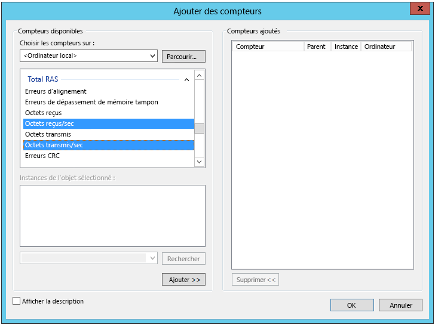

# <a name="troubleshoot-a-hybrid-vpn-connection"></a>Résoudre les problèmes d’une connexion VPN hybride

Cet article donne des conseils pour résoudre les problèmes d’une connexion de passerelle VPN entre un réseau local et Azure. Pour obtenir des informations générales sur la résolution des problèmes courants liés au VPN, voir la page correspondante ([Troubleshooting common VPN related errors][troubleshooting-vpn-errors]).

## <a name="verify-the-vpn-appliance-is-functioning-correctly"></a>Vérifier que l’appliance VPN fonctionne correctement

Les recommandations suivantes sont utiles pour déterminer si votre appliance VPN locale fonctionne correctement.

**Vérifiez les fichiers journaux générés par l’appliance VPN pour les erreurs ou les échecs.** Cela vous aidera à déterminer si l’appliance VPN fonctionne correctement. L’emplacement de ces informations varie en fonction de votre application. Par exemple, avec RRAS sur Windows Server 2012, vous pouvez utiliser la commande PowerShell suivante pour afficher des informations sur les événements d’erreur du service RRAS :

```PowerShell
Get-EventLog -LogName System -EntryType Error -Source RemoteAccess | Format-List -Property *
```

La propriété *Message* de chaque entrée fournit une description de l’erreur. Voici quelques exemples courants :

- Connexion impossible, probablement en raison d’une adresse IP incorrecte spécifiée pour la passerelle VPN Azure dans la configuration de l’interface réseau VPN RRAS

  ```console
  EventID            : 20111
  MachineName        : on-prem-vm
  Data               : {41, 3, 0, 0}
  Index              : 14231
  Category           : (0)
  CategoryNumber     : 0
  EntryType          : Error
  Message            : RoutingDomainID- {00000000-0000-0000-0000-000000000000}: A demand dial connection to the remote
                          interface AzureGateway on port VPN2-4 was successfully initiated but failed to complete
                          successfully because of the  following error: The network connection between your computer and
                          the VPN server could not be established because the remote server is not responding. This could
                          be because one of the network devices (for example, firewalls, NAT, routers, and so on) between your computer
                          and the remote server is not configured to allow VPN connections. Please contact your
                          Administrator or your service provider to determine which device may be causing the problem.
  Source             : RemoteAccess
  ReplacementStrings : {{00000000-0000-0000-0000-000000000000}, AzureGateway, VPN2-4, The network connection between
                          your computer and the VPN server could not be established because the remote server is not
                          responding. This could be because one of the network devices (for example, firewalls, NAT, routers, and so on)
                          between your computer and the remote server is not configured to allow VPN connections. Please
                          contact your Administrator or your service provider to determine which device may be causing the
                          problem.}
  InstanceId         : 20111
  TimeGenerated      : 3/18/2016 1:26:02 PM
  TimeWritten        : 3/18/2016 1:26:02 PM
  UserName           :
  Site               :
  Container          :
  ```

- Spécification d’une clé partagée incorrecte dans la configuration de l’interface réseau VPN RRAS

  ```console
  EventID            : 20111
  MachineName        : on-prem-vm
  Data               : {233, 53, 0, 0}
  Index              : 14245
  Category           : (0)
  CategoryNumber     : 0
  EntryType          : Error
  Message            : RoutingDomainID- {00000000-0000-0000-0000-000000000000}: A demand dial connection to the remote
                          interface AzureGateway on port VPN2-4 was successfully initiated but failed to complete
                          successfully because of the  following error: Internet key exchange (IKE) authentication credentials are unacceptable.

  Source             : RemoteAccess
  ReplacementStrings : {{00000000-0000-0000-0000-000000000000}, AzureGateway, VPN2-4, IKE authentication credentials are
                          unacceptable.
                          }
  InstanceId         : 20111
  TimeGenerated      : 3/18/2016 1:34:22 PM
  TimeWritten        : 3/18/2016 1:34:22 PM
  UserName           :
  Site               :
  Container          :
  ```

Vous pouvez également obtenir des informations de journal des événements sur les tentatives de connexion via le service RRAS à l’aide de la commande PowerShell suivante :

```powershell
Get-EventLog -LogName Application -Source RasClient | Format-List -Property *
```

En cas d’échec de connexion, ce fichier journal contient des erreurs semblables à ce qui suit :

```console
EventID            : 20227
MachineName        : on-prem-vm
Data               : {}
Index              : 4203
Category           : (0)
CategoryNumber     : 0
EntryType          : Error
Message            : CoId={B4000371-A67F-452F-AA4C-3125AA9CFC78}: The user SYSTEM dialed a connection named
                        AzureGateway that has failed. The error code returned on failure is 809.
Source             : RasClient
ReplacementStrings : {{B4000371-A67F-452F-AA4C-3125AA9CFC78}, SYSTEM, AzureGateway, 809}
InstanceId         : 20227
TimeGenerated      : 3/18/2016 1:29:21 PM
TimeWritten        : 3/18/2016 1:29:21 PM
UserName           :
Site               :
Container          :
```

## <a name="verify-connectivity"></a>Vérifier la connectivité

**Vérifiez la connectivité et le routage sur la passerelle VPN.** L’appliance VPN n’achemine peut-être pas correctement le trafic via la passerelle VPN Azure. Utilisez un outil tel que [PsPing][psping] pour vérifier la connectivité et le routage sur la passerelle VPN. Par exemple, pour tester la connectivité d’un ordinateur local à un serveur web situé sur le réseau virtuel, exécutez la commande suivante (en remplaçant `<<web-server-address>>` par l’adresse du serveur web) :

```console
PsPing -t <<web-server-address>>:80
```

Si l’ordinateur local peut acheminer le trafic vers le serveur web, vous devriez obtenir une sortie de ce type :

```console
D:\PSTools>psping -t 10.20.0.5:80

PsPing v2.01 - PsPing - ping, latency, bandwidth measurement utility
Copyright (C) 2012-2014 Mark Russinovich
Sysinternals - www.sysinternals.com

TCP connect to 10.20.0.5:80:
Infinite iterations (warmup 1) connecting test:
Connecting to 10.20.0.5:80 (warmup): 6.21ms
Connecting to 10.20.0.5:80: 3.79ms
Connecting to 10.20.0.5:80: 3.44ms
Connecting to 10.20.0.5:80: 4.81ms

    Sent = 3, Received = 3, Lost = 0 (0% loss),
    Minimum = 3.44ms, Maximum = 4.81ms, Average = 4.01ms
```

Si l’ordinateur local ne peut pas communiquer avec la destination spécifiée, vous verrez des messages de ce type :

```console
D:\PSTools>psping -t 10.20.1.6:80

PsPing v2.01 - PsPing - ping, latency, bandwidth measurement utility
Copyright (C) 2012-2014 Mark Russinovich
Sysinternals - www.sysinternals.com

TCP connect to 10.20.1.6:80:
Infinite iterations (warmup 1) connecting test:
Connecting to 10.20.1.6:80 (warmup): This operation returned because the timeout period expired.
Connecting to 10.20.1.6:80: This operation returned because the timeout period expired.
Connecting to 10.20.1.6:80: This operation returned because the timeout period expired.
Connecting to 10.20.1.6:80: This operation returned because the timeout period expired.
Connecting to 10.20.1.6:80:
    Sent = 3, Received = 0, Lost = 3 (100% loss),
    Minimum = 0.00ms, Maximum = 0.00ms, Average = 0.00ms
```

**Vérifiez que le pare-feu local autorise le passage du trafic VPN et que les ports appropriés sont ouverts.**

**Vérifiez que l’appliance VPN locale utilise une méthode de chiffrement compatible avec la passerelle VPN Azure.** Pour le routage basé sur des stratégies, la passerelle VPN Azure prend en charge les algorithmes de chiffrement AES256, AES128 et 3DES. Les passerelles basées sur des itinéraires prennent en charge AES256 et 3DES. Pour plus d’informations, consultez [À propos des appareils VPN et des paramètres IPsec/IKE pour les connexions de passerelle VPN site à site][vpn-appliance].

## <a name="check-for-problems-with-the-azure-vpn-gateway"></a>Vérifier l’existence de problèmes liés à la passerelle VPN Azure

Les recommandations suivantes sont utiles pour déterminer s’il existe un problème avec la passerelle VPN Azure :

**Examinez les journaux de diagnostic de la passerelle VPN Azure à la recherche de problèmes éventuels.** Consultez [Step-by-Step: Capturing Azure Resource Manager VNET Gateway Diagnostic Logs][gateway-diagnostic-logs].

**Vérifiez que la passerelle VPN Azure et l’appliance VPN locale sont configurées avec la même clé d’authentification partagée.** Vous pouvez afficher la clé partagée stockée par la passerelle VPN Azure à l’aide de la commande CLI Azure suivante :

```azurecli
azure network vpn-connection shared-key show <<resource-group>> <<vpn-connection-name>>
```

Utilisez la commande appropriée pour votre appliance VPN locale afin d’afficher la clé partagée configurée pour cette application.

Vérifiez que le sous-réseau *GatewaySubnet* contenant la passerelle VPN Azure n’est pas associé à un groupe de sécurité réseau.

Vous pouvez afficher les détails du sous-réseau à l’aide de la commande CLI Azure suivante :

```azurecli
azure network vnet subnet show -g <<resource-group>> -e <<vnet-name>> -n GatewaySubnet
```

Vérifiez qu’il n’existe aucun champ de données nommé *Network Security Group ID*. L’exemple suivant montre les résultats pour une instance du sous-réseau *GatewaySubnet* à laquelle est affectée un groupe de sécurité réseau (*VPN-Gateway-Group*). Cela peut empêcher la passerelle de fonctionner correctement si les règles sont définies pour ce groupe de sécurité réseau.

```console
C:\>azure network vnet subnet show -g profx-prod-rg -e profx-vnet -n GatewaySubnet
    info:    Executing command network vnet subnet show
    + Looking up virtual network "profx-vnet"
    + Looking up the subnet "GatewaySubnet"
    data:    Id                              : /subscriptions/########-####-####-####-############/resourceGroups/profx-prod-rg/providers/Microsoft.Network/virtualNetworks/profx-vnet/subnets/GatewaySubnet
    data:    Name                            : GatewaySubnet
    data:    Provisioning state              : Succeeded
    data:    Address prefix                  : 10.20.3.0/27
    data:    Network Security Group id       : /subscriptions/########-####-####-####-############/resourceGroups/profx-prod-rg/providers/Microsoft.Network/networkSecurityGroups/VPN-Gateway-Group
    info:    network vnet subnet show command OK
```

**Vérifiez que les machines virtuelles du réseau virtuel Azure sont configurés pour autoriser le trafic provenant de l’extérieur du réseau virtuel.** Vérifiez toutes les règles du groupe de sécurité réseau associées aux sous-réseaux contenant ces machines virtuelles. Vous pouvez afficher toutes les règles du groupe de sécurité réseau à l’aide de la commande CLI Azure suivante :

```azurecli
azure network nsg show -g <<resource-group>> -n <<nsg-name>>
```

**Vérifiez que la passerelle VPN Azure est connectée.** Vous pouvez utiliser la commande Azure PowerShell suivante pour vérifier l’état actuel de la connexion VPN Azure. Le paramètre `<<connection-name>>` est le nom de la connexion VPN Azure qui relie la passerelle du réseau virtuel et la passerelle locale.

```powershell
Get-AzureRmVirtualNetworkGatewayConnection -Name <<connection-name>> - ResourceGroupName <<resource-group>>
```

Les extraits de code suivants montrent la sortie générée si la passerelle est connectée (premier exemple) et déconnectée (second exemple) :

```powershell
PS C:\> Get-AzureRmVirtualNetworkGatewayConnection -Name profx-gateway-connection -ResourceGroupName profx-prod-rg

AuthorizationKey           :
VirtualNetworkGateway1     : Microsoft.Azure.Commands.Network.Models.PSVirtualNetworkGateway
VirtualNetworkGateway2     :
LocalNetworkGateway2       : Microsoft.Azure.Commands.Network.Models.PSLocalNetworkGateway
Peer                       :
ConnectionType             : IPsec
RoutingWeight              : 0
SharedKey                  : ####################################
ConnectionStatus           : Connected
EgressBytesTransferred     : 55254803
IngressBytesTransferred    : 32227221
ProvisioningState          : Succeeded
...
```

```powershell
PS C:\> Get-AzureRmVirtualNetworkGatewayConnection -Name profx-gateway-connection2 -ResourceGroupName profx-prod-rg

AuthorizationKey           :
VirtualNetworkGateway1     : Microsoft.Azure.Commands.Network.Models.PSVirtualNetworkGateway
VirtualNetworkGateway2     :
LocalNetworkGateway2       : Microsoft.Azure.Commands.Network.Models.PSLocalNetworkGateway
Peer                       :
ConnectionType             : IPsec
RoutingWeight              : 0
SharedKey                  : ####################################
ConnectionStatus           : NotConnected
EgressBytesTransferred     : 0
IngressBytesTransferred    : 0
ProvisioningState          : Succeeded
...
```

## <a name="miscellaneous-issues"></a>Problèmes divers

Les recommandations suivantes sont utiles pour déterminer s’il existe un problème avec la configuration de machine virtuelle hôte, l’utilisation de la bande passante réseau ou les performances des applications :

**Vérifiez la configuration du pare-feu.** Vérifiez que le pare-feu du système d’exploitation invité s’exécutant sur des machines virtuelles Azure dans le sous-réseau est correctement configuré pour permettre le trafic autorisé provenant des plages d’adresses IP locales.

**Vérifiez que le volume de trafic n’est pas proche de la limite de la bande passante disponible pour la passerelle VPN Azure.** La façon de vérifier cela dépend de l’appliance VPN exécutée localement. Par exemple, avec RRAS sur Windows Server 2012, vous pouvez utiliser l’Analyseur de performances pour suivre le volume de données reçues et transmises sur la connexion VPN. À l’aide de l’objet *RAS Total*, sélectionnez les compteurs d’*octets reçus par seconde* et d’*octets transmis par seconde* :



Vous devez comparer les résultats à la bande passante disponible pour la passerelle VPN (de 100 Mbits/s pour les références de base à 1,25 Gbits/s pour la référence VpnGw3) :


**Vérifiez que vous avez déployé le nombre approprié de machines virtuelles, avec la taille correcte, pour votre charge applicative.** Déterminez si toutes les machines virtuelles du réseau virtuel Azure s’exécutent lentement. Si c’est le cas, elles peuvent être surchargées, c’est-à-dire pas assez nombreuses pour gérer la charge, ou les équilibreurs de charge ne sont pas configurés correctement. Pour le déterminer, [capturez et analysez les informations de diagnostic][azure-vm-diagnostics]. Vous pouvez examiner les résultats à l’aide du portail Azure, mais de nombreux outils tiers sont également disponibles pour obtenir des informations détaillées sur les données de performances.

**Vérifiez que l’application utilise efficacement les ressources cloud.** Servez-vous du code d’application en cours d’exécution sur chaque machine virtuelle afin de déterminer si les applications font un usage optimal des ressources. Vous pouvez utiliser des outils tels qu’[Application Insights][application-insights].

<!-- links -->

[application-insights]: /azure/application-insights/app-insights-overview-usage
[azure-vm-diagnostics]: https://azure.microsoft.com/blog/windows-azure-virtual-machine-monitoring-with-wad-extension/
[gateway-diagnostic-logs]: https://blogs.technet.microsoft.com/keithmayer/2016/10/12/step-by-step-capturing-azure-resource-manager-arm-vnet-gateway-diagnostic-logs/
[psping]: https://technet.microsoft.com/sysinternals/jj729731.aspx
[troubleshooting-vpn-errors]: https://blogs.technet.microsoft.com/rrasblog/2009/08/12/troubleshooting-common-vpn-related-errors/
[vpn-appliance]: /azure/vpn-gateway/vpn-gateway-about-vpn-devices
