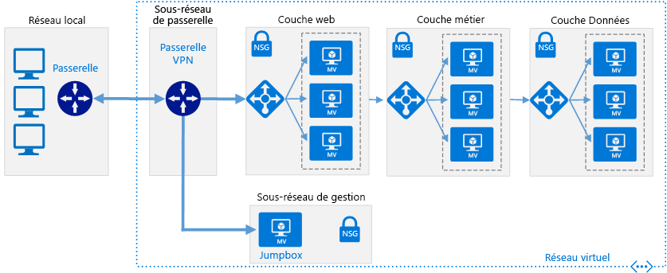

# Connecter un réseau local à Azure à l’aide d’une passerelle VPNConnect an on-premises network to Azure using a VPN gateway

Cette architecture de référence montre comment étendre un réseau local à Azure à l’aide d’un réseau privé virtuel (VPN) site à site.This reference architecture shows how to extend an on-premises network to Azure, using a site-to-site virtual private network (VPN). Le trafic circule entre le réseau local et un réseau virtuel Azure (VNet) via un tunnel VPN IPSec.Traffic flows between the on-premises network and an Azure Virtual Network (VNet) through an IPSec VPN tunnel. [**Déployez cette solution**](#deploy-the-solution).[**Deploy this solution**](#deploy-the-solution).

*Téléchargez un [fichier Visio][visio-download] de cette architecture.**Download a [Visio file][visio-download] of this architecture.*

## ArchitectureArchitecture

L’architecture est constituée des composants suivants.The architecture consists of the following components.

- **Réseau local**.**On-premises network**. Un réseau local privé s’exécutant au sein d’une organisation.A private local-area network running within an organization.

- **Appliance VPN**.**VPN appliance**. Périphérique ou service qui assure la connectivité externe au réseau local.A device or service that provides external connectivity to the on-premises network. L’appliance VPN peut être un périphérique matériel ou une solution logicielle telle que le service RRAS (Routing and Remote Access Service) dans Windows Server 2012.The VPN appliance may be a hardware device, or it can be a software solution such as the Routing and Remote Access Service (RRAS) in Windows Server 2012. Pour obtenir la liste des appareils VPN pris en charge et des informations sur la configuration pour les connecter à une passerelle VPN Azure, consultez les instructions pour l’appareil sélectionné dans l’article [À propos des périphériques VPN pour les connexions de la passerelle VPN de site à site][vpn-appliance].For a list of supported VPN appliances and information on configuring them to connect to an Azure VPN gateway, see the instructions for the selected device in the article [About VPN devices for Site-to-Site VPN Gateway connections][vpn-appliance].

- **Réseau virtuel**.**Virtual network (VNet)**. L’application cloud et les composants de la passerelle VPN Azure résident dans le même [réseau virtuel][azure-virtual-network].The cloud application and the components for the Azure VPN gateway reside in the same [VNet][azure-virtual-network].

- **Passerelle VPN Azure**.**Azure VPN gateway**. Le service de [passerelle VPN][azure-vpn-gateway] vous permet de connecter le réseau virtuel au réseau local via une appliance VPN.The [VPN gateway][azure-vpn-gateway] service enables you to connect the VNet to the on-premises network through a VPN appliance. Pour plus d’informations, consultez [Connecter un réseau local à Microsoft Azure Virtual Network][connect-to-an-Azure-vnet].For more information, see [Connect an on-premises network to a Microsoft Azure virtual network][connect-to-an-Azure-vnet]. La passerelle VPN inclut les éléments suivants :The VPN gateway includes the following elements:

  - **Passerelle de réseau virtuel**.**Virtual network gateway**. Ressource qui fournit une appliance VPN virtuelle pour le réseau virtuel.A resource that provides a virtual VPN appliance for the VNet. Elle achemine le trafic du réseau local vers le réseau virtuel.It is responsible for routing traffic from the on-premises network to the VNet.
  - **Passerelle de réseau local**.**Local network gateway**. Abstraction de l’appliance VPN locale.An abstraction of the on-premises VPN appliance. Le trafic réseau allant de l’application cloud au réseau local est acheminé via cette passerelle.Network traffic from the cloud application to the on-premises network is routed through this gateway.
  - **Connexion**.**Connection**. La connexion a des propriétés qui spécifient le type de connexion (IPSec) et la clé partagée avec l’appliance VPN locale pour chiffrer le trafic.The connection has properties that specify the connection type (IPSec) and the key shared with the on-premises VPN appliance to encrypt traffic.
  - **Sous-réseau de passerelle**.**Gateway subnet**. La passerelle de réseau virtuel est conservée dans son propre sous-réseau, qui est soumis à des exigences diverses, décrites dans la section Recommandations ci-dessous.The virtual network gateway is held in its own subnet, which is subject to various requirements, described in the Recommendations section below.

- **Application cloud**.**Cloud application**. L’application hébergée dans Azure.The application hosted in Azure. Elle peut inclure plusieurs niveaux, avec plusieurs sous-réseaux connectés à l’aide d’équilibreurs de charge Azure.It might include multiple tiers, with multiple subnets connected through Azure load balancers. Pour plus d’informations sur l’infrastructure d’application, consultez [Running Windows VM workloads][windows-vm-ra] (Exécution de charges de travail de machine virtuelle Windows) et [Exécution de charges de travail de machine virtuelle Linux][linux-vm-ra].For more information about the application infrastructure, see [Running Windows VM workloads][windows-vm-ra] and [Running Linux VM workloads][linux-vm-ra].

- **Équilibreur de charge interne**.**Internal load balancer**. Le trafic réseau de la passerelle VPN est acheminé vers l’application cloud via un équilibreur de charge interne.Network traffic from the VPN gateway is routed to the cloud application through an internal load balancer. L’équilibreur de charge se trouve dans le sous-réseau frontal de l’application.The load balancer is located in the front-end subnet of the application.

## RecommandationsRecommendations

Les recommandations suivantes s’appliquent à la plupart des scénarios.The following recommendations apply for most scenarios. Suivez ces recommandations, sauf si vous avez un besoin spécifique qui vous oblige à les ignorer.Follow these recommendations unless you have a specific requirement that overrides them.

### Réseau virtuel et sous-réseau de passerelleVNet and gateway subnet

Créez un réseau virtuel Azure avec un espace d’adressage suffisant pour toutes les ressources requises.Create an Azure VNet with an address space large enough for all of your required resources. Assurez-vous que l’espace d’adressage du réseau virtuel puisse évoluer au cas où vous auriez besoin de machines virtuelles supplémentaires à l’avenir.Ensure that the VNet address space has sufficient room for growth if additional VMs are likely to be needed in the future. L’espace d’adressage du réseau virtuel ne doit pas chevaucher le réseau local.The address space of the VNet must not overlap with the on-premises network. Par exemple, le diagramme ci-dessus utilise l’espace d’adressage 10.20.0.0/16 pour le réseau virtuel.For example, the diagram above uses the address space 10.20.0.0/16 for the VNet.

Créez un sous-réseau nommé *GatewaySubnet*, avec une plage d’adresses de /27.Create a subnet named *GatewaySubnet*, with an address range of /27. La passerelle de réseau virtuel requiert ce sous-réseau.This subnet is required by the virtual network gateway. En allouant 32 adresses à ce sous-réseau, vous devriez éviter les limitations de taille de passerelle.Allocating 32 addresses to this subnet will help to prevent reaching gateway size limitations in the future. En outre, évitez de placer ce sous-réseau au milieu de l’espace d’adressage.Also, avoid placing this subnet in the middle of the address space. La meilleure pratique consiste à définir l’espace d’adressage du sous-réseau de passerelle à l’extrémité supérieure de l’espace d’adressage du réseau virtuel.A good practice is to set the address space for the gateway subnet at the upper end of the VNet address space. L’exemple du diagramme utilise 10.20.255.224/27.The example shown in the diagram uses 10.20.255.224/27.  Voici une procédure rapide pour calculer le [CIDR] :Here is a quick procedure to calculate the [CIDR]:

1. Définissez les bits variables dans l’espace d’adressage du réseau virtuel sur 1, jusqu'aux bits utilisés par le sous-réseau de passerelle, puis les bits restants sur 0.Set the variable bits in the address space of the VNet to 1, up to the bits being used by the gateway subnet, then set the remaining bits to 0.
2. Convertissez les bits obtenus en nombre décimal et exprimez celui-ci sous la forme d’un espace d’adressage dont la longueur de préfixe correspond à la taille du sous-réseau de passerelle.Convert the resulting bits to decimal and express it as an address space with the prefix length set to the size of the gateway subnet.

Par exemple, pour un réseau virtuel avec une plage d’adresses IP de 10.20.0.0/16, l’étape 1 ci-dessus donne le résultat 10.20.0b11111111.0b11100000.For example, for a VNet with an IP address range of 10.20.0.0/16, applying step #1 above becomes 10.20.0b11111111.0b11100000.  La conversion en nombre décimal et l’expression sous la forme d’un espace d’adressage génère 10.20.255.224/27.Converting that to decimal and expressing it as an address space yields 10.20.255.224/27.

> [!WARNING]
> Ne déployez pas de machines virtuelles pour le sous-réseau de passerelle.Do not deploy any VMs to the gateway subnet. N’affectez pas non plus de groupe de sécurité réseau à ce sous-réseau, car la passerelle cesserait de fonctionner.Also, do not assign an NSG to this subnet, as it will cause the gateway to stop functioning.
>

### Passerelle de réseau virtuelVirtual network gateway

Allouez une adresse IP publique à la passerelle de réseau virtuel.Allocate a public IP address for the virtual network gateway.

Créez la passerelle de réseau virtuel dans le sous-réseau de passerelle et affectez-lui l’adresse IP publique nouvellement allouée.Create the virtual network gateway in the gateway subnet and assign it the newly allocated public IP address. Utilisez le type de passerelle qui correspond le mieux à vos besoins et qui est activé par votre appliance VPN :Use the gateway type that most closely matches your requirements and that is enabled by your VPN appliance:

- Créez une [passerelle basée sur des stratégies][policy-based-routing] si vous avez besoin contrôler avec précision la façon dont les requêtes sont acheminées en fonction de critères de stratégie tels que les préfixes d’adresse.Create a [policy-based gateway][policy-based-routing] if you need to closely control how requests are routed based on policy criteria such as address prefixes. Les passerelles basées sur des stratégies utilisent le routage statique et fonctionnent uniquement avec les connexions de site à site.Policy-based gateways use static routing, and only work with site-to-site connections.

- Créez une [passerelle basée sur des itinéraires][route-based-routing] si vous vous connectez au réseau local via RRAS, prenez en charge les connexions entre plusieurs régions ou sites, ou implémentez des connexions de réseau virtuel à réseau virtuel (y compris des itinéraires qui traversent plusieurs réseaux virtuels).Create a [route-based gateway][route-based-routing] if you connect to the on-premises network using RRAS, support multi-site or cross-region connections, or implement VNet-to-VNet connections (including routes that traverse multiple VNets). Les passerelles basées sur des itinéraires utilisent le routage dynamique pour diriger le trafic entre les réseaux.Route-based gateways use dynamic routing to direct traffic between networks. Elles tolèrent mieux les incidents dans le chemin d’accès réseau que les itinéraires statiques, car elles peuvent essayer d’autres itinéraires.They can tolerate failures in the network path better than static routes because they can try alternative routes. Les passerelles basées sur des itinéraires peuvent également réduire la charge de gestion, car les itinéraires ne doivent pas nécessairement être mis à jour manuellement en cas de changement des adresses réseau.Route-based gateways can also reduce the management overhead because routes might not need to be updated manually when network addresses change.

Pour obtenir la liste des appliances VPN prises en charge, voir [À propos des périphériques VPN pour les connexions de la passerelle VPN de site à site][vpn-appliances].For a list of supported VPN appliances, see [About VPN devices for Site-to-Site VPN Gateway connections][vpn-appliances].

> [!NOTE]
> Si vous souhaitez changer de type de passerelle une fois celle-ci créée, il vous faudra la supprimer et en recréer une autre.After the gateway has been created, you cannot change between gateway types without deleting and re-creating the gateway.
>

Sélectionnez la référence SKU de passerelle VPN Azure qui correspond le mieux à vos besoins en débit.Select the Azure VPN gateway SKU that most closely matches your throughput requirements. Pour plus d’informations, consultez [SKU de passerelle][azure-gateway-skus]For more informayion, see [Gateway SKUs][azure-gateway-skus]

> [!NOTE]
> La référence SKU de base n’est pas compatible avec Azure ExpressRoute.The Basic SKU is not compatible with Azure ExpressRoute. Vous pouvez [modifier la référence SKU][changing-SKUs] une fois la passerelle créée.You can [change the SKU][changing-SKUs] after the gateway has been created.
>

Le coût facturé est calculé en fonction de la durée pendant laquelle une passerelle est configurée et disponible.You are charged based on the amount of time that the gateway is provisioned and available. Voir la [tarification de la passerelle VPN][azure-gateway-charges].See [VPN Gateway Pricing][azure-gateway-charges].

Créez des règles de routage pour le sous-réseau de passerelle qui dirigent le trafic entrant de l’application de la passerelle vers l’équilibreur de charge interne, au lieu d’autoriser les requêtes à passer directement jusqu’aux machines virtuelles d’application.Create routing rules for the gateway subnet that direct incoming application traffic from the gateway to the internal load balancer, rather than allowing requests to pass directly to the application VMs.

### Connexion au réseau localOn-premises network connection

Créer une passerelle de réseau local.Create a local network gateway. Spécifiez l’adresse IP publique de l’appliance VPN locale et l’espace d’adressage du réseau local.Specify the public IP address of the on-premises VPN appliance, and the address space of the on-premises network. Notez que l’appliance VPN locale doit avoir une adresse IP publique accessible par la passerelle de réseau local dans la passerelle VPN Azure.Note that the on-premises VPN appliance must have a public IP address that can be accessed by the local network gateway in Azure VPN Gateway. Le périphérique VPN ne peut pas se trouver derrière un périphérique de traduction d’adresses réseau (NAT).The VPN device cannot be located behind a network address translation (NAT) device.

Créez une connexion de site à site pour la passerelle de réseau virtuel et la passerelle de réseau local.Create a site-to-site connection for the virtual network gateway and the local network gateway. Sélectionnez le type de connexion de site à site (IPSec) et spécifiez la clé partagée.Select the site-to-site (IPSec) connection type, and specify the shared key. Le chiffrement de site à site avec la passerelle VPN Azure est basé sur le protocole IPSec, à l’aide de clés prépartagées pour l’authentification.Site-to-site encryption with the Azure VPN gateway is based on the IPSec protocol, using preshared keys for authentication. Vous spécifiez la clé lorsque vous créez la passerelle VPN Azure.You specify the key when you create the Azure VPN gateway. Vous devez configurer l’appliance VPN exécutée en local avec la même clé.You must configure the VPN appliance running on-premises with the same key. Les autres mécanismes d’authentification ne sont pas pris en charge actuellement.Other authentication mechanisms are not currently supported.

Vérifiez que l’infrastructure de routage locale est configurée pour transférer les requêtes destinées aux adresses de réseau virtuel Azure au périphérique VPN.Ensure that the on-premises routing infrastructure is configured to forward requests intended for addresses in the Azure VNet to the VPN device.

Ouvrez les ports requis par l’application cloud dans le réseau local.Open any ports required by the cloud application in the on-premises network.

Testez la connexion pour vérifier les points suivants :Test the connection to verify that:

- L’appliance VPN locale achemine correctement le trafic vers l’application cloud via la passerelle VPN Azure.The on-premises VPN appliance correctly routes traffic to the cloud application through the Azure VPN gateway.
- Le réseau virtuel réachemine correctement le trafic vers le réseau local.The VNet correctly routes traffic back to the on-premises network.
- Le trafic interdit dans les deux directions est correctement bloqué.Prohibited traffic in both directions is blocked correctly.

## Considérations relatives à l’extensibilitéScalability considerations

Vous pouvez obtenir une évolutivité verticale limitée en passant des références SKU de passerelle VPN basique ou standard à la référence SKU de VPN hautes performances.You can achieve limited vertical scalability by moving from the Basic or Standard VPN Gateway SKUs to the High Performance VPN SKU.

Pour les réseaux virtuels qui attendent un gros volume de trafic VPN, envisagez de distribuer les différentes charges de travail dans des réseaux virtuels distincts plus petits et de configurer une passerelle VPN pour chacun d’entre eux.For VNets that expect a large volume of VPN traffic, consider distributing the different workloads into separate smaller VNets and configuring a VPN gateway for each of them.

Vous pouvez partitionner le réseau virtuel horizontalement ou verticalement.You can partition the VNet either horizontally or vertically. Pour un partitionnement horizontal, déplacez certaines instances de machine virtuelle de chaque couche vers des sous-réseaux du nouveau réseau virtuel.To partition horizontally, move some VM instances from each tier into subnets of the new VNet. Ainsi, chaque réseau virtuel a la même structure et les mêmes fonctionnalités.The result is that each VNet has the same structure and functionality. Pour un partitionnement vertical, réorganisez chaque couche pour diviser les fonctionnalités en différentes zones logiques (par exemple, la gestion des commandes, la facturation, la gestion des comptes client, etc.).To partition vertically, redesign each tier to divide the functionality into different logical areas (such as handling orders, invoicing, customer account management, and so on). Chaque zone fonctionnelle peut alors être placée dans son propre réseau virtuel.Each functional area can then be placed in its own VNet.

La réplication d’un contrôleur de domaine Active Directory local dans le réseau virtuel et l’implémentation d’un DNS dans le réseau virtuel contribuent à réduire la part du trafic relative à la sécurité et à l’administration qui passe du site local au cloud.Replicating an on-premises Active Directory domain controller in the VNet, and implementing DNS in the VNet, can help to reduce some of the security-related and administrative traffic flowing from on-premises to the cloud. Pour plus d’informations, voir [Extension d’Active Directory Domain Services (AD DS) à Azure][adds-extend-domain].For more information, see [Extending Active Directory Domain Services (AD DS) to Azure][adds-extend-domain].

## Considérations relatives à la disponibilitéAvailability considerations

Si vous devez vous assurer que le réseau local reste disponible pour la passerelle VPN Azure, implémentez un cluster de basculement pour la passerelle VPN locale.If you need to ensure that the on-premises network remains available to the Azure VPN gateway, implement a failover cluster for the on-premises VPN gateway.

Si votre organisation possède plusieurs sites locaux, créez des [connexions multisites][vpn-gateway-multi-site] vers un ou plusieurs réseaux virtuels Azure.If your organization has multiple on-premises sites, create [multi-site connections][vpn-gateway-multi-site] to one or more Azure VNets. Cette approche requiert un routage dynamique (basé sur des itinéraires). Veillez donc à ce que la passerelle VPN locale prenne en charge cette fonctionnalité.This approach requires dynamic (route-based) routing, so make sure that the on-premises VPN gateway supports this feature.

Pour plus d’informations sur les contrats de niveau de service, voir le [contrat de niveau de service pour la passerelle VPN][sla-for-vpn-gateway].For details about service level agreements, see [SLA for VPN Gateway][sla-for-vpn-gateway].

## Considérations relatives à la facilité de gestionManageability considerations

Surveillez les informations de diagnostic provenant des appliances VPN locales.Monitor diagnostic information from on-premises VPN appliances. Ce processus dépend des fonctionnalités fournies par l’appliance VPN.This process depends on the features provided by the VPN appliance. Par exemple, si vous utilisez le service de routage et d’accès distant sur Windows Server 2012, [journalisation RRAS][rras-logging].For example, if you are using the Routing and Remote Access Service on Windows Server 2012, [RRAS logging][rras-logging].

Utilisez les [diagnostics de la passerelle VPN Azure][gateway-diagnostic-logs] pour capturer des informations sur les problèmes de connectivité.Use [Azure VPN gateway diagnostics][gateway-diagnostic-logs] to capture information about connectivity issues. Ces journaux contiennent des informations telles que la source et les destinations des requêtes de connexion, le protocole utilisé et la méthode d’établissement de la connexion (ou la raison de l’échec).These logs can be used to track information such as the source and destinations of connection requests, which protocol was used, and how the connection was established (or why the attempt failed).

Analysez les journaux des opérations de la passerelle VPN Azure à l’aide des journaux d’audit disponibles dans le portail Azure.Monitor the operational logs of the Azure VPN gateway using the audit logs available in the Azure portal. Des journaux distincts sont disponibles pour la passerelle de réseau local, la passerelle de réseau Azure et la connexion.Separate logs are available for the local network gateway, the Azure network gateway, and the connection. Ces informations permettent de suivre toutes les modifications apportées à la passerelle et peuvent être utiles si une passerelle cesse de fonctionner pour une raison quelconque.This information can be used to track any changes made to the gateway, and can be useful if a previously functioning gateway stops working for some reason.

Contrôlez la connectivité et suivez les événements d’échec de connectivité.Monitor connectivity, and track connectivity failure events. Vous pouvez utiliser un package de contrôle comme [Nagios][nagios] pour capturer ces informations et les consigner dans des rapports.You can use a monitoring package such as [Nagios][nagios] to capture and report this information.

## Considérations relatives à la sécuritéSecurity considerations

Générez une clé partagée différente pour chaque passerelle VPN.Generate a different shared key for each VPN gateway. Utilisez une clé partagée forte qui résiste aux attaques en force brute.Use a strong shared key to help resist brute-force attacks.

> [!NOTE]
> Actuellement, vous ne pouvez pas utiliser Azure Key Vault afin de prépartager des clés pour la passerelle VPN Azure.Currently, you cannot use Azure Key Vault to preshare keys for the Azure VPN gateway.
>

Assurez-vous que l’appliance VPN locale utilise une méthode de chiffrement [compatible avec la passerelle VPN Azure][vpn-appliance-ipsec].Ensure that the on-premises VPN appliance uses an encryption method that is [compatible with the Azure VPN gateway][vpn-appliance-ipsec]. Pour le routage basé sur des stratégies, la passerelle VPN Azure prend en charge les algorithmes de chiffrement AES256, AES128 et 3DES.For policy-based routing, the Azure VPN gateway supports the AES256, AES128, and 3DES encryption algorithms. Les passerelles basées sur des itinéraires prennent en charge AES256 et 3DES.Route-based gateways support AES256 and 3DES.

Si votre appliance VPN locale se trouve sur un réseau de périmètre (DMZ) qui a un pare-feu entre le réseau de périmètre et Internet, vous devrez peut-être configurer des [règles de pare-feu supplémentaires][additional-firewall-rules] pour permettre la connexion VPN de site à site.If your on-premises VPN appliance is on a perimeter network (DMZ) that has a firewall between the perimeter network and the Internet, you might have to configure [additional firewall rules][additional-firewall-rules] to allow the site-to-site VPN connection.

Si l’application du réseau virtuel envoie des données à Internet, envisagez de [mettre en œuvre le tunneling forcé][forced-tunneling] pour acheminer tout le trafic Internet via le réseau local.If the application in the VNet sends data to the Internet, consider [implementing forced tunneling][forced-tunneling] to route all Internet-bound traffic through the on-premises network. Cette approche vous permet d’auditer les requêtes sortantes effectuées par l’application à partir de l’infrastructure locale.This approach enables you to audit outgoing requests made by the application from the on-premises infrastructure.

> [!NOTE]
> Le tunneling forcé peut influer sur la connectivité aux services Azure (le service de stockage, par exemple) et le gestionnaire de licences de Windows.Forced tunneling can impact connectivity to Azure services (the Storage Service, for example) and the Windows license manager.
>

## Déployer la solutionDeploy the solution

**Conditions préalables**.**Prerequisites**. Vous devez disposer d’une infrastructure locale existante déjà configurée avec une appliance réseau appropriée.You must have an existing on-premises infrastructure already configured with a suitable network appliance.

Pour déployer la solution, procédez comme suit :To deploy the solution, perform the following steps.

<!-- markdownlint-disable MD033 -->

1. Cliquez sur le bouton ci-dessous :Click the button below: 
2. Attendez que le lien s’ouvre dans le portail Azure, puis procédez comme suit :Wait for the link to open in the Azure portal, then follow these steps:
   - Le nom du **groupe de ressources** est déjà défini dans le fichier de paramètres ; sélectionnez **Créer nouveau** et entrez `ra-hybrid-vpn-rg` dans la zone de texte.The **Resource group** name is already defined in the parameter file, so select **Create New** and enter `ra-hybrid-vpn-rg` in the text box.
   - Sélectionnez la région à partir de la zone déroulante **Emplacement**.Select the region from the **Location** drop down box.
   - Ne modifiez pas les zones de texte **Template Root Uri** (Uri racine de modèle) ou **Parameter Root Uri** (Uri racine de paramètre).Do not edit the **Template Root Uri** or the **Parameter Root Uri** text boxes.
   - Passez en revue les termes et conditions, puis cochez la case **J’accepte les termes et conditions mentionnés ci-dessus**.Review the terms and conditions, then click the **I agree to the terms and conditions stated above** checkbox.
   - Cliquez sur le bouton **Acheter**.Click the **Purchase** button.
3. Attendez la fin du déploiement.Wait for the deployment to complete.

<!-- markdownlint-enable MD033 -->

Pour résoudre les problèmes liés à la connexion, consultez [Résoudre les problèmes d’une connexion VPN hybride](./troubleshoot-vpn.md).To troubleshoot the connection, see [Troubleshoot a hybrid VPN connection](./troubleshoot-vpn.md).

<!-- links -->

[adds-extend-domain]: ../identity/adds-extend-domain.md
[windows-vm-ra]: ../virtual-machines-windows/index.md
[linux-vm-ra]: ../virtual-machines-linux/index.md

[azure-cli]: /azure/virtual-machines-command-line-tools
[azure-virtual-network]: /azure/virtual-network/virtual-networks-overview
[vpn-appliance]: /azure/vpn-gateway/vpn-gateway-about-vpn-devices
[azure-vpn-gateway]: https://azure.microsoft.com/services/vpn-gateway/
[azure-gateway-charges]: https://azure.microsoft.com/pricing/details/vpn-gateway/
[azure-gateway-skus]: /azure/vpn-gateway/vpn-gateway-about-vpngateways#gwsku
[connect-to-an-Azure-vnet]: https://technet.microsoft.com/library/dn786406.aspx
[vpn-gateway-multi-site]: /azure/vpn-gateway/vpn-gateway-multi-site
[policy-based-routing]: https://en.wikipedia.org/wiki/Policy-based_routing
[route-based-routing]: https://en.wikipedia.org/wiki/Static_routing
[sla-for-vpn-gateway]: https://azure.microsoft.com/support/legal/sla/vpn-gateway/
[additional-firewall-rules]: https://technet.microsoft.com/library/dn786406.aspx#firewall
[nagios]: https://www.nagios.org/
[changing-SKUs]: https://azure.microsoft.com/blog/azure-virtual-network-gateway-improvements/
[gateway-diagnostic-logs]: https://blogs.technet.microsoft.com/keithmayer/2016/10/12/step-by-step-capturing-azure-resource-manager-arm-vnet-gateway-diagnostic-logs/
[rras-logging]: https://www.petri.com/enable-diagnostic-logging-in-windows-server-2012-r2-routing-and-remote-access
[forced-tunneling]: https://azure.microsoft.com/documentation/articles/vpn-gateway-about-forced-tunneling/
[vpn-appliances]: /azure/vpn-gateway/vpn-gateway-about-vpn-devices
[visio-download]: https://archcenter.blob.core.windows.net/cdn/hybrid-network-architectures.vsdx
[vpn-appliance-ipsec]: /azure/vpn-gateway/vpn-gateway-about-vpn-devices#ipsec-parameters
[azure-cli]: https://azure.microsoft.com/documentation/articles/xplat-cli-install/
[CIDR]: https://en.wikipedia.org/wiki/Classless_Inter-Domain_Routing
