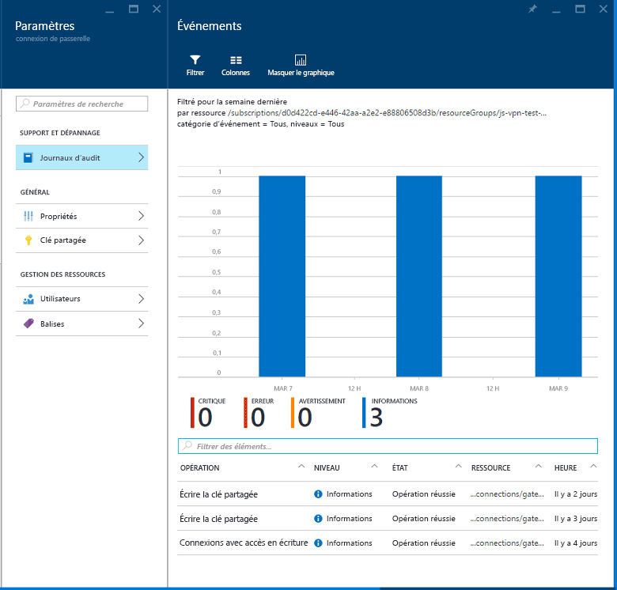

# Connecter un réseau local à Azure à l’aide d’une passerelle VPN

Cette architecture de référence montre comment étendre un réseau local à Azure à l’aide d’un réseau privé virtuel (VPN) site à site. Le trafic circule entre le réseau local et un réseau virtuel Azure (VNet) via un tunnel VPN IPSec. [**Déployez cette solution**](#deploy-the-solution).

*Téléchargez un [fichier Visio][visio-download] de cette architecture.*

## Architecture

L’architecture est constituée des composants suivants.

- **Réseau local**. Un réseau local privé s’exécutant au sein d’une organisation.

- **Appliance VPN**. Périphérique ou service qui assure la connectivité externe au réseau local. L’appliance VPN peut être un périphérique matériel ou une solution logicielle telle que le service RRAS (Routing and Remote Access Service) dans Windows Server 2012. Pour obtenir la liste des appareils VPN pris en charge et des informations sur la configuration pour les connecter à une passerelle VPN Azure, consultez les instructions pour l’appareil sélectionné dans l’article [À propos des périphériques VPN pour les connexions de la passerelle VPN de site à site][vpn-appliance].

- **Réseau virtuel**. L’application cloud et les composants de la passerelle VPN Azure résident dans le même [réseau virtuel][azure-virtual-network].

- **Passerelle VPN Azure**. Le service de [passerelle VPN][azure-vpn-gateway] vous permet de connecter le réseau virtuel au réseau local via une appliance VPN. Pour plus d’informations, consultez [Connecter un réseau local à Microsoft Azure Virtual Network][connect-to-an-Azure-vnet]. La passerelle VPN inclut les éléments suivants :

  - **Passerelle de réseau virtuel**. Ressource qui fournit une appliance VPN virtuelle pour le réseau virtuel. Elle achemine le trafic du réseau local vers le réseau virtuel.
  - **Passerelle de réseau local**. Abstraction de l’appliance VPN locale. Le trafic réseau allant de l’application cloud au réseau local est acheminé via cette passerelle.
  - **Connexion**. La connexion a des propriétés qui spécifient le type de connexion (IPSec) et la clé partagée avec l’appliance VPN locale pour chiffrer le trafic.
  - **Sous-réseau de passerelle**. La passerelle de réseau virtuel est conservée dans son propre sous-réseau, qui est soumis à des exigences diverses, décrites dans la section Recommandations ci-dessous.

- **Application cloud**. L’application hébergée dans Azure. Elle peut inclure plusieurs niveaux, avec plusieurs sous-réseaux connectés à l’aide d’équilibreurs de charge Azure. Pour plus d’informations sur l’infrastructure d’application, consultez [Running Windows VM workloads][windows-vm-ra] (Exécution de charges de travail de machine virtuelle Windows) et [Exécution de charges de travail de machine virtuelle Linux][linux-vm-ra].

- **Équilibreur de charge interne**. Le trafic réseau de la passerelle VPN est acheminé vers l’application cloud via un équilibreur de charge interne. L’équilibreur de charge se trouve dans le sous-réseau frontal de l’application.

## Recommandations

Les recommandations suivantes s’appliquent à la plupart des scénarios. Suivez ces recommandations, sauf si vous avez un besoin spécifique qui vous oblige à les ignorer.

### Réseau virtuel et sous-réseau de passerelle

Créez un réseau virtuel Azure avec un espace d’adressage suffisant pour toutes les ressources requises. Assurez-vous que l’espace d’adressage du réseau virtuel puisse évoluer au cas où vous auriez besoin de machines virtuelles supplémentaires à l’avenir. L’espace d’adressage du réseau virtuel ne doit pas chevaucher le réseau local. Par exemple, le diagramme ci-dessus utilise l’espace d’adressage 10.20.0.0/16 pour le réseau virtuel.

Créez un sous-réseau nommé *GatewaySubnet*, avec une plage d’adresses de /27. La passerelle de réseau virtuel requiert ce sous-réseau. En allouant 32 adresses à ce sous-réseau, vous devriez éviter les limitations de taille de passerelle. En outre, évitez de placer ce sous-réseau au milieu de l’espace d’adressage. La meilleure pratique consiste à définir l’espace d’adressage du sous-réseau de passerelle à l’extrémité supérieure de l’espace d’adressage du réseau virtuel. L’exemple du diagramme utilise 10.20.255.224/27.  Voici une procédure rapide pour calculer le [CIDR] :

1. Définissez les bits variables dans l’espace d’adressage du réseau virtuel sur 1, jusqu'aux bits utilisés par le sous-réseau de passerelle, puis les bits restants sur 0.
2. Convertissez les bits obtenus en nombre décimal et exprimez celui-ci sous la forme d’un espace d’adressage dont la longueur de préfixe correspond à la taille du sous-réseau de passerelle.

Par exemple, pour un réseau virtuel avec une plage d’adresses IP de 10.20.0.0/16, l’étape 1 ci-dessus donne le résultat 10.20.0b11111111.0b11100000.  La conversion en nombre décimal et l’expression sous la forme d’un espace d’adressage génère 10.20.255.224/27.

> [!WARNING]
> Ne déployez pas de machines virtuelles pour le sous-réseau de passerelle. N’affectez pas non plus de groupe de sécurité réseau à ce sous-réseau, car la passerelle cesserait de fonctionner.
>

### Passerelle de réseau virtuel

Allouez une adresse IP publique à la passerelle de réseau virtuel.

Créez la passerelle de réseau virtuel dans le sous-réseau de passerelle et affectez-lui l’adresse IP publique nouvellement allouée. Utilisez le type de passerelle qui correspond le mieux à vos besoins et qui est activé par votre appliance VPN :

- Créez une [passerelle basée sur des stratégies][policy-based-routing] si vous avez besoin contrôler avec précision la façon dont les requêtes sont acheminées en fonction de critères de stratégie tels que les préfixes d’adresse. Les passerelles basées sur des stratégies utilisent le routage statique et fonctionnent uniquement avec les connexions de site à site.

- Créez une [passerelle basée sur des itinéraires][route-based-routing] si vous vous connectez au réseau local via RRAS, prenez en charge les connexions entre plusieurs régions ou sites, ou implémentez des connexions de réseau virtuel à réseau virtuel (y compris des itinéraires qui traversent plusieurs réseaux virtuels). Les passerelles basées sur des itinéraires utilisent le routage dynamique pour diriger le trafic entre les réseaux. Elles tolèrent mieux les incidents dans le chemin d’accès réseau que les itinéraires statiques, car elles peuvent essayer d’autres itinéraires. Les passerelles basées sur des itinéraires peuvent également réduire la charge de gestion, car les itinéraires ne doivent pas nécessairement être mis à jour manuellement en cas de changement des adresses réseau.

Pour obtenir la liste des appliances VPN prises en charge, voir [À propos des périphériques VPN pour les connexions de la passerelle VPN de site à site][vpn-appliances].

> [!NOTE]
> Si vous souhaitez changer de type de passerelle une fois celle-ci créée, il vous faudra la supprimer et en recréer une autre.
>

Sélectionnez la référence SKU de passerelle VPN Azure qui correspond le mieux à vos besoins en débit. Pour plus d’informations, consultez [Références (SKU) de passerelle][azure-gateway-skus]

> [!NOTE]
> La référence SKU de base n’est pas compatible avec Azure ExpressRoute. Vous pouvez [modifier la référence SKU][changing-SKUs] une fois la passerelle créée.
>

Le coût facturé est calculé en fonction de la durée pendant laquelle une passerelle est configurée et disponible. Voir la [tarification de la passerelle VPN][azure-gateway-charges].

Créez des règles de routage pour le sous-réseau de passerelle qui dirigent le trafic entrant de l’application de la passerelle vers l’équilibreur de charge interne, au lieu d’autoriser les requêtes à passer directement jusqu’aux machines virtuelles d’application.

### Connexion au réseau local

Créer une passerelle de réseau local. Spécifiez l’adresse IP publique de l’appliance VPN locale et l’espace d’adressage du réseau local. Notez que l’appliance VPN locale doit avoir une adresse IP publique accessible par la passerelle de réseau local dans la passerelle VPN Azure. Le périphérique VPN ne peut pas se trouver derrière un périphérique de traduction d’adresses réseau (NAT).

Créez une connexion de site à site pour la passerelle de réseau virtuel et la passerelle de réseau local. Sélectionnez le type de connexion de site à site (IPSec) et spécifiez la clé partagée. Le chiffrement de site à site avec la passerelle VPN Azure est basé sur le protocole IPSec, à l’aide de clés prépartagées pour l’authentification. Vous spécifiez la clé lorsque vous créez la passerelle VPN Azure. Vous devez configurer l’appliance VPN exécutée en local avec la même clé. Les autres mécanismes d’authentification ne sont pas pris en charge actuellement.

Vérifiez que l’infrastructure de routage locale est configurée pour transférer les requêtes destinées aux adresses de réseau virtuel Azure au périphérique VPN.

Ouvrez les ports requis par l’application cloud dans le réseau local.

Testez la connexion pour vérifier les points suivants :

- L’appliance VPN locale achemine correctement le trafic vers l’application cloud via la passerelle VPN Azure.
- Le réseau virtuel réachemine correctement le trafic vers le réseau local.
- Le trafic interdit dans les deux directions est correctement bloqué.

## Considérations relatives à l’extensibilité

Vous pouvez obtenir une évolutivité verticale limitée en passant des références SKU de passerelle VPN basique ou standard à la référence SKU de VPN hautes performances.

Pour les réseaux virtuels qui attendent un gros volume de trafic VPN, envisagez de distribuer les différentes charges de travail dans des réseaux virtuels distincts plus petits et de configurer une passerelle VPN pour chacun d’entre eux.

Vous pouvez partitionner le réseau virtuel horizontalement ou verticalement. Pour un partitionnement horizontal, déplacez certaines instances de machine virtuelle de chaque couche vers des sous-réseaux du nouveau réseau virtuel. Ainsi, chaque réseau virtuel a la même structure et les mêmes fonctionnalités. Pour un partitionnement vertical, réorganisez chaque couche pour diviser les fonctionnalités en différentes zones logiques (par exemple, la gestion des commandes, la facturation, la gestion des comptes client, etc.). Chaque zone fonctionnelle peut alors être placée dans son propre réseau virtuel.

La réplication d’un contrôleur de domaine Active Directory local dans le réseau virtuel et l’implémentation d’un DNS dans le réseau virtuel contribuent à réduire la part du trafic relative à la sécurité et à l’administration qui passe du site local au cloud. Pour plus d’informations, voir [Extension d’Active Directory Domain Services (AD DS) à Azure][adds-extend-domain].

## Considérations relatives à la disponibilité

Si vous devez vous assurer que le réseau local reste disponible pour la passerelle VPN Azure, implémentez un cluster de basculement pour la passerelle VPN locale.

Si votre organisation possède plusieurs sites locaux, créez des [connexions multisites][vpn-gateway-multi-site] vers un ou plusieurs réseaux virtuels Azure. Cette approche requiert un routage dynamique (basé sur des itinéraires). Veillez donc à ce que la passerelle VPN locale prenne en charge cette fonctionnalité.

Pour plus d’informations sur les contrats de niveau de service, voir le [contrat de niveau de service pour la passerelle VPN][sla-for-vpn-gateway].

## Considérations relatives à la facilité de gestion

Surveillez les informations de diagnostic provenant des appliances VPN locales. Ce processus dépend des fonctionnalités fournies par l’appliance VPN. Par exemple, si vous utilisez le service de routage et d’accès distant sur Windows Server 2012, [journalisation RRAS][rras-logging].

Utilisez les [diagnostics de la passerelle VPN Azure][gateway-diagnostic-logs] pour capturer des informations sur les problèmes de connectivité. Ces journaux contiennent des informations telles que la source et les destinations des requêtes de connexion, le protocole utilisé et la méthode d’établissement de la connexion (ou la raison de l’échec).

Analysez les journaux des opérations de la passerelle VPN Azure à l’aide des journaux d’audit disponibles dans le portail Azure. Des journaux distincts sont disponibles pour la passerelle de réseau local, la passerelle de réseau Azure et la connexion. Ces informations permettent de suivre toutes les modifications apportées à la passerelle et peuvent être utiles si une passerelle cesse de fonctionner pour une raison quelconque.

Contrôlez la connectivité et suivez les événements d’échec de connectivité. Vous pouvez utiliser un package de contrôle comme [Nagios][nagios] pour capturer ces informations et les consigner dans des rapports.

## Considérations relatives à la sécurité

Générez une clé partagée différente pour chaque passerelle VPN. Utilisez une clé partagée forte qui résiste aux attaques en force brute.

> [!NOTE]
> Actuellement, vous ne pouvez pas utiliser Azure Key Vault afin de prépartager des clés pour la passerelle VPN Azure.
>

Assurez-vous que l’appliance VPN locale utilise une méthode de chiffrement [compatible avec la passerelle VPN Azure][vpn-appliance-ipsec]. Pour le routage basé sur des stratégies, la passerelle VPN Azure prend en charge les algorithmes de chiffrement AES256, AES128 et 3DES. Les passerelles basées sur des itinéraires prennent en charge AES256 et 3DES.

Si votre appliance VPN locale se trouve sur un réseau de périmètre (DMZ) qui a un pare-feu entre le réseau de périmètre et Internet, vous devrez peut-être configurer des [règles de pare-feu supplémentaires][additional-firewall-rules] pour permettre la connexion VPN de site à site.

Si l’application du réseau virtuel envoie des données à Internet, envisagez de [mettre en œuvre le tunneling forcé][forced-tunneling] pour acheminer tout le trafic Internet via le réseau local. Cette approche vous permet d’auditer les requêtes sortantes effectuées par l’application à partir de l’infrastructure locale.

> [!NOTE]
> Le tunneling forcé peut influer sur la connectivité aux services Azure (le service de stockage, par exemple) et le gestionnaire de licences de Windows.
>

## Déployer la solution

**Conditions préalables**. Vous devez disposer d’une infrastructure locale existante déjà configurée avec une appliance réseau appropriée.

Pour déployer la solution, procédez comme suit :

<!-- markdownlint-disable MD033 -->

1. Cliquez sur le bouton ci-dessous : 
2. Attendez que le lien s’ouvre dans le portail Azure, puis procédez comme suit :
   - Le nom du **groupe de ressources** est déjà défini dans le fichier de paramètres ; sélectionnez **Créer nouveau** et entrez `ra-hybrid-vpn-rg` dans la zone de texte.
   - Sélectionnez la région à partir de la zone déroulante **Emplacement**.
   - Ne modifiez pas les zones de texte **Template Root Uri** (Uri racine de modèle) ou **Parameter Root Uri** (Uri racine de paramètre).
   - Passez en revue les termes et conditions, puis cochez la case **J’accepte les termes et conditions mentionnés ci-dessus**.
   - Cliquez sur le bouton **Acheter**.
3. Attendez la fin du déploiement.

<!-- markdownlint-enable MD033 -->

Pour résoudre les problèmes liés à la connexion, consultez [Résoudre les problèmes d’une connexion VPN hybride](./troubleshoot-vpn.md).

<!-- links -->

[adds-extend-domain]: ../identity/adds-extend-domain.md
[windows-vm-ra]: ../virtual-machines-windows/index.md
[linux-vm-ra]: ../virtual-machines-linux/index.md

[azure-cli]: /azure/virtual-machines-command-line-tools
[azure-virtual-network]: /azure/virtual-network/virtual-networks-overview
[vpn-appliance]: /azure/vpn-gateway/vpn-gateway-about-vpn-devices
[azure-vpn-gateway]: https://azure.microsoft.com/services/vpn-gateway/
[azure-gateway-charges]: https://azure.microsoft.com/pricing/details/vpn-gateway/
[azure-gateway-skus]: /azure/vpn-gateway/vpn-gateway-about-vpngateways#gwsku
[connect-to-an-Azure-vnet]: https://technet.microsoft.com/library/dn786406.aspx
[vpn-gateway-multi-site]: /azure/vpn-gateway/vpn-gateway-multi-site
[policy-based-routing]: https://en.wikipedia.org/wiki/Policy-based_routing
[route-based-routing]: https://en.wikipedia.org/wiki/Static_routing
[sla-for-vpn-gateway]: https://azure.microsoft.com/support/legal/sla/vpn-gateway/
[additional-firewall-rules]: https://technet.microsoft.com/library/dn786406.aspx#firewall
[nagios]: https://www.nagios.org/
[changing-SKUs]: https://azure.microsoft.com/blog/azure-virtual-network-gateway-improvements/
[gateway-diagnostic-logs]: https://blogs.technet.microsoft.com/keithmayer/2016/10/12/step-by-step-capturing-azure-resource-manager-arm-vnet-gateway-diagnostic-logs/
[rras-logging]: https://www.petri.com/enable-diagnostic-logging-in-windows-server-2012-r2-routing-and-remote-access
[forced-tunneling]: /azure/vpn-gateway/vpn-gateway-about-forced-tunneling
[vpn-appliances]: /azure/vpn-gateway/vpn-gateway-about-vpn-devices
[visio-download]: https://archcenter.blob.core.windows.net/cdn/hybrid-network-architectures.vsdx
[vpn-appliance-ipsec]: /azure/vpn-gateway/vpn-gateway-about-vpn-devices#ipsec-parameters
[azure-cli]: /cli/azure/install-azure-cli
[CIDR]: https://en.wikipedia.org/wiki/Classless_Inter-Domain_Routing
