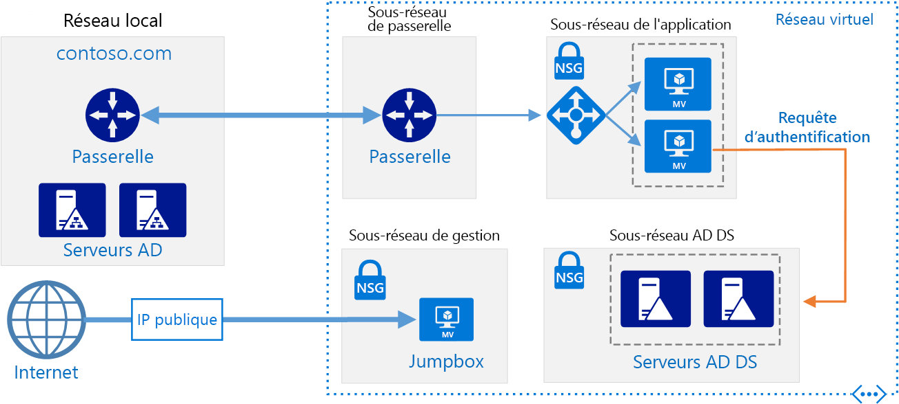

# <a name="extend-active-directory-domain-services-ad-ds-to-azure"></a><span data-ttu-id="1154c-103">Étendre Active Directory Domain Services (AD DS) à Azure</span><span class="sxs-lookup"><span data-stu-id="1154c-103">Extend Active Directory Domain Services (AD DS) to Azure</span></span>

<span data-ttu-id="1154c-104">Cette architecture de référence indique comment étendre votre environnement Active Directory à Azure pour fournir des services d’authentification distribuée à l’aide d’Active Directory Domain Services (AD DS).</span><span class="sxs-lookup"><span data-stu-id="1154c-104">This reference architecture shows how to extend your Active Directory environment to Azure to provide distributed authentication services using Active Directory Domain Services (AD DS).</span></span> <span data-ttu-id="1154c-105">[**Déployez cette solution**](#deploy-the-solution).</span><span class="sxs-lookup"><span data-stu-id="1154c-105">[**Deploy this solution**](#deploy-the-solution).</span></span>



<span data-ttu-id="1154c-107">*Téléchargez un [fichier Visio][visio-download] de cette architecture.*</span><span class="sxs-lookup"><span data-stu-id="1154c-107">*Download a [Visio file][visio-download] of this architecture.*</span></span>

<span data-ttu-id="1154c-108">AD DS est utilisé pour authentifier un utilisateur, un ordinateur, une application ou autres identités qui sont incluses dans un domaine de sécurité.</span><span class="sxs-lookup"><span data-stu-id="1154c-108">AD DS is used to authenticate user, computer, application, or other identities that are included in a security domain.</span></span> <span data-ttu-id="1154c-109">Il peut être hébergé localement, mais si votre application est hébergée en partie localement et en partie dans Azure, il peut être plus efficace de répliquer cette fonctionnalité dans Azure.</span><span class="sxs-lookup"><span data-stu-id="1154c-109">It can be hosted on-premises, but if your application is hosted partly on-premises and partly in Azure, it may be more efficient to replicate this functionality in Azure.</span></span> <span data-ttu-id="1154c-110">Cela peut réduire la latence provoquée par l’envoi des demandes d’authentification et d’autorisation locale depuis le cloud vers les services AD DS exécutés localement.</span><span class="sxs-lookup"><span data-stu-id="1154c-110">This can reduce the latency caused by sending authentication and local authorization requests from the cloud back to AD DS running on-premises.</span></span>

<span data-ttu-id="1154c-111">Cette architecture est couramment utilisée quand le réseau local et le réseau virtuel Azure sont connectés par une connexion VPN ou ExpressRoute.</span><span class="sxs-lookup"><span data-stu-id="1154c-111">This architecture is commonly used when the on-premises network and the Azure virtual network are connected by a VPN or ExpressRoute connection.</span></span> <span data-ttu-id="1154c-112">De plus, cette architecture prend en charge la réplication bidirectionnelle : si des modifications sont effectuées localement ou dans le cloud, les deux sources restent cohérentes.</span><span class="sxs-lookup"><span data-stu-id="1154c-112">This architecture also supports bidirectional replication, meaning changes can be made either on-premises or in the cloud, and both sources will be kept consistent.</span></span> <span data-ttu-id="1154c-113">Parmi les utilisations courantes de cette architecture citons les applications hybrides dans lesquelles la fonctionnalité est répartie entre l’environnement local et Azure, et les applications et services qui effectuent l’authentification à l’aide d’Active Directory.</span><span class="sxs-lookup"><span data-stu-id="1154c-113">Typical uses for this architecture include hybrid applications in which functionality is distributed between on-premises and Azure, and applications and services that perform authentication using Active Directory.</span></span>

<span data-ttu-id="1154c-114">Pour plus d’informations, consultez [Choisir une solution pour intégrer l’environnement Active Directory local à Azure][considerations].</span><span class="sxs-lookup"><span data-stu-id="1154c-114">For additional considerations, see [Choose a solution for integrating on-premises Active Directory with Azure][considerations].</span></span>

## <a name="architecture"></a><span data-ttu-id="1154c-115">Architecture</span><span class="sxs-lookup"><span data-stu-id="1154c-115">Architecture</span></span>

<span data-ttu-id="1154c-116">Cette architecture étend l’architecture illustrée dans [Zone DMZ entre Azure et Internet][implementing-a-secure-hybrid-network-architecture-with-internet-access].</span><span class="sxs-lookup"><span data-stu-id="1154c-116">This architecture extends the architecture shown in [DMZ between Azure and the Internet][implementing-a-secure-hybrid-network-architecture-with-internet-access].</span></span> <span data-ttu-id="1154c-117">Ses composants sont les suivants :</span><span class="sxs-lookup"><span data-stu-id="1154c-117">It has the following components.</span></span>

- <span data-ttu-id="1154c-118">**Réseau local**.</span><span class="sxs-lookup"><span data-stu-id="1154c-118">**On-premises network**.</span></span> <span data-ttu-id="1154c-119">Le réseau local comprend des serveurs Active Directory locaux qui peuvent effectuer l’authentification et l’autorisation pour les composants situés dans l’environnement local.</span><span class="sxs-lookup"><span data-stu-id="1154c-119">The on-premises network includes local Active Directory servers that can perform authentication and authorization for components located on-premises.</span></span>
- <span data-ttu-id="1154c-120">**Serveurs Active Directory**.</span><span class="sxs-lookup"><span data-stu-id="1154c-120">**Active Directory servers**.</span></span> <span data-ttu-id="1154c-121">Il s’agit de contrôleurs de domaine qui implémentent des services d’annuaire (AD DS) s’exécutant en tant que machines virtuelles dans le cloud.</span><span class="sxs-lookup"><span data-stu-id="1154c-121">These are domain controllers implementing directory services (AD DS) running as VMs in the cloud.</span></span> <span data-ttu-id="1154c-122">Ces serveurs peuvent assurer l’authentification des composants s’exécutant dans votre réseau virtuel Azure.</span><span class="sxs-lookup"><span data-stu-id="1154c-122">These servers can provide authentication of components running in your Azure virtual network.</span></span>
- <span data-ttu-id="1154c-123">**Sous-réseau Active Directory**.</span><span class="sxs-lookup"><span data-stu-id="1154c-123">**Active Directory subnet**.</span></span> <span data-ttu-id="1154c-124">Les serveurs AD DS sont hébergés dans un sous-réseau distinct.</span><span class="sxs-lookup"><span data-stu-id="1154c-124">The AD DS servers are hosted in a separate subnet.</span></span> <span data-ttu-id="1154c-125">Des règles de groupe de sécurité réseau (NSG) protègent les serveurs AD DS et fournissent un pare-feu contre le trafic en provenance de sources inconnues.</span><span class="sxs-lookup"><span data-stu-id="1154c-125">Network security group (NSG) rules protect the AD DS servers and provide a firewall against traffic from unexpected sources.</span></span>
- <span data-ttu-id="1154c-126">**Synchronisation Active Directory et passerelle Azure**.</span><span class="sxs-lookup"><span data-stu-id="1154c-126">**Azure Gateway and Active Directory synchronization**.</span></span> <span data-ttu-id="1154c-127">La passerelle Azure fournit une connexion entre le réseau local et le réseau virtuel Azure.</span><span class="sxs-lookup"><span data-stu-id="1154c-127">The Azure gateway provides a connection between the on-premises network and the Azure VNet.</span></span> <span data-ttu-id="1154c-128">Il peut s’agir d’une [connexion VPN][azure-vpn-gateway] ou [d’Azure ExpressRoute][azure-expressroute].</span><span class="sxs-lookup"><span data-stu-id="1154c-128">This can be a [VPN connection][azure-vpn-gateway] or [Azure ExpressRoute][azure-expressroute].</span></span> <span data-ttu-id="1154c-129">Toutes les demandes de synchronisation entre les serveurs Active Directory dans le cloud et dans l’environnement local passent par la passerelle.</span><span class="sxs-lookup"><span data-stu-id="1154c-129">All synchronization requests between the Active Directory servers in the cloud and on-premises pass through the gateway.</span></span> <span data-ttu-id="1154c-130">Les itinéraires définis par l’utilisateur gèrent le routage du trafic local vers Azure.</span><span class="sxs-lookup"><span data-stu-id="1154c-130">User-defined routes (UDRs) handle routing for on-premises traffic that passes to Azure.</span></span> <span data-ttu-id="1154c-131">Le trafic vers et depuis les serveurs Active Directory ne passe pas par les appliances virtuelles réseau dans ce scénario.</span><span class="sxs-lookup"><span data-stu-id="1154c-131">Traffic to and from the Active Directory servers does not pass through the network virtual appliances (NVAs) used in this scenario.</span></span>

<span data-ttu-id="1154c-132">Pour plus d’informations sur les itinéraires définis par l’utilisateur et les appliances virtuelles réseau, consultez [Implémentation d’une architecture réseau hybride sécurisée dans Azure][implementing-a-secure-hybrid-network-architecture].</span><span class="sxs-lookup"><span data-stu-id="1154c-132">For more information about configuring UDRs and the NVAs, see [Implementing a secure hybrid network architecture in Azure][implementing-a-secure-hybrid-network-architecture].</span></span>

## <a name="recommendations"></a><span data-ttu-id="1154c-133">Recommandations</span><span class="sxs-lookup"><span data-stu-id="1154c-133">Recommendations</span></span>

<span data-ttu-id="1154c-134">Les recommandations suivantes s’appliquent à la plupart des scénarios.</span><span class="sxs-lookup"><span data-stu-id="1154c-134">The following recommendations apply for most scenarios.</span></span> <span data-ttu-id="1154c-135">Suivez ces recommandations, sauf si vous avez un besoin spécifique qui vous oblige à les ignorer.</span><span class="sxs-lookup"><span data-stu-id="1154c-135">Follow these recommendations unless you have a specific requirement that overrides them.</span></span>

### <a name="vm-recommendations"></a><span data-ttu-id="1154c-136">Recommandations pour les machines virtuelles</span><span class="sxs-lookup"><span data-stu-id="1154c-136">VM recommendations</span></span>

<span data-ttu-id="1154c-137">Déterminez la [taille de machine virtuelle][vm-windows-sizes] requise en fonction du volume attendu de demandes d’authentification.</span><span class="sxs-lookup"><span data-stu-id="1154c-137">Determine your [VM size][vm-windows-sizes] requirements based on the expected volume of authentication requests.</span></span> <span data-ttu-id="1154c-138">Utilisez les spécifications des machines hébergeant AD DS localement comme point de départ et mettez-les en correspondance avec les tailles des machines virtuelles Azure.</span><span class="sxs-lookup"><span data-stu-id="1154c-138">Use the specifications of the machines hosting AD DS on premises as a starting point, and match them with the Azure VM sizes.</span></span> <span data-ttu-id="1154c-139">Une fois le déploiement effectué, surveillez l’utilisation et procédez à un ajustement d’échelle en fonction de la charge réelle qui pèse sur les machines virtuelles.</span><span class="sxs-lookup"><span data-stu-id="1154c-139">Once deployed, monitor utilization and scale up or down based on the actual load on the VMs.</span></span> <span data-ttu-id="1154c-140">Pour plus d’informations sur le dimensionnement des contrôleurs de domaine AD DS, consultez [Capacity Planning for Active Directory Domain Services][capacity-planning-for-adds] (Planification de la capacité pour Active Directory Domain Services).</span><span class="sxs-lookup"><span data-stu-id="1154c-140">For more information about sizing AD DS domain controllers, see [Capacity Planning for Active Directory Domain Services][capacity-planning-for-adds].</span></span>

<span data-ttu-id="1154c-141">Créez un disque de données virtuel distinct pour le stockage de la base de données, des journaux et de SYSVOL pour Active Directory.</span><span class="sxs-lookup"><span data-stu-id="1154c-141">Create a separate virtual data disk for storing the database, logs, and SYSVOL for Active Directory.</span></span> <span data-ttu-id="1154c-142">Ne stockez pas ces éléments sur le même disque que le système d’exploitation.</span><span class="sxs-lookup"><span data-stu-id="1154c-142">Do not store these items on the same disk as the operating system.</span></span> <span data-ttu-id="1154c-143">Par défaut, les disques de données qui sont attachés à une machine virtuelle utilisent le cache à double écriture.</span><span class="sxs-lookup"><span data-stu-id="1154c-143">Note that by default, data disks that are attached to a VM use write-through caching.</span></span> <span data-ttu-id="1154c-144">Toutefois, cette forme de mise en cache peut entrer en conflit avec les exigences d’AD DS.</span><span class="sxs-lookup"><span data-stu-id="1154c-144">However, this form of caching can conflict with the requirements of AD DS.</span></span> <span data-ttu-id="1154c-145">Vous devez donc, sur le disque de données, définir le paramètre *Préférences de cache d’hôte* sur *Aucun*.</span><span class="sxs-lookup"><span data-stu-id="1154c-145">For this reason, set the *Host Cache Preference* setting on the data disk to *None*.</span></span> <span data-ttu-id="1154c-146">Pour plus d’informations, consultez [Recommandations en matière de déploiement de Windows Server Active Directory sur des machines virtuelles Azure][adds-data-disks].</span><span class="sxs-lookup"><span data-stu-id="1154c-146">For more information, see [Guidelines for Deploying Windows Server Active Directory on Azure Virtual Machines][adds-data-disks].</span></span>

<span data-ttu-id="1154c-147">Déployez au moins deux machines virtuelles exécutant AD DS en tant que contrôleurs de domaine et ajoutez-les à un [groupe à haute disponibilité][availability-set].</span><span class="sxs-lookup"><span data-stu-id="1154c-147">Deploy at least two VMs running AD DS as domain controllers and add them to an [availability set][availability-set].</span></span>

### <a name="networking-recommendations"></a><span data-ttu-id="1154c-148">Recommandations pour la mise en réseau</span><span class="sxs-lookup"><span data-stu-id="1154c-148">Networking recommendations</span></span>

<span data-ttu-id="1154c-149">Configurez l’interface réseau de machine virtuelle pour chaque serveur AD DS avec une adresse IP privée statique pour la prise en charge complète du service de noms de domaine (DNS).</span><span class="sxs-lookup"><span data-stu-id="1154c-149">Configure the VM network interface (NIC) for each AD DS server with a static private IP address for full domain name service (DNS) support.</span></span> <span data-ttu-id="1154c-150">Pour plus d’informations, consultez [Définition d’une adresse IP privée statique dans le portail Azure][set-a-static-ip-address].</span><span class="sxs-lookup"><span data-stu-id="1154c-150">For more information, see [How to set a static private IP address in the Azure portal][set-a-static-ip-address].</span></span>

> [!NOTE]
> <span data-ttu-id="1154c-151">Ne configurez pas l’interface réseau de machine virtuelle pour un serveur AD DS avec une adresse IP publique.</span><span class="sxs-lookup"><span data-stu-id="1154c-151">Do not configure the VM NIC for any AD DS with a public IP address.</span></span> <span data-ttu-id="1154c-152">Pour plus d’informations, consultez [Sécurité - Éléments à prendre en compte][security-considerations].</span><span class="sxs-lookup"><span data-stu-id="1154c-152">See [Security considerations][security-considerations] for more details.</span></span>
>

<span data-ttu-id="1154c-153">Le groupe de sécurité réseau du sous-réseau Active Directory requiert des règles pour autoriser le trafic entrant à partir de l’environnement local.</span><span class="sxs-lookup"><span data-stu-id="1154c-153">The Active Directory subnet NSG requires rules to permit incoming traffic from on-premises.</span></span> <span data-ttu-id="1154c-154">Pour plus d’informations sur les ports utilisés par AD DS, consultez [Active Directory and Active Directory Domain Services Port Requirements][ad-ds-ports] (Exigences de port pour Active Directory et Active Directory Domain Services).</span><span class="sxs-lookup"><span data-stu-id="1154c-154">For detailed information on the ports used by AD DS, see [Active Directory and Active Directory Domain Services Port Requirements][ad-ds-ports].</span></span> <span data-ttu-id="1154c-155">De plus, vérifiez que les tables d’itinéraires définis par l’utilisateur n’acheminent pas le trafic AD DS via les appliances virtuelles réseau utilisées dans cette architecture.</span><span class="sxs-lookup"><span data-stu-id="1154c-155">Also, ensure the UDR tables do not route AD DS traffic through the NVAs used in this architecture.</span></span>

### <a name="active-directory-site"></a><span data-ttu-id="1154c-156">Site Active Directory</span><span class="sxs-lookup"><span data-stu-id="1154c-156">Active Directory site</span></span>

<span data-ttu-id="1154c-157">Dans AD DS, un site représente un emplacement physique, un réseau ou une collection d’appareils.</span><span class="sxs-lookup"><span data-stu-id="1154c-157">In AD DS, a site represents a physical location, network, or collection of devices.</span></span> <span data-ttu-id="1154c-158">Les sites AD DS permettent de gérer la réplication de la base de données AD DS en regroupant les objets AD DS qui sont situés à proximité les uns des autres et qui sont connectés par un réseau haut débit.</span><span class="sxs-lookup"><span data-stu-id="1154c-158">AD DS sites are used to manage AD DS database replication by grouping together AD DS objects that are located close to one another and are connected by a high speed network.</span></span> <span data-ttu-id="1154c-159">AD DS inclut la logique qui assure la sélection de la meilleure stratégie de réplication de la base de données AD DS entre les sites.</span><span class="sxs-lookup"><span data-stu-id="1154c-159">AD DS includes logic to select the best strategy for replacating the AD DS database between sites.</span></span>

<span data-ttu-id="1154c-160">Nous vous recommandons de créer un site AD DS incluant les sous-réseaux définis pour votre application dans Azure.</span><span class="sxs-lookup"><span data-stu-id="1154c-160">We recommend that you create an AD DS site including the subnets defined for your application in Azure.</span></span> <span data-ttu-id="1154c-161">Ensuite, configurez un lien de site entre vos sites AD DS locaux, afin qu’AD DS effectue automatiquement la réplication de base de données la plus efficace possible.</span><span class="sxs-lookup"><span data-stu-id="1154c-161">Then, configure a site link between your on-premises AD DS sites, and AD DS will automatically perform the most efficient database replication possible.</span></span> <span data-ttu-id="1154c-162">Notez que cette réplication de base de données nécessite peu de tâches de configuration en plus de la configuration initiale.</span><span class="sxs-lookup"><span data-stu-id="1154c-162">Note that this database replication requires little beyond the initial configuration.</span></span>

### <a name="active-directory-operations-masters"></a><span data-ttu-id="1154c-163">Maîtres d’opérations Active Directory</span><span class="sxs-lookup"><span data-stu-id="1154c-163">Active Directory operations masters</span></span>

<span data-ttu-id="1154c-164">Vous pouvez affecter le rôle de maître d’opérations aux contrôleurs de domaine AD DS afin qu’ils prennent en charge le contrôle de la cohérence entre les instances des bases de données AD DS répliquées.</span><span class="sxs-lookup"><span data-stu-id="1154c-164">The operations masters role can be assigned to AD DS domain controllers to support consistency checking between instances of replicated AD DS databases.</span></span> <span data-ttu-id="1154c-165">Il existe cinq rôles de maître d’opérations : contrôleur de schéma, maître d’opérations des noms de domaine, maître d’identificateur relatif, émulateur maître de contrôleur de domaine principal et maître d’infrastructure.</span><span class="sxs-lookup"><span data-stu-id="1154c-165">There are five operations master roles: schema master, domain naming master, relative identifier master, primary domain controller master emulator, and infrastructure master.</span></span> <span data-ttu-id="1154c-166">Pour plus d’informations sur ces rôles, consultez [What are Operations Masters?][ad-ds-operations-masters] (Présentation des maîtres d’opérations).</span><span class="sxs-lookup"><span data-stu-id="1154c-166">For more information about these roles, see [What are Operations Masters?][ad-ds-operations-masters].</span></span>

<span data-ttu-id="1154c-167">Nous vous déconseillons d’affecter des rôles de maître d’opérations aux contrôleurs de domaine déployés dans Azure.</span><span class="sxs-lookup"><span data-stu-id="1154c-167">We recommend you do not assign operations masters roles to the domain controllers deployed in Azure.</span></span>

### <a name="monitoring"></a><span data-ttu-id="1154c-168">Surveillance</span><span class="sxs-lookup"><span data-stu-id="1154c-168">Monitoring</span></span>

<span data-ttu-id="1154c-169">Surveillez les ressources des machines virtuelles de contrôleur de domaine ainsi que les services AD DS et créez un plan pour corriger les problèmes rapidement.</span><span class="sxs-lookup"><span data-stu-id="1154c-169">Monitor the resources of the domain controller VMs as well as the AD DS Services and create a plan to quickly correct any problems.</span></span> <span data-ttu-id="1154c-170">Pour plus d’informations, consultez [Surveillance d’Active Directory][monitoring_ad].</span><span class="sxs-lookup"><span data-stu-id="1154c-170">For more information, see [Monitoring Active Directory][monitoring_ad].</span></span> <span data-ttu-id="1154c-171">Vous pouvez également installer des outils tels que [Microsoft Systems Center][microsoft_systems_center] sur le serveur de surveillance (voir le diagramme de l’architecture) pour effectuer ces tâches.</span><span class="sxs-lookup"><span data-stu-id="1154c-171">You can also install tools such as [Microsoft Systems Center][microsoft_systems_center] on the monitoring server (see the architecture diagram) to help perform these tasks.</span></span>

## <a name="scalability-considerations"></a><span data-ttu-id="1154c-172">Considérations relatives à l’extensibilité</span><span class="sxs-lookup"><span data-stu-id="1154c-172">Scalability considerations</span></span>

<span data-ttu-id="1154c-173">AD DS est conçu dans un souci de scalabilité.</span><span class="sxs-lookup"><span data-stu-id="1154c-173">AD DS is designed for scalability.</span></span> <span data-ttu-id="1154c-174">Vous n’avez pas besoin de configurer un équilibreur de charge ou un contrôleur de trafic pour diriger les demandes vers les contrôleurs de domaine AD DS.</span><span class="sxs-lookup"><span data-stu-id="1154c-174">You don't need to configure a load balancer or traffic controller to direct requests to AD DS domain controllers.</span></span> <span data-ttu-id="1154c-175">Vous devez simplement configurer les machines virtuelles exécutant AD DS avec la taille appropriée suivant les exigences de charge de votre réseau, surveiller la charge sur les machines virtuelles et faire évoluer la configuration en fonction des besoins.</span><span class="sxs-lookup"><span data-stu-id="1154c-175">The only scalability consideration is to configure the VMs running AD DS with the correct size for your network load requirements, monitor the load on the VMs, and scale up or down as necessary.</span></span>

## <a name="availability-considerations"></a><span data-ttu-id="1154c-176">Considérations relatives à la disponibilité</span><span class="sxs-lookup"><span data-stu-id="1154c-176">Availability considerations</span></span>

<span data-ttu-id="1154c-177">Déployez les machines virtuelles exécutant AD DS sur un [groupe à haute disponibilité][availability-set].</span><span class="sxs-lookup"><span data-stu-id="1154c-177">Deploy the VMs running AD DS into an [availability set][availability-set].</span></span> <span data-ttu-id="1154c-178">De plus, envisagez d’attribuer le rôle de [maître d’opérations en attente][standby-operations-masters] à un serveur, voire plus, selon vos besoins.</span><span class="sxs-lookup"><span data-stu-id="1154c-178">Also, consider assigning the role of [standby operations master][standby-operations-masters] to at least one server, and possibly more depending on your requirements.</span></span> <span data-ttu-id="1154c-179">Un maître d’opérations en attente est une copie active du maître d’opérations qui peut être utilisée à la place du serveur maître d’opérations principal au cours du basculement.</span><span class="sxs-lookup"><span data-stu-id="1154c-179">A standby operations master is an active copy of the operations master that can be used in place of the primary operations masters server during fail over.</span></span>

## <a name="manageability-considerations"></a><span data-ttu-id="1154c-180">Considérations relatives à la facilité de gestion</span><span class="sxs-lookup"><span data-stu-id="1154c-180">Manageability considerations</span></span>

<span data-ttu-id="1154c-181">Effectuez des sauvegardes régulières d’AD DS.</span><span class="sxs-lookup"><span data-stu-id="1154c-181">Perform regular AD DS backups.</span></span> <span data-ttu-id="1154c-182">Ne vous contentez pas de copier les fichiers VHD des contrôleurs de domaine au lieu d’effectuer des sauvegardes régulières ; en effet, si le fichier de la base de données AD DS sur le disque dur virtuel est dans un état incohérent quand il est copié, il est impossible de redémarrer la base de données.</span><span class="sxs-lookup"><span data-stu-id="1154c-182">Don't simply copy the VHD files of domain controllers instead of performing regular backups, because the AD DS database file on the VHD may not be in a consistent state when it's copied, making it impossible to restart the database.</span></span>

<span data-ttu-id="1154c-183">N’arrêtez pas une machine virtuelle du contrôleur de domaine à l’aide du portail Azure.</span><span class="sxs-lookup"><span data-stu-id="1154c-183">Do not shut down a domain controller VM using Azure portal.</span></span> <span data-ttu-id="1154c-184">Au lieu de cela, arrêtez et redémarrez à partir du système d’exploitation invité.</span><span class="sxs-lookup"><span data-stu-id="1154c-184">Instead, shut down and restart from the guest operating system.</span></span> <span data-ttu-id="1154c-185">Effectuer un arrêt par le biais du portail provoque la libération de la machine virtuelle et, dans la foulée, la réinitialisation de l’identifiant `VM-GenerationID` et de l’identifiant `invocationID` du référentiel Active Directory.</span><span class="sxs-lookup"><span data-stu-id="1154c-185">Shutting down through the portal causes the VM to be deallocated, which resets both the `VM-GenerationID` and the `invocationID` of the Active Directory repository.</span></span> <span data-ttu-id="1154c-186">Cette opération supprime le pool d’identificateurs relatifs (RID) AD DS et marque SYSVOL comme ne faisant pas autorité, et peut nécessiter la reconfiguration du contrôleur de domaine.</span><span class="sxs-lookup"><span data-stu-id="1154c-186">This discards the AD DS relative identifier (RID) pool and marks SYSVOL as nonauthoritative, and may require reconfiguration of the domain controller.</span></span>

## <a name="security-considerations"></a><span data-ttu-id="1154c-187">Considérations relatives à la sécurité</span><span class="sxs-lookup"><span data-stu-id="1154c-187">Security considerations</span></span>

<span data-ttu-id="1154c-188">Les serveurs AD DS fournissent des services d’authentification, ce qui en fait une cible de choix pour les attaques.</span><span class="sxs-lookup"><span data-stu-id="1154c-188">AD DS servers provide authentication services and are an attractive target for attacks.</span></span> <span data-ttu-id="1154c-189">Pour les sécuriser, empêchez la connectivité Internet directe en les plaçant dans un sous-réseau distinct doté d’un groupe de sécurité réseau en guise de pare-feu.</span><span class="sxs-lookup"><span data-stu-id="1154c-189">To secure them, prevent direct Internet connectivity by placing the AD DS servers in a separate subnet with an NSG acting as a firewall.</span></span> <span data-ttu-id="1154c-190">Fermez tous les ports sur les serveurs AD DS, à l’exception de ceux nécessaires à l’authentification, à l’autorisation et à la synchronisation des serveurs.</span><span class="sxs-lookup"><span data-stu-id="1154c-190">Close all ports on the AD DS servers except those necessary for authentication, authorization, and server synchronization.</span></span> <span data-ttu-id="1154c-191">Pour plus d’informations, consultez [Active Directory and Active Directory Domain Services Port Requirements][ad-ds-ports] (Exigences de port pour Active Directory et Active Directory Domain Services).</span><span class="sxs-lookup"><span data-stu-id="1154c-191">For more information, see [Active Directory and Active Directory Domain Services Port Requirements][ad-ds-ports].</span></span>

<span data-ttu-id="1154c-192">Envisagez d’implémenter un périmètre de sécurité supplémentaire autour des serveurs avec une paire de sous-réseaux et d’appliances virtuelles réseau, comme décrit dans [Implementing a secure hybrid network architecture with Internet access in Azure][implementing-a-secure-hybrid-network-architecture-with-internet-access] (Mise en œuvre d’une architecture réseau hybride sécurisée avec un accès à Internet dans Azure).</span><span class="sxs-lookup"><span data-stu-id="1154c-192">Consider implementing an additional security perimeter around servers with a pair of subnets and NVAs, as described in [Implementing a secure hybrid network architecture with Internet access in Azure][implementing-a-secure-hybrid-network-architecture-with-internet-access].</span></span>

<span data-ttu-id="1154c-193">Utilisez BitLocker ou le chiffrement de disque Azure pour chiffrer le disque qui héberge la base de données AD DS.</span><span class="sxs-lookup"><span data-stu-id="1154c-193">Use either BitLocker or Azure disk encryption to encrypt the disk hosting the AD DS database.</span></span>

## <a name="deploy-the-solution"></a><span data-ttu-id="1154c-194">Déployer la solution</span><span class="sxs-lookup"><span data-stu-id="1154c-194">Deploy the solution</span></span>

<span data-ttu-id="1154c-195">Un déploiement pour cette architecture est disponible sur [GitHub][github].</span><span class="sxs-lookup"><span data-stu-id="1154c-195">A deployment for this architecture is available on [GitHub][github].</span></span> <span data-ttu-id="1154c-196">Remarque : le déploiement entier peut prendre jusqu’à deux heures, en incluant la création de la passerelle VPN et l’exécution des scripts qui configurent AD DS.</span><span class="sxs-lookup"><span data-stu-id="1154c-196">Note that the entire deployment can take up to two hours, which includes creating the VPN gateway and running the scripts that configure AD DS.</span></span>

### <a name="prerequisites"></a><span data-ttu-id="1154c-197">Prérequis</span><span class="sxs-lookup"><span data-stu-id="1154c-197">Prerequisites</span></span>

1. <span data-ttu-id="1154c-198">Clonez, dupliquez ou téléchargez le fichier zip pour le [dépôt GitHub](https://github.com/mspnp/identity-reference-architectures).</span><span class="sxs-lookup"><span data-stu-id="1154c-198">Clone, fork, or download the zip file for the [GitHub repository](https://github.com/mspnp/identity-reference-architectures).</span></span>

2. <span data-ttu-id="1154c-199">Installez [Azure CLI 2.0](/cli/azure/install-azure-cli?view=azure-cli-latest).</span><span class="sxs-lookup"><span data-stu-id="1154c-199">Install [Azure CLI 2.0](/cli/azure/install-azure-cli?view=azure-cli-latest).</span></span>

3. <span data-ttu-id="1154c-200">Installez le package npm des [modules Azure](https://github.com/mspnp/template-building-blocks/wiki/Install-Azure-Building-Blocks).</span><span class="sxs-lookup"><span data-stu-id="1154c-200">Install the [Azure building blocks](https://github.com/mspnp/template-building-blocks/wiki/Install-Azure-Building-Blocks) npm package.</span></span>

   ```bash
   npm install -g @mspnp/azure-building-blocks
   ```

4. <span data-ttu-id="1154c-201">À partir d’une invite de commandes, d’une invite bash ou de l’invite de commandes PowerShell, connectez-vous à votre compte Azure, comme suit :</span><span class="sxs-lookup"><span data-stu-id="1154c-201">From a command prompt, bash prompt, or PowerShell prompt, sign into your Azure account as follows:</span></span>

   ```bash
   az login
   ```

### <a name="deploy-the-simulated-on-premises-datacenter"></a><span data-ttu-id="1154c-202">Déployer le centre de données local simulé</span><span class="sxs-lookup"><span data-stu-id="1154c-202">Deploy the simulated on-premises datacenter</span></span>

1. <span data-ttu-id="1154c-203">Accédez au dossier `identity/adds-extend-domain` du dépôt GitHub.</span><span class="sxs-lookup"><span data-stu-id="1154c-203">Navigate to the `identity/adds-extend-domain` folder of the GitHub repository.</span></span>

2. <span data-ttu-id="1154c-204">Ouvrez le fichier `onprem.json` .</span><span class="sxs-lookup"><span data-stu-id="1154c-204">Open the `onprem.json` file.</span></span> <span data-ttu-id="1154c-205">Cherchez les instances de `adminPassword` et `Password` et ajoutez les valeurs pour les mots de passe.</span><span class="sxs-lookup"><span data-stu-id="1154c-205">Search for instances of `adminPassword` and `Password` and add values for the passwords.</span></span>

3. <span data-ttu-id="1154c-206">Exécutez la commande suivante et attendez que le déploiement se termine :</span><span class="sxs-lookup"><span data-stu-id="1154c-206">Run the following command and wait for the deployment to finish:</span></span>

    ```bash
    azbb -s <subscription_id> -g <resource group> -l <location> -p onprem.json --deploy
    ```

### <a name="deploy-the-azure-vnet"></a><span data-ttu-id="1154c-207">Déployer le réseau virtuel Azure</span><span class="sxs-lookup"><span data-stu-id="1154c-207">Deploy the Azure VNet</span></span>

1. <span data-ttu-id="1154c-208">Ouvrez le fichier `azure.json` .</span><span class="sxs-lookup"><span data-stu-id="1154c-208">Open the `azure.json` file.</span></span>  <span data-ttu-id="1154c-209">Cherchez les instances de `adminPassword` et `Password` et ajoutez les valeurs pour les mots de passe.</span><span class="sxs-lookup"><span data-stu-id="1154c-209">Search for instances of `adminPassword` and `Password` and add values for the passwords.</span></span>

2. <span data-ttu-id="1154c-210">Dans le même fichier, recherchez les instances de `sharedKey` et entrez les clés partagées pour la connexion VPN.</span><span class="sxs-lookup"><span data-stu-id="1154c-210">In the same file, search for instances of `sharedKey` and enter shared keys for the VPN connection.</span></span>

    ```json
    "sharedKey": "",
    ```

3. <span data-ttu-id="1154c-211">Exécutez la commande suivante et attendez que le déploiement se termine.</span><span class="sxs-lookup"><span data-stu-id="1154c-211">Run the following command and wait for the deployment to finish.</span></span>

    ```bash
    azbb -s <subscription_id> -g <resource group> -l <location> -p azure.json --deploy
    ```

   <span data-ttu-id="1154c-212">Déployez dans le même groupe de ressource que le réseau virtuel local.</span><span class="sxs-lookup"><span data-stu-id="1154c-212">Deploy to the same resource group as the on-premises VNet.</span></span>

### <a name="test-connectivity-with-the-azure-vnet"></a><span data-ttu-id="1154c-213">Tester la connectivité avec le réseau virtuel Azure</span><span class="sxs-lookup"><span data-stu-id="1154c-213">Test connectivity with the Azure VNet</span></span>

<span data-ttu-id="1154c-214">Une fois le déploiement terminé, vous pouvez tester la connectivité entre l’environnement local simulé et le réseau virtuel Azure.</span><span class="sxs-lookup"><span data-stu-id="1154c-214">After deployment completes, you can test conectivity from the simulated on-premises environment to the Azure VNet.</span></span>

1. <span data-ttu-id="1154c-215">Utilisez le portail Azure, accédez au groupe de ressources que vous avez créé.</span><span class="sxs-lookup"><span data-stu-id="1154c-215">Use the Azure portal, navigate to the resource group that you created.</span></span>

2. <span data-ttu-id="1154c-216">Trouvez la machine virtuelle nommée `ra-onpremise-mgmt-vm1`.</span><span class="sxs-lookup"><span data-stu-id="1154c-216">Find the VM named `ra-onpremise-mgmt-vm1`.</span></span>

3. <span data-ttu-id="1154c-217">Cliquez sur `Connect` pour ouvrir une session Bureau à distance vers la machine virtuelle.</span><span class="sxs-lookup"><span data-stu-id="1154c-217">Click `Connect` to open a remote desktop session to the VM.</span></span> <span data-ttu-id="1154c-218">Le nom d’utilisateur est `contoso\testuser`, et le mot de passe est celui que vous avez spécifié dans le fichier de paramètre `onprem.json`.</span><span class="sxs-lookup"><span data-stu-id="1154c-218">The username is `contoso\testuser`, and the password is the one that you specified in the `onprem.json` parameter file.</span></span>

4. <span data-ttu-id="1154c-219">Une fois dans votre session Bureau à distance, ouvrez une autre session Bureau à distance vers 10.0.4.4, qui correspond à l’adresse IP de la machine virtuelle appelée `adds-vm1`.</span><span class="sxs-lookup"><span data-stu-id="1154c-219">From inside your remote desktop session, open another remote desktop session to 10.0.4.4, which is the IP address of the VM named `adds-vm1`.</span></span> <span data-ttu-id="1154c-220">Le nom d’utilisateur est `contoso\testuser`, et le mot de passe est celui que vous avez spécifié dans le fichier de paramètre `azure.json`.</span><span class="sxs-lookup"><span data-stu-id="1154c-220">The username is `contoso\testuser`, and the password is the one that you specified in the `azure.json` parameter file.</span></span>

5. <span data-ttu-id="1154c-221">Une fois dans la session Bureau à distance pour `adds-vm1`, accédez au **Gestionnaire de serveur** et cliquez sur **Ajouter d’autres serveurs à gérer**.</span><span class="sxs-lookup"><span data-stu-id="1154c-221">From inside the remote desktop session for `adds-vm1`, go to **Server Manager** and click **Add other servers to manage**.</span></span>

6. <span data-ttu-id="1154c-222">Dans l’onglet **Active Directory**, cliquez sur **Rechercher maintenant**.</span><span class="sxs-lookup"><span data-stu-id="1154c-222">In the **Active Directory** tab, click **Find now**.</span></span> <span data-ttu-id="1154c-223">Vous devriez voir une liste des machines virtuelles AD, AD DS et web.</span><span class="sxs-lookup"><span data-stu-id="1154c-223">You should see a list of the AD, AD DS, and Web VMs.</span></span>

   

## <a name="next-steps"></a><span data-ttu-id="1154c-225">Étapes suivantes</span><span class="sxs-lookup"><span data-stu-id="1154c-225">Next steps</span></span>

- <span data-ttu-id="1154c-226">Découvrez les bonnes pratiques pour [créer une forêt de ressources AD DS][adds-resource-forest] dans Azure.</span><span class="sxs-lookup"><span data-stu-id="1154c-226">Learn the best practices for [creating an AD DS resource forest][adds-resource-forest] in Azure.</span></span>
- <span data-ttu-id="1154c-227">Découvrez les bonnes pratiques pour [créer une infrastructure de services de fédération Active Directory (AD FS)][adfs] dans Azure.</span><span class="sxs-lookup"><span data-stu-id="1154c-227">Learn the best practices for [creating an Active Directory Federation Services (AD FS) infrastructure][adfs] in Azure.</span></span>

<!-- links -->

[adds-resource-forest]: adds-forest.md
[adfs]: adfs.md
[azure-cli-2]: /azure/install-azure-cli
[azbb]: https://github.com/mspnp/template-building-blocks/wiki/Install-Azure-Building-Blocks
[implementing-a-secure-hybrid-network-architecture]: ../dmz/secure-vnet-hybrid.md
[implementing-a-secure-hybrid-network-architecture-with-internet-access]: ../dmz/secure-vnet-dmz.md

[adds-data-disks]: https://msdn.microsoft.com/library/mt674703.aspx
[ad-ds-operations-masters]: https://technet.microsoft.com/library/cc779716(v=ws.10).aspx
[ad-ds-ports]: https://technet.microsoft.com/library/dd772723(v=ws.11).aspx
[availability-set]: /azure/virtual-machines/virtual-machines-windows-create-availability-set
[azure-expressroute]: /azure/expressroute/expressroute-introduction
[azure-vpn-gateway]: /azure/vpn-gateway/vpn-gateway-about-vpngateways
[capacity-planning-for-adds]: https://social.technet.microsoft.com/wiki/contents/articles/14355.capacity-planning-for-active-directory-domain-services.aspx
[considerations]: ./considerations.md
[GitHub]: https://github.com/mspnp/identity-reference-architectures/tree/master/adds-extend-domain
[microsoft_systems_center]: https://www.microsoft.com/download/details.aspx?id=50013
[monitoring_ad]: https://msdn.microsoft.com/library/bb727046.aspx
[security-considerations]: #security-considerations
[set-a-static-ip-address]: /azure/virtual-network/virtual-networks-static-private-ip-arm-pportal
[standby-operations-masters]: https://technet.microsoft.com/library/cc794737(v=ws.10).aspx
[visio-download]: https://archcenter.blob.core.windows.net/cdn/identity-architectures.vsdx
[vm-windows-sizes]: /azure/virtual-machines/virtual-machines-windows-sizes

[0]: ./images/adds-extend-domain.png "Architecture réseau hybride sécurisée avec Active Directory"
