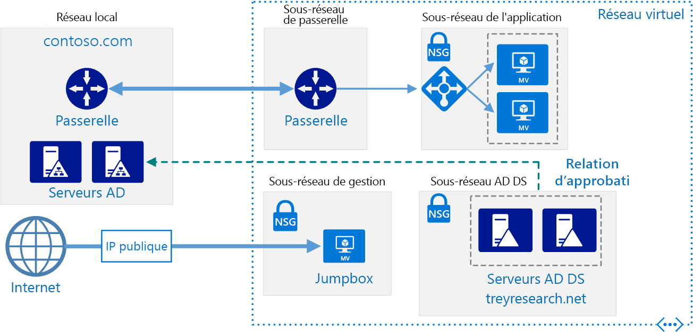
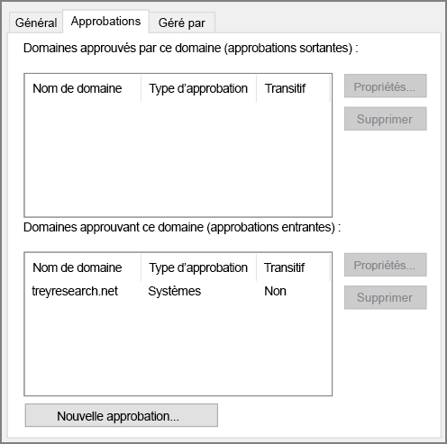

# <a name="create-an-active-directory-domain-services-ad-ds-resource-forest-in-azure"></a><span data-ttu-id="937ac-104">Créer une forêt de ressources Active Directory Domain Services (AD DS) dans Azure</span><span class="sxs-lookup"><span data-stu-id="937ac-104">Create an Active Directory Domain Services (AD DS) resource forest in Azure</span></span>

<span data-ttu-id="937ac-105">Cette architecture de référence montre comment créer, dans Azure, un domaine Active Directory distinct approuvé par les domaines de votre forêt AD locale.</span><span class="sxs-lookup"><span data-stu-id="937ac-105">This reference architecture shows how to create a separate Active Directory domain in Azure that is trusted by domains in your on-premises AD forest.</span></span> <span data-ttu-id="937ac-106">[**Déployez cette solution**](#deploy-the-solution).</span><span class="sxs-lookup"><span data-stu-id="937ac-106">[**Deploy this solution**](#deploy-the-solution).</span></span>



<span data-ttu-id="937ac-108">*Téléchargez un [fichier Visio][visio-download] de cette architecture.*</span><span class="sxs-lookup"><span data-stu-id="937ac-108">*Download a [Visio file][visio-download] of this architecture.*</span></span>

<span data-ttu-id="937ac-109">Active Directory Domain Services (AD DS) stocke des informations d’identité dans une structure hiérarchique.</span><span class="sxs-lookup"><span data-stu-id="937ac-109">Active Directory Domain Services (AD DS) stores identity information in a hierarchical structure.</span></span> <span data-ttu-id="937ac-110">Le nœud supérieur de la structure hiérarchique est appelé « forêt ».</span><span class="sxs-lookup"><span data-stu-id="937ac-110">The top node in the hierarchical structure is known as a forest.</span></span> <span data-ttu-id="937ac-111">Une forêt contient des domaines, qui à leur tour contiennent d’autres types d’objets.</span><span class="sxs-lookup"><span data-stu-id="937ac-111">A forest contains domains, and domains contain other types of objects.</span></span> <span data-ttu-id="937ac-112">Cette architecture de référence crée une forêt AD DS dans Azure avec une relation d’approbation à sens unique sortante avec un domaine local.</span><span class="sxs-lookup"><span data-stu-id="937ac-112">This reference architecture creates an AD DS forest in Azure with a one-way outgoing trust relationship with an on-premises domain.</span></span> <span data-ttu-id="937ac-113">La forêt dans Azure contient un domaine qui n’existe pas localement.</span><span class="sxs-lookup"><span data-stu-id="937ac-113">The forest in Azure contains a domain that does not exist on-premises.</span></span> <span data-ttu-id="937ac-114">En raison de la relation d’approbation, les ouvertures de session effectuées dans les domaines locaux peuvent être approuvées pour l’accès aux ressources dans le domaine Azure distinct.</span><span class="sxs-lookup"><span data-stu-id="937ac-114">Because of the trust relationship, logons made against on-premises domains can be trusted for access to resources in the separate Azure domain.</span></span>

<span data-ttu-id="937ac-115">Parmi les utilisations courantes de cette architecture figurent la conservation d’une séparation de sécurité pour les objets et les identités contenus dans le cloud et la migration de domaines individuels depuis l’environnement local vers le cloud.</span><span class="sxs-lookup"><span data-stu-id="937ac-115">Typical uses for this architecture include maintaining security separation for objects and identities held in the cloud, and migrating individual domains from on-premises to the cloud.</span></span>

<span data-ttu-id="937ac-116">Pour plus d’informations, consultez [Choisir une solution pour intégrer l’environnement Active Directory local à Azure][considerations].</span><span class="sxs-lookup"><span data-stu-id="937ac-116">For additional considerations, see [Choose a solution for integrating on-premises Active Directory with Azure][considerations].</span></span>

## <a name="architecture"></a><span data-ttu-id="937ac-117">Architecture</span><span class="sxs-lookup"><span data-stu-id="937ac-117">Architecture</span></span>

<span data-ttu-id="937ac-118">L’architecture possède les composants suivants :</span><span class="sxs-lookup"><span data-stu-id="937ac-118">The architecture has the following components.</span></span>

- <span data-ttu-id="937ac-119">**Réseau local**.</span><span class="sxs-lookup"><span data-stu-id="937ac-119">**On-premises network**.</span></span> <span data-ttu-id="937ac-120">Le réseau local contient ses propres forêt et domaines Active Directory.</span><span class="sxs-lookup"><span data-stu-id="937ac-120">The on-premises network contains its own Active Directory forest and domains.</span></span>
- <span data-ttu-id="937ac-121">**Serveurs Active Directory**.</span><span class="sxs-lookup"><span data-stu-id="937ac-121">**Active Directory servers**.</span></span> <span data-ttu-id="937ac-122">Il s’agit de contrôleurs de domaine qui implémentent des services de domaine s’exécutant en tant que machines virtuelles dans le cloud.</span><span class="sxs-lookup"><span data-stu-id="937ac-122">These are domain controllers implementing domain services running as VMs in the cloud.</span></span> <span data-ttu-id="937ac-123">Ces serveurs hébergent une forêt qui contient un ou plusieurs domaines, distincts de ceux situés dans l’environnement local.</span><span class="sxs-lookup"><span data-stu-id="937ac-123">These servers host a forest containing one or more domains, separate from those located on-premises.</span></span>
- <span data-ttu-id="937ac-124">**Relation d’approbation à sens unique**.</span><span class="sxs-lookup"><span data-stu-id="937ac-124">**One-way trust relationship**.</span></span> <span data-ttu-id="937ac-125">L’exemple dans le diagramme montre une approbation à sens unique entre le domaine dans Azure et le domaine local.</span><span class="sxs-lookup"><span data-stu-id="937ac-125">The example in the diagram shows a one-way trust from the domain in Azure to the on-premises domain.</span></span> <span data-ttu-id="937ac-126">Cette relation permet aux utilisateurs locaux d’accéder aux ressources du domaine dans Azure, mais pas l’inverse.</span><span class="sxs-lookup"><span data-stu-id="937ac-126">This relationship enables on-premises users to access resources in the domain in Azure, but not the other way around.</span></span> <span data-ttu-id="937ac-127">Il est possible de créer une approbation bidirectionnelle, si les utilisateurs du cloud requièrent également l’accès à des ressources locales.</span><span class="sxs-lookup"><span data-stu-id="937ac-127">It is possible to create a two-way trust if cloud users also require access to on-premises resources.</span></span>
- <span data-ttu-id="937ac-128">**Sous-réseau Active Directory**.</span><span class="sxs-lookup"><span data-stu-id="937ac-128">**Active Directory subnet**.</span></span> <span data-ttu-id="937ac-129">Les serveurs AD DS sont hébergés dans un sous-réseau distinct.</span><span class="sxs-lookup"><span data-stu-id="937ac-129">The AD DS servers are hosted in a separate subnet.</span></span> <span data-ttu-id="937ac-130">Des règles de groupe de sécurité réseau (NSG) protègent les serveurs AD DS et fournissent un pare-feu contre le trafic en provenance de sources inconnues.</span><span class="sxs-lookup"><span data-stu-id="937ac-130">Network security group (NSG) rules protect the AD DS servers and provide a firewall against traffic from unexpected sources.</span></span>
- <span data-ttu-id="937ac-131">**Passerelle Azure**.</span><span class="sxs-lookup"><span data-stu-id="937ac-131">**Azure gateway**.</span></span> <span data-ttu-id="937ac-132">La passerelle Azure fournit une connexion entre le réseau local et le réseau virtuel Azure.</span><span class="sxs-lookup"><span data-stu-id="937ac-132">The Azure gateway provides a connection between the on-premises network and the Azure VNet.</span></span> <span data-ttu-id="937ac-133">Il peut s’agir d’une [connexion VPN][azure-vpn-gateway] ou [d’Azure ExpressRoute][azure-expressroute].</span><span class="sxs-lookup"><span data-stu-id="937ac-133">This can be a [VPN connection][azure-vpn-gateway] or [Azure ExpressRoute][azure-expressroute].</span></span> <span data-ttu-id="937ac-134">Pour plus d’informations, consultez [Implémentation d’une architecture réseau hybride sécurisée dans Azure][implementing-a-secure-hybrid-network-architecture].</span><span class="sxs-lookup"><span data-stu-id="937ac-134">For more information, see [Implementing a secure hybrid network architecture in Azure][implementing-a-secure-hybrid-network-architecture].</span></span>

## <a name="recommendations"></a><span data-ttu-id="937ac-135">Recommandations</span><span class="sxs-lookup"><span data-stu-id="937ac-135">Recommendations</span></span>

<span data-ttu-id="937ac-136">Pour obtenir des recommandations spécifiques sur l’implémentation d’Active Directory dans Azure, consultez les articles suivants :</span><span class="sxs-lookup"><span data-stu-id="937ac-136">For specific recommendations on implementing Active Directory in Azure, see the following articles:</span></span>

- <span data-ttu-id="937ac-137">[Extension d’Active Directory Domain Services (AD DS) à Azure][adds-extend-domain].</span><span class="sxs-lookup"><span data-stu-id="937ac-137">[Extending Active Directory Domain Services (AD DS) to Azure][adds-extend-domain].</span></span>
- <span data-ttu-id="937ac-138">[Recommandations pour déployer Windows Server Active Directory sur des machines virtuelles Azure][ad-azure-guidelines].</span><span class="sxs-lookup"><span data-stu-id="937ac-138">[Guidelines for Deploying Windows Server Active Directory on Azure Virtual Machines][ad-azure-guidelines].</span></span>

### <a name="trust"></a><span data-ttu-id="937ac-139">Trust</span><span class="sxs-lookup"><span data-stu-id="937ac-139">Trust</span></span>

<span data-ttu-id="937ac-140">Les domaines locaux sont contenus dans une forêt différente des domaines dans le cloud.</span><span class="sxs-lookup"><span data-stu-id="937ac-140">The on-premises domains are contained within a different forest from the domains in the cloud.</span></span> <span data-ttu-id="937ac-141">Pour activer l’authentification des utilisateurs locaux dans le cloud, les domaines dans Azure doivent faire confiance au domaine d’ouverture de session dans la forêt locale.</span><span class="sxs-lookup"><span data-stu-id="937ac-141">To enable authentication of on-premises users in the cloud, the domains in Azure must trust the logon domain in the on-premises forest.</span></span> <span data-ttu-id="937ac-142">De même, si le cloud fournit un domaine d’ouverture de session pour les utilisateurs externes, il peut être nécessaire que la forêt locale fasse confiance au domaine du cloud.</span><span class="sxs-lookup"><span data-stu-id="937ac-142">Similarly, if the cloud provides a logon domain for external users, it may be necessary for the on-premises forest to trust the cloud domain.</span></span>

<span data-ttu-id="937ac-143">Vous pouvez établir des approbations au niveau forêt, en [créant des approbations de forêt][creating-forest-trusts], ou au niveau domaine, en [créant des approbations externes][creating-external-trusts].</span><span class="sxs-lookup"><span data-stu-id="937ac-143">You can establish trusts at the forest level by [creating forest trusts][creating-forest-trusts], or at the domain level by [creating external trusts][creating-external-trusts].</span></span> <span data-ttu-id="937ac-144">Une approbation de niveau forêt crée une relation entre tous les domaines dans deux forêts.</span><span class="sxs-lookup"><span data-stu-id="937ac-144">A forest level trust creates a relationship between all domains in two forests.</span></span> <span data-ttu-id="937ac-145">Une approbation de niveau domaine externe crée uniquement une relation entre deux domaines spécifiés.</span><span class="sxs-lookup"><span data-stu-id="937ac-145">An external domain level trust only creates a relationship between two specified domains.</span></span> <span data-ttu-id="937ac-146">Vous devez uniquement créer des approbations de niveau domaine externe entre des domaines dans des forêts différentes.</span><span class="sxs-lookup"><span data-stu-id="937ac-146">You should only create external domain level trusts between domains in different forests.</span></span>

<span data-ttu-id="937ac-147">Les approbations peuvent être unidirectionnelles (à sens unique) ou bidirectionnelles :</span><span class="sxs-lookup"><span data-stu-id="937ac-147">Trusts can be unidirectional (one-way) or bidirectional (two-way):</span></span>

- <span data-ttu-id="937ac-148">Une approbation à sens unique permet aux utilisateurs d’une forêt ou domaine (forêt ou domaine *entrant*) d’accéder aux ressources contenues dans une autre forêt ou domaine (forêt ou domaine *sortant*).</span><span class="sxs-lookup"><span data-stu-id="937ac-148">A one-way trust enables users in one domain or forest (known as the *incoming* domain or forest) to access the resources held in another (the *outgoing* domain or forest).</span></span>
- <span data-ttu-id="937ac-149">Une approbation bidirectionnelle permet aux utilisateurs de l’un des domaines ou forêts d’accéder aux ressources contenues dans l’autre domaine ou forêt.</span><span class="sxs-lookup"><span data-stu-id="937ac-149">A two-way trust enables users in either domain or forest to access resources held in the other.</span></span>

<span data-ttu-id="937ac-150">Le tableau suivant récapitule les configurations d’approbation pour certains scénarios simples :</span><span class="sxs-lookup"><span data-stu-id="937ac-150">The following table summarizes trust configurations for some simple scenarios:</span></span>

| <span data-ttu-id="937ac-151">Scénario</span><span class="sxs-lookup"><span data-stu-id="937ac-151">Scenario</span></span> | <span data-ttu-id="937ac-152">Approbation locale</span><span class="sxs-lookup"><span data-stu-id="937ac-152">On-premises trust</span></span> | <span data-ttu-id="937ac-153">Approbation au niveau du cloud</span><span class="sxs-lookup"><span data-stu-id="937ac-153">Cloud trust</span></span> |
| --- | --- | --- |
| <span data-ttu-id="937ac-154">Les utilisateurs locaux requièrent l’accès aux ressources dans le cloud, mais l’inverse n’est pas vrai.</span><span class="sxs-lookup"><span data-stu-id="937ac-154">On-premises users require access to resources in the cloud, but not vice versa</span></span> |<span data-ttu-id="937ac-155">À sens unique, entrante</span><span class="sxs-lookup"><span data-stu-id="937ac-155">One-way, incoming</span></span> |<span data-ttu-id="937ac-156">À sens unique, sortante</span><span class="sxs-lookup"><span data-stu-id="937ac-156">One-way, outgoing</span></span> |
| <span data-ttu-id="937ac-157">Les utilisateurs dans le cloud requièrent l’accès aux ressources locales, mais l’inverse n’est pas vrai.</span><span class="sxs-lookup"><span data-stu-id="937ac-157">Users in the cloud require access to resources located on-premises, but not vice versa</span></span> |<span data-ttu-id="937ac-158">À sens unique, sortante</span><span class="sxs-lookup"><span data-stu-id="937ac-158">One-way, outgoing</span></span> |<span data-ttu-id="937ac-159">À sens unique, entrante</span><span class="sxs-lookup"><span data-stu-id="937ac-159">One-way, incoming</span></span> |
| <span data-ttu-id="937ac-160">Les utilisateurs dans le cloud et locaux requièrent l’accès aux ressources contenues dans le cloud et locales.</span><span class="sxs-lookup"><span data-stu-id="937ac-160">Users in the cloud and on-premises both requires access to resources held in the cloud and on-premises</span></span> |<span data-ttu-id="937ac-161">Bidirectionnelle, entrante et sortante</span><span class="sxs-lookup"><span data-stu-id="937ac-161">Two-way, incoming and outgoing</span></span> |<span data-ttu-id="937ac-162">Bidirectionnelle, entrante et sortante</span><span class="sxs-lookup"><span data-stu-id="937ac-162">Two-way, incoming and outgoing</span></span> |

## <a name="scalability-considerations"></a><span data-ttu-id="937ac-163">Considérations relatives à l’extensibilité</span><span class="sxs-lookup"><span data-stu-id="937ac-163">Scalability considerations</span></span>

<span data-ttu-id="937ac-164">Active Directory peut évoluer automatiquement pour les contrôleurs de domaine qui font partie du même domaine.</span><span class="sxs-lookup"><span data-stu-id="937ac-164">Active Directory is automatically scalable for domain controllers that are part of the same domain.</span></span> <span data-ttu-id="937ac-165">Les demandes sont distribuées sur tous les contrôleurs d’un domaine.</span><span class="sxs-lookup"><span data-stu-id="937ac-165">Requests are distributed across all controllers within a domain.</span></span> <span data-ttu-id="937ac-166">Vous pouvez ajouter un contrôleur de domaine, qui se synchronise alors automatiquement avec le domaine.</span><span class="sxs-lookup"><span data-stu-id="937ac-166">You can add another domain controller, and it synchronizes automatically with the domain.</span></span> <span data-ttu-id="937ac-167">Ne configurez pas d’équilibreur de charge distinct pour diriger le trafic vers des contrôleurs dans le domaine.</span><span class="sxs-lookup"><span data-stu-id="937ac-167">Do not configure a separate load balancer to direct traffic to controllers within the domain.</span></span> <span data-ttu-id="937ac-168">Vérifiez que tous les contrôleurs de domaine disposent de suffisamment de ressources mémoire et de stockage pour gérer la base de données du domaine.</span><span class="sxs-lookup"><span data-stu-id="937ac-168">Ensure that all domain controllers have sufficient memory and storage resources to handle the domain database.</span></span> <span data-ttu-id="937ac-169">Attribuez la même taille aux machines virtuelles de contrôleur de domaine.</span><span class="sxs-lookup"><span data-stu-id="937ac-169">Make all domain controller VMs the same size.</span></span>

## <a name="availability-considerations"></a><span data-ttu-id="937ac-170">Considérations relatives à la disponibilité</span><span class="sxs-lookup"><span data-stu-id="937ac-170">Availability considerations</span></span>

<span data-ttu-id="937ac-171">Provisionnez au moins deux contrôleurs de domaine par domaine.</span><span class="sxs-lookup"><span data-stu-id="937ac-171">Provision at least two domain controllers for each domain.</span></span> <span data-ttu-id="937ac-172">Cela permet une réplication automatique entre les serveurs.</span><span class="sxs-lookup"><span data-stu-id="937ac-172">This enables automatic replication between servers.</span></span> <span data-ttu-id="937ac-173">Créez un groupe à haute disponibilité pour les machines virtuelles faisant office de serveurs Active Directory chargés de gérer chaque domaine.</span><span class="sxs-lookup"><span data-stu-id="937ac-173">Create an availability set for the VMs acting as Active Directory servers handling each domain.</span></span> <span data-ttu-id="937ac-174">Placez au moins deux serveurs dans ce groupe à haute disponibilité.</span><span class="sxs-lookup"><span data-stu-id="937ac-174">Put at least two servers in this availability set.</span></span>

<span data-ttu-id="937ac-175">Envisagez également de désigner un ou plusieurs serveurs dans chaque domaine en tant que [maîtres d’opérations en attente][standby-operations-masters] en cas d’échec de la connectivité à un serveur agissant en tant que rôle de FSMO (Flexible Single Master Operation).</span><span class="sxs-lookup"><span data-stu-id="937ac-175">Also, consider designating one or more servers in each domain as [standby operations masters][standby-operations-masters] in case connectivity to a server acting as a flexible single master operation (FSMO) role fails.</span></span>

## <a name="manageability-considerations"></a><span data-ttu-id="937ac-176">Considérations relatives à la facilité de gestion</span><span class="sxs-lookup"><span data-stu-id="937ac-176">Manageability considerations</span></span>

<span data-ttu-id="937ac-177">Pour plus d’informations sur les considérations relatives à la gestion et à la surveillance, consultez [Extension d’Active Directory à Azure][adds-extend-domain].</span><span class="sxs-lookup"><span data-stu-id="937ac-177">For information about management and monitoring considerations, see [Extending Active Directory to Azure][adds-extend-domain].</span></span>

<span data-ttu-id="937ac-178">Pour plus d’informations, consultez [Surveillance d’Active Directory][monitoring_ad].</span><span class="sxs-lookup"><span data-stu-id="937ac-178">For additional information, see [Monitoring Active Directory][monitoring_ad].</span></span> <span data-ttu-id="937ac-179">Vous pouvez installer des outils tels que [Microsoft Systems Center][microsoft_systems_center] sur un serveur de surveillance dans le sous-réseau de gestion pour effectuer ces tâches.</span><span class="sxs-lookup"><span data-stu-id="937ac-179">You can install tools such as [Microsoft Systems Center][microsoft_systems_center] on a monitoring server in the management subnet to help perform these tasks.</span></span>

## <a name="security-considerations"></a><span data-ttu-id="937ac-180">Considérations relatives à la sécurité</span><span class="sxs-lookup"><span data-stu-id="937ac-180">Security considerations</span></span>

<span data-ttu-id="937ac-181">Les approbations de niveau forêt sont transitives.</span><span class="sxs-lookup"><span data-stu-id="937ac-181">Forest level trusts are transitive.</span></span> <span data-ttu-id="937ac-182">Si vous établissez une approbation de niveau forêt entre une forêt locale et une forêt dans le cloud, cette approbation est étendue aux autres domaines créés dans l’une ou l’autre des forêts.</span><span class="sxs-lookup"><span data-stu-id="937ac-182">If you establish a forest level trust between an on-premises forest and a forest in the cloud, this trust is extended to other new domains created in either forest.</span></span> <span data-ttu-id="937ac-183">Si vous utilisez des domaines pour fournir une séparation à des fins de sécurité, envisagez de créer des approbations au niveau domaine uniquement.</span><span class="sxs-lookup"><span data-stu-id="937ac-183">If you use domains to provide separation for security purposes, consider creating trusts at the domain level only.</span></span> <span data-ttu-id="937ac-184">Les approbations de niveau domaine sont non transitives.</span><span class="sxs-lookup"><span data-stu-id="937ac-184">Domain level trusts are non-transitive.</span></span>

<span data-ttu-id="937ac-185">Pour connaître les considérations relatives à la sécurité propres à Active Directory, consultez la section sur les considérations relatives à la sécurité dans [Extension d’Active Directory à Azure][adds-extend-domain].</span><span class="sxs-lookup"><span data-stu-id="937ac-185">For Active Directory-specific security considerations, see the security considerations section in [Extending Active Directory to Azure][adds-extend-domain].</span></span>

## <a name="deploy-the-solution"></a><span data-ttu-id="937ac-186">Déployer la solution</span><span class="sxs-lookup"><span data-stu-id="937ac-186">Deploy the solution</span></span>

<span data-ttu-id="937ac-187">Un déploiement pour cette architecture est disponible sur [GitHub][github].</span><span class="sxs-lookup"><span data-stu-id="937ac-187">A deployment for this architecture is available on [GitHub][github].</span></span> <span data-ttu-id="937ac-188">Remarque : le déploiement entier peut prendre jusqu’à deux heures, en incluant la création de la passerelle VPN et l’exécution des scripts qui configurent AD DS.</span><span class="sxs-lookup"><span data-stu-id="937ac-188">Note that the entire deployment can take up to two hours, which includes creating the VPN gateway and running the scripts that configure AD DS.</span></span>

### <a name="prerequisites"></a><span data-ttu-id="937ac-189">Prérequis</span><span class="sxs-lookup"><span data-stu-id="937ac-189">Prerequisites</span></span>

1. <span data-ttu-id="937ac-190">Clonez, dupliquez ou téléchargez le fichier zip pour le [dépôt GitHub](https://github.com/mspnp/identity-reference-architectures).</span><span class="sxs-lookup"><span data-stu-id="937ac-190">Clone, fork, or download the zip file for the [GitHub repository](https://github.com/mspnp/identity-reference-architectures).</span></span>

2. <span data-ttu-id="937ac-191">Installez [Azure CLI 2.0](/cli/azure/install-azure-cli?view=azure-cli-latest).</span><span class="sxs-lookup"><span data-stu-id="937ac-191">Install [Azure CLI 2.0](/cli/azure/install-azure-cli?view=azure-cli-latest).</span></span>

3. <span data-ttu-id="937ac-192">Installez le package npm des [modules Azure](https://github.com/mspnp/template-building-blocks/wiki/Install-Azure-Building-Blocks).</span><span class="sxs-lookup"><span data-stu-id="937ac-192">Install the [Azure building blocks](https://github.com/mspnp/template-building-blocks/wiki/Install-Azure-Building-Blocks) npm package.</span></span>

   ```bash
   npm install -g @mspnp/azure-building-blocks
   ```

4. <span data-ttu-id="937ac-193">À partir d’une invite de commandes, d’une invite bash ou de l’invite de commandes PowerShell, connectez-vous à votre compte Azure, comme suit :</span><span class="sxs-lookup"><span data-stu-id="937ac-193">From a command prompt, bash prompt, or PowerShell prompt, sign into your Azure account as follows:</span></span>

   ```bash
   az login
   ```

### <a name="deploy-the-simulated-on-premises-datacenter"></a><span data-ttu-id="937ac-194">Déployer le centre de données local simulé</span><span class="sxs-lookup"><span data-stu-id="937ac-194">Deploy the simulated on-premises datacenter</span></span>

1. <span data-ttu-id="937ac-195">Accédez au dossier `identity/adds-forest` du dépôt GitHub.</span><span class="sxs-lookup"><span data-stu-id="937ac-195">Navigate to the `identity/adds-forest` folder of the GitHub repository.</span></span>

2. <span data-ttu-id="937ac-196">Ouvrez le fichier `onprem.json` .</span><span class="sxs-lookup"><span data-stu-id="937ac-196">Open the `onprem.json` file.</span></span> <span data-ttu-id="937ac-197">Cherchez les instances de `adminPassword` et `Password` et ajoutez les valeurs pour les mots de passe.</span><span class="sxs-lookup"><span data-stu-id="937ac-197">Search for instances of `adminPassword` and `Password` and add values for the passwords.</span></span>

3. <span data-ttu-id="937ac-198">Exécutez la commande suivante et attendez que le déploiement se termine :</span><span class="sxs-lookup"><span data-stu-id="937ac-198">Run the following command and wait for the deployment to finish:</span></span>

    ```bash
    azbb -s <subscription_id> -g <resource group> -l <location> -p onprem.json --deploy
    ```

### <a name="deploy-the-azure-vnet"></a><span data-ttu-id="937ac-199">Déployer le réseau virtuel Azure</span><span class="sxs-lookup"><span data-stu-id="937ac-199">Deploy the Azure VNet</span></span>

1. <span data-ttu-id="937ac-200">Ouvrez le fichier `azure.json` .</span><span class="sxs-lookup"><span data-stu-id="937ac-200">Open the `azure.json` file.</span></span> <span data-ttu-id="937ac-201">Cherchez les instances de `adminPassword` et `Password` et ajoutez les valeurs pour les mots de passe.</span><span class="sxs-lookup"><span data-stu-id="937ac-201">Search for instances of `adminPassword` and `Password` and add values for the passwords.</span></span>

2. <span data-ttu-id="937ac-202">Dans le même fichier, recherchez les instances de `sharedKey` et entrez les clés partagées pour la connexion VPN.</span><span class="sxs-lookup"><span data-stu-id="937ac-202">In the same file, search for instances of `sharedKey` and enter shared keys for the VPN connection.</span></span>

    ```json
    "sharedKey": "",
    ```

3. <span data-ttu-id="937ac-203">Exécutez la commande suivante et attendez que le déploiement se termine.</span><span class="sxs-lookup"><span data-stu-id="937ac-203">Run the following command and wait for the deployment to finish.</span></span>

    ```bash
    azbb -s <subscription_id> -g <resource group> -l <location> -p azure.json --deploy
    ```

   <span data-ttu-id="937ac-204">Déployez dans le même groupe de ressource que le réseau virtuel local.</span><span class="sxs-lookup"><span data-stu-id="937ac-204">Deploy to the same resource group as the on-premises VNet.</span></span>

### <a name="test-the-ad-trust-relation"></a><span data-ttu-id="937ac-205">Tester la relation d’approbation AD</span><span class="sxs-lookup"><span data-stu-id="937ac-205">Test the AD trust relation</span></span>

1. <span data-ttu-id="937ac-206">Utilisez le portail Azure, accédez au groupe de ressources que vous avez créé.</span><span class="sxs-lookup"><span data-stu-id="937ac-206">Use the Azure portal, navigate to the resource group that you created.</span></span>

2. <span data-ttu-id="937ac-207">Utilisez le portail Azure pour trouver la machine virtuelle appelée `ra-adt-mgmt-vm1`.</span><span class="sxs-lookup"><span data-stu-id="937ac-207">Use the Azure portal to find the VM named `ra-adt-mgmt-vm1`.</span></span>

3. <span data-ttu-id="937ac-208">Cliquez sur `Connect` pour ouvrir une session Bureau à distance vers la machine virtuelle.</span><span class="sxs-lookup"><span data-stu-id="937ac-208">Click `Connect` to open a remote desktop session to the VM.</span></span> <span data-ttu-id="937ac-209">Le nom d’utilisateur est `contoso\testuser`, et le mot de passe est celui que vous avez spécifié dans le fichier de paramètre `onprem.json`.</span><span class="sxs-lookup"><span data-stu-id="937ac-209">The username is `contoso\testuser`, and the password is the one that you specified in the `onprem.json` parameter file.</span></span>

4. <span data-ttu-id="937ac-210">Une fois dans votre session Bureau à distance, ouvrez une autre session Bureau à distance vers 192.168.0.4, qui correspond à l’adresse IP de la machine virtuelle appelée `ra-adtrust-onpremise-ad-vm1`.</span><span class="sxs-lookup"><span data-stu-id="937ac-210">From inside your remote desktop session, open another remote desktop session to 192.168.0.4, which is the IP address of the VM named `ra-adtrust-onpremise-ad-vm1`.</span></span> <span data-ttu-id="937ac-211">Le nom d’utilisateur est `contoso\testuser`, et le mot de passe est celui que vous avez spécifié dans le fichier de paramètre `azure.json`.</span><span class="sxs-lookup"><span data-stu-id="937ac-211">The username is `contoso\testuser`, and the password is the one that you specified in the `azure.json` parameter file.</span></span>

5. <span data-ttu-id="937ac-212">Une fois dans la session Bureau à distance pour `ra-adtrust-onpremise-ad-vm1`, allez dans **Gestionnaire de serveur** et cliquez sur **Outils** > **Domaines Active Directory et approbations**.</span><span class="sxs-lookup"><span data-stu-id="937ac-212">From inside the remote desktop session for `ra-adtrust-onpremise-ad-vm1`, go to **Server Manager** and click **Tools** > **Active Directory Domains and Trusts**.</span></span>

6. <span data-ttu-id="937ac-213">Dans le volet gauche, faites un clic droit sur contoso.com, puis sélectionnez **Propriétés**.</span><span class="sxs-lookup"><span data-stu-id="937ac-213">In the left pane, right-click on the contoso.com and select **Properties**.</span></span>

7. <span data-ttu-id="937ac-214">Cliquez sur l’onglet **Approbation**. Vous devez voir treyresearch.net répertorié comme une approbation entrante.</span><span class="sxs-lookup"><span data-stu-id="937ac-214">Click the **Trusts** tab. You should see treyresearch.net listed as an incoming trust.</span></span>



## <a name="next-steps"></a><span data-ttu-id="937ac-216">Étapes suivantes</span><span class="sxs-lookup"><span data-stu-id="937ac-216">Next steps</span></span>

- <span data-ttu-id="937ac-217">Découvrez les bonnes pratiques pour [étendre votre domaine AD DS local à Azure][adds-extend-domain].</span><span class="sxs-lookup"><span data-stu-id="937ac-217">Learn the best practices for [extending your on-premises AD DS domain to Azure][adds-extend-domain]</span></span>
- <span data-ttu-id="937ac-218">Découvrez les bonnes pratiques pour [créer une infrastructure AD FS][adfs] dans Azure.</span><span class="sxs-lookup"><span data-stu-id="937ac-218">Learn the best practices for [creating an AD FS infrastructure][adfs] in Azure.</span></span>

<!-- links -->
[adds-extend-domain]: adds-extend-domain.md
[adfs]: adfs.md
[azure-cli-2]: /azure/install-azure-cli
[azbb]: https://github.com/mspnp/template-building-blocks/wiki/Install-Azure-Building-Blocks

[implementing-a-secure-hybrid-network-architecture]: ../dmz/secure-vnet-hybrid.md
[implementing-a-secure-hybrid-network-architecture-with-internet-access]: ../dmz/secure-vnet-dmz.md

[running-VMs-for-an-N-tier-architecture-on-Azure]: ../virtual-machines-windows/n-tier.md

[ad-azure-guidelines]: https://msdn.microsoft.com/library/azure/jj156090.aspx
[azure-expressroute]: /azure/expressroute/expressroute-introduction
[azure-vpn-gateway]: /azure/vpn-gateway/vpn-gateway-about-vpngateways
[considerations]: ./considerations.md
[creating-external-trusts]: https://technet.microsoft.com/library/cc816837(v=ws.10).aspx
[creating-forest-trusts]: https://technet.microsoft.com/library/cc816810(v=ws.10).aspx
[github]: https://github.com/mspnp/identity-reference-architectures/tree/master/adds-forest
[incoming-trust]: https://raw.githubusercontent.com/mspnp/identity-reference-architectures/master/adds-forest/extensions/incoming-trust.ps1
[microsoft_systems_center]: https://microsoft.com/cloud-platform/system-center
[monitoring_ad]: https://msdn.microsoft.com/library/bb727046.aspx
[resource-manager-overview]: /azure/azure-resource-manager/resource-group-overview
[solution-script]: https://raw.githubusercontent.com/mspnp/identity-reference-architectures/master/adds-forest/Deploy-ReferenceArchitecture.ps1
[standby-operations-masters]: https://technet.microsoft.com/library/cc794737(v=ws.10).aspx
[outgoing-trust]: https://raw.githubusercontent.com/mspnp/identity-reference-architectures/master/adds-forest/extensions/outgoing-trust.ps1
[verify-a-trust]: https://technet.microsoft.com/library/cc753821.aspx
[visio-download]: https://archcenter.blob.core.windows.net/cdn/identity-architectures.vsdx
