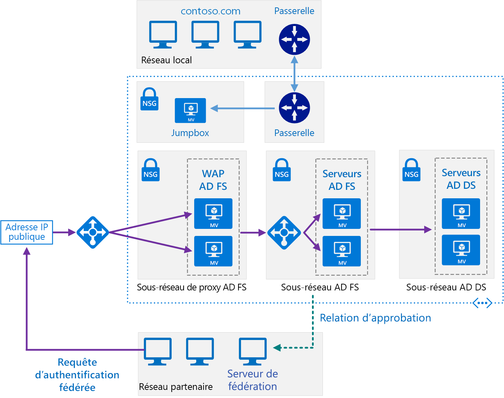

# <a name="extend-active-directory-federation-services-ad-fs-to-azure"></a><span data-ttu-id="b7969-103">Étendre les services de fédération Active Directory (AD FS) dans Azure</span><span class="sxs-lookup"><span data-stu-id="b7969-103">Extend Active Directory Federation Services (AD FS) to Azure</span></span>

<span data-ttu-id="b7969-104">Cette architecture de référence implémente un réseau hybride sécurisé qui étend votre réseau local dans Azure et utilise [les services de fédération Active Directory (AD FS)][active-directory-federation-services] pour procéder à une authentification et une autorisation fédérées pour les composants en cours d’exécution dans Azure.</span><span class="sxs-lookup"><span data-stu-id="b7969-104">This reference architecture implements a secure hybrid network that extends your on-premises network to Azure and uses [Active Directory Federation Services (AD FS)][active-directory-federation-services] to perform federated authentication and authorization for components running in Azure.</span></span> <span data-ttu-id="b7969-105">[**Déployez cette solution**](#deploy-the-solution).</span><span class="sxs-lookup"><span data-stu-id="b7969-105">[**Deploy this solution**](#deploy-the-solution).</span></span>



<span data-ttu-id="b7969-107">*Téléchargez un [fichier Visio][visio-download] de cette architecture.*</span><span class="sxs-lookup"><span data-stu-id="b7969-107">*Download a [Visio file][visio-download] of this architecture.*</span></span>

<span data-ttu-id="b7969-108">AD FS peut être hébergé localement, mais si votre application est une application hybride dont certaines parties sont implémentées dans Azure, il peut être plus efficace de répliquer AD FS dans le cloud.</span><span class="sxs-lookup"><span data-stu-id="b7969-108">AD FS can be hosted on-premises, but if your application is a hybrid in which some parts are implemented in Azure, it may be more efficient to replicate AD FS in the cloud.</span></span>

<span data-ttu-id="b7969-109">Le schéma présente les scénarios suivants :</span><span class="sxs-lookup"><span data-stu-id="b7969-109">The diagram shows the following scenarios:</span></span>

- <span data-ttu-id="b7969-110">Le code d’application d’une organisation partenaire accède à une application web hébergée au sein de votre réseau virtuel Azure.</span><span class="sxs-lookup"><span data-stu-id="b7969-110">Application code from a partner organization accesses a web application hosted inside your Azure VNet.</span></span>
- <span data-ttu-id="b7969-111">Un utilisateur externe enregistré dont les informations d’identification sont stockées dans Active Directory Domain Services (DS) accède à une application web hébergée au sein de votre réseau virtuel Azure.</span><span class="sxs-lookup"><span data-stu-id="b7969-111">An external, registered user with credentials stored inside Active Directory Domain Services (DS) accesses a web application hosted inside your Azure VNet.</span></span>
- <span data-ttu-id="b7969-112">Un utilisateur connecté à votre réseau virtuel à l’aide d’un appareil autorisé exécute une application web hébergée au sein de votre réseau virtuel Azure.</span><span class="sxs-lookup"><span data-stu-id="b7969-112">A user connected to your VNet using an authorized device executes a web application hosted inside your Azure VNet.</span></span>

<span data-ttu-id="b7969-113">Utilisations courantes de cette architecture :</span><span class="sxs-lookup"><span data-stu-id="b7969-113">Typical uses for this architecture include:</span></span>

- <span data-ttu-id="b7969-114">Les applications hybrides où les charges de travail s’exécutent en partie en local et dans Azure.</span><span class="sxs-lookup"><span data-stu-id="b7969-114">Hybrid applications where workloads run partly on-premises and partly in Azure.</span></span>
- <span data-ttu-id="b7969-115">Les solutions qui utilisent l’autorisation fédérée pour exposer les applications web aux organisations partenaires.</span><span class="sxs-lookup"><span data-stu-id="b7969-115">Solutions that use federated authorization to expose web applications to partner organizations.</span></span>
- <span data-ttu-id="b7969-116">Les systèmes accessibles depuis des navigateurs web s’exécutant en dehors du pare-feu de l’organisation.</span><span class="sxs-lookup"><span data-stu-id="b7969-116">Systems that support access from web browsers running outside of the organizational firewall.</span></span>
- <span data-ttu-id="b7969-117">Les systèmes qui permettent aux utilisateurs d’accéder aux applications web en se connectant à partir d’appareils externes autorisés tels que des ordinateurs distants, des ordinateurs portables et d’autres appareils mobiles.</span><span class="sxs-lookup"><span data-stu-id="b7969-117">Systems that enable users to access to web applications by connecting from authorized external devices such as remote computers, notebooks, and other mobile devices.</span></span>

<span data-ttu-id="b7969-118">Cette architecture de référence se concentre sur la *fédération passive* dans laquelle les serveurs de fédération décident comment et quand authentifier un utilisateur.</span><span class="sxs-lookup"><span data-stu-id="b7969-118">This reference architecture focuses on *passive federation*, in which the federation servers decide how and when to authenticate a user.</span></span> <span data-ttu-id="b7969-119">L’utilisateur fournit des informations de connexion au démarrage de l’application.</span><span class="sxs-lookup"><span data-stu-id="b7969-119">The user provides sign in information when the application is started.</span></span> <span data-ttu-id="b7969-120">Ce mécanisme est le plus couramment utilisé par les navigateurs web et implique un protocole qui redirige le navigateur vers un site sur lequel l’utilisateur s’authentifie.</span><span class="sxs-lookup"><span data-stu-id="b7969-120">This mechanism is most commonly used by web browsers and involves a protocol that redirects the browser to a site where the user authenticates.</span></span> <span data-ttu-id="b7969-121">AD FS prend également en charge la *fédération active*, où une application est chargée de fournir des informations d’identification sans intervention supplémentaire de l’utilisateur, mais ce scénario n’est pas couvert par cette architecture.</span><span class="sxs-lookup"><span data-stu-id="b7969-121">AD FS also supports *active federation*, where an application takes on responsibility for supplying credentials without further user interaction, but that scenario is outside the scope of this architecture.</span></span>

<span data-ttu-id="b7969-122">Pour plus d’informations, consultez [Choisir une solution pour intégrer l’environnement Active Directory local à Azure][considerations].</span><span class="sxs-lookup"><span data-stu-id="b7969-122">For additional considerations, see [Choose a solution for integrating on-premises Active Directory with Azure][considerations].</span></span>

## <a name="architecture"></a><span data-ttu-id="b7969-123">Architecture</span><span class="sxs-lookup"><span data-stu-id="b7969-123">Architecture</span></span>

<span data-ttu-id="b7969-124">Cette architecture étend l’implémentation décrite dans l’article [Extending AD DS to Azure][extending-ad-to-azure] (Étendre AD DS dans Azure).</span><span class="sxs-lookup"><span data-stu-id="b7969-124">This architecture extends the implementation described in [Extending AD DS to Azure][extending-ad-to-azure].</span></span> <span data-ttu-id="b7969-125">Elle contient les éléments suivants.</span><span class="sxs-lookup"><span data-stu-id="b7969-125">It contains the followign components.</span></span>

- <span data-ttu-id="b7969-126">**Sous-réseau AD DS**.</span><span class="sxs-lookup"><span data-stu-id="b7969-126">**AD DS subnet**.</span></span> <span data-ttu-id="b7969-127">Les serveurs AD DS sont contenus dans leur propre sous-réseau avec des règles de groupe de sécurité réseau agissant comme un pare-feu.</span><span class="sxs-lookup"><span data-stu-id="b7969-127">The AD DS servers are contained in their own subnet with network security group (NSG) rules acting as a firewall.</span></span>

- <span data-ttu-id="b7969-128">**Serveurs AD DS**.</span><span class="sxs-lookup"><span data-stu-id="b7969-128">**AD DS servers**.</span></span> <span data-ttu-id="b7969-129">Des contrôleurs de domaine s’exécutant en tant que machines virtuelles dans Azure.</span><span class="sxs-lookup"><span data-stu-id="b7969-129">Domain controllers running as VMs in Azure.</span></span> <span data-ttu-id="b7969-130">Ces serveurs fournissent l’authentification des identités locales au sein du domaine.</span><span class="sxs-lookup"><span data-stu-id="b7969-130">These servers provide authentication of local identities within the domain.</span></span>

- <span data-ttu-id="b7969-131">**Sous-réseau AD FS**.</span><span class="sxs-lookup"><span data-stu-id="b7969-131">**AD FS subnet**.</span></span> <span data-ttu-id="b7969-132">Les serveurs AD FS se trouvent dans leur propre sous-réseau avec des règles de groupe de sécurité réseau agissant comme un pare-feu.</span><span class="sxs-lookup"><span data-stu-id="b7969-132">The AD FS servers are located within their own subnet with NSG rules acting as a firewall.</span></span>

- <span data-ttu-id="b7969-133">**Serveurs AD FS**.</span><span class="sxs-lookup"><span data-stu-id="b7969-133">**AD FS servers**.</span></span> <span data-ttu-id="b7969-134">Les serveurs AD FS fournissent l’authentification et l’autorisation fédérées.</span><span class="sxs-lookup"><span data-stu-id="b7969-134">The AD FS servers provide federated authorization and authentication.</span></span> <span data-ttu-id="b7969-135">Dans cette architecture, ils effectuent les tâches suivantes :</span><span class="sxs-lookup"><span data-stu-id="b7969-135">In this architecture, they perform the following tasks:</span></span>

  - <span data-ttu-id="b7969-136">Réception des jetons de sécurité contenant les revendications d’un serveur de fédération partenaire pour le compte d’un utilisateur partenaire.</span><span class="sxs-lookup"><span data-stu-id="b7969-136">Receiving security tokens containing claims made by a partner federation server on behalf of a partner user.</span></span> <span data-ttu-id="b7969-137">AD FS vérifie que les jetons sont valides avant de transmettre les revendications à l’application web s’exécutant dans Azure pour autoriser les demandes.</span><span class="sxs-lookup"><span data-stu-id="b7969-137">AD FS verifies that the tokens are valid before passing the claims to the web application running in Azure to authorize requests.</span></span>

    <span data-ttu-id="b7969-138">L’application s’exécutant dans Azure est la *partie de confiance*.</span><span class="sxs-lookup"><span data-stu-id="b7969-138">The application running in Azure is the *relying party*.</span></span> <span data-ttu-id="b7969-139">Le serveur de fédération partenaire doit émettre les revendications qui sont comprises par l’application web.</span><span class="sxs-lookup"><span data-stu-id="b7969-139">The partner federation server must issue claims that are understood by the web application.</span></span> <span data-ttu-id="b7969-140">Les serveurs de fédération partenaires sont appelés *partenaires de compte*, car ils envoient des demandes d’accès pour le compte de comptes authentifiés dans l’organisation partenaire.</span><span class="sxs-lookup"><span data-stu-id="b7969-140">The partner federation servers are referred to as *account partners*, because they submit access requests on behalf of authenticated accounts in the partner organization.</span></span> <span data-ttu-id="b7969-141">Les serveurs AD FS sont appelés *partenaires de ressource*, car ils fournissent l’accès aux ressources (l’application web).</span><span class="sxs-lookup"><span data-stu-id="b7969-141">The AD FS servers are called *resource partners* because they provide access to resources (the web application).</span></span>

  - <span data-ttu-id="b7969-142">Authentification et autorisation des requêtes entrantes émises par des utilisateurs externes exécutant un navigateur web ou un appareil qui a besoin d’accéder aux applications web, à l’aide des services AD DS et du [service Active Directory Device Registration][ADDRS].</span><span class="sxs-lookup"><span data-stu-id="b7969-142">Authenticating and authorizing incoming requests from external users running a web browser or device that needs access to web applications, by using AD DS and the [Active Directory Device Registration Service][ADDRS].</span></span>

  <span data-ttu-id="b7969-143">Les serveurs AD FS sont configurés en tant que batterie de serveurs accessible via un équilibreur de charge Azure.</span><span class="sxs-lookup"><span data-stu-id="b7969-143">The AD FS servers are configured as a farm accessed through an Azure load balancer.</span></span> <span data-ttu-id="b7969-144">Cette implémentation améliore la disponibilité et l’extensibilité.</span><span class="sxs-lookup"><span data-stu-id="b7969-144">This implementation improves availability and scalability.</span></span> <span data-ttu-id="b7969-145">Les serveurs AD FS ne sont pas exposés directement à Internet.</span><span class="sxs-lookup"><span data-stu-id="b7969-145">The AD FS servers are not exposed directly to the Internet.</span></span> <span data-ttu-id="b7969-146">Tout le trafic Internet est filtré à travers les serveurs proxy d’application web AD FS et une zone DMZ (également appelée réseau de périmètre).</span><span class="sxs-lookup"><span data-stu-id="b7969-146">All Internet traffic is filtered through AD FS web application proxy servers and a DMZ (also referred to as a perimeter network).</span></span>

  <span data-ttu-id="b7969-147">Pour plus d’informations sur le fonctionnement des services AD FS, consultez l’article [Vue d’ensemble des services AD FS][active-directory-federation-services-overview].</span><span class="sxs-lookup"><span data-stu-id="b7969-147">For more information about how AD FS works, see [Active Directory Federation Services Overview][active-directory-federation-services-overview].</span></span> <span data-ttu-id="b7969-148">De plus, l’article [Déploiement des services AD FS dans Azure][adfs-intro] contient une présentation détaillée de la procédure d’implémentation.</span><span class="sxs-lookup"><span data-stu-id="b7969-148">Also, the article [AD FS deployment in Azure][adfs-intro] contains a detailed step-by-step introduction to implementation.</span></span>

- <span data-ttu-id="b7969-149">**Sous-réseau de proxy AD FS**.</span><span class="sxs-lookup"><span data-stu-id="b7969-149">**AD FS proxy subnet**.</span></span> <span data-ttu-id="b7969-150">Les serveurs proxy AD FS peuvent être contenus dans leur propre sous-réseau, avec des règles de groupe de sécurité réseau assurant leur protection.</span><span class="sxs-lookup"><span data-stu-id="b7969-150">The AD FS proxy servers can be contained within their own subnet, with NSG rules providing protection.</span></span> <span data-ttu-id="b7969-151">Les serveurs localisés dans ce sous-réseau sont exposés à Internet via un ensemble d’appliances réseau virtuelles qui fournissent un pare-feu entre votre réseau virtuel Azure et Internet.</span><span class="sxs-lookup"><span data-stu-id="b7969-151">The servers in this subnet are exposed to the Internet through a set of network virtual appliances that provide a firewall between your Azure virtual network and the Internet.</span></span>

- <span data-ttu-id="b7969-152">**Serveurs proxy d’application web (WAP) AD FS**.</span><span class="sxs-lookup"><span data-stu-id="b7969-152">**AD FS web application proxy (WAP) servers**.</span></span> <span data-ttu-id="b7969-153">Ces machines virtuelles agissent comme des serveurs AD FS pour les demandes entrantes émises par des appareils externes et des organisations partenaires.</span><span class="sxs-lookup"><span data-stu-id="b7969-153">These VMs act as AD FS servers for incoming requests from partner organizations and external devices.</span></span> <span data-ttu-id="b7969-154">Les serveurs proxy d’application web agissent comme un filtre pour protéger les serveurs AD FS d’un accès direct à partir d’Internet.</span><span class="sxs-lookup"><span data-stu-id="b7969-154">The WAP servers act as a filter, shielding the AD FS servers from direct access from the Internet.</span></span> <span data-ttu-id="b7969-155">Comme avec les serveurs AD FS, le fait de déployer les serveurs proxy d’application web dans une batterie de serveurs avec équilibrage de charge vous offre une meilleure disponibilité et une plus grande extensibilité qu’en déployant une collection de serveurs autonomes.</span><span class="sxs-lookup"><span data-stu-id="b7969-155">As with the AD FS servers, deploying the WAP servers in a farm with load balancing gives you greater availability and scalability than deploying a collection of stand-alone servers.</span></span>

  > [!NOTE]
  > <span data-ttu-id="b7969-156">Pour plus d’informations sur l’installation des serveurs proxy d’application web, consultez l’article [Installer et configurer le serveur proxy d’application web][install_and_configure_the_web_application_proxy_server]</span><span class="sxs-lookup"><span data-stu-id="b7969-156">For detailed information about installing WAP servers, see [Install and Configure the Web Application Proxy Server][install_and_configure_the_web_application_proxy_server]</span></span>
  >

- <span data-ttu-id="b7969-157">**Organisation partenaire**.</span><span class="sxs-lookup"><span data-stu-id="b7969-157">**Partner organization**.</span></span> <span data-ttu-id="b7969-158">Une organisation partenaire exécutant une application web qui demande l’accès à une application web s’exécutant dans Azure.</span><span class="sxs-lookup"><span data-stu-id="b7969-158">A partner organization running a web application that requests access to a web application running in Azure.</span></span> <span data-ttu-id="b7969-159">Le serveur de fédération au niveau de l’organisation partenaire authentifie les requêtes localement et envoie les jetons de sécurité contenant les revendications aux services AD FS s’exécutant dans Azure.</span><span class="sxs-lookup"><span data-stu-id="b7969-159">The federation server at the partner organization authenticates requests locally, and submits security tokens containing claims to AD FS running in Azure.</span></span> <span data-ttu-id="b7969-160">Dans Azure, AD FS valide les jetons de sécurité et, le cas échéant, transmet les revendications à l’application web s’exécutant dans Azure pour autoriser les jetons valides.</span><span class="sxs-lookup"><span data-stu-id="b7969-160">AD FS in Azure validates the security tokens, and if valid can pass the claims to the web application running in Azure to authorize them.</span></span>

  > [!NOTE]
  > <span data-ttu-id="b7969-161">Vous pouvez également configurer un tunnel VPN à l’aide de la passerelle Azure pour fournir un accès direct à AD FS pour les partenaires de confiance.</span><span class="sxs-lookup"><span data-stu-id="b7969-161">You can also configure a VPN tunnel using Azure gateway to provide direct access to AD FS for trusted partners.</span></span> <span data-ttu-id="b7969-162">Les demandes émises par ces partenaires ne passent pas par les serveurs proxy d’application web.</span><span class="sxs-lookup"><span data-stu-id="b7969-162">Requests received from these partners do not pass through the WAP servers.</span></span>
  >

## <a name="recommendations"></a><span data-ttu-id="b7969-163">Recommandations</span><span class="sxs-lookup"><span data-stu-id="b7969-163">Recommendations</span></span>

<span data-ttu-id="b7969-164">Les recommandations suivantes s’appliquent à la plupart des scénarios.</span><span class="sxs-lookup"><span data-stu-id="b7969-164">The following recommendations apply for most scenarios.</span></span> <span data-ttu-id="b7969-165">Suivez ces recommandations, sauf si vous avez un besoin spécifique qui vous oblige à les ignorer.</span><span class="sxs-lookup"><span data-stu-id="b7969-165">Follow these recommendations unless you have a specific requirement that overrides them.</span></span>

### <a name="networking-recommendations"></a><span data-ttu-id="b7969-166">Recommandations pour la mise en réseau</span><span class="sxs-lookup"><span data-stu-id="b7969-166">Networking recommendations</span></span>

<span data-ttu-id="b7969-167">Configurez l’interface réseau pour chacune des machines virtuelles hébergeant des serveurs AD FS et WAP avec des adresses IP privées statiques.</span><span class="sxs-lookup"><span data-stu-id="b7969-167">Configure the network interface for each of the VMs hosting AD FS and WAP servers with static private IP addresses.</span></span>

<span data-ttu-id="b7969-168">N’attribuez pas d’adresses IP publiques aux machines virtuelles AD FS.</span><span class="sxs-lookup"><span data-stu-id="b7969-168">Do not give the AD FS VMs public IP addresses.</span></span> <span data-ttu-id="b7969-169">Pour plus d’informations, consultez la section [Considérations relatives à la sécurité](#security-considerations).</span><span class="sxs-lookup"><span data-stu-id="b7969-169">For more information, see the [Security considerations](#security-considerations) section.</span></span>

<span data-ttu-id="b7969-170">Définissez l’adresse IP des serveurs de nom de domaine (DNS) par défaut et secondaires pour les interfaces réseau de chaque machine virtuelle AD FS et WAP de manière à référencer les machines virtuelles Active Directory DS.</span><span class="sxs-lookup"><span data-stu-id="b7969-170">Set the IP address of the preferred and secondary domain name service (DNS) servers for the network interfaces for each AD FS and WAP VM to reference the Active Directory DS VMs.</span></span> <span data-ttu-id="b7969-171">Les machines virtuelles Active Directory DS doivent exécuter un serveur DNS.</span><span class="sxs-lookup"><span data-stu-id="b7969-171">The Active Directory DS VMs should be running DNS.</span></span> <span data-ttu-id="b7969-172">Cette étape est nécessaire pour que chaque machine virtuelle puisse rejoindre le domaine.</span><span class="sxs-lookup"><span data-stu-id="b7969-172">This step is necessary to enable each VM to join the domain.</span></span>

### <a name="ad-fs-installation"></a><span data-ttu-id="b7969-173">Installation des services AD FS</span><span class="sxs-lookup"><span data-stu-id="b7969-173">AD FS installation</span></span>

<span data-ttu-id="b7969-174">L’article [Deploying a Federation Server Farm][Deploying_a_federation_server_farm] (Déploiement d’une batterie de serveurs de fédération) fournit des instructions détaillées pour l’installation et la configuration des services AD FS.</span><span class="sxs-lookup"><span data-stu-id="b7969-174">The article [Deploying a Federation Server Farm][Deploying_a_federation_server_farm] provides detailed instructions for installing and configuring AD FS.</span></span> <span data-ttu-id="b7969-175">Avant de configurer le premier serveur AD FS dans la batterie de serveurs, effectuez les tâches suivantes :</span><span class="sxs-lookup"><span data-stu-id="b7969-175">Perform the following tasks before configuring the first AD FS server in the farm:</span></span>

1. <span data-ttu-id="b7969-176">Obtenez un certificat approuvé publiquement pour l’authentification du serveur.</span><span class="sxs-lookup"><span data-stu-id="b7969-176">Obtain a publicly trusted certificate for performing server authentication.</span></span> <span data-ttu-id="b7969-177">Le *nom de l’objet* doit contenir le nom utilisé par les clients pour accéder au service de fédération.</span><span class="sxs-lookup"><span data-stu-id="b7969-177">The *subject name* must contain the name clients use to access the federation service.</span></span> <span data-ttu-id="b7969-178">Cela peut être le nom DNS enregistré pour l’équilibreur de charge, par exemple, *adfs.contoso.com* (pour des raisons de sécurité, évitez d’utiliser des noms comprenant des caractères génériques tels que \**.contoso.com*).</span><span class="sxs-lookup"><span data-stu-id="b7969-178">This can be the DNS name registered for the load balancer, for example, *adfs.contoso.com* (avoid using wildcard names such as \**.contoso.com*, for security reasons).</span></span> <span data-ttu-id="b7969-179">Utilisez le même certificat sur toutes les machines virtuelles du serveur AD FS.</span><span class="sxs-lookup"><span data-stu-id="b7969-179">Use the same certificate on all AD FS server VMs.</span></span> <span data-ttu-id="b7969-180">Vous pouvez acheter un certificat auprès d’une autorité de certification de confiance, mais si votre organisation utilise les services de certificats Active Directory, vous pouvez également créer votre propre certificat.</span><span class="sxs-lookup"><span data-stu-id="b7969-180">You can purchase a certificate from a trusted certification authority, but if your organization uses Active Directory Certificate Services you can create your own.</span></span>

    <span data-ttu-id="b7969-181">*L’autre nom de l’objet* est utilisé par le service DRS (Device Registration Service) pour activer l’accès à partir d’appareils externes.</span><span class="sxs-lookup"><span data-stu-id="b7969-181">The *subject alternative name* is used by the device registration service (DRS) to enable access from external devices.</span></span> <span data-ttu-id="b7969-182">Il doit être au format *enterpriseregistration.contoso.com*.</span><span class="sxs-lookup"><span data-stu-id="b7969-182">This should be of the form *enterpriseregistration.contoso.com*.</span></span>

    <span data-ttu-id="b7969-183">Pour plus d’informations, consultez l’article [Obtain and Configure a Secure Sockets Layer (SSL) Certificate for AD FS][adfs_certificates] (Obtenir et configurer un certificat Secure Sockets Layer (SSL) pour AD FS).</span><span class="sxs-lookup"><span data-stu-id="b7969-183">For more information, see [Obtain and Configure a Secure Sockets Layer (SSL) Certificate for AD FS][adfs_certificates].</span></span>

2. <span data-ttu-id="b7969-184">Sur le contrôleur de domaine, générez une nouvelle clé racine pour le service de distribution de clés.</span><span class="sxs-lookup"><span data-stu-id="b7969-184">On the domain controller, generate a new root key for the Key Distribution Service.</span></span> <span data-ttu-id="b7969-185">Définissez l’heure effective sur l’heure actuelle à laquelle vous aurez soustrait 10 heures (cette configuration réduit le délai pouvant intervenir lors de la distribution et de la synchronisation des clés dans le domaine).</span><span class="sxs-lookup"><span data-stu-id="b7969-185">Set the effective time to the current time minus 10 hours (this configuration reduces the delay that can occur in distributing and synchronizing keys across the domain).</span></span> <span data-ttu-id="b7969-186">Cette étape est nécessaire pour prendre en charge la création du compte de service de groupe qui est utilisé pour exécuter le service AD FS.</span><span class="sxs-lookup"><span data-stu-id="b7969-186">This step is necessary to support creating the group service account that is used to run the AD FS service.</span></span> <span data-ttu-id="b7969-187">La commande PowerShell suivante montre un exemple de la procédure à suivre :</span><span class="sxs-lookup"><span data-stu-id="b7969-187">The following PowerShell command shows an example of how to do this:</span></span>

    ```powershell
    Add-KdsRootKey -EffectiveTime (Get-Date).AddHours(-10)
    ```

3. <span data-ttu-id="b7969-188">Ajoutez chaque machine virtuelle du serveur AD FS au domaine.</span><span class="sxs-lookup"><span data-stu-id="b7969-188">Add each AD FS server VM to the domain.</span></span>

> [!NOTE]
> <span data-ttu-id="b7969-189">Pour installer AD FS, le contrôleur de domaine jouant le rôle de FSMO (Flexible Single Master Operation) de l’émulateur de contrôleur de domaine principal pour le domaine doit être en cours d’exécution et accessible depuis les machines virtuelles AD FS.</span><span class="sxs-lookup"><span data-stu-id="b7969-189">To install AD FS, the domain controller running the primary domain controller (PDC) emulator flexible single master operation (FSMO) role for the domain must be running and accessible from the AD FS VMs.</span></span> <span data-ttu-id="b7969-190"><<RBC: Is there a way to make this less repetitive?>></span><span class="sxs-lookup"><span data-stu-id="b7969-190"><<RBC: Is there a way to make this less repetitive?>></span></span>
>

### <a name="ad-fs-trust"></a><span data-ttu-id="b7969-191">Approbation AD FS</span><span class="sxs-lookup"><span data-stu-id="b7969-191">AD FS trust</span></span>

<span data-ttu-id="b7969-192">Établissez une approbation de fédération entre votre installation AD FS et les serveurs de fédération des organisations partenaires.</span><span class="sxs-lookup"><span data-stu-id="b7969-192">Establish federation trust between your AD FS installation, and the federation servers of any partner organizations.</span></span> <span data-ttu-id="b7969-193">Configurez les paramètres de mappage et de filtrage de revendications tel que requis.</span><span class="sxs-lookup"><span data-stu-id="b7969-193">Configure any claims filtering and mapping required.</span></span>

- <span data-ttu-id="b7969-194">Le personnel DevOps de chaque organisation partenaire doit ajouter une approbation de partie de confiance pour les applications web accessibles via vos serveurs AD FS.</span><span class="sxs-lookup"><span data-stu-id="b7969-194">DevOps staff at each partner organization must add a relying party trust for the web applications accessible through your AD FS servers.</span></span>
- <span data-ttu-id="b7969-195">Le personnel DevOps de votre organisation doit configurer une approbation de fournisseur de revendications pour que vos serveurs AD FS puissent approuver les revendications émanant des organisations partenaires.</span><span class="sxs-lookup"><span data-stu-id="b7969-195">DevOps staff in your organization must configure claims-provider trust to enable your AD FS servers to trust the claims that partner organizations provide.</span></span>
- <span data-ttu-id="b7969-196">Le personnel DevOps de votre organisation doit également configurer AD FS pour transmettre les revendications aux applications web de votre organisation.</span><span class="sxs-lookup"><span data-stu-id="b7969-196">DevOps staff in your organization must also configure AD FS to pass claims on to your organization's web applications.</span></span>

<span data-ttu-id="b7969-197">Pour plus d’informations, consultez l’article [Establishing Federation Trust][establishing-federation-trust] (Établir une approbation de fédération).</span><span class="sxs-lookup"><span data-stu-id="b7969-197">For more information, see [Establishing Federation Trust][establishing-federation-trust].</span></span>

<span data-ttu-id="b7969-198">Publiez les applications web de votre organisation et rendez-les accessibles aux partenaires externes en activant la préauthentification via les serveurs proxy d’application web (WAP).</span><span class="sxs-lookup"><span data-stu-id="b7969-198">Publish your organization's web applications and make them available to external partners by using preauthentication through the WAP servers.</span></span> <span data-ttu-id="b7969-199">Pour plus d’informations, consultez l’article [Publish Applications using AD FS Preauthentication][publish_applications_using_AD_FS_preauthentication] (Publier des applications avec la préauthentification AD FS)</span><span class="sxs-lookup"><span data-stu-id="b7969-199">For more information, see [Publish Applications using AD FS Preauthentication][publish_applications_using_AD_FS_preauthentication]</span></span>

<span data-ttu-id="b7969-200">AD FS prend en charge l’augmentation et la transformation des jetons.</span><span class="sxs-lookup"><span data-stu-id="b7969-200">AD FS supports token transformation and augmentation.</span></span> <span data-ttu-id="b7969-201">Azure Active Directory ne fournit pas cette fonctionnalité.</span><span class="sxs-lookup"><span data-stu-id="b7969-201">Azure Active Directory does not provide this feature.</span></span> <span data-ttu-id="b7969-202">Avec AD FS, lorsque vous configurez des relations d’approbation, vous pouvez :</span><span class="sxs-lookup"><span data-stu-id="b7969-202">With AD FS, when you set up the trust relationships, you can:</span></span>

- <span data-ttu-id="b7969-203">Configurer des transformations de revendication pour les règles d’autorisation.</span><span class="sxs-lookup"><span data-stu-id="b7969-203">Configure claim transformations for authorization rules.</span></span> <span data-ttu-id="b7969-204">Par exemple, vous pouvez mapper une sécurité de groupe à partir d’une représentation utilisée par une organisation partenaire non-Microsoft sur un élément que le service Active Directory DS peut autoriser dans votre organisation.</span><span class="sxs-lookup"><span data-stu-id="b7969-204">For example, you can map group security from a representation used by a non-Microsoft partner organization to something that that Active Directory DS can authorize in your organization.</span></span>
- <span data-ttu-id="b7969-205">Convertir des revendications d’un format vers un autre.</span><span class="sxs-lookup"><span data-stu-id="b7969-205">Transform claims from one format to another.</span></span> <span data-ttu-id="b7969-206">Par exemple, vous pouvez effectuer un mappage de SAML 2.0 vers SAML 1.1 si votre application prend uniquement en charge les revendications au format SAML 1.1.</span><span class="sxs-lookup"><span data-stu-id="b7969-206">For example, you can map from SAML 2.0 to SAML 1.1 if your application only supports SAML 1.1 claims.</span></span>

### <a name="ad-fs-monitoring"></a><span data-ttu-id="b7969-207">Analyse des services AD FS</span><span class="sxs-lookup"><span data-stu-id="b7969-207">AD FS monitoring</span></span>

<span data-ttu-id="b7969-208">Le [Pack d’administration Microsoft System Center pour les services de fédération Active Directory 2012 R2][oms-adfs-pack] fournit une analyse proactive et réactive de votre déploiement AD FS pour le serveur de fédération.</span><span class="sxs-lookup"><span data-stu-id="b7969-208">The [Microsoft System Center Management Pack for Active Directory Federation Services 2012 R2][oms-adfs-pack] provides both proactive and reactive monitoring of your AD FS deployment for the federation server.</span></span> <span data-ttu-id="b7969-209">Ce pack d’administration surveille :</span><span class="sxs-lookup"><span data-stu-id="b7969-209">This management pack monitors:</span></span>

- <span data-ttu-id="b7969-210">Les événements que le service AD FS consigne dans ses journaux d’événements.</span><span class="sxs-lookup"><span data-stu-id="b7969-210">Events that the AD FS service records in its event logs.</span></span>
- <span data-ttu-id="b7969-211">Les données de performance collectées par les compteurs de performances AD FS.</span><span class="sxs-lookup"><span data-stu-id="b7969-211">The performance data that the AD FS performance counters collect.</span></span>
- <span data-ttu-id="b7969-212">L’intégrité globale du système AD FS et des applications web (parties de confiance). Enfin, le pack fournit des alertes pour les problèmes critiques et les avertissements.</span><span class="sxs-lookup"><span data-stu-id="b7969-212">The overall health of the AD FS system and web applications (relying parties), and provides alerts for critical issues and warnings.</span></span>

## <a name="scalability-considerations"></a><span data-ttu-id="b7969-213">Considérations relatives à l’extensibilité</span><span class="sxs-lookup"><span data-stu-id="b7969-213">Scalability considerations</span></span>

<span data-ttu-id="b7969-214">Les considérations suivantes, dont tous les détails sont présentés dans l’article [Planifier votre déploiement AD FS][plan-your-adfs-deployment], vous donnent des conseils pour redimensionner les batteries de serveurs AD FS :</span><span class="sxs-lookup"><span data-stu-id="b7969-214">The following considerations, summarized from the article [Plan your AD FS deployment][plan-your-adfs-deployment], give a starting point for sizing AD FS farms:</span></span>

- <span data-ttu-id="b7969-215">Si vous avez moins de 1 000 utilisateurs, ne créez pas de serveurs dédiés, mais installez plutôt AD FS sur chacun des serveurs Active Directory DS dans le cloud.</span><span class="sxs-lookup"><span data-stu-id="b7969-215">If you have fewer than 1000 users, do not create dedicated servers, but instead install AD FS on each of the Active Directory DS servers in the cloud.</span></span> <span data-ttu-id="b7969-216">Assurez-vous de disposer d’au moins deux serveurs Active Directory DS pour garantir la disponibilité.</span><span class="sxs-lookup"><span data-stu-id="b7969-216">Make sure that you have at least two Active Directory DS servers to maintain availability.</span></span> <span data-ttu-id="b7969-217">Créez un seul serveur WAP.</span><span class="sxs-lookup"><span data-stu-id="b7969-217">Create a single WAP server.</span></span>
- <span data-ttu-id="b7969-218">Si vous avez entre 1 000 et 15 000 utilisateurs, créez deux serveurs AD FS dédiés et deux serveurs WAP dédiés.</span><span class="sxs-lookup"><span data-stu-id="b7969-218">If you have between 1000 and 15000 users, create two dedicated AD FS servers and two dedicated WAP servers.</span></span>
- <span data-ttu-id="b7969-219">Si vous avez entre 15 000 et 60 000 utilisateurs, créez entre trois et cinq serveurs AD FS dédiés et au moins deux serveurs WAP dédiés.</span><span class="sxs-lookup"><span data-stu-id="b7969-219">If you have between 15000 and 60000 users, create between three and five dedicated AD FS servers and at least two dedicated WAP servers.</span></span>

<span data-ttu-id="b7969-220">Ces considérations supposent que vous utilisez des machines virtuelles doubles à quatre cœurs (Standard D4_v2 ou taille supérieure) dans Azure.</span><span class="sxs-lookup"><span data-stu-id="b7969-220">These considerations assume that you are using dual quad-core VM (Standard D4_v2, or better) sizes in Azure.</span></span>

<span data-ttu-id="b7969-221">Si vous utilisez la base de données interne Windows pour stocker les données de configuration AD FS, vous ne pouvez ajouter que huit serveurs AD FS dans la batterie de serveurs.</span><span class="sxs-lookup"><span data-stu-id="b7969-221">If you are using the Windows Internal Database to store AD FS configuration data, you are limited to eight AD FS servers in the farm.</span></span> <span data-ttu-id="b7969-222">Si vous pensez que vous aurez besoin de davantage de serveurs à l’avenir, utilisez SQL Server.</span><span class="sxs-lookup"><span data-stu-id="b7969-222">If you anticipate that you will need more in the future, use SQL Server.</span></span> <span data-ttu-id="b7969-223">Pour plus d’informations, consultez l’article [The Role of the AD FS Configuration Database][adfs-configuration-database] (Rôle de la base de données de configuration AD FS).</span><span class="sxs-lookup"><span data-stu-id="b7969-223">For more information, see [The Role of the AD FS Configuration Database][adfs-configuration-database].</span></span>

## <a name="availability-considerations"></a><span data-ttu-id="b7969-224">Considérations relatives à la disponibilité</span><span class="sxs-lookup"><span data-stu-id="b7969-224">Availability considerations</span></span>

<span data-ttu-id="b7969-225">Créez une batterie AD FS comprenant au moins deux serveurs pour augmenter la disponibilité du service.</span><span class="sxs-lookup"><span data-stu-id="b7969-225">Create an AD FS farm with at least two servers to increase availability of the service.</span></span> <span data-ttu-id="b7969-226">Utilisez des comptes de stockage différents pour chaque machine virtuelle AD FS dans la batterie de serveurs.</span><span class="sxs-lookup"><span data-stu-id="b7969-226">Use different storage accounts for each AD FS VM in the farm.</span></span> <span data-ttu-id="b7969-227">Cette approche permet de s’assurer que la batterie de serveurs restera en partie accessible même en cas de panne au niveau d’un compte de stockage spécifique.</span><span class="sxs-lookup"><span data-stu-id="b7969-227">This approach helps to ensure that a failure in a single storage account does not make the entire farm inaccessible.</span></span>

<span data-ttu-id="b7969-228">Créez des groupes à haute disponibilité Azure distincts pour les machines virtuelles AD FS et WAP.</span><span class="sxs-lookup"><span data-stu-id="b7969-228">Create separate Azure availability sets for the AD FS and WAP VMs.</span></span> <span data-ttu-id="b7969-229">Chaque groupe doit contenir au moins deux machines virtuelles.</span><span class="sxs-lookup"><span data-stu-id="b7969-229">Ensure that there are at least two VMs in each set.</span></span> <span data-ttu-id="b7969-230">Chaque groupe à haute disponibilité doit avoir au moins deux domaines de mise à jour et deux domaines d’erreur.</span><span class="sxs-lookup"><span data-stu-id="b7969-230">Each availability set must have at least two update domains and two fault domains.</span></span>

<span data-ttu-id="b7969-231">Configurez les équilibreurs de charge pour les machines virtuelles AD FS et WAP tel que suit :</span><span class="sxs-lookup"><span data-stu-id="b7969-231">Configure the load balancers for the AD FS VMs and WAP VMs as follows:</span></span>

- <span data-ttu-id="b7969-232">Utilisez un équilibreur de charge Azure pour fournir un accès externe aux machines virtuelles WAP et un équilibreur de charge interne pour répartir la charge sur les serveurs AD FS au sein de la batterie de serveurs.</span><span class="sxs-lookup"><span data-stu-id="b7969-232">Use an Azure load balancer to provide external access to the WAP VMs, and an internal load balancer to distribute the load across the AD FS servers in the farm.</span></span>
- <span data-ttu-id="b7969-233">Transmettez uniquement le trafic apparaissant sur le port 443 (HTTPS) aux serveurs AD FS/WAP.</span><span class="sxs-lookup"><span data-stu-id="b7969-233">Only pass traffic appearing on port 443 (HTTPS) to the AD FS/WAP servers.</span></span>
- <span data-ttu-id="b7969-234">Attribuez une adresse IP statique à l’équilibreur de charge.</span><span class="sxs-lookup"><span data-stu-id="b7969-234">Give the load balancer a static IP address.</span></span>
- <span data-ttu-id="b7969-235">Créez une sonde d’intégrité à l’aide de HTTP sur `/adfs/probe`.</span><span class="sxs-lookup"><span data-stu-id="b7969-235">Create a health probe using HTTP against `/adfs/probe`.</span></span> <span data-ttu-id="b7969-236">Pour plus d’informations, consultez [Hardware Load Balancer Health Checks and Web Application Proxy / AD FS 2012 R2](https://blogs.technet.microsoft.com/applicationproxyblog/2014/10/17/hardware-load-balancer-health-checks-and-web-application-proxy-ad-fs-2012-r2/) (Contrôles d’intégrité et proxy d’application web de l’équilibreur de charge matériel / AD FS 2012 R2).</span><span class="sxs-lookup"><span data-stu-id="b7969-236">For more information, see [Hardware Load Balancer Health Checks and Web Application Proxy / AD FS 2012 R2](https://blogs.technet.microsoft.com/applicationproxyblog/2014/10/17/hardware-load-balancer-health-checks-and-web-application-proxy-ad-fs-2012-r2/).</span></span>

  > [!NOTE]
  > <span data-ttu-id="b7969-237">Les serveurs AD FS utilisent le protocole d’indication du nom de serveur (SNI). Par conséquent, tout test d’intégrité effectué à l’aide d’un point de terminaison HTTPS à partir de l’équilibreur de charge échouera.</span><span class="sxs-lookup"><span data-stu-id="b7969-237">AD FS servers use the Server Name Indication (SNI) protocol, so attempting to probe using an HTTPS endpoint from the load balancer fails.</span></span>
  >

- <span data-ttu-id="b7969-238">Ajoutez un enregistrement DNS *A* au domaine pour l’équilibreur de charge AD FS.</span><span class="sxs-lookup"><span data-stu-id="b7969-238">Add a DNS *A* record to the domain for the AD FS load balancer.</span></span> <span data-ttu-id="b7969-239">Spécifiez l’adresse IP de l’équilibreur de charge et donnez-lui un nom dans le domaine (par exemple, adfs.contoso.com).</span><span class="sxs-lookup"><span data-stu-id="b7969-239">Specify the IP address of the load balancer, and give it a name in the domain (such as adfs.contoso.com).</span></span> <span data-ttu-id="b7969-240">Il s’agit du nom que les clients et les serveurs WAP utiliseront pour accéder à la batterie de serveurs AD FS.</span><span class="sxs-lookup"><span data-stu-id="b7969-240">This is the name clients and the WAP servers use to access the AD FS server farm.</span></span>

<span data-ttu-id="b7969-241">Vous pouvez utiliser SQL Server ou la base de données interne Windows pour conserver les informations de configuration AD FS.</span><span class="sxs-lookup"><span data-stu-id="b7969-241">You can use either SQL Server or the Windows Internal Database to hold AD FS configuration information.</span></span> <span data-ttu-id="b7969-242">La base de données interne Windows fournit une redondance de base.</span><span class="sxs-lookup"><span data-stu-id="b7969-242">The Windows Internal Database provides basic redundancy.</span></span> <span data-ttu-id="b7969-243">Les modifications sont écrites directement dans une seule des bases de données AD FS du cluster AD FS, tandis que les autres serveurs utilisent la réplication par réception pour mettre à jour leurs bases de données.</span><span class="sxs-lookup"><span data-stu-id="b7969-243">Changes are written directly to only one of the AD FS databases in the AD FS cluster, while the other servers use pull replication to keep their databases up to date.</span></span> <span data-ttu-id="b7969-244">SQL Server peut fournir une redondance de base de données totale et une haute disponibilité grâce à la mise en miroir ou au clustering de basculement.</span><span class="sxs-lookup"><span data-stu-id="b7969-244">Using SQL Server can provide full database redundancy and high availability using failover clustering or mirroring.</span></span>

## <a name="manageability-considerations"></a><span data-ttu-id="b7969-245">Considérations relatives à la facilité de gestion</span><span class="sxs-lookup"><span data-stu-id="b7969-245">Manageability considerations</span></span>

<span data-ttu-id="b7969-246">Le personnel DevOps doit savoir effectuer les tâches suivantes :</span><span class="sxs-lookup"><span data-stu-id="b7969-246">DevOps staff should be prepared to perform the following tasks:</span></span>

- <span data-ttu-id="b7969-247">Gérer les serveurs de fédération, y compris la batterie de serveurs AD FS, la stratégie d’approbation au niveau des serveurs de fédération et les certificats utilisés par les services de fédération.</span><span class="sxs-lookup"><span data-stu-id="b7969-247">Managing the federation servers, including managing the AD FS farm, managing trust policy on the federation servers, and managing the certificates used by the federation services.</span></span>
- <span data-ttu-id="b7969-248">Gérer les serveurs WAP, y compris la batterie de serveurs WAP et les certificats.</span><span class="sxs-lookup"><span data-stu-id="b7969-248">Managing the WAP servers including managing the WAP farm and certificates.</span></span>
- <span data-ttu-id="b7969-249">Gérer les applications web, notamment configurer les parties de confiance, les méthodes d’authentification et les mappages de revendications.</span><span class="sxs-lookup"><span data-stu-id="b7969-249">Managing web applications including configuring relying parties, authentication methods, and claims mappings.</span></span>
- <span data-ttu-id="b7969-250">Sauvegarder les composants des services AD FS.</span><span class="sxs-lookup"><span data-stu-id="b7969-250">Backing up AD FS components.</span></span>

## <a name="security-considerations"></a><span data-ttu-id="b7969-251">Considérations relatives à la sécurité</span><span class="sxs-lookup"><span data-stu-id="b7969-251">Security considerations</span></span>

<span data-ttu-id="b7969-252">AD FS utilise HTTPS : vérifiez donc que les règles du groupe de sécurité réseau pour le sous-réseau contenant les machines virtuelles de niveau web autorisent les requêtes HTTPS.</span><span class="sxs-lookup"><span data-stu-id="b7969-252">AD FS uses HTTPS, so make sure that the NSG rules for the subnet containing the web tier VMs permit HTTPS requests.</span></span> <span data-ttu-id="b7969-253">Ces requêtes peuvent provenir du réseau local, des sous-réseaux contenant la couche web, la couche métier, la couche Données, la zone DMZ privée, la zone DMZ publique et le sous-réseau contenant les serveurs AD FS.</span><span class="sxs-lookup"><span data-stu-id="b7969-253">These requests can originate from the on-premises network, the subnets containing the web tier, business tier, data tier, private DMZ, public DMZ, and the subnet containing the AD FS servers.</span></span>

<span data-ttu-id="b7969-254">Empêchez l’exposition directe des serveurs AD FS à Internet.</span><span class="sxs-lookup"><span data-stu-id="b7969-254">Prevent direct exposure of the AD FS servers to the Internet.</span></span> <span data-ttu-id="b7969-255">Les serveurs AD FS sont des ordinateurs joints à un domaine qui sont autorisés à octroyer des jetons de sécurité.</span><span class="sxs-lookup"><span data-stu-id="b7969-255">AD FS servers are domain-joined computers that have full authorization to grant security tokens.</span></span> <span data-ttu-id="b7969-256">Si un serveur est compromis, un utilisateur malveillant peut émettre des jetons d’accès complet à toutes les applications web et à tous les serveurs de fédération qui sont protégés par AD FS.</span><span class="sxs-lookup"><span data-stu-id="b7969-256">If a server is compromised, a malicious user can issue full access tokens to all web applications and to all federation servers that are protected by AD FS.</span></span> <span data-ttu-id="b7969-257">Si votre système doit gérer des demandes d’utilisateurs externes ne se connectant pas à partir de sites de partenaires de confiance, utilisez des serveurs WAP pour gérer ces demandes.</span><span class="sxs-lookup"><span data-stu-id="b7969-257">If your system must handle requests from external users not connecting from trusted partner sites, use WAP servers to handle these requests.</span></span> <span data-ttu-id="b7969-258">Pour plus d’informations, consultez l’article [Where to Place a Federation Server Proxy][where-to-place-an-fs-proxy] (Où placer un serveur proxy de fédération).</span><span class="sxs-lookup"><span data-stu-id="b7969-258">For more information, see [Where to Place a Federation Server Proxy][where-to-place-an-fs-proxy].</span></span>

<span data-ttu-id="b7969-259">Placez les serveurs AD FS et les serveurs WAP dans des sous-réseaux distincts avec leur propre pare-feu.</span><span class="sxs-lookup"><span data-stu-id="b7969-259">Place AD FS servers and WAP servers in separate subnets with their own firewalls.</span></span> <span data-ttu-id="b7969-260">Vous pouvez utiliser des règles de groupe de sécurité réseau pour définir les règles du pare-feu.</span><span class="sxs-lookup"><span data-stu-id="b7969-260">You can use NSG rules to define firewall rules.</span></span> <span data-ttu-id="b7969-261">Tous les pare-feu doivent autoriser le trafic sur le port 443 (HTTPS).</span><span class="sxs-lookup"><span data-stu-id="b7969-261">All firewalls should allow traffic on port 443 (HTTPS).</span></span>

<span data-ttu-id="b7969-262">Désactivez l’accès en connexion directe aux serveurs AD FS et WAP.</span><span class="sxs-lookup"><span data-stu-id="b7969-262">Restrict direct sign in access to the AD FS and WAP servers.</span></span> <span data-ttu-id="b7969-263">Seul le personnel DevOps doit être en mesure de s’y connecter.</span><span class="sxs-lookup"><span data-stu-id="b7969-263">Only DevOps staff should be able to connect.</span></span> <span data-ttu-id="b7969-264">Ne joignez pas les serveurs WAP au domaine.</span><span class="sxs-lookup"><span data-stu-id="b7969-264">Do not join the WAP servers to the domain.</span></span>

<span data-ttu-id="b7969-265">Envisagez d’utiliser un ensemble d’appliances réseau virtuelles qui enregistrent tous les détails du trafic transitant par votre réseau virtuel à des fins d’audit.</span><span class="sxs-lookup"><span data-stu-id="b7969-265">Consider using a set of network virtual appliances that logs detailed information on traffic traversing the edge of your virtual network for auditing purposes.</span></span>

## <a name="deploy-the-solution"></a><span data-ttu-id="b7969-266">Déployer la solution</span><span class="sxs-lookup"><span data-stu-id="b7969-266">Deploy the solution</span></span>

<span data-ttu-id="b7969-267">Un déploiement pour cette architecture est disponible sur [GitHub][github].</span><span class="sxs-lookup"><span data-stu-id="b7969-267">A deployment for this architecture is available on [GitHub][github].</span></span> <span data-ttu-id="b7969-268">Notez que le déploiement entier peut prendre jusqu’à deux heures, en incluant la création de la passerelle VPN et l’exécution des scripts qui configurent Active Directory et AD FS.</span><span class="sxs-lookup"><span data-stu-id="b7969-268">Note that the entire deployment can take up to two hours, which includes creating the VPN gateway and running the scripts that configure Active Directory and AD FS.</span></span>

### <a name="prerequisites"></a><span data-ttu-id="b7969-269">Prérequis</span><span class="sxs-lookup"><span data-stu-id="b7969-269">Prerequisites</span></span>

1. <span data-ttu-id="b7969-270">Clonez, dupliquez ou téléchargez le fichier zip pour le [dépôt GitHub](https://github.com/mspnp/identity-reference-architectures).</span><span class="sxs-lookup"><span data-stu-id="b7969-270">Clone, fork, or download the zip file for the [GitHub repository](https://github.com/mspnp/identity-reference-architectures).</span></span>

1. <span data-ttu-id="b7969-271">Installez [Azure CLI 2.0](/cli/azure/install-azure-cli?view=azure-cli-latest).</span><span class="sxs-lookup"><span data-stu-id="b7969-271">Install [Azure CLI 2.0](/cli/azure/install-azure-cli?view=azure-cli-latest).</span></span>

1. <span data-ttu-id="b7969-272">Installez le package npm des [modules Azure](https://github.com/mspnp/template-building-blocks/wiki/Install-Azure-Building-Blocks).</span><span class="sxs-lookup"><span data-stu-id="b7969-272">Install the [Azure building blocks](https://github.com/mspnp/template-building-blocks/wiki/Install-Azure-Building-Blocks) npm package.</span></span>

   ```bash
   npm install -g @mspnp/azure-building-blocks
   ```

1. <span data-ttu-id="b7969-273">À partir d’une invite de commandes, d’une invite bash ou de l’invite de commandes PowerShell, connectez-vous à votre compte Azure, comme suit :</span><span class="sxs-lookup"><span data-stu-id="b7969-273">From a command prompt, bash prompt, or PowerShell prompt, sign into your Azure account as follows:</span></span>

   ```bash
   az login
   ```

### <a name="deploy-the-simulated-on-premises-datacenter"></a><span data-ttu-id="b7969-274">Déployer le centre de données local simulé</span><span class="sxs-lookup"><span data-stu-id="b7969-274">Deploy the simulated on-premises datacenter</span></span>

1. <span data-ttu-id="b7969-275">Accédez au dossier `adfs` du dépôt GitHub.</span><span class="sxs-lookup"><span data-stu-id="b7969-275">Navigate to the `adfs` folder of the GitHub repository.</span></span>

1. <span data-ttu-id="b7969-276">Ouvrez le fichier `onprem.json` .</span><span class="sxs-lookup"><span data-stu-id="b7969-276">Open the `onprem.json` file.</span></span> <span data-ttu-id="b7969-277">Recherchez les instances de `adminPassword`, `Password` et `SafeModeAdminPassword`, et mettez à jour les mots de passe.</span><span class="sxs-lookup"><span data-stu-id="b7969-277">Search for instances of `adminPassword`, `Password`, and `SafeModeAdminPassword` and update the passwords.</span></span>

1. <span data-ttu-id="b7969-278">Exécutez la commande suivante et attendez que le déploiement se termine :</span><span class="sxs-lookup"><span data-stu-id="b7969-278">Run the following command and wait for the deployment to finish:</span></span>

    ```bash
    azbb -s <subscription_id> -g <resource group> -l <location> -p onprem.json --deploy
    ```

### <a name="deploy-the-azure-infrastructure"></a><span data-ttu-id="b7969-279">Déployer l’infrastructure Azure</span><span class="sxs-lookup"><span data-stu-id="b7969-279">Deploy the Azure infrastructure</span></span>

1. <span data-ttu-id="b7969-280">Ouvrez le fichier `azure.json` .</span><span class="sxs-lookup"><span data-stu-id="b7969-280">Open the `azure.json` file.</span></span>  <span data-ttu-id="b7969-281">Cherchez les instances de `adminPassword` et `Password` et ajoutez les valeurs pour les mots de passe.</span><span class="sxs-lookup"><span data-stu-id="b7969-281">Search for instances of `adminPassword` and `Password` and add values for the passwords.</span></span>

1. <span data-ttu-id="b7969-282">Exécutez la commande suivante et attendez que le déploiement se termine :</span><span class="sxs-lookup"><span data-stu-id="b7969-282">Run the following command and wait for the deployment to finish:</span></span>

    ```bash
    azbb -s <subscription_id> -g <resource group> -l <location> -p azure.json --deploy
    ```

### <a name="set-up-the-ad-fs-farm"></a><span data-ttu-id="b7969-283">Configurer la batterie de serveurs AD FS</span><span class="sxs-lookup"><span data-stu-id="b7969-283">Set up the AD FS farm</span></span>

1. <span data-ttu-id="b7969-284">Ouvrez le fichier `adfs-farm-first.json` .</span><span class="sxs-lookup"><span data-stu-id="b7969-284">Open the `adfs-farm-first.json` file.</span></span>  <span data-ttu-id="b7969-285">Recherchez `AdminPassword` et remplacez le mot de passe par défaut.</span><span class="sxs-lookup"><span data-stu-id="b7969-285">Search for `AdminPassword` and replace the default password.</span></span>

1. <span data-ttu-id="b7969-286">Exécutez la commande suivante :</span><span class="sxs-lookup"><span data-stu-id="b7969-286">Run the following command:</span></span>

    ```bash
    azbb -s <subscription_id> -g <resource group> -l <location> -p adfs-farm-first.json --deploy
    ```

1. <span data-ttu-id="b7969-287">Ouvrez le fichier `adfs-farm-rest.json` .</span><span class="sxs-lookup"><span data-stu-id="b7969-287">Open the `adfs-farm-rest.json` file.</span></span>  <span data-ttu-id="b7969-288">Recherchez `AdminPassword` et remplacez le mot de passe par défaut.</span><span class="sxs-lookup"><span data-stu-id="b7969-288">Search for `AdminPassword` and replace the default password.</span></span>

1. <span data-ttu-id="b7969-289">Exécutez la commande suivante et attendez que le déploiement se termine :</span><span class="sxs-lookup"><span data-stu-id="b7969-289">Run the following command and wait for the deployment to finish:</span></span>

    ```bash
    azbb -s <subscription_id> -g <resource group> -l <location> -p adfs-farm-rest.json --deploy
    ```

### <a name="configure-ad-fs-part-1"></a><span data-ttu-id="b7969-290">Configurer AD FS (partie 1)</span><span class="sxs-lookup"><span data-stu-id="b7969-290">Configure AD FS (part 1)</span></span>

1. <span data-ttu-id="b7969-291">Ouvrez une session Bureau à distance avec la machine virtuelle nommée `ra-adfs-jb-vm1`, qui est la machine virtuelle jumpbox.</span><span class="sxs-lookup"><span data-stu-id="b7969-291">Open a remote desktop session to the VM named `ra-adfs-jb-vm1`, which is the jumpbox VM.</span></span> <span data-ttu-id="b7969-292">Le nom d’utilisateur est `testuser`.</span><span class="sxs-lookup"><span data-stu-id="b7969-292">The user name is `testuser`.</span></span>

1. <span data-ttu-id="b7969-293">Sur la machine virtuelle jumpbox, ouvrez une session Bureau à distance avec la machine virtuelle nommée `ra-adfs-proxy-vm1`.</span><span class="sxs-lookup"><span data-stu-id="b7969-293">From the jumpbox, open a remote desktop session to the VM named `ra-adfs-proxy-vm1`.</span></span> <span data-ttu-id="b7969-294">L’adresse IP privée est 10.0.6.4.</span><span class="sxs-lookup"><span data-stu-id="b7969-294">The private IP address is 10.0.6.4.</span></span>

1. <span data-ttu-id="b7969-295">À partir de cette session Bureau à distance, exécutez l’[environnement ISE PowerShell](/powershell/scripting/components/ise/windows-powershell-integrated-scripting-environment--ise-).</span><span class="sxs-lookup"><span data-stu-id="b7969-295">From this remote desktop session, run the [PowerShell ISE](/powershell/scripting/components/ise/windows-powershell-integrated-scripting-environment--ise-).</span></span>

1. <span data-ttu-id="b7969-296">Dans PowerShell, accédez au répertoire suivant :</span><span class="sxs-lookup"><span data-stu-id="b7969-296">In PowerShell, navigate to the following directory:</span></span>

    ```powershell
    C:\Packages\Plugins\Microsoft.Powershell.DSC\2.77.0.0\DSCWork\adfs-v2.0
    ```

1. <span data-ttu-id="b7969-297">Collez le code suivant dans un volet de script et exécutez-le :</span><span class="sxs-lookup"><span data-stu-id="b7969-297">Paste the following code into a script pane and run it:</span></span>

    ```powershell
    . .\adfs-webproxy.ps1
    $cd = @{
        AllNodes = @(
            @{
                NodeName = 'localhost'
                PSDscAllowPlainTextPassword = $true
                PSDscAllowDomainUser = $true
            }
        )
    }

    $c1 = Get-Credential -UserName testuser -Message "Enter password"
    InstallWebProxyApp -DomainName contoso.com -FederationName adfs.contoso.com -WebApplicationProxyName "Contoso App" -AdminCreds $c1 -ConfigurationData $cd
    Start-DscConfiguration .\InstallWebProxyApp
    ```

    <span data-ttu-id="b7969-298">À l’invite `Get-Credential`, entrez le mot de passe que vous avez spécifié dans le fichier des paramètres de déploiement.</span><span class="sxs-lookup"><span data-stu-id="b7969-298">At the `Get-Credential` prompt, enter the password that you specified in the deployment parameter file.</span></span>

1. <span data-ttu-id="b7969-299">Exécutez la commande suivante pour surveiller la progression de la configuration [DSC](/powershell/dsc/overview/overview) :</span><span class="sxs-lookup"><span data-stu-id="b7969-299">Run the following command to monitor the progress of the [DSC](/powershell/dsc/overview/overview) configuration:</span></span>

    ```powershell
    Get-DscConfigurationStatus
    ```

    <span data-ttu-id="b7969-300">Plusieurs minutes peuvent être nécessaires pour atteindre la cohérence.</span><span class="sxs-lookup"><span data-stu-id="b7969-300">It can take several minutes to reach consistency.</span></span> <span data-ttu-id="b7969-301">Pendant cette période de temps, des erreurs provoquées par la commande peuvent apparaître.</span><span class="sxs-lookup"><span data-stu-id="b7969-301">During this time, you may see errors from the command.</span></span> <span data-ttu-id="b7969-302">Une fois la configuration terminée, la sortie doit être similaire à ce qui suit :</span><span class="sxs-lookup"><span data-stu-id="b7969-302">When the configuration succeeds, the output should look similar to the following:</span></span>

    ```powershell
    PS C:\Packages\Plugins\Microsoft.Powershell.DSC\2.77.0.0\DSCWork\adfs-v2.0> Get-DscConfigurationStatus

    Status     StartDate                 Type            Mode  RebootRequested      NumberOfResources
    ------     ---------                 ----            ----  ---------------      -----------------
    Success    12/17/2018 8:21:09 PM     Consistency     PUSH  True                 4
    ```

### <a name="configure-ad-fs-part-2"></a><span data-ttu-id="b7969-303">Configurer AD FS (partie 2)</span><span class="sxs-lookup"><span data-stu-id="b7969-303">Configure AD FS (part 2)</span></span>

1. <span data-ttu-id="b7969-304">Sur la machine virtuelle jumpbox, ouvrez une session Bureau à distance avec la machine virtuelle nommée `ra-adfs-proxy-vm2`.</span><span class="sxs-lookup"><span data-stu-id="b7969-304">From the jumpbox, open a remote desktop session to the VM named `ra-adfs-proxy-vm2`.</span></span> <span data-ttu-id="b7969-305">L’adresse IP privée est 10.0.6.5.</span><span class="sxs-lookup"><span data-stu-id="b7969-305">The private IP address is 10.0.6.5.</span></span>

1. <span data-ttu-id="b7969-306">À partir de cette session Bureau à distance, exécutez l’[environnement ISE PowerShell](/powershell/scripting/components/ise/windows-powershell-integrated-scripting-environment--ise-).</span><span class="sxs-lookup"><span data-stu-id="b7969-306">From this remote desktop session, run the [PowerShell ISE](/powershell/scripting/components/ise/windows-powershell-integrated-scripting-environment--ise-).</span></span>

1. <span data-ttu-id="b7969-307">Accédez au répertoire suivant :</span><span class="sxs-lookup"><span data-stu-id="b7969-307">Navigate to the following directory:</span></span>

    ```powershell
    C:\Packages\Plugins\Microsoft.Powershell.DSC\2.77.0.0\DSCWork\adfs-v2.0
    ```

1. <span data-ttu-id="b7969-308">Collez ceci dans un volet de script et exécutez le script :</span><span class="sxs-lookup"><span data-stu-id="b7969-308">Past the following in a script pane and run the script:</span></span>

    ```powershell
    . .\adfs-webproxy-rest.ps1
    $cd = @{
        AllNodes = @(
            @{
                NodeName = 'localhost'
                PSDscAllowPlainTextPassword = $true
                PSDscAllowDomainUser = $true
            }
        )
    }

    $c1 = Get-Credential -UserName testuser -Message "Enter password"
    InstallWebProxy -DomainName contoso.com -FederationName adfs.contoso.com -WebApplicationProxyName "Contoso App" -AdminCreds $c1 -ConfigurationData $cd
    Start-DscConfiguration .\InstallWebProxy
    ```

    <span data-ttu-id="b7969-309">À l’invite `Get-Credential`, entrez le mot de passe que vous avez spécifié dans le fichier des paramètres de déploiement.</span><span class="sxs-lookup"><span data-stu-id="b7969-309">At the `Get-Credential` prompt, enter the password that you specified in the deployment parameter file.</span></span>

1. <span data-ttu-id="b7969-310">Exécutez la commande suivante pour suivre la progression de la configuration DSC :</span><span class="sxs-lookup"><span data-stu-id="b7969-310">Run the following command to monitor the progress of the DSC configuration:</span></span>

    ```powershell
    Get-DscConfigurationStatus
    ```

    <span data-ttu-id="b7969-311">Plusieurs minutes peuvent être nécessaires pour atteindre la cohérence.</span><span class="sxs-lookup"><span data-stu-id="b7969-311">It can take several minutes to reach consistency.</span></span> <span data-ttu-id="b7969-312">Pendant cette période de temps, des erreurs provoquées par la commande peuvent apparaître.</span><span class="sxs-lookup"><span data-stu-id="b7969-312">During this time, you may see errors from the command.</span></span> <span data-ttu-id="b7969-313">Une fois la configuration terminée, la sortie doit être similaire à ce qui suit :</span><span class="sxs-lookup"><span data-stu-id="b7969-313">When the configuration succeeds, the output should look similar to the following:</span></span>

    ```powershell
    PS C:\Packages\Plugins\Microsoft.Powershell.DSC\2.77.0.0\DSCWork\adfs-v2.0> Get-DscConfigurationStatus

    Status     StartDate                 Type            Mode  RebootRequested      NumberOfResources
    ------     ---------                 ----            ----  ---------------      -----------------
    Success    12/17/2018 8:21:09 PM     Consistency     PUSH  True                 4
    ```

    <span data-ttu-id="b7969-314">Cette DSC échoue parfois.</span><span class="sxs-lookup"><span data-stu-id="b7969-314">Sometimes this DSC fails.</span></span> <span data-ttu-id="b7969-315">Si la vérification de l’état montre `Status=Failure` et `Type=Consistency`, essayez en réexécutant l’étape 4.</span><span class="sxs-lookup"><span data-stu-id="b7969-315">If the status check shows `Status=Failure` and `Type=Consistency`, try re-running step 4.</span></span>

### <a name="sign-into-ad-fs"></a><span data-ttu-id="b7969-316">S’authentifier auprès d’AD FS</span><span class="sxs-lookup"><span data-stu-id="b7969-316">Sign into AD FS</span></span>

1. <span data-ttu-id="b7969-317">Sur la machine virtuelle jumpbox, ouvrez une session Bureau à distance avec la machine virtuelle nommée `ra-adfs-adfs-vm1`.</span><span class="sxs-lookup"><span data-stu-id="b7969-317">From the jumpbox, open a remote desktop session to the VM named `ra-adfs-adfs-vm1`.</span></span> <span data-ttu-id="b7969-318">L’adresse IP privée est 10.0.5.4.</span><span class="sxs-lookup"><span data-stu-id="b7969-318">The private IP address is 10.0.5.4.</span></span>

1. <span data-ttu-id="b7969-319">Suivez les étapes dans [Activer la page d’authentification lancée par ldp](/windows-server/identity/ad-fs/troubleshooting/ad-fs-tshoot-initiatedsignon#enable-the-idp-intiated-sign-on-page) pour activer la page d’authentification.</span><span class="sxs-lookup"><span data-stu-id="b7969-319">Follow the steps in [Enable the Idp-Intiated Sign on page](/windows-server/identity/ad-fs/troubleshooting/ad-fs-tshoot-initiatedsignon#enable-the-idp-intiated-sign-on-page) to enable the sign-on page.</span></span>

1. <span data-ttu-id="b7969-320">Sur la machine virtuelle jumpbox, accédez à `https://adfs.contoso.com/adfs/ls/idpinitiatedsignon.htm`.</span><span class="sxs-lookup"><span data-stu-id="b7969-320">From the jump box, browse to `https://adfs.contoso.com/adfs/ls/idpinitiatedsignon.htm`.</span></span> <span data-ttu-id="b7969-321">Si vous recevez un avertissement relatif au certificat, vous pouvez l’ignorer pour ce test.</span><span class="sxs-lookup"><span data-stu-id="b7969-321">You may receive a certificate warning that you can ignore for this test.</span></span>

1. <span data-ttu-id="b7969-322">Vérifiez que la page de connexion Contoso Corporation s’affiche.</span><span class="sxs-lookup"><span data-stu-id="b7969-322">Verify that the Contoso Corporation sign-in page appears.</span></span> <span data-ttu-id="b7969-323">Connectez-vous en tant que **contoso\testuser**.</span><span class="sxs-lookup"><span data-stu-id="b7969-323">Sign in as **contoso\testuser**.</span></span>

<!-- links -->
[extending-ad-to-azure]: adds-extend-domain.md

[vm-recommendations]: ../virtual-machines-windows/single-vm.md
[implementing-a-secure-hybrid-network-architecture]: ../dmz/secure-vnet-hybrid.md
[implementing-a-secure-hybrid-network-architecture-with-internet-access]: ../dmz/secure-vnet-dmz.md
[hybrid-azure-on-prem-vpn]: ../hybrid-networking/vpn.md

[azure-cli]: /azure/azure-resource-manager/xplat-cli-azure-resource-manager
[DRS]: https://technet.microsoft.com/library/dn280945.aspx
[where-to-place-an-fs-proxy]: https://technet.microsoft.com/library/dd807048.aspx
[ADDRS]: https://technet.microsoft.com/library/dn486831.aspx
[plan-your-adfs-deployment]: https://msdn.microsoft.com/library/azure/dn151324.aspx
[ad_network_recommendations]: #network_configuration_recommendations_for_AD_DS_VMs
[adfs_certificates]: https://technet.microsoft.com/library/dn781428(v=ws.11).aspx
[create_service_account_for_adfs_farm]: https://technet.microsoft.com/library/dd807078.aspx
[adfs-configuration-database]: https://technet.microsoft.com/library/ee913581(v=ws.11).aspx
[active-directory-federation-services]: /windows-server/identity/active-directory-federation-services
[security-considerations]: #security-considerations
[recommendations]: #recommendations
[active-directory-federation-services-overview]: https://technet.microsoft.com/library/hh831502(v=ws.11).aspx
[establishing-federation-trust]: https://blogs.msdn.microsoft.com/alextch/2011/06/27/establishing-federation-trust/
[Deploying_a_federation_server_farm]:  /windows-server/identity/ad-fs/deployment/deploying-a-federation-server-farm
[install_and_configure_the_web_application_proxy_server]: https://technet.microsoft.com/library/dn383662.aspx
[publish_applications_using_AD_FS_preauthentication]: https://technet.microsoft.com/library/dn383640.aspx
[managing-adfs-components]: https://technet.microsoft.com/library/cc759026.aspx
[oms-adfs-pack]: https://www.microsoft.com/download/details.aspx?id=41184
[azure-powershell-download]: /powershell/azure/overview
[aad]: /azure/active-directory/
[aadb2c]: /azure/active-directory-b2c/
[adfs-intro]: /azure/active-directory/hybrid/whatis-hybrid-identity
[github]: https://github.com/mspnp/identity-reference-architectures/tree/master/adfs
[adfs_certificates]: https://technet.microsoft.com/library/dn781428(v=ws.11).aspx
[considerations]: ./considerations.md
[visio-download]: https://archcenter.blob.core.windows.net/cdn/identity-architectures.vsdx
