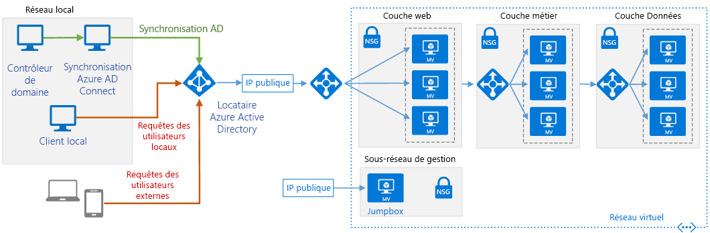

# Intégrer des domaines Active Directory locaux avec Azure Active Directory

Azure Active Directory (Azure AD) est un service d’annuaire et d’identité mutualisé basé sur le cloud. Cette architecture de référence présente les meilleures pratiques pour l’intégration des domaines Active Directory locaux avec Azure AD afin de fournir une authentification d’identité basée sur le cloud. [**Déployez cette solution**](#deploy-the-solution).

*Téléchargez un [fichier Visio][visio-download] de cette architecture.*

> [!NOTE]
> Pour plus de simplicité, ce diagramme illustre uniquement les connexions directement liées à Azure AD. Il ne montre pas le trafic associé aux protocoles qui peut être observé dans le cadre de l’authentification et de la fédération des identités. Par exemple, une application web peut rediriger le navigateur web pour authentifier la requête via Azure AD. Une fois authentifiée, la requête peut être retransmise à l’application web avec les informations d’identité appropriées.
>

Les utilisations courantes de cette architecture de référence incluent :

- Les applications web déployées dans Azure qui fournissent un accès aux utilisateurs distants qui appartiennent à votre organisation.
- L’implémentation de fonctionnalités en libre-service pour les utilisateurs finals, telles que la réinitialisation de mot de passe, et la délégation de la gestion des groupes. Pour cela, l’édition Azure AD Premium est requise.
- Les architectures dans lesquelles le réseau local et le réseau virtuel Azure de l’application ne sont pas connectés à l’aide d’un tunnel VPN ou d’un circuit ExpressRoute.

> [!NOTE]
> Azure AD peut authentifier l’identité des utilisateurs et des applications existant dans le répertoire d’une organisation. Un certain nombre d’applications et de services, tels que SQL Server, peuvent nécessiter l’authentification de l’ordinateur, auquel cas cette solution n’est pas adaptée.
>

Pour plus d’informations, consultez [Choisir une solution pour intégrer l’environnement Active Directory local à Azure][considerations].

## Architecture

L’architecture possède les composants suivants :

- **Locataire Azure AD**. Instance d’[Azure AD][azure-active-directory] créée par votre organisation. Il joue le rôle de service d’annuaire pour les applications cloud en stockant les objets copiés à partir de l’annuaire Active Directory local et fournit des services d’identité.
- **Sous-réseau de couche Web**. Ce sous-réseau accueille les machines virtuelles qui exécutent une application web. Azure AD peut jouer le rôle de service Broker pour les identités pour cette application.
- **Serveur AD DS local**. Service d’annuaire et d’identité local. L’annuaire AD DS peut être synchronisé avec Azure AD pour lui permettre d’authentifier les utilisateurs locaux.
- **Serveur de synchronisation Azure AD Connect**. Ordinateur local qui exécute le service de synchronisation [Azure AD Connect][azure-ad-connect]. Ce service synchronise les informations stockées dans l’annuaire Active Directory local avec Azure AD. Par exemple, si vous approvisionnez ou déprovisionnez des groupes et des utilisateurs localement, ces modifications se propagent à Azure AD.

  > [!NOTE]
  > Pour des raisons de sécurité, Azure AD stocke le mot de passe des utilisateurs sous forme de hachage. Si un utilisateur requiert une réinitialisation de mot de passe, celle-ci doit être réalisée localement et le nouveau hachage doit être envoyé à Azure AD. Les éditions Azure AD Premium incluent des fonctionnalités qui peuvent automatiser cette tâche pour permettre aux utilisateurs de réinitialiser eux-mêmes leur mot de passe.
  >

- **Machines virtuelles pour une application multiniveau**. Le déploiement inclut l’infrastructure requise pour une application multiniveau. Pour plus d’informations sur ces ressources, consultez [Exécuter des machines virtuelles pour une architecture multiniveau][implementing-a-multi-tier-architecture-on-Azure].

## Recommandations

Les recommandations suivantes s’appliquent à la plupart des scénarios. Suivez ces recommandations, sauf si vous avez un besoin spécifique qui vous oblige à les ignorer.

### Service de synchronisation Azure AD Connect

Le service de synchronisation Azure AD Connect garantit que les informations d’identité stockées dans le cloud sont identiques à celles stockées localement. Ce service peut être installé à l’aide du logiciel Azure AD Connect.

Avant d’implémenter la synchronisation Azure AD Connect, déterminez les exigences de synchronisation de votre organisation, telles que les éléments à synchroniser, les domaines à partir desquels effectuer une synchronisation et la fréquence requise. Pour plus d’informations, consultez [Déterminer les exigences de synchronisation d’annuaires][aad-sync-requirements].

Vous pouvez exécuter le service de synchronisation Azure AD Connect sur une machine virtuelle ou un ordinateur hébergé localement. Selon la volatilité des informations stockées dans votre annuaire Active directory, la charge sur le service de synchronisation Azure AD Connect a peu de chances d’être élevée après la synchronisation initiale avec Azure AD. L’exécution du service sur une machine virtuelle permet de mettre à l’échelle le serveur plus facilement si nécessaire. Surveillez l’activité sur la machine virtuelle comme expliqué dans la section Surveillance pour déterminer si une mise à l’échelle est nécessaire.

Si vous avez plusieurs domaines locaux dans une forêt, nous vous recommandons de stocker et de synchroniser les informations de l’ensemble de la forêt dans un locataire Azure AD unique. Filtrez les informations d’identités que l’on retrouve dans plusieurs domaines afin que chaque identité apparaisse une seule fois dans Azure AD au lieu d’être dupliquée. La duplication peut entraîner des incohérences lors de la synchronisation des données. Pour plus d’informations, consultez la section Recommandations en matière de topologie ci-dessous.

Utilisez le filtrage afin de stocker uniquement les données nécessaires dans Azure AD. Par exemple, votre organisation ne souhaite peut-être pas que les informations sur les comptes inactifs soient stockées dans Azure AD. Le filtrage peut être effectué par groupe, par domaine, par unité d’organisation ou par attribut. Vous pouvez combiner des filtres pour créer des règles plus complexes. Par exemple, vous pouvez synchroniser les objets stockés dans un domaine qui présentent une valeur d’attribut spécifique. Pour plus d’informations, consultez [Azure AD Connect Sync : Configurer le filtrage][aad-filtering].

Pour implémenter la haute disponibilité pour le service de synchronisation AD Connect, exécutez un serveur de préproduction secondaire. Pour plus d’informations, consultez la section Recommandations en matière de topologie.

### Recommandations de sécurité

**Gestion des mots de passe utilisateur**. Les éditions Azure AD Premium prennent en charge la réécriture de mot de passe, permettant à vos utilisateurs locaux d’effectuer des réinitialisations de mot de passe en libre-service à partir du portail Azure. Cette fonctionnalité doit être activée uniquement après avoir revu la stratégie de sécurité des mots de passe de votre organisation. Par exemple, vous pouvez choisir d’autoriser seulement certains utilisateurs à modifier leur mot de passe et personnaliser l’expérience de gestion des mots de passe. Pour plus d’informations, consultez [Personnalisation de la gestion des mots de passe en fonction des besoins de votre organisation][aad-password-management].

**Protéger les applications locales qui sont accessibles aux utilisateurs externes.** Utilisez le proxy d’application Azure AD afin de mettre en œuvre un accès contrôlé aux applications web locales pour les utilisateurs externes via Azure AD. Seuls les utilisateurs qui possèdent des informations d’identification valides dans votre annuaire Azure sont autorisés à utiliser l’application. Pour plus d’informations, consultez [Activer le proxy d’application dans le portail Azure][aad-application-proxy].

**Surveillez activement Azure AD pour détecter tout signe d’activité suspecte.** Il peut être judicieux d’utiliser l’édition Azure AD Premium P2, qui inclut Azure AD Identity Protection. Identity Protection s’appuie sur des algorithmes d’apprentissage automatique adaptatif et des règles heuristiques pour détecter les anomalies et les événements à risque susceptibles d’indiquer qu’une identité a été compromise. Par exemple, ce service peut détecter les activités inhabituelles telles que les activités de connexion anormales, les connexions à partir de sources inconnues ou d’adresses IP présentant une activité suspecte, ou encore les connexions à partir d’appareils susceptibles d’être infectés. À l’aide de ces données, Identity Protection génère des rapports et des alertes qui vous permettent d’analyser ces événements à risque et de prendre les mesures qui s’imposent. Pour plus d’informations, consultez [Azure Active Directory Identity Protection][aad-identity-protection].

Vous pouvez utiliser la fonctionnalité de création de rapports d’Azure AD dans le portail Azure pour surveiller les activités liées à la sécurité qui se produisent dans votre système. Pour plus d’informations sur l’utilisation de ces rapports, consultez le guide [Création de rapports Active Directory][aad-reporting-guide].

### Recommandations en matière de topologie

Configurez Azure AD Connect de manière à implémenter une topologie correspondant le mieux aux exigences de votre organisation. Azure AD Connect prend notamment en charge les topologies suivantes :

- **Une seule forêt, un seul annuaire Azure AD**. Dans cette topologie, Azure AD Connect synchronise les objets et les informations d’identité à partir d’un ou plusieurs domaines d’une forêt locale unique dans un locataire Azure AD unique. Il s’agit de la topologie par défaut implémentée par l’installation rapide d’Azure AD Connect.

  > [!NOTE]
  > N’utilisez pas plusieurs serveurs de synchronisation Azure AD Connect pour connecter des domaines différents de la même forêt locale au même locataire Azure AD, sauf si vous exécutez un serveur en mode de préproduction, comme décrit ci-dessous.
  >
  >

- **Plusieurs forêts, un seul annuaire Azure AD**. Dans cette topologie, Azure AD Connect synchronise les objets et les informations d’identité de plusieurs forêts dans un locataire Azure AD unique. Utilisez cette topologie si votre organisation possède plusieurs forêts locales. Vous pouvez consolider les informations d’identité afin que chaque utilisateur unique soit représenté une seule fois dans l’annuaire Azure AD, même si le même utilisateur existe dans plusieurs forêts. Toutes les forêts utilisent le même serveur de synchronisation Azure AD Connect. Le serveur de synchronisation Azure AD Connect ne doit pas nécessairement faire partie d’un domaine, mais il doit être accessible à partir de toutes les forêts.

  > [!NOTE]
  > Dans cette topologie, n’utilisez pas de serveurs de synchronisation Azure AD Connect distincts pour connecter chaque forêt locale à un locataire Azure AD unique. En effet, cela peut donner lieu à des informations d’identité dupliquées dans Azure AD si des utilisateurs sont présents dans plusieurs forêts.
  >

- **Plusieurs forêts, topologies distinctes**. Cette topologie fusionne les informations d’identité de différentes forêts dans un locataire Azure AD unique, traitant toutes les forêts comme des entités distinctes. Cette topologie est utile si vous combinez des forêts de différentes organisations et que les informations d’identité de chaque utilisateur sont stockées dans une seule forêt.

  > [!NOTE]
  > Si les listes d’adresses globale de chaque forêt sont synchronisées, un utilisateur d’une forêt peut être présent dans une autre en tant que contact. Cela peut se produire si votre organisation a implémenté GALSync avec Forefront Identity manager 2010 ou Microsoft Identity Manager 2016. Dans ce scénario, vous pouvez spécifier que les utilisateurs doivent être identifiés par leur attribut *Mail*. Vous pouvez également effectuer l’identification à l’aide des attributs *ObjectSID* et *msExchMasterAccountSID*. Ce mode d’identification s’avère utilise si une ou plusieurs forêts comportent des comptes désactivés.
  >

- **Serveur de préproduction**. Dans cette configuration, vous exécutez une deuxième instance du serveur de synchronisation Azure AD Connect parallèlement à la première instance. Cette structure prend en charge des scénarios tels que :

  - Haute disponibilité :
  - Le test et le déploiement d’une nouvelle configuration du serveur de synchronisation Azure AD Connect.
  - La mise en place d’un nouveau serveur et la désaffectation d’une ancienne configuration.

    Dans ces scénarios, la deuxième instance s’exécute en *mode de préproduction*. Le serveur enregistre les objets importés et les données de synchronisation dans sa base de données, mais ne transmet pas les données à Azure AD. Si vous désactivez le mode de préproduction, le serveur commence à écrire les données dans Azure AD, ainsi qu’à réécrire les mots de passe dans les annuaires locaux si nécessaire. Pour plus d’informations, consultez [Azure Connect AD sync : tâches opérationnelles et examen][aad-connect-sync-operational-tasks].

- **Plusieurs annuaires Azure AD**. Il est recommandé de créer un annuaire Azure AD unique pour une organisation, mais il peut arriver que vous ayez besoin de partitionner les informations dans des annuaires Azure AD distincts. Dans ce cas, vous pouvez prévenir les problèmes de synchronisation et de réécriture de mots de passe en vous assurant que chaque objet de la forêt locale apparaît dans un seul annuaire Azure AD. Pour implémenter ce scénario, configurez des serveurs de synchronisation Azure AD Connect distincts pour chaque annuaire Azure AD et utilisez le filtrage afin que chaque serveur de synchronisation Azure AD Connect opère sur un ensemble d’objets mutuellement exclusifs.

Pour plus d’informations sur ces topologies, consultez [Topologies pour Azure AD Connect][aad-topologies].

### Authentification utilisateur

Par défaut, le serveur de synchronisation Azure AD Connect configure la synchronisation de mot de passe entre le domaine local et Azure AD, et le service Azure AD suppose que les utilisateurs s’authentifient en fournissant le même mot de passe que celui utilisé localement. Cela est adapté à de nombreuses organisations, mais vous devez prendre en considération les stratégies et l’infrastructure existantes de votre organisation. Par exemple : 

- Il se peut que la stratégie de sécurité de votre organisation empêche la synchronisation des hachages de mot de passe avec le cloud. Si c’est le cas, votre organisation devrait penser à utiliser l’[authentification directe](/azure/active-directory/connect/active-directory-aadconnect-pass-through-authentication).
- Vous pouvez avoir besoin que les utilisateurs bénéficient d’une authentification unique (SSO) transparente quand ils accèdent aux ressources cloud à partir de machines jointes au domaine sur le réseau d’entreprise.
- Votre organisation a peut-être déjà déployé des services de fédération Active Directory (AD FS) ou d’un fournisseur de fédération tiers. Vous pouvez configurer Azure AD de manière à utiliser cette infrastructure pour implémenter l’authentification et l’authentification SSO plutôt que de faire appel aux informations de mot de passe stockées dans le cloud.

Pour plus d’informations, consultez [Options de connexion de l’utilisateur via Azure AD Connect][aad-user-sign-in].

### Proxy d’application Azure AD

Utilisez Azure AD pour fournir l’accès aux applications locales.

Exposez vos applications web locales à l’aide de connecteurs de proxy d’application gérés par le composant de proxy d’application Azure AD. Le connecteur de proxy d’application ouvre une connexion réseau sortante avec le proxy d’application Azure AD, et les requêtes des utilisateurs distants sont réacheminées d’Azure AD vers les applications web via cette connexion. Cela évite d’avoir à ouvrir des ports entrants sur le pare-feu local et réduit la surface d’attaque exposée par votre organisation.

Pour plus d’informations, consultez [Publier des applications avec le proxy d’application Azure AD][aad-application-proxy].

### Synchronisation d’objets

La configuration par défaut d’Azure AD Connect synchronise les objets de votre annuaire Active Directory local selon les règles exposées dans l’article [Azure AD Connect Sync : comprendre la configuration par défaut][aad-connect-sync-default-rules]. Les objets qui répondent à ces règles sont synchronisés, tandis que tous les autres objets sont ignorés. Quelques exemples de règles :

- Les objets utilisateur doivent présenter un attribut *sourceAnchor* unique et l’attribut *accountEnabled* doit être renseigné.
- Les objets utilisateur doivent présenter un attribut *sAMAccountName* et ne peuvent pas commencer par le texte *Azure AD_* ou *MSOL_*.

Azure AD Connect applique plusieurs règles aux objets utilisateur, contact, groupe, ForeignSecurityPrincipal et ordinateur. Si vous avez besoin de modifier l’ensemble de règles par défaut, utilisez l’Éditeur de règles de synchronisation installé avec Azure AD Connect. Pour plus d’informations, consultez [Azure Connect AD sync : comprendre la configuration par défaut][aad-connect-sync-default-rules]).

Vous pouvez également définir vos propres filtres pour limiter les objets à synchroniser par domaine ou unité d’organisation. Vous pouvez également implémenter un filtrage personnalisé plus complexe, tel que celui décrit dans [Azure AD Connect Sync : Configurer le filtrage][aad-filtering].

### Surveillance

La surveillance de l’intégrité est effectuée par les agents suivants installés localement :

- Azure AD Connect installe un agent qui enregistre les informations sur les opérations de synchronisation. Utilisez le panneau Azure AD Connect Health dans le portail Azure pour surveiller l’intégrité et les performances du service. Pour plus d’informations, consultez [Utilisation d’Azure AD Connect Health pour la synchronisation][aad-health].
- Pour surveiller l’intégrité des domaines et des annuaires AD DS à partir d’Azure, installez l’agent Azure AD Connect Health pour AD DS sur une machine se trouvant dans le domaine local. Utilisez le panneau Azure Active Directory Connect Health dans le portail Azure pour la surveillance de l’intégrité. Pour plus d’informations, consultez [Utilisation d’Azure AD Connect Health avec AD DS][aad-health-adds].
- Installez l’agent Azure AD Connect Health pour AD FS pour surveiller l’intégrité des services exécutés localement, et utilisez le panneau Azure Active Directory Connect Health dans le portail Azure pour surveiller AD FS. Pour plus d’informations, consultez [Utilisation d’Azure AD Connect Health avec AD FS][aad-health-adfs].

Pour plus d’informations sur l’installation des agents AD Connect Health et les exigences liées à ceux-ci, consultez [Installation des agents Azure AD Connect Health][aad-agent-installation].

## Considérations relatives à l’extensibilité

Le service Azure AD prend en charge l’extensibilité en s’appuyant sur des réplicas, avec un réplica principal unique qui gère les opérations d’écriture et plusieurs réplicas secondaires en lecture seule. Azure AD redirige de manière transparente les tentatives d’écriture sur les réplicas secondaires vers le réplica principal et fournit une cohérence éventuelle. Toutes les modifications apportées au réplica principal sont propagées aux réplicas secondaires. Cette architecture offre une bonne extensibilité, car la plupart des opérations exécutées sur Azure AD sont des lectures plutôt que des écritures. Pour plus d’informations, consultez [Azure AD : Under the hood of our geo-redundant, highly available, distributed cloud directory][aad-scalability].

Pour le serveur de synchronisation Azure AD Connect, déterminez le nombre d’objets de votre annuaire local que vous êtes susceptible de synchroniser. Si vous avez moins de 100 000 objets, vous pouvez utiliser le logiciel Base de données locale SQL Server Express par défaut fourni avec Azure AD Connect. Si ce nombre est supérieur, vous devez installer une version de production de SQL Server et effectuer une installation personnalisée d’Azure AD Connect, en spécifiant qu’il doit utiliser une instance existante de SQL Server.

## Considérations relatives à la disponibilité

Le service Azure AD est géodistribué et s’exécute dans plusieurs centres de données disséminés à travers le monde avec basculement automatisé. Si un centre de données devient indisponible, Azure AD vous donne l’assurance que vos données d’annuaire sont accessibles instantanément dans au moins deux autres centres de données.

> [!NOTE]
> Le contrat de niveau de service (SLA) pour les services Azure AD Basic et Premium garantit une disponibilité de 99,9 % minimum. Le niveau Gratuit d’Azure AD n’est assorti d’aucun contrat SLA. Pour plus d’informations, consultez [SAL pour Azure Active Directory][sla-aad].
>

Envisagez de provisionner une deuxième instance du serveur de synchronisation Azure AD Connect en mode de préproduction afin d’accroître la disponibilité, comme indiqué dans la section Recommandations en matière de topologie.

Si vous n’utilisez pas l’instance de Base de données locale SQL Server Express fournie avec Azure AD Connect, envisagez d’utiliser le clustering SQL pour bénéficier d’une haute disponibilité. Des solutions telles que la mise en miroir et Always On ne sont pas prises en charge par Azure AD Connect.

Pour plus d’informations sur la marche à suivre pour bénéficier de la haute disponibilité du serveur de synchronisation Azure AD Connect et sur la récupération après une défaillance, consultez [Azure Connect AD sync : tâches opérationnelles et examen - Reprise d’activité après sinistre][aad-sync-disaster-recovery].

## Considérations relatives à la facilité de gestion

La gestion d’Azure AD comprend deux aspects :

- L’administration d’Azure AD dans le cloud.
- La gestion des serveurs de synchronisation Azure AD Connect.

Azure AD offre les options suivantes pour la gestion des domaines et des annuaires dans le cloud :

- **Module Azure Active Directory PowerShell**. Utilisez ce [module] [aad-powershell] si vous avez besoin de créer des scripts pour des tâches d’administration Azure AD courantes telles que la gestion des utilisateurs, la gestion des domaines et la configuration de l’authentification unique.
- **Panneau de gestion Azure AD dans le portail Azure**. Ce panneau fournit une vue de gestion interactive de l’annuaire et vous permet de contrôler et de configurer la plupart des aspects d’Azure AD.

Azure AD Connect installe les outils suivants pour gérer les services de synchronisation Azure AD Connect à partir de vos machines locales :

- **Console Microsoft Azure Active Directory Connect**. Cet outil permet de modifier la configuration du serveur Azure AD Sync, de personnaliser la méthode de synchronisation, d’activer ou de désactiver le mode de préproduction et de changer de mode de connexion utilisateur. Notez que vous pouvez activer la connexion Active Directory FS à l’aide de votre infrastructure locale.
- **Synchronization Service Manager**. Utilisez l’onglet *Opérations* de cet outil pour gérer le processus de synchronisation et détecter si certaines parties du processus ont échoué. Vous pouvez déclencher des synchronisations manuellement à l’aide de cet outil. L’onglet *Connecteurs* permet de contrôler les connexions pour les domaines auxquels le moteur de synchronisation est joint.
- **Éditeur de règles de synchronisation**. Utilisez cet outil pour personnaliser la façon dont les objets sont transformés quand ils sont copiés entre un annuaire local et Azure AD. Cet outil permet de spécifier des attributs et des objets supplémentaires pour la synchronisation, puis exécute des filtres pour déterminer quels objets doivent ou ne doivent pas être synchronisés. Pour plus d’informations, consultez la section Éditeur de règles de synchronisation de l’article [Azure AD Connect Sync : comprendre la configuration par défaut][aad-connect-sync-default-rules].

Pour plus d’informations et des conseils sur la gestion d’Azure AD Connect, consultez [Azure AD Connect Sync : bonnes pratiques pour changer la configuration par défaut][aad-sync-best-practices].

## Considérations relatives à la sécurité

Utilisez le contrôle d’accès conditionnel pour refuser les requêtes d’authentification provenant de sources inconnues :

- Déclenchez le service [Azure Multi-Factor Authentication (MFA)][azure-multifactor-authentication] si un utilisateur tente de se connecter à partir d’un emplacement non approuvé, par exemple via Internet, au lieu d’un réseau approuvé.

- Utilisez le type de plateforme d’appareil (iOS, Android, Windows Mobile, Windows) pour déterminer la stratégie d’accès aux applications et aux fonctionnalités.

- Enregistrez l’état activé/désactivé des appareils des utilisateurs et incorporez cette information dans les vérifications de stratégie d’accès. Par exemple, si le téléphone d’un utilisateur a été perdu ou volé, il doit être enregistré comme étant désactivé afin qu’il ne puisse plus être utilisé pour l’accès.

- Contrôlez l’accès des utilisateurs aux ressources en fonction de l’appartenance à un groupe. Utilisez les [règles d’appartenance dynamique Azure AD][aad-dynamic-membership-rules] pour simplifier l’administration des groupes. Pour une vue d’ensemble du fonctionnement de ces règles, regardez [Introduction to Dynamic Memberships for Groups][aad-dynamic-memberships] (Présentation de l’appartenance dynamique à des groupes).

- Utilisez des stratégies de risque d’accès conditionnel avec Azure AD Identity Protection pour fournir une protection avancée basée sur les activités de connexion inhabituelles ou d’autres événements.

Pour plus d’informations, consultez [Accès conditionnel Azure Active Directory][aad-conditional-access].

## Déployer la solution

Un déploiement pour une architecture de référence implémentant ces recommandations et considérations est disponible sur GitHub. Cette architecture de référence déploie un réseau local simulé dans Azure, que vous pouvez utiliser pour tester et expérimenter différents scénarios. L’architecture de référence peut être déployée avec des machines virtuelles Windows ou Linux en procédant comme suit :

<!-- markdownlint-disable MD033 -->

1. Cliquez sur le bouton ci-dessous : 

2. Une fois le lien ouvert dans le portail Azure, vous devez entrer des valeurs pour certains paramètres :
   - Le nom du **groupe de ressources** est déjà défini dans le fichier de paramètres ; sélectionnez **Créer nouveau** et entrez `ra-aad-onpremise-rg` dans la zone de texte.
   - Sélectionnez la région à partir de la zone déroulante **Emplacement**.
   - Ne modifiez pas les zones de texte **Template Root Uri** (Uri racine de modèle) ou **Parameter Root Uri** (Uri racine de paramètre).
   - Dans la zone de liste déroulante **Type de système d’exploitation**, sélectionnez **windows** ou **linux**.
   - Passez en revue les termes et conditions, puis cochez la case **J’accepte les termes et conditions mentionnés ci-dessus**.
   - Cliquez sur le bouton **Acheter**.

3. Attendez la fin du déploiement.

4. Les fichiers de paramètres incluent des noms d’utilisateur administrateur et des mots de passe codés en dur, et nous vous recommandons vivement de modifier immédiatement ces deux éléments sur toutes les machines virtuelles. Cliquez sur chaque machine virtuelle dans le portail Azure, puis cliquez sur **Réinitialiser le mot de passe** dans le panneau **Support + dépannage**. Sélectionnez **Réinitialiser le mot de passe** dans la zone déroulante **Mode**, puis sélectionnez de nouveaux **Nom d’utilisateur** et **Mot de passe**. Cliquez sur le bouton **Mettre à jour** pour conserver les nouveaux nom d’utilisateur et mot de passe.

<!-- markdownlint-disable MD033 -->

<!-- links -->

[implementing-a-multi-tier-architecture-on-Azure]: ../virtual-machines-windows/n-tier.md

[aad-agent-installation]: /azure/active-directory/active-directory-aadconnect-health-agent-install
[aad-application-proxy]: /azure/active-directory/active-directory-application-proxy-enable
[aad-conditional-access]: /azure/active-directory//active-directory-conditional-access
[aad-connect-sync-default-rules]: /azure/active-directory/hybrid/concept-azure-ad-connect-sync-default-configuration
[aad-connect-sync-operational-tasks]: /azure/active-directory/hybrid/how-to-connect-sync-operations
[aad-dynamic-memberships]: https://youtu.be/Tdiz2JqCl9Q
[aad-dynamic-membership-rules]: /azure/active-directory/active-directory-accessmanagement-groups-with-advanced-rules
[aad-editions]: /azure/active-directory/active-directory-editions
[aad-filtering]: /azure/active-directory/hybrid/how-to-connect-sync-configure-filtering
[aad-health]: /azure/active-directory/active-directory-aadconnect-health-sync
[aad-health-adds]: /azure/active-directory/active-directory-aadconnect-health-adds
[aad-health-adfs]: /azure/active-directory/active-directory-aadconnect-health-adfs
[aad-identity-protection]: /azure/active-directory/active-directory-identityprotection
[aad-password-management]: /azure/active-directory/active-directory-passwords-customize
[aad-powershell]: https://msdn.microsoft.com/library/azure/mt757189.aspx
[aad-reporting-guide]: /azure/active-directory/active-directory-reporting-guide
[aad-scalability]: https://blogs.technet.microsoft.com/enterprisemobility/2014/09/02/azure-ad-under-the-hood-of-our-geo-redundant-highly-available-distributed-cloud-directory/
[aad-sync-best-practices]: /azure/active-directory/hybrid/how-to-connect-sync-best-practices-changing-default-configuration
[aad-sync-disaster-recovery]: /azure/active-directory/hybrid/how-to-connect-sync-operations#disaster-recovery
[aad-sync-requirements]: /azure/active-directory/active-directory-hybrid-identity-design-considerations-directory-sync-requirements
[aad-topologies]: /azure/active-directory/hybrid/plan-connect-topologies
[aad-user-sign-in]: /azure/active-directory/hybrid/plan-connect-user-signin
[azure-active-directory]: /azure/active-directory-domain-services/active-directory-ds-overview
[azure-ad-connect]: /azure/active-directory/hybrid/whatis-hybrid-identity
[azure-multifactor-authentication]: /azure/multi-factor-authentication/multi-factor-authentication
[considerations]: ./considerations.md
[resource-manager-overview]: /azure/azure-resource-manager/resource-group-overview
[sla-aad]: https://azure.microsoft.com/support/legal/sla/active-directory
[visio-download]: https://archcenter.blob.core.windows.net/cdn/identity-architectures.vsdx
