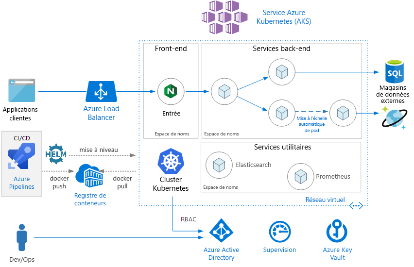
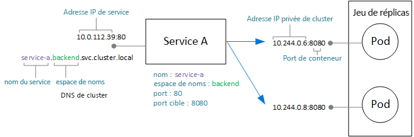
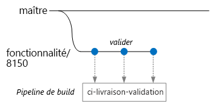
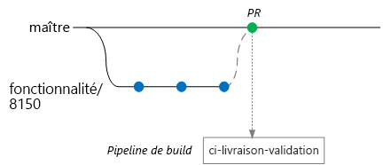
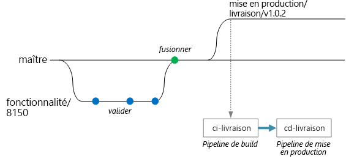

# <a name="microservices-architecture-on-azure-kubernetes-service-aks"></a>Architecture des microservices sur AKS (Azure Kubernetes Service)

Cette architecture de référence montre une application de microservices déployée sur AKS (Azure Kubernetes Service). Il décrit une configuration AKS de base qui peut être le point de départ pour la plupart des déploiements. Cet article suppose une connaissance élémentaire de Kubernetes. Il se concentre principalement sur l’infrastructure et les considérations DevOps liées à l’exécution d’une architecture de microservices sur AKS. Pour obtenir des conseils sur la conception de microservices, consultez [création de microservices sur Azure](../../microservices/index.md).

 une implémentation de référence de cette architecture est disponible sur [GitHub](https://github.com/mspnp/microservices-reference-implementation).




## <a name="architecture"></a>Architecture

L’architecture est constituée des composants suivants.

**Azure Kubernetes Service** (AKS). AKS est un service Azure qui déploie un cluster Kubernetes managé. 

**Cluster Kubernetes**. AKS est responsable du déploiement du cluster Kubernetes et de la gestion des maîtres Kubernetes. Vous ne gérez que les nœuds d’agent.

**Réseau virtuel**. Par défaut, AKS crée un réseau virtuel en vue d’y déployer les nœuds d’agent. Pour les scénarios plus avancés, vous pouvez commencer par créer le réseau virtuel et contrôler ainsi la configuration des sous-réseaux, la connectivité locale et l’adressage IP, entre autres éléments. Pour plus d’informations, consultez [Configurer la mise en réseau avancée dans AKS (Azure Kubernetes Service)](/azure/aks/configure-advanced-networking).

**Entrée**. Une entrée expose des routes HTTP(S) aux services à l’intérieur du cluster. Pour plus d’informations, consultez la section [Passerelle API](#api-gateway) ci-dessous.

**Magasins de données externes**. Les microservices étant généralement sans état, ils écrivent l’état dans des magasins de données externes, tels qu’Azure SQL Database ou Cosmos DB.

**Azure Active Directory**. AKS utilise une identité Azure Active Directory (Azure AD) pour créer et gérer d’autres ressources Azure telles que les équilibreurs de charge Azure. Azure AD est également recommandé pour l’authentification de l’utilisateur dans les applications clientes.

**Azure Container Registry**. Utilisez Container Registry pour stocker les images Docker privées, qui sont déployées sur le cluster. AKS peut s’authentifier auprès de Container Registry à l’aide de son identité Azure AD. Notez qu’AKS ne nécessite pas Azure Container Registry. Vous pouvez utiliser d’autres registres de conteneurs, tels que Docker Hub.

**Azure Pipelines**. Les pipelines font partie d’Azure DevOps Services et exécutent des générations, tests et déploiements automatisés. Vous pouvez également utiliser des solutions CI/CD tierces telles que Jenkins. 

**Helm**. Faisant office de gestionnaire de package pour Kubernetes, Helm permet de regrouper les objets Kubernetes en une seule unité que vous pouvez publier, déployer, mettre à jour et dont vous pouvez contrôler la version.

**Azure Monitor**. Azure Monitor recueille et stocke les métriques et journaux, notamment les métriques de plateforme pour les services Azure dans les données de télémétrie d’application et de solution. Utilisez ces données pour superviser l’application, définir des alertes et des tableaux de bord et effectuer une analyse de la cause racine des échecs. Azure Monitor s’intègre à AKS pour collecter des métriques à partir des contrôleurs, nœuds et conteneurs ainsi que des journaux de conteneurs et des journaux des nœuds principaux.

## <a name="design-considerations"></a>Remarques relatives à la conception

Cette architecture de référence se concentre sur les architectures de microservices, bien que la plupart des pratiques recommandées concernent d’autres charges de travail s’exécutant sur AKS.

### <a name="microservices"></a>Microservices

L’objet Service Kubernetes est une façon naturelle de modéliser les microservices dans Kubernetes. Un microservice est une unité faiblement couplée, pouvant être déployée indépendamment du code. Communiquant généralement par le biais d’API bien définies, les microservices peuvent être détectés par le biais d’une découverte de services. L’objet Service Kubernetes fournit un ensemble de fonctionnalités qui répondent à ces exigences :

- Adresse IP. L’objet Service fournit une adresse IP interne statique pour un groupe de pods (ReplicaSet). Quand des pods sont créés ou déplacés, le service est toujours accessible à cette adresse IP interne.

- Équilibrage de charge : Le trafic envoyé à l’adresse IP du service fait l’objet d’un équilibrage de charge sur les pods. 

- Découverte des services. Les services se voient assigner des entrées DNS internes par le service DNS Kubernetes. Cela signifie que la passerelle API peut appeler un service back-end en utilisant le nom DNS. Le même mécanisme peut être utilisé pour la communication de service à service. Les entrées DNS étant organisées par espace de noms, si vos espaces de noms correspondent à des contextes délimités, le nom DNS pour un service est naturellement mappé au domaine d’application.

Le diagramme suivant montre la relation conceptuelle entre les services et les pods. Le mappage réel aux ports et adresses IP de point de terminaison est effectué par kube-proxy, proxy de réseau Kubernetes.



### <a name="api-gateway"></a>API Gateway

Une *passerelle API* est une passerelle qui se trouve entre les clients externes et les microservices. Elle fait office de proxy inverse, acheminant les demandes des clients vers les microservices. Elle peut également effectuer diverses tâches transversales telles que l’authentification, l’arrêt SSL et la limitation du débit. 

Les fonctionnalités fournies par une passerelle peuvent être regroupées comme suit :

- [Routage de passerelle](../../patterns/gateway-routing.md) : routage des demandes clientes vers les services back-end appropriés. Ce processus fournit un point de terminaison unique pour les clients et permet de découpler ces derniers des services.

- [Agrégation de passerelle](../../patterns/gateway-aggregation.md) : agrégation de plusieurs demandes en une seule, pour réduire les échanges excessifs entre le client et le back-end.

- [Déchargement de passerelle](../../patterns/gateway-offloading.md) : Une passerelle peut décharger des fonctionnalités à partir des services back-end, telles que la terminaison SSL, l’authentification, la mise en liste verte d’adresses IP ou la limitation du débit client.

Les passerelles API sont un [modèle de conception de microservices](https://microservices.io/patterns/apigateway.html) général. Elles peuvent être implémentées à l’aide de nombreuses technologies. L’implémentation la plus courante consiste probablement à déployer un routeur de périphérie ou proxy inverse, tel que Nginx, HAProxy ou Traefik, à l’intérieur du cluster. 

Autres options disponibles :

- Azure Application Gateway et/ou Gestion des API Azure, deux services managés résidant hors du cluster. Un contrôleur d’entrée Application Gateway est en version bêta.

- Azure Functions Proxies. Les proxys peuvent modifier les demandes et réponses et acheminer les demandes en fonction de l’URL.

Le type de ressource **Entrée** Kubernetes abstrait les paramètres de configuration d’un serveur proxy. Il fonctionne conjointement avec un contrôleur d’entrée, qui fournit l’implémentation sous-jacente de l’entrée. Il existe des contrôleurs d’entrée pour Nginx, HAProxy, Traefik et Application Gateway (préversion), entre autres.

Le contrôleur d’entrée gère la configuration des serveurs proxy. Ceux-ci nécessitant souvent des fichiers de configuration complexes dont le paramétrage peut s’avérer difficiles pour un non-expert, le contrôleur d’entrée constitue une abstraction intéressante. En outre, le contrôleur d’entrée a accès à l’API Kubernetes, ce qui lui permet de prendre des décisions intelligentes sur le routage et l’équilibrage de charge. Par exemple, le contrôleur d’entrée Nginx contourne le proxy réseau kube-proxy.

En revanche, si vous avez besoin de contrôler totalement les paramètres, vous pouvez passer outre cette abstraction et configurer le serveur proxy manuellement. 

Un serveur proxy inverse est un point de défaillance unique ou un goulot d’étranglement potentiel. Déployez donc toujours au moins deux réplicas pour une haute disponibilité.

### <a name="data-storage"></a>Stockage des données

Dans une architecture de microservices, les services ne doivent pas partager le stockage de données. Chaque service doit conserver ses propres données privées dans un stockage logique distinct, afin d’éviter des dépendances masquées entre services. En effet, il convient d’éviter tout couplage non intentionnel entre les services, problème qui peut se produire dans les cas de figure où les services partagent des schémas de données sous-jacents. En outre, quand les services gèrent leurs propres magasins de données, ils peuvent utiliser le magasin de données adapté à leurs besoins. Pour plus d’informations, consultez [Conception des microservices : Considérations relatives aux données](/azure/architecture/microservices/data-considerations).

Évitez de stocker des données persistantes dans l’espace de stockage en cluster local, car celui-ci lie les données au nœud. Au lieu de cela : 

- Utilisez un service externe tel qu’Azure SQL Database ou Cosmos DB, *ou*

- Montez un volume persistant à l’aide d’Azure Disks ou d’Azure Files. Utiliser Azure Files si le même volume doit être partagé par plusieurs pods.

### <a name="namespaces"></a>Espaces de noms

Utilisez des espaces de noms pour organiser les services au sein du cluster. Chaque objet dans un cluster Kubernetes appartient à un espace de noms. Par défaut, quand vous créez un objet, il est placé dans l’espace de noms `default`. Nous vous conseillons toutefois de créer des espaces de noms plus descriptifs afin d’organiser aisément les ressources dans le cluster.

Tout d’abord, les espaces de noms vous aident à empêcher les collisions de noms. Quand plusieurs équipes déploient des microservices sur le même cluster, opération pouvant impliquer des centaines de microservices, il devient difficile de savoir s’ils peuvent tous être placés dans le même espace de noms. En outre, les espaces de noms vous permettent d’effectuer les opérations suivantes :

- Appliquer des contraintes de ressources à un espace de noms, afin que l’ensemble total de pods assignés à cet espace de noms ne dépasse pas le quota de ressources de l’espace de noms

- Appliquer des stratégies au niveau de l’espace de noms, notamment des stratégies RBAC et de sécurité

Pour une architecture de microservices, envisagez d’organiser les microservices en contextes délimités et de créer des espaces de noms pour chaque contexte délimité. Par exemple, tous les microservices liés au contexte délimité « Traitement des commandes » peuvent être placés dans le même espace de noms. Vous pouvez également créer un espace de noms pour chaque équipe de développement.

Placez les services d’utilitaire dans leur propre espace de noms. Par exemple, vous pouvez déployer Elasticsearch ou Prometheus pour la supervision des clusters ou Tiller pour Helm.

## <a name="scalability-considerations"></a>Considérations relatives à l’extensibilité

Kubernetes prend en charge un scale-out à deux niveaux :

- Mise à l’échelle du nombre de pods alloués à un déploiement.
- Mise à l’échelle des nœuds du cluster, pour augmenter les ressources de calcul totales disponibles pour le cluster.

Bien que vous puissiez effectuer un scale-out des pods et des nœuds manuellement, nous vous recommandons d’utiliser la mise à l’échelle automatique pour réduire les risques que les services manquent de ressources sous une charge élevée. Une stratégie de mise à l’échelle automatique doit tenir compte à la fois des pods et des nœuds. Si vous effectuez simplement un scale-out des pods, vous allez finir par atteindre les limites de ressources des nœuds. 

### <a name="pod-autoscaling"></a>Mise à l’échelle automatique des pods

L’autoscaler de pods élastique met à l’échelle les pods en fonction des métriques d’UC, de mémoire ou personnalisées observées. Pour configurer la mise à l’échelle élastique des pods, vous spécifiez une métrique cible (par exemple, 70 % de l’UC) et les nombres minimal et maximal de réplicas. Vous devez effectuer un test de charge de vos services pour dériver ces nombres.

Un effet secondaire de la mise à l’échelle automatique est que les pods peuvent être créés ou supprimés plus fréquemment, à mesure que se produisent les événements de scale-out et de scale-in. Pour en atténuer les effets :

- Utilisez des probes readiness pour que Kubernetes sache quand un nouveau pod est prêt à accepter du trafic.
- Utilisez des budgets d’interruption de pod pour limiter le nombre de pods pouvant être supprimés d’un service simultanément.

### <a name="cluster-autoscaling"></a>Mise à l’échelle automatique du cluster

L’autoscaler de cluster met à l’échelle le nombre de nœuds. Si des contraintes de ressources empêchent la planification de pods, l’autoscaler de cluster provisionne davantage de nœuds.  (Remarque : L’intégration entre AKS et l’autoscaler de cluster est en préversion.)

Tandis que l’autoscaler de pods élastique examine les ressources réelles consommées ou d’autres métriques à partir des pods en cours d’exécution, l’autoscaler de cluster provisionne les nœuds pour les pods qui ne sont pas encore planifiés. Ainsi, il examine les ressources demandées, comme indiqué dans la spécification des pods Kubernetes pour un déploiement. Pour ajuster ces valeurs, utilisez un test de charge.

Comme vous ne pouvez pas changer la taille des machines virtuelles une fois que vous avez créé le cluster, vous devez commencer par planifier la capacité afin de choisir une taille de machine virtuelle appropriée pour les nœuds d’agent quand vous créez le cluster. 

## <a name="availability-considerations"></a>Considérations relatives à la disponibilité

### <a name="health-probes"></a>Sondes d’intégrité

Kubernetes définit deux types de probe d’intégrité qu’un pod peut exposer :

- Probe readiness : indique à Kubernetes si le pod est prêt à accepter des demandes.

- Probe liveness : indique à Kubernetes si un pod doit être supprimé et une nouvelle instance démarrée.

Quand vous vous penchez sur les probes, pensez à la façon dont fonctionne un service dans Kubernetes. Un service a un sélecteur d’étiquette qui correspond à un ensemble de pods (zéro ou plus). Kubernetes équilibre la charge du trafic vers les pods qui correspondent au sélecteur. Seuls les pods qui ont correctement démarré et qui sont sains reçoivent du trafic. Si un conteneur plante, Kubernetes supprime le pod et planifie un remplacement.

Il peut arriver qu’un pod ne soit pas prêt à recevoir du trafic, même s’il a démarré correctement. Ce peut être le cas à l’occasion de tâches d’initialisation pendant lesquelles l’application en cours d’exécution dans le conteneur charge des éléments en mémoire ou lit des données de configuration. Pour indiquer qu’un pod est sain mais qu’il n’est pas prêt à recevoir du trafic, définissez une probe readiness. 

Les probes liveness traitent le cas où un pod, bien qu’en cours d’exécution, doit être recyclé, car il n’est pas sain. Par exemple, supposons qu’un conteneur sert des requêtes HTTP, mais se bloque pour une raison quelconque. Le conteneur ne plante pas, mais il a arrêté de servir les requêtes. Si vous définissez une probe liveness HTTP, celle-ci ne répond plus et indique à Kubernetes de redémarrer le pod.

Voici quelques considérations liées à la conception des probes :

- Si votre code met du temps à démarrer, il existe un risque que la probe liveness signale un échec avant la fin du démarrage. Pour éviter cette situation, utilisez le paramètre initialDelaySeconds, qui retarde le démarrage de la probe.

- Une probe liveness n’est utile que si le redémarrage du pod est susceptible de restaurer celui-ci dans un état sain. Vous pouvez utiliser une probe liveness pour éviter les fuites de mémoire ou les blocages inattendus, mais il est inutile de redémarrer un pod susceptible de rééchouer immédiatement.

- Parfois, les probes readiness peuvent servir à vérifier les services dépendants. Par exemple, si un pod a une dépendance sur une base de données, la probe liveness peut vérifier la connexion de base de données. Toutefois, cette approche peut engendrer des problèmes inattendus. Un service externe peut être temporairement indisponible pour une raison quelconque. Cette situation entraîne l’échec de la probe readiness pour tous les pods dans votre service, puis la suppression de ces derniers de l’équilibrage de charge, suivie de défaillances en cascade en amont. Une meilleure approche consiste à implémenter la gestion de nouvelle tentative au sein de votre service, afin que celui-ci puisse récupérer correctement après des défaillances temporaires.

### <a name="resource-constraints"></a>Contraintes de ressources

La contention de ressources peut affecter la disponibilité d’un service. Définissez des contraintes de ressources pour les conteneurs, afin qu’un seul conteneur ne puisse pas surcharger les ressources de cluster (UC et mémoire). Pour les ressources non-conteneur, telles que les threads ou les connexions réseau, envisagez d’utiliser le [modèle de cloisonnement](/azure/architecture/patterns/bulkhead) pour les isoler.

Utilisez des quotas de ressources afin de limiter les ressources totales autorisées pour un espace de noms. De cette façon, le front-end ne peut pas priver les services back-end de ressources ou vice versa.

## <a name="security-considerations"></a>Considérations relatives à la sécurité

### <a name="role-based-access-control-rbac"></a>Contrôle d’accès en fonction du rôle (RBAC)

Kubernetes et Azure disposent de mécanismes de contrôle d’accès en fonction du rôle (RBAC) :

- RBAC Azure contrôle l’accès aux ressources dans Azure, y compris la possibilité de créer des ressources Azure. Ces autorisations peuvent être assignées aux utilisateurs, groupes ou principaux de service. (Un principal de service est une identité de sécurité utilisée par les applications.)

- Kubernetes RBAC contrôle les autorisations sur l’API Kubernetes. Par exemple, la création de pods et le listage de pods sont des actions qui peuvent être accordées (ou refusées) à un utilisateur au moyen de RBAC. Pour assigner des autorisations Kubernetes à des utilisateurs, vous créez des *rôles* et des *liaisons de rôle* :

  - Un rôle est un jeu d’autorisations qui s’appliquent au sein d’un espace de noms. Les autorisations sont définies sous forme de verbes (obtenir, mettre à jour, créer, supprimer) appliqués à des ressources (pods, déploiements, etc.).

  - Une liaison de rôle (RoleBinding) assigne des utilisateurs ou groupes à un rôle.

  - Il existe également un objet ClusterRole, qui est similaire à un rôle, mais s’applique à l’ensemble du cluster, sur tous les espaces de noms. Pour assigner des utilisateurs ou des groupes à un rôle de cluster (ClusterRole), créez une liaison de rôle de cluster (ClusterRoleBinding).

AKS intègre ces deux mécanismes RBAC. Quand vous créez un cluster AKS, vous pouvez le configurer afin d’utiliser Azure AD pour l’authentification utilisateur. Pour plus d’informations sur la façon d’effectuer cette configuration, consultez [Intégrer Azure Active Directory dans Azure Kubernetes Service](/azure/aks/aad-integration).

Une fois cette configuration effectuée, un utilisateur qui souhaite accéder à l’API Kubernetes (par exemple, via kubectl) doit se connecter à l’aide de ses informations d’identification Azure AD.

Par défaut, un utilisateur Azure AD n’a pas accès au cluster. Pour accorder l’accès, l’administrateur de cluster crée des liaisons de rôle qui font référence à des utilisateurs ou groupes Azure AD. Si un utilisateur ne dispose pas d’autorisations pour une opération particulière, celle-ci échoue.

Si les utilisateurs n’ont par défaut aucun accès, comment l’administrateur de cluster peut-il créer les liaisons de rôle initialement ? Un cluster AKS a en fait deux types d’informations d’identification pour appeler le serveur d’API Kubernetes : utilisateur de cluster et administrateur de cluster. Les informations d’identification d’administrateur de cluster accordent un accès complet au cluster. La commande Azure CLI `az aks get-credentials --admin` télécharge les informations d’identification d’administrateur de cluster et les enregistre dans votre fichier kubeconfig. L’administrateur de cluster peut utiliser ce fichier kubeconfig pour créer des rôles et des liaisons de rôle.

Les informations d’identification d’administrateur de cluster étant particulièrement puissantes, utilisez RBAC Azure pour restreindre l’accès à ces dernières :

- Le « Rôle administrateur de cluster du service Azure Kubernetes » est autorisé à télécharger les informations d’identification d’administrateur de cluster. Seuls les administrateurs de cluster doivent être assignés à ce rôle.

- Le « Rôle utilisateur de cluster du service Azure Kubernetes » est autorisé à télécharger les informations d’identification d’utilisateur de cluster. Les utilisateurs non-administrateurs peuvent être assignés à ce rôle. Ce rôle ne donne pas d’autorisations spécifiques sur les ressources Kubernetes à l’intérieur du cluster &mdash; il permet simplement à un utilisateur de se connecter au serveur d’API. 

Quand vous définissez vos stratégies RBAC (Kubernetes et Azure), pensez aux rôles dans votre organisation :

- Qui peut créer ou supprimer un cluster AKS et télécharger les informations d’identification d’administrateur ?
- Qui peut administrer un cluster ?
- Qui peut créer ou mettre à jour des ressources au sein d’un espace de noms ?

Nous vous conseillons de définir les autorisations RBAC Kubernetes à l’échelle des espaces de noms, en utilisant des rôles et liaisons de rôle, plutôt que des rôles de cluster (ClusterRoles) et des liaisons de rôle de cluster (ClusterRoleBindings).

Enfin, vous devez déterminer les autorisations dont dispose le cluster AKS pour créer et gérer des ressources Azure, telles que les équilibreurs de charge, le réseau ou le stockage. Pour s’authentifier auprès des API Azure, le cluster utilise un principal de service Azure AD. Si vous ne spécifiez pas de principal de service quand vous créez le cluster, un principal de service est créé automatiquement. Toutefois, pour des raisons de sécurité, nous vous recommandons de créer le principal de service dès le départ, puis de lui assigner les autorisations RBAC minimales. Pour plus d’informations, consultez [Principaux de service avec Azure Kubernetes Service](/azure/aks/kubernetes-service-principal).

### <a name="secrets-management-and-application-credentials"></a>Gestion des secrets et informations d’identification d’application

Les applications et services ont souvent besoin d’informations d’identification leur permettant de se connecter à des services externes tels que Stockage Azure ou SQL Database. Le défi consiste à assurer la sécurité de ces informations d’identification et à les protéger de toute fuite. 

Pour les ressources Azure, vous pouvez utiliser des identités managées. Une identité managée repose sur l’idée qu’une application ou un service a une identité stockée dans Azure AD et utilise cette identité auprès d’un service Azure. Un principal de service est créé dans Azure AD pour l’application ou le service, qui s’authentifie à l’aide de jetons OAuth 2.0. Le processus en cours d’exécution appelle une adresse localhost pour obtenir le jeton. Ainsi, vous n’avez pas besoin de stocker de mots de passe ou de chaînes de connexion. Vous pouvez utiliser des identités managées dans AKS en assignant des identités à des pods individuels, à l’aide du projet [aad-pod-identity](https://github.com/Azure/aad-pod-identity).

Tous les services Azure ne prennent pas en charge l’authentification à l’aide d’identités managées. Pour obtenir une liste, consultez [Services Azure qui prennent en charge l’authentification Azure AD](/azure/active-directory/managed-identities-azure-resources/services-support-msi).

Même avec des identités managées, vous devrez probablement stocker certaines informations d’identification ou d’autres secrets d’application, que ce soit pour des services Azure qui ne prennent pas en charge les identités managées, des services tiers, des clés API, etc. Voici quelques options pour stocker des secrets de manière sécurisée :

- Azure Key Vault. Dans AKS, vous pouvez monter un ou plusieurs secrets à partir de Key Vault en tant que volume. Le volume lit les secrets dans Key Vault. Le pod peut ensuite lire les secrets comme un volume normal. Pour plus d’informations, consultez le projet [Kubernetes-KeyVault-FlexVolume](https://github.com/Azure/kubernetes-keyvault-flexvol) sur GitHub.

    Le pod s’authentifie à l’aide d’une identité de pod (décrite plus haut) ou d’un principal de service Azure AD avec un secret client. L’utilisation d’identités de pod est recommandée, car le secret client n’est pas nécessaire dans ce cas. 

- HashiCorp Vault. Les applications Kubernetes peuvent s’authentifier auprès de HashiCorp Vault à l’aide d’identités Azure AD managées. Consultez [HashiCorp Vault speaks Azure Active Directory](https://open.microsoft.com/2018/04/10/scaling-tips-hashicorp-vault-azure-active-directory/). Vous pouvez déployer le coffre proprement dit sur Kubernetes, mais nous vous recommandons de l’exécuter dans un cluster dédié distinct du cluster de votre application. 

- Secrets Kubernetes. Une autre option consiste simplement à utiliser des secrets Kubernetes. Cette option est la plus facile à configurer, mais présente quelques défis. Les secrets sont stockés dans etcd, magasin de clés/valeurs distribué. AKS [chiffre etcd au repos](https://github.com/Azure/kubernetes-kms#azure-kubernetes-service-aks). Microsoft gère les clés de chiffrement.

L’utilisation d’un système comme HashiCorp Vault ou Azure Key Vault offre plusieurs avantages, tels que les suivants :

- Contrôle centralisé des secrets
- Garantie que tous les secrets sont chiffrés au repos
- Gestion centralisée des clés
- Contrôle d’accès des secrets
- Audit

### <a name="pod-and-container-security"></a>Sécurité des conteneurs et des pods

Cette liste n’est certainement pas exhaustive, mais voici quelques pratiques recommandées pour protéger vos pods et conteneurs : 

N’exécutez pas les conteneurs en mode privilégié. Le mode privilégié donne à un conteneur l’accès à tous les appareils sur l’hôte. Vous pouvez définir la stratégie de sécurité des pods de manière à empêcher l’exécution des conteneurs en mode privilégié. 

Dans la mesure du possible, évitez d’exécuter des processus en tant qu’utilisateur root à l’intérieur des conteneurs. Les conteneurs n’offrent pas une isolation totale du point de vue de la sécurité ; il est donc préférable d’exécuter un processus de conteneur en tant qu’utilisateur non privilégié. 

Stockez les images dans un registre privé approuvé, tel qu’Azure Container Registry ou Docker Trusted Registry. Utilisez un webhook d’admission de validation dans Kubernetes pour vous assurer que les pods ne peuvent extraire des images que du registre approuvé.

Analysez les images pour déterminer si elles présentent des vulnérabilités connues, à l’aide d’une solution d’analyse telle que Twistlock et Aqua, qui sont disponibles par le biais de la Place de marché Microsoft Azure.

Automatisez la mise à jour corrective des images à l’aide d’ACR Tasks, fonctionnalité d’Azure Container Registry. Une image conteneur est développée à partir de couches. Les couches de base incluent l’image de système d’exploitation et les images de framework d’application, par exemple ASP.NET Core ou Node.js. Les images de base sont généralement créées en amont des développeurs d’applications et sont gérées par d’autres mainteneurs du projet. Quand ces images sont corrigées en amont, il est important que vous mettiez à jour, testiez et redéployiez vos propres images, afin qu’elles soient exemptes de vulnérabilités de sécurité connues. ACR Tasks peut aider à automatiser ce processus.

## <a name="deployment-cicd-considerations"></a>Points à prendre en considération pour le déploiement (CI/CD)

Voici certains objectifs d’un processus CI/CD robuste pour une architecture de microservices :

- Chaque équipe peut générer et déployer ses propres services de manière indépendante, sans affecter ou interrompre d’autres équipes.

- Avant d’être déployée en production, une nouvelle version d’un service est déployée sur les environnements de développement/test/assurance qualité à des fins de validation. Des critères de qualité sont appliqués à chaque étape.

- Une nouvelle version d’un service peut être déployée côte à côte avec la version précédente.

- Des stratégies de contrôle d’accès suffisantes sont en place.

- Vous pouvez approuver les images conteneur qui sont déployées en production.

### <a name="isolation-of-environments"></a>Isolation des environnements

Vous avez plusieurs environnements sur lesquels vous déployez les services, notamment des environnements de développement, de test de détection de fumée, de test d’intégration, de test de chargement et, enfin, de production. Ces environnements ont besoin d’un certain niveau d’isolation. Dans Kubernetes, vous avez le choix entre l’isolation physique et l’isolation logique. Dans le cadre de l’isolation physique, le déploiement est effectué sur des clusters distincts. L’isolation logique utilise des espaces de noms et des stratégies, comme décrit précédemment.

Nous vous recommandons de créer un cluster de production dédié ainsi qu’un cluster distinct pour vos environnements de développement/test. L’isolation logique permet de séparer les environnements au sein du cluster de développement/test. Les services déployés sur le cluster de développement/test ne doivent jamais avoir accès à des magasins de données qui contiennent des données métier. 

### <a name="helm"></a>Helm

Envisagez d’utiliser Helm pour gérer la génération et le déploiement des services. Voici quelques-unes des fonctionnalités de Helm qui facilitent l’intégration et le déploiement continus :

- Organisation de tous les objets Kubernetes pour un microservice spécifique en un chart Helm unique
- Déploiement du chart en tant que commande helm unique, plutôt que série de commandes kubectl
- Suivi des mises à jour et des révisions, à l’aide du contrôle de version sémantique, avec possibilité de restaurer une version précédente
- Utilisation de modèles pour éviter la duplication d’informations, telles que les étiquettes et les sélecteurs, dans plusieurs fichiers
- Gestion des dépendances entre charts
- Publication des charts dans un dépôt Helm, tel qu’Azure Container Registry, et intégration de ces derniers au pipeline de build

Pour plus d’informations sur l’utilisation de Container Registry comme dépôt Helm, consultez [Utiliser Azure Container Registry comme référentiel Helm pour les graphiques de votre application](/azure/container-registry/container-registry-helm-repos).

### <a name="cicd-workflow"></a>Workflow CI/CD

Avant de créer un workflow CI/CD, vous devez savoir comment la base de code est structurée et gérée.

- Les équipes travaillent-elles dans des dépôts distincts ou dans un même dépôt (un dépôt unique) ?
- Quelle est votre stratégie de création de branche ?
- Qui peut envoyer (push) du code en production ? Existe-t-il un rôle de gestionnaire de mise en production ?

L’approche « dépôt unique » est de plus en plus utilisée, mais les deux approches ont des avantages et des inconvénients.

| &nbsp; | Dépôt unique | Dépôts multiples |
|--------|----------|----------------|
| **Avantages** | Partage du code<br/>Code et outils plus faciles à standardiser<br/>Code plus facile à refactoriser<br/>Découvrabilité - une même vue du code<br/> | Propriété clairement établie par équipe<br/>Potentiellement moins de conflits de fusion<br/>Aide à appliquer le découplage des microservices |
| **Défis** | Les modifications apportées au code partagé peuvent affecter plusieurs microservices<br/>Plus grand risque de conflits de fusion<br/>Les outils doivent être adaptés pour une grande base de code<br/>Contrôle d’accès<br/>Processus de déploiement plus complexe | Partage du code plus difficile<br/>Standards de codage plus difficiles à appliquer<br/>Gestion des dépendances<br/>Base de code diffuse, découvrabilité faible<br/>Manque d’infrastructure partagée

Dans cette section, nous présentons un workflow CI/CD possible, basé sur les hypothèses suivantes :

- Le dépôt de code est un « dépôt unique », avec des dossiers organisés par microservice.
- La stratégie de création de branche de l’équipe est basée sur un [développement de type tronc](https://trunkbaseddevelopment.com/).
- L’équipe utilise [Azure Pipelines](/azure/devops/pipelines) pour effectuer le processus CI/CD.
- L’équipe utilise des [espaces de noms](/azure/container-registry/container-registry-best-practices#repository-namespaces) dans Azure Container Registry pour isoler les images approuvées pour la production des images qui sont toujours en cours de test.

Dans cet exemple, un développeur travaille sur un microservice appelé « Delivery Service ». (Le nom provient de l’implémentation de référence décrite [ici](../../microservices/design/index.md#scenario).) Lors du développement d’une nouvelle fonctionnalité, le développeur archive le code dans une branche de fonctionnalité.



Le fait d’envoyer (push) des validations vers cette branche déclenche une build CI pour le microservice. Par convention, les branches de fonctionnalité sont nommées `feature/*`. Le [fichier de définition de build](/azure/devops/pipelines/yaml-schema) inclut un déclencheur qui filtre par nom de branche et par chemin source. Avec cette approche, chaque équipe peut avoir son propre du pipeline de build.

```yaml
trigger:
  batch: true
  branches:
    include:
    - master
    - feature/*

    exclude:
    - feature/experimental/*

  paths:
     include:
     - /src/shipping/delivery/
```

À ce stade du workflow , la build CI exécute une vérification minimale du code :

1. Générer le code
1. Exécuter des tests unitaires

L’idée consiste ici à avoir des durées de génération courtes, de façon à ce que le développeur obtienne un feedback rapide. Quand la fonctionnalité est prête à être fusionnée dans la branche master, le développeur ouvre une demande de tirage. Cette action déclenche une autre build CI qui effectue des vérifications supplémentaires :

1. Générer le code
1. Exécuter des tests unitaires
1. Générer l’image du conteneur d’exécution
1. Effectuer des analyses de vulnérabilité sur l’image



> [!NOTE]
> Dans Azure Repos, vous pouvez définir des [stratégies](/azure/devops/repos/git/branch-policies) pour protéger les branches. Par exemple, la stratégie peut exiger une build CI réussie ainsi qu’une validation d’un approbateur pour fusionner dans la branche master.

À un moment donné, l’équipe est prête à déployer une nouvelle version du service « Delivery ». Pour cela, le gestionnaire de versions crée une branche à partir de la branche master avec ce modèle de nommage : `release/<microservice name>/<semver>`. Par exemple : `release/delivery/v1.0.2`.
Cela déclenche une build CI complète qui exécute toutes les étapes précédentes, plus ceci :

1. Envoyer l’image Docker vers Azure Container Registry. L’image est étiquetée avec le numéro de version tiré du nom de la branche.
2. Exécuter `helm package` pour empaqueter le chart Helm
3. Envoyer le package Helm à Container Registry en exécutant `az acr helm push`.

Si cette build réussit, elle déclenche un processus de déploiement avec un [pipeline de mise en production](/azure/devops/pipelines/release/what-is-release-management) Azure Pipelines. Ce pipeline

1. exécute `helm upgrade` pour déployer le chart Helm sur un environnement d’assurance qualité.
1. Un approbateur effectue une validation avant que le package passe en production. Consultez [Contrôler le déploiement de mise en production avec des approbations](/azure/devops/pipelines/release/approvals/approvals).
1. Réappliquez une étiquette à l’image Docker pour l’espace de noms de production dans Azure Container Registry. Par exemple, si l’étiquette actuelle est `myrepo.azurecr.io/delivery:v1.0.2`, l’étiquette de production est `myrepo.azurecr.io/prod/delivery:v1.0.2`.
1. Exécutez `helm upgrade` pour déployer le chart Helm sur l’environnement de production.



Il est important de se rappeler que même dans un dépôt unique, ces tâches peuvent être limitées à des microservices individuels, afin que les équipes puissent effectuer des déploiements très rapidement. Le processus comprend quelques étapes manuelles : Approbation des demandes de tirage, création de branches de mise en production et approbation des déploiements sur le cluster de production. Ces étapes sont définies comme « manuelles » par la stratégie : elles peuvent cependant être entièrement automatisées si l’organisation le préfère.
