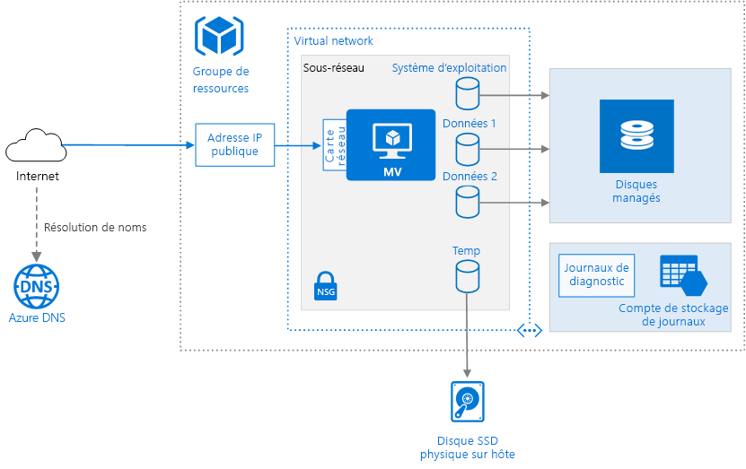

# <a name="run-a-linux-virtual-machine-on-azure"></a><span data-ttu-id="4d53b-103">Exécuter une machine virtuelle Linux dans Azure</span><span class="sxs-lookup"><span data-stu-id="4d53b-103">Run a Linux virtual machine on Azure</span></span>

<span data-ttu-id="4d53b-104">Le provisionnement d’une machine virtuelle Azure nécessite des composants supplémentaires en plus de la machine virtuelle elle-même, notamment des ressources réseau et de stockage.</span><span class="sxs-lookup"><span data-stu-id="4d53b-104">Provisioning a virtual machine (VM) in Azure requires some additional components besides the VM itself, including networking and storage resources.</span></span> <span data-ttu-id="4d53b-105">Cet article décrit les bonnes pratiques pour l’exécution d’une machine virtuelle Linux sur Azure.</span><span class="sxs-lookup"><span data-stu-id="4d53b-105">This article shows best practices for running a Linux VM on Azure.</span></span>



## <a name="resource-group"></a><span data-ttu-id="4d53b-107">Groupe de ressources</span><span class="sxs-lookup"><span data-stu-id="4d53b-107">Resource group</span></span>

<span data-ttu-id="4d53b-108">Un [groupe de ressources][resource-manager-overview] est un conteneur logique qui héberge les ressources Azure associées.</span><span class="sxs-lookup"><span data-stu-id="4d53b-108">A [resource group][resource-manager-overview] is a logical container that holds related Azure resources.</span></span> <span data-ttu-id="4d53b-109">En règle générale, regroupez les ressources en fonction de leur durée de vie et de qui va les gérer.</span><span class="sxs-lookup"><span data-stu-id="4d53b-109">In general, group resources based on their lifetime and who will manage them.</span></span>

<span data-ttu-id="4d53b-110">Placez les ressources étroitement associées qui partagent le même cycle de vie dans un même [groupe de ressources][resource-manager-overview].</span><span class="sxs-lookup"><span data-stu-id="4d53b-110">Put closely associated resources that share the same lifecycle into the same [resource group][resource-manager-overview].</span></span> <span data-ttu-id="4d53b-111">Les groupes de ressources vous permettent de déployer et de surveiller les ressources en tant que groupe et de suivre les coûts de facturation par groupe de ressources.</span><span class="sxs-lookup"><span data-stu-id="4d53b-111">Resource groups allow you to deploy and monitor resources as a group and track billing costs by resource group.</span></span> <span data-ttu-id="4d53b-112">Vous pouvez également supprimer des ressources comme un tout, ce qui est pratique pour les déploiements de test.</span><span class="sxs-lookup"><span data-stu-id="4d53b-112">You can also delete resources as a set, which is useful for test deployments.</span></span> <span data-ttu-id="4d53b-113">Affectez des noms de ressource explicites pour simplifier la recherche d’une ressource spécifique et comprendre son rôle.</span><span class="sxs-lookup"><span data-stu-id="4d53b-113">Assign meaningful resource names to simplify locating a specific resource and understanding its role.</span></span> <span data-ttu-id="4d53b-114">Pour plus d’informations, consultez [Conventions d’affectation de noms recommandées pour les ressources Azure][naming-conventions].</span><span class="sxs-lookup"><span data-stu-id="4d53b-114">For more information, see [Recommended Naming Conventions for Azure Resources][naming-conventions].</span></span>

## <a name="virtual-machine"></a><span data-ttu-id="4d53b-115">Machine virtuelle</span><span class="sxs-lookup"><span data-stu-id="4d53b-115">Virtual machine</span></span>

<span data-ttu-id="4d53b-116">Vous pouvez approvisionner une machine virtuelle issue d’une liste d’images publiées, d’une image managée personnalisée ou d’un fichier de disque dur virtuel (VHD) chargé(e) dans Stockage Blob Azure.</span><span class="sxs-lookup"><span data-stu-id="4d53b-116">You can provision a VM from a list of published images, or from a custom managed image or virtual hard disk (VHD) file uploaded to Azure Blob storage.</span></span>  <span data-ttu-id="4d53b-117">Azure prend en charge l’exécution de plusieurs distributions Linux populaires, y compris CentOS, Debian, Red Hat Enterprise, Ubuntu et FreeBSD.</span><span class="sxs-lookup"><span data-stu-id="4d53b-117">Azure supports running various popular Linux distributions, including CentOS, Debian, Red Hat Enterprise, Ubuntu, and FreeBSD.</span></span> <span data-ttu-id="4d53b-118">Pour en savoir plus, voir [Azure et Linux][azure-linux].</span><span class="sxs-lookup"><span data-stu-id="4d53b-118">For more information, see [Azure and Linux][azure-linux].</span></span>

<span data-ttu-id="4d53b-119">Azure propose de nombreuses tailles de machines virtuelles.</span><span class="sxs-lookup"><span data-stu-id="4d53b-119">Azure offers many different virtual machine sizes.</span></span> <span data-ttu-id="4d53b-120">Pour plus d’informations, consultez [Tailles des machines virtuelles sur Azure][virtual-machine-sizes].</span><span class="sxs-lookup"><span data-stu-id="4d53b-120">For more information, see [Sizes for virtual machines in Azure][virtual-machine-sizes].</span></span> <span data-ttu-id="4d53b-121">Si vous déplacez une charge de travail vers Azure, commencez par choisir la taille de machine virtuelle qui correspond le mieux à vos serveurs locaux.</span><span class="sxs-lookup"><span data-stu-id="4d53b-121">If you are moving an existing workload to Azure, start with the VM size that's the closest match to your on-premises servers.</span></span> <span data-ttu-id="4d53b-122">Mesurez ensuite les performances de votre charge de travail réelle en termes d’UC, de mémoire et d’opérations d’entrée/sortie par seconde du disque, puis ajustez la taille selon vos besoins.</span><span class="sxs-lookup"><span data-stu-id="4d53b-122">Then measure the performance of your actual workload in terms of CPU, memory, and disk input/output operations per second (IOPS), and adjust the size as needed.</span></span> 

<span data-ttu-id="4d53b-123">En général, choisissez une région Azure la plus proche possible de vos utilisateurs internes ou de vos clients.</span><span class="sxs-lookup"><span data-stu-id="4d53b-123">Generally, choose an Azure region that is closest to your internal users or customers.</span></span> <span data-ttu-id="4d53b-124">Certaines tailles de machine virtuelle ne sont pas disponibles dans toutes les régions.</span><span class="sxs-lookup"><span data-stu-id="4d53b-124">Not all VM sizes are available in all regions.</span></span> <span data-ttu-id="4d53b-125">Pour en savoir plus, consultez [Services par région][services-by-region].</span><span class="sxs-lookup"><span data-stu-id="4d53b-125">For more information, see [Services by region][services-by-region].</span></span> <span data-ttu-id="4d53b-126">Pour obtenir la liste des tailles de machine virtuelle disponibles dans une région spécifique, exécutez la commande suivante dans l’interface de ligne de commande (CLI) Azure :</span><span class="sxs-lookup"><span data-stu-id="4d53b-126">For a list of the VM sizes available in a specific region, run the following command from the Azure command-line interface (CLI):</span></span>

```azurecli
az vm list-sizes --location <location>
```

<span data-ttu-id="4d53b-127">Pour en savoir plus sur le choix d’une image de machine virtuelle publiée, voir [Comment rechercher des images de machine virtuelle Linux][select-vm-image].</span><span class="sxs-lookup"><span data-stu-id="4d53b-127">For information about choosing a published VM image, see [Find Linux VM images][select-vm-image].</span></span>

## <a name="disks"></a><span data-ttu-id="4d53b-128">Disques</span><span class="sxs-lookup"><span data-stu-id="4d53b-128">Disks</span></span>

<span data-ttu-id="4d53b-129">Pour optimiser les performances d’E/S du disque, nous vous recommandons le [Stockage Premium][premium-storage], qui stocke les données sur des disques SSD.</span><span class="sxs-lookup"><span data-stu-id="4d53b-129">For best disk I/O performance, we recommend [Premium Storage][premium-storage], which stores data on solid-state drives (SSDs).</span></span> <span data-ttu-id="4d53b-130">Le coût est basé sur la capacité du disque approvisionné.</span><span class="sxs-lookup"><span data-stu-id="4d53b-130">Cost is based on the capacity of the provisioned disk.</span></span> <span data-ttu-id="4d53b-131">Le nombre d’E/S par seconde et le débit (c’est-à-dire le taux de transfert des données) dépendent également de la taille du disque. Lorsque vous approvisionnez un disque, vous devez donc tenir compte des trois facteurs : capacité, E/S par seconde et débit.</span><span class="sxs-lookup"><span data-stu-id="4d53b-131">IOPS and throughput (that is, data transfer rate) also depend on disk size, so when you provision a disk, consider all three factors (capacity, IOPS, and throughput).</span></span>

<span data-ttu-id="4d53b-132">Nous vous recommandons également d’utiliser des [disques managés][managed-disks].</span><span class="sxs-lookup"><span data-stu-id="4d53b-132">We also recommend using [Managed Disks][managed-disks].</span></span> <span data-ttu-id="4d53b-133">Les disques managés simplifient la gestion des disques en gérant le stockage pour vous.</span><span class="sxs-lookup"><span data-stu-id="4d53b-133">Managed disks simplify disk management by handling the storage for you.</span></span> <span data-ttu-id="4d53b-134">Les disques managés ne nécessitent pas de compte de stockage.</span><span class="sxs-lookup"><span data-stu-id="4d53b-134">Managed disks do not require a storage account.</span></span> <span data-ttu-id="4d53b-135">Il vous suffit de spécifier leur taille et leur type, puis de les déployer en tant que ressource à haute disponibilité.</span><span class="sxs-lookup"><span data-stu-id="4d53b-135">You simply specify the size and type of disk and it is deployed as a highly available resource</span></span>

<span data-ttu-id="4d53b-136">Le disque du système d’exploitation est un disque dur virtuel stocké dans [Stockage Azure][azure-storage], donc il persiste même lorsque l’ordinateur hôte est arrêté.</span><span class="sxs-lookup"><span data-stu-id="4d53b-136">The OS disk is a VHD stored in [Azure Storage][azure-storage], so it persists even when the host machine is down.</span></span>  <span data-ttu-id="4d53b-137">Pour les machines virtuelles Linux, le disque du système d’exploitation est `/dev/sda1`.</span><span class="sxs-lookup"><span data-stu-id="4d53b-137">For Linux VMs, the OS disk is `/dev/sda1`.</span></span> <span data-ttu-id="4d53b-138">Nous vous recommandons également de créer un ou plusieurs [disques de données][data-disk], qui sont des disques durs virtuels persistants utilisés pour les données d’application.</span><span class="sxs-lookup"><span data-stu-id="4d53b-138">We also recommend creating one or more [data disks][data-disk], which are persistent VHDs used for application data.</span></span>

<span data-ttu-id="4d53b-139">Lorsque vous créez un disque dur virtuel, il n’est pas formaté.</span><span class="sxs-lookup"><span data-stu-id="4d53b-139">When you create a VHD, it is unformatted.</span></span> <span data-ttu-id="4d53b-140">Connectez-vous à la machine virtuelle pour formater le disque.</span><span class="sxs-lookup"><span data-stu-id="4d53b-140">Log into the VM to format the disk.</span></span> <span data-ttu-id="4d53b-141">Dans l’interpréteur de commandes Linux, les disques de données sont affichés en tant que `/dev/sdc`, `/dev/sdd`, et ainsi de suite.</span><span class="sxs-lookup"><span data-stu-id="4d53b-141">In the Linux shell, data disks are displayed as `/dev/sdc`, `/dev/sdd`, and so on.</span></span> <span data-ttu-id="4d53b-142">Vous pouvez exécuter `lsblk` pour répertorier les périphériques de bloc, y compris les disques.</span><span class="sxs-lookup"><span data-stu-id="4d53b-142">You can run `lsblk` to list the block devices, including the disks.</span></span> <span data-ttu-id="4d53b-143">Pour utiliser un disque de données, créez une partition et un système de fichiers, puis montez le disque.</span><span class="sxs-lookup"><span data-stu-id="4d53b-143">To use a data disk, create a partition and file system, and mount the disk.</span></span> <span data-ttu-id="4d53b-144">Par exemple : </span><span class="sxs-lookup"><span data-stu-id="4d53b-144">For example:</span></span>

```bash
# Create a partition.
sudo fdisk /dev/sdc     # Enter 'n' to partition, 'w' to write the change.

# Create a file system.
sudo mkfs -t ext3 /dev/sdc1

# Mount the drive.
sudo mkdir /data1
sudo mount /dev/sdc1 /data1
```

<span data-ttu-id="4d53b-145">Lorsque vous ajoutez un disque de données, un numéro d’unité logique (LUN) lui est attribué.</span><span class="sxs-lookup"><span data-stu-id="4d53b-145">When you add a data disk, a logical unit number (LUN) ID is assigned to the disk.</span></span> <span data-ttu-id="4d53b-146">Vous pouvez également spécifier l’ID LUN, par exemple si vous remplacez un disque et souhaitez conserver le même ID LUN, ou si votre application nécessite un ID LUN spécifique.</span><span class="sxs-lookup"><span data-stu-id="4d53b-146">Optionally, you can specify the LUN ID &mdash; for example, if you're replacing a disk and want to retain the same LUN ID, or you have an application that looks for a specific LUN ID.</span></span> <span data-ttu-id="4d53b-147">Toutefois, n’oubliez pas que les ID LUN doivent être uniques pour chaque disque.</span><span class="sxs-lookup"><span data-stu-id="4d53b-147">However, remember that LUN IDs must be unique for each disk.</span></span>

<span data-ttu-id="4d53b-148">Vous pouvez modifier le planificateur d’E/S afin d’optimiser les performances des disques SSD, les disques des machines virtuelles associées à des comptes de Stockage Premium étant de type SSD.</span><span class="sxs-lookup"><span data-stu-id="4d53b-148">You may want to change the I/O scheduler to optimize for performance on SSDs because the disks for VMs with premium storage accounts are SSDs.</span></span> <span data-ttu-id="4d53b-149">Il est généralement recommandé d’utiliser le planificateur NOOP pour les disques SSD, mais vous devez utiliser un outil tel que [iostat] pour surveiller les performances d’E/S du disque pour votre charge de travail.</span><span class="sxs-lookup"><span data-stu-id="4d53b-149">A common recommendation is to use the NOOP scheduler for SSDs, but you should use a tool such as [iostat] to monitor disk I/O performance for your workload.</span></span>

<span data-ttu-id="4d53b-150">La machine virtuelle est créée avec un disque temporaire.</span><span class="sxs-lookup"><span data-stu-id="4d53b-150">The VM is created with a temporary disk.</span></span> <span data-ttu-id="4d53b-151">Ce disque est stocké sur un lecteur physique de l’ordinateur hôte.</span><span class="sxs-lookup"><span data-stu-id="4d53b-151">This disk is stored on a physical drive on the host machine.</span></span> <span data-ttu-id="4d53b-152">Il n’est *pas* enregistré dans Stockage Azure et peut être supprimé lors des redémarrages ou d’autres événements de cycle de vie de la machine virtuelle.</span><span class="sxs-lookup"><span data-stu-id="4d53b-152">It is *not* saved in Azure Storage and may be deleted during reboots and other VM lifecycle events.</span></span> <span data-ttu-id="4d53b-153">N’utilisez ce disque que pour des données temporaires, telles que des fichiers de pagination ou d’échange.</span><span class="sxs-lookup"><span data-stu-id="4d53b-153">Use this disk only for temporary data, such as page or swap files.</span></span> <span data-ttu-id="4d53b-154">Pour les machines virtuelles Linux, le disque temporaire est `/dev/sdb1`. Il est monté sur `/mnt/resource` ou `/mnt`.</span><span class="sxs-lookup"><span data-stu-id="4d53b-154">For Linux VMs, the temporary disk is `/dev/sdb1` and is mounted at `/mnt/resource` or `/mnt`.</span></span>

## <a name="network"></a><span data-ttu-id="4d53b-155">Réseau</span><span class="sxs-lookup"><span data-stu-id="4d53b-155">Network</span></span>

<span data-ttu-id="4d53b-156">Les composants réseau incluent les ressources suivantes :</span><span class="sxs-lookup"><span data-stu-id="4d53b-156">The networking components include the following resources:</span></span>

- <span data-ttu-id="4d53b-157">**Réseau virtuel**.</span><span class="sxs-lookup"><span data-stu-id="4d53b-157">**Virtual network**.</span></span> <span data-ttu-id="4d53b-158">Chaque machine virtuelle est déployée dans un réseau virtuel qui peut être segmenté en plusieurs sous-réseaux.</span><span class="sxs-lookup"><span data-stu-id="4d53b-158">Every VM is deployed into a virtual network that can be segmented into multiple subnets.</span></span>

- <span data-ttu-id="4d53b-159">**Interfaces réseau (NIC)**.</span><span class="sxs-lookup"><span data-stu-id="4d53b-159">**Network interface (NIC)**.</span></span> <span data-ttu-id="4d53b-160">La carte d’interface réseau permet à la machine virtuelle de communiquer avec le réseau virtuel.</span><span class="sxs-lookup"><span data-stu-id="4d53b-160">The NIC enables the VM to communicate with the virtual network.</span></span> <span data-ttu-id="4d53b-161">Si vous avez besoin de plusieurs cartes réseau (NIC) pour votre machine virtuelle, notez que le nombre maximal de cartes réseau est défini pour chaque [taille de machine virtuelle][vm-size-tables].</span><span class="sxs-lookup"><span data-stu-id="4d53b-161">If you need multiple NICs for your VM, be aware that a maximum number of NICs is defined for each [VM size][vm-size-tables].</span></span>

- <span data-ttu-id="4d53b-162">**Adresse IP publique**.</span><span class="sxs-lookup"><span data-stu-id="4d53b-162">**Public IP address**.</span></span> <span data-ttu-id="4d53b-163">Une adresse IP publique est nécessaire pour communiquer avec la machine virtuelle &mdash; par exemple via le protocole RDP.</span><span class="sxs-lookup"><span data-stu-id="4d53b-163">A public IP address is needed to communicate with the VM &mdash; for example, via remote desktop (RDP).</span></span> <span data-ttu-id="4d53b-164">Cette adresse IP publique peut être dynamique ou statique.</span><span class="sxs-lookup"><span data-stu-id="4d53b-164">The public IP address can be dynamic or static.</span></span> <span data-ttu-id="4d53b-165">Par défaut, elle est dynamique.</span><span class="sxs-lookup"><span data-stu-id="4d53b-165">The default is dynamic.</span></span>

- <span data-ttu-id="4d53b-166">Utilisez une [adresse IP statique][static-ip] si vous avez besoin d’une adresse IP non modifiable &mdash; par exemple si vous devez créer un enregistrement « A » dans le DNS ou ajouter l’adresse IP dans une liste sécurisée.</span><span class="sxs-lookup"><span data-stu-id="4d53b-166">Reserve a [static IP address][static-ip] if you need a fixed IP address that won't change &mdash; for example, if you need to create a DNS 'A' record or add the IP address to a safe list.</span></span>
- <span data-ttu-id="4d53b-167">Vous pouvez également créer un nom de domaine complet (FQDN) pour l’adresse IP.</span><span class="sxs-lookup"><span data-stu-id="4d53b-167">You can also create a fully qualified domain name (FQDN) for the IP address.</span></span> <span data-ttu-id="4d53b-168">Vous pouvez inscrire un [enregistrement CNAME][cname-record] dans le DNS qui pointe vers le nom de domaine complet (FQDN).</span><span class="sxs-lookup"><span data-stu-id="4d53b-168">You can then register a [CNAME record][cname-record] in DNS that points to the FQDN.</span></span> <span data-ttu-id="4d53b-169">Pour en savoir plus, voir [Créer un nom de domaine complet dans le Portail Azure][fqdn].</span><span class="sxs-lookup"><span data-stu-id="4d53b-169">For more information, see [Create a fully qualified domain name in the Azure portal][fqdn].</span></span>

- <span data-ttu-id="4d53b-170">**Groupe de sécurité réseau**.</span><span class="sxs-lookup"><span data-stu-id="4d53b-170">**Network security group (NSG)**.</span></span> <span data-ttu-id="4d53b-171">Les [groupes de sécurité réseau][nsg] sont utilisés pour autoriser ou refuser le trafic réseau vers des machines virtuelles.</span><span class="sxs-lookup"><span data-stu-id="4d53b-171">[Network security groups][nsg] are used to allow or deny network traffic to VMs.</span></span> <span data-ttu-id="4d53b-172">Les groupes de sécurité réseau peuvent être associés à des sous-réseaux ou à des instances de machine virtuelle individuelles.</span><span class="sxs-lookup"><span data-stu-id="4d53b-172">NSGs can be associated either with subnets or with individual VM instances.</span></span>

<span data-ttu-id="4d53b-173">Tous les groupes de sécurité réseau contiennent un ensemble de [règles par défaut][nsg-default-rules], notamment une règle qui bloque tout le trafic Internet entrant.</span><span class="sxs-lookup"><span data-stu-id="4d53b-173">All NSGs contain a set of [default rules][nsg-default-rules], including a rule that blocks all inbound Internet traffic.</span></span> <span data-ttu-id="4d53b-174">Les règles par défaut ne peuvent pas être supprimées, mais d’autres règles peuvent les remplacer.</span><span class="sxs-lookup"><span data-stu-id="4d53b-174">The default rules cannot be deleted, but other rules can override them.</span></span> <span data-ttu-id="4d53b-175">Pour autoriser le trafic Internet, créez des règles qui autorisent le trafic entrant vers des ports spécifiques, par exemple, le port 80 pour HTTP.</span><span class="sxs-lookup"><span data-stu-id="4d53b-175">To enable Internet traffic, create rules that allow inbound traffic to specific ports &mdash; for example, port 80 for HTTP.</span></span> <span data-ttu-id="4d53b-176">Pour activer le protocole SSH, ajoutez une règle de groupe de sécurité réseau qui autorise le trafic entrant sur le port TCP 22.</span><span class="sxs-lookup"><span data-stu-id="4d53b-176">To enable SSH, add an NSG rule that allows inbound traffic to TCP port 22.</span></span>

## <a name="operations"></a><span data-ttu-id="4d53b-177">Opérations</span><span class="sxs-lookup"><span data-stu-id="4d53b-177">Operations</span></span>

<span data-ttu-id="4d53b-178">**SSH**.</span><span class="sxs-lookup"><span data-stu-id="4d53b-178">**SSH**.</span></span> <span data-ttu-id="4d53b-179">Avant de créer une machine virtuelle Linux, générez une paire de clés publique-privée RSA 2048 bits.</span><span class="sxs-lookup"><span data-stu-id="4d53b-179">Before you create a Linux VM, generate a 2048-bit RSA public-private key pair.</span></span> <span data-ttu-id="4d53b-180">Utilisez le fichier de clé publique lorsque vous créez la machine virtuelle.</span><span class="sxs-lookup"><span data-stu-id="4d53b-180">Use the public key file when you create the VM.</span></span> <span data-ttu-id="4d53b-181">Pour en savoir plus, voir [Utilisation de SSH avec Linux et Mac sur Azure][ssh-linux].</span><span class="sxs-lookup"><span data-stu-id="4d53b-181">For more information, see [How to Use SSH with Linux and Mac on Azure][ssh-linux].</span></span>

<span data-ttu-id="4d53b-182">**Diagnostics**.</span><span class="sxs-lookup"><span data-stu-id="4d53b-182">**Diagnostics**.</span></span> <span data-ttu-id="4d53b-183">Permet la surveillance et le diagnostic, avec notamment des indicateurs d’intégrité de base, des journaux d’infrastructure de diagnostic et des [diagnostics de démarrage][boot-diagnostics].</span><span class="sxs-lookup"><span data-stu-id="4d53b-183">Enable monitoring and diagnostics, including basic health metrics, diagnostics infrastructure logs, and [boot diagnostics][boot-diagnostics].</span></span> <span data-ttu-id="4d53b-184">Les diagnostics de démarrage peuvent vous aider à identifier le problème de démarrage si votre machine virtuelle refuse de démarrer.</span><span class="sxs-lookup"><span data-stu-id="4d53b-184">Boot diagnostics can help you diagnose boot failure if your VM gets into a non-bootable state.</span></span> <span data-ttu-id="4d53b-185">Créez un compte de stockage Azure pour stocker les journaux.</span><span class="sxs-lookup"><span data-stu-id="4d53b-185">Create an Azure Storage account to store the logs.</span></span> <span data-ttu-id="4d53b-186">Un compte de stockage localement redondant (LRS) standard suffit pour les journaux de diagnostic.</span><span class="sxs-lookup"><span data-stu-id="4d53b-186">A standard locally redundant storage (LRS) account is sufficient for diagnostic logs.</span></span> <span data-ttu-id="4d53b-187">Pour en savoir plus, voir [Activation de la surveillance et des diagnostics][enable-monitoring].</span><span class="sxs-lookup"><span data-stu-id="4d53b-187">For more information, see [Enable monitoring and diagnostics][enable-monitoring].</span></span>

<span data-ttu-id="4d53b-188">**Disponibilité**.</span><span class="sxs-lookup"><span data-stu-id="4d53b-188">**Availability**.</span></span> <span data-ttu-id="4d53b-189">Votre machine virtuelle peut être affectée par la [maintenance planifiée][planned-maintenance] ou un [temps d’arrêt non planifiée][manage-vm-availability].</span><span class="sxs-lookup"><span data-stu-id="4d53b-189">Your VM may be affected by [planned maintenance][planned-maintenance] or [unplanned downtime][manage-vm-availability].</span></span> <span data-ttu-id="4d53b-190">Vous pouvez utiliser les [journaux de redémarrage de machine virtuelle][reboot-logs] pour déterminer si un redémarrage de la machine virtuelle a été provoqué par une maintenance planifiée.</span><span class="sxs-lookup"><span data-stu-id="4d53b-190">You can use [VM reboot logs][reboot-logs] to determine whether a VM reboot was caused by planned maintenance.</span></span> <span data-ttu-id="4d53b-191">Pour bénéficier d’une disponibilité plus élevée, déployez plusieurs machines virtuelles dans un [groupe à haute disponibilité](/azure/virtual-machines/linux/manage-availability#configure-multiple-virtual-machines-in-an-availability-set-for-redundancy).</span><span class="sxs-lookup"><span data-stu-id="4d53b-191">For higher availability, deploy multiple VMs in an [availability set](/azure/virtual-machines/linux/manage-availability#configure-multiple-virtual-machines-in-an-availability-set-for-redundancy).</span></span> <span data-ttu-id="4d53b-192">Cette configuration offre un [contrat de niveau de service (SLA)][vm-sla] supérieur.</span><span class="sxs-lookup"><span data-stu-id="4d53b-192">This configuration provides a higher [service level agreement (SLA)][vm-sla].</span></span>

<span data-ttu-id="4d53b-193">**Sauvegardes** : pour vous protéger contre la perte accidentelle de données, utilisez le service [Sauvegarde Azure](/azure/backup/) pour sauvegarder vos machines virtuelles dans un stockage géoredondant.</span><span class="sxs-lookup"><span data-stu-id="4d53b-193">**Backups** To protect against accidental data loss, use the [Azure Backup](/azure/backup/) service to back up your VMs to geo-redundant storage.</span></span> <span data-ttu-id="4d53b-194">Sauvegarde Azure offre des sauvegardes cohérentes avec les applications.</span><span class="sxs-lookup"><span data-stu-id="4d53b-194">Azure Backup provides application-consistent backups.</span></span>

<span data-ttu-id="4d53b-195">**Arrêt d’une machine virtuelle**.</span><span class="sxs-lookup"><span data-stu-id="4d53b-195">**Stopping a VM**.</span></span> <span data-ttu-id="4d53b-196">Azure établit une distinction entre les états « arrêté » et « désalloué ».</span><span class="sxs-lookup"><span data-stu-id="4d53b-196">Azure makes a distinction between "stopped" and "deallocated" states.</span></span> <span data-ttu-id="4d53b-197">Vous payez lorsque l’état de la machine virtuelle est « arrêté », mais pas lorsque la machine virtuelle est désallouée.</span><span class="sxs-lookup"><span data-stu-id="4d53b-197">You are charged when the VM status is stopped, but not when the VM is deallocated.</span></span> <span data-ttu-id="4d53b-198">Le bouton **Arrêter** du portail Azure désalloue la machine virtuelle.</span><span class="sxs-lookup"><span data-stu-id="4d53b-198">In the Azure portal, the **Stop** button deallocates the VM.</span></span> <span data-ttu-id="4d53b-199">Si vous arrêtez la machine virtuelle par le biais du système d’exploitation pendant que vous êtes connecté, la machine virtuelle est arrêtée mais **non** désallouée. Vous serez donc toujours facturé.</span><span class="sxs-lookup"><span data-stu-id="4d53b-199">If you shut down through the OS while logged in, the VM is stopped but **not** deallocated, so you will still be charged.</span></span>

<span data-ttu-id="4d53b-200">**Suppression d’une machine virtuelle**.</span><span class="sxs-lookup"><span data-stu-id="4d53b-200">**Deleting a VM**.</span></span> <span data-ttu-id="4d53b-201"> La suppression d’une machine virtuelle n’entraîne pas celle des disques durs virtuels.</span><span class="sxs-lookup"><span data-stu-id="4d53b-201">If you delete a VM, the VHDs are not deleted.</span></span> <span data-ttu-id="4d53b-202">Vous pouvez donc supprimer la machine virtuelle, sans risque de perdre des données.</span><span class="sxs-lookup"><span data-stu-id="4d53b-202">That means you can safely delete the VM without losing data.</span></span> <span data-ttu-id="4d53b-203">Toutefois, vous serez toujours facturé pour le stockage.</span><span class="sxs-lookup"><span data-stu-id="4d53b-203">However, you will still be charged for storage.</span></span> <span data-ttu-id="4d53b-204">Pour supprimer le disque dur virtuel, supprimez le fichier de [Stockage Blob][blob-storage].</span><span class="sxs-lookup"><span data-stu-id="4d53b-204">To delete the VHD, delete the file from [Blob storage][blob-storage].</span></span> <span data-ttu-id="4d53b-205">Pour éviter toute suppression accidentelle, utilisez un [verrou de ressource][resource-lock] pour verrouiller tout le groupe de ressources ou des ressources individuelles, par exemple une machine virtuelle.</span><span class="sxs-lookup"><span data-stu-id="4d53b-205">To prevent accidental deletion, use a [resource lock][resource-lock] to lock the entire resource group or lock individual resources, such as a VM.</span></span>

## <a name="security-considerations"></a><span data-ttu-id="4d53b-206">Considérations relatives à la sécurité</span><span class="sxs-lookup"><span data-stu-id="4d53b-206">Security considerations</span></span>

<span data-ttu-id="4d53b-207">[Azure Security Center][security-center] vous offre un aperçu global de l’état de toutes vos ressources Azure en termes de sécurité.</span><span class="sxs-lookup"><span data-stu-id="4d53b-207">Use [Azure Security Center][security-center] to get a central view of the security state of your Azure resources.</span></span> <span data-ttu-id="4d53b-208">Il surveille les problèmes potentiels de sécurité et fournit une image complète de la sécurité de votre déploiement.</span><span class="sxs-lookup"><span data-stu-id="4d53b-208">Security Center monitors potential security issues and provides a comprehensive picture of the security health of your deployment.</span></span> <span data-ttu-id="4d53b-209">Le Centre de sécurité est configuré pour chaque abonnement Azure.</span><span class="sxs-lookup"><span data-stu-id="4d53b-209">Security Center is configured per Azure subscription.</span></span> <span data-ttu-id="4d53b-210">Activez la collecte de données de sécurité comme décrit dans [Intégrer un abonnement Azure à Security Center Standard][security-center-get-started].</span><span class="sxs-lookup"><span data-stu-id="4d53b-210">Enable security data collection as described in [Onboard your Azure subscription to Security Center Standard][security-center-get-started].</span></span> <span data-ttu-id="4d53b-211">Une fois la collecte de données activée, le Centre de sécurité analyse automatiquement les machines virtuelles créées dans le cadre de cet abonnement.</span><span class="sxs-lookup"><span data-stu-id="4d53b-211">When data collection is enabled, Security Center automatically scans any VMs created under that subscription.</span></span>

<span data-ttu-id="4d53b-212">**Gestion des correctifs**.</span><span class="sxs-lookup"><span data-stu-id="4d53b-212">**Patch management**.</span></span> <span data-ttu-id="4d53b-213">Si cette option est activée, Security Center vérifie si des mises à jour critiques et de sécurité sont manquantes.</span><span class="sxs-lookup"><span data-stu-id="4d53b-213">If enabled, Security Center checks whether any security and critical updates are missing.</span></span> <span data-ttu-id="4d53b-214">Utilisez [Paramètres de stratégie de groupe][stratégie de groupe] sur la machine virtuelle pour activer les mises à jour automatiques du système.</span><span class="sxs-lookup"><span data-stu-id="4d53b-214">Use [Group Policy settings][group-policy] on the VM to enable automatic system updates.</span></span>

<span data-ttu-id="4d53b-215">**Logiciel anti-programme malveillant**.</span><span class="sxs-lookup"><span data-stu-id="4d53b-215">**Antimalware**.</span></span> <span data-ttu-id="4d53b-216"> Si cette option est activée, le Centre de sécurité vérifie si un logiciel anti-programme malveillant est installé.</span><span class="sxs-lookup"><span data-stu-id="4d53b-216">If enabled, Security Center checks whether antimalware software is installed.</span></span> <span data-ttu-id="4d53b-217">Vous pouvez également utiliser le Centre de sécurité pour installer des logiciels anti-programme malveillant dans le portail Azure.</span><span class="sxs-lookup"><span data-stu-id="4d53b-217">You can also use Security Center to install antimalware software from inside the Azure portal.</span></span>

<span data-ttu-id="4d53b-218">**Contrôle d’accès**.</span><span class="sxs-lookup"><span data-stu-id="4d53b-218">**Access control**.</span></span> <span data-ttu-id="4d53b-219">Utilisez le [contrôle d’accès en fonction du rôle (RBAC)][rbac] pour contrôler l’accès aux ressources Azure.</span><span class="sxs-lookup"><span data-stu-id="4d53b-219">Use [role-based access control (RBAC)][rbac] to control access to Azure resources.</span></span> <span data-ttu-id="4d53b-220">Le contrôle RBAC vous permet d’affecter des rôles d’autorisation aux membres de votre équipe DevOps.</span><span class="sxs-lookup"><span data-stu-id="4d53b-220">RBAC lets you assign authorization roles to members of your DevOps team.</span></span> <span data-ttu-id="4d53b-221">Par exemple, le rôle Lecteur permet d’afficher des ressources Azure mais pas de les créer, gérer ou supprimer.</span><span class="sxs-lookup"><span data-stu-id="4d53b-221">For example, the Reader role can view Azure resources but not create, manage, or delete them.</span></span> <span data-ttu-id="4d53b-222">Certaines autorisations sont spécifiques à un type de ressource Azure.</span><span class="sxs-lookup"><span data-stu-id="4d53b-222">Some permissions are specific to an Azure resource type.</span></span> <span data-ttu-id="4d53b-223">Par exemple, le rôle Contributeur de machine virtuelle peut redémarrer ou désallouer une machine virtuelle, réinitialiser le mot de passe administrateur, créer une machine virtuelle, et ainsi de suite.</span><span class="sxs-lookup"><span data-stu-id="4d53b-223">For example, the Virtual Machine Contributor role can restart or deallocate a VM, reset the administrator password, create a new VM, and so on.</span></span> <span data-ttu-id="4d53b-224">D’autres [rôles RBAC intégrés][rbac-roles] peuvent être utiles dans cette architecture, notamment [Utilisateur DevTest Lab][rbac-devtest] et [Collaborateur de réseau][rbac-network].</span><span class="sxs-lookup"><span data-stu-id="4d53b-224">Other [built-in RBAC roles][rbac-roles] that may be useful for this architecture include [DevTest Labs User][rbac-devtest] and [Network Contributor][rbac-network].</span></span>

> [!NOTE]
> <span data-ttu-id="4d53b-225">Le contrôle RBAC ne limite pas les actions qu’un utilisateur connecté peut effectuer sur une machine virtuelle.</span><span class="sxs-lookup"><span data-stu-id="4d53b-225">RBAC does not limit the actions that a user logged into a VM can perform.</span></span> <span data-ttu-id="4d53b-226">Ces autorisations dépendent du type de compte installé sur le système d’exploitation invité.</span><span class="sxs-lookup"><span data-stu-id="4d53b-226">Those permissions are determined by the account type on the guest OS.</span></span>

<span data-ttu-id="4d53b-227">**Journaux d’audit**.</span><span class="sxs-lookup"><span data-stu-id="4d53b-227">**Audit logs**.</span></span> <span data-ttu-id="4d53b-228">Utilisez les [journaux d’audit][audit-logs] pour voir les actions d’approvisionnement et d’autres événements concernant la machine virtuelle.</span><span class="sxs-lookup"><span data-stu-id="4d53b-228">Use [audit logs][audit-logs] to see provisioning actions and other VM events.</span></span>

<span data-ttu-id="4d53b-229">**Chiffrement des données**.</span><span class="sxs-lookup"><span data-stu-id="4d53b-229">**Data encryption**.</span></span> <span data-ttu-id="4d53b-230">Utilisez [Azure Disk Encryption][disk-encryption] si vous devez chiffrer les disques du système d’exploitation et de données.</span><span class="sxs-lookup"><span data-stu-id="4d53b-230">Use [Azure Disk Encryption][disk-encryption] if you need to encrypt the OS and data disks.</span></span>

## <a name="next-steps"></a><span data-ttu-id="4d53b-231">Étapes suivantes</span><span class="sxs-lookup"><span data-stu-id="4d53b-231">Next steps</span></span>

- <span data-ttu-id="4d53b-232">Pour provisionner une machine virtuelle Linux, consultez [Créer et gérer des machines virtuelles Linux avec l’interface Azure CLI](/azure/virtual-machines/linux/tutorial-manage-vm).</span><span class="sxs-lookup"><span data-stu-id="4d53b-232">To provision a Linux VM, see [Create and Manage Linux VMs with the Azure CLI](/azure/virtual-machines/linux/tutorial-manage-vm)</span></span>
- <span data-ttu-id="4d53b-233">Pour une architecture multiniveau complète sur des machines virtuelles Linux, consultez [Architecture multiniveau Linux dans Azure avec Apache Cassandra](./n-tier-cassandra.md).</span><span class="sxs-lookup"><span data-stu-id="4d53b-233">For a complete N-tier architecture on Linux VMs, see [Linux N-tier application in Azure with Apache Cassandra](./n-tier-cassandra.md).</span></span>

<!-- links -->
[audit-logs]: https://azure.microsoft.com/blog/analyze-azure-audit-logs-in-powerbi-more/
[azure-linux]: /azure/virtual-machines/virtual-machines-linux-azure-overview
[azure-storage]: /azure/storage/storage-introduction
[blob-storage]: /azure/storage/storage-introduction
[boot-diagnostics]: https://azure.microsoft.com/blog/boot-diagnostics-for-virtual-machines-v2/
[cname-record]: https://en.wikipedia.org/wiki/CNAME_record
[data-disk]: /azure/virtual-machines/virtual-machines-linux-about-disks-vhds
[disk-encryption]: /azure/security/azure-security-disk-encryption
[enable-monitoring]: /azure/monitoring-and-diagnostics/insights-how-to-use-diagnostics
[fqdn]: /azure/virtual-machines/virtual-machines-linux-portal-create-fqdn
[iostat]: https://en.wikipedia.org/wiki/Iostat
[manage-vm-availability]: /azure/virtual-machines/virtual-machines-linux-manage-availability
[managed-disks]: /azure/storage/storage-managed-disks-overview
[naming-conventions]: ../../best-practices/naming-conventions.md
[nsg]: /azure/virtual-network/virtual-networks-nsg
[nsg-default-rules]: /azure/virtual-network/virtual-networks-nsg#default-rules
[planned-maintenance]: /azure/virtual-machines/virtual-machines-linux-planned-maintenance
[premium-storage]: /azure/virtual-machines/linux/premium-storage
[rbac]: /azure/active-directory/role-based-access-control-what-is
[rbac-roles]: /azure/active-directory/role-based-access-built-in-roles
[rbac-devtest]: /azure/active-directory/role-based-access-built-in-roles#devtest-labs-user
[rbac-network]: /azure/active-directory/role-based-access-built-in-roles#network-contributor
[reboot-logs]: https://azure.microsoft.com/blog/viewing-vm-reboot-logs/
[resource-lock]: /azure/resource-group-lock-resources
[resource-manager-overview]: /azure/azure-resource-manager/resource-group-overview
[security-center]: /azure/security-center/security-center-intro
[security-center-get-started]: /azure/security-center/security-center-get-started
[select-vm-image]: /azure/virtual-machines/virtual-machines-linux-cli-ps-findimage
[services-by-region]: https://azure.microsoft.com/regions/#services
[ssh-linux]: /azure/virtual-machines/virtual-machines-linux-mac-create-ssh-keys
[static-ip]: /azure/virtual-network/virtual-networks-reserved-public-ip
[virtual-machine-sizes]: /azure/virtual-machines/virtual-machines-linux-sizes
[visio-download]: https://archcenter.blob.core.windows.net/cdn/vm-reference-architectures.vsdx
[vm-size-tables]: /azure/virtual-machines/virtual-machines-linux-sizes
[vm-sla]: https://azure.microsoft.com/support/legal/sla/virtual-machines
