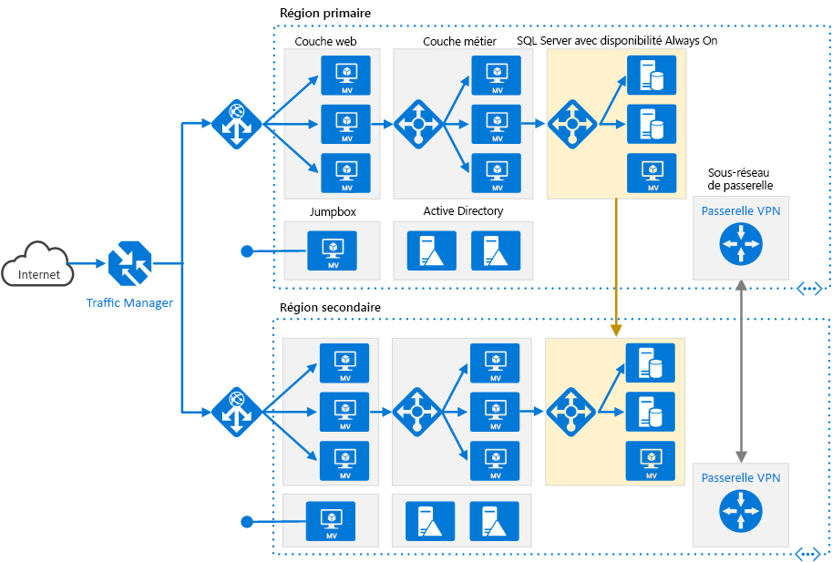

# <a name="run-an-n-tier-application-in-multiple-azure-regions-for-high-availability"></a>Exécuter une application multiniveau dans plusieurs régions pour une haute disponibilité

Cette architecture de référence présente un ensemble de pratiques éprouvées pour l’exécution d’une application multiniveau dans plusieurs régions Azure, afin de bénéficier d’une haute disponibilité et d’une infrastructure de récupération d’urgence fiable.



*Téléchargez un [fichier Visio][visio-download] de cette architecture.*

## <a name="architecture"></a>Architecture

Cette architecture repose sur celle décrite dans l’article [Application multiniveau avec SQL Server](n-tier-sql-server.md).

- **Régions primaires et secondaires**. Pour obtenir une plus haute disponibilité, utilisez deux régions. L’une est la région primaire, tandis que l’autre sert au basculement.

- **Azure Traffic Manager**. [Traffic Manager][traffic-manager] achemine les requêtes entrantes vers l’une des régions. Pendant le fonctionnement normal, il achemine les requêtes vers la région primaire. Si cette région n’est plus disponible, Traffic Manager bascule vers la région secondaire. Pour plus d’informations, consultez la section [Configuration de Traffic Manager](#traffic-manager-configuration).

- **Groupes de ressources**. Créez des [groupes de ressources][resource groups] distincts pour la région primaire, la région secondaire et Traffic Manager. Vous obtenez ainsi la flexibilité nécessaire pour gérer chaque région comme une collection de ressources unique. Par exemple, vous pourriez redéployer une région sans arrêter l’autre. [Liez les groupes de ressources][resource-group-links] afin de pouvoir exécuter une requête pour répertorier toutes les ressources de l’application.

- **Réseaux virtuels**. Créez un réseau virtuel distinct pour chaque région. Vérifiez que les espaces d’adressage ne se chevauchent pas.

- **Groupe de disponibilité SQL Server AlwaysOn**. Si vous utilisez SQL Server, nous vous recommandons d’utiliser des [groupes de disponibilité AlwaysOn SQL][sql-always-on] pour la haute disponibilité. Créez un groupe de disponibilité unique qui comprend les instances de SQL Server dans les deux régions.

    > [!NOTE]
    > Vous pouvez aussi utiliser [Azure SQL Database][azure-sql-db], qui fournit une base de données relationnelle en tant que service cloud. Avec SQL Database, vous n’avez pas besoin de configurer de groupe de disponibilité ni de gérer le basculement.
    >

- **Passerelles VPN**. Créez une [passerelle VPN][vpn-gateway] dans chaque réseau virtuel et configurez une [connexion de réseau virtuel à réseau virtuel][vnet-to-vnet] afin d’autoriser le trafic réseau entre les deux réseaux virtuels. Ceci est obligatoire pour le groupe de disponibilité AlwaysOn SQL.

## <a name="recommendations"></a>Recommandations

Une architecture multirégion peut offrir une meilleure disponibilité qu’un déploiement dans une seule région. Si une interruption de service régionale affecte la région primaire, vous pouvez utiliser [Traffic Manager][traffic-manager] pour basculer vers la région secondaire. Cette architecture peut également se révéler utile en cas de défaillance d’un sous-système spécifique de l’application.

Plusieurs approches générales permettent de bénéficier d’une haute disponibilité dans l’ensemble des régions :

- Mode actif/passif avec serveur de secours. Le trafic est dirigé vers une région, tandis que l’autre région est en attente sur le serveur de secours. Le terme « serveur de secours » signifie que les machines virtuelles de la région secondaire sont allouées et en cours d’exécution en permanence.
- Mode actif/passif avec reprise progressive. Le trafic est dirigé vers une région, tandis que l’autre région est en attente sur le centre de données de reprise progressive. Le terme « reprise progressive » signifie que les machines virtuelles de la région secondaire ne sont pas allouées tant qu’elles ne sont pas requises pour le basculement. La mise en œuvre de cette approche se révèle moins coûteuse, mais nécessite davantage de temps en cas de défaillance.
- Mode actif/actif. Les deux régions sont actives, et la charge de travail des requêtes est équilibrée entre les régions. Si l’une des régions n’est plus disponible, elle est mise hors service.

Cette architecture de référence est axée sur le mode actif/passif avec serveur de secours, et utilise Traffic Manager pour le basculement. Notez que vous pouvez déployer un petit nombre de machines virtuelles pour le serveur de secours, puis monter en charge en fonction des besoins.

### <a name="regional-pairing"></a>Association régionale

Chaque région Azure est associée à une autre région de la même zone géographique. En général, vous devez choisir des régions de la même paire régionale (par exemple, USA Est 2 et USA Centre). Cette approche offre les avantages suivants :

- En cas d’interruption de service générale, la récupération d’au moins une région de chaque paire est prioritaire.
- Les mises à jour planifiées du système Azure sont déployées dans les régions associées de manière séquentielle, afin de minimiser les temps d’arrêt possibles.
- Les paires régionales appartiennent à la même zone géographique, afin de répondre aux exigences en matière de résidence des données.

Toutefois, vous devez vérifier que les deux régions prennent en charge tous les services Azure nécessaires pour votre application (voir [Services par région][services-by-region]). Pour plus d’informations sur les régions jumelées, consultez l’article [Continuité des activités et récupération d’urgence (BCDR) : régions jumelées d’Azure][regional-pairs].

### <a name="traffic-manager-configuration"></a>Configuration de Traffic Manager

Considérez les points suivants lors de la configuration de Traffic Manager :

- **Routage**. Traffic Manager prend en charge plusieurs [algorithmes de routage][tm-routing]. Pour le scénario décrit dans cet article, utilisez le routage *par priorité* (auparavant désigné sous le terme de routage *par basculement*). Quand cette méthode de routage est configurée, Traffic Manager envoie toutes les requêtes à la région primaire, sauf si elle devient inaccessible. À ce moment-là, les requêtes basculent automatiquement vers la région secondaire. Consultez [Configurer la méthode de routage de basculement][tm-configure-failover].
- **Sonde d’intégrité**. Traffic Manager utilise une [sonde][tm-monitoring] HTTP (ou HTTPS) pour surveiller la disponibilité de chaque région. La sonde vérifie la présence d’une réponse HTTP 200 pour un chemin d’URL spécifié. Une bonne pratique consiste à créer un point de terminaison qui signale l’intégrité globale de l’application et à utiliser ce point de terminaison pour la sonde d’intégrité. Dans le cas contraire, la sonde risque de signaler un point de terminaison intègre alors que des parties critiques de l’application sont défaillantes. Pour plus d’informations, consultez [Modèle Supervision de point de terminaison d’intégrité][health-endpoint-monitoring-pattern].

Quand Traffic Manager déclenche un basculement, l’application reste inaccessible aux clients pendant un certain laps de temps. Ce laps de temps dépend des facteurs suivants :

- La sonde d’intégrité doit détecter que la région primaire est devenue inaccessible.
- Les serveurs DNS (Domain Name Service) doivent mettre à jour les enregistrements DNS mis en cache pour l’adresse IP, qui dépend de la durée de vie (TTL) DNS. La valeur TTL par défaut est de 300 secondes (5 minutes), mais vous pouvez configurer cette valeur quand vous créez le profil Traffic Manager.

Pour plus d’informations, consultez [À propos de la surveillance de Traffic Manager][tm-monitoring].

En cas de basculement de Traffic Manager, nous vous recommandons de procéder à une restauration manuelle plutôt que d’implémenter une restauration automatique. Dans le cas contraire, l’application risque d’alterner continuellement entre les régions. Vérifiez que tous les sous-systèmes de l’application sont intègres avant d’effectuer la restauration automatique.

Notez que Traffic Manager procède à une restauration automatique par défaut. Pour éviter cela, diminuez manuellement la priorité de la région primaire après un événement de basculement. Par exemple, supposez que la région primaire a la priorité 1, et que la base de données secondaire a la priorité 2. Après un basculement, définissez la priorité de la région primaire sur la valeur 3 afin d’empêcher la restauration automatique. Quand vous êtes prêt à rebasculer vers cette région, redéfinissez sa priorité sur la valeur 1.

La commande [Azure CLI][azure-cli] suivante met à jour la priorité :

```azurecli
az network traffic-manager endpoint update --resource-group <resource-group> --profile-name <profile>
    --name <endpoint-name> --type azureEndpoints --priority 3
```

Une autre approche consiste à désactiver temporairement le point de terminaison jusqu’à ce que vous soyez prêt à effectuer la restauration automatique :

```azurecli
az network traffic-manager endpoint update --resource-group <resource-group> --profile-name <profile>
    --name <endpoint-name> --type azureEndpoints --endpoint-status Disabled
```

En fonction de la cause d’un basculement, vous devrez peut-être redéployer les ressources au sein d’une région. Avant d’effectuer une restauration automatique, exécutez un test de disponibilité opérationnelle. Le test doit vérifier entre autres ce qui suit :

- Les machines virtuelles sont configurées correctement. (Tous les logiciels nécessaires sont installés, IIS est en cours d’exécution, et ainsi de suite.)
- Les sous-systèmes d’application sont intègres.
- Test fonctionnel. (Par exemple, le niveau de la base de données est accessible à partir du niveau Web.)

### <a name="configure-sql-server-always-on-availability-groups"></a>Configurer les groupes de disponibilité SQL Server AlwaysOn

Avec les versions antérieures à Windows Server 2016, les groupes de disponibilité SQL Server AlwaysOn nécessitent un contrôleur de domaine et tous les nœuds du groupe de disponibilité doivent être dans le même domaine Active Directory (AD).

Pour configurer le groupe de disponibilité

- Au minimum, placez deux contrôleurs de domaine dans chaque région.
- Donnez à chaque contrôleur de domaine une adresse IP statique.
- Créez une connexion de réseau virtuel à réseau virtuel pour permettre la communication entre les réseaux virtuels.
- Pour chaque réseau virtuel, ajoutez les adresses IP des contrôleurs de domaine (des deux régions) à la liste des serveurs DNS. Vous pouvez utiliser la commande CLI suivante. Pour plus d’informations, consultez [Modifier les serveurs DNS][vnet-dns].

    ```azurecli
    az network vnet update --resource-group <resource-group> --name <vnet-name> --dns-servers "10.0.0.4,10.0.0.6,172.16.0.4,172.16.0.6"
    ```

- Créez un cluster [WSFC (Clustering de basculement Windows Server)][wsfc] qui inclut les instances de SQL Server dans les deux régions.
- Créez un groupe de disponibilité SQL Server AlwaysOn qui inclut les instances de SQL Server dans les régions primaire et secondaire. Pour connaître les étapes, consultez [Extending AlwaysOn Availability Group to Remote Azure Datacenter (PowerShell) (Extension de groupe de disponibilité AlwaysOn à un centre de données Azure à distance (PowerShell)](https://blogs.msdn.microsoft.com/sqlcat/2014/09/22/extending-alwayson-availability-group-to-remote-azure-datacenter-powershell/).

  - Placez le réplica principal dans la région primaire.
  - Placez un ou plusieurs réplicas secondaires dans la région primaire. Configurez-les pour qu’ils utilisent la validation synchrone avec basculement automatique.
  - Placez un ou plusieurs réplicas secondaires dans la région secondaire. Pour des raisons de performances, configurez-les afin qu’ils utilisent la validation *asynchrone*. (Dans le cas contraire, toutes les transactions T-SQL doivent attendre un aller-retour sur le réseau vers la région secondaire.)

    > [!NOTE]
    > Les réplicas avec validation asynchrone ne prennent pas en charge le basculement automatique.

## <a name="availability-considerations"></a>Considérations relatives à la disponibilité

Avec une application multiniveau complexe, vous n’aurez peut-être pas besoin de répliquer l’ensemble de l’application dans la région secondaire. Au lieu de cela, vous pourrez simplement répliquer un sous-système critique nécessaire pour prendre en charge la continuité d’activité.

Traffic Manager est un point de défaillance possible dans le système. Si le service Traffic Manager échoue, les clients ne peuvent plus accéder à votre application pendant le temps d’arrêt. Examinez le [Contrat de niveau de service (SLA) pour Traffic Manager][tm-sla] et déterminez si Traffic Manager peut à lui seul répondre à vos exigences métiers en matière de haute disponibilité. Si ce n’est pas le cas, ajoutez une autre solution de gestion du trafic en tant que restauration automatique. Si le service Azure Traffic Manager échoue, modifiez vos enregistrements CNAME dans DNS pour qu’ils pointent vers l’autre service de gestion du trafic. (Cette opération doit être effectuée manuellement, et votre application reste inaccessible tant que ces modifications DNS n’ont pas été propagées.)

Pour le cluster SQL Server, deux scénarios de basculement doivent être pris en compte :

- Tous les réplicas de base de données SQL Server dans la région primaire échouent. Cela peut par exemple se produire pendant une panne régionale. Dans ce cas, vous devez faire basculer manuellement le groupe de disponibilité, même si Traffic Manager bascule automatiquement vers le frontend. Suivez les étapes de l’article [Perform a Forced Manual Failover of a SQL Server Availability Group](https://msdn.microsoft.com/library/ff877957.aspx) (Effectuer un basculement manuel forcé d’un groupe de disponibilité SQL Server), qui explique comment effectuer un basculement forcé à l’aide de SQL Server Management Studio, Transact-SQL ou PowerShell dans SQL Server 2016.

   > [!WARNING]
   > Avec le basculement forcé, il existe un risque de perte de données. Une fois la région primaire de nouveau en ligne, prenez un instantané de la base de données et utilisez [tablediff] pour rechercher les différences.

- Traffic Manager bascule vers la région secondaire, mais le réplica de base de données SQL Server principal est toujours disponible. Par exemple, le niveau frontend peut échouer sans affecter les machines virtuelles SQL Server. Dans ce cas, le trafic Internet est acheminé vers la région secondaire, et cette région peut toujours se connecter au réplica principal. Toutefois, il y aura une latence accrue, car les connexions SQL Server traversent différentes régions. Dans ce cas, vous devez effectuer un basculement manuel comme suit :

   1. Faites basculer temporairement un réplica de base de données SQL Server dans la région secondaire sur la validation *synchrone*. Ainsi, vous ne perdrez aucune donnée pendant le basculement.
   2. Basculez vers ce réplica.
   3. Quand vous rebasculez vers la région primaire, restaurez le paramètre de validation asynchrone.

## <a name="manageability-considerations"></a>Considérations relatives à la facilité de gestion

Quand vous mettez à jour votre déploiement, mettez à jour une seule région à la fois, afin de réduire le risque de défaillance globale due à une configuration incorrecte ou à une erreur dans l’application.

Testez la résilience aux défaillances du système. Voici quelques scénarios courants de défaillance à tester :

- Arrêt des instances de machine virtuelle.
- Pression sur les ressources telles que le processeur et la mémoire.
- Déconnexion/délai de réseau.
- Blocage de processus.
- Expiration de certificats.
- Simulation de défaillances matérielles.
- Arrêt du service DNS sur les contrôleurs de domaine.

Mesurez les temps de récupération et vérifiez qu’ils répondent aux besoins de votre entreprise. Testez également des combinaisons de défaillances.

## <a name="related-resources"></a>Ressources associées

Vous pouvez consulter les [exemples de scénarios Azure](/azure/architecture/example-scenario) suivants, qui décrivent des solutions spécifiques utilisant certaines de ces technologies :

- [Application web multiniveau développée pour la haute disponibilité et la reprise d’activité sur Azure](/azure/architecture/example-scenario/infrastructure/multi-tier-app-disaster-recovery)
- [Création d’applications web sécurisées avec des machines virtuelles Windows sur Azure](/azure/architecture/example-scenario/infrastructure/regulated-multitier-app)

<!-- links -->

[hybrid-vpn]: ../hybrid-networking/vpn.md
[azure-dns]: /azure/dns/dns-overview
[azure-sla]: https://azure.microsoft.com/support/legal/sla/
[azure-sql-db]: /azure/sql-database/
[health-endpoint-monitoring-pattern]: https://msdn.microsoft.com/library/dn589789.aspx
[azure-cli]: /cli/azure/
[regional-pairs]: /azure/best-practices-availability-paired-regions
[resource groups]: /azure/azure-resource-manager/resource-group-overview
[resource-group-links]: /azure/resource-group-link-resources
[resource-manager-overview]: /azure/azure-resource-manager/resource-group-overview
[services-by-region]: https://azure.microsoft.com/regions/#services
[sql-always-on]: https://msdn.microsoft.com/library/hh510230.aspx
[tablediff]: https://msdn.microsoft.com/library/ms162843.aspx
[tm-configure-failover]: /azure/traffic-manager/traffic-manager-configure-failover-routing-method
[tm-monitoring]: /azure/traffic-manager/traffic-manager-monitoring
[tm-routing]: /azure/traffic-manager/traffic-manager-routing-methods
[tm-sla]: https://azure.microsoft.com/support/legal/sla/traffic-manager
[traffic-manager]: https://azure.microsoft.com/services/traffic-manager
[visio-download]: https://archcenter.blob.core.windows.net/cdn/vm-reference-architectures.vsdx
[vnet-dns]: /azure/virtual-network/manage-virtual-network#change-dns-servers
[vnet-to-vnet]: /azure/vpn-gateway/vpn-gateway-vnet-vnet-rm-ps
[vpn-gateway]: /azure/vpn-gateway/vpn-gateway-about-vpngateways
[wsfc]: https://msdn.microsoft.com/library/hh270278.aspx
