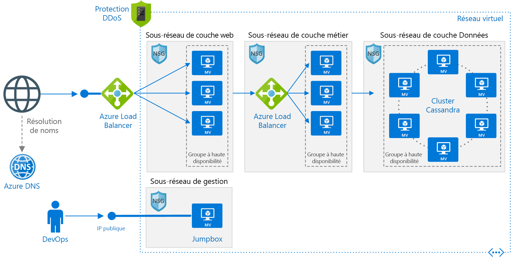

# <a name="linux-n-tier-application-in-azure-with-apache-cassandra"></a>Application multiniveau Linux dans Azure avec Apache Cassandra

Cette architecture de référence montre comment déployer des machines virtuelles et un réseau virtuel configuré pour une application multiniveau en utilisant Apache Cassandra sur Linux pour la couche Données. [**Déployez cette solution**](#deploy-the-solution).



*Téléchargez un [fichier Visio][visio-download] de cette architecture.*

## <a name="architecture"></a>Architecture

Elle comporte les composants suivants :

- **Groupe de ressources**. Les [groupes de ressources][resource-manager-overview] servent à regrouper des ressources afin de pouvoir les gérer en fonction de la durée de vie, du propriétaire ou d’autres critères.

- **Réseau virtuel (VNet) et sous-réseaux**. Chaque machine virtuelle Azure est déployée dans un réseau virtuel qui peut être segmenté en sous-réseaux. Créez un sous-réseau distinct pour chaque niveau.

- **NSG**. Utilisez des [groupes de sécurité réseau][nsg] pour limiter le trafic réseau au sein du réseau virtuel. Par exemple, dans l’architecture à trois niveaux illustrée ici, le niveau base de données accepte le trafic en provenance du niveau Business et du sous-réseau de gestion, mais pas en provenance du serveur web frontal.

- **Protection DDOS**. Bien que la plateforme Azure offre une protection basique contre les attaques par déni de service distribué (DDoS), nous vous recommandons d’utiliser la [Protection DDos Standard][ddos], qui a amélioré les fonctionnalités d’atténuation des risques liés à DDoS. Voir [Considérations relatives à la sécurité](#security-considerations).

- **Machines virtuelles**. Pour obtenir des suggestions sur la configuration des machines virtuelles, consultez [Exécuter une machine virtuelle Windows sur Azure](./windows-vm.md) et [Exécuter une machine virtuelle Linux sur Azure](./linux-vm.md).

- **Groupes à haute disponibilité**. Créez un [groupe à haute disponibilité][azure-availability-sets] pour chaque niveau et approvisionnez au moins deux machines virtuelles dans chaque niveau, ce qui rend les machines virtuelles éligibles pour un [contrat de niveau de service (SLA)][vm-sla] plus élevé.

- **Équilibreurs de charge Azure**. Les [équilibreurs de charge][load-balancer] distribuent les demandes Internet entrantes aux instances de machine virtuelle. Utilisez un [équilibreur de charge public][load-balancer-external] pour distribuer le trafic Internet entrant vers le niveau Web et un [équilibreur de charge interne][load-balancer-internal] pour distribuer le trafic réseau du niveau Web vers le niveau Business.

- **Adresse IP publique**. Une adresse IP publique est nécessaire pour que l’équilibreur de charge public puisse recevoir le trafic Internet.

- **Jumpbox**. Également appelée [hôte bastion]. Machine virtuelle sécurisée sur le réseau, utilisée par les administrateurs pour se connecter aux autres machines virtuelles. La jumpbox a un groupe de sécurité réseau qui autorise le trafic distant provenant uniquement d’adresses IP publiques figurant sur une liste verte. Le groupe de sécurité réseau doit autoriser le trafic SSH.

- **Base de données Apache Cassandra**. Fournit une haute disponibilité du niveau Données, en activant la réplication et le basculement.

- **Azure DNS**. [Azure DNS][azure-dns] est un service d’hébergement pour les domaines DNS. Il offre une résolution de noms à l’aide de l’infrastructure Microsoft Azure. En hébergeant vos domaines dans Azure, vous pouvez gérer vos enregistrements DNS avec les mêmes informations d’identification, les mêmes API, les mêmes outils et la même facturation que vos autres services Azure.

## <a name="recommendations"></a>Recommandations

Vos exigences peuvent différer de celles de l’architecture décrite ici. Utilisez ces recommandations comme point de départ.

### <a name="vnet--subnets"></a>Réseau virtuel / sous-réseaux

Quand vous créez le réseau virtuel, déterminez le nombre d’adresses IP dont vos ressources sur chaque sous-réseau ont besoin. Spécifiez un masque de sous-réseau et une plage d’adresses de réseau virtuel suffisamment large pour les adresse IP requises, à l’aide de la notation [CIDR]. Utilisez un espace d’adressage qui se trouve dans les [blocs d’adresses IP privées][private-ip-space] standard, à savoir 10.0.0.0/8, 172.16.0.0/12 et 192.168.0.0/16.

Choisissez une plage d’adresses qui ne chevauche pas votre réseau local, au cas où vous devriez configurer ultérieurement une passerelle entre le réseau virtuel et votre réseau local. Une fois le réseau virtuel créé, vous ne pouvez plus modifier la plage d’adresses.

Concevez les sous-réseaux en tenant compte des exigences en matière de sécurité et de fonctionnalités. Toutes les machines virtuelles du même niveau ou rôle doivent être placées sur le même sous-réseau, qui peut constituer une limite de sécurité. Pour plus d’informations sur la conception des réseaux virtuels et des sous-réseaux, consultez [Planifier et concevoir des réseaux virtuels Azure][plan-network].

### <a name="load-balancers"></a>Équilibreurs de charge

N’exposez pas les machines virtuelles directement à Internet. Donnez plutôt une adresse IP privée à chaque machine virtuelle. Les clients se connectent à l’aide de l’adresse IP de l’équilibreur de charge public.

Définissez des règles d’équilibreur de charge pour diriger le trafic réseau vers les machines virtuelles. Par exemple, pour activer le trafic HTTP, créez une règle qui mappe le port 80 de la configuration frontend au port 80 dans le pool d’adresses backend. Quand un client envoie une requête HTTP au port 80, l’équilibreur de charge sélectionne une adresse IP backend en utilisant un [algorithme de hachage][load-balancer-hashing] qui inclut l’adresse IP source. Les requêtes des clients sont réparties entre toutes les machines virtuelles.

### <a name="network-security-groups"></a>Groupes de sécurité réseau

Utilisez des règles de groupe de sécurité réseau pour limiter le trafic entre les niveaux. Par exemple, dans l’architecture à trois niveaux ci-dessus, le niveau Web ne communique pas directement avec le niveau Base de données. Pour appliquer cette recommandation, le niveau Base de données doit bloquer le trafic entrant provenant du sous-réseau du niveau Web.

1. Interdisez tout le trafic entrant provenant du réseau virtuel. (Utilisez la balise `VIRTUAL_NETWORK` dans la règle.)
2. Autorisez le trafic entrant à partir du sous-réseau du niveau Business.
3. Autorisez le trafic entrant à partir du sous-réseau du niveau Base de données. Cette règle autorise la communication entre les machines virtuelles de la base de données, qui est nécessaire pour la réplication de base de données et le basculement.
4. Autorisez le trafic SSH (port 22) à partir du sous-réseau du serveur de rebond. Cette règle permet aux administrateurs de se connecter au niveau Base de données à partir du serveur de rebond.

Créer des règles de 2 &ndash; 4 avec une priorité plus élevée que la première règle, afin qu’elles la remplacent.

### <a name="cassandra"></a>Cassandra

Nous vous recommandons d’utiliser [DataStax Enterprise][datastax] pour la production, mais ces recommandations s’appliquent à toute édition de Cassandra. Pour plus d’informations sur l’exécution de DataStax dans Azure, consultez le [Guide de déploiement de DataStax Enterprise pour Azure][cassandra-in-azure].

Placez les machines virtuelles pour un cluster Cassandra dans un groupe à haute disponibilité afin de vous assurer que les réplicas Cassandra sont répartis parmi plusieurs domaines d’erreur et domaines de mise à niveau. Pour plus d’informations sur les domaines d’erreur et les domaines de mise à niveau, consultez [Gérer la disponibilité des machines virtuelles][azure-availability-sets].

Configurez trois domaines d’erreur (le maximum) et 18 domaines de mise à niveau par groupe à haute disponibilité. Cela fournit le nombre maximal de domaines de mise à niveau qui peuvent être répartis uniformément entre les domaines d’erreur.

Configurez les nœuds en mode rack. Mappez les domaines d’erreur à des racks dans le fichier `cassandra-rackdc.properties`.

Vous n’avez pas besoin d’équilibreur de charge devant le cluster. Le client se connecte directement à un nœud dans le cluster.

Pour la haute disponibilité, déployez Cassandra dans plusieurs régions Azure. Dans chaque région, les nœuds sont configurés en mode rack avec des domaines d’erreur et de mise à niveau, afin d’assurer la résilience à l’intérieur de la région.

### <a name="jumpbox"></a>Serveur de rebond

N’autorisez pas l’accès SSH à partir de l’Internet public vers les machines virtuelles qui exécutent la charge de travail d’application. Au lieu de cela, tout l’accès SSH à ces machines virtuelles doit transiter par le serveur de rebond. Un administrateur se connecte au serveur de rebond, puis se connecte à l’autre machine virtuelle à partir du serveur de rebond. Le serveur de rebond autorise le trafic SSH à partir d’Internet, mais uniquement à partir d’adresses IP connues et sûres.

Le serveur de rebond a des exigences de performances minimales, donc sélectionnez une machine virtuelle de petite taille. Créez-lui une [adresse IP publique]. Placez-le sur le même réseau virtuel que les autres machines virtuelles, mais sur un sous-réseau de gestion distinct.

Pour sécuriser le serveur de rebond, ajoutez une règle de groupe de sécurité réseau qui autorise les connexions SSH provenant uniquement d’un ensemble sûr d’adresses IP publiques. Configurez les groupes de sécurité réseau pour les autres sous-réseaux de façon à autoriser le trafic SSH provenant du sous-réseau de gestion.

## <a name="scalability-considerations"></a>Considérations relatives à l’extensibilité

Pour les niveaux Web et Business, envisagez d’utiliser des [groupes de machines virtuelles identiques][vmss], au lieu de déployer des machines virtuelles distinctes dans un groupe à haute disponibilité. Un groupe identique simplifie le déploiement et la gestion d’un ensemble de machines virtuelles identiques, et effectue la mise à l’échelle des machines virtuelles en fonction des métriques de performances. À mesure que la charge sur les machines virtuelles augmente, des machines virtuelles supplémentaires sont ajoutées automatiquement à l’équilibreur de charge. Les groupes identiques sont parfaits si vous devez rapidement faire monter en puissance des machines virtuelles, ou si vous avez besoin d’une mise à l’échelle automatique.

Il existe deux façons de configurer des machines virtuelles déployées dans un groupe identique :

- Utiliser des extensions pour configurer la machine virtuelle après son déploiement. Avec cette approche, le démarrage des nouvelles instances de machine virtuelle peut être plus long que pour une machine virtuelle sans extension.

- Déployer un [disque managé](/azure/storage/storage-managed-disks-overview) avec une image de disque personnalisée. Cette option peut être plus rapide à déployer. Toutefois, elle vous oblige à tenir l’image à jour.

Pour plus d’informations, consultez [Considérations relatives à la conception des groupes de machines virtuelles identiques][vmss-design].

> [!TIP]
> Quand vous utilisez une solution de mise à l’échelle automatique, testez-la bien à l’avance avec des charges de travail de niveau production.

Chaque abonnement Azure a des limites par défaut, notamment une quantité maximale de machines virtuelles par région. Vous pouvez augmenter la limite en créant une demande de support. Pour plus d’informations, consultez [Abonnement Azure et limites, quotas et contraintes de service][subscription-limits].

## <a name="availability-considerations"></a>Considérations relatives à la disponibilité

Si vous n’utilisez pas de groupes de machines virtuelles identiques, placez les machines virtuelles prévues pour un même niveau dans un groupe à haute disponibilité. Créez au moins deux machines virtuelles dans le groupe à haute disponibilité, afin de prendre en charge le [contrat SLA de disponibilité pour les machines virtuelles Azure][vm-sla]. Pour plus d’informations, consultez [Gestion de la disponibilité des machines virtuelles][availability-set]. Les groupes identiques utilisent automatiquement des *groupes de placement*, agissant comme des groupes à haute disponibilité implicites.

L’équilibreur de charge utilise des [sondes d’intégrité][health-probes] pour surveiller la disponibilité des instances de machine virtuelle. Si une sonde ne peut pas atteindre une instance dans le délai imparti, l’équilibreur de charge cesse d’envoyer le trafic vers cette machine virtuelle. Il continue à sonder, et si la machine virtuelle redevient disponible il reprend l’envoi du trafic vers cette machine virtuelle.

Voici quelques recommandations concernant les sondes d’intégrité d’équilibreur de charge :

- Les sondes peuvent tester le protocole TCP ou HTTP. Si vos machines virtuelles exécutent un serveur HTTP, créez une sonde HTTP. Sinon, créez une sonde TCP.
- Pour une sonde HTTP, spécifiez le chemin d’un point de terminaison HTTP. La sonde vérifie la présence d’une réponse HTTP 200 à partir de ce chemin. Il peut s’agir du chemin racine (« / ») ou d’un point de terminaison de surveillance de l’intégrité qui implémente une logique personnalisée afin de vérifier l’intégrité de l’application. Le point de terminaison doit autoriser les requêtes HTTP anonymes.
- La sonde est envoyée à partir d’une [adresse IP connue][health-probe-ip], 168.63.129.16. Assurez-vous de ne pas bloquer le trafic à destination ou en provenance de cette adresse IP dans aucune stratégie de pare-feu ou règle NSG.
- Utilisez des [journaux de sonde d’intégrité][health-probe-log] pour afficher l’état des sondes d’intégrité. Activez la journalisation dans le portail Azure pour chaque équilibreur de charge. Les journaux sont écrits dans le Stockage Blob Azure. Les journaux indiquent combien de machines virtuelles ne reçoivent pas le trafic réseau en raison d’échecs de réponse de la sonde.

Pour le cluster Cassandra, les scénarios de basculement dépendent des niveaux de cohérence utilisés par l’application et du nombre de réplicas. Pour plus d’informations sur l’utilisation et les niveaux de cohérence dans Cassandra, consultez [Configuring data consistency][cassandra-consistency] (Configuration de la cohérence des données) et [Cassandra: How many nodes are talked to with Quorum?][cassandra-consistency-usage] (Cassandra : quel est le nombre de nœuds en communication avec le quorum ?) La disponibilité des données dans Cassandra est déterminée par le niveau de cohérence utilisé par l’application et le mécanisme de réplication. Pour plus d’informations sur la réplication dans Cassandra, consultez [Data Replication in NoSQL Databases Explained][cassandra-replication] (Explication de la réplication des données dans les bases de données NoSQL).

## <a name="security-considerations"></a>Considérations relatives à la sécurité

Les réseaux virtuels sont une limite d’isolation du trafic dans Azure. Les machines virtuelles d’un réseau virtuel ne peuvent pas communiquer directement avec celles d’un autre réseau virtuel. Les machines virtuelles situées sur un même réseau virtuel peuvent communiquer, sauf si vous créez des [groupes de sécurité réseau][nsg] pour limiter le trafic. Pour plus d’informations, consultez [Services cloud Microsoft et sécurité réseau][network-security].

Pour le trafic Internet entrant, les règles d’équilibreur de charge définissent le trafic qui peut atteindre le backend. Toutefois, les règles d’équilibreur de charge ne prennent pas en charge les listes de sécurité IP. Par conséquent, si vous souhaitez ajouter certaines adresses IP publiques à une liste verte, ajoutez un groupe de sécurité réseau au sous-réseau.

**DMZ**. Ajoutez une appliance virtuelle réseau (NVA) pour créer un réseau de périmètre (DMZ) entre Internet et le réseau virtuel Azure. NVA est un terme générique décrivant une appliance virtuelle qui peut effectuer des tâches liées au réseau, telles que pare-feu, inspection des paquets, audit et routage personnalisé. Pour plus d’informations, consultez [Implémentation d’une zone DMZ entre Azure et Internet][dmz].

**Chiffrement**. Chiffrez les données sensibles au repos et utilisez [Azure Key Vault][azure-key-vault] pour gérer les clés de chiffrement de base de données. Key Vault peut stocker des clés de chiffrement dans des modules de sécurité matériel (HSM). Il est également recommandé pour stocker des secrets de l’application, comme des chaînes de connexion de base de données, dans le coffre de clés.

**Protection DDOS**. La plateforme Azure fournit par défaut une protection DDoS de base. Cette protection de base est destinée à protéger l’infrastructure Azure dans sa globalité. Bien que cette protection DDoS de base soit activée automatiquement, nous vous recommandons d’utiliser la [Protection DDoS Standard][ddos]. La protection Standard utilise un réglage adaptatif basé sur les modèles de trafic réseau de votre application afin de détecter les menaces. Cela lui permet d’appliquer des atténuations contre les attaques DDoS pouvant passer inaperçues aux yeux des stratégies de DDoS à l’échelle de l’infrastructure. La protection standard fournit également des alertes, des données de télémétrie et des analyses via Azure Monitor. Pour plus d’informations, consultez [Azure DDoS Protection : bonnes pratiques et architectures de référence][ddos-best-practices].

## <a name="deploy-the-solution"></a>Déployer la solution

Un déploiement pour cette architecture de référence est disponible sur [GitHub][github-folder].

### <a name="prerequisites"></a>Prérequis

[!INCLUDE [ref-arch-prerequisites.md](../../../includes/ref-arch-prerequisites.md)]

### <a name="deploy-the-solution-using-azbb"></a>Déployer la solution à l’aide d’azbb

Pour déployer les machines virtuelles Linux pour une architecture de référence d’application multiniveau, procédez comme suit :

1. Accédez au dossier `virtual-machines\n-tier-linux` pour rechercher le référentiel que vous avez cloné à l’étape 1 des conditions préalables ci-dessus.

2. Le fichier de paramètres spécifie un nom d’utilisateur et un mot de passe administrateur par défaut pour chaque machine virtuelle du déploiement. Modifiez-les avant de déployer l’architecture de référence. Ouvrez le fichier `n-tier-linux.json` et remplacez chaque champ **adminUsername** et **adminPassword** par vos nouveaux paramètres.   Enregistrez le fichier .

3. Déployez l’architecture de référence à l’aide de l’outil **azbb**, comme indiqué ci-dessous.

   ```azurecli
   azbb -s <your subscription_id> -g <your resource_group_name> -l <azure region> -p n-tier-linux.json --deploy
   ```

Pour plus d’informations sur le déploiement de cet exemple d’architecture de référence à l’aide des blocs de construction Azure, visitez notre [référentiel GitHub][git].

<!-- links -->

[dmz]: ../dmz/secure-vnet-dmz.md
[multi-vm]: ./multi-vm.md
[naming conventions]: /azure/guidance/guidance-naming-conventions
[azure-availability-sets]: /azure/virtual-machines/virtual-machines-linux-manage-availability
[azure-dns]: /azure/dns/dns-overview
[azure-key-vault]: https://azure.microsoft.com/services/key-vault

[hôte bastion]: https://en.wikipedia.org/wiki/Bastion_host
[cassandra-in-azure]: https://academy.datastax.com/resources/deployment-guide-azure
[cassandra-consistency]: https://docs.datastax.com/en/cassandra/2.0/cassandra/dml/dml_config_consistency_c.html
[cassandra-replication]: https://academy.datastax.com/planet-cassandra/data-replication-in-nosql-databases-explained
[cassandra-consistency-usage]: https://medium.com/@foundev/cassandra-how-many-nodes-are-talked-to-with-quorum-also-should-i-use-it-98074e75d7d5#.b4pb4alb2

[cidr]: https://en.wikipedia.org/wiki/Classless_Inter-Domain_Routing
[datastax]: https://www.datastax.com/products/datastax-enterprise
[ddos]: /azure/virtual-network/ddos-protection-overview
[ddos-best-practices]: /azure/security/azure-ddos-best-practices
[git]: https://github.com/mspnp/template-building-blocks
[github-folder]: https://github.com/mspnp/reference-architectures/tree/master/virtual-machines/n-tier-linux
[load-balancer-external]: /azure/load-balancer/load-balancer-internet-overview
[load-balancer-internal]: /azure/load-balancer/load-balancer-internal-overview
[nsg]: /azure/virtual-network/virtual-networks-nsg
[nsg-rules]: /azure/azure-resource-manager/best-practices-resource-manager-security#network-security-groups
[plan-network]: /azure/virtual-network/virtual-network-vnet-plan-design-arm
[private-ip-space]: https://en.wikipedia.org/wiki/Private_network#Private_IPv4_address_spaces
[adresse IP publique]: /azure/virtual-network/virtual-network-ip-addresses-overview-arm
[vm-sla]: https://azure.microsoft.com/support/legal/sla/virtual-machines
[visio-download]: https://archcenter.blob.core.windows.net/cdn/vm-reference-architectures.vsdx

[resource-manager-overview]: /azure/azure-resource-manager/resource-group-overview
[vmss]: /azure/virtual-machine-scale-sets/virtual-machine-scale-sets-overview
[load-balancer]: /azure/load-balancer/load-balancer-get-started-internet-arm-cli
[load-balancer-hashing]: /azure/load-balancer/load-balancer-overview#load-balancer-features
[vmss-design]: /azure/virtual-machine-scale-sets/virtual-machine-scale-sets-design-overview
[subscription-limits]: /azure/azure-subscription-service-limits
[availability-set]: /azure/virtual-machines/virtual-machines-windows-manage-availability
[health-probes]: /azure/load-balancer/load-balancer-overview#load-balancer-features
[health-probe-log]: /azure/load-balancer/load-balancer-monitor-log
[health-probe-ip]: /azure/virtual-network/virtual-networks-nsg#special-rules
[network-security]: /azure/best-practices-network-security
