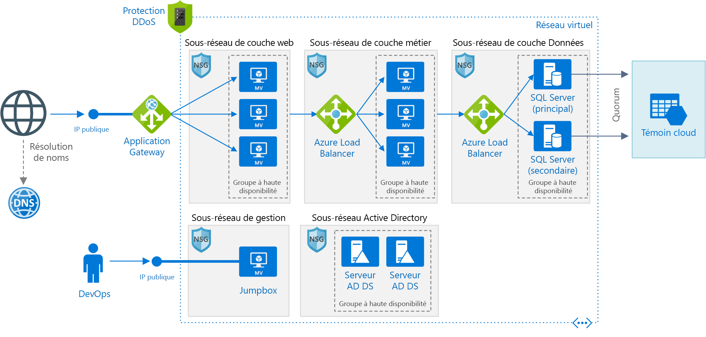

# <a name="windows-n-tier-application-on-azure-with-sql-server"></a>Application multiniveau Windows sur Azure avec SQL Server

Cette architecture de référence montre comment déployer des machines virtuelles et un réseau virtuel configuré pour une application multiniveau à l’aide de SQL Server sur Windows pour la couche Données. [**Déployez cette solution**](#deploy-the-solution).



*Téléchargez un [fichier Visio][visio-download] de cette architecture.*

## <a name="architecture"></a>Architecture

Elle comporte les composants suivants :

- **Groupe de ressources**. Les [groupes de ressources][resource-manager-overview] servent à regrouper des ressources afin de pouvoir les gérer en fonction de la durée de vie, du propriétaire ou d’autres critères.

- **Réseau virtuel (VNet) et sous-réseaux**. Chaque machine virtuelle Azure est déployée dans un réseau virtuel qui peut être segmenté en sous-réseaux. Créez un sous-réseau distinct pour chaque niveau.

- **Passerelle d’application**. [La passerelle Azure Application Gateway](/azure/application-gateway/) est un équilibreur de charge de 7 couches. Dans cette architecture, il achemine les requêtes HTTP vers le serveur web frontal. La passerelle Application Gateway fournit également un [pare-feu d’applications web](/azure/application-gateway/waf-overview) (WAF) qui protège l’application contre les vulnérabilités et exploitations courantes.

- **NSG**. Utilisez des [groupes de sécurité réseau][nsg] pour limiter le trafic réseau au sein du réseau virtuel. Par exemple, dans l’architecture à trois niveaux illustrée ici, le niveau base de données n’accepte pas le trafic en provenance du serveur web frontal, mais uniquement du niveau Business et du sous-réseau de gestion.

- **Protection DDOS**. Bien que la plateforme Azure offre une protection basique contre les attaques par déni de service distribué (DDoS), nous vous recommandons d’utiliser la [Protection DDos Standard][ddos], qui a amélioré les fonctionnalités d’atténuation des risques liés à DDoS. Voir [Considérations relatives à la sécurité](#security-considerations).

- **Machines virtuelles**. Pour obtenir des suggestions sur la configuration des machines virtuelles, consultez [Exécuter une machine virtuelle Windows sur Azure](./windows-vm.md) et [Exécuter une machine virtuelle Linux sur Azure](./linux-vm.md).

- **Groupes à haute disponibilité**. Créez un [groupe à haute disponibilité][azure-availability-sets] pour chaque niveau et approvisionnez au moins deux machines virtuelles dans chaque niveau, ce qui rend les machines virtuelles éligibles pour un [contrat de niveau de service (SLA)][vm-sla] plus élevé.

- **Équilibreurs de charge** : Utilisez [l’équilibreur de charge d’Azure][load-balancer] pour distribuer le trafic réseau à partir de l’édition web vers l’édition business et de l’édition business vers le serveur SQL.

- **Adresse IP publique**. Une adresse IP publique est nécessaire pour que l’équilibreur de charge puisse recevoir le trafic Internet.

- **Jumpbox**. Également appelée [hôte bastion]. Machine virtuelle sécurisée sur le réseau, utilisée par les administrateurs pour se connecter aux autres machines virtuelles. Le serveur de rebond a un groupe de sécurité réseau qui autorise le trafic distant provenant uniquement d’adresses IP publiques figurant sur une liste verte. Le groupe de sécurité réseau doit autoriser le trafic RDP (Bureau à distance).

- **Groupe de disponibilité SQL Server Always On**. Fournit une haute disponibilité du niveau Données, en activant la réplication et le basculement. Il utilise la technologie du WSFC (Cluster de basculement Windows Server) pour le basculement.

- **Serveurs AD DS (Active Directory Domain Services)**. Les objets ordinateur pour le cluster de basculement et ses rôles en cluster associés sont créés dans AD DS (Active Directory Domain Services).

- **Témoin de cloud**. Un cluster de basculement nécessite plus de la moitié de ses nœuds pour fonctionner, on dit alors qu’il a un quorum. Si le cluster possède seulement deux nœuds, une partition de réseau peut mener chaque nœud à penser qu’il est le nœud principal. Dans ce cas, vous avez besoin d’un *témoin* pour arbitrer et établir le quorum. Un témoin est une ressource telle qu’un disque partagé qui peut arbitrer pour établir le quorum. Le témoin de cloud est un type de témoin qui utilise le stockage Blob Azure. Pour en savoir plus sur le concept de quorum, consultez [Comprendre les quorums de cluster et de pool](/windows-server/storage/storage-spaces/understand-quorum). Pour plus d’informations sur les témoins de cloud, consultez [Déployer un témoin de cloud pour un cluster de basculement](/windows-server/failover-clustering/deploy-cloud-witness).

- **Azure DNS**. [Azure DNS][azure-dns] est un service d’hébergement pour les domaines DNS. Il offre une résolution de noms à l’aide de l’infrastructure Microsoft Azure. En hébergeant vos domaines dans Azure, vous pouvez gérer vos enregistrements DNS avec les mêmes informations d’identification, les mêmes API, les mêmes outils et la même facturation que vos autres services Azure.

## <a name="recommendations"></a>Recommandations

Vos exigences peuvent différer de celles de l’architecture décrite ici. Utilisez ces recommandations comme point de départ.

### <a name="vnet--subnets"></a>Réseau virtuel / sous-réseaux

Quand vous créez le réseau virtuel, déterminez le nombre d’adresses IP dont vos ressources sur chaque sous-réseau ont besoin. Spécifiez un masque de sous-réseau et une plage d’adresses de réseau virtuel suffisamment large pour les adresse IP requises, à l’aide de la notation [CIDR]. Utilisez un espace d’adressage qui se trouve dans les [blocs d’adresses IP privées][private-ip-space] standard, à savoir 10.0.0.0/8, 172.16.0.0/12 et 192.168.0.0/16.

Choisissez une plage d’adresses qui ne chevauche pas votre réseau local, au cas où vous devriez configurer ultérieurement une passerelle entre le réseau virtuel et votre réseau local. Une fois le réseau virtuel créé, vous ne pouvez plus modifier la plage d’adresses.

Concevez les sous-réseaux en tenant compte des exigences en matière de sécurité et de fonctionnalités. Toutes les machines virtuelles du même niveau ou rôle doivent être placées sur le même sous-réseau, qui peut constituer une limite de sécurité. Pour plus d’informations sur la conception des réseaux virtuels et des sous-réseaux, consultez [Planifier et concevoir des réseaux virtuels Azure][plan-network].

### <a name="load-balancers"></a>Équilibreurs de charge

N’exposez pas les machines virtuelles directement à Internet. Attribuez plutôt à chaque machine virtuelle une adresse IP privée. Les clients se connectent à l’aide de l’adresse IP publique associée à la passerelle Application Gateway.

Définissez des règles d’équilibreur de charge pour diriger le trafic réseau vers les machines virtuelles. Par exemple, pour activer le trafic HTTP, mappez le port 80 de la configuration du serveur frontal au port 80 dans le pool d’adresses principales. Quand un client envoie une requête HTTP au port 80, l’équilibreur de charge sélectionne une adresse IP backend en utilisant un [algorithme de hachage][load-balancer-hashing] qui inclut l’adresse IP source. Les requêtes des clients sont réparties entre toutes les machines virtuelles dans le pool d’adresses principales.

### <a name="network-security-groups"></a>Groupes de sécurité réseau

Utilisez des règles de groupe de sécurité réseau pour limiter le trafic entre les niveaux. Par exemple, dans l’architecture à trois niveaux ci-dessus, le niveau Web ne communique pas directement avec le niveau Base de données. Pour appliquer cette recommandation, le niveau Base de données doit bloquer le trafic entrant provenant du sous-réseau du niveau Web.

1. Interdisez tout le trafic entrant provenant du réseau virtuel. (Utilisez la balise `VIRTUAL_NETWORK` dans la règle.)
2. Autorisez le trafic entrant à partir du sous-réseau du niveau Business.
3. Autorisez le trafic entrant à partir du sous-réseau du niveau Base de données. Cette règle autorise la communication entre les machines virtuelles de la base de données, qui est nécessaire pour la réplication de base de données et le basculement.
4. Autorisez le trafic RDP (port 3389) à partir du sous-réseau du serveur de rebond. Cette règle permet aux administrateurs de se connecter au niveau Base de données à partir du serveur de rebond.

Créer des règles de 2 &ndash; 4 avec une priorité plus élevée que la première règle, afin qu’elles la remplacent.

### <a name="sql-server-always-on-availability-groups"></a>Groupes de disponibilité SQL Server Always On

Nous vous recommandons d’utiliser des [groupes de disponibilité AlwaysOn][sql-alwayson] pour la haute disponibilité de SQL Server. Avec les versions antérieures à Windows Server 2016, les groupes de disponibilité AlwaysOn nécessitent un contrôleur de domaine et tous les nœuds du groupe de disponibilité doivent être dans le même domaine Active Directory.

Les autres niveaux se connectent à la base de données par le biais d’un [écouteur de groupe de disponibilité][sql-alwayson-listeners]. L’écouteur permet à un client SQL de se connecter sans connaître le nom de l’instance physique de SQL Server. Les machines virtuelles qui accèdent à la base de données doivent être jointes au domaine. Le client (dans ce cas, un autre niveau) utilise le système DNS pour résoudre le nom du réseau virtuel de l’écouteur en adresses IP.

Configurez le groupe de disponibilité SQL Server AlwaysOn comme suit :

1. Créez un cluster WSFC (clustering de basculement Windows Server), un groupe de disponibilité SQL Server AlwaysOn et un réplica principal. Pour plus d’informations, consultez [Bien démarrer avec les groupes de disponibilité AlwaysOn][sql-alwayson-getting-started].
2. Créez un équilibreur de charge interne avec une adresse IP privée statique.
3. Créez un écouteur de groupe de disponibilité et mappez le nom DNS de l’écouteur à l’adresse IP d’un équilibreur de charge interne.
4. Créez une règle d’équilibreur de charge pour le port d’écoute SQL Server (port TCP 1433 par défaut). La règle d’équilibreur de charge doit activer *l’adresse IP flottante*, également appelé Retour direct du serveur. Cela force la machine virtuelle à répondre directement au client, ce qui permet de bénéficier d’une connexion directe au réplica principal.

   > [!NOTE]
   > Quand l’adresse IP flottante est activée, le numéro de port frontend doit être identique au numéro de port backend dans la règle d’équilibreur de charge.
   >

Quand un client SQL tente de se connecter, l’équilibreur de charge achemine la demande de connexion au réplica principal. En cas de basculement vers un autre réplica, l’équilibreur de charge achemine automatiquement les nouvelles requêtes à un nouveau réplica principal. Pour plus d’informations, consultez [Configurer un écouteur à équilibrage de charge interne pour des groupes de disponibilité SQL Server AlwaysOn][sql-alwayson-ilb].

Lors d’un basculement, les connexions clientes existantes sont fermées. Une fois le basculement terminé, les nouvelles connexions sont acheminées vers le nouveau réplica principal.

Si votre application effectue beaucoup plus de lectures que d’écritures, vous pouvez décharger certaines des requêtes en lecture seule vers un réplica secondaire. Voir [Utilisation d’un écouteur pour se connecter à un réplica secondaire en lecture seule (routage en lecture seule)][sql-alwayson-read-only-routing].

Testez votre déploiement en [forçant un basculement manuel][sql-alwayson-force-failover] du groupe de disponibilité.

### <a name="jumpbox"></a>Serveur de rebond

N’autorisez pas l’accès RDP à partir de l’Internet public aux machines virtuelles qui exécutent la charge de travail d’application. Au lieu de cela, tout l’accès RDP à ces machines virtuelles doit transiter par le serveur de rebond. Un administrateur se connecte au serveur de rebond, puis se connecte à l’autre machine virtuelle à partir du serveur de rebond. Le serveur de rebond autorise le trafic SSH à partir d’Internet, mais uniquement à partir d’adresses IP connues et sûres.

Le serveur de rebond a des exigences de performances minimales, donc sélectionnez une machine virtuelle de petite taille. Créez-lui une [adresse IP publique]. Placez-le sur le même réseau virtuel que les autres machines virtuelles, mais sur un sous-réseau de gestion distinct.

Pour sécuriser le serveur de rebond, ajoutez une règle de groupe de sécurité réseau qui autorise les connexions RDP provenant uniquement d’un ensemble sûr d’adresses IP publiques. Configurez les groupes de sécurité réseau pour les autres sous-réseaux de façon à autoriser le trafic RDP provenant du sous-réseau de gestion.

## <a name="scalability-considerations"></a>Considérations relatives à l’extensibilité

Pour les niveaux Web et Business, envisagez d’utiliser des [groupes de machines virtuelles identiques][vmss], au lieu de déployer des machines virtuelles distinctes dans un groupe à haute disponibilité. Un groupe identique simplifie le déploiement et la gestion d’un ensemble de machines virtuelles identiques, et effectue la mise à l’échelle des machines virtuelles en fonction des métriques de performances. À mesure que la charge sur les machines virtuelles augmente, des machines virtuelles supplémentaires sont ajoutées automatiquement à l’équilibreur de charge. Les groupes identiques sont parfaits si vous devez rapidement faire monter en puissance des machines virtuelles, ou si vous avez besoin d’une mise à l’échelle automatique.

Il existe deux façons de configurer des machines virtuelles déployées dans un groupe identique :

- Utiliser des extensions pour configurer la machine virtuelle après son déploiement. Avec cette approche, le démarrage des nouvelles instances de machine virtuelle peut être plus long que pour une machine virtuelle sans extension.

- Déployer un [disque managé](/azure/storage/storage-managed-disks-overview) avec une image de disque personnalisée. Cette option peut être plus rapide à déployer. Toutefois, elle vous oblige à tenir l’image à jour.

Pour plus d’informations, consultez [Considérations relatives à la conception des groupes de machines virtuelles identiques][vmss-design].

> [!TIP]
> Quand vous utilisez une solution de mise à l’échelle automatique, testez-la bien à l’avance avec des charges de travail de niveau production.

Chaque abonnement Azure a des limites par défaut, notamment une quantité maximale de machines virtuelles par région. Vous pouvez augmenter la limite en créant une demande de support. Pour plus d’informations, consultez [Abonnement Azure et limites, quotas et contraintes de service][subscription-limits].

## <a name="availability-considerations"></a>Considérations relatives à la disponibilité

Si vous n’utilisez pas de groupes de machines virtuelles identiques, placez les machines virtuelles prévues pour un même niveau dans un groupe à haute disponibilité. Créez au moins deux machines virtuelles dans le groupe à haute disponibilité, afin de prendre en charge le [contrat SLA de disponibilité pour les machines virtuelles Azure][vm-sla]. Pour plus d’informations, consultez [Gestion de la disponibilité des machines virtuelles][availability-set]. Les groupes identiques utilisent automatiquement des *groupes de placement*, agissant comme des groupes à haute disponibilité implicites.

L’équilibreur de charge utilise des [sondes d’intégrité][health-probes] pour surveiller la disponibilité des instances de machine virtuelle. Si une sonde ne peut pas atteindre une instance dans le délai imparti, l’équilibreur de charge cesse d’envoyer le trafic vers cette machine virtuelle. Toutefois, il continue à sonder, et si la machine virtuelle redevient disponible il reprend l’envoi du trafic vers cette machine virtuelle.

Voici quelques recommandations concernant les sondes d’intégrité d’équilibreur de charge :

- Les sondes peuvent tester le protocole TCP ou HTTP. Si vos machines virtuelles exécutent un serveur HTTP, créez une sonde HTTP. Sinon, créez une sonde TCP.
- Pour une sonde HTTP, spécifiez le chemin d’un point de terminaison HTTP. La sonde vérifie la présence d’une réponse HTTP 200 à partir de ce chemin. Ce chemin peut être un chemin racine (« / ») ou d’un point de terminaison de surveillance de l’intégrité qui implémente une logique personnalisée afin de vérifier l’intégrité de l’application. Le point de terminaison doit autoriser les requêtes HTTP anonymes.
- La sonde est envoyée à partir d’une [adresse IP connue][health-probe-ip], 168.63.129.16. Ne bloquez le trafic à destination ou en provenance de cette adresse IP dans aucune stratégie de pare-feu ou règle NSG.
- Utilisez des [journaux de sonde d’intégrité][health-probe-log] pour afficher l’état des sondes d’intégrité. Activez la journalisation dans le portail Azure pour chaque équilibreur de charge. Les journaux sont écrits dans le Stockage Blob Azure. Les journaux indiquent combien de machines virtuelles ne reçoivent pas le trafic réseau en raison d’échecs de réponse de la sonde.

Si vous avez besoin d’une plus grande disponibilité que celle offerte par le [contrat SLA Azure pour les machines virtuelles][vm-sla], envisagez la réplication de l’application dans deux régions en utilisant Azure Traffic Manager pour le basculement. Pour plus d’informations, consultez [Application multiniveau multirégion pour une haute disponibilité][multi-dc].

## <a name="security-considerations"></a>Considérations relatives à la sécurité

Les réseaux virtuels sont une limite d’isolation du trafic dans Azure. Les machines virtuelles d’un réseau virtuel ne peuvent pas communiquer directement avec celles d’un autre réseau virtuel. Les machines virtuelles situées sur un même réseau virtuel peuvent communiquer, sauf si vous créez des [groupes de sécurité réseau][nsg] pour limiter le trafic. Pour plus d’informations, consultez [Services cloud Microsoft et sécurité réseau][network-security].

**DMZ**. Ajoutez une appliance virtuelle réseau (NVA) pour créer un réseau de périmètre (DMZ) entre Internet et le réseau virtuel Azure. NVA est un terme générique décrivant une appliance virtuelle qui peut effectuer des tâches liées au réseau, telles que pare-feu, inspection des paquets, audit et routage personnalisé. Pour plus d’informations, consultez [Implémentation d’une zone DMZ entre Azure et Internet][dmz].

**Chiffrement**. Chiffrez les données sensibles au repos et utilisez [Azure Key Vault][azure-key-vault] pour gérer les clés de chiffrement de base de données. Key Vault peut stocker des clés de chiffrement dans des modules de sécurité matériel (HSM). Pour plus d’informations, consultez [Configurer l’intégration d’Azure Key Vault pour SQL Server sur des machines virtuelles Azure][sql-keyvault]. Il est également recommandé pour stocker des secrets de l’application, comme des chaînes de connexion de base de données, dans le coffre de clés.

**Protection DDOS**. La plateforme Azure fournit par défaut une protection DDoS de base. Cette protection de base est destinée à protéger l’infrastructure Azure dans sa globalité. Bien que cette protection DDoS de base soit activée automatiquement, nous vous recommandons d’utiliser la [Protection DDoS Standard][ddos]. La protection Standard utilise un réglage adaptatif basé sur les modèles de trafic réseau de votre application afin de détecter les menaces. Cela lui permet d’appliquer des atténuations contre les attaques DDoS pouvant passer inaperçues aux yeux des stratégies de DDoS à l’échelle de l’infrastructure. La protection standard fournit également des alertes, des données de télémétrie et des analyses via Azure Monitor. Pour plus d’informations, consultez [Azure DDoS Protection : bonnes pratiques et architectures de référence][ddos-best-practices].

## <a name="deploy-the-solution"></a>Déployer la solution

Un déploiement pour cette architecture de référence est disponible sur [GitHub][github-folder]. La totalité du déploiement peut prendre jusqu’à deux heures, ce qui inclut l’exécution des scripts pour configurer AD DS, le cluster de basculement Windows Server et le groupe de disponibilité de SQL Server.

### <a name="prerequisites"></a>Prérequis

[!INCLUDE [ref-arch-prerequisites.md](../../../includes/ref-arch-prerequisites.md)]

### <a name="deployment-steps"></a>Étapes du déploiement

1. Exécutez la commande suivante pour créer un groupe de ressources.

    ```azurecli
    az group create --location <location> --name <resource-group-name>
    ```

2. Exécutez la commande suivante pour créer un compte de stockage pour le témoin de cloud.

    ```azurecli
    az storage account create --location <location> \
      --name <storage-account-name> \
      --resource-group <resource-group-name> \
      --sku Standard_LRS
    ```

3. Accédez au dossier `virtual-machines\n-tier-windows` du référentiel GitHub des architectures de référence.

4. Ouvrez le fichier `n-tier-windows.json` .

5. Recherchez toutes les instances de « witnessStorageBlobEndPoint » et remplacez le texte d’espace réservé par le nom du compte de stockage de l’étape 2.

    ```json
    "witnessStorageBlobEndPoint": "https://[replace-with-storageaccountname].blob.core.windows.net",
    ```

6. Exécutez la commande suivante pour répertorier les clés de compte pour le compte de stockage.

    ```azurecli
    az storage account keys list \
      --account-name <storage-account-name> \
      --resource-group <resource-group-name>
    ```

    La sortie doit se présenter comme suit. Copiez la valeur de `key1`.

    ```json
    [
    {
        "keyName": "key1",
        "permissions": "Full",
        "value": "..."
    },
    {
        "keyName": "key2",
        "permissions": "Full",
        "value": "..."
    }
    ]
    ```

7. Dans le fichier `n-tier-windows.json`, recherchez toutes les instances de « witnessStorageAccountKey » et collez la clé de compte.

    ```json
    "witnessStorageAccountKey": "[replace-with-storagekey]"
    ```

8. Dans le fichier `n-tier-windows.json`, recherchez toutes les instances de `[replace-with-password]` et `[replace-with-sql-password]`, et remplacez-les par un mot de passe fort. Enregistrez le fichier .

    > [!NOTE]
    > Si vous modifiez le nom d’utilisateur de l’administrateur, vous devez également mettre à jour les blocs `extensions` dans le fichier JSON.

9. Exécutez la commande suivante pour déployer l’architecture.

    ```azurecli
    azbb -s <your subscription_id> -g <resource_group_name> -l <location> -p n-tier-windows.json --deploy
    ```

Pour plus d’informations sur le déploiement de cet exemple d’architecture de référence à l’aide des blocs de construction Azure, visitez notre [référentiel GitHub][git].

<!-- links -->
[dmz]: ../dmz/secure-vnet-dmz.md
[multi-dc]: multi-region-sql-server.md
[n-tier]: n-tier.md
[azure-availability-sets]: /azure/virtual-machines/virtual-machines-windows-manage-availability#configure-each-application-tier-into-separate-availability-sets
[azure-dns]: /azure/dns/dns-overview
[azure-key-vault]: https://azure.microsoft.com/services/key-vault
[hôte bastion]: https://en.wikipedia.org/wiki/Bastion_host
[cidr]: https://en.wikipedia.org/wiki/Classless_Inter-Domain_Routing
[ddos]: /azure/virtual-network/ddos-protection-overview
[ddos-best-practices]: /azure/security/azure-ddos-best-practices
[git]: https://github.com/mspnp/template-building-blocks
[github-folder]: https://github.com/mspnp/reference-architectures/tree/master/virtual-machines/n-tier-windows
[nsg]: /azure/virtual-network/virtual-networks-nsg
[plan-network]: /azure/virtual-network/virtual-network-vnet-plan-design-arm
[private-ip-space]: https://en.wikipedia.org/wiki/Private_network#Private_IPv4_address_spaces
[adresse IP publique]: /azure/virtual-network/virtual-network-ip-addresses-overview-arm
[sql-alwayson]: https://msdn.microsoft.com/library/hh510230.aspx
[sql-alwayson-force-failover]: https://msdn.microsoft.com/library/ff877957.aspx
[sql-alwayson-getting-started]: https://msdn.microsoft.com/library/gg509118.aspx
[sql-alwayson-ilb]: /azure/virtual-machines/windows/sql/virtual-machines-windows-portal-sql-alwayson-int-listener
[sql-alwayson-listeners]: https://msdn.microsoft.com/library/hh213417.aspx
[sql-alwayson-read-only-routing]: https://technet.microsoft.com/library/hh213417.aspx#ConnectToSecondary
[sql-keyvault]: /azure/virtual-machines/virtual-machines-windows-ps-sql-keyvault
[vm-sla]: https://azure.microsoft.com/support/legal/sla/virtual-machines
[vnet faq]: /azure/virtual-network/virtual-networks-faq
[wsfc-whats-new]: https://technet.microsoft.com/windows-server-docs/failover-clustering/whats-new-in-failover-clustering
[visio-download]: https://archcenter.blob.core.windows.net/cdn/vm-reference-architectures.vsdx
[resource-manager-overview]: /azure/azure-resource-manager/resource-group-overview
[vmss]: /azure/virtual-machine-scale-sets/virtual-machine-scale-sets-overview
[load-balancer]: /azure/load-balancer/
[load-balancer-hashing]: /azure/load-balancer/load-balancer-overview#load-balancer-features
[vmss-design]: /azure/virtual-machine-scale-sets/virtual-machine-scale-sets-design-overview
[subscription-limits]: /azure/azure-subscription-service-limits
[availability-set]: /azure/virtual-machines/virtual-machines-windows-manage-availability
[health-probes]: /azure/load-balancer/load-balancer-overview#load-balancer-features
[health-probe-log]: /azure/load-balancer/load-balancer-monitor-log
[health-probe-ip]: /azure/virtual-network/virtual-networks-nsg#special-rules
[network-security]: /azure/best-practices-network-security
