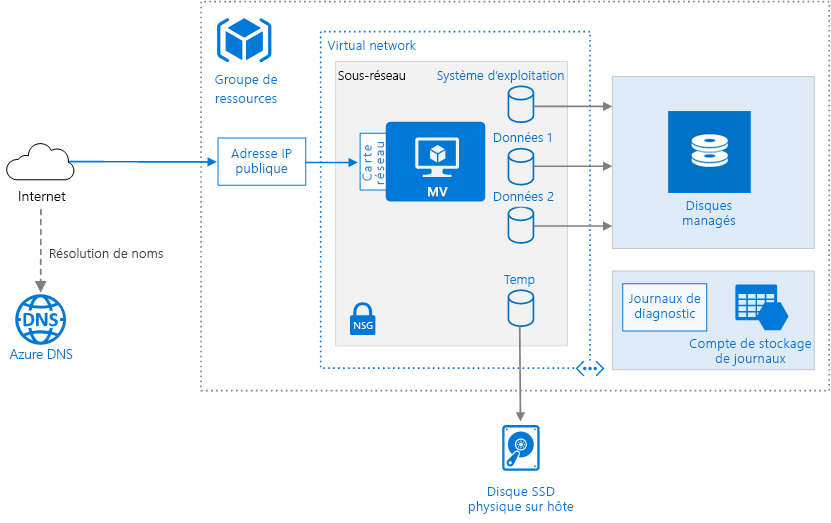

# <a name="run-a-windows-virtual-machine-on-azure"></a>Exécuter une machine virtuelle Windows dans Azure

Le provisionnement d’une machine virtuelle Azure nécessite des composants supplémentaires en plus de la machine virtuelle elle-même, notamment des ressources réseau et de stockage. Cet article décrit les bonnes pratiques pour l’exécution d’une machine virtuelle Windows sur Azure.



## <a name="resource-group"></a>Groupe de ressources

Un [groupe de ressources][resource-manager-overview] est un conteneur logique qui héberge les ressources Azure associées. En règle générale, regroupez les ressources en fonction de leur durée de vie et de qui va les gérer.

Placez les ressources étroitement associées qui partagent le même cycle de vie dans un même [groupe de ressources][resource-manager-overview]. Les groupes de ressources vous permettent de déployer et de surveiller les ressources en tant que groupe et de suivre les coûts de facturation par groupe de ressources. Vous pouvez également supprimer des ressources dans un ensemble, ce qui est très utile pour les déploiements de test. Affectez des noms de ressource explicites pour simplifier la recherche d’une ressource spécifique et comprendre son rôle. Pour plus d’informations, consultez [Conventions d’affectation de noms recommandées pour les ressources Azure][naming-conventions].

## <a name="virtual-machine"></a>Machine virtuelle

Vous pouvez approvisionner une machine virtuelle issue d’une liste d’images publiées, d’une image managée personnalisée ou d’un fichier de disque dur virtuel (VHD) chargé(e) dans Stockage Blob Azure.

Azure propose de nombreuses tailles de machines virtuelles. Pour plus d’informations, consultez [Tailles des machines virtuelles sur Azure][virtual-machine-sizes]. Si vous déplacez une charge de travail vers Azure, commencez par choisir la taille de machine virtuelle qui correspond le mieux à vos serveurs locaux. Mesurez ensuite les performances de votre charge de travail réelle en termes de processeur, de mémoire et d’opérations d’entrée/sortie par seconde du disque, puis ajustez la taille selon vos besoins.

En général, choisissez une région Azure la plus proche possible de vos utilisateurs internes ou de vos clients. Certaines tailles de machine virtuelle ne sont pas disponibles dans toutes les régions. Pour en savoir plus, consultez [Services par région][services-by-region]. Pour obtenir la liste des tailles de machine virtuelle disponibles dans une région spécifique, exécutez la commande suivante dans l’interface de ligne de commande (CLI) Azure :

```azurecli
az vm list-sizes --location <location>
```

Pour en savoir plus sur le choix d’une image de machine virtuelle publiée, voir [Comment rechercher des images de machine virtuelle Windows][select-vm-image].

## <a name="disks"></a>Disques

Pour optimiser les performances d’E/S du disque, nous vous recommandons le [Stockage Premium][premium-storage], qui stocke les données sur des disques SSD. Le coût est basé sur la capacité du disque approvisionné. Le nombre d’E/S par seconde et le débit dépendent également de la taille du disque. Lorsque vous approvisionnez un disque, vous devez donc tenir compte des trois facteurs : capacité, E/S par seconde et débit.

Nous vous recommandons également d’utiliser des [disques managés][managed-disks]. Les disques managés simplifient la gestion des disques en gérant le stockage pour vous. Les disques managés ne nécessitent pas de compte de stockage. Il vous suffit de spécifier leur taille et leur type, puis de les déployer en tant que ressource à haute disponibilité.

Le disque du système d’exploitation est un disque dur virtuel stocké dans [Stockage Azure][azure-storage], donc il persiste même lorsque l’ordinateur hôte est arrêté. Nous vous recommandons également de créer un ou plusieurs [disques de données][data-disk], qui sont des disques durs virtuels persistants utilisés pour les données d’application. Lorsque cela est possible, installez les applications sur un disque de données plutôt que sur le disque du système d’exploitation. Certaines applications héritées requièrent peut-être l’installation de composants sur le lecteur C: ; dans ce cas, vous pouvez [redimensionner le disque du système d’exploitation][resize-os-disk] à l’aide de PowerShell.

La machine virtuelle est créée avec un disque temporaire (le lecteur `D:` sur Windows). Ce disque est stocké sur un lecteur physique de l’ordinateur hôte. Il n’est *pas* enregistré dans Stockage Azure et peut être supprimé lors des redémarrages ou d’autres événements de cycle de vie de la machine virtuelle. N’utilisez ce disque que pour des données temporaires, telles que des fichiers de pagination ou d’échange.

## <a name="network"></a>Réseau

Les composants réseau incluent les ressources suivantes :

- **Réseau virtuel**. Chaque machine virtuelle est déployée dans un réseau virtuel qui peut être segmenté en plusieurs sous-réseaux.

- **Interfaces réseau (NIC)**. La carte d’interface réseau permet à la machine virtuelle de communiquer avec le réseau virtuel. Si vous avez besoin de plusieurs cartes réseau (NIC) pour votre machine virtuelle, notez que le nombre maximal de cartes réseau est défini pour chaque [taille de machine virtuelle][vm-size-tables].

- **Adresse IP publique**. Une adresse IP publique est nécessaire pour communiquer avec la machine virtuelle &mdash; par exemple via le protocole RDP. Cette adresse IP publique peut être dynamique ou statique. Par défaut, elle est dynamique.

- Utilisez une [adresse IP statique][static-ip] si vous avez besoin d’une adresse IP non modifiable &mdash; par exemple si vous devez créer un enregistrement « A » dans le DNS ou ajouter l’adresse IP dans une liste sécurisée.
- Vous pouvez également créer un nom de domaine complet (FQDN) pour l’adresse IP. Vous pouvez inscrire un [enregistrement CNAME][cname-record] dans le DNS qui pointe vers le nom de domaine complet (FQDN). Pour en savoir plus, voir [Créer un nom de domaine complet dans le Portail Azure][fqdn].

- **Groupe de sécurité réseau**. Les [groupes de sécurité réseau][nsg] sont utilisés pour autoriser ou refuser le trafic réseau vers des machines virtuelles. Les groupes de sécurité réseau peuvent être associés à des sous-réseaux ou à des instances de machine virtuelle individuelles.

Tous les groupes de sécurité réseau contiennent un ensemble de [règles par défaut][nsg-default-rules], notamment une règle qui bloque tout le trafic Internet entrant. Les règles par défaut ne peuvent pas être supprimées, mais d’autres règles peuvent les remplacer. Pour autoriser le trafic Internet, créez des règles qui autorisent le trafic entrant vers des ports spécifiques, par exemple, le port 80 pour HTTP. Pour activer le protocole RDP, ajoutez une règle de groupe de sécurité réseau qui autorise le trafic entrant sur le port TCP 3389.

## <a name="operations"></a>Opérations

**Diagnostics**. Permet la surveillance et le diagnostic, avec notamment des indicateurs d’intégrité de base, des journaux d’infrastructure de diagnostic et des [diagnostics de démarrage][boot-diagnostics]. Les diagnostics de démarrage peuvent vous aider à identifier le problème de démarrage si votre machine virtuelle refuse de démarrer. Créez un compte de stockage Azure pour stocker les journaux. Un compte de stockage localement redondant (LRS) standard suffit pour les journaux de diagnostic. Pour en savoir plus, voir [Activation de la surveillance et des diagnostics][enable-monitoring].

**Disponibilité**. Votre machine virtuelle peut être affectée par la [maintenance planifiée][planned-maintenance] ou un [temps d’arrêt non planifiée][manage-vm-availability]. Vous pouvez utiliser les [journaux de redémarrage de machine virtuelle][reboot-logs] pour déterminer si un redémarrage de la machine virtuelle a été provoqué par une maintenance planifiée. Pour bénéficier d’une disponibilité plus élevée, déployez plusieurs machines virtuelles dans un [groupe à haute disponibilité](/azure/virtual-machines/windows/manage-availability#configure-multiple-virtual-machines-in-an-availability-set-for-redundancy). Cette configuration offre un [contrat de niveau de service (SLA)][vm-sla] supérieur.

**Sauvegardes** : pour vous protéger contre la perte accidentelle de données, utilisez le service [Sauvegarde Azure](/azure/backup/) pour sauvegarder vos machines virtuelles dans un stockage géoredondant. Sauvegarde Azure offre des sauvegardes cohérentes avec les applications.

**Arrêt d’une machine virtuelle**. Azure établit une distinction entre les états « arrêté » et « désalloué ». Vous payez lorsque l’état de la machine virtuelle est « arrêté », mais pas lorsque la machine virtuelle est désallouée. Le bouton **Arrêter** du portail Azure désalloue la machine virtuelle. Si vous arrêtez la machine virtuelle par le biais du système d’exploitation pendant que vous êtes connecté, la machine virtuelle est arrêtée mais **non** désallouée. Vous serez donc toujours facturé.

**Suppression d’une machine virtuelle**.  La suppression d’une machine virtuelle n’entraîne pas celle des disques durs virtuels. Vous pouvez donc supprimer la machine virtuelle, sans risque de perdre des données. Toutefois, vous serez toujours facturé pour le stockage. Pour supprimer le disque dur virtuel, supprimez le fichier de [Stockage Blob][blob-storage]. Pour éviter toute suppression accidentelle, utilisez un [verrou de ressource][resource-lock] pour verrouiller tout le groupe de ressources ou des ressources individuelles, par exemple une machine virtuelle.

## <a name="security-considerations"></a>Considérations relatives à la sécurité

[Azure Security Center][security-center] vous offre un aperçu global de l’état de toutes vos ressources Azure en termes de sécurité. Il surveille les problèmes potentiels de sécurité et fournit une image complète de la sécurité de votre déploiement. Le Centre de sécurité est configuré pour chaque abonnement Azure. Activez la collecte de données de sécurité comme décrit dans [Intégrer un abonnement Azure à Security Center Standard][security-center-get-started]. Une fois la collecte de données activée, le Centre de sécurité analyse automatiquement les machines virtuelles créées dans le cadre de cet abonnement.

**Gestion des correctifs**. Si cette option est activée, Security Center vérifie si des mises à jour critiques et de sécurité sont manquantes. Utilisez les [paramètres de stratégie de groupe][group-policy] sur la machine virtuelle pour activer les mises à jour automatiques du système.

**Logiciel anti-programme malveillant**.  Si cette option est activée, le Centre de sécurité vérifie si un logiciel anti-programme malveillant est installé. Vous pouvez également utiliser le Centre de sécurité pour installer des logiciels anti-programme malveillant dans le portail Azure.

**Contrôle d’accès**. Utilisez le [contrôle d’accès en fonction du rôle (RBAC)][rbac] pour contrôler l’accès aux ressources Azure. Le contrôle RBAC vous permet d’affecter des rôles d’autorisation aux membres de votre équipe DevOps. Par exemple, le rôle Lecteur permet d’afficher des ressources Azure mais pas de les créer, gérer ou supprimer. Certaines autorisations sont spécifiques à un type de ressource Azure. Par exemple, le rôle Contributeur de machine virtuelle peut redémarrer ou désallouer une machine virtuelle, réinitialiser le mot de passe administrateur, créer une machine virtuelle, et ainsi de suite. D’autres [rôles RBAC intégrés][rbac-roles] peuvent être utiles dans cette architecture, notamment [Utilisateur DevTest Lab][rbac-devtest] et [Collaborateur de réseau][rbac-network]. 

> [!NOTE]
> Le contrôle RBAC ne limite pas les actions qu’un utilisateur connecté peut effectuer sur une machine virtuelle. Ces autorisations dépendent du type de compte installé sur le système d’exploitation invité.

**Journaux d’audit**. Utilisez les [journaux d’audit][audit-logs] pour voir les actions d’approvisionnement et d’autres événements concernant la machine virtuelle.

**Chiffrement des données**. Utilisez [Azure Disk Encryption][disk-encryption] si vous devez chiffrer les disques du système d’exploitation et de données.

## <a name="next-steps"></a>Étapes suivantes

- Pour provisionner une machine virtuelle Windows, consultez [Créer et gérer des machines virtuelles Windows avec Azure PowerShell](/azure/virtual-machines/windows/tutorial-manage-vm)
- Pour une architecture multiniveau complète sur des machines virtuelles Windows, consultez [Architecture multiniveau Windows sur Azure avec SQL Server](./n-tier-sql-server.md).

<!-- links -->
[audit-logs]: https://azure.microsoft.com/blog/analyze-azure-audit-logs-in-powerbi-more/
[azure-storage]: /azure/storage/storage-introduction
[blob-storage]: /azure/storage/storage-introduction
[boot-diagnostics]: https://azure.microsoft.com/blog/boot-diagnostics-for-virtual-machines-v2/
[cname-record]: https://en.wikipedia.org/wiki/CNAME_record
[data-disk]: /azure/virtual-machines/virtual-machines-windows-about-disks-vhds
[disk-encryption]: /azure/security/azure-security-disk-encryption
[enable-monitoring]: /azure/monitoring-and-diagnostics/insights-how-to-use-diagnostics
[fqdn]: /azure/virtual-machines/virtual-machines-windows-portal-create-fqdn
[group-policy]: /windows-server/administration/windows-server-update-services/deploy/4-configure-group-policy-settings-for-automatic-updates
[manage-vm-availability]: /azure/virtual-machines/virtual-machines-windows-manage-availability
[managed-disks]: /azure/storage/storage-managed-disks-overview
[naming-conventions]: ../../best-practices/naming-conventions.md
[nsg]: /azure/virtual-network/virtual-networks-nsg
[nsg-default-rules]: /azure/virtual-network/virtual-networks-nsg#default-rules
[planned-maintenance]: /azure/virtual-machines/virtual-machines-windows-planned-maintenance
[premium-storage]: /azure/virtual-machines/windows/premium-storage
[rbac]: /azure/active-directory/role-based-access-control-what-is
[rbac-roles]: /azure/active-directory/role-based-access-built-in-roles
[rbac-devtest]: /azure/active-directory/role-based-access-built-in-roles#devtest-labs-user
[rbac-network]: /azure/active-directory/role-based-access-built-in-roles#network-contributor
[reboot-logs]: https://azure.microsoft.com/blog/viewing-vm-reboot-logs/
[resize-os-disk]: /azure/virtual-machines/virtual-machines-windows-expand-os-disk
[resource-lock]: /azure/resource-group-lock-resources
[resource-manager-overview]: /azure/azure-resource-manager/resource-group-overview
[security-center]: /azure/security-center/security-center-intro
[security-center-get-started]: /azure/security-center/security-center-get-started
[select-vm-image]: /azure/virtual-machines/virtual-machines-windows-cli-ps-findimage
[services-by-region]: https://azure.microsoft.com/regions/#services
[static-ip]: /azure/virtual-network/virtual-networks-reserved-public-ip
[virtual-machine-sizes]: /azure/virtual-machines/virtual-machines-windows-sizes
[visio-download]: https://archcenter.blob.core.windows.net/cdn/vm-reference-architectures.vsdx
[vm-size-tables]: /azure/virtual-machines/virtual-machines-windows-sizes
[vm-sla]: https://azure.microsoft.com/support/legal/sla/virtual-machines
