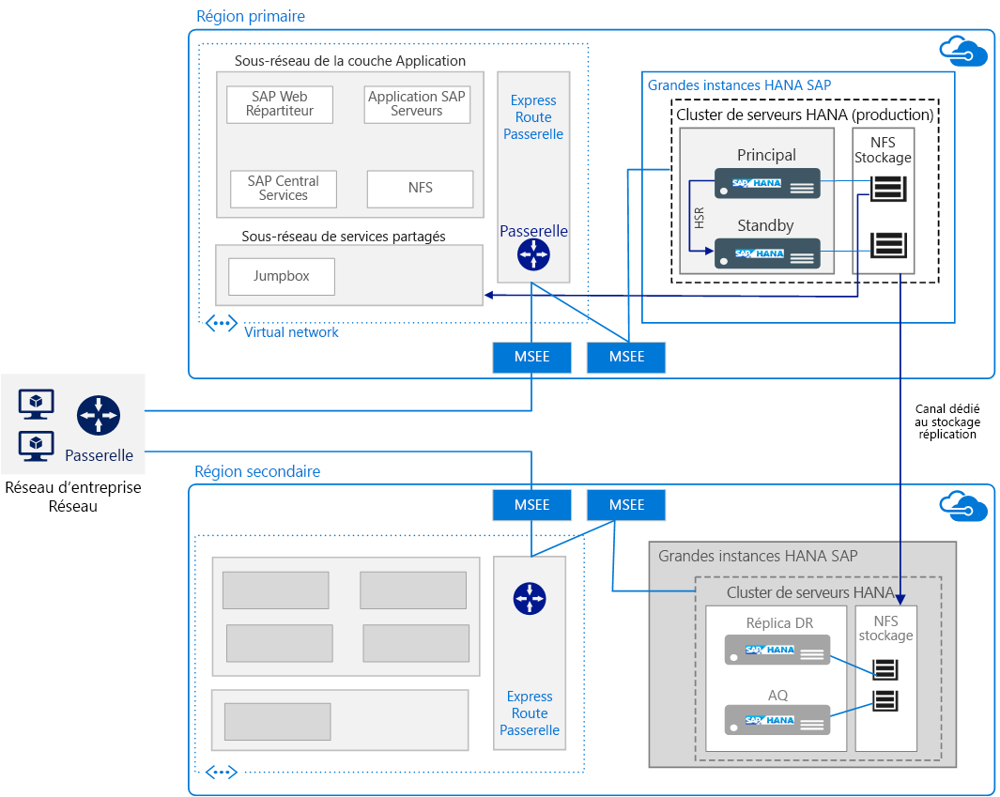

# Exécution de SAP HANA sur les grandes instances Azure

Cette architecture de référence présente un ensemble de pratiques éprouvées pour l’exécution de SAP HANA sur Azure (grandes instances) dans un environnement à haute disponibilité et à récupération d’urgence. Appelée Grandes instances HANA, cette offre est déployée sur des serveurs physiques dans des régions Azure.

*Téléchargez un [fichier Visio][visio-download] de cette architecture.*

> [!NOTE]
> Le déploiement de cette architecture de référence requiert une licence appropriée des produits SAP et d’autres technologies non Microsoft.

## Architecture

Cette architecture est constituée des composants d’infrastructure suivants.

- **Réseau virtuel**. Le service [Réseau virtuel Azure][vnet] se connecte les ressources Azure entre elles de façon sécurisée et est subdivisé en [sous-réseaux][subnet] pour chaque couche. Les couches d’application SAP sont déployées sur des machines virtuelles (VM) Azure pour établir la connexion à la couche de base de données HANA résidant sur de grandes instances.

- **Machines virtuelles**. Les machines virtuelles sont utilisées dans la couche Application SAP et la couche de services partagés. Cette dernière inclut un serveur de rebond (jumpbox) utilisé par les administrateurs pour configurer les grandes instances HANA et pour fournir l’accès à d’autres machines virtuelles.

- **Grande instance SAP HANA**. Un [serveur physique][physical] certifié conforme aux normes de SAP HANA TDI (Tailored Datacenter Integration) exécute SAP HANA. Cette architecture utilise deux grandes instances HANA : une unité Compute principale et une secondaire. Au niveau de la couche de données, la haute disponibilité est fournie par la Réplication de système HANA (HSR).

- **Paire haute disponibilité**. Les lames hébergeant les grandes instances HANA sont gérées conjointement en groupe pour assurer la redondance et la fiabilité de l’application.

- **MSEE (Microsoft Enterprise Edge)**. MSEE est un point de connexion à partir d’un fournisseur de connectivité ou de la périphérie du réseau via un circuit ExpressRoute.

- **Cartes d’interface réseau**. Pour activer la communication, le serveur grande instance HANA fournit quatre cartes réseau virtuels par défaut. Cette architecture requiert une carte réseau pour la communication client, une deuxième carte réseau pour la connectivité nœud à nœud exigée par HSR, une troisième carte réseau pour le stockage de la grande instance HANA et une quatrième pour iSCSI utilisé dans le clustering à haute disponibilité.

- **Stockage NFS (Network File System)**. Le serveur [NFS][nfs] prend en charge le partage de fichiers réseau qui assure la persistance des données sécurisée de la grande instance HANA.

- **ExpressRoute**. [ExpressRoute][expressroute] est le service réseau Azure recommandé pour la création de connexions privées entre un réseau local et les réseaux virtuels Azure non accessibles via le réseau Internet public. Les machines virtuelles Azure se connectent aux grandes instances HANA à l’aide d’une autre connexion ExpressRoute. La connexion ExpressRoute entre le réseau virtuel Azure et les grandes instances HANA est configurée dans le cadre de l’offre Microsoft.

- **Passerelle**. La passerelle ExpressRoute est utilisée pour connecter le réseau virtuel Azure utilisé pour la couche Application SAP au réseau hébergeant la grande instance HANA. Utilisez la référence SKU [Hautes performances ou ultra-performance][sku].

- **Récupération d’urgence**. Sur demande, la réplication du stockage est prise en charge et configurée du site principal vers le [site de récupération d’urgence][DR-site] situé dans une autre région.

## Recommandations

Les exigences pouvant varier, utilisez ces suggestions comme point de départ.

### Calcul des grandes instances HANA

Les [grandes instances][physical] sont des serveurs physiques basés sur l’architecture de processeur Intel EX E7 et configurés dans un tampon de grande instance, c’est-à-dire un ensemble spécifique de serveurs ou de lames. Une unité Compute équivaut à un serveur ou une lame et un tampon est constitué de plusieurs serveurs ou lames. Dans un tampon de grande instance, les serveurs ne sont pas partagés et sont dédiés à l’exécution du déploiement SAP HANA d’un client.

Différentes références SKU sont disponibles pour les grandes instances HANA, prenant en charge une instance unique jusqu’à 20 To (augmentation jusqu’à 60 To) de mémoire pour S/4HANA ou d’autres charges de travail SAP HANA. [Deux classes][classes] de serveurs sont proposées :

- Classe de type I : S72, S72m, S144, S144m, S192 et S192m

- Classe de type II : S384, S384m, S384xm, S576m, S768m et S960m

Par exemple, la référence SKU S72 est fournie avec 768 Go de RAM, 3 téraoctets (To) de stockage et 2 processeurs Intel Xeon (E7-8890 v3) avec 36 noyaux. Choisissez une référence SKU conforme aux exigences de dimensionnement déterminées lors de vos sessions d’architecture et de conception. Vérifiez toujours que le dimensionnement s’applique à la référence SKU correcte. Les capacités et les exigences de déploiement [varient par type][type], et la disponibilité varie par [région][region]. Vous pouvez également changer de configuration et passer d’une référence SKU à une autre référence plus grande.

Microsoft vous aide à mettre en place la configuration de la grande instance, mais il vous incombe de vérifier les paramètres de configuration du système d’exploitation. Relisez bien les Notes SAP les plus récentes pour votre version Linux.

### Stockage

La disposition de stockage est implémentée conformément à la recommandation de la norme TDI pour SAP HANA. Les grandes instances HANA sont livrées avec une configuration de stockage spécifique pour les spécifications TDI standard. Toutefois, vous pouvez acheter du stockage supplémentaire par incréments de 1 To.

Pour prendre en charge les exigences des environnements critiques, y compris la récupération rapide, NFS est utilisé plutôt que le stockage en attachement direct. Le serveur de stockage NFS pour les grandes instances HANA est hébergé dans un environnement mutualisé, où les locataires sont séparés et sécurisés à l’aide de l’isolation du calcul, du réseau et du stockage.

Pour prendre en charge la haute disponibilité sur le site principal, utilisez des dispositions de stockage différentes. Par exemple, dans un environnement scale-out multi-hôte, le stockage est partagé. La réplication basée sur l’application (HSR, par exemple) est une autre option de haute disponibilité. Toutefois, pour la récupération d’urgence, une réplication de stockage basée sur un instantané est utilisée.

### Mise en réseau

Cette architecture utilise des réseaux virtuels et physiques. Le réseau virtuel fait partie d’Azure IaaS et se connecte à un réseau physique distinct de grandes instances HANA via des circuits [ExpressRoute][expressroute]]. Une passerelle entre différents locaux connecte vos charges travail dans le réseau virtuel Azure à vos sites locaux.

Les réseaux hébergeant les grandes instances HANA sont isolés les uns des autres pour assurer la sécurité. Les instances résidant dans des régions différentes ne communiquent pas les unes avec les autres, sauf pour la réplication de stockage dédiée. Toutefois, pour utiliser HSR, les communications entre régions sont requises. Les [tables de routage IP][ip] ou proxies peuvent être utilisées pour activer la fonction HSR entre les régions.

Tous les réseaux virtuels Azure qui se connectent à des grandes instances HANA dans une région peuvent être [interconnectés][cross-connected] via ExpressRoute aux grandes instances HANA d’une région secondaire.

ExpressRoute pour les grandes instances HANA est inclus par défaut lors de l’approvisionnement. Pour la configuration, une disposition de réseau spécifique est nécessaire, y compris les plages d’adresses CIDR requises et le routage de domaine. POur en savoir plus, consultez [Infrastructure et connectivité à SAP HANA (grandes instances) sur Azure][HLI-infrastructure].

## Considérations relatives à l’extensibilité

Pour augmenter ou réduire l’échelle, vous avez le choix entre différentes tailles de serveurs disponibles pour les grandes instances HANA. Ils sont classés [Type I ou Type II][classes] et adaptés aux différentes charges de travail. Choisissez une taille pouvant croître avec votre charge de travail au cours des trois prochaines années. Des engagements d’un an sont également disponibles.

Un déploiement scale-out multi-hôte est généralement utilisé pour les déploiements BW/4HANA comme stratégie de partitionnement de base de données. Pour augmenter la taille des instances, planifiez le positionnement des tables HANA avant l’installation. À partir d’un point hôtes sont connectés à un volume de stockage partagé, permettant la prise de contrôle rapide par les hôtes de secours en cas de défaillance d’un des nœuds de travail du système HANA.

Sur une lame unique, la taille des instances S/4HANA et SAP Business Suite sur HANA peut être augmentée jusqu’à 20 To avec une seule instance des grandes instances HANA.

Pour les nouveaux déploiements, [SAP Quick Sizer][quick-sizer] permet de calculer les besoins en mémoire de l’implémentation du logiciel SAP sur HANA. La mémoire requise pour HANA augmente à mesure que le volume de données augmente. Utilisez la consommation de mémoire actuelle de votre système comme base pour prévoir la consommation future, puis mappez votre demande à l’une des tailles de grandes instances HANA.

Si vous avez déjà des déploiements SAP, SAP fournit des rapports que vous pouvez utiliser pour vérifier les données utilisées par les systèmes existants et calculer la configuration mémoire requises pour une instance HANA. Par exemple, consultez les Notes SAP suivantes :

- Note de support SAP [1793345][sap-1793345] - Sizing for SAP Suite on HANA (Dimensionnement de SAP Suite sur HANA)
- Note de support SAP [1872170][sap-1872170] - Suite on HANA and S/4 HANA sizing report (Rapport de dimensionnement de Suite sur HANA et S/4 HANA)
- Note de support SAP [2121330][sap-2121330] - FAQ: SAP BW on HANA Sizing Report (FAQ : rapport de redimensionnement SAP BW sur HANA)
- Note de support SAP [1736976][sap-1736976] - Sizing Report for BW on HANA (Rapport de dimensionnement de BW sur HANA)
- Note de support SAP [2296290][sap-2296290] - New Sizing Report for BW on HANA (Nouveau rapport de dimensionnement pour BW sur HANA)

## Considérations relatives à la disponibilité

La redondance des ressources constitue le thème général dans les solutions d’infrastructure à haute disponibilité. Pour les entreprises qui présentent un SLA moins strict, les machines virtuelles Azure à instance unique offrent un SLA garantissant un certain temps de disponibilité. Pour plus d'informations, consultez [Contrat de niveau de service Azure](https://azure.microsoft.com/support/legal/sla/).

Collaborez avec SAP, votre intégrateur de systèmes ou Microsoft pour concevoir et implémenter efficacement la stratégie [de haute disponibilité et récupération d’urgence][hli-hadr]. Cette architecture suit le [contrat de niveau de service][sla] (SLA) pour HANA sur Azure (grandes instances). Pour évaluer vos besoins de disponibilité, tenez compte des points de défaillance uniques, du niveau souhaité de disponibilité des services et de ces mesures courantes :

- L’objectif de délai de récupération (RTO) est la durée pendant laquelle le serveur de grandes instances HANA n’est pas disponible.

- L’objectif de point de récupération (RPO) est la période maximale acceptable pendant laquelle les données clients risquent d’être perdues en raison d’une défaillance.

Pour la haute disponibilité, déployez plusieurs instances dans une paire haute disponibilité et utilisez HSR en mode synchrone pour réduire la perte de données et les temps d’arrêt. Outre une installation locale haute disponibilité à deux nœuds, HSR prend en charge la réplication à plusieurs niveaux, où un troisième nœud d’une région Azure distincte s’enregistre sur le réplica secondaire de la paire HSR en cluster en tant que cible de réplication. Il en résulte une configuration en chaîne de la réplication. Le basculement vers le nœud de récupération d’urgence est un processus manuel.

Lorsque vous configurez la fonction HSR sur les grandes instances HANA avec le basculement automatique, vous pouvez demander à l’équipe de gestion des services Microsoft de configurer un [appareil STONITH][stonith] pour vos serveurs existants.

## Considérations relatives à la récupération d’urgence

Cette architecture prend en charge la [récupération d’urgence][hli-dr] entre les grandes instances HANA dans différentes régions Azure. Il existe deux façons de prendre en charge la récupération d’urgence avec les grandes instances HANA :

- Réplication du stockage. Le contenu du stockage principal est répliqué en permanence vers les systèmes de stockage de récupération d’urgence à distance qui sont disponibles sur le serveur de récupération d’urgence des grandes instances HANA désigné. Pour la réplication du stockage, la base de données HANA n’est pas chargée en mémoire. Cette option de récupération d’urgence est plus simple d’un point de vue administratif. Pour déterminer s’il s’agit d’une stratégie appropriée, comparez le temps de chargement de la base de données au contrat SLA de disponibilité. La réplication du stockage vous permet également d’effectuer une récupération jusqu’à une date et une heure. Si la récupération d’urgence polyvalente (au coût optimisé) est configurée, vous devez acheter un stockage supplémentaire de la même taille sur le site de récupération d’urgence. Microsoft fournit [une capture instantanée de stockage et des scripts de basculement][scripts] en libre-service dans le cadre de l’offre des grandes instances HANA.

- HSR à plusieurs niveaux avec un troisième réplica dans la région de récupération d’urgence (où la base de données HANA est chargée dans la mémoire). Cette option prend en charge un temps de récupération plus rapide, mais ne prend pas en charge la récupération jusqu’à une date et heure. HSR nécessite un système secondaire. La réplication du système HANA pour le site de récupération d’urgence est gérée via des proxies comme les tables nginx ou IP.

> [!NOTE]
> Vous pouvez optimiser cette architecture de référence pour les coûts en exécutant dans un environnement à instance unique. Ce [scénario au coût optimisé](https://blogs.sap.com/2016/07/19/new-whitepaper-for-high-availability-for-sap-hana-cost-optimized-scenario/) convient aux charges de travail HANA hors production.

## Considérations relatives à la sauvegarde

En fonction de vos exigences professionnelles, choisissez parmi plusieurs options disponibles pour [la sauvegarde et la restauration][hli-backup].

| Option de sauvegarde                   | Avantages                                                                                                   | Inconvénients                                                       |
|---------------------------------|--------------------------------------------------------------------------------------------------------|------------------------------------------------------------|
| Sauvegarde HANA        | Native sur SAP. Vérification de la cohérence intégrée.                                                             | Temps de sauvegarde et de récupération longs. Consommation de l’espace de stockage. |
| Instantané HANA      | Native sur SAP. Sauvegarde et restauration rapides.                                                               |                                       |
| Instantané de stockage   | Inclus avec les grandes instances HANA. Récupération d’urgence pour les grandes instances HANA. Prise en charge de la sauvegarde du volume de démarrage. | 254 instantanés maximum par volume.                          |
| Sauvegarde du journal         | Requis pour la récupération jusqu’à une date et heure.                                                                   |                                                            |
| Autres outils de sauvegarde | Emplacement de sauvegarde redondant.                                                                             | Coûts de licence supplémentaires.                                |

## Considérations relatives à la facilité de gestion

Surveillez les ressources des grandes instances HANA telles que le processeur, la mémoire, la bande passante réseau et l’espace de stockage à l’aide de SAP HANA Studio, SAP HANA Cockpit, SAP Solution Manager et d’autres outils Linux natifs. Les grandes instances HANA ne sont pas fournies avec les outils de surveillance intégrés. Microsoft propose des ressources pour vous aider à [dépanner et contrôler][hli-troubleshoot] en fonction des exigences de votre organisation et l’équipe de support de Microsoft peut vous aider à résoudre les problèmes techniques.

Pour bénéficier de capacités de calcul supplémentaires, vous devez obtenir une référence SKU supérieure.

## Considérations relatives à la sécurité

- Par défaut, les grandes instances HANA utilisent le chiffrement de stockage basé sur TDE (Transparent Data Encryption) pour les données au repos.

- Les données en transit entre les grandes instances HANA et les machines virtuelles ne sont pas chiffrées. Pour chiffrer le transfert de données, activez le chiffrement spécifique à l’application. Voir la note de support SAP [2159014][sap-2159014] - FAQ: SAP HANA Security (Sécurité de SAP HANA).

- L’isolation assure la sécurité entre les locataires dans l’environnement de grande instance HANA multi-locataire. Les locataires sont isolés à l’aide de leur propre réseau local virtuel.

- Les [meilleures pratiques en matière de sécurité réseau Azure][network-best-practices] fournissent des instructions utiles.

- Comme dans tout déploiement, le [renforcement du système d’exploitation][os-hardening] est recommandé.

- Pour la sécurité physique, l’accès aux centres de données Azure est limité au personnel autorisé uniquement. Aucun client ne peut accéder aux serveurs physiques.

Pour plus d’informations, consultez [SAP HANA Security—An Overview][sap-security]. (Un compte SAP Service Marketplace est requis pour l’accès.)

## Communautés

Les communautés peuvent répondre aux questions et vous aider à paramétrer un déploiement réussi. Tenez compte des éléments suivants :

- [Blog Running SAP Applications on the Microsoft Platform][running-sap-blog] (Exécution des applications SAP sur la plateforme Microsoft)
- [Support de la communauté Azure][azure-forum]
- [Communauté SAP][sap-community]
- [Stack Overflow SAP][stack-overflow]

## Ressources associées

Vous pouvez consulter les [exemples de scénarios Azure](/azure/architecture/example-scenario) suivants, qui décrivent des solutions spécifiques utilisant certaines de ces technologies :

- [Exécution des charges de travail de production SAP à l’aide d’Oracle Database sur Azure](/azure/architecture/example-scenario/apps/sap-production)
- [Environnements de développement/test pour les charges de travail SAP sur Azure](/azure/architecture/example-scenario/apps/sap-dev-test)

<!-- links -->

[azure-forum]: https://azure.microsoft.com/support/forums/
[azure-large-instances]: /azure/virtual-machines/workloads/sap/hana-overview-architecture
[classes]: /azure/virtual-machines/workloads/sap/hana-overview-architecture
[cross-connected]: /azure/virtual-machines/workloads/sap/hana-overview-high-availability-disaster-recovery#network-considerations-for-disaster-recovery-with-hana-large-instances
[dr-site]: /azure/virtual-machines/workloads/sap/hana-overview-high-availability-disaster-recovery
[expressroute]: /azure/architecture/reference-architectures/hybrid-networking/expressroute
[filter-network]: https://azure.microsoft.com/blog/multiple-vm-nics-and-network-virtual-appliances-in-azure/
[hli-dr]: /azure/virtual-machines/workloads/sap/hana-overview-high-availability-disaster-recovery#network-considerations-for-disaster-recovery-with-hana-large-instances
[hli-backup]: /azure/virtual-machines/workloads/sap/hana-overview-high-availability-disaster-recovery#backup-and-restore
[hli-hadr]: /azure/virtual-machines/workloads/sap/hana-overview-high-availability-disaster-recovery?toc=%2fazure%2fvirtual-machines%2flinux%2ftoc.json
[hli-infrastructure]: /azure/virtual-machines/workloads/sap/hana-overview-infrastructure-connectivity
[hli-overview]: /azure/virtual-machines/workloads/sap/hana-overview-architecture
[hli-troubleshoot]: /azure/virtual-machines/workloads/sap/troubleshooting-monitoring
[ip]: https://blogs.msdn.microsoft.com/saponsqlserver/2018/02/10/setting-up-hana-system-replication-on-azure-hana-large-instances/
[network-best-practices]: /azure/security/azure-security-network-security-best-practices
[nfs]: /azure/virtual-machines/workloads/sap/high-availability-guide-suse-nfs
[os-hardening]: /azure/security/azure-security-iaas
[physical]: /azure/virtual-machines/workloads/sap/hana-overview-architecture
[planning]: /azure/vpn-gateway/vpn-gateway-plan-design
[protecting-sap]: https://blogs.msdn.microsoft.com/saponsqlserver/2016/05/06/protecting-sap-systems-running-on-vmware-with-azure-site-recovery/
[ref-arch]: /azure/architecture/reference-architectures/
[running-SAP]: https://blogs.msdn.microsoft.com/saponsqlserver/2016/06/07/sap-on-sql-general-update-for-customers-partners-june-2016/
[region]: https://azure.microsoft.com/global-infrastructure/services/
[running-sap-blog]: https://blogs.msdn.microsoft.com/saponsqlserver/2017/05/04/sap-on-azure-general-update-for-customers-partners-april-2017/
[quick-sizer]: https://service.sap.com/quicksizing
[sap-1793345]: https://launchpad.support.sap.com/#/notes/1793345
[sap-1872170]: https://launchpad.support.sap.com/#/notes/1872170
[sap-2121330]: https://launchpad.support.sap.com/#/notes/2121330
[sap-2159014]: https://launchpad.support.sap.com/#/notes/2159014
[sap-1736976]: https://launchpad.support.sap.com/#/notes/1736976
[sap-2296290]: https://launchpad.support.sap.com/#/notes/2296290
[sap-community]: https://www.sap.com/community.html
[sap-security]: https://archive.sap.com/documents/docs/DOC-62943
[scripts]: /azure/virtual-machines/workloads/sap/hana-overview-high-availability-disaster-recovery
[sku]: /azure/expressroute/expressroute-about-virtual-network-gateways
[sla]: https://azure.microsoft.com/support/legal/sla/virtual-machines
[stack-overflow]: https://stackoverflow.com/tags/sap/info
[stonith]: /azure/virtual-machines/workloads/sap/ha-setup-with-stonith
[subnet]: /azure/virtual-network/virtual-network-manage-subnet
[swd]: https://help.sap.com/doc/saphelp_nw70ehp2/7.02.16/en-us/48/8fe37933114e6fe10000000a421937/frameset.htm
[type]: /azure/virtual-machines/workloads/sap/hana-installation
[vnet]: /azure/virtual-network/virtual-networks-overview
[visio-download]: https://archcenter.blob.core.windows.net/cdn/sap-reference-architectures.vsdx