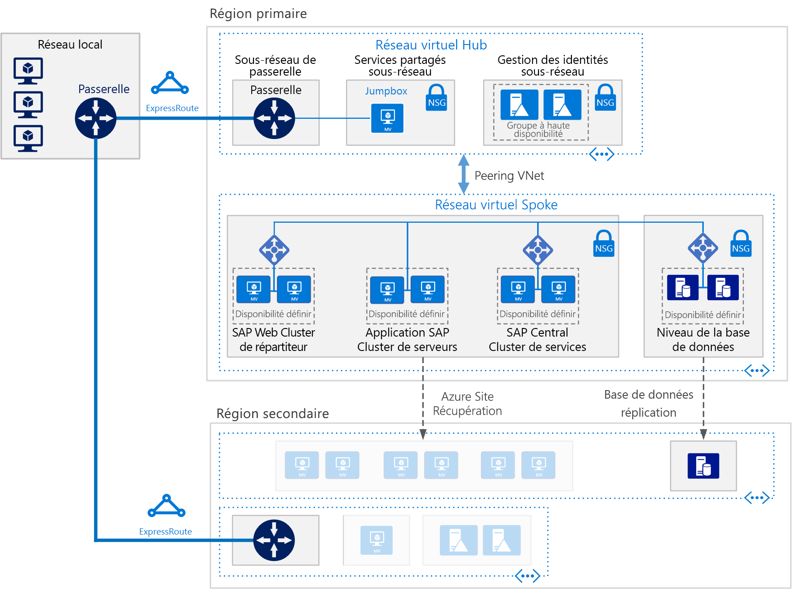

# Déployer SAP NetWeaver (Windows) pour AnyDB sur des machines virtuelles Azure

Cette architecture de référence présente un ensemble de pratiques éprouvées pour l’exécution de SAP NetWeaver dans un environnement Windows sur Azure avec une haute disponibilité. La base de données est AnyDB, le terme SAP pour tout SGBD pris en charge en plus de SAP HANA. Cette architecture est déployée avec des tailles de machine virtuelle spécifiques qui peuvent être modifiées en fonction des besoins de votre organisation.

*Téléchargez un [fichier Visio][visio-download] de cette architecture.*

> [!NOTE]
> Le déploiement de cette architecture de référence requiert une licence appropriée des produits SAP et d’autres technologies non Microsoft.

## Architecture

L’architecture est constituée des composants d’infrastructure et des composants logiciels clés suivants.

**Réseau virtuel**. Le service Réseau virtuel Azure connecte en toute sécurité les ressources Azure entre elles. Dans cette architecture, le réseau virtuel se connecte à un environnement local via une passerelle VPN déployée dans le hub d’une topologie [hub-and-spoke](../hybrid-networking/hub-spoke.md). Le spoke est le réseau virtuel utilisé pour les applications SAP et la couche Données.

**Sous-réseaux**. Le réseau virtuel est divisé en sous-réseaux distincts pour chaque couche : Application (SAP NetWeaver), Base de données, Services partagés (jumpbox) et Active Directory.

**Machines virtuelles**. Cette architecture utilise des machines virtuelles regroupées comme suit pour les couches Application et Base de données :

- **SAP NetWeaver**. La couche Application utilise des machines virtuelles Windows et exécute les services centraux SAP et des serveurs d’applications SAP. Les machines virtuelles qui exécutent les services centraux sont configurées en tant que cluster de basculement Windows Server pour la haute disponibilité, pris en charge par SIOS DataKeeper Cluster Edition.
- **AnyDB**. La couche Base de données exécute AnyDB (Microsoft SQL Server, Oracle, IBM DB2, etc.) en tant que base de données source.
- **Jumpbox**. Également appelé hôte bastion. Il s’agit d’une machine virtuelle sécurisée sur le réseau, utilisée par les administrateurs pour se connecter aux autres machines virtuelles.
- **Contrôleurs de domaine Windows Server Active Directory**. Les contrôleurs de domaine sont utilisés pour l’ensemble des machines virtuelles et des utilisateurs du domaine.

**Équilibreurs de charge** : Les instances [Azure Load Balancer](/azure/load-balancer/load-balancer-overview) servent à distribuer le trafic vers les machines virtuelles du sous-réseau de la couche Application. Il est possible d’obtenir une haute disponibilité au niveau de la couche données à l’aide d’équilibreurs de charge SAP intégrés, Azure Load Balancer, ou d’autres mécanismes, en fonction du système SGBD. Pour plus d’informations, consultez [Déploiement SGBD de machines virtuelles Azure pour SAP NetWeaver](/azure/virtual-machines/workloads/sap/dbms-guide).

**Groupes à haute disponibilité**. Les machines virtuelles pour les rôles SAP Web Dispatcher, Serveur d’applications SAP et (A)SCS sont réunies dans des [groupes à haute disponibilité](/azure/virtual-machines/windows/tutorial-availability-sets) distincts, et au moins deux machines virtuelles sont approvisionnées pour chaque rôle. Cela rend les machines virtuelles éligibles pour un [contrat de niveau de service](https://azure.microsoft.com/support/legal/sla/virtual-machines) (SLA) plus élevé.

**Cartes réseau**. Les [cartes réseau](/azure/virtual-network/virtual-network-network-interface) assurent l’ensemble des communications des machines virtuelles sur un réseau virtuel.

**Groupes de sécurité réseau**. Pour limiter le trafic entrant, sortant et intra-sous-réseau dans le réseau virtuel, vous pouvez créer des [groupes de sécurité réseau](/azure/virtual-network/virtual-networks-nsg) (NSG).

**Passerelle**. Une passerelle étend votre réseau local au réseau virtuel Azure. [ExpressRoute](/azure/architecture/reference-architectures/hybrid-networking/expressroute) est le service Azure recommandé pour la création de connexions privées qui ne passent pas par l’Internet public, mais il est également possible d’utiliser une connexion [site à site](/azure/vpn-gateway/vpn-gateway-howto-site-to-site-resource-manager-portal).

**Stockage Azure**. Pour bénéficier d’un stockage permanent du disque dur virtuel d’une machine virtuelle, le service [Stockage Azure](/azure/storage/storage-standard-storage) est requis. Il est également utilisé par le [témoin de cloud](/windows-server/failover-clustering/deploy-cloud-witness) pour mettre en œuvre les opérations du cluster de basculement.

## Recommandations

Vos exigences peuvent différer de celles de l’architecture décrite ici. Utilisez ces recommandations comme point de départ.

### Pool SAP Web Dispatcher

Le composant Web Dispatcher sert d’équilibreur de charge pour le trafic SAP entre les serveurs d’applications SAP. Afin d’assurer la haute disponibilité pour le composant Web Dispatcher, Azure Load Balancer est utilisé pour implémenter l’installation Web Dispatcher parallèle. Web Dispatcher utilise une configuration de tourniquet (round robin) pour la distribution du trafic HTTP(S) entre les instances Web Dispatcher disponibles dans le pool d’équilibreurs.

Pour plus d’informations sur l’exécution de SAP NetWeaver sur des machines virtuelles Azure, consultez [Planification et implémentation de machines virtuelles Azure pour SAP NetWeaver](/azure/virtual-machines/workloads/sap/planning-guide).

### Pool de serveurs d’applications

Pour gérer les groupes de connexion des serveurs d’applications ABAP, la transaction SMLG est utilisée. Elle s’appuie sur la fonction d’équilibrage de charge au sein du serveur de messages des services centraux pour répartir la charge de travail entre le pool de serveurs d’applications pour le trafic des clients SAP GUI et RFC. La connexion des serveurs d’applications aux services centraux hautement disponibles se fait via le nom du réseau virtuel du cluster.

### Cluster des services centraux SAP

Cette architecture de référence exécute les services centraux sur les machines virtuelles de la couche application. Les services centraux représentent un point de défaillance unique (SPOF) potentiel lors du déploiement sur une seule machine virtuelle — un déploiement classique quand la haute disponibilité ne constitue pas une exigence. Pour implémenter une solution à haute disponibilité, il est possible d’utiliser soit un cluster de disque partagé, soit un cluster de partage de fichiers.

Pour configurer des machines virtuelles pour un cluster de disque partagé, utilisez le [cluster de basculement Windows Server](https://blogs.sap.com/2018/01/25/how-to-create-sap-resources-in-windows-failover-cluster/). Le [témoin de cloud](/windows-server/failover-clustering/deploy-cloud-witness) est recommandé en tant que témoin de quorum. Pour prendre en charge l’environnement de cluster de basculement, [SIOS DataKeeper Cluster Edition](https://azuremarketplace.microsoft.com/marketplace/apps/sios_datakeeper.sios-datakeeper-8) exécute la fonction de volume partagé de cluster en répliquant des disques indépendants détenus par les nœuds de cluster. Azure ne prend pas en charge les disques partagés de manière native et nécessite donc les solutions fournies par SIOS.

Pour plus d’informations, consultez « 3. Important Update for SAP Customers Running ASCS on SIOS on Azure » (Mise à jour importante pour les clients SAP exécutant ASCS sur SIOS dans Azure) sur le blog clients en cours d’exécution ASC sur SIOS sur Azure » sur le blog [Running SAP applications on the Microsoft platform](https://blogs.msdn.microsoft.com/saponsqlserver/2017/05/04/sap-on-azure-general-update-for-customers-partners-april-2017/) (Exécution des applications SAP sur la plateforme Microsoft).

Une autre solution pour gérer le clustering consiste à implémenter un cluster de partage de fichiers à l’aide du cluster de basculement Windows Server. [SAP](https://blogs.sap.com/2018/03/19/migration-from-a-shared-disk-cluster-to-a-file-share-cluster/) a récemment modifié le modèle de déploiement des services centraux pour accéder aux répertoires globaux /sapmnt via un chemin d’accès UNC. Cette modification [élimine la nécessité](https://blogs.msdn.microsoft.com/saponsqlserver/2017/08/10/high-available-ascs-for-windows-on-file-share-shared-disk-no-longer-required/) de SIOS ou d’autres solutions de disque partagé sur les machines virtuelles des services centraux. Il est toutefois recommandé de s’assurer que le partage UNC /sapmnt est [hautement disponible](https://blogs.sap.com/2017/07/21/how-to-create-a-high-available-sapmnt-share/). Cela peut être effectué sur l’instance des services centraux en utilisant le cluster de basculement Windows Server avec le [serveur de fichiers Scale Out](https://blogs.msdn.microsoft.com/saponsqlserver/2017/11/14/file-server-with-sofs-and-s2d-as-an-alternative-to-cluster-shared-disk-for-clustering-of-an-sap-ascs-instance-in-azure-is-generally-available/) (SOFS) et la fonctionnalité d’[espaces de stockage direct](https://blogs.sap.com/2018/03/07/your-sap-on-azure-part-5-ascs-high-availability-with-storage-spaces-direct/) de Windows Server 2016.

### Groupes à haute disponibilité

Les groupes à haute disponibilité répartissent les serveurs dans des groupes d’infrastructure physique et de mise à jour différents pour améliorer la disponibilité des services. Placez les machines virtuelles qui présentent le même rôle dans un groupe de disponibilité afin d’éviter les temps d’arrêt causés par la maintenance de l’infrastructure Azure et de respecter les [contrats de niveau de service](https://azure.microsoft.com/support/legal/sla/virtual-machines) (SLA). Il est recommandé de placer au moins deux machines virtuelles dans un groupe à haute disponibilité.

Toutes les machines virtuelles d’un groupe doivent présenter le même rôle. N’associez pas de serveurs remplissant des rôles différents dans le même groupe à haute disponibilité. Par exemple, ne placez pas un nœud Services centraux dans le même groupe de disponibilité que le serveur d’applications.

### Cartes réseau

Les déploiements SAP locaux traditionnels implémentent plusieurs cartes réseau par machine pour séparer le trafic administratif du trafic opérationnel. Sur Azure, le réseau virtuel est un réseau à définition logicielle qui envoie tout le trafic via la même structure réseau. Par conséquent, il est inutile d’utiliser plusieurs cartes réseau. Toutefois, si votre organisation a besoin de séparer le trafic, vous pouvez déployer plusieurs cartes réseau par machine virtuelle, connecter chaque carte réseau à un sous-réseau différent, puis utiliser des NSG pour appliquer des stratégies de contrôle d’accès distinctes.

### Sous-réseaux et NSG

Cette architecture divise l’espace d’adressage du réseau virtuel en sous-réseaux. Cette architecture de référence est principalement axée sur le sous-réseau de la couche Application. Chaque sous-réseau peut être associé à un NSG qui définit les stratégies d’accès pour ce sous-réseau. Placez les serveurs d’applications dans un sous-réseau distinct afin de pouvoir les sécuriser plus facilement en gérant les stratégies de sécurité du sous-réseau plutôt que les serveurs individuels.

Quand un NSG est associé à un sous-réseau, il s’applique à tous les serveurs au sein de ce sous-réseau. Pour plus d’informations sur l’utilisation de NSG pour un contrôle précis des serveurs d’un sous-réseau, consultez [Filtrer le trafic réseau avec les groupes de sécurité réseau](https://azure.microsoft.com/en-us/blog/multiple-vm-nics-and-network-virtual-appliances-in-azure/).

### Équilibreurs de charge

[SAP Web Dispatcher](https://help.sap.com/doc/saphelp_nw73ehp1/7.31.19/en-US/48/8fe37933114e6fe10000000a421937/frameset.htm) gère l’équilibrage de charge du trafic HTTP(S) à destination d’un pool de serveurs d’applications SAP.

Pour le trafic en provenance de clients SAP GUI se connectant à un serveur SAP via le protocole DIAG ou RFC (Remote Function Call), le serveur de messages des services centraux équilibre la charge par l’intermédiaire des [groupes de connexion](https://wiki.scn.sap.com/wiki/display/SI/ABAP+Logon+Group+based+Load+Balancing) des serveurs d’applications. Par conséquent, aucun équilibreur de charge supplémentaire n’est nécessaire.

### Stockage Azure

Pour toutes les machines virtuelles du serveur de base de données, nous recommandons l’utilisation du stockage Premium Azure afin de bénéficier d’une latence en lecture/écriture homogène. Pour les machines virtuelles à instance unique utilisant le stockage Premium pour tous les disques de système d’exploitation et de données, consultez [SLA pour Machines virtuelles](https://azure.microsoft.com/support/legal/sla/virtual-machines). En outre, pour les systèmes SAP de production, nous vous recommandons d’utiliser [Azure Managed Disks](/azure/storage/storage-managed-disks-overview) Premium dans tous les cas. Pour des questions de fiabilité, des disques managés sont utilisés pour gérer les fichiers VHD pour les disques. Les disques managés assurent l’isolement des disques des machines virtuelles au sein d’un groupe à haute disponibilité afin d’éviter les points de défaillance uniques.

Pour les serveurs d’applications SAP, y compris les machines virtuelles des services centraux, vous pouvez utiliser le stockage Azure Standard afin de réduire les coûts. En effet, l’exécution des applications s’effectue en mémoire et utilise les disques uniquement pour la journalisation. Toutefois, à l’heure actuelle, le stockage Standard est certifié uniquement pour le stockage non managé. Dans la mesure où les serveurs d’applications n’hébergent pas de données, vous pouvez également utiliser les disques de stockage Premium P4 et P6 de moins grande capacité pour réduire les coûts.

Le service Stockage Azure est également utilisé par le [témoin de cloud](/windows-server/failover-clustering/deploy-cloud-witness) pour maintenir le quorum avec un appareil dans une région Azure distante en dehors de la région primaire où réside le cluster.

Pour le magasin de données de sauvegarde, nous vous recommandons d’utiliser le stockage de [niveau d’accès froid](/azure/storage/storage-blob-storage-tiers) ou de [niveau d’accès archive](/azure/storage/storage-blob-storage-tiers) Azure. Ces niveaux de stockage offrent des moyens économiques de stocker les données durables rarement sollicitées.

## Considérations relatives aux performances

Les serveurs d’applications SAP communiquent constamment avec les serveurs de bases de données. Pour les applications exigeant des performances élevées qui s’exécutent sur une plateforme de base de données de tout type, y compris SAP HANA, vous pouvez activer l’[accélérateur d’écriture](/azure/virtual-machines/linux/how-to-enable-write-accelerator) afin d’améliorer la latence d’écriture du journal. Pour optimiser les communications entre les serveurs, utilisez la [mise en réseau accéléré](https://azure.microsoft.com/blog/linux-and-windows-networking-performance-enhancements-accelerated-networking/). Notez que ces accélérateurs sont disponibles uniquement pour certaines séries de machines virtuelles.

Pour obtenir un débit de bande passante de disque et d’ES/S élevé, les pratiques courantes en termes [d’optimisation des performances](/azure/virtual-machines/windows/premium-storage-performance) du volume de stockage s’appliquent à la disposition du stockage Azure. Par exemple, la combinaison de plusieurs disques pour créer un volume de disque agrégé par bandes améliore les performances d’E/S. L’activation du cache de lecture sur un contenu de stockage qui change rarement améliore la vitesse de récupération des données.

Pour SAP sur SQL, l’article de blog [Top 10 Key Considerations for Deploying SAP Applications on Azure](https://blogs.msdn.microsoft.com/saponsqlserver/2015/05/25/top-10-key-considerations-for-deploying-sap-applications-on-azure/) (10 principales considérations pour le déploiement d’applications SAP sur Azure) offre d’excellents conseils sur l’optimisation du stockage Azure pour les charges de travail SAP sur SQL Server.

## Considérations relatives à l’extensibilité

Au niveau de la couche de l’application SAP, Azure propose un large éventail de tailles de machines virtuelles pour la montée en puissance ou la montée en charge. Pour obtenir une liste exhaustive, consultez la [note SAP 1928533](https://launchpad.support.sap.com/#/notes/1928533) - SAP Applications on Azure: Supported Products and Azure VM Types (Applications SAP sur Azure : produits et types de machines virtuelles pris en charge). (l’accès requiert un compte SAP Service Marketplace). Il est possible de monter/descendre en puissance les serveurs d’applications SAP et les clusters des services centraux ou de les monter en charge en ajoutant des instances supplémentaires. Vous pouvez monter/descendre en puissance la base de données AnyDB, mais pas la monter en charge. Le conteneur de base de données SAP pour AnyDB ne prend pas en charge le partitionnement.

## Considérations relatives à la disponibilité

La redondance des ressources constitue le thème général dans les solutions d’infrastructure à haute disponibilité. Pour les entreprises qui présentent un SLA moins strict, les machines virtuelles Azure à instance unique offrent un SLA garantissant un certain temps de disponibilité. Pour plus d’informations, consultez [Contrats de niveau de service Azure](https://azure.microsoft.com/support/legal/sla/).

Dans cette installation distribuée de l’application SAP, l’installation de base est répliquée pour assurer une haute disponibilité. Pour chaque couche de l’architecture, la conception mise en œuvre à des fins de haute disponibilité varie.

### Couche Application

Pour SAP Web Dispatcher, la haute disponibilité est assurée grâce à des instances redondantes. Consultez [SAP Web Dispatcher](https://help.sap.com/doc/saphelp_nw70ehp2/7.02.16/en-us/48/8fe37933114e6fe10000000a421937/frameset.htm) dans la documentation SAP.

La haute disponibilité des services centraux est implémentée à l’aide du cluster de basculement Windows Server. Lors du déploiement sur Azure, l’espace de stockage en cluster du cluster de basculement peut être configuré selon deux approches : soit en utilisant un volume en cluster partagé, soit en utilisant un partage de fichiers.

Comme les disques partagés ne sont pas pris en charge sur Azure, SIOS Datakeeper est utilisé pour répliquer le contenu des disques indépendants attachés aux nœuds de cluster et pour extraire les disques sous forme de volume partagé de cluster pour le gestionnaire du cluster. Pour obtenir des informations relatives à l’implémentation, consultez [Clustering SAP ASCS on Azure](https://blogs.msdn.microsoft.com/saponsqlserver/2015/05/20/clustering-sap-ascs-instance-using-windows-server-failover-cluster-on-microsoft-azure-with-sios-datakeeper-and-azure-internal-load-balancer/) (Clustering de SAP ASCS sur Azure).

Une autre option consiste à utiliser un partage de fichiers fourni par le [serveur de fichiers avec montée en puissance parallèle](https://blogs.msdn.microsoft.com/saponsqlserver/2017/11/14/file-server-with-sofs-and-s2d-as-an-alternative-to-cluster-shared-disk-for-clustering-of-an-sap-ascs-instance-in-azure-is-generally-available/) (SOFS). Ce serveur offre des partages de fichiers résilients que vous pouvez utiliser en tant que volume partagé de cluster pour le cluster Windows. Un cluster SOFS peut être partagé entre plusieurs nœuds Services centraux. À ce jour, SOFS est utilisé uniquement pour la conception à des fins de haute disponibilité, car le cluster SOFS ne s’étend pas à d’autres régions pour prendre en charge la récupération d’urgence.

Pour les serveurs d’applications SAP, la haute disponibilité est assurée en équilibrant la charge du trafic au sein d’un pool de serveurs d’applications.
Consultez [Certifications et configurations SAP en cours sur Microsoft Azure](/azure/virtual-machines/workloads/sap/sap-certifications).

### Couche base de données

Cette architecture de référence suppose que la base de données source soit en cours d’exécution sur AnyDB, c’est-à-dire un SGBD tel que SQL Server, SAP ASE, IBM DB2 ou Oracle. La fonctionnalité de réplication native de la couche Base de données assure un basculement manuel ou automatique entre les nœuds répliqués.

Pour plus d’informations sur l’implémentation de systèmes de base de données spécifiques, consultez [Déploiement SGBD de machines virtuelles Azure pour SAP](/azure/virtual-machines/workloads/sap/dbms-guide).

## Considérations relatives à la récupération d’urgence

Pour la récupération d’urgence, vous devez être en mesure de basculer vers une région secondaire. Chaque couche utilise une stratégie différente pour assurer une protection par récupération d’urgence.

- **Couche Serveurs d’applications**. Les serveurs d’applications SAP ne contiennent pas de données d’entreprise. Sur Azure, une stratégie de récupération d’urgence simple consiste à créer des serveurs d’applications SAP dans la région secondaire, puis à les arrêter. En cas de modification de la configuration ou de mise à jour du noyau sur le serveur d’applications principal, les mêmes modifications doivent être appliquées aux machines virtuelles de la région secondaire (par exemple, les exécutables du noyau copiés sur les machines virtuelles de récupération d’urgence). Pour la réplication automatique des serveurs d’applications vers une région secondaire, [Azure Site Recovery](/azure/site-recovery/site-recovery-overview) constitue la solution recommandée.

- **Services centraux**. Ce composant de la pile d’applications SAP ne conserve pas non plus de données d’entreprise. Vous pouvez créer une machine virtuelle dans la région de récupération d’urgence pour exécuter le rôle Services centraux. Le seul contenu du nœud Services centraux principal à synchroniser est le contenu du partage /sapmnt. En outre, en cas de modification de la configuration ou de mise à jour du noyau sur les serveurs principaux des services centraux, celles-ci doivent être répétées sur la machine virtuelle de la région de récupération d’urgence exécutant les services centraux. Pour synchroniser les deux serveurs, vous pouvez utiliser Azure Site Recovery pour répliquer les nœuds de cluster ou simplement utiliser une copie planifiée régulièrement pour copier /sapmnt vers la région de récupération d’urgence. Pour plus d’informations sur le processus de génération, de copie et de test de basculement associé à cette méthode de réplication simple, téléchargez [SAP NetWeaver: Building a Hyper-V and Microsoft Azure–based Disaster Recovery Solution](https://download.microsoft.com/download/9/5/6/956FEDC3-702D-4EFB-A7D3-2DB7505566B6/SAP%20NetWeaver%20-%20Building%20an%20Azure%20based%20Disaster%20Recovery%20Solution%20V1_5%20.docx) (SAP NetWeaver : créer une solution de reprise d’activité après sinistre basée sur Hyper-V et Microsoft Azure) et lisez la section « 4.3. Couche SAP SPOF (ASCS).

- **Couche Base de données**. Pour implémenter la récupération d’urgence, la meilleure solution consiste à utiliser la technologie de réplication intégrée de la base de données. Dans le cas de SQL Server, par exemple, nous vous recommandons d’utiliser le groupe de disponibilité AlwaysOn pour établir un réplica dans une région distante, en répliquant les transactions de façon asynchrone avec basculement manuel. La réplication asynchrone évite d’affecter les performances des charges de travail interactives sur le site principal. Le basculement manuel donne la possibilité d’évaluer l’impact de la récupération d’urgence et de déterminer si le fonctionnement à partir du site de récupération d’urgence est justifié.

Pour utiliser Azure Site Recovery pour générer automatiquement un site de production entièrement répliqué à partir de votre site d’origine, vous devez exécuter [des scripts de déploiement](/azure/site-recovery/site-recovery-runbook-automation) personnalisés. Site Recovery déploie d’abord les machines virtuelles dans des groupes à haute disponibilité, puis exécute des scripts pour ajouter les ressources telles que les équilibreurs de charge.

## Considérations relatives à la facilité de gestion

Azure propose plusieurs fonctions de [surveillance et de diagnostic](/azure/architecture/best-practices/monitoring) de l’infrastructure globale. En outre, l’analyse améliorée des machines virtuelles Azure est gérée par Azure Operations Management Suite (OMS).

Pour assurer une analyse basée sur SAP des ressources et des performances des services de l’infrastructure SAP, l’extension d’[analyse Azure améliorée pour SAP](/azure/virtual-machines/workloads/sap/deployment-guide#detailed-tasks-for-sap-software-deployment) est utilisée. Cette extension transmet les statistiques d’analyse Azure à l’application SAP pour les fonctions DBA Cockpit et de surveillance du système d’exploitation.

## Considérations relatives à la sécurité

SAP possède son propre moteur de gestion des utilisateurs (UME) pour contrôler l’accès et l’autorisation en fonction du rôle dans l’application SAP. Pour plus d’informations, consultez les documents [SAP NetWeaver Application Server for ABAP Security Guide](https://help.sap.com/viewer/864321b9b3dd487d94c70f6a007b0397/7.4.19) (Guide de sécurité du serveur d’applications SAP NetWeaver pour ABAP) et [SAP NetWeaver Application Server Java Security Guide](https://help.sap.com/doc/saphelp_snc_uiaddon_10/1.0/en-US/57/d8bfcf38f66f48b95ce1f52b3f5184/frameset.htm) (Guide de sécurité du serveur d’applications SAP NetWeaver Java).

Pour renforcer la sécurité réseau, vous pouvez implémenter une [zone DMZ réseau](../dmz/secure-vnet-hybrid.md), qui utilise une appliance virtuelle réseau pour créer un pare-feu devant le sous-réseau de Web Dispatcher.

Afin de garantir la sécurité de l’infrastructure, les données sont chiffrées en transit et au repos. La section « Considérations de sécurité » du guide [SAP NetWeaver on Azure Virtual Machines (VMs) – Planning and Implementation Guide](/azure/virtual-machines/workloads/sap/planning-guide) (SAP NetWeaver sur les machines virtuelles Azure - Guide de planification et d’implémentation) aborde la question de la sécurité réseau. Le guide spécifie également les ports réseau, que vous devez ouvrir sur les pare-feu pour autoriser la communication de l’application.

[Azure Disk Encryption](/azure/security/azure-security-disk-encryption) permet de chiffrer des disques de machines virtuelles Windows. Ce service exploite la fonctionnalité BitLocker de Windows pour assurer le chiffrement de volume du système d’exploitation et des disques de données. La solution fonctionne également avec Azure Key Vault, ce qui vous permet de contrôler et de gérer les clés et les secrets de chiffrement de disque dans votre abonnement Key Vault. Les données sur les disques de vos machines virtuelles sont chiffrées au repos dans votre stockage Azure.

## Communautés

Les communautés peuvent répondre aux questions et vous aider à paramétrer un déploiement réussi. Tenez compte des éléments suivants :

- [Blog Running SAP Applications on the Microsoft Platform](https://blogs.msdn.microsoft.com/saponsqlserver/2017/05/04/sap-on-azure-general-update-for-customers-partners-april-2017/) (Exécution d’applications SAP sur la plateforme Microsoft)
- [Support de la communauté Azure](https://azure.microsoft.com/support/community/)
- [Communauté SAP](https://www.sap.com/community.html)
- [Dépassement de capacité de la pile](https://stackoverflow.com/tags/sap/)

## Ressources associées

Vous pouvez consulter les [exemples de scénarios Azure](/azure/architecture/example-scenario) suivants, qui décrivent des solutions spécifiques utilisant certaines de ces technologies :

- [Exécution des charges de travail de production SAP à l’aide d’Oracle Database sur Azure](/azure/architecture/example-scenario/apps/sap-production)
- [Environnements de développement/test pour les charges de travail SAP sur Azure](/azure/architecture/example-scenario/apps/sap-dev-test)

<!-- links -->

[visio-download]: https://archcenter.blob.core.windows.net/cdn/sap-reference-architectures.vsdx
