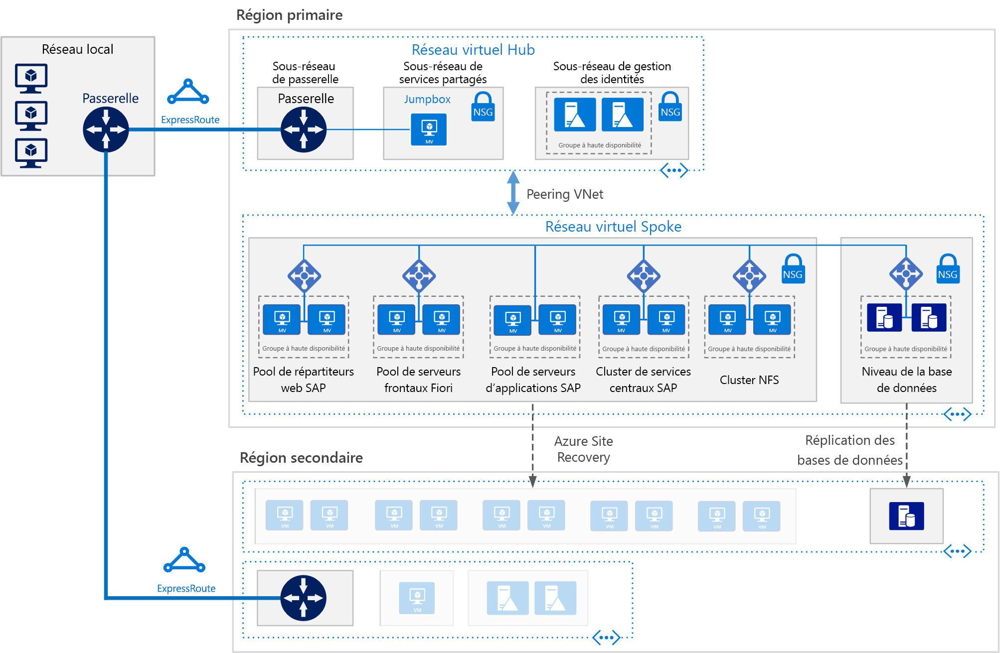

# SAP S/4HANA pour machines virtuelles Linux sur AzureSAP S/4HANA for Linux virtual machines on Azure

Cette architecture de référence présente un ensemble de pratiques éprouvées pour l’exécution de S/4HANA dans un environnement à haute disponibilité prenant en charge la reprise après sinistre sur Azure.This reference architecture shows a set of proven practices for running S/4HANA in a high availability environment that supports disaster recovery on Azure. Cette architecture est déployée avec des tailles de machine virtuelle spécifiques qui peuvent être modifiées en fonction des besoins de votre organisation.This architecture is deployed with specific virtual machine (VM) sizes that can be changed to accommodate your organization's needs.

*Téléchargez un [fichier Visio][visio-download] de cette architecture.**Download a [Visio file][visio-download] of this architecture.*

> [!NOTE]
> Le déploiement de cette architecture de référence requiert une licence appropriée des produits SAP et d’autres technologies non Microsoft.Deploying this reference architecture requires appropriate licensing of SAP products and other non-Microsoft technologies.

## ArchitectureArchitecture

Cette architecture de référence décrit un système de production de niveau entreprise.This reference architecture describes a enterprise-grade, production-level system. En fonction des besoins de votre entreprise, cette configuration peut être réduite à une seule machine virtuelle.To suit your business needs, this configuration can be reduced to a single virtual machine. En revanche, les composants suivants sont requis :However, the following components are required:

**Réseau virtuel**.**Virtual network**. Le service [Réseau virtuel Azure](/azure/virtual-network/virtual-networks-overview) connecte en toute sécurité les ressources Azure entre elles.The [Azure Virtual Network](/azure/virtual-network/virtual-networks-overview) service securely connects Azure resources to each other. Dans cette architecture, le réseau virtuel se connecte à un environnement local via une passerelle déployée dans le hub d’une [topologie hub-and-spoke](../hybrid-networking/hub-spoke.md).In this architecture, the virtual network connects to an on-premises environment through a gateway deployed in the hub of a [hub-spoke topology](../hybrid-networking/hub-spoke.md). Le spoke est le réseau virtuel utilisé pour les applications SAP.The spoke is the virtual network used for the SAP applications.

**Sous-réseaux**.**Subnets**. Le réseau virtuel est subdivisé en [sous-réseaux](/azure/virtual-network/virtual-network-manage-subnet) distincts pour chaque niveau : passerelle, application, base de données et services partagés.The virtual network is subdivided into separate [subnets](/azure/virtual-network/virtual-network-manage-subnet) for each tier: gateway, application, database, and shared services.

**Machines virtuelles**.**Virtual machines**. Cette architecture utilise des machines virtuelles exécutant Linux regroupées comme suit pour les couches Application et Base de données :This architecture uses virtual machines running Linux for the application tier and database tier, grouped as follows:

- **Couche Application**.**Application tier**. Inclut le pool Fiori Front-end Server, le pool SAP Web Dispatcher, le pool du serveur d’applications et le cluster des services centraux SAP.Includes the Fiori Front-end Server pool, SAP Web Dispatcher pool, application server pool, and SAP Central Services cluster. Pour la haute disponibilité des services centraux sur les machines virtuelles Azure Linux, un service NFS (Network File Système) à haute disponibilité est requis.For high availability of Central Services on Azure Linux virtual machines, a highly available Network File System (NFS) service is required.
- **Cluster NFS**.**NFS cluster**. Cette architecture utilise un serveur [NFS](/azure/virtual-machines/workloads/sap/high-availability-guide-suse-nfs) exécuté sur un cluster Linux pour stocker les données partagées entre les systèmes SAP.This architecture uses an [NFS](/azure/virtual-machines/workloads/sap/high-availability-guide-suse-nfs) server running on a Linux cluster to store data shared between SAP systems. Vous pouvez partager ce cluster centralisé entre plusieurs systèmes SAP.This centralized cluster can be shared across multiple SAP systems. Pour la haute disponibilité du service NFS, vous pouvez utiliser la fonctionnalité High Availability Extension appropriée pour la distribution Linux sélectionnée.For high availability of the NFS service, the appropriate High Availability Extension for the selected Linux distribution is used.
- **SAP HANA**.**SAP HANA**. La couche Base de données utilise au moins deux machines virtuelles Linux dans un cluster pour assurer la haute disponibilité.The database tier uses two or more Linux virtual machines in a cluster to achieve high availability. La réplication de système HANA (HSR) est utilisée pour répliquer du contenu entre les systèmes HANA principal et secondaire.HANA System Replication (HSR) is used to replicate contents between primary and secondary HANA systems. Le clustering Linux est utilisé pour détecter les défaillances du système et faciliter le basculement automatique.Linux clustering is used to detect system failures and facilitate automatic failover. Un mécanisme d’isolation basé sur le stockage ou sur le cloud peut être utilisé pour s’assurer que le système défaillant est isolé ou arrêté pour éviter la condition de division (Split-Brain) du cluster.A storage-based or cloud-based fencing mechanism can be used to ensure the failed system is isolated or shut down to avoid the cluster split-brain condition.
- **Jumpbox**.**Jumpbox**. Également appelé hôte bastion.Also called a bastion host. Il s’agit d’une machine virtuelle sécurisée sur le réseau, utilisée par les administrateurs pour se connecter aux autres machines virtuelles.This is a secure virtual machine on the network that administrators use to connect to the other virtual machines. Il peut exécuter Windows ou Linux.It can run Windows or Linux. Le jumpbox Windows facilite la navigation web lors de l’utilisation des outils de gestion HANA Cockpit ou HANA Studio.Use a Windows jumpbox for web browsing convenience when using HANA Cockpit or HANA Studio management tools.

**Équilibreurs de charge** :**Load balancers**. Les équilibreurs de charge SAP intégrés et [Azure Load Balancer](/azure/load-balancer/load-balancer-overview) sont utilisés pour assurer la haute disponibilité.Both built-in SAP load balancers and [Azure Load Balancer](/azure/load-balancer/load-balancer-overview) are used to achieve HA. Les instances Azure Load Balancer servent à distribuer le trafic vers les machines virtuelles du sous-réseau de la couche Application.Azure Load Balancer instances are used to distribute traffic to virtual machines in the application tier subnet.

**Groupes à haute disponibilité**.**Availability sets**. Les machines virtuelles de tous les pools et clusters (SAP Web Dispatcher, serveurs d’applications SAP, services centraux, NFS et HANA) sont réunies dans des [groupes à haute disponibilité](/azure/virtual-machines/windows/tutorial-availability-sets) distincts, et au moins deux machines virtuelles sont approvisionnées pour chaque rôle.Virtual machines for all pools and clusters (Web Dispatcher, SAP application servers, Central Services, NFS, and HANA) are grouped into separate [availability sets](/azure/virtual-machines/windows/tutorial-availability-sets), and at least two virtual machines are provisioned per role. Cela rend les machines virtuelles éligibles pour un [contrat de niveau de service](https://azure.microsoft.com/support/legal/sla/virtual-machines) (SLA) plus élevé.This makes the virtual machines eligible for a higher [service level agreement](https://azure.microsoft.com/support/legal/sla/virtual-machines) (SLA).

**Cartes réseau**.**NICs**. Les [cartes réseau](/azure/virtual-network/virtual-network-network-interface) assurent l’ensemble des communications des machines virtuelles sur un réseau virtuel.[Network interface cards](/azure/virtual-network/virtual-network-network-interface) (NICs) enable all communication of virtual machines on a virtual network.

**Groupes de sécurité réseau**.**Network security groups**. Pour limiter le trafic entrant, sortant et intra-sous-réseau dans le réseau virtuel, vous pouvez utiliser des [groupes de sécurité réseau](/azure/virtual-network/virtual-networks-nsg) (NSG).To restrict incoming, outgoing, and intra-subnet traffic in the virtual network, [network security groups](/azure/virtual-network/virtual-networks-nsg) (NSGs) are used.

**Passerelle**.**Gateway**. Une passerelle étend votre réseau local au réseau virtuel Azure.A gateway extends your on-premises network to the Azure virtual network. [ExpressRoute](/azure/architecture/reference-architectures/hybrid-networking/expressroute) est le service Azure recommandé pour la création de connexions privées qui ne passent pas par l’Internet public, mais il est également possible d’utiliser une connexion [site à site](/azure/vpn-gateway/vpn-gateway-howto-site-to-site-resource-manager-portal).[ExpressRoute](/azure/architecture/reference-architectures/hybrid-networking/expressroute) is the recommended Azure service for creating private connections that do not go over the public Internet, but a [Site-to-Site](/azure/vpn-gateway/vpn-gateway-howto-site-to-site-resource-manager-portal) connection can also be used.

**Stockage Azure**.**Azure Storage**. Pour bénéficier d’un stockage permanent du disque dur virtuel d’une machine virtuelle, le service [Stockage Azure](/azure/storage/) est requis.To provide persistent storage of a virtual machine's virtual hard disk (VHD), [Azure Storage](/azure/storage/) is required.

## RecommandationsRecommendations

Cette architecture décrit un petit déploiement d’entreprise de niveau production.This architecture describes a small production-level enterprise deployment. Votre déploiement sera différent en fonction des besoins de votre entreprise.Your deployment will differ based on your business requirements. Utilisez ces recommandations comme point de départ.Use these recommendations as a starting point.

### Machines virtuellesVirtual machines

Dans les pools et les clusters de serveurs d’applications, ajustez le nombre de machines virtuelles en fonction de vos besoins.In application server pools and clusters, adjust the number of virtual machines based on your requirements. Le [guide de planification et implémentation de machines virtuelles Azure](/azure/virtual-machines/workloads/sap/planning-guide) inclut des informations sur l’exécution de SAP NetWeaver sur des machines virtuelles, qui s’appliquent également à SAP S/4HANA.The [Azure Virtual Machines planning and implementation guide](/azure/virtual-machines/workloads/sap/planning-guide) includes details about running SAP NetWeaver on virtual machines, but the information applies to SAP S/4HANA as well.

Pour plus d’informations sur la prise en charge SAP en fonction des types de machine virtuelle Azure et des mesures de débit (SAP), consultez la [Note SAP 1928533](https://launchpad.support.sap.com/#/notes/1928533).For details about SAP support for Azure virtual machine types and throughput metrics (SAPS), see [SAP Note 1928533](https://launchpad.support.sap.com/#/notes/1928533).

### Pool SAP Web DispatcherSAP Web Dispatcher pool

Le composant Web Dispatcher sert d’équilibreur de charge pour le trafic SAP entre les serveurs d’applications SAP.The Web Dispatcher component is used as a load balancer for SAP traffic among the SAP application servers. Pour assurer la haute disponibilité du composant Web Dispatcher, Azure Load Balancer est utilisé pour implémenter l’installation Web Dispatcher parallèle dans une configuration de tourniquet pour la distribution du trafic HTTP(S) parmi les Web Dispatchers disponibles dans le pool back-end des équilibreurs.To achieve high availability for the Web Dispatcher component, Azure Load Balancer is used to implement the parallel Web Dispatcher setup in a round-robin configuration for HTTP(S) traffic distribution among the available Web Dispatchers in the balancers back-end pool.

### Fiori Front-end ServerFiori Front-end Server

Fiori Front-end Server utilise une [passerelle NetWeaver](https://help.sap.com/doc/saphelp_gateway20sp12/2.0/en-US/76/08828d832e4aa78748e9f82204a864/content.htm?no_cache=true).The Fiori Front-end Server uses a [NetWeaver Gateway](https://help.sap.com/doc/saphelp_gateway20sp12/2.0/en-US/76/08828d832e4aa78748e9f82204a864/content.htm?no_cache=true). Pour les déploiements à petite échelle, elle peut être chargée sur le serveur Fiori.For small deployments, it can be loaded on the Fiori server. Pour les déploiements à grande échelle, vous pouvez déployer un serveur distinct pour la passerelle NetWeaver devant le pool Fiori Front-end Server.For large deployments, a separate server for the NetWeaver Gateway may be deployed in front of the Fiori Front-end Server pool.

### Pool de serveurs d’applicationsApplication servers pool

Pour gérer les groupes de connexion des serveurs d’applications ABAP, la transaction SMLG est utilisée.To manage logon groups for ABAP application servers, the SMLG transaction is used. Elle s’appuie sur la fonction d’équilibrage de charge au sein du serveur de messages des services centraux pour répartir la charge de travail entre le pool de serveurs d’applications pour le trafic des clients SAP GUI et RFC.It uses the load balancing function within the message server of the Central Services to distribute workload among SAP application servers pool for SAPGUIs and RFC traffic. La connexion des serveurs d’applications aux services centraux hautement disponibles se fait via le nom du réseau virtuel du cluster.The application server connection to the highly available Central Services is through the cluster virtual network name. De cette façon, il est inutile de modifier le profil du serveur d’applications pour la connectivité des services centraux après un basculement local.This avoids the need to change the application server profile for Central Services connectivity after a local failover.

### Cluster des services centraux SAPSAP Central Services cluster

Vous pouvez déployer les services centraux vers une machine virtuelle unique lorsque la haute disponibilité n’est pas obligatoire.Central Services can be deployed to a single virtual machine when high availability is not a requirement. Toutefois, la machine virtuelle unique devient un point de défaillance unique(SPOF) potentiel pour l’environnement SAP.However, the single virtual machine becomes a potential single point of failure (SPOF) for the SAP environment. Pour un déploiement de services centraux à haute disponibilité, un cluster NFS à haute disponibilité et un cluster de services centraux à haute disponibilité sont utilisés.For a highly available Central Services deployment, a highly available NFS cluster and a highly available Central Services cluster are used.

### Cluster NFSNFS cluster

DRBD (Distributed Replicated Block Device) est utilisé pour la réplication entre les nœuds du cluster NFS.DRBD (Distributed Replicated Block Device) is used for replication between the nodes of the NFS cluster.

### Groupes à haute disponibilitéAvailability sets

Les groupes à haute disponibilité répartissent les serveurs dans des groupes d’infrastructure physique et de mise à jour différents pour améliorer la disponibilité des services.Availability sets distribute servers to different physical infrastructure and update groups to improve service availability. Placez les machines virtuelles qui présentent le même rôle dans un groupe de disponibilité afin d’éviter les temps d’arrêt causés par la maintenance de l’infrastructure Azure et de respecter les [contrats de niveau de service](https://azure.microsoft.com/support/legal/sla/virtual-machines).Put virtual machines that perform the same role into an availability sets to help guard against downtime caused by Azure infrastructure maintenance and to meet [SLAs](https://azure.microsoft.com/support/legal/sla/virtual-machines). Il est recommandé de placer au moins deux machines virtuelles dans un groupe à haute disponibilité.Two or more virtual machines per availability set is recommended.

Toutes les machines virtuelles d’un groupe doivent présenter le même rôle.All virtual machines in a set must perform the same role. N’associez pas de serveurs remplissant des rôles différents dans le même groupe à haute disponibilité.Do not mix servers of different roles in the same availability set. Par exemple, ne placez pas un nœud ASCS dans le même groupe de disponibilité que le serveur d’applications.For example, don't place a ASCS node in the same availability set with the application server.

### Cartes réseauNICs

Les paysages SAP locaux traditionnels implémentent plusieurs cartes réseau par machine pour séparer le trafic administratif du trafic opérationnel.Traditional on-premises SAP landscapes implement multiple network interface cards (NICs) per machine to segregate administrative traffic from business traffic. Sur Azure, le réseau virtuel est un réseau à définition logicielle qui envoie tout le trafic via la même structure réseau.On Azure, the virtual network is a software-defined network that sends all traffic through the same network fabric. Par conséquent, il est inutile d’utiliser plusieurs cartes réseau.Therefore, the use of multiple NICs is unnecessary. Toutefois, si votre organisation a besoin de séparer le trafic, vous pouvez déployer plusieurs cartes réseau par machine virtuelle, connecter chaque carte réseau à un sous-réseau différent, puis utiliser des NSG pour appliquer des stratégies de contrôle d’accès distinctes.However, if your organization needs to segregate traffic, you can deploy multiple NICs per VM, connect each NIC to a different subnet, and then use NSGs to enforce different access control policies.

### Sous-réseaux et NSGSubnets and NSGs

Cette architecture divise l’espace d’adressage du réseau virtuel en sous-réseaux.This architecture subdivides the virtual network address space into subnets. Chaque sous-réseau peut être associé à un NSG qui définit les stratégies d’accès pour ce sous-réseau.Each subnet can be associated with a NSG that defines the access policies for the subnet. Placez les serveurs d’applications dans un sous-réseau distinct afin de pouvoir les sécuriser plus facilement en gérant les stratégies de sécurité du sous-réseau plutôt que les serveurs individuels.Place application servers on a separate subnet so you can secure them more easily by managing the subnet security policies, not the individual servers.

Quand un NSG est associé à un sous-réseau, il s’applique ensuite à tous les serveurs au sein de ce sous-réseau.When a NSG is associated with a subnet, it then applies to all the servers within the subnet. Pour plus d’informations sur l’utilisation de NSG pour un contrôle précis des serveurs d’un sous-réseau, consultez [Filtrer le trafic réseau avec les groupes de sécurité réseau](https://azure.microsoft.com/blog/multiple-vm-nics-and-network-virtual-appliances-in-azure/).For more information about using NSGs for fine-grained control over the servers in a subnet, see [Filter network traffic with network security groups](https://azure.microsoft.com/blog/multiple-vm-nics-and-network-virtual-appliances-in-azure/).

Consultez également [Planification et conception de la passerelle VPN](/azure/vpn-gateway/vpn-gateway-plan-design).See also [Planning and design for VPN Gateway](/azure/vpn-gateway/vpn-gateway-plan-design).

### Équilibreurs de chargeLoad balancers

[SAP Web Dispatcher](https://help.sap.com/doc/saphelp_nw73ehp1/7.31.19/en-US/48/8fe37933114e6fe10000000a421937/frameset.htm) gère l’équilibrage de charge du trafic HTTP(S), y compris les applications de style Fiori, à destination d’un pool de serveurs d’applications SAP.[SAP Web Dispatcher](https://help.sap.com/doc/saphelp_nw73ehp1/7.31.19/en-US/48/8fe37933114e6fe10000000a421937/frameset.htm) handles load balancing of HTTP(S) traffic including Fiori style applications to a pool of SAP application servers.

Pour le trafic en provenance de clients SAP GUI se connectant à un serveur SAP via DIAG ou RFC (Remote Function Call), le serveur de messages des services centraux équilibre la charge par l’intermédiaire des [groupes de connexion](https://wiki.scn.sap.com/wiki/display/SI/ABAP+Logon+Group+based+Load+Balancing) des serveurs d’applications. Par conséquent, aucun équilibreur de charge supplémentaire n’est nécessaire.For traffic from SAP GUI clients connecting a SAP server via DIAG or Remote Function Calls (RFC), the Central Service message server balances the load through SAP application server [logon groups](https://wiki.scn.sap.com/wiki/display/SI/ABAP+Logon+Group+based+Load+Balancing), so no additional load balancer is needed.

### Stockage AzureAzure Storage

Nous recommandons l’utilisation du Stockage Premium Azure pour les machines virtuelles du serveur de bases de données.We recommend using Azure Premium Storage for the database server virtual machines. Le stockage Premium offre une latence de lecture/écriture homogène.Premium storage provides consistent read/write latency. Pour des informations sur l’utilisation du stockage Premium pour les disques de système d’exploitation et de données d’une machine virtuelle à instance unique, consultez [SLA pour Machines virtuelles](https://azure.microsoft.com/support/legal/sla/virtual-machines/).For details about using Premium Storage for the operating system disks and data disks of a single-instance virtual machine, see [SLA for Virtual Machines](https://azure.microsoft.com/support/legal/sla/virtual-machines/).

Pour tous les systèmes SAP de production, nous vous recommandons d’utiliser [Azure Managed Disks](/azure/storage/storage-managed-disks-overview) Premium.For all production SAP systems, we recommend using Premium [Azure Managed Disks](/azure/storage/storage-managed-disks-overview). Des disques managés sont utilisés pour gérer les fichiers VHD pour les disques, pour des questions de fiabilité.Managed Disks are used to manage the VHD files for the disks, adding reliability. Ils assurent également l’isolement des disques des machines virtuelles au sein d’un groupe à haute disponibilité afin d’éviter les points de défaillance uniques.They also ensure that the disks for virtual machines within an availability set are isolated to avoid single points of failure.

Pour les serveurs d’applications SAP, y compris les machines virtuelles des services centraux, vous pouvez utiliser le stockage Azure standard afin de réduire les coûts. En effet, l’exécution des applications s’effectue en mémoire et utilise les disques uniquement pour la journalisation.For SAP application servers, including the Central Services virtual machines, you can use Azure Standard Storage to reduce cost, because application execution takes place in memory and uses disks for logging only. Toutefois, pour le moment le stockage standard est certifié uniquement pour le stockage non managé.However, at this time, Standard Storage is only certified for unmanaged storage. Dans la mesure où les serveurs d’applications n’hébergent pas de données, vous pouvez également utiliser les disques P4 et P6 de moins grande capacité pour réduire le coût.Since application servers do not host any data, you can also use the smaller P4 and P6 Premium Storage disks to help minimize cost.

Pour le magasin de données de sauvegarde, nous vous recommandons d’utiliser [le stockage de niveau d’accès froid et/ou le stockage de niveau d’accès archive](/azure/storage/storage-blob-storage-tiers).For the backup data store, we recommend using Azure [cool access tier storage and/or archive access tier storage](/azure/storage/storage-blob-storage-tiers). Ces niveaux de stockage sont des moyens économiques de stocker les données de longue durée moins souvent sollicitées.These storage tiers are cost-effective ways to store long-lived data that is less frequently accessed.

## Considérations relatives aux performancesPerformance considerations

Les serveurs d’applications SAP communiquent constamment avec les serveurs de bases de données.SAP application servers carry on constant communications with the database servers. Pour les machines virtuelles de base de données HANA, vous pouvez activer [l’accélérateur d’écriture](/azure/virtual-machines/linux/how-to-enable-write-accelerator) pour améliorer la latence d’écriture du journal.For the HANA database virtual machines, consider enabling [Write Accelerator](/azure/virtual-machines/linux/how-to-enable-write-accelerator) to improve log write latency. Pour optimiser les communications entre les serveurs, utilisez le [réseau accéléré](https://azure.microsoft.com/blog/linux-and-windows-networking-performance-enhancements-accelerated-networking/).To optimize inter-server communications, use the [Accelerated Network](https://azure.microsoft.com/blog/linux-and-windows-networking-performance-enhancements-accelerated-networking/). Notez que ces accélérateurs sont disponibles uniquement pour certaines séries de machines virtuelles.Note that these accelerators are available only for certain VM series.

Pour obtenir un débit de bande passante de disque et d’ES/S élevé, les pratiques courantes en termes [d’optimisation des performances](/azure/virtual-machines/linux/premium-storage-performance) du volume de stockage s’appliquent à la disposition du stockage Azure.To achieve high IOPS and disk bandwidth throughput, the common practices in storage volume [performance optimization](/azure/virtual-machines/linux/premium-storage-performance) apply to Azure storage layout. Par exemple, la combinaison de plusieurs disques pour créer un volume de disque agrégé par bandes améliore les performances d’E/S.For example, combining multiple disks together to create a striped disk volume improves IO performance. L’activation du cache de lecture sur un contenu de stockage qui change rarement améliore la vitesse de récupération des données.Enabling the read cache on storage content that changes infrequently enhances the speed of data retrieval. Pour plus d’informations sur les exigences en termes de performances, consultez [SAP note 1943937 - Hardware Configuration Check Tool](https://launchpad.support.sap.com/#/notes/1943937) (Note SAP 1943937 - Outil de vérification de la configuration matérielle) (compte SAP Service Marketplace requis pour l’accès).For details about performance requirements, see [SAP note 1943937 - Hardware Configuration Check Tool](https://launchpad.support.sap.com/#/notes/1943937) (SAP Service Marketplace account required for access).

## Considérations relatives à l’extensibilitéScalability considerations

Au niveau de la couche de l’application SAP, Azure propose un large éventail de tailles de machines virtuelles pour la montée en puissance ou la montée en charge. Pour obtenir une liste exhaustive, consultez la [note SAP 1928533](https://launchpad.support.sap.com/#/notes/1928533) - SAP Applications on Azure: Supported Products and Azure VM Types (Applications SAP sur Azure : compte SAP Service Marketplace requis pour l’accès).At the SAP application layer, Azure offers a wide range of virtual machine sizes for scaling up and scaling out. For an inclusive list, see [SAP Note 1928533](https://launchpad.support.sap.com/#/notes/1928533) - SAP Applications on Azure: Supported Products and Azure VM types (SAP Service Marketplace account required for access). À mesure que nous certifions des types de machines virtuelles supplémentaires, vous pouvez augmenter ou diminuer la taille des instances avec le même déploiement cloud.As we continue to certify more virtual machines types, you can scale up or down with the same cloud deployment.

Dans la couche Base de données, cette architecture exécute HANA sur des machines virtuelles.At the database layer, this architecture runs HANA on VMs. Si votre charge d travail dépasse la taille maximale de machine virtuelle, Microsoft propose également les [Grandes instances Azure](/azure/virtual-machines/workloads/sap/hana-overview-architecture) pour SAP HANA.If your workload exceeds the maximum VM size, Microsoft also offers [Azure Large Instances](/azure/virtual-machines/workloads/sap/hana-overview-architecture) for SAP HANA. Ces serveurs physiques sont colocalisés dans le centre de données certifié Microsoft Azure et à ce jour, fournissent jusqu'à 20 To de capacité de mémoire pour une instance unique.These physical servers are co-located in a Microsoft Azure certified datacenter and as of this writing, provide up to 20 TB of memory capacity for a single instance. Une configuration à plusieurs nœuds est également possible avec une capacité totale de mémoire pouvant atteindre 60 To.Multi-node configuration is also possible with a total memory capacity of up to 60 TB.

## Considérations relatives à la disponibilitéAvailability considerations

La redondance des ressources constitue le thème général dans les solutions d’infrastructure à haute disponibilité.Resource redundancy is the general theme in highly available infrastructure solutions. Pour les entreprises qui présentent un SLA moins strict, les machines virtuelles Azure à instance unique offrent un SLA garantissant un certain temps de disponibilité.For enterprises that have a less stringent SLA, single-instance Azure VMs offer an uptime SLA. Pour plus d’informations, consultez [Contrats de niveau de service Azure](https://azure.microsoft.com/support/legal/sla/).For more information, see [Azure Service Level Agreement](https://azure.microsoft.com/support/legal/sla/).

Dans cette installation distribuée de l’application SAP, l’installation de base est répliquée pour assurer une haute disponibilité.In this distributed installation of the SAP application, the base installation is replicated to achieve high availability. Pour chaque couche de l’architecture, la conception mise en œuvre à des fins de haute disponibilité varie.For each layer of the architecture, the high availability design varies.

### Couche ApplicationApplication tier

- Web Dispatcher.Web Dispatcher. La haute disponibilité est assurée grâce aux instances Web Dispatcher redondantes.High availability is achieved with redundant Web Dispatcher instances. Consultez [SAP Web Dispatcher](https://help.sap.com/doc/saphelp_nw70ehp2/7.02.16/en-us/48/8fe37933114e6fe10000000a421937/frameset.htm) dans la documentation SAP.See [SAP Web Dispatcher](https://help.sap.com/doc/saphelp_nw70ehp2/7.02.16/en-us/48/8fe37933114e6fe10000000a421937/frameset.htm) in the SAP documentation.
- Serveurs Fiori.Fiori servers. La haute disponibilité est obtenue en équilibrant la charge du trafic au sein d’un pool de serveurs.High availability is achieved by load balancing traffic within a pool of servers.
- Services centraux.Central Services. Pour la haute disponibilité des services centraux sur les machines virtuelles Azure Linux, le serveur High-Availability Extension de la distribution Linux sélectionnées est utilisé et le cluster NFS à haute disponibilité héberge le stockage DRBD.For high availability of Central Services on Azure Linux virtual machines, the appropriate High Availability Extension for the selected Linux distribution is used, and the highly available NFS cluster hosts DRBD storage.
- Serveurs d’applications.Application servers. La haute disponibilité est obtenue en équilibrant la charge du trafic au sein d’un pool de serveurs d’applications.High availability is achieved by load balancing traffic within a pool of application servers.

### Couche base de donnéesDatabase tier

Cette architecture de référence représente un système de base de données SAP HANA à haute disponibilité composée de deux machines virtuelles Azure.This reference architecture depicts a highly available SAP HANA database system consisting of two Azure virtual machines. La fonctionnalité de réplication du système natif de la couche Base de données assure un basculement manuel ou automatique entre les nœuds répliqués :The database tier's native system replication feature provides either manual or automatic failover between replicated nodes:

- Pour le basculement manuel, déployez plusieurs instances HAN et utilisez la Réplication de système HANA (HSR).For manual failover, deploy more than one HANA instance and use HANA System Replication (HSR).
- Pour le basculement automatique, utilisez les fonctionnalités HSR et Linux HAE (High Availability Extension) pour votre distribution Linux.For automatic failover, use both HSR and Linux High Availability Extension (HAE) for your Linux distribution. Linux HAE fournit des services de cluster aux ressources HANA, détectant les événements d’échec et orchestrant le basculement des services errants vers le nœud sain.Linux HAE provides the cluster services to the HANA resources, detecting failure events and orchestrating the failover of errant services to the healthy node.

Consultez [Certifications et configurations SAP en cours sur Microsoft Azure](/azure/virtual-machines/workloads/sap/sap-certifications).See [SAP certifications and configurations running on Microsoft Azure](/azure/virtual-machines/workloads/sap/sap-certifications).

### Considérations relatives à la récupération d’urgenceDisaster recovery considerations

Chaque couche utilise une stratégie différente pour assurer une protection par récupération d’urgence.Each tier uses a different strategy to provide disaster recovery (DR) protection.

- **Couche Serveurs d’applications**.**Application servers tier**. Les serveurs d’applications SAP ne contiennent pas de données d’entreprise.SAP application servers do not contain business data. Sur Azure, une stratégie de récupération d’urgence simple consiste à créer des serveurs d’applications SAP dans la région secondaire, puis à les arrêter.On Azure, a simple DR strategy is to create SAP application servers in the secondary region, then shut them down. En cas de modification de la configuration ou de mise à jour du noyau sur le serveur d’applications principal, les mêmes modifications doivent être appliquées aux machines virtuelles dans la région secondaire.Upon any configuration changes or kernel updates on the primary application server, the same changes must be applied to the virtual machines in the secondary region. Par exemple, copiez les exécutables du noyau SAP vers les machines virtuelles de récupération d’urgence.For example, copy the SAP kernel executables to the DR virtual machines. Pour la réplication automatique des serveurs d’applications vers une région secondaire, [Azure Site Recovery](/azure/site-recovery/site-recovery-overview) est la solution recommandée.For automatic replication of application servers to a secondary region, [Azure Site Recovery](/azure/site-recovery/site-recovery-overview) is the recommended solution. Au moment d’écrire cet article, ASR ne prend pas encore en charge la réplication des paramètres de configuration du réseau accéléré dans les machines virtuelles Azure.As of the writing of this paper, ASR doesn't yet support the replication of the Accelerated Network configuration setting in Azure VMs.

- **Services centraux**.**Central Services**. Ce composant de la pile d’applications SAP ne conserve également aucune donnée d’entreprise.This component of the SAP application stack also does not persist business data. Vous pouvez créer une machine virtuelle dans la région secondaire pour exécuter le rôle Services centraux.You can build a VM in the secondary region to run the Central Services role. Le seul contenu du nœud Services centraux principal à synchroniser est le contenu de partage /sapmnt.The only content from the primary Central Services node to synchronize is the /sapmnt share content. En outre, en cas de modification de la configuration ou de mise à jour du noyau sur les serveurs principaux des services centraux, celles-ci doivent être répétées sur la machine virtuelle dans la région secondaire exécutant des services centraux.Also, if configuration changes or kernel updates take place on the primary Central Services servers, they must be repeated on the VM in the secondary region running Central Services. Pour synchroniser les deux serveurs, vous pouvez utiliser Azure Site Recovery pour répliquer les nœuds de cluster ou simplement utiliser une copie planifiée régulièrement pour copier /sapmnt du côté de la récupération d’urgence.To synchronize the two servers, you can use either Azure Site Recovery, to replicate the cluster nodes, or simply use a regularly scheduled copy job to copy /sapmnt to the DR side. Pour plus d’informations sur le processus de génération, de copie et de test de basculement, téléchargez [SAP NetWeaver: Building a Hyper-V and Microsoft Azure–based Disaster Recovery Solution](https://download.microsoft.com/download/9/5/6/956FEDC3-702D-4EFB-A7D3-2DB7505566B6/SAP%20NetWeaver%20-%20Building%20an%20Azure%20based%20Disaster%20Recovery%20Solution%20V1_5%20.docx) et lisez la section 4.3, « SAP SPOF layer (ASCS) ».For details about the build, copy, and test failover process, download [SAP NetWeaver: Building a Hyper-V and Microsoft Azure–based Disaster Recovery Solution](https://download.microsoft.com/download/9/5/6/956FEDC3-702D-4EFB-A7D3-2DB7505566B6/SAP%20NetWeaver%20-%20Building%20an%20Azure%20based%20Disaster%20Recovery%20Solution%20V1_5%20.docx), and refer to section 4.3, "SAP SPOF layer (ASCS)." Ce document s’applique à NetWeaver exécuté sur Windows, mais vous pouvez créer la configuration équivalente pour Linux.This paper applies to NetWeaver running on Windows, but you can create the equivalent configuration for Linux. Pour les services centraux, utilisez [Azure Site Recovery](/en-us/azure/site-recovery/site-recovery-overview) pour répliquer les nœuds de cluster et le stockage.For Central Services, use [Azure Site Recovery](/en-us/azure/site-recovery/site-recovery-overview) to replicate the cluster nodes and storage. Pour Linux, créez un géo-cluster à trois nœuds à l’aide d’une fonctionnalité High Availability Extension.For Linux, create a three node geo-cluster using a High Availability Extension.

- **Couche Base de données SAP**.**SAP database tier**. Utilisez HSR pour la réplication prise en charge par HANA.Use HSR for HANA-supported replication. Outre une installation locale haute disponibilité à deux nœuds, HSR prend en charge la réplication à plusieurs niveaux, où un troisième nœud d’une région Azure distincte agit comme une entité étrangère, extérieure au cluster, et s’enregistre sur le réplica secondaire de la paire HSR en cluster en tant que cible de réplication.In addition to a local, two-node high availability setup, HSR supports multi-tier replication where a third node in a separate Azure region acts as a foreign entity, not part of the cluster, and registers to the secondary replica of the clustered HSR pair as its replication target. Il en résulte une configuration en chaîne de la réplication.This form a replication daisy chain. Le basculement vers le nœud de récupération d’urgence est un processus manuel.The failover to the DR node is a manual process.

Pour utiliser Azure Site Recovery pour générer automatiquement un site de production entièrement répliqué de votre déploiement original, vous devez exécuter [des scripts de déploiement](/azure/site-recovery/site-recovery-runbook-automation) personnalisés.To use Azure Site Recovery to automatically build a fully replicated production site of your original, you must run customized [deployment scripts](/azure/site-recovery/site-recovery-runbook-automation). Site Recovery déploie d’abord les machines virtuelles dans des groupes à haute disponibilité, puis exécute des scripts pour ajouter des ressources telles que les équilibreurs de charge.Site Recovery first deploys the virtual machines in availability sets, then runs scripts to add resources such as load balancers.

## Considérations relatives à la facilité de gestionManageability considerations

SAP HANA comporte une fonctionnalité de sauvegarde qui utilise l’infrastructure Azure sous-jacente.SAP HANA has a backup feature that makes use of the underlying Azure infrastructure. Lors de la sauvegarde de la base de données SAP HANA en cours d’exécution sur des machines virtuelles, les captures instantanées de SAP HANA et du stockage Azure sont utilisées pour garantir la cohérence des fichiers de sauvegarde.To back up the SAP HANA database running on Azure virtual machines, both the SAP HANA snapshot and Azure storage snapshot are used to ensure the backup files' consistency. Pour plus d’informations, consultez le [guide de sauvegarde pour SAP HANA sur les machines virtuelles Azure](/azure/virtual-machines/workloads/sap/sap-hana-backup-guide) et les [FAQ sur le service de sauvegarde Azure](/azure/backup/backup-azure-backup-faq).For details, see [Backup guide for SAP HANA on Azure Virtual Machines](/azure/virtual-machines/workloads/sap/sap-hana-backup-guide) and the [Azure Backup service FAQ](/azure/backup/backup-azure-backup-faq). Seuls les déploiements HANA à conteneur unique prennent en charge l’instantané de stockage Azure.Only HANA single container deployments support Azure storage snapshot.

### Gestion des identitésIdentity management

Contrôlez l’accès aux ressources en utilisant le système centralisé de gestion des identités à tous les niveaux :Control access to resources by using a centralized identity management system at all levels:

- Fournissez l’accès aux ressources Azure via [le contrôle d’accès en fonction du rôle](/azure/active-directory/role-based-access-control-what-is) (RBAC).Provide access to Azure resources through [role-based access control](/azure/active-directory/role-based-access-control-what-is) (RBAC).
- Accordez l’accès aux machines virtuelles Azure via LDAP, Azure Active Directory, Kerberos ou un autre système.Grant access to Azure VMs through LDAP, Azure Active Directory, Kerberos, or another system.
- Prenez en charge l’accès dans les applications elles-mêmes via les services fournis par SAP ou utilisez [OAuth 2.0 et Azure Active Directory](/azure/active-directory/develop/active-directory-protocols-oauth-code).Support access within the apps themselves through the services that SAP provides, or use [OAuth 2.0 and Azure Active Directory](/azure/active-directory/develop/active-directory-protocols-oauth-code).

### SurveillanceMonitoring

Azure propose plusieurs fonctions de [surveillance et de diagnostic](/azure/architecture/best-practices/monitoring) de l’infrastructure globale.Azure provides several functions for [monitoring and diagnostics](/azure/architecture/best-practices/monitoring) of the overall infrastructure. En outre, l’analyse avancée des machines virtuelles Azure (Windows ou Linux) est gérée par Azure Operations Management Suite (OMS).Also, enhanced monitoring of Azure virtual machines (Linux or Windows) is handled by Azure Operations Management Suite (OMS).

Pour assurer une analyse basée sur SAP des ressources et des performances des services de l’infrastructure SAP, l’extension d’[analyse Azure améliorée pour SAP](/azure/virtual-machines/workloads/sap/deployment-guide#d98edcd3-f2a1-49f7-b26a-07448ceb60ca) est utilisée.To provide SAP-based monitoring of resources and service performance of the SAP infrastructure, the [Azure SAP Enhanced Monitoring](/azure/virtual-machines/workloads/sap/deployment-guide#d98edcd3-f2a1-49f7-b26a-07448ceb60ca) extension is used. Cette extension transmet les statistiques d’analyse Azure à l’application SAP pour les fonctions DBA Cockpit et de surveillance du système d’exploitation.This extension feeds Azure monitoring statistics into the SAP application for operating system monitoring and DBA Cockpit functions. L’analyse avancée SAP est une condition préalable obligatoire pour l’exécution de SAP sur Azure.SAP enhanced monitoring is a mandatory prerequisite to run SAP on Azure. Pour plus d’informations, consultez la [Note SAP 2191498](https://launchpad.support.sap.com/#/notes/2191498), « SAP on Linux with Azure: Enhanced Monitoring ».For details, see [SAP Note 2191498](https://launchpad.support.sap.com/#/notes/2191498) – "SAP on Linux with Azure: Enhanced Monitoring."

## Considérations relatives à la sécuritéSecurity considerations

SAP possède son propre moteur de gestion des utilisateurs (UME) pour contrôler l’accès et l’autorisation en fonction du rôle dans l’application SAP.SAP has its own Users Management Engine (UME) to control role-based access and authorization within the SAP application. Pour plus d’informations, consultez [SAP HANA Security—An Overview](https://archive.sap.com/documents/docs/DOC-62943) (compte SAP Service Marketplace requis pour l’accès.)For details, see [SAP HANA Security—An Overview](https://archive.sap.com/documents/docs/DOC-62943) (SAP Service Marketplace account required for access.)

Pour une sécurité réseau supplémentaire, envisagez d’implémenter une [zone DMZ réseau](/azure/architecture/reference-architectures/dmz/secure-vnet-hybrid), qui utilise une appliance virtuelle réseau pour créer un pare-feu devant le sous-réseau des pools Web Dispatcher et Fiori Front-End Server.For additional network security, consider implementing a [Network DMZ](/azure/architecture/reference-architectures/dmz/secure-vnet-hybrid), which uses a network virtual appliance to create a firewall in front of the subnet for Web Dispatcher and Fiori Front-End Server pools.

Les données sont chiffrées en transit et au repos à des fins de sécurité de l’infrastructure.For infrastructure security, data is encrypted in transit and at rest. La section « Considérations de sécurité » de [SAP NetWeaver on Azure Virtual Machines (VMs) – Planning and Implementation Guide](/azure/virtual-machines/workloads/sap/planning-guide) (SAP NetWeaver sur les machines virtuelles Azure - Guide de planification et d’implémentation) commence à traiter la sécurité réseau et s’applique à S/4HANA.The "Security considerations" section of the [SAP NetWeaver on Azure Virtual Machines–Planning and Implementation Guide](/azure/virtual-machines/workloads/sap/planning-guide) begins to address network security and applies to S/4HANA. Le guide spécifie également les ports réseau, que vous devez ouvrir sur les pare-feu pour autoriser la communication de l’application.The guide also specifies the network ports you must open on the firewalls to allow application communication.

[Azure Disk Encryption](/azure/security/azure-security-disk-encryption) permet de chiffrer des disques de machines virtuelles Linux IaaS.To encrypt Linux IaaS virtual machine disks, you can use [Azure Disk Encryption](/azure/security/azure-security-disk-encryption). Ce service exploite la fonctionnalité DM-Crypt de Linux pour assurer le chiffrement de volume du système d’exploitation et des disques de données.It uses the DM-Crypt feature of Linux to provide volume encryption for the operating system and the data disks. La solution fonctionne également avec Azure Key Vault, ce qui vous permet de contrôler et de gérer les clés et les secrets de chiffrement de disque dans votre abonnement Key Vault.The solution also works with Azure Key Vault to help you control and manage the disk-encryption keys and secrets in your key vault subscription. Les données sur les disques de vos machines virtuelles sont chiffrées au repos dans votre stockage Azure.Data on the virtual machine disks are encrypted at rest in your Azure storage.

Pour le chiffrement des données SAP HANA au repos, nous recommandons l’utilisation de la technologie de chiffrement native SAP HANA.For SAP HANA data-at-rest encryption, we recommend using the SAP HANA native encryption technology.

> [!NOTE]
> N’utilisez pas le chiffrement des données au repos HANA avec Azure Disk Encryption sur le même serveur.Do not use the HANA data-at-rest encryption with Azure Disk Encryption on the same server. Pour HANA, utilisez uniquement le chiffrement des données HANA.For HANA, use only HANA data encryption.

## CommunautésCommunities

Les communautés peuvent répondre aux questions et vous aider à paramétrer un déploiement réussi.Communities can answer questions and help you set up a successful deployment. Tenez compte des éléments suivants :Consider the following:

- [Blog Running SAP Applications on the Microsoft Platform](https://blogs.msdn.microsoft.com/saponsqlserver/2017/05/04/sap-on-azure-general-update-for-customers-partners-april-2017/) (Exécution d’applications SAP sur la plateforme Microsoft)[Running SAP Applications on the Microsoft Platform Blog](https://blogs.msdn.microsoft.com/saponsqlserver/2017/05/04/sap-on-azure-general-update-for-customers-partners-april-2017/)
- [Support de la communauté AzureAzure Community Support](https://azure.microsoft.com/support/community/)
- [Communauté SAPSAP Community](https://www.sap.com/community.html)
- [Dépassement de capacité de la pileStack Overflow](https://stackoverflow.com/tags/sap/)

[visio-download]: https://archcenter.blob.core.windows.net/cdn/sap-reference-architectures.vsdx
