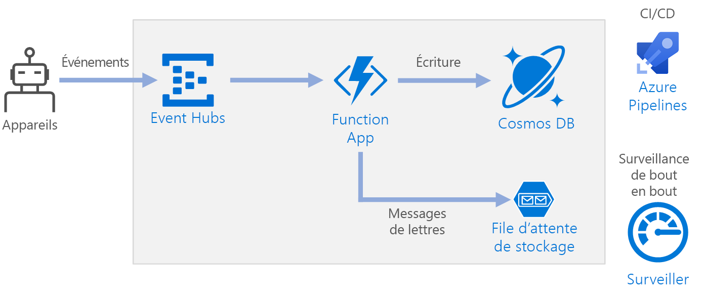

# <a name="serverless-event-processing-using-azure-functions"></a>Traitement d’événements serverless à l’aide d’Azure Functions

Cette architecture de référence montre une architecture serverless pilotée par événements qui ingère un flux de données, traite les données et écrit les résultats dans une base de données principale. Une implémentation de référence pour cette architecture est disponible sur [GitHub][github].



## <a name="architecture"></a>Architecture

**Event Hubs** ingère le flux de données. [Event Hubs] [ eh] est conçu pour les scénarios de diffusion de données à débit élevé.

> [!NOTE]
> Pour des scénarios IoT, nous vous recommandons IoT Hub. IoT Hub a un point de terminaison intégré qui est compatible avec l’API Azure Event Hubs, vous pouvez donc utiliser ces services dans cette architecture sans aucune modification majeure dans le traitement principal. Pour plus d’informations, consultez [Connexion des appareils IoT à Azure : IoT Hub et Event Hubs][iot].

**Function App**. [Azure Functions][functions] est une solution de calcul serverless. Cette application utilise un modèle événementiel, dans lequel un morceau de code (une « fonction ») est invoqué par un déclencheur. Dans cette architecture, lorsque des événements arrivent dans Event Hubs, ils déclenchent une fonction qui traite les événements et écrit les résultats dans le stockage.

Function App ne convient pas pour le traitement des enregistrements individuels à partir d’Event Hubs. Pour les scénarios de traitement de flux de données plus complexes, envisagez Apache Spark en utilisant Azure Databricks et Azure Stream Analytics.

**Cosmos DB**. [Cosmos DB][cosmosdb] est un service de base de données multimodèle. Pour ce scénario, la fonction de traitement d’événements stocke les enregistrements JSON, à l’aide de l’[API SQL][cosmosdb-sql]Cosmos DB.

**Stockage de files d’attente**. [Stockage de files d’attente] [ queue] est utilisé pour les messages de lettres mortes. Si une erreur se produit lors du traitement d’un événement, la fonction stocke les données d’événement dans une file d’attente de lettres mortes pour un traitement ultérieur. Pour plus d’informations, consultez [Résilience et considérations](#resiliency-considerations).

**Azure Monitor**. [Monitor][monitor] collecte les mesures de performances concernant les services Azure déployés dans la solution. En les visualisant dans un tableau de bord, vous pouvez obtenir des informations sur l’intégrité de la solution.

**Azure Pipelines**. [Pipelines] [ pipelines] est un service d’intégration continue (CI) et de livraison continue (CD) qui génère, teste et déploie l’application.

## <a name="scalability-considerations"></a>Considérations relatives à l’extensibilité

### <a name="event-hubs"></a>Event Hubs

La capacité de débit du service Event Hubs est mesurée par les [unités de débit][eh-throughput]. Vous pouvez mettre automatiquement à l’échelle un Event Hub en activant [l’augmentation automatique][eh-autoscale], qui ajuste automatiquement les unités de débit en fonction du trafic, jusqu’à la limite configurée.

Le [déclencheur Event Hub] [ eh-trigger] dans la fonction application met à l’échelle en fonction du nombre de partitions dans l’event hub. Une instance de la fonction est assignée à chaque partition à la fois. Pour maximiser le débit, recevez les événements en un traitement, plutôt qu’un seul à la fois.

### <a name="cosmos-db"></a>Cosmos DB

La capacité de débit pour Cosmos DB est mesurée en [unités de requête][ru] (RU). Pour mettre à l’échelle un conteneur Cosmos DB au-delà de 10 000 RU, vous devez spécifier une [clé de partition][partition-key] lorsque vous créez le conteneur, puis inclure la clé de partition dans chaque document que vous créez.

Voici certaines caractéristiques d’une bonne clé de partition :

- L’espace de valeur de clé est volumineux. 
- Il y aura une répartition uniforme des lectures/écritures par valeur de clé, en évitant les clés sensibles.
- Le maximum des données stockées pour toute valeur de clé unique ne dépasse pas la taille maximale de la partition physique (10 Go). 
- La clé de partition pour un document ne change pas. Vous ne pouvez pas mettre à jour la clé de partition sur un document existant. 

Dans le scénario pour cette architecture de référence, la fonction stocke un seul document par appareil qui envoie des données. La fonction met continuellement à jour les documents avec le dernier état de l’appareil, à l’aide d’une opération upsert. L’ID de l’appareil est une bonne clé de partition pour ce scénario, car les écritures seront réparties uniformément entre les clés et la taille de chaque partition sera strictement limitée, étant donné qu’il existe un document unique pour chaque valeur de clé. Pour plus d’informations sur les clés de partition, voir [Partition et mise à l’échelle dans Azure Cosmos DB][cosmosdb-scale].

## <a name="resiliency-considerations"></a>Remarques relatives à la résilience

Lorsque vous utilisez le déclencheur Event Hubs avec Functions, intercepter les exceptions dans votre boucle de traitement. Si une exception non prise en charge se produit, le runtime Functions ne retente pas les messages. Si un message ne peut pas être traité, placez le message dans une file d’attente de lettres mortes. Utilisez un processus hors-bande pour examiner les messages et de déterminer l’action corrective. 

Le code suivant montre comment la fonction d’ingestion intercepte les exceptions et place les messages non traités dans une file d’attente de lettres mortes.

```csharp
[FunctionName("RawTelemetryFunction")]
[StorageAccount("DeadLetterStorage")]
public static async Task RunAsync(
    [EventHubTrigger("%EventHubName%", Connection = "EventHubConnection", ConsumerGroup ="%EventHubConsumerGroup%")]EventData[] messages,
    [Queue("deadletterqueue")] IAsyncCollector<DeadLetterMessage> deadLetterMessages,
    ILogger logger)
{
    foreach (var message in messages)
    {
        DeviceState deviceState = null;

        try
        {
            deviceState = telemetryProcessor.Deserialize(message.Body.Array, logger);
        }
        catch (Exception ex)
        {
            logger.LogError(ex, "Error deserializing message", message.SystemProperties.PartitionKey, message.SystemProperties.SequenceNumber);
            await deadLetterMessages.AddAsync(new DeadLetterMessage { Issue = ex.Message, EventData = message });
        }

        try
        {
            await stateChangeProcessor.UpdateState(deviceState, logger);
        }
        catch (Exception ex)
        {
            logger.LogError(ex, "Error updating status document", deviceState);
            await deadLetterMessages.AddAsync(new DeadLetterMessage { Issue = ex.Message, EventData = message, DeviceState = deviceState });
        }
    }
}
```

Notez que la fonction utilise la [liaison de sortie stockage de files d’attente] [ queue-binding] pour placer des éléments dans la file d’attente.

Le code ci-dessus enregistre également les exceptions dans Application Insights. Vous pouvez utiliser le numéro de séquence et de clé de partition pour mettre en corrélation des messages de lettres mortes avec les exceptions dans les journaux. 

Les messages dans la file d’attente de lettres mortes doivent posséder suffisamment d’informations pour que vous puissiez comprendre le contexte d’erreur. Dans cet exemple, la `DeadLetterMessage` classe contient le message d’exception, les données d’événement d’origine et le message d’événement désérialisé (si disponible). 

```csharp
public class DeadLetterMessage
{
    public string Issue { get; set; }
    public EventData EventData { get; set; }
    public DeviceState DeviceState { get; set; }
}
```

Utilisation d’[Azure Monitor][monitor] pour surveiller Event Hub. Si vous voyez qu’il y a des entrées, mais aucune sortie, cela signifie que les messages ne sont pas traités. Dans ce cas, accédez à [Log Analytics] [ log-analytics] et recherchez les exceptions ou d’autres erreurs.

## <a name="disaster-recovery-considerations"></a>Considérations relatives à la récupération d’urgence

Le déploiement illustré ici se trouve dans une seule région Azure. Pour une approche plus résiliente à la récupération d’urgence, tirer parti des fonctionnalités de géo-distribution dans les différents services :

- **Event Hubs**. Créez deux espaces de noms Event Hubs, un espace de noms principal (actif) et un espace de noms secondaire (passif). Les messages sont automatiquement acheminés vers l’espace de noms actif, sauf si vous basculez vers l’espace de noms secondaire. Pour en savoir plus, voir [Géo-reprise d’activité après sinistre Azure Event Hubs][eh-dr].

- **Function App**. Déployez une deuxième application de fonction qui est en attente de lecture à partir de l’espace de noms Event Hubs secondaire. Cette fonction écrit dans un compte de stockage secondaire pour la file d’attente de lettres mortes.

- **Cosmos DB**. COSMOS DB prend en charge [plusieurs régions principales][cosmosdb-geo], ce qui permet des écritures sur n’importe quelle région que vous ajoutez à votre compte Cosmos DB. Si vous n’activez pas multimaître, vous pouvez toujours basculer vers la région d’écriture primaire. Les kits de développement client Cosmos DB et les liaisons d’Azure Function gèrent automatiquement le basculement, vous n’avez pas besoin de mettre à jour les paramètres de configuration d’application.

- **Stockage Azure**. Utilisez le stockage [RA-GRS] [ ra-grs] pour la file d’attente de lettres mortes. Cette opération crée un réplica en lecture seule dans une autre région. Si la région primaire devient indisponible, vous pouvez lire les éléments actuellement présents dans la file d’attente. En outre, configurez un autre compte de stockage dans la région secondaire à laquelle la fonction peut écrire après un basculement.

## <a name="deploy-the-solution"></a>Déployer la solution

Pour déployer cette architecture de référence, affichez le [fichier readme de GitHub][readme]. 

<!-- links -->

[cosmosdb]: /azure/cosmos-db/introduction
[cosmosdb-geo]: /azure/cosmos-db/distribute-data-globally
[cosmosdb-scale]: /azure/cosmos-db/partition-data
[cosmosdb-sql]: /azure/cosmos-db/sql-api-introduction
[eh]: /azure/event-hubs/
[eh-autoscale]: /azure/event-hubs/event-hubs-auto-inflate
[eh-dr]: /azure/event-hubs/event-hubs-geo-dr
[eh-throughput]: /azure/event-hubs/event-hubs-features#throughput-units
[eh-trigger]: /azure/azure-functions/functions-bindings-event-hubs
[functions]: /azure/azure-functions/functions-overview
[iot]: /azure/iot-hub/iot-hub-compare-event-hubs
[log-analytics]: /azure/log-analytics/log-analytics-queries
[monitor]: /azure/azure-monitor/overview
[partition-key]: /azure/cosmos-db/partition-data
[pipelines]: /azure/devops/pipelines/index
[queue]: /azure/storage/queues/storage-queues-introduction
[queue-binding]: /azure/azure-functions/functions-bindings-storage-queue#output
[ra-grs]: /azure/storage/common/storage-redundancy-grs
[ru]: /azure/cosmos-db/request-units

[github]: https://github.com/mspnp/serverless-reference-implementation
[readme]: https://github.com/mspnp/serverless-reference-implementation/blob/master/README.md