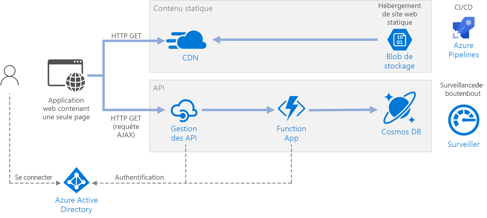

# <a name="serverless-web-application-on-azure"></a>Application web serverless sur Azure

Cette architecture de référence montre une application web [serverless](https://azure.microsoft.com/solutions/serverless/). L’application gère le contenu statique à partir de Stockage Blob Azure et implémente une API à l’aide d’Azure Functions. L’API lit les données à partir de Cosmos DB et renvoie les résultats à l’application web. Une implémentation de référence pour cette architecture est disponible sur [GitHub][github].



Le terme « serverless » a deux significations distinctes mais liées :

- **Serveur principal en tant que service** (BaaS). Les services cloud principaux, tels que les bases de données et de stockage, fournissent des API qui permettent aux applications clientes de se connecter directement à ces services.
- **Fonctions en tant que service** (FaaS). Dans ce modèle, une « fonction » est un morceau de code qui est déployé sur le cloud et s’exécute au sein d’un environnement d’hébergement qui résume complètement les serveurs qui exécutent le code.

Les deux définitions ont en commun l’idée que les développeurs et le personnel DevOps n’ont pas besoin de déployer, configurer ou gérer des serveurs. Cette architecture de référence se concentre sur FaaS en utilisant d’Azure Functions, bien que la diffusion de contenu web à partir de Stockage Blob Azure soit un exemple de BaaS. Certaines caractéristiques importantes de FaaS sont :

1. Les ressources de calcul sont allouées de façon dynamique en fonction des besoins de la plateforme.
1. Facturation basée sur la consommation : vous êtes facturé uniquement pour les ressources de calcul qui ont été utilisées pour exécuter votre code.
1. Les ressources de calcul évoluent à la demande en fonction du trafic, sans que le développeur n’ait à effectuer de configuration.

Les fonctions sont exécutées lorsqu’un déclencheur externe se produit, par exemple une requête HTTP ou un message arrive sur une file d’attente. Cela crée un [style d’architecture basée sur les événements] [ event-driven] qui est naturel pour les architectures serverless. Pour coordonner le travail entre les composants de l’architecture, envisagez d’utiliser des répartiteurs de messages ou des modèles pub/sub. Pour faciliter le choix entre les technologies de messagerie dans Azure, consultez [Choisir entre des services Azure qui envoient des messages][azure-messaging].

## <a name="architecture"></a>Architecture

L’architecture est constituée des composants suivants :

**Stockage d'objets blob**. Le contenu web statique, tels que les fichiers HTML, CSS et JavaScript, sont stockés dans le Stockage Blob Azure et pris en charge pour les clients en utilisant [l’hébergement de site web statique][static-hosting]. Toute interaction dynamique se produit par le biais du code JavaScript en passant des appels vers le serveur principal des API. Il n’existe aucun code côté serveur pour restituer la page web. Les supports d’hébergement de site web statique indexent les documents et les pages d’erreurs 404 personnalisées.

> [!NOTE]
> L’hébergement de site web statique est actuellement en [aperçu][static-hosting-preview].

**CDN**. Utilisez [Azure Content Delivery Network][cdn] (CDN) pour mettre en cache le contenu afin de réduire la latence et fournir un point de terminaison HTTPS.

**Applications de fonction**. [Azure Functions][functions] est une solution de calcul serverless. Cette application utilise un modèle basé sur les événements, dans lequel un morceau de code (une « fonction ») est invoqué par un déclencheur. Dans cette architecture, la fonction est appelée lorsqu’un client effectue une requête HTTP. La requête est toujours acheminée via une passerelle d’API, décrite ci-dessous.

**Gestion des API**. [Gestion des API ] [ apim] fournit une passerelle API qui se trouve devant la fonction HTTP. Vous pouvez utiliser Gestion des API pour publier et gérer les API utilisées par les applications clientes. Utiliser une passerelle permet de découpler l’application frontale à partir des API du serveur principal. Par exemple, Gestion des API peut réécrire des URL, transformer des requêtes avant qu’elles atteignent le serveur principal, définir les en-têtes de requête ou de réponse et ainsi de suite.

Gestion des API peut également servir à implémenter des problèmes transversaux tels que :

- Appliquer des quotas d’utilisation et des limites de débit
- Valider des jetons OAuth pour l’authentification
- Activer des requêtes de Cross-Origin (CORS)
- Mise en cache des réponses
- Suivi et enregistrement des requêtes

Si vous n’avez pas besoin de toutes les fonctionnalités fournies par Gestion des API, une autre option consiste à utiliser [Functions Proxies][functions-proxy]. Cette fonctionnalité d’Azure Functions vous permet de définir une surface d’API unique pour plusieurs applications de fonction en créant des itinéraires pour les fonctions du serveur principal. Function Proxies peut également effectuer des transformations limitées sur la requête HTTP et la réponse. Toutefois, cette fonctionnalité ne fournit pas les capacités étendues basées sur la stratégie que l’on retrouve dans Gestion des API.

**Cosmos DB**. [Cosmos DB][cosmosdb] est un service de base de données multimodèle. Pour ce scénario, l’application de fonction récupère les documents à partir de Cosmos DB en réponse aux requêtes HTTP GET provenant du client.

**Azure Active Directory** (Azure AD). Les utilisateurs se connectent à l’application web à l’aide de leurs informations d’identification Azure AD. Azure AD envoie un jeton d’accès pour l’API, que l’application web utilise pour authentifier les requêtes d’API (consultez [Authentification](#authentication)).

**Azure Monitor**. [Monitor][monitor] collecte les mesures de performances concernant les services Azure déployés dans la solution. En les visualisant dans un tableau de bord, vous pouvez obtenir des informations sur l’intégrité de la solution. Les journaux des applications sont également collectés.

**Azure Pipelines**. [Pipelines] [ pipelines] est un service d’intégration continue (CI) et de livraison continue (CD) qui génère, teste et déploie l’application.

## <a name="recommendations"></a>Recommandations

### <a name="function-app-plans"></a>Plans de l’Application de fonction

Azure Functions prend en charge deux modèles d’hébergement. Avec le **plan Consommation**, la puissance de calcul est allouée automatiquement lors de l’exécution de votre code.  Avec le plan **App Service**, un ensemble de machines virtuelles (VM) sont allouées pour votre code. Le plan App Service définit la taille des machines virtuelles et leur nombre.

Notez que le plan App Service n’est pas exactement *serverless*, selon la définition donnée ci-dessus. Le modèle de programmation est identique, toutefois, &mdash; le même code de fonction peut s’exécuter à la fois dans un plan de consommation et dans un plan App Service.

Voici quelques facteurs à prendre en compte lorsque vous choisissez le type de plan à utiliser :

- **Démarrage à froid**. Avec le plan de consommation, une fonction qui n’a pas été appelée récemment entraîne une latence supplémentaire lors de sa prochaine exécution. Cette latence supplémentaire est due à l’allocation et à la préparation de l’environnement runtime. Elle est généralement de l’ordre de quelques secondes, mais cela dépend de plusieurs facteurs, notamment du nombre de dépendances qui doivent être chargées. Pour plus d’informations, consultez [Comprendre le démarrage à froid serverless ][functions-cold-start]. En général, le démarrage à froid est un critère plus important pour les charges de travail interactives (déclencheurs HTTP) que pour les charges de travail asynchrones pilotées par messages (déclencheurs file d’attente ou Event Hubs), car la latence supplémentaire est directement observée par les utilisateurs.
- **Délai d’expiration**.  Dans le plan de consommation, le délai d’attente de l’exécution d’une fonction arrive à expiration après une[ période ][functions-timeout]configurable (jusqu’à 10 minutes maximum)
- **Isolement du réseau virtuel**. Utiliser un plan App Service permet aux fonctions de s’exécuter à l’intérieur d’un [Environnement App Service][ase], qui est un environnement d’hébergement dédié et isolé.
- **Modèle de tarification**. Le plan de consommation est facturé en fonction du nombre d’exécutions et de la consommation des ressources (mémoire &times; temps d’exécution). Le plan App Service est facturé au taux horaire basé sur l’instance de machine virtuelle SKU. Souvent, le plan de consommation peut être moins cher qu’un plan App Service, car vous payez uniquement pour les ressources de calcul que vous utilisez. Cela est particulièrement vrai si votre trafic est sujet à des hauts et des bas. Toutefois, si une application rencontre des constantes de débit élevées, un plan App Service peut coûter moins cher que le plan de consommation.
- **Mise à l’échelle**. Le gros avantage du modèle de consommation est qu’il s’adapte de façon dynamique, selon le trafic entrant. Cette mise à l’échelle se produit rapidement, mais il existe toujours une période de démarrage. Pour certaines charges de travail, vous pouvez délibérément fournir un excédent de budget pour les machines virtuelles, afin de gérer les pics de trafic sans aucune période de démarrage. Dans ce cas, envisagez un plan App Service.

### <a name="function-app-boundaries"></a>Limites de l’Application de fonction

Une *application de fonction* héberge l’exécution d’une ou plusieurs *fonctions*. Vous pouvez utiliser une application de fonction pour regrouper plusieurs fonctions comme une unité logique. Au sein d’une application de fonction, les fonctions partagent les mêmes paramètres d’application, hébergeant le plan et le cycle de vie de déploiement. Chaque application de fonction possède son propre nom d’hôte.

Utilisez des applications de fonction pour grouper des fonctions qui partagent le même cycle de vie et les mêmes paramètres. Les fonctions qui ne partagent pas le même cycle de vie doivent être hébergées dans les applications de fonction différente.

Envisagez une approche de microservices, où chaque application de fonction représente un microservice, qui se compose éventuellement de plusieurs fonctions connexes. Dans une architecture de microservices, le couplage entre les services doit être souple et leur cohésion fonctionnelle élevée. *Couplés de façon souple* signifie que vous pouvez changer un service sans avoir à mettre à jour d’autres services au même moment. *Cohésif* signifie qu’un service a un usage unique et bien défini. Pour plus d’informations sur ces notions, consultez [Conception de microservices : analyse de domaine][microservices-domain-analysis].

### <a name="function-bindings"></a>Liaisons de fonction

Utilisez des [liaisons] [ functions-bindings]de fonctions lorsque cela est possible. Les liaisons fournissent une méthode déclarative pour connecter votre code aux données et l’intégrer à d’autres services Azure. Une liaison d’entrée remplit un paramètre d’entrée à partir de la source de données externe. Une liaison de sortie envoie la valeur de retour de la fonction à un récepteur de données, tel qu’une file d’attente ou une base de données.

Par exemple, la `GetStatus` fonction de l’implémentation de référence utilise la [liaison d’entrée][cosmosdb-input-binding]Cosmos DB. Cette liaison est configurée pour rechercher un document dans Cosmos DB, à l’aide des paramètres de requête qui sont extraits de la chaîne de requête dans la requête HTTP. Si le document est trouvé, il est passé à la fonction en tant que paramètre.

```csharp
[FunctionName("GetStatusFunction")]
public static Task<IActionResult> Run(
    [HttpTrigger(AuthorizationLevel.Function, "get", Route = null)] HttpRequest req,
    [CosmosDB(
        databaseName: "%COSMOSDB_DATABASE_NAME%",
        collectionName: "%COSMOSDB_DATABASE_COL%",
        ConnectionStringSetting = "COSMOSDB_CONNECTION_STRING",
        Id = "{Query.deviceId}",
        PartitionKey = "{Query.deviceId}")] dynamic deviceStatus,
    ILogger log)
{
    ...
}
```

En utilisant des liaisons, vous n’avez pas besoin d’écrire un code qui communique directement avec le service, ce qui simplifie le code de fonction et résume les détails de la source de données ou du récepteur. Toutefois, dans certains cas, vous aurez peut-être besoin d’une logique plus complexe que celle fournie par la liaison. Dans ce cas, utilisez directement le client Azure SDK.

## <a name="scalability-considerations"></a>Considérations relatives à l’extensibilité

**Fonctions**. Pour le plan de consommation, le déclencheur HTTP met à l’échelle en fonction du trafic. Il existe une limite au nombre d’instances de fonction simultanées, mais chaque instance peut traiter plusieurs requêtes à la fois. Pour un plan App Service, le déclencheur HTTP met à l’échelle en fonction du nombre d’instances de machine virtuelle, qui peut être une valeur fixe ou une mise à l’échelle automatique basée sur un ensemble de règles de mise à l’échelle automatique. Pour plus d’informations, consultez [Échelle et hébergement dans Azure Functions][functions-scale].

**Cosmos DB**. La capacité de débit pour Cosmos DB est mesurée en [unités de requête][ru] (RU). Un débit de 1 RU correspond au besoin d’un débit de la requête GET d’un document de 1 Ko. Pour mettre à l’échelle un conteneur Cosmos DB au-delà de 10 000 RU, vous devez spécifier une [clé de partition][partition-key] lorsque vous créez le conteneur, puis inclure la clé de partition dans chaque document que vous créez. Pour plus d’informations sur les clés de partition, voir [Partition et mise à l’échelle dans Azure Cosmos DB][cosmosdb-scale].

**Gestion des API**. Gestion des API peut augmenter la taille des instances et prend en charge la mise à l’échelle basée sur une règle. Notez que le processus de mise à l’échelle prend au moins 20 minutes. Si votre trafic est en rafale, vous devez configurer pour la rafale de trafic maximale que vous attendez. Toutefois, la mise à échelle automatique est utile pour la gestion des variations horaires ou quotidienne du trafic. Pour en savoir plus, voir [Mise à l’échelle automatique d’une instance de gestion des API Azure][apim-scale].

## <a name="disaster-recovery-considerations"></a>Considérations relatives à la récupération d’urgence

Le déploiement illustré ici se trouve dans une seule région Azure. Pour une approche plus résistante à la récupération d’urgence, tirer parti des fonctionnalités de géo-distribution dans les différents services :

- Gestion des API prend en charge le déploiement sur plusieurs régions, ce qui peut être utilisé pour ne distribuer qu’une seule instance de gestion des API sur le nombre de régions Azure. Pour en savoir plus, découvrez [Comment déployer une instance de service Gestion des API Azure dans plusieurs régions Azure][api-geo].

- Utilisez [Traffic Manager][tm] pour diriger les requêtes HTTP vers la région primaire. Si l’application de fonction qui s’exécute dans cette région n’est plus disponible, Traffic Manager peut basculer vers une région secondaire.

- COSMOS DB prend en charge [plusieurs régions principales][cosmosdb-geo], ce qui permet des écritures sur n’importe quelle région que vous ajoutez à votre compte Cosmos DB. Si vous n’activez pas multimaître, vous pouvez toujours basculer vers la région d’écriture primaire. Les kits de développement client Cosmos DB et les liaisons d’Azure Function gèrent automatiquement le basculement, vous n’avez pas besoin de mettre à jour les paramètres de configuration d’application.

## <a name="security-considerations"></a>Considérations relatives à la sécurité

### <a name="authentication"></a>Authentification

L’`GetStatus`API dans l’implémentation de référence utilise Azure AD pour authentifier les requêtes. Azure AD prend en charge le protocole Open ID Connect, qui est un protocole d’authentification basé sur le protocole OAuth 2.

Dans cette architecture, l’application cliente est une application monopage (SPA) qui s’exécute dans le navigateur. Ce type d’application cliente ne peut pas suivre une clé secrète client ou un code d’autorisation masqué, donc le flux d’octroi implicite est approprié. (Consultez [Quel flux OAuth 2.0 dois-je utiliser ?] [oauth-flow]). Voici la séquence générale :

1. L’utilisateur clique sur le lien « Se connecter » dans l’application web.
1. Le navigateur est redirigé vers la page de connexion Azure AD.
1. L’utilisateur se connecte.
1. Azure AD redirige vers l’application cliente, incluant un jeton d’accès dans le fragment d’URL.
1. Lorsque l’application web appelle l’API, elle ajoute le jeton d’accès dans l’en-tête d’authentification. L’ID de l’application est envoyé comme revendication d’audience (« aud ») dans le jeton d’accès.
1. L’API principale valide le jeton d’accès.

Pour configurer l’authentification :

- Inscrire une application dans votre locataire Azure AD. Cela génère un ID d’application, que le client ajoute à l’URL de connexion.

- Activer l’authentification Azure AD à l’intérieur de l’application de fonction. Pour plus d’informations, consultez [Authentification et autorisation dans Azure App Service][app-service-auth].

- Ajoutez la [stratégie validate-jwt][apim-validate-jwt] à Gestion des API pour autoriser la requête au préalable en validant le jeton d’accès.

Pour plus d’informations, consultez le [fichier readme de GitHub][readme].

Il est recommandé de créer des inscriptions d’application distinctes dans Azure AD pour l’application cliente et l’API back-end. Donnez à l’application cliente l’autorisation d’appeler l’API. Cette approche permet de définir plusieurs API et clients et de contrôler les autorisations pour chacun.

Au sein d’une API, utilisez les [étendues][scopes] pour offrir aux applications un contrôle précis sur les autorisations requises auprès d’un utilisateur. Par exemple, une API peut présenter des étendues `Read` et `Write`, et une application cliente spécifique peut demander à l’utilisateur d’autoriser uniquement les autorisations `Read`.

### <a name="authorization"></a>Authorization

Dans de nombreuses applications, l’API principale doit vérifier si un utilisateur est autorisé à effectuer une action donnée. Il est recommandé d’utiliser [une autorisation basée sur les revendications][claims], où plus d’informations sur l’utilisateur sont acheminées par le fournisseur d’identité (dans ce cas, Azure AD) et permet de prendre des décisions d’autorisation.

Certaines revendications sont fournies à l’intérieur du jeton d’ID qu’Azure AD renvoie au client. Vous pouvez obtenir ces revendications à partir de l’application de fonction en examinant l’en-tête X-MS-CLIENT-PRINCIPAL dans la requête. Pour les autres revendications, utilisez [Microsoft Graph] [ graph] pour interroger Azure AD (nécessite le consentement de l’utilisateur pendant la connexion).

Par exemple, lorsque vous inscrivez une application dans Azure AD, vous pouvez définir un ensemble de rôles d’application dans le manifeste de l’inscription d’application. Quand un utilisateur se connecte à l’application, Azure AD ajoute une revendication pour chaque rôle qui lui a été accordé ( y compris des rôles obtenus grâce à son appartenance à un groupe).

Dans l’implémentation de référence, la fonction vérifie si l’utilisateur authentifié est un membre du `GetStatus` rôle d’application. Si ce n’est pas le cas, la fonction renvoie une réponse HTTP non autorisée (401).

```csharp
[FunctionName("GetStatusFunction")]
public static Task<IActionResult> Run(
    [HttpTrigger(AuthorizationLevel.Function, "get", "post", Route = null)] HttpRequest req,
    [CosmosDB(
        databaseName: "%COSMOSDB_DATABASE_NAME%",
        collectionName: "%COSMOSDB_DATABASE_COL%",
        ConnectionStringSetting = "COSMOSDB_CONNECTION_STRING",
        Id = "{Query.deviceId}",
        PartitionKey = "{Query.deviceId}")] dynamic deviceStatus,
    ILogger log)
{
    log.LogInformation("Processing GetStatus request.");

    return req.HandleIfAuthorizedForRoles(new[] { GetDeviceStatusRoleName },
        async () =>
        {
            string deviceId = req.Query["deviceId"];
            if (deviceId == null)
            {
                return new BadRequestObjectResult("Missing DeviceId");
            }

            return await Task.FromResult<IActionResult>(deviceStatus != null
                    ? (ActionResult)new OkObjectResult(deviceStatus)
                    : new NotFoundResult());
        },
        log);
}
```

Dans cet exemple de code, `HandleIfAuthorizedForRoles` une méthode d’extension vérifie la revendication de rôle et renvoie à HTTP 401 si la revendication n’est pas trouvée. Vous trouverez le fichier source [ici][HttpRequestAuthorizationExtensions]. Notez que `HandleIfAuthorizedForRoles` prend un `ILogger` paramètre. Vous devriez enregistrer des requêtes non autorisées pour avoir une piste d’audit et diagnostiquer les problèmes si nécessaire. En même temps, évitez la fuite des informations détaillées à l’intérieur de la réponse HTTP 401.

### <a name="cors"></a>CORS

Dans cette architecture de référence, l’application web et l’API ne partagent pas la même origine. Cela signifie que lorsque l’application appelle l’API, il s’agit d’une requête cross-origin. La sécurité des navigateurs empêche une page web d’adresser des demandes AJAX à un autre domaine. Cette restriction est appelée la *stratégie de même origine* et empêche un site malveillant de lire des données sensibles à partir d’un autre site. Pour activer une requête cross-origin, ajoutez une [stratégie] [ cors-policy]de partage de ressources Cross-Origin (CORS) à la passerelle de Gestion des API :

```xml
<cors allow-credentials="true">
    <allowed-origins>
        <origin>[Website URL]</origin>
    </allowed-origins>
    <allowed-methods>
        <method>GET</method>
    </allowed-methods>
    <allowed-headers>
        <header>*</header>
    </allowed-headers>
</cors>
```

Dans cet exemple, l’**attribut**  des informations d’identification est **true**. Cela autorise le navigateur à envoyer des informations d’identification (y compris des cookies) avec la requête. Sinon, par défaut le navigateur n’envoie pas d’informations d’identification avec une requête de cross-origin.

> [!NOTE]
> Soyez très prudent avec la configuration **d’informations d’identification** à **true**, car cela signifie qu’un site web peut envoyer des informations d’identification de l’utilisateur à votre API au nom de l’utilisateur, sans que l’utilisateur le sache. Vous devez faire confiance à l’origine autorisée.

### <a name="enforce-https"></a>Appliquer le protocole HTTPS

Pour une sécurité maximale, exiger HTTPS tout au long du pipeline de requête :

- **CDN**. Azure CDN prend en charge HTTPS dans le`*.azureedge.net` sous-domaine par défaut. Pour activer HTTPS dans le CDN pour les noms de domaine personnalisé, consultez le [Tutoriel : Configurer HTTPS sur un domaine personnalisé Azure CDN][cdn-https].

- **Hébergement de site web statique**. Activer le «[transfert sécurisé requis][storage-https]» option sur le compte de stockage. Lorsque cette option est activée, le compte de stockage autorise uniquement les demandes provenant de connexions HTTPS sécurisées.

- **Gestion des API**. Configurez les API pour n’utiliser que le protocole HTTPS. Vous pouvez le configurer dans le portail Azure ou via un modèle Resource Manager :

    ```json
    {
        "apiVersion": "2018-01-01",
        "type": "apis",
        "name": "dronedeliveryapi",
        "dependsOn": [
            "[concat('Microsoft.ApiManagement/service/', variables('apiManagementServiceName'))]"
        ],
        "properties": {
            "displayName": "Drone Delivery API",
            "description": "Drone Delivery API",
            "path": "api",
            "protocols": [ "HTTPS" ]
        },
        ...
    }
    ```

- **Azure Functions**. Activer le paramètre «[HTTPS uniquement][functions-https]».

### <a name="lock-down-the-function-app"></a>Verrouiller l’application de fonction

Tous les appels à la fonction doivent passer par la passerelle d’API. Vous pouvez y parvenir de la façon suivante :

- Configurez l’application de fonction pour demander une clé de fonction. La passerelle de gestion des API inclut la clé de fonction lors de l’appel à l’application de fonction. Cela empêche les clients d’appeler la fonction directement, en contournant la passerelle.

- La passerelle de gestion des API possède une[adresse IP statique][apim-ip]. Restreindre Azure Function pour autoriser uniquement les appels de cette adresse IP statique. Pour plus d’informations, consultez [Restrictions d’adresse IP statique avec Azure App Service][app-service-ip-restrictions]. (Cette fonctionnalité est disponible uniquement pour les services de niveau Standard).

### <a name="protect-application-secrets"></a>Protection des secrets d’application

Ne stockez pas les secrets de l’application, tels que les informations d’identification de la base de données dans vos fichiers de code ou de configuration. Utilisez plutôt les paramètres de l’application, qui sont stockés et chiffrés dans Azure. Pour plus d’informations, consultez[ Sécurité dans Azure App Service et Azure Functions][app-service-security].

Ou bien, vous pouvez stocker des secrets d’application dans Key Vault. Cela vous permet de centraliser le stockage des secrets, contrôler leur distribution et surveiller comment et quand les secrets sont ouverts. Pour plus d’informations, consultez [ Configurer une application web Azure pour lire un secret dans le coffre de clés (Key Vault)][key-vault-web-app]. Toutefois, notez que les liaisons et déclencheurs de Functions chargent leurs paramètres de configuration à partir des paramètres de l’application. Il n’existe aucun moyen intégré pour configurer les déclencheurs et liaisons pour utiliser des secrets de coffre de clés.

## <a name="devops-considerations"></a>Considérations relatives à DevOps

### <a name="deployment"></a>Déploiement

Pour déployer l’application de fonction, nous vous recommandons d’utiliser les [fichiers de package] [ functions-run-from-package] (Run from package (Exécuter à partir du package)). Avec cette approche, vous chargez un fichier zip vers un conteneur Stockage Blob, alors que le runtime Functions monte le fichier zip en tant que système de fichiers en lecture seule. Il s’agit d’une opération atomique. Elle réduit le risque qu’un déploiement ayant échoué laisse l’application dans un état incohérent. Cette approche peut également améliorer les temps de démarrage à froid, en particulier pour les applications Node.js, car tous les fichiers sont échangés en même temps.

### <a name="api-versioning"></a>Contrôle de version d’API

Une API est un contrat entre un service et des clients. Dans cette architecture, le contrat d’API est défini au niveau de la couche Gestion des API. Gestion des API prend en charge deux concepts de [contrôle de version distincts, mais complémentaires ][apim-versioning]:

- Les *versions* offrent aux consommateurs d’API la possibilité de choisir une version d’API en fonction de leurs besoins, par exemple v1 ou v2.

- Les *révisions* permettent aux administrateurs d’API d’apporter des modifications mineures dans une API et de déployer ces modifications, ainsi que d’un journal des modifications pour informer les consommateurs de l’API des modifications.

Si vous modifiez radicalement une API, publiez une nouvelle version dans Gestion des API. Déployez la nouvelle version côte à côte avec la version d’origine, dans une application de fonction distincte. Cela vous permet de migrer des clients existants vers la nouvelle API sans interrompre les applications clientes. Finalement, vous pouvez désapprouver la version précédente. Le service Gestion des API prend en charge plusieurs [schémas de gestion de versions][apim-versioning-schemes] : chemin d’URL, en-tête HTTP ou chaîne de requête. Pour plus d’informations sur le contrôle de version d’API en règle générale, consultez [Contrôle de version d’une API web RESTful][api-versioning].

Pour les mises à jour qui n’interrompent pas de modifications de l’API, déployez la nouvelle version à un emplacement de préproduction dans la même application de fonction. Vérifiez si le déploiement a réussi, puis remplacez la version de préproduction par la version de production. Publiez une révision dans Gestion des API.

## <a name="deploy-the-solution"></a>Déployer la solution

Pour déployer cette architecture de référence, affichez le [fichier readme de GitHub][readme].

<!-- links -->

[api-versioning]: ../../best-practices/api-design.md#versioning-a-restful-web-api
[apim]: /azure/api-management/api-management-key-concepts
[apim-ip]: /azure/api-management/api-management-faq#is-the-api-management-gateway-ip-address-constant-can-i-use-it-in-firewall-rules
[api-geo]: /azure/api-management/api-management-howto-deploy-multi-region
[apim-scale]: /azure/api-management/api-management-howto-autoscale
[apim-validate-jwt]: /azure/api-management/api-management-access-restriction-policies#ValidateJWT
[apim-versioning]: /azure/api-management/api-management-get-started-publish-versions
[apim-versioning-schemes]: /azure/api-management/api-management-get-started-publish-versions#choose-a-versioning-scheme
[app-service-auth]: /azure/app-service/app-service-authentication-overview
[app-service-ip-restrictions]: /azure/app-service/app-service-ip-restrictions
[app-service-security]: /azure/app-service/app-service-security
[ase]: /azure/app-service/environment/intro
[azure-messaging]: /azure/event-grid/compare-messaging-services
[claims]: https://en.wikipedia.org/wiki/Claims-based_identity
[cdn]: https://azure.microsoft.com/services/cdn/
[cdn-https]: /azure/cdn/cdn-custom-ssl
[cors-policy]: /azure/api-management/api-management-cross-domain-policies
[cosmosdb]: /azure/cosmos-db/introduction
[cosmosdb-geo]: /azure/cosmos-db/distribute-data-globally
[cosmosdb-input-binding]: /azure/azure-functions/functions-bindings-cosmosdb-v2#input
[cosmosdb-scale]: /azure/cosmos-db/partition-data
[event-driven]: ../../guide/architecture-styles/event-driven.md
[functions]: /azure/azure-functions/functions-overview
[functions-bindings]: /azure/azure-functions/functions-triggers-bindings
[functions-cold-start]: https://blogs.msdn.microsoft.com/appserviceteam/2018/02/07/understanding-serverless-cold-start/
[functions-https]: /azure/app-service/app-service-web-tutorial-custom-ssl#enforce-https
[functions-proxy]: /azure/azure-functions/functions-proxies
[functions-run-from-package]: /azure/azure-functions/run-functions-from-deployment-package
[functions-scale]: /azure/azure-functions/functions-scale
[functions-timeout]: /azure/azure-functions/functions-scale#consumption-plan
[functions-zip-deploy]: /azure/azure-functions/deployment-zip-push
[graph]: https://developer.microsoft.com/graph/docs/concepts/overview
[key-vault-web-app]: /azure/key-vault/tutorial-web-application-keyvault
[microservices-domain-analysis]: ../../microservices/domain-analysis.md
[monitor]: /azure/azure-monitor/overview
[oauth-flow]: https://auth0.com/docs/api-auth/which-oauth-flow-to-use
[partition-key]: /azure/cosmos-db/partition-data
[pipelines]: /azure/devops/pipelines/index
[ru]: /azure/cosmos-db/request-units
[scopes]: /azure/active-directory/develop/v2-permissions-and-consent
[static-hosting]: /azure/storage/blobs/storage-blob-static-website
[static-hosting-preview]: https://azure.microsoft.com/blog/azure-storage-static-web-hosting-public-preview/
[storage-https]: /azure/storage/common/storage-require-secure-transfer
[tm]: /azure/traffic-manager/traffic-manager-overview

[github]: https://github.com/mspnp/serverless-reference-implementation
[HttpRequestAuthorizationExtensions]: https://github.com/mspnp/serverless-reference-implementation/blob/master/src/DroneStatus/dotnet/DroneStatusFunctionApp/HttpRequestAuthorizationExtensions.cs
[readme]: https://github.com/mspnp/serverless-reference-implementation/blob/master/README.md
