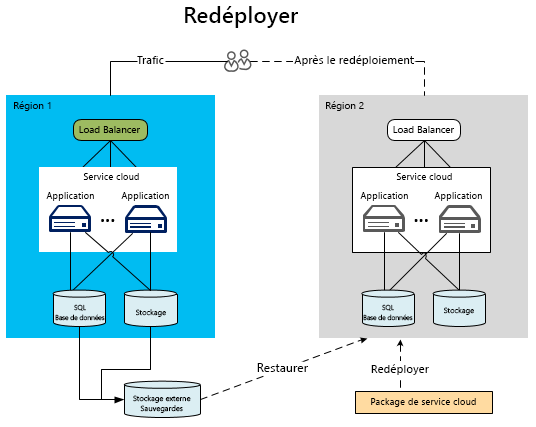

[!INCLUDE [header](../_includes/header.md)]
# Récupération d’urgence des applications Microsoft AzureDisaster recovery for Azure applications
Les stratégies de résilience et de haute disponibilité sont conçues pour faciliter la gestion des conditions de défaillance temporaire.Resiliency and high availability strategies are intended to handling temporary failure conditions. La récupération d’urgence (DR) se concentre sur la récupération des fonctionnalités des applications en cas de perte catastrophique.Disaster recovery (DR) is focused on recovering from a catastrophic loss of application functionality. Par exemple, si une région Azure hébergeant votre application devient indisponible, vous avez besoin d’un plan pour exécuter votre application ou accéder à vos données dans une autre région.For example, if an Azure region hosting your application becomes unavailable, you need a plan for running your application or accessing your data in another region. La mise en œuvre de ce plan implique des personnes, des processus et la prise en charge d’applications permettant au système de continuer à fonctionner.Executing this plan involves people, processes, and supporting applications that allow the system to continue functioning. Pour être parfaitement fiable, votre plan doit inclure une préparation aux conditions de panne et des essais de récupération des bases de données.Your plan should include rehearsing failures and testing the recovery of databases to ensure the plan is sound. Les entrepreneurs et propriétaires de technologies qui définissent le mode opérationnel du système dans une situation d’urgence déterminent également le niveau de fonctionnalité du service requis en cas d’incident.The business and technology owners who define the system's operational mode for a disaster also determine the level of service functionality required during a disaster. Le niveau de fonctionnalité peut prendre plusieurs formes : complètement indisponible, partiellement disponible (fonctionnalité réduite ou traitement différé) ou entièrement disponible.This level of functionality can take a few forms: completely unavailable, partially available via reduced functionality or delayed processing, or fully available.

## Fonctionnalités de la récupération d’urgence AzureAzure disaster recovery features
Comme pour les considérations relatives à la disponibilité, Azure fournit un [Guide technique de la résilience](./index.md), conçu pour prendre en charge la récupération d’urgence.As with availability considerations, Azure provides [resiliency technical guidance](./index.md) designed to support disaster recovery. Il existe également une relation entre les fonctionnalités de disponibilité d’Azure et la récupération d’urgence.There is also a relationship between availability features of Azure and disaster recovery. Par exemple, la gestion des rôles sur les domaines d’erreur augmente la disponibilité d’une application.For example, the management of roles across fault domains increases the availability of an application. Sans cette gestion, une défaillance matérielle non gérée deviendrait un scénario « catastrophe ».Without that management, an unhandled hardware failure would become a “disaster” scenario. Tirer parti de ces stratégies et fonctionnalités de disponibilité fait partie intégrante de la protection de votre application contre les situations d’urgence.Leveraging these availability features and strategies is an important part of disaster-proofing your application. Toutefois, cet article va au-delà des problèmes de disponibilité générale pour traiter des événements d’urgence plus graves (et plus rares).However, this article goes beyond general availability issues to more serious (and rarer) disaster events.

## Plusieurs régions contenant des centres de donnéesMultiple datacenter regions
Azure exploite des centres de données dans plusieurs régions à l’échelle internationale.Azure maintains datacenters in many regions around the world. Cette infrastructure prend en charge plusieurs scénarios de récupération d’urgence, tels que la géoréplication du stockage Azure vers des régions secondaires, fournie par le système.This infrastructure supports several disaster recovery scenarios, such as system-provided geo-replication of Azure Storage to secondary regions. Vous pouvez également déployer un service cloud vers de nombreux emplacements dans le monde entier facilement et de manière économique.You can also easily and inexpensively deploy a cloud service to multiple locations around the world. Comparez cela au coût et à la difficulté que représente la création et la maintenance de vos propres centres de données dans plusieurs régions différentes.Compare this with the cost and difficulty of building and maintaining your own datacenters in multiple regions. Le déploiement de services et de données dans plusieurs régions contribue à protéger votre application contre une panne majeure survenant dans une seule région.Deploying data and services to multiple regions helps protect your application from a major outage in a single region. Lorsque vous concevez votre plan de récupération d’urgence, il est important de comprendre le concept des régions jumelées.As you design your disaster recovery plan, it’s important to understand the concept of paired regions. Pour plus d’informations, consultez l’article [Continuité des activités et récupération d’urgence (BCDR) : régions jumelées d’Azure](/azure/best-practices-availability-paired-regions).For more information, see [Business continuity and disaster recovery (BCDR): Azure Paired Regions](/azure/best-practices-availability-paired-regions).

## Azure Traffic ManagerAzure Traffic Manager
En cas de défaillance spécifique à une région, vous devez rediriger le trafic vers les services ou les déploiements dans une autre région.When a region-specific failure occurs, you must redirect traffic to services or deployments in another region. Il est préférable de gérer cette situation via des services tels qu’Azure Traffic Manager, qui automatise le basculement du trafic utilisateur en cas de défaillance dans la région principale.It is most effective to handle this via services such as Azure Traffic Manager, which automates the failover of user traffic to another region if the primary region fails. La compréhension des principes de base de Traffic Manager est essentielle pour concevoir une stratégie efficace de récupération d’urgence.Understanding the fundamentals of Traffic Manager is important when designing an effective DR strategy.

Traffic Manager utilise le DNS (Domain Name System) pour diriger les requêtes des clients vers le point de terminaison approprié en fonction de la méthode de routage du trafic et de l’intégrité des points de terminaison.Traffic Manager uses the Domain Name System (DNS) to direct client requests to the most appropriate endpoint based on a traffic-routing method and the health of the endpoints. Dans le diagramme suivant, les utilisateurs se connectent à une URL Traffic Manager (`http://myATMURL.trafficmanager.net`) qui extrait les URL réelles des sites (`http://app1URL.cloudapp.net` et `http://app2URL.cloudapp.net`).In the following diagram, users connect to a Traffic Manager URL (`http://myATMURL.trafficmanager.net`) which abstracts the actual site URLs (`http://app1URL.cloudapp.net` and `http://app2URL.cloudapp.net`). Les requêtes des utilisateurs sont acheminées vers l’URL sous-jacente appropriée en fonction de la [méthode de routage Traffic Manager](/azure/traffic-manager/traffic-manager-routing-methods) configurée.User requests are routed to the proper underlying URL based on your configured [Traffic Manager routing method](/azure/traffic-manager/traffic-manager-routing-methods). Dans cet article, nous traiterons uniquement l’option de basculement.For the sake of this article, we will be concerned with only the failover option.

Lorsque vous configurez Traffic Manager, vous fournissez un nouveau préfixe DNS Traffic Manager qui sera utilisé par les utilisateurs pour accéder à votre service.When configuring Traffic Manager, you provide a new Traffic Manager DNS prefix, which users will use to access your service. Traffic Manager extrait à présent l’équilibrage de charge un niveau au-dessus du niveau régional.Traffic Manager now abstracts load balancing one level higher that the regional level. Le DNS Traffic Manager mappe vers un enregistrement CNAME pour tous les déploiements qu’il gère.The Traffic Manager DNS maps to a CNAME for all the deployments that it manages.

Dans Traffic Manager, vous spécifiez la liste prioritaire des déploiements vers lesquels les utilisateurs doivent être acheminés en cas de défaillance.Within Traffic Manager, you specify a prioritized list of deployments that users will be routed to when failure occurs. Traffic Manager surveille les points de terminaison de déploiement.Traffic Manager monitors the deployment endpoints. Si le déploiement principal devient indisponible, Traffic Manager achemine les utilisateurs vers le déploiement suivant sur la liste prioritaire.If the primary deployment becomes unavailable, Traffic Manager routes users to the next deployment on the priority list.

Bien que Traffic Manager choisisse la destination pendant un basculement, c’est vous qui décidez si votre domaine de basculement doit être dormant ou actif lorsque vous n’êtes pas en mode de basculement (ce qui n’a aucun lien avec Traffic Manager).Although Traffic Manager decides where to go during a failover, you can decide whether your failover domain is dormant or active while you're not in failover mode (which is unrelated to Traffic Manager). Traffic Manager détecte une défaillance du site principal et effectue la substitution vers le site de basculement, indépendamment du fait que ce site réponde aux demandes des utilisateurs ou non.Traffic Manager detects a failure in the primary site and rolls over to the failover site, regardless of whether that site is currently serving users.

Pour plus d’informations sur le fonctionnement d’Azure Traffic Manager, consultez :For more information on how Azure Traffic Manager works, refer to:

* [Vue d’ensemble de Traffic ManagerTraffic Manager overview](/azure/traffic-manager/traffic-manager-overview/)
* [Méthodes de routage de Traffic ManagerTraffic Manager routing methods](/azure/traffic-manager/traffic-manager-routing-methods)
* [Configurer la méthode de routage par basculementConfigure failover routing method](/azure/traffic-manager/traffic-manager-configure-failover-routing-method/)

## Scénarios d’urgence AzureAzure disaster scenarios
Les sections suivantes abordent les différents types de scénarios d’urgence.The following sections cover several different types of disaster scenarios. Les interruptions de service à l’échelle régionale ne sont pas la seule cause des défaillances des applications.Region-wide service disruptions are not the only cause of application-wide failures. Les pannes peuvent aussi être liées à une mauvaise conception et à des erreurs d’administration.Poor design and administrative errors can also lead to outages. Il est important de prendre en compte les causes possibles d’une défaillance lors des phases de conception et de test de votre plan de récupération.It's important to consider the possible causes of a failure during both the design and testing phases of your recovery plan. Un plan efficace tire parti des fonctionnalités d’Azure et les complète avec les stratégies conçues pour l’application.A good plan takes advantage of Azure features and augments them with application-specific strategies. La réponse choisie est déterminée par l’importance de l’application, l’objectif de point de récupération (RPO) et l’objectif de délai de récupération (RTO).The chosen response is determined by the importance of the application, the recovery point objective (RPO), and the recovery time objective (RTO).

### Échec de l’applicationApplication failure
Azure Traffic Manager gère automatiquement les défaillances résultant du logiciel de système d’exploitation ou du matériel sous-jacent dans la machine virtuelle hôte.Azure Traffic Manager automatically handles failures that result from the underlying hardware or operating system software in the host virtual machine. Azure crée une nouvelle instance de rôle et l’ajoute au pool disponible.Azure creates a new role instance and adds it to the available pool. Si plus d’une instance de rôle est déjà en cours d’exécution, Azure déplace le traitement vers les autres instances de rôle en cours d’exécution, tout en remplaçant le nœud défaillant.If  more than one role instance was already running, Azure shifts processing to the other running role instances while replacing the failed node.

Les erreurs graves d’applications ne sont pas toujours dues à une défaillance sous-jacente du matériel ou du système d’exploitation.Serious application errors can occur without any underlying failure of the hardware or operating system. L’application peut échouer en raison d’exceptions graves provoquées par une logique incorrecte ou des problèmes d’intégrité des données.The application might fail due to catastrophic exceptions caused by bad logic or data integrity issues. Vous devez inclure suffisamment de télémétrie dans le code de l’application pour qu’un système de surveillance puisse détecter les conditions d’échec et en informer un administrateur d’application.You must include sufficient telemetry in the application code so that a monitoring system can detect failure conditions and notify an application administrator. Un administrateur ayant une parfaite connaissance des processus de récupération d’urgence peut décider s’il faut déclencher un processus de basculement ou accepter un manque de disponibilité pendant la résolution des erreurs critiques.An administrator who has full knowledge of the disaster recovery processes can decide whether to trigger a failover process or accept an availability outage while resolving the critical errors.

### Corruption des donnéesData corruption
Azure stocke automatiquement les données de la base de données SQL Azure et du stockage Azure trois fois de manière redondante dans différents domaines d’erreur de la même région.Azure automatically stores Azure SQL Database and Azure Storage data three times redundantly within different fault domains in the same region. Si vous utilisez la géoréplication, les données sont stockées dans trois domaines supplémentaires dans une autre région.If you use geo-replication, the data is stored three additional times in a different region. Toutefois, si vos utilisateurs ou votre application endommagent ces données dans la copie principale, celles-ci sont rapidement répliquées dans les autres copies.However, if your users or your application corrupts that data in the primary copy, the data quickly replicates to the other copies. Malheureusement, cela a pour résultat plusieurs copies de données endommagées.Unfortunately, this results in multiple copies of corrupt data.

Vous disposez de deux options pour gérer l’altération potentielle de vos données.To manage potential corruption of your data, you have two options. Vous pouvez d’abord gérer une stratégie de sauvegarde personnalisée.First, you can manage a custom backup strategy. Vous pouvez stocker vos sauvegardes dans Azure ou localement selon les besoins de votre entreprise ou la réglementation en matière de gouvernance.You can store your backups in Azure or on-premises, depending on your business requirements or governance regulations. Une autre option consiste à utiliser l’option de limite de restauration dans le temps pour récupérer une base de données SQL.Another option is to use the point-in-time restore option to recover a SQL database. Pour plus d’informations, consultez la section consacrée aux [stratégies de données pour une récupération d’urgence](#data-strategies-for-disaster-recovery) ci-dessous.For more information, see the [data strategies for disaster recovery](#data-strategies-for-disaster-recovery) section below.

### Panne du réseauNetwork outage
Lorsque certaines parties du réseau Azure sont inaccessibles, vous ne pouvez pas toujours accéder à votre application ou à vos données.When parts of the Azure network are inaccessible, you may be unable to access your application or data. Si une ou plusieurs instances de rôle ne sont pas disponibles en raison de problèmes de réseau, Azure utilise les autres instances disponibles de votre application.If one or more role instances are unavailable due to network issues, Azure uses the remaining available instances of your application. Si votre application ne peut pas accéder à ses données en raison d’une panne du réseau Azure, vous pouvez éventuellement l’exécuter avec des fonctionnalités réduites en local à l’aide des données mises en cache.If your application cannot access its data because of an Azure network outage, you can potentially run with reduced application functionality locally by using cached data. Vous devez concevoir la stratégie de récupération d’urgence de manière à exécuter l’application avec des fonctionnalités réduites.You need to design the disaster recovery strategy to run with reduced functionality in your application. Pour certaines applications, cela peut se révéler peu pratique.For some applications, this might not be practical.

Une autre option consiste à stocker des données à un autre emplacement jusqu’au rétablissement de la connectivité.Another option is to store data in an alternate location until connectivity is restored. Si la réduction des fonctionnalités n’est pas une option, il vous reste les interruptions de service ou le basculement vers une autre région.If reducing functionality is not an option, the remaining options are application downtime or failover to an alternate region. La conception d’une application s’exécutant avec des fonctionnalités réduites relève aussi bien d’une décision économique que technique.The design of an application running with reduced functionality is as much a business decision as a technical one. Ce sujet est abordé plus en détail dans la section [Fonctionnalités réduites des applications](#reduced-application-functionality).This is discussed further in the section on [reduced application functionality](#reduced-application-functionality).

### Échec d’un service dépendantFailure of a dependent service
Azure fournit plusieurs services pouvant rencontrer des temps d’arrêt périodiques.Azure provides many services that can experience periodic downtime. Par exemple, [Cache Redis Azure](https://azure.microsoft.com/services/cache/) est un service mutualisé qui fournit des fonctionnalités de mise en cache à votre application.For example, [Azure Redis Cache](https://azure.microsoft.com/services/cache/) is a multi-tenant service which provides caching capabilities to your application. Il est important de savoir ce qui se passe dans votre application en cas d’indisponibilité du service dépendant.It's important to consider what happens in your application if the dependent service is unavailable. Ce scénario est assez semblable au scénario de panne du réseau.In many ways, this scenario is similar to the network outage scenario. Toutefois, le fait de considérer chaque service de manière indépendante favorise les améliorations potentielles de votre plan global.However, considering each service independently results in potential improvements to your overall plan.

Le Cache Redis Azure permet la mise en cache de votre application à partir de votre déploiement de service cloud, ce qui facilite la récupération d’urgence.Azure Redis Cache provides caching to your application from within your cloud service deployment, which provides disaster recovery benefits. Le service s’exécute désormais sur des rôles propres à votre déploiement.First, the service now runs on roles that are local to your deployment. Par conséquent, vous pouvez mieux surveiller et gérer l’état du cache dans le cadre de votre processus de gestion globale pour le service cloud.Therefore, you're better able to monitor and manage the status of the cache as part of your overall management processes for the cloud service. Ce type de mise en cache expose également de nouvelles fonctionnalités telles que la haute disponibilité des données mises en cache, qui permet de les conserver en cas de défaillance d’un nœud en conservant des copies dupliquées sur d’autres nœuds.This type of caching also exposes new features such as high availability for cached data, which preserves cached data if a single node fails by maintaining duplicate copies on other nodes.

Notez que la haute disponibilité diminue le débit et augmente la latence car les opérations d’écriture doivent également mettre à jour les copies secondaires.Note that high availability decreases throughput and increases latency because write operations must also upedate any secondary copies. La quantité de mémoire requise pour stocker les données mises en cache est multipliée par deux. Vous devez prendre cela en compte lors de la planification de capacité.The amount of memory required to store the cached data is effectively doubled, which must be taken into account during capacity planning.  Cet exemple montre que chaque service dépendant peut présenter des fonctionnalités pouvant améliorer votre disponibilité globale et la résistance aux défaillances catastrophiques.This example demonstrates that each dependent service might have capabilities that improve your overall availability and resistance to catastrophic failures.

Vous devez comprendre les conséquences d’une interruption de service pour chaque service dépendant.With each dependent service, you should understand the implications of a service disruption. Dans l’exemple de mise en cache, il est parfois possible d’accéder aux données directement à partir d’une base de données jusqu’à ce que vous restauriez votre cache.In the caching example, it might be possible to access the data directly from a database until you restore your cache. Cela diminue les performances, mais vous fournit un accès complet aux données d’application.This would result in reduced performance while providing full access to application data.

### Interruption du service à l’échelle régionaleRegion-wide service disruption
Les échecs précédents étaient principalement des défaillances pouvant être gérées au sein de la même région Azure.The previous failures have primarily been failures that can be managed within the same Azure region. Toutefois, vous devez également prévoir l’éventualité d’une interruption du service dans l’ensemble de la région.However, you must also prepare for the possibility that there is a service disruption of the entire region. Le cas échéant, les copies localement redondantes de vos données ne sont pas disponibles.If a region-wide service disruption occurs, the locally redundant copies of your data are not available. Si vous avez activé la géoréplication, trois copies supplémentaires de vos tables et objets blob sont stockées dans une autre région.If you have enabled geo-replication, there are three additional copies of your blobs and tables in a different region. Si Microsoft déclare la région comme étant perdue, Azure remappe toutes les entrées DNS vers la région géorépliquée.If Microsoft declares the region lost, Azure remaps all of the DNS entries to the geo-replicated region.

> [!NOTE]
> N’oubliez pas que vous n’avez aucun contrôle sur ce processus et qu’il ne se produit que pour les interruptions du service au niveau régional.Be aware that you don't have any control over this process, and it will occur only for region-wide service disruption. Ainsi, vous devez vous appuyer sur d’autres stratégies de sauvegarde propres à l’application pour atteindre le plus haut niveau de disponibilité.Because of this, you must rely on other application-specific backup strategies to achieve the highest level of availability. Pour plus d’informations, consultez la section consacrée aux [stratégies de données pour une récupération d’urgence](#data-strategies-for-disaster-recovery).For more information, see the section on [data strategies for disaster recovery](#data-strategies-for-disaster-recovery).
> 
> 

### Interruption du service dans l’ensemble des régions AzureAzure-wide service disruption
Vous devez prendre en compte l’ensemble des scénarios catastrophe lors de la planification d’urgence.In disaster planning, you must consider the entire range of possible disasters. L’une des interruptions de service les plus graves impliquerait l’interruption simultanée de toutes les régions Azure.One of the most severe service disruptions would involve all Azure regions simultaneously. Comme pour les autres interruptions de service, vous pouvez alors décider d’accepter le risque d’un arrêt temporaire.As with other service disruptions, you might decide to accept the risk of temporary downtime in that event. Les interruptions de service importantes, couvrant des régions entières, sont beaucoup plus rares que les interruptions de service isolées impliquant des services dépendants ou des régions uniques.Widespread service disruptions that span regions are much rarer than isolated service disruptions involving dependent services or single regions.

Cependant, vous pouvez décider que certaines applications critiques nécessitent un plan de sauvegarde pour une interruption de service multirégion.However, you may decide that certain mission-critical applications require a backup plan for a multi-region service disruption. Le plan peut comprendre le basculement vers des services dans un [cloud alternatif](#alternative-cloud) ou une [solution hybride locale et cloud](#hybrid-on-premises-and-cloud-solution).This plan might include failing over to services in an [alternative cloud](#alternative-cloud) or a [hybrid on-premises and cloud solution](#hybrid-on-premises-and-cloud-solution).

### Fonctionnalités réduites des applicationsReduced application functionality
Une application bien conçue utilise généralement des services qui communiquent entre eux via l’implémentation de modèles d’échange d’informations faiblement couplés.A well-designed application typically uses services that communicate with each other though the implementation of loosely coupled information-interchange patterns. Une application prenant en charge la récupération d’urgence nécessite la séparation des responsabilités au niveau du service.A DR-friendly application requires separation of responsibilities at the service level. Cela évite qu’une interruption de service dépendant ne provoque l’arrêt de l’application.This prevents the disruption of a dependent service from bringing down the entire application. Par exemple, les modules suivants peuvent composer une application de commerce en ligne pour la société Y :For example, consider a web commerce application for Company Y. The following modules might constitute the application:

* **Catalogue de produits** permet aux utilisateurs de parcourir les produits.**Product Catalog** allows users to browse products.
* **Panier** permet aux utilisateurs d’ajouter/supprimer des produits dans leur panier.**Shopping Cart** allows users to add/remove products in their shopping cart.
* **État de la commande** affiche le statut d’expédition des commandes des utilisateurs.**Order Status** shows the shipping status of user orders.
* **Finalisation de la commande** finalise la session d’achat par la soumission de la commande avec le paiement.**Order Submission** finalizes the shopping session by submitting the order with payment.
* **Traitement des commandes** valide la commande pour l’intégrité des données et contrôle les stocks.**Order Processing** validates the order for data integrity and performs a quantity availability check.

Quand une dépendance de service dans cette application n’est plus disponible, comment le service fonctionne-t-il jusqu'à la récupération de la dépendance ?When a service dependency in this application becomes unavailable, how does the service function until the dependency recovers? Un système bien conçu implémente des limites d’isolement en séparant les responsabilités lors de la conception et de l’exécution.A well-designed system implements isolation boundaries through separation of responsibilities, both at design time and at runtime. Vous pouvez classer chaque erreur comme étant récupérable ou non récupérable.You can categorize every failure as recoverable and non-recoverable. Les erreurs non récupérables provoqueront l’arrêt du service tandis que les erreurs récupérables peuvent être atténuées par le biais d’autres solutions.Non-recoverable errors will bring down the service, but you can mitigate a recoverable error through alternatives. Certains problèmes résolus par la gestion automatique des erreurs et la mise en œuvre d’autres mesures sont transparentes pour l’utilisateur.Certain problems addressed by automatically handling faults and taking alternate actions are transparent to the user. En cas d’une interruption de service plus sérieuse, l’application peut s’en trouver totalement indisponible.During a more serious service disruption, the application might be completely unavailable. La troisième option consiste à continuer à gérer les requêtes des utilisateurs avec des fonctionnalités réduites.A third option is to continue handling user requests with reduced functionality.

Par exemple, si la base de données pour l’hébergement des commandes tombe en panne, le service de traitement des commandes perd sa capacité à traiter les transactions commerciales.For instance, if the database for hosting orders goes down, the Order Processing service loses its ability to process sales transactions. Selon l’architecture, il peut être difficile, voire impossible pour les services de finalisation des commandes et de traitement des commandes de continuer à fonctionner.Depending on the architecture, it might be difficult or impossible for the Order Submission and Order Processing services of the application to continue. Si l’application n’est pas conçue pour gérer ce type de scénario, cette dernière pourrait se déconnecter entièrement.If the application is not designed to handle this scenario, the entire application might go offline. Cependant, si les données des produits sont stockées dans un autre emplacement, le module Catalogue de produits peut toujours être utilisé pour afficher les produits.However, if the product data is stored in a different location, then the Product Catalog module can still be used for viewing products. Les autres composants de l’application sont toutefois indisponibles, tels que les commandes ou le contrôle des stocks.However, other parts of the application are unavailable, such as ordering or inventory queries.

Le choix des fonctionnalités réduites des applications mises à disposition est le fruit de décisions économiques et techniques.Deciding what reduced application functionality is available is both a business decision and a technical decision. Vous devez décider comment l’application va informer les utilisateurs des problèmes temporaires.You must decide how the application will inform the users of any temporary problems. Dans l’exemple ci-dessus, l’application peut autoriser l’affichage des produits et leur ajout au panier.In the example above, the application might allow viewing products and adding them to a shopping cart. Cependant, lorsque l’utilisateur tente d’effectuer un achat, l’application l’informe que la fonctionnalité de commande est temporairement inaccessible.However, when the user attempts to make a purchase, the application notifies the user that the ordering functionality is temporarily unavailable. Ce n’est pas idéal pour le client, mais permet d’éviter une interruption de service de l’application dans son intégralité.This isn't ideal for the customer, but it does prevent an application-wide service disruption.

## stratégies de données pour une récupération d’urgenceData strategies for disaster recovery
La gestion appropriée des données est un aspect clé de tout plan de récupération d’urgence.Proper data handling is a challenging aspect of a disaster recovery plan. Pendant le processus de récupération, la restauration des données est ce qui prend généralement le plus de temps.During the recovery process, data restoration typically takes the most time. Des choix différents quant à la réduction des fonctionnalités entraînent des défis difficiles à relever en matière de récupération et de cohérence des données suite à une défaillance.Different choices for reducing functionality result in difficult challenges for data recovery from failure and consistency after failure.

Le besoin de restaurer ou de conserver une copie des données de l’application est un facteur à prendre en compte.One consideration is the need to restore or maintain a copy of the application’s data. Vous utiliserez ces données à des fins référentielles et transactionnelles sur un site secondaire.You will use this data for reference and transactional purposes at a secondary site. Un déploiement local requiert un processus de planification long et coûteux afin d’implémenter une stratégie de récupération d’urgence dans plusieurs régions.An on-premises deployment requires an expensive and lengthy planning process to implement a multiple-region disaster recovery strategy. Heureusement, la plupart des fournisseurs cloud, notamment Azure, permettent le déploiement d’applications dans plusieurs régions.Conveniently, most cloud providers, including Azure, readily allow the deployment of applications to multiple regions. La répartition géographique de ces régions minimise l’interruption de service dans plusieurs régions.These regions are geographically distributed in such a way that multiple-region service disruption should be extremely rare. La stratégie de gestion des données entre les régions est l’un des facteurs décisifs pour la réussite d’un plan de récupération d’urgence.The strategy for handling data across regions is one of the contributing factors for the success of any disaster recovery plan.

Les sections suivantes décrivent les techniques de récupération d’urgence liées aux sauvegardes de données, aux données de référence et aux données transactionnelles.The following sections discuss disaster recovery techniques related to data backups, reference data, and transactional data.

### Sauvegarde et restaurationBackup and restore
Des sauvegardes régulières des données d’application peuvent prendre en charge certains scénarios de récupération d’urgence.Regular backups of application data can support some disaster recovery scenarios. Les différentes ressources de stockage nécessitent des techniques différentes.Different storage resources require different techniques.

#### Base de données SQLSQL Database
Pour les niveaux de base, Standard et Premium de la base de données SQL, vous pouvez tirer parti de la limite de restauration dans le temps pour récupérer votre base de données.For the Basic, Standard, and Premium SQL Database tiers, you can take advantage of point-in-time restore to recover your database. Pour en savoir plus, consultez l’article [Vue d’ensemble : continuité des activités cloud et récupération d’urgence d’une base de données avec SQL Database](/azure/sql-database/sql-database-business-continuity/).For more information, see [Overview: Cloud business continuity and database disaster recovery with SQL Database](/azure/sql-database/sql-database-business-continuity/). Une autre option consiste à utiliser la géoréplication active pour la base de données SQL.Another option is to use Active Geo-Replication for SQL Database. Celle-ci réplique automatiquement les modifications de base de données sur les bases de données secondaires dans la même région Azure, voire dans une région différente.This automatically replicates database changes to secondary databases in the same Azure region or even in a different Azure region. Cela représente une alternative possible à certaines techniques de synchronisation de données plus manuelles, présentées dans cet article.This provides a potential alternative to some of the more manual data synchronization techniques presented in this article. Pour plus d’informations, consultez l’article [Vue d’ensemble : géoréplication active de base de données SQL](/azure/sql-database/sql-database-geo-replication-overview/).For more information, see [Overview: SQL Database Active Geo-Replication](/azure/sql-database/sql-database-geo-replication-overview/).

Vous pouvez également avoir recours à une approche plus manuelle pour la sauvegarde et la restauration.You can also use a more manual approach for backup and restore. Utilisez la commande DATABASE COPY pour créer une copie de sauvegarde de la base de données avec une cohérence transactionnelle.Use the DATABASE COPY command to create a backup copy of the database with transactional consistency. Vous pouvez également utiliser le service d’importation/exportation d’Azure SQL Database, qui prend en charge l’exportation des bases de données dans des fichiers BACPAC (fichiers compressés contenant votre schéma de base de données et les données associées) qui sont stockés dans le stockage Blob Azure.You can also use the import/export service of Azure SQL Database, which supports exporting databases to BACPAC files (compressed files containing your database schema and associated data) that are stored in Azure Blob storage.

La redondance intégrée d’Azure Storage crée deux réplicas du fichier de sauvegarde dans la même région.The built-in redundancy of Azure Storage creates two replicas of the backup file in the same region. Toutefois, la fréquence d’exécution du processus de sauvegarde détermine votre RPO, c’est-à-dire la quantité de données que vous risquez de perdre dans les scénarios d’urgence.However, the frequency of running the backup process determines your RPO, which is the amount of data you might lose in disaster scenarios. Par exemple, imaginez que vous effectuez une sauvegarde toutes les heures et qu’un incident survient deux minutes avant la nouvelle sauvegarde.For example, imagine that you perform a backup at the top of each hour, and a disaster occurs two minutes before the top of the hour. Vous perdez ainsi 58 minutes de données enregistrées depuis la dernière sauvegarde.You lose 58 minutes of data recorded after the last backup was performed. En outre, pour vous protéger contre une interruption de service à l’échelle régionale, vous devez copier les fichiers BACPAC vers une autre région.Also, to protect against a region-wide service disruption, you should copy the BACPAC files to an alternate region. Vous avez ensuite la possibilité de restaurer ces sauvegardes dans l’autre région.You then have the option of restoring those backups in the alternate region. Pour en savoir plus, consultez l’article [Vue d’ensemble : continuité des activités cloud et récupération d’urgence d’une base de données avec SQL Database](/azure/sql-database/sql-database-business-continuity/).For more details, see [Overview: Cloud business continuity and database disaster recovery with SQL Database](/azure/sql-database/sql-database-business-continuity/).

#### Azure StorageAzure Storage
Pour le stockage Azure, vous pouvez développer un processus de sauvegarde personnalisé ou utiliser l’un des nombreux outils de sauvegarde tiers.For Azure Storage, you can develop a custom backup process or use one of many third-party backup tools. Notez que la plupart des conceptions d’applications comportent des complexités supplémentaires dans la mesure où les ressources de stockage se référencent mutuellement.Note that most application designs have additional complexities where storage resources reference each other. Prenez l’exemple d’une base de données SQL comportant une colonne liée à un objet blob dans Azure Storage.For example, consider a SQL database that has a column that links to a blob in Azure Storage. Si les sauvegardes ne sont pas effectuées simultanément, cela peut être dû à l’absence de sauvegarde du pointeur vers un objet blob de la base de données avant la défaillance.If the backups do not happen simultaneously, the database might have a pointer to a blob that was not backed up before the failure. L’application ou le plan de récupération d’urgence doit implémenter des processus pour gérer cette incohérence une fois la récupération effectuée.The application or disaster recovery plan must implement processes to handle this inconsistency after a recovery.

#### Autres plateformes de donnéesOther data platforms
D’autres plateformes de données IaaS (Infrastructure-as-a-Service) hébergées, telles que Elasticsearch ou MongoDB, ont leurs propres fonctionnalités et particularités à prendre en compte lors de la création d’un processus intégré de sauvegarde et de restauration.Other infrastructure-as-a-service (IaaS) hosted data platforms, such as Elasticsearch or MongoDB, have their own capabilities and considerations when creating an integrated backup and restore process. Pour ces plateformes de données, la recommandation générale est d’utiliser des fonctionnalités de réplication ou de réalisation de captures instantanées basées sur l’intégration, natives ou disponibles.For these data platforms, the general recommendation is to use any native or available integration-based replication or snapshotting capabilities. Si ces fonctionnalités n’existent pas ou ne conviennent pas, vous pouvez éventuellement utiliser le Service de sauvegarde Azure ou les captures instantanées de disques managés/non managés pour créer une copie ponctuelle des données d’application.If those capabilities do not exist or are not suitable, then consider using Azure Backup Service or managed/unmanaged disk snapshots to create a point-in-time copy of application data. Dans tous les cas, il est important de déterminer comment effectuer des sauvegardes cohérentes, en particulier lorsque les données d’application sont réparties sur plusieurs systèmes de fichiers, ou lorsque plusieurs lecteurs sont combinés en un seul système de fichiers à l’aide de gestionnaires de volumes ou de systèmes RAID logiciels.In all cases, it’s important to determine how to achieve consistent backups, especially when application data spans multiple files systems, or when multiple drives are combined into a single file system using volume managers or software-based RAID.

### Modèle de données de référence pour la récupération d’urgenceReference data pattern for disaster recovery
Les données de référence sont des données en lecture seule qui prennent en charge les fonctionnalités de l’application.Reference data is read-only data that supports application functionality. Celles-ci ne changent pas souvent.It typically does not change frequently. La sauvegarde et restauration constitue l’une des méthodes pour gérer des interruptions de service à l’échelle régionale ; cependant, l’objectif de délai de récupération (RTO) est relativement long.Although backup and restore is one method to handle region-wide service disruptions, the RTO is relatively long. Lorsque vous déployez l’application vers une région secondaire, certaines stratégies peuvent améliorer le RTO pour les données de référence.When you deploy the application to a secondary region, some strategies can improve the RTO for reference data.

Étant donné que les données de référence ne changent pas souvent, vous pouvez améliorer le RTO en conservant une copie permanente des données de référence dans la région secondaire.Because reference data changes infrequently, you can improve the RTO by maintaining a permanent copy of the reference data in the secondary region. Cela élimine le temps nécessaire à la restauration des sauvegardes en cas de sinistre.This eliminates the time required to restore backups in the event of a disaster. Pour répondre aux exigences en matière de récupération d’urgence dans plusieurs régions, vous devez déployer l’application et les données de référence ensemble dans plusieurs régions.To meet the multiple-region disaster recovery requirements, you must deploy the application and the reference data together in multiple regions. Comme indiqué dans la section [Modèle de données de référence pour la haute disponibilité](high-availability-azure-applications.md#reference-data-pattern-for-high-availability), vous pouvez déployer des données de référence vers le rôle lui-même, le stockage externe ou une combinaison des deux.As mentioned in [Reference data pattern for high availability](high-availability-azure-applications.md#reference-data-pattern-for-high-availability), you can deploy reference data to the role itself, to external storage, or to a combination of both.

Le modèle de déploiement des données de référence au sein des nœuds de calcul répond implicitement aux exigences de récupération d’urgence.The reference data deployment model within compute nodes implicitly satisfies the disaster recovery requirements. Le déploiement des données de référence vers la base de données SQL requiert le déploiement d’une copie de ces données vers chaque région.Reference data deployment to SQL Database requires that you deploy a copy of the reference data to each region. La même stratégie s’applique à Azure Storage.The same strategy applies to Azure Storage. Vous devez déployer une copie de toutes les données de référence stockées dans Azure Storage vers les régions primaires et secondaires.You must deploy a copy of any reference data that's stored in Azure Storage to the primary and secondary regions.

Vous devez implémenter vos routines de sauvegarde propres à l’application pour l’ensemble de vos données, y compris les données de référence.You must implement your own application-specific backup routines for all data, including reference data. Les copies géorépliquées entre les régions ne sont utilisées qu’en cas d’interruption de service à l’échelle régionale.Geo-replicated copies across regions are used only in a region-wide service disruption. Pour éviter des temps d’arrêt prolongés, déployez les parties critiques des données de l’application vers la région secondaire.To prevent extended downtime, deploy the mission-critical parts of the application’s data to the secondary region. Pour obtenir un exemple de cette topologie, consultez le [modèle actif/passif](#active-passive).For an example of this topology, see the [active-passive model](#active-passive).

### Modèle de données transactionnelles pour la récupération d’urgenceTransactional data pattern for disaster recovery
L’implémentation d’une stratégie de récupération d’urgence pleinement opérationnelle nécessite la réplication asynchrone des données transactionnelles vers la région secondaire.Implementation of a fully functional disaster mode strategy requires asynchronous replication of the transactional data to the secondary region. Les fenêtres temporelles pratiques dans lesquelles la réplication peut se produire déterminent les caractéristiques du RPO de l’application.The practical time windows within which the replication can occur will determine the RPO characteristics of the application. Vous pourrez peut-être récupérer les données perdues de la région primaire pendant la durée de réplication.You might still recover the data that was lost from the primary region during the replication window. Vous serez peut-être également en mesure de fusionner avec la région secondaire ultérieurement.You might also be able to merge with the secondary region later.

Les exemples suivants d’architecture donnent quelques idées sur les différentes façons de gérer les données transactionnelles dans un scénario de basculement.The following architecture examples provide some ideas on different ways of handling transactional data in a failover scenario. Veuillez noter que ces exemples ne sont pas exhaustifs.It's important to note that these examples are not exhaustive. Par exemple, les emplacements de stockage intermédiaires, tels que des files d’attente, peuvent être remplacés par la base de données SQL Azure.For example, intermediate storage locations such as queues might be replaced with Azure SQL Database. Ces files d’attente peuvent être issues du stockage Azure ou d’Azure Service Bus ; consultez la page [Files d’attente Azure et files d’attente Service Bus : comparaison et différences](/azure/service-bus-messaging/service-bus-azure-and-service-bus-queues-compared-contrasted/).The queues themselves might be either Azure Storage or Azure Service Bus queues (see [Azure queues and Service Bus queues - compared and contrasted](/azure/service-bus-messaging/service-bus-azure-and-service-bus-queues-compared-contrasted/)). Les destinations de stockage serveur peuvent également varier (par exemple, des tables Azure au lieu de la base de données SQL).Server storage destinations might also vary, such as Azure tables instead of SQL Database. En outre, des rôles de travail peuvent être insérés en tant qu’intermédiaires lors des différentes étapes.In addition, worker roles might be inserted as intermediaries in various steps. L’objectif n’est pas d’émuler ces architectures au détail près, mais d’envisager différentes solutions de récupération des données transactionnelles et des modules associés.The intent is not to emulate these architectures exactly, but to consider various alternatives in the recovery of transactional data and related modules.

#### Réplication des données transactionnelles en vue d’une récupération d’urgenceReplication of transactional data in preparation for disaster recovery
Considérez une application qui utilise des files d’attente Azure Storage pour stocker les données transactionnelles.Consider an application that uses Azure Storage queues to hold transactional data. Cela permet aux rôles de travail de traiter les données transactionnelles dans la base de données de serveur dans une architecture découplée.This allows worker roles to process the transactional data to the server database in a decoupled architecture. Cela requiert l’utilisation d’un type de mise en cache temporaire par les transactions si les rôles frontaux nécessitent l’interrogation immédiate de ces données.This requires the transactions to use some form of temporary caching if the front-end roles require the immediate query of that data. Selon le niveau de tolérance de perte de données, vous pouvez choisir de répliquer les files d’attente, la base de données ou l’ensemble des ressources de stockage.Depending on the level of data-loss tolerance, you might choose to replicate the queues, the database, or all of the storage resources. Si vous utilisez uniquement la réplication de base de données lorsque la région primaire échoue, vous pouvez toujours récupérer les données présentes dans les files d’attente lorsque la région primaire revient en ligne.With only database replication, if the primary region goes down, you can still recover the data in the queues when the primary region comes back.

Le schéma suivant illustre une architecture dans laquelle la base de données du serveur est synchronisée entre les régions.The following diagram shows an architecture where the server database is synchronized across regions.

Le plus gros défi que pose l’implémentation de cette architecture est la stratégie de réplication entre les régions.The biggest challenge to implementing this architecture is the replication strategy between regions. Le service de [Azure SQL Data Sync](/azure/sql-database/sql-database-get-started-sql-data-sync/) active ce type de réplication.The [Azure SQL Data Sync](/azure/sql-database/sql-database-get-started-sql-data-sync/) service enables this type of replication. Au moment où cet article est rédigé, il n’existe qu’une version préliminaire de ce service et il n’est pas encore recommandé de l’utiliser pour les environnements de production.As of this writing, the service is in preview and is not yet recommended for production environments. Pour en savoir plus, consultez l’article [Vue d’ensemble : continuité des activités cloud et récupération d’urgence d’une base de données avec SQL Database](/azure/sql-database/sql-database-business-continuity/).For more information, see [Overview: Cloud business continuity and database disaster recovery with SQL Database](/azure/sql-database/sql-database-business-continuity/). Pour les applications de production, vous devez acheter une solution tierce ou créer votre propre logique de réplication dans le code.For production applications, you must invest in a third-party solution or create your own replication logic in code. Selon l’architecture, la réplication peut être bidirectionnelle (plus complexe).Depending on the architecture, the replication might be bidirectional, which is more complex.

L’une des implémentations possibles serait d’utiliser la file d’attente intermédiaire de l’exemple précédent.One potential implementation might make use of the intermediate queue in the previous example. Le rôle de travail qui traite les données vers la destination de stockage définitive peut apporter la modification dans la région primaire et secondaire.The worker role that processes the data to the final storage destination might make the change in both the primary region and the secondary region. Ces tâches sont importantes ; cet article n’aborde cependant pas de manière détaillée la question du code de réplication.These are not trivial tasks, and complete guidance for replication code is beyond the scope of this article. Prenez suffisamment de temps pour concevoir et tester votre approche de la réplication des données dans la région secondaire.Invest significant time and testing into the approach for replicating data to the secondary region. Des traitements et des tests supplémentaires peuvent vous permettre de vous assurer que les processus de récupération et de basculement gèrent correctement les incohérences des données ou les transactions en double.Additional processing and testing can help ensure that the failover and recovery processes correctly handle any possible data inconsistencies or duplicate transactions.

> [!NOTE]
> La majeure partie de ce document porte sur la fonctionnalité PaaS (Platform as a Service).Most of this paper focuses on platform as a service (PaaS). Cependant, d’autres options de réplication et de disponibilité pour les applications hybrides utilisent des machines virtuelles Azure.However, additional replication and availability options for hybrid applications use Azure Virtual Machines. Ces applications hybrides utilisent la fonctionnalité IaaS (Infrastructure as a Service) pour héberger SQL Server sur des machines virtuelles dans Azure.These hybrid applications use infrastructure as a service (IaaS) to host SQL Server on virtual machines in Azure. Cela permet d’avoir des approches de disponibilité traditionnelles dans SQL Server, telles que les groupes de disponibilité AlwaysOn ou la copie des journaux de transaction.This allows traditional availability approaches in SQL Server, such as AlwaysOn Availability Groups or Log Shipping. Certaines techniques, telles que AlwaysOn, fonctionnent uniquement entre les machines virtuelles Azure et les instances SQL Server.Some techniques, such as AlwaysOn, work only between on-premises SQL Server instances and Azure virtual machines. Pour plus d’informations, consultez [Haute disponibilité et récupération d’urgence pour SQL Server dans Azure Virtual Machines](/azure/virtual-machines/windows/sql/virtual-machines-windows-sql-high-availability-dr/).For more information, see [High availability and disaster recovery for SQL Server in Azure Virtual Machines](/azure/virtual-machines/windows/sql/virtual-machines-windows-sql-high-availability-dr/).
> 
> 

#### Fonctionnalités réduites des applications pour la capture des transactionsReduced application functionality for transaction capture
Considérez une deuxième architecture fonctionnant avec des fonctionnalités réduites.Consider a second architecture that operates with reduced functionality. L’application de la région secondaire désactive toutes les fonctionnalités, telles que la création de comptes rendus, la Business Intelligence (BI) ou le traitement des files d’attente.The application in the secondary region deactivates all the functionality, such as reporting, business intelligence (BI), or draining queues. Elle accepte uniquement les types de flux de travail les plus importants, tels que définis par les besoins de l’entreprise.It accepts only the most important types of transactional workflows, as defined by business requirements. Le système capture les transactions et les écrit dans les files d’attente.The system captures the transactions and writes them to queues. Le système peut différer le traitement des données lors de la phase initiale de l’interruption de service.The system might postpone processing the data during the initial stage of the service disruption. Si le système de la région primaire est réactivé dans l’intervalle de temps attendu, les rôles de travail peuvent traiter les files d’attente dans la région primaire.If the system on the primary region is reactivated within the expected time window, the worker roles in the primary region can drain the queues. Ce processus élimine la nécessité de fusionner les bases de données.This process eliminates the need for database merging. Si l’interruption de service de la région primaire dépasse la fenêtre de temps acceptable, l’application peut commencer à traiter les files d’attente.If the primary region service disruption goes beyond the tolerable window, the application can start processing the queues.

Dans ce scénario, la base de données de la région secondaire contient des données transactionnelles incrémentielles qui doivent être fusionnées après la réactivation de la région primaire.In this scenario, the database in the secondary region contains incremental transactional data that must be merged after the primary is reactivated. Le schéma suivant illustre cette stratégie pour le stockage temporaire des données transactionnelles, jusqu’à la restauration de la région primaire.The following diagram shows this strategy for temporarily storing transactional data until the primary region is restored.

Pour plus d’informations sur les techniques de gestion de données pour les applications Azure résilientes, consultez l’article [Failsafe: guidance for resilient cloud architectures](https://channel9.msdn.com/Series/FailSafe)(Sécurité intégrée : recommandations applicables à la résilience des architectures cloud).For more discussion of data management techniques for resilient Azure applications, see [Failsafe: Guidance for Resilient Cloud Architectures](https://channel9.msdn.com/Series/FailSafe).

## Topologies de déploiement pour la récupération d’urgenceDeployment topologies for disaster recovery
Vous devez préparer les applications critiques à gérer une interruption de service à l’échelle régionale.You must prepare mission-critical applications to handle region-wide service disruptions. Incorporez à la planification opérationnelle une stratégie de déploiement de plusieurs régions.Incorporate a multiple-region deployment strategy into the operational planning.

Les déploiements multirégions peuvent impliquer la publication de l’application et des données de référence par des processus informatiques vers la région secondaire suite à un incident.Multiple-region deployments might involve IT processes to publish the application and reference data to the secondary region after a disaster. Si l’application requiert un basculement instantané, le processus de déploiement peut comprendre une configuration en mode actif/passif ou en mode actif/actif.If the application requires instant failover, the deployment process might involve an active/passive setup or an active/active setup. Pour ce type de déploiement, des instances existantes de l’application s’exécutent dans l’autre région.This type of deployment has existing instances of the application running in the alternate region. Un service de routage tel qu’Azure Traffic Manager fournit des services d’équilibrage de charge au niveau du DNS.A routing service such as Azure Traffic Manager provides load-balancing services at the DNS level. Il peut détecter des interruptions de service et router les utilisateurs vers différentes régions lorsque cela s’avère nécessaire.It can detect service disruptions and route the users to different regions when needed.

Une récupération d’urgence Azure efficace implique d’intégrer cette récupération dans la solution dès le début.A successful Azure disaster recovery includes building that recovery into the solution from the start. Le cloud propose des options supplémentaires pour la récupération des données lors d’un incident ; celles-ci ne sont pas proposées par un fournisseur d’hébergement traditionnel.The cloud provides additional options for recovering from failures during a disaster that are not available in a traditional hosting provider. Plus précisément, vous pouvez allouer des ressources dans une autre région de façon dynamique et rapide, en évitant le coût des ressources inactives, avant une défaillance.Specifically, you can dynamically and quickly allocate resources in a different region, avoiding the cost of idle resources prior to a failure.

Les sections suivantes abordent différentes topologies de déploiement pour la récupération d’urgence.The following sections cover different deployment topologies for disaster recovery. En règle générale, il existe un compromis entre l’augmentation des coûts ou la complexité liée à une disponibilité accrue.Typically, there's a tradeoff in increased cost or complexity for additional availability.

### Déploiement dans une seule régionSingle-region deployment
Un déploiement dans une seule région ne constitue pas réellement une topologie de récupération d’urgence, mais sert plutôt à créer un contraste avec les autres architectures.A single-region deployment is not really a disaster recovery topology, but is meant to contrast with the other architectures. Les déploiements monorégion des applications dans Azure sont courants. Toutefois, ils ne sont pas conformes aux exigences d’une topologie de récupération d’urgence.Single-region deployments are common for applications in Azure; however, they do not meet the requirements of a disaster recovery topology.

Le diagramme suivant illustre une application exécutée dans une seule région Azure.The following diagram depicts an application running in a single Azure region. Azure Traffic Manager et l’utilisation des domaines d’erreur et de mise à niveau augmentent la disponibilité de l’application dans la région.Azure Traffic Manager and the use of fault and upgrade domains increase availability of the application within the region.

Dans ce scénario, la base de données constitue un point de défaillance unique.In this scenario, the database is a single point of failure. Bien qu’Azure réplique les données dans différents domaines d’erreur vers des réplicas internes, la réplication se produit uniquement dans la même région.Though Azure replicates the data across different fault domains to internal replicas, this replication occurs only within the same region. L’application ne peut pas résister aux pannes catastrophiques.The application cannot withstand a catastrophic failure. Si la région devient indisponible, il en est de même pour les domaines d’erreur, ce qui inclut toutes les instances de service et les ressources de stockage.If the region becomes unavailable, then so do the fault domains, including all service instances and storage resources.

Pour toutes les applications les moins critiques, vous devez concevoir un plan pour déployer vos applications dans plusieurs régions.For all but the least critical applications, you must devise a plan to deploy your applications across multiple regions. Vous devez également considérer le RTO et les contraintes de coût lorsque vous décidez quelle topologie de déploiement utiliser.You should also consider RTO and cost constraints in considering which deployment topology to use.

Examinons à présent les approches spécifiques pour prendre en charge le basculement entre les différentes régions.Let’s take a look now at specific approaches to supporting failover across different regions. Ces exemples utilisent tous deux régions pour décrire le processus.These examples all use two regions to describe the process.

### Redéploiement vers une région Azure secondaireRedeployment to a secondary Azure region
Dans l’approche de redéploiement vers une région secondaire, seule la région primaire contient des applications et des bases de données en cours d’exécution.For the approach of redeployment to a secondary region, only the primary region has applications and databases running. La région secondaire n’est pas configurée pour un basculement automatique.The secondary region is not set up for an automatic failover. Par conséquent, en cas d’incident, vous devez activer toutes les parties du service dans la nouvelle région.So when a disaster occurs, you must spin up all the parts of the service in the new region. Cela inclut le chargement d’un service cloud sur Azure, le déploiement du service cloud, la restauration des données et la modification du DNS afin de rerouter le trafic.This includes uploading a cloud service to Azure, deploying the cloud service, restoring the data, and changing DNS to reroute the traffic.

Bien que cette option soit la plus abordable des options couvrant plusieurs régions, elle présente les caractéristiques RTO les moins avantageuses.Although this is the most affordable of the multiple-region options, it has the worst RTO characteristics. Dans ce modèle, les sauvegardes de base de données et de packages de service sont stockées localement ou dans l’instance du stockage d’objets blob Azure de la région secondaire.In this model, the service package and database backups are stored either on-premises or in the Azure Blob storage instance of the secondary region. Toutefois, vous devez déployer un nouveau service et restaurer les données avant la reprise des opérations du modèle.However, you must deploy a new service and restore the data before it resumes operation. Même si vous automatisez entièrement le transfert de données du stockage de sauvegarde, le déploiement d’un nouvel environnement de base de données est très chronophage.Even with full automation of the data transfer from backup storage, provisioning a new database environment consumes a lot of time. Le déplacement des données à partir du stockage de sauvegarde sur disque vers la base de données vide de la région secondaire constitue la partie la plus coûteuse du processus de restauration.Moving data from the backup disk storage to the empty database on the secondary region is the most expensive part of the restore process. Cette opération est cependant nécessaire pour que la nouvelle base de données puisse fonctionner, cette dernière n’étant pas répliquée.You must do this, however, to bring the new database to an operational state because it isn't replicated.

La meilleure approche consiste à stocker les packages de service dans le stockage d’objets blob de la région secondaire.The best approach is to store the service packages in Blob storage in the secondary region. Cela élimine la nécessité de charger le package vers Azure ; c’est ce qui se produit lorsqu’un déploiement est effectué à partir d’un ordinateur de développement local.This eliminates the need to upload the package to Azure, which is what happens when you deploy from an on-premises development machine. À l’aide des scripts PowerShell, vous pouvez rapidement déployer les packages de service vers un nouveau service cloud à partir d’un stockage d’objets blob.You can quickly deploy the service packages to a new cloud service from Blob storage by using PowerShell scripts.

Cette option est seulement pratique pour les applications non critiques pouvant tolérer un RTO élevé.This option is practical only for non-critical applications that can tolerate a high RTO. Cela peut, par exemple, fonctionner pour une application pouvant être arrêtée plusieurs heures, mais qui doit être à nouveau disponible dans les 24 heures.For instance, this might work for an application that can be down for several hours but is required to be available within 24 hours.

### Actif/PassifActive-passive
La topologie actif/passif a été adoptée par de nombreuses sociétés.An active-passive topology is the choice that many companies favor. Elle apporte des améliorations au RTO, avec une augmentation relativement faible du coût par rapport à l’approche de redéploiement.This topology provides improvements to the RTO with a relatively small increase in cost over the redeployment approach. Dans ce scénario, des régions Azure primaire et secondaire sont de nouveau présentes.In this scenario, there is again a primary and a secondary Azure region. Tout le trafic est acheminé vers le déploiement actif de la région primaire.All of the traffic goes to the active deployment on the primary region. La région secondaire est mieux préparée pour la récupération d’urgence, car la base de données s’exécute dans les deux régions.The secondary region is better prepared for disaster recovery because the database is running on both regions. En outre, un mécanisme de synchronisation est mis en place entre les deux régions.Additionally, a synchronization mechanism is in place between them. Cette approche de secours comprend deux variantes : une approche basée uniquement sur la base de données ou un déploiement complet dans la région secondaire.This standby approach can involve two variations: a database-only approach or a complete deployment in the secondary region.

#### Base de données uniquementDatabase only
Dans la première variante de la topologie actif/passif, seule la région primaire contient une application de service cloud déployée.In the first variation of the active-passive topology, only the primary region has a deployed cloud service application. Toutefois, contrairement à l’approche de redéploiement, les deux régions sont synchronisées avec les contenus de la base de données.However, unlike the redeployment approach, both regions are synchronized with the contents of the database. (Pour plus d’informations, consultez la section consacrée au [modèle de données transactionnel pour une récupération d’urgence](#transactional-data-pattern-for-disaster-recovery).) En cas d’incident, les exigences d’activation sont réduites.(For more information, see the section on [transactional data pattern for disaster recovery](#transactional-data-pattern-for-disaster-recovery).) When a disaster occurs, there are fewer activation requirements. Vous démarrez l’application dans la région secondaire, modifiez les chaînes de connexion à la nouvelle base de données et modifiez les entrées DNS afin de rerouter le trafic.You start the application in the secondary region, change connection strings to the new database, and change the DNS entries to reroute traffic.

Comme pour l’approche de redéploiement, vous devez déjà avoir stocké les packages de service dans le stockage d’objets blob Azure dans la région secondaire pour un déploiement plus rapide.Like the redeployment approach, you should have already stored the service packages in Azure Blob storage in the secondary region for faster deployment. Cependant, vous échappez à la majorité du traitement que nécessite l’opération de restauration de base de données, car la base de données est prête et en cours d’exécution.However, you don’t incur the majority of the overhead that database restore operation requires, because the database is ready and running. Cette approche permet de gagner beaucoup de temps, ce qui en fait une solution de récupération d’urgence économique (et aussi majoritairement utilisée).This saves a significant amount of time, making this an affordable DR pattern (and the one most frequently used).

#### Réplica completFull replica
Dans la deuxième variante de la topologie actif/passif, la région primaire et la région secondaire connaissent un déploiement complet.In the second variation of the active-passive topology, both the primary region and the secondary region have a full deployment. Ce déploiement inclut les services cloud et une base de données synchronisée.This deployment includes the cloud services and a synchronized database. Toutefois, seule la région primaire traite activement les requêtes réseau des utilisateurs.However, only the primary region is actively handling network requests from the users. La région secondaire devient active uniquement lorsque la région primaire subit une interruption de service.The secondary region becomes active only when the primary region experiences a service disruption. Dans ce cas, toutes les nouvelles requêtes réseau effectuent le routage vers la région secondaire.In that case, all new network requests route to the secondary region. Azure Traffic Manager gère automatiquement ce basculement.Azure Traffic Manager can manage this failover automatically.

Le basculement se produit plus rapidement que dans la variante contenant uniquement la base de données, les services étant déjà déployés.Failover occurs faster than the database-only variation because the services are already deployed. Cette topologie fournit un objectif de délai de récupération (RTO) très faible.This topology provides a very low RTO. La région de basculement secondaire doit être opérationnelle dès que la région primaire rencontre une défaillance.The secondary failover region must be ready to go immediately after failure of the primary region.

En plus d’assurer un temps de réponse plus rapide, cette topologie pré-alloue et déploie des services de sauvegarde, évitant le risque d’un manque d’espace pour allouer de nouvelles instances lors d’un incident.Along with a quicker response time, this topology pre-allocates and deploys backup services, avoiding the possibility of a lack of space to allocate new instances during a disaster. C’est un élément important si votre région Azure secondaire est proche de sa capacité maximale.This is important if your secondary Azure region is nearing capacity. Aucun contrat de niveau de service (SLA) ne garantit que vous pouvez déployer instantanément un ou plusieurs nouveaux services cloud dans n’importe quelle région.No service-level agreement (SLA) guarantees that you can instantly deploy one or more new cloud services in any region.

Pour obtenir un temps de réponse optimal avec ce modèle, vous devez disposer d’une échelle semblable (nombre d’instances de rôle) dans les régions primaires et secondaires.For the fastest response time with this model, you must have similar scale (number of role instances) in the primary and secondary regions. Malgré les avantages, le fait de payer pour des instances de calcul inutilisées se révèle coûteux ; cela peut ne pas être le meilleur choix d’un point de vue financier.Despite the advantages, paying for unused compute instances is costly, and this might not be the most prudent financial choice. Pour cette raison, il est plus courant d’utiliser une version des services cloud dont la puissance a été légèrement réduite dans la région secondaire.Because of this, it's more common to use a slightly scaled-down version of cloud services on the secondary region. Vous pouvez ensuite rapidement faire basculer et monter en charge le déploiement secondaire, si nécessaire.Then you can quickly fail over and scale out the secondary deployment if necessary. Vous devriez automatiser le processus de basculement afin de pouvoir activer des instances supplémentaires, selon la charge, lorsque la région primaire devient inaccessible.You should automate the failover process so that after the primary region is inaccessible, you activate additional instances, depending on the load. Cela peut impliquer l’utilisation d’un mécanisme de mise à l’échelle automatique, tel que des [groupes de machines virtuelles identiques](/azure/virtual-machine-scale-sets/virtual-machine-scale-sets-overview/).This might involve the use of an autoscaling mechanism like [virtual machine scale sets](/azure/virtual-machine-scale-sets/virtual-machine-scale-sets-overview/).

Le schéma suivant présente un modèle dans lequel les régions primaires et secondaires contiennent un service cloud entièrement déployé selon une topologie actif/passif.The following diagram shows the model where the primary and secondary regions contain a fully deployed cloud service in an active-passive topology.

### Actif/actifActive-active
Dans une topologie actif/actif, les services cloud et la base de données sont entièrement déployés dans les deux régions.In an active-active topology, the cloud services and database are fully deployed in both regions. Contrairement au modèle actif/passif, les deux régions reçoivent le trafic utilisateur.Unlike the active-passive model, both regions receive user traffic. Cette option réduit au minimum le temps de récupération.This option yields the quickest recovery time. Les services ont déjà été mis à l’échelle pour gérer une partie de la charge dans chaque région.The services are already scaled to handle a portion of the load at each region. DNS est déjà activé pour une utilisation dans la région secondaire.DNS is already enabled to use the secondary region. La décision visant à router les utilisateurs vers la région appropriée présente des difficultés supplémentaires.There's additional complexity in determining how to route users to the appropriate region. La planification par tourniquet (round robin) pourrait se révéler une option.Round-robin scheduling might be possible. Il est plus probable que certains utilisateurs utilisent une région dans laquelle se trouve la copie principale de leurs données.It's more likely that certain users would use a specific region where the primary copy of their data resides.

En cas de basculement, vous devez simplement désactiver DNS dans la région primaire.In case of failover, simply disable DNS to the primary region. Ainsi, tout le trafic est acheminé vers la région secondaire.This routes all traffic to the secondary region.

Ce modèle présente également des variantes.Even in this model, there are some variations. Par exemple, le schéma suivant illustre une région primaire qui possède la copie principale de la base de données.For example, the following diagram depicts a primary region which owns the master copy of the database. Les services cloud des deux régions écrivent vers cette base de données primaire.The cloud services in both regions write to that primary database. Le déploiement secondaire peut effectuer la lecture à partir de la base de données primaire ou répliquée.The secondary deployment can read from the primary or replicated database. Dans cet exemple, la réplication est unidirectionnelle.Replication in this example is one-way.

L’architecture actif/actif du schéma précédent présente cependant un inconvénient.There is a downside to the active-active architecture in the preceding diagram. La deuxième région doit accéder à la base de données de la première région car cette dernière détient la copie principale.The second region must access the database in the first region because the master copy resides there. Les performances connaissent une forte baisse lorsque vous accédez à des données en dehors d’une région.Performance significantly drops off when you access data from outside a region. Pour les appels de base de données entre les régions, vous devez envisager une stratégie de traitement par lots afin d’améliorer les performances de ces appels.In cross-region database calls, you should consider some type of batching strategy to improve the performance of these calls. Pour en savoir plus, consultez l’article [Comment utiliser le traitement par lots pour améliorer les performances des applications de base de données SQL](/azure/sql-database/sql-database-use-batching-to-improve-performance/).For more information, see [How to use batching to improve SQL Database application performance](/azure/sql-database/sql-database-use-batching-to-improve-performance/).

Dans une autre architecture possible, chaque région peut directement accéder à sa propre base de données.An alternative architecture might involve each region accessing its own database directly. Dans ce modèle, un type quelconque de réplication bidirectionnelle peut être nécessaire pour synchroniser les bases de données dans chaque région.In that model, some type of bidirectional replication is required to synchronize the databases in each region.

Avec les topologies précédentes, diminuer le RTO revient généralement à augmenter les coûts et la complexité.With the previous topologies, decreasing RTO generally increases costs and complexity. La topologie actif/actif diffère de ce modèle de coût.The active-active topology deviates from this cost pattern. Dans la topologie actif/actif, la région primaire peut ne pas nécessiter autant d’instances que dans la topologie actif/passif.In the active-active topology, you might not need as many instances on the primary region as you would in the active-passive topology. Si, dans une architecture actif/passif, 10 instances sont présentes dans la région primaire, une architecture actif/actif ne nécessiterait en revanche que 5 instances dans chaque région.If you have 10 instances on the primary region in an active-passive architecture, you might need only 5 in each region in an active-active architecture. Les deux régions partagent à présent la même charge.Both regions now share the load. Cela peut représenter des économies d’argent par rapport à la topologie actif/passif si vous avez conservé une solution de secours actif pour la région passive, avec 10 instances en attente de basculement.This might be a cost savings over the active-passive topology if you keep a warm standby on the passive region with 10 instances waiting for failover.

Sachez que, jusqu’à ce que vous restauriez la région primaire, la région secondaire peut connaître une hausse soudaine du nombre de nouveaux utilisateurs.Realize that until you restore the primary region, the secondary region might receive a sudden surge of new users. Si chaque serveur accueille 10 000 utilisateurs au moment de l’interruption de service de la région primaire, la région secondaire doit soudain gérer 20 000 utilisateurs.If there are 10,000 users on each server when the primary region experiences a service disruption, the secondary region suddenly has to handle 20,000 users. Les règles de surveillance de la région secondaire doivent détecter cette hausse et donc doubler le nombre d’instances présentes dans la région secondaire.Monitoring rules on the secondary region must detect this increase and double the instances in the secondary region. Pour plus d’informations à ce sujet, consultez la section [Détection des défaillances](#failure-detection).For more information on this, see the section on [failure detection](#failure-detection).

## solutions hybrides en local et dans le cloudHybrid on-premises and cloud solution
Une stratégie supplémentaire de récupération d’urgence consiste à créer une application hybride qui s’exécute à la fois en local et dans le cloud.One additional strategy for disaster recovery is to architect a hybrid application that runs on-premises and in the cloud. La région primaire peut se trouver à l’un des deux emplacements, selon l’application.Depending on the application, the primary region might be either location. Prenez l’exemple des architectures précédentes et imaginez la région primaire ou secondaire comme étant un emplacement local.Consider the previous architectures and imagine the primary or secondary region as an on-premises location.

Ces architectures hybrides posent certains défis.There are some challenges in these hybrid architectures. Cet article a traité en grande partie des modèles d’architecture PaaS.First, most of this article has addressed PaaS architecture patterns. Les applications PaaS classiques dans Azure s’appuient sur des constructions Azure spécifiques, telles que les rôles, les services cloud et Traffic Manager.Typical PaaS applications in Azure rely on Azure-specific constructs such as roles, cloud services, and Traffic Manager. La création d’une solution locale pour ce type d’application PaaS nécessiterait une architecture bien plus différente.Creating an on-premises solution for this type of PaaS application would require a significantly different architecture. Cela peut être dissuasif d’un point de vue financier ou administratif.This might not be feasible from a management or cost perspective.

Cependant, une solution hybride de récupération d’urgence pose moins de défis que les architectures traditionnelles ayant été déplacées vers le cloud, comme les architectures IaaS.However, a hybrid solution for disaster recovery has fewer challenges for traditional architectures that have been migrated to the cloud, such as IaaS-based architectures. Les applications IaaS utilisent des machines virtuelles dans le cloud pouvant avoir des équivalents directs en local.IaaS applications use virtual machines in the cloud that can have direct on-premises equivalents. Vous pouvez utiliser des réseaux virtuels pour connecter des machines virtuelles dans le cloud aux ressources du réseau local.You can also use virtual networks to connect machines in the cloud with on-premises network resources. Cela crée de nombreuses possibilités, inenvisageables avec les applications basées uniquement sur PaaS.This allows several possibilities that are not possible with PaaS-only applications. Par exemple, SQL Server peut ainsi tirer parti de solutions de récupération d’urgence telles que les groupes de disponibilité AlwaysOn et la mise en miroir des bases de données.For example, SQL Server can take advantage of disaster recovery solutions such as AlwaysOn Availability Groups and database mirroring. Pour en savoir plus, consultez [Haute disponibilité et récupération d’urgence pour SQL Server sur des machines virtuelles Azure](/azure/virtual-machines/windows/sql/virtual-machines-windows-sql-high-availability-dr/).For details, see [High availability and disaster recovery for SQL Server in Azure virtual machines](/azure/virtual-machines/windows/sql/virtual-machines-windows-sql-high-availability-dr/).

Les solutions IaaS fournissent également un moyen plus simple aux applications locales d’utiliser Azure comme option de basculement.IaaS solutions also provide an easier path for on-premises applications to use Azure as the failover option. Vous pourriez avoir une application entièrement fonctionnelle dans une région locale existante.You might have a fully functioning application in an existing on-premises region. Mais que se passe-t-il si vous ne disposez pas d’assez de ressources pour entretenir une région géographiquement distincte pour le basculement ?However, what if you lack the resources to maintain a geographically separate region for failover? Vous pouvez décider d’utiliser des machines virtuelles et des réseaux virtuels pour exécuter votre application dans Azure.You might decide to use virtual machines and virtual networks to get your application running in Azure. Dans ce cas, définissez des processus pouvant synchroniser des données vers le cloud.In that case, define processes that synchronize data to the cloud. Le déploiement Azure devient ensuite la région secondaire à utiliser pour le basculement.The Azure deployment then becomes the secondary region to use for failover. La région primaire reste l’application en local.The primary region remains the on-premises application. Pour plus d’informations sur les architectures et les fonctionnalités IaaS, consultez la [documentation sur les machines virtuelles](https://azure.microsoft.com/documentation/services/virtual-machines/).For more information about IaaS architectures and capabilities, see the [Virtual Machines documentation](https://azure.microsoft.com/documentation/services/virtual-machines/).

## Autre cloudAlternative cloud
Dans certaines situations, les fonctionnalités étendues de Microsoft Azure peuvent ne pas satisfaire aux règles de conformité internes ou aux stratégies exigées par votre organisation.There are situations where the broad capabilities of Microsoft Azure still may not meet internal compliance rules or policies required by your organization. Même la meilleure préparation et conception pour l’implémentation des systèmes de sauvegarde en cas d’incident n’est pas adaptée dans le cas où le fournisseur de service cloud rencontre une interruption généralisée du service.Even the best preparation and design to implement backup systems during a disaster are inadequate during a global service disruption of a cloud service provider.

Vous devez comparer les exigences en matière de disponibilité au coût et à la complexité que représente une disponibilité accrue.You should compare availability requirements with the cost and complexity of increased availability. Effectuez une analyse des risques et définissez le RTO et le RPO pour votre solution.Perform a risk analysis, and define the RTO and RPO for your solution. Si votre application ne peut tolérer aucun temps d’arrêt, vous devez peut-être envisager une autre solution cloud.If your application cannot tolerate any downtime, you might consider using an additional cloud solution. À moins qu’Internet rencontre une panne générale, une autre solution cloud peut toujours être disponible si les services Azure tombent en panne dans le monde entier.Unless the entire Internet goes down, another cloud solution might still be available if Azure becomes globally inaccessible.

Comme pour le scénario hybride, les déploiements de basculement dans les architectures de récupération d’urgence précédentes peuvent également exister dans une autre solution cloud.As with the hybrid scenario, the failover deployments in the previous disaster recovery architectures can also exist within another cloud solution. D’autres sites de récupération d’urgence par cloud doivent être utilisés uniquement pour les solutions dont le RTO autorise peu de temps d’arrêt, voire aucun.Alternative cloud DR sites should be used only for solutions whose RTO allows very little, if any, downtime. Notez qu’une solution utilisant un site de récupération d’urgence en dehors d’Azure nécessite plus de travail pour la configuration, le développement, le déploiement ainsi que l’entretien.Note that a solution that uses a DR site outside Azure will require more work to configure, develop, deploy, and maintain. Il est également plus difficile d’implémenter des pratiques éprouvées dans une architecture intégrant plusieurs clouds.It's also more difficult to implement proven practices in a cross-cloud architecture. Bien que les plateformes cloud aient des concepts de haut niveau similaires, les API et les architectures sont différentes.Although cloud platforms have similar high-level concepts, the APIs and architectures are different.

Si votre stratégie de récupération d’urgence s’appuie sur plusieurs plateformes cloud, il peut être intéressant d’inclure des couches d’abstraction dans la conception de la solution.If your DR strategy relies upon multiple cloud platforms, it's valuable to include abstraction layers in the design of the solution. Ainsi, vous n’aurez pas à développer et entretenir deux versions différentes de la même application pour différentes plateformes cloud en cas d’urgence.This eliminates the need to develop and maintain two different versions of the same application for different cloud platforms in case of disaster. Comme pour le scénario hybride, l’utilisation de machines virtuelles Azure ou d’Azure Container Service peut s’avérer plus facile dans ce cas que l’utilisation des conceptions PaaS propres au cloud.As with the hybrid scenario, the use of Azure Virtual Machines or Azure Container Service might be easier in these cases than the use of cloud-specific PaaS designs.

## AutomatisationAutomation
Certains des modèles présentés nécessitent l’activation rapide des déploiements hors connexion, ainsi que la restauration d’éléments spécifiques d’un système.Some of the patterns that we just discussed require quick activation of offline deployments as well as restoration of specific parts of a system. Les scripts d’automatisation peuvent activer des ressources à la demande et déployer des solutions rapidement.Automation scripts can activate resources on demand and deploy solutions rapidly. Les exemples ci-dessous d’automatisation associée à la récupération d’urgence utilisent [Azure PowerShell](https://msdn.microsoft.com/library/azure/jj156055.aspx), mais l’utilisation de [l’interface de ligne de commande Azure](https://docs.microsoft.com/en-us/cli/azure/get-started-with-azure-cli) ou de [l’API REST de gestion de service](https://msdn.microsoft.com/library/azure/ee460799.aspx) est également une bonne option.The DR-related automation examples below use [Azure PowerShell](https://msdn.microsoft.com/library/azure/jj156055.aspx), but using the [Azure CLI](https://docs.microsoft.com/en-us/cli/azure/get-started-with-azure-cli) or the [Service Management REST API](https://msdn.microsoft.com/library/azure/ee460799.aspx) are also good options.

Les scripts d’automatisation gèrent les aspects de la récupération d’urgence qui ne sont pas gérés de façon transparente par Azure.Automation scripts manage aspects of DR not transparently handled by Azure. Ils produisent des résultats cohérents et reproductibles, minimisant l’erreur humaine.This produces consistent and repeatable results, minimizing human error. Les scripts de récupération d’urgence prédéfinis réduisent également le temps nécessaire pour reconstruire un système et ses composants lors d’un sinistre.Predefined DR scripts also reduce the time to rebuild a system and its constituent parts during a disaster. Il n’est pas judicieux de rechercher manuellement des solutions pour restaurer votre site alors qu’il est hors connexion ; cela vous fait perdre de l’argent à chaque minute qui passe.You don’t want to try to manually figure out how to restore your site while it's down and losing money every minute.

Testez vos scripts à plusieurs reprises, du début à la fin.Test your scripts repeatedly from start to finish. Après avoir vérifié leurs fonctionnalités de base, testez-les en [simulant un incident](#disaster-simulation).After verifying their basic functionality, make sure to test them in [disaster simulation](#disaster-simulation). Cela permet de détecter les erreurs dans les scripts ou les processus.This helps uncover defects in the scripts or processes.

Une meilleure pratique de l’automation consiste à créer un référentiel de scripts PowerShell ou de scripts d’interface de ligne de commande (CLI) de récupération d’urgence Azure.A best practice with automation is to create a repository of PowerShell scripts or command-line interface (CLI) scripts for Azure disaster recovery. Marquez-les et classez-les clairement pour y accéder rapidement.Clearly mark and categorize them for quick access. Désignez une personne principale pour gérer le référentiel et le contrôle de version des scripts.Designate a primary person to manage the repository and versioning of the scripts. Documentez ces derniers de manière exhaustive avec des explications des paramètres et des exemples d’utilisation de script.Document them well with explanations of parameters and examples of script use. Assurez-vous que cette documentation est synchronisée avec vos déploiements Azure.Also ensure that you keep this documentation in sync with your Azure deployments. Cela souligne l’importance d’avoir une personne principale responsable de l’ensemble du référentiel.This underscores the purpose of having a primary person in charge of all parts of the repository.

## Détection des défaillancesFailure detection
Pour gérer correctement les problèmes liés à la disponibilité et à la récupération d’urgence, vous devez être en mesure de détecter et diagnostiquer les défaillances.To correctly handle problems with availability and disaster recovery, you must be able to detect and diagnose failures. Vous devez surveiller de manière étendue les serveurs et les déploiements afin de savoir rapidement si un système ou ses composants deviennent indisponibles.Perform advanced server and deployment monitoring to quickly recognize when a system or its components suddenly become unavailable. Les outils d’analyse qui évaluent l’intégrité globale du service cloud et de ses dépendances peuvent effectuer une partie de ce travail.Monitoring tools that assess the overall health of the cloud service and its dependencies can perform part of this work. L’outil Microsoft [System Center 2016](https://www.microsoft.com/en-us/server-cloud/products/system-center-2016/) est approprié.One suitable Microsoft tool is [System Center 2016](https://www.microsoft.com/en-us/server-cloud/products/system-center-2016/). Des outils tiers proposent également des fonctionnalités d’analyse.Third-party tools can also provide monitoring capabilities. La plupart des solutions d’analyse suivent les principaux compteurs de performance et de disponibilité des services.Most monitoring solutions track key performance counters and service availability.

Bien que ces outils soient essentiels, vous devez planifier la détection des erreurs et la création de rapports au sein d’un service cloud.Although these tools are vital, you must plan for fault detection and reporting within a cloud service. Vous devez également planifier l’utilisation appropriée des diagnostics Microsoft Azure.You must also plan to properly use Azure Diagnostics. Des compteurs de performance personnalisés ou des entrées du journal des événements peuvent également faire partie de la stratégie globale.Custom performance counters or event-log entries can also be part of the overall strategy. Cela fournit davantage de données lors des défaillances, ce qui permet de diagnostiquer le problème rapidement et de restaurer l’ensemble des fonctionnalités.This provides more data during failures to quickly diagnose the problem and restore full capabilities. Des métriques supplémentaires sont également fournies qui permettent aux outils d’analyse de déterminer l’intégrité de l’application.It also provides additional metrics that the monitoring tools can use to determine application health. Pour plus d’informations, consultez la page [Activation des diagnostics Azure dans Azure Cloud Services](/azure/cloud-services/cloud-services-dotnet-diagnostics/).For more information, see [Enabling Azure Diagnostics in Azure Cloud Services](/azure/cloud-services/cloud-services-dotnet-diagnostics/). Pour une présentation de la planification d’un « modèle d’intégrité » général, consultez [Failsafe: Guidance for Resilient Cloud Architectures](https://channel9.msdn.com/Series/FailSafe)(Sécurité intégrée : recommandations applicables à la résilience des architectures cloud).For a discussion of how to plan for an overall “health model,” see [Failsafe: Guidance for Resilient Cloud Architectures](https://channel9.msdn.com/Series/FailSafe).

## simulant un incidentDisaster simulation
Les tests de simulation impliquent la création de petites situations réelles sur le lieu de travail afin d’observer la réaction des membres de l’équipe.Simulation testing involves creating small real-life situations on the work floor to observe how the team members react. Les simulations permettent également d’avoir une indication de l’efficacité des solutions dans le plan de récupération.Simulations also show how effective the solutions are in the recovery plan. Exécutez des simulations de manière à ce que les scénarios créés ne perturbent pas votre activité commerciale, tout en donnant l’impression d’une situation « réelle ».Execute simulations so that the created scenarios don't disrupt actual business, while still feeling like real situations.

Envisagez de créer un type de « menu général » dans l’application pour simuler manuellement les problèmes de disponibilité.Consider architecting a type of “switchboard” in the application to manually simulate availability issues. Par exemple : déclenchez, à l’aide d’un commutateur logiciel, des exceptions d’accès à la base de données pour un module de commande en provoquant son dysfonctionnement.For instance, through a soft switch, trigger database access exceptions for an ordering module by causing it to malfunction. Vous pouvez mener des approches légères similaires pour d’autres modules au niveau de l’interface réseau.You can take similar lightweight approaches for other modules at the network interface level.

La simulation souligne les problèmes non résolus.The simulation highlights any issues that were inadequately addressed. Les scénarios simulés doivent être entièrement contrôlables.The simulated scenarios must be completely controllable. Cela signifie que, même si le plan de récupération échoue, vous pouvez restaurer l’état normal sans entraîner de dommage significatif.This means that, even if the recovery plan seems to be failing, you can restore the situation back to normal without causing any significant damage. Il est également important que vous informiez vos dirigeants de quand et comment les exercices de simulation seront conduits.It’s also important that you inform higher-level management about when and how the simulation exercises will be executed. Ce plan doit préciser le temps ou les ressources impactés pendant la simulation.This plan should detail the time or resources affected during the simulation. Lorsque vous testez votre plan de récupération d’urgence, vous devez également définir les mesures de réussite.Also define the measures of success when testing your disaster recovery plan.

Plusieurs autres techniques permettent de tester les plans de récupération d’urgence.Several other techniques can test disaster recovery plans. Toutefois, la plupart sont simplement des variantes de ces techniques de base.However, most of them are simply variations of these basic techniques. Ce test vise à évaluer la faisabilité du plan de récupération.The intent of this testing is to evaluate the feasibility of the recovery plan. Les tests des plans de récupération d’urgence recherchent les lacunes dans ces plans.Disaster recovery testing focuses on the details to discover gaps in the basic recovery plan.

## Guide spécifique relatif au serviceService-specific guidance

Les rubriques suivantes décrivent les services Azure spécifiques à la récupération d’urgence :The following topics describe disaster recovery specific Azure services:

| ServiceService | RubriqueTopic |
|---------|-------|
| Services cloudCloud Services | [Que faire si une interruption de service Azure affecte Azure Cloud ServicesWhat to do in the event of an Azure service disruption that impacts Azure Cloud Services](/azure/cloud-services/cloud-services-disaster-recovery-guidance) |
| Key VaultKey Vault | [Disponibilité et redondance d’Azure Key VaultAzure Key Vault availability and redundancy](/azure/key-vault/key-vault-disaster-recovery-guidance) |
|StorageStorage | [Que faire en cas de panne du Stockage AzureWhat to do if an Azure Storage outage occurs](/azure/storage/storage-disaster-recovery-guidance) |
| Base de données SQLSQL Database | [Restaurer une base de données SQL Azure ou basculer vers une base de données secondaireRestore an Azure SQL Database or failover to a secondary](/azure/sql-database/sql-database-disaster-recovery) |
| Machines virtuellesVirtual machines | [Que faire si une interruption du service Azure affecte des machines virtuelles Azure ?What to do in the event that an Azure service disruption impacts Azure virtual machines](/azure/virtual-machines/virtual-machines-disaster-recovery-guidance) |
| Réseaux virtuelsVirtual networks | [Réseau virtuel – Continuité des activitésVirtual Network – Business Continuity](/azure/virtual-network/virtual-network-disaster-recovery-guidance) |

