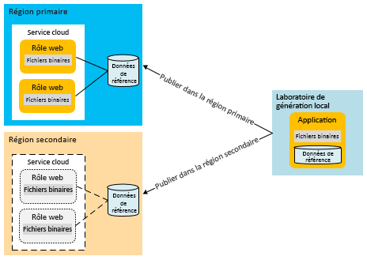
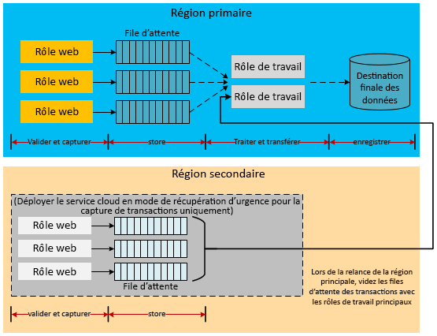
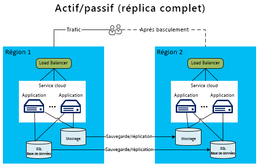

# Récupération d’urgence des applications Microsoft Azure

La récupération d’urgence (DR) se concentre sur la récupération des fonctionnalités des applications en cas de perte catastrophique. Par exemple, si une région Azure hébergeant votre application devient indisponible, vous avez besoin d’un plan pour exécuter votre application ou accéder à vos données dans une autre région.

Les chefs d’entreprises et les propriétaires de technologie doivent déterminer les fonctionnalités requises en cas d’incident. Le niveau de fonctionnalité peut prendre plusieurs formes : complètement indisponible, partiellement disponible (fonctionnalité réduite ou traitement différé) ou entièrement disponible.

Les stratégies de résilience et de haute disponibilité sont conçues pour gérer les conditions de défaillance temporaire.  La mise en œuvre de ce plan implique des personnes, des processus et la prise en charge d’applications permettant au système de continuer à fonctionner. Pour être parfaitement fiable, votre plan doit inclure une préparation aux conditions de panne et des essais de récupération des bases de données.

## Fonctionnalités de la récupération d’urgence Azure

Comme pour les considérations relatives à la disponibilité, Azure fournit un [Guide technique de la résilience](./index.md), conçu pour prendre en charge la récupération d’urgence. Il existe également une relation entre les fonctionnalités de disponibilité d’Azure et la récupération d’urgence. Par exemple, la gestion des rôles sur les domaines d’erreur augmente la disponibilité d’une application. Sans cette gestion, une défaillance matérielle non gérée deviendrait un scénario « catastrophe ». Tirer parti de ces stratégies et fonctionnalités de disponibilité fait partie intégrante de la protection de votre application contre les situations d’urgence. Toutefois, cet article va au-delà des problèmes de disponibilité générale pour traiter des événements d’urgence plus graves (et plus rares).

## Plusieurs régions contenant des centres de données

Azure exploite des centres de données dans plusieurs régions à l’échelle internationale. Cette infrastructure prend en charge plusieurs scénarios de récupération d’urgence, tels que la géoréplication du stockage Azure vers des régions secondaires, fournie par le système. Vous pouvez également déployer un service cloud vers de nombreux emplacements dans le monde entier facilement et de manière économique. Comparez cela au coût et à la difficulté que représente la création et la maintenance de vos propres centres de données dans plusieurs régions différentes. Le déploiement de services et de données dans plusieurs régions contribue à protéger votre application contre une panne majeure survenant dans une seule région. Lorsque vous concevez votre plan de récupération d’urgence, il est important de comprendre le concept des régions jumelées. Pour plus d’informations, consultez l’article [Continuité des activités et récupération d’urgence (BCDR) : régions jumelées d’Azure](/azure/best-practices-availability-paired-regions).

## Azure Site Recovery

[Azure Site Recovery](/azure/site-recovery/) fournit un moyen simple de répliquer des machines virtuelles Azure d’une région à une autre. Il a une charge de gestion minimale, car vous n’avez pas besoin de provisionner des ressources supplémentaires dans la région secondaire. Quand vous activez la réplication, Site Recovery crée automatiquement les ressources nécessaires dans la région cible en fonction des paramètres de la machine virtuelle source. Il fournit une réplication continue automatisée et vous permet d’effectuer le basculement d’application avec un seul clic. Vous pouvez effectuer des exercices de récupération d’urgence avec des tests de basculement, sans effet sur vos charges de travail de production ni la réplication continue.

## Azure Traffic Manager

En cas de défaillance spécifique à une région, vous devez rediriger le trafic vers les services ou les déploiements dans une autre région. Il est préférable de gérer cette situation via des services tels qu’Azure Traffic Manager, qui automatise le basculement du trafic utilisateur en cas de défaillance dans la région principale. La compréhension des principes de base de Traffic Manager est essentielle pour concevoir une stratégie efficace de récupération d’urgence.

Traffic Manager utilise le DNS (Domain Name System) pour diriger les requêtes des clients vers le point de terminaison approprié en fonction de la méthode de routage du trafic et de l’intégrité des points de terminaison. Dans le diagramme suivant, les utilisateurs se connectent à une URL Traffic Manager (`http://myATMURL.trafficmanager.net`) qui extrait les URL réelles des sites (`http://app1URL.cloudapp.net` et `http://app2URL.cloudapp.net`). Les requêtes des utilisateurs sont acheminées vers l’URL sous-jacente appropriée en fonction de la [méthode de routage Traffic Manager](/azure/traffic-manager/traffic-manager-routing-methods) configurée. Dans cet article, nous traiterons uniquement l’option de basculement.

Lorsque vous configurez Traffic Manager, vous fournissez un nouveau préfixe DNS Traffic Manager qui sera utilisé par les utilisateurs pour accéder à votre service. Traffic Manager extrait à présent l’équilibrage de charge un niveau au-dessus du niveau régional. Le DNS Traffic Manager mappe vers un enregistrement CNAME pour tous les déploiements qu’il gère.

Dans Traffic Manager, vous spécifiez la liste prioritaire des déploiements vers lesquels les utilisateurs doivent être acheminés en cas de défaillance. Traffic Manager surveille les points de terminaison de déploiement. Si le déploiement principal devient indisponible, Traffic Manager achemine les utilisateurs vers le déploiement suivant sur la liste prioritaire.

Bien que Traffic Manager choisisse la destination pendant un basculement, c’est vous qui décidez si votre domaine de basculement doit être dormant ou actif lorsque vous n’êtes pas en mode de basculement (ce qui n’a aucun lien avec Traffic Manager). Traffic Manager détecte une défaillance du site principal et effectue la substitution vers le site de basculement, indépendamment du fait que ce site réponde aux demandes des utilisateurs ou non.

Pour plus d’informations sur le fonctionnement d’Azure Traffic Manager, consultez :

- [Vue d’ensemble de Traffic Manager](/azure/traffic-manager/traffic-manager-overview/)
- [Méthodes de routage de Traffic Manager](/azure/traffic-manager/traffic-manager-routing-methods)
- [Configurer la méthode de routage par basculement](/azure/traffic-manager/traffic-manager-configure-failover-routing-method/)

## Scénarios d’urgence Azure

Les sections suivantes abordent les différents types de scénarios d’urgence. Les interruptions de service à l’échelle régionale ne sont pas la seule cause des défaillances des applications. Les pannes peuvent aussi être liées à une mauvaise conception et à des erreurs d’administration. Il est important de prendre en compte les causes possibles d’une défaillance lors des phases de conception et de test de votre plan de récupération. Un plan efficace tire parti des fonctionnalités d’Azure et les complète avec les stratégies conçues pour l’application. La réponse choisie est déterminée par l’importance de l’application, l’objectif de point de récupération (RPO) et l’objectif de délai de récupération (RTO).

### Échec de l’application

Azure Traffic Manager gère automatiquement les défaillances résultant du logiciel de système d’exploitation ou du matériel sous-jacent dans la machine virtuelle hôte. Azure crée une nouvelle instance de rôle et l’ajoute au pool disponible. Si plusieurs instances de rôle sont déjà en cours d’exécution, Azure déplace le traitement vers les autres instances de rôle en cours d’exécution, tout en remplaçant le nœud défaillant.

Les erreurs graves d’applications ne sont pas toujours dues à une défaillance sous-jacente du matériel ou du système d’exploitation. L’application peut échouer en raison d’exceptions graves provoquées par une logique incorrecte ou des problèmes d’intégrité des données. Vous devez inclure suffisamment de télémétrie dans le code de l’application pour qu’un système de surveillance puisse détecter les conditions d’échec et en informer un administrateur d’application. Un administrateur ayant une parfaite connaissance des processus de récupération d’urgence peut décider s’il faut déclencher un processus de basculement ou accepter un manque de disponibilité pendant la résolution des erreurs critiques.

### Corruption des données

Azure stocke automatiquement les données de la base de données SQL Azure et du stockage Azure trois fois de manière redondante dans différents domaines d’erreur de la même région. Si vous utilisez la géoréplication, les données sont stockées dans trois domaines supplémentaires dans une autre région. Toutefois, si vos utilisateurs ou votre application endommagent ces données dans la copie principale, celles-ci sont rapidement répliquées dans les autres copies. Malheureusement, cela a pour résultat plusieurs copies de données endommagées.

Vous disposez de deux options pour gérer l’altération potentielle de vos données. Vous pouvez d’abord gérer une stratégie de sauvegarde personnalisée. Vous pouvez stocker vos sauvegardes dans Azure ou localement selon les besoins de votre entreprise ou la réglementation en matière de gouvernance. Une autre option consiste à utiliser l’option de limite de restauration dans le temps pour récupérer une base de données SQL. Pour plus d’informations, consultez la section consacrée aux [stratégies de données pour une récupération d’urgence](#data-strategies-for-disaster-recovery) ci-dessous.

### Panne du réseau

Lorsque certaines parties du réseau Azure sont inaccessibles, vous ne pouvez pas toujours accéder à votre application ou à vos données. Si une ou plusieurs instances de rôle ne sont pas disponibles en raison de problèmes de réseau, Azure utilise les autres instances disponibles de votre application. Si votre application ne peut pas accéder à ses données en raison d’une panne du réseau Azure, vous pouvez éventuellement l’exécuter avec des fonctionnalités réduites en local à l’aide des données mises en cache. Vous devez concevoir la stratégie de récupération d’urgence de manière à exécuter l’application avec des fonctionnalités réduites. Pour certaines applications, cela peut se révéler peu pratique.

Une autre option consiste à stocker des données à un autre emplacement jusqu’au rétablissement de la connectivité. Si la réduction des fonctionnalités n’est pas une option, il vous reste les interruptions de service ou le basculement vers une autre région. La conception d’une application s’exécutant avec des fonctionnalités réduites relève aussi bien d’une décision économique que technique. Ce sujet est abordé plus en détail dans la section [Fonctionnalités réduites des applications](#reduced-application-functionality).

### Échec d’un service dépendant

Azure fournit plusieurs services pouvant rencontrer des temps d’arrêt périodiques. Par exemple, [Cache Redis Azure](https://azure.microsoft.com/services/cache/) est un service mutualisé qui fournit des fonctionnalités de mise en cache à votre application. Il est important de savoir ce qui se passe dans votre application en cas d’indisponibilité du service dépendant. Ce scénario est assez semblable au scénario de panne du réseau. Toutefois, le fait de considérer chaque service de manière indépendante favorise les améliorations potentielles de votre plan global.

Le Cache Redis Azure permet la mise en cache de votre application à partir de votre déploiement de service cloud, ce qui facilite la récupération d’urgence. Le service s’exécute désormais sur des rôles propres à votre déploiement. Par conséquent, vous pouvez mieux surveiller et gérer l’état du cache dans le cadre de votre processus de gestion globale pour le service cloud. Ce type de mise en cache expose également de nouvelles fonctionnalités telles que la haute disponibilité des données mises en cache, qui permet de les conserver en cas de défaillance d’un nœud en conservant des copies dupliquées sur d’autres nœuds.

Notez que la haute disponibilité diminue le débit et augmente la latence car les opérations d’écriture doivent également mettre à jour les copies secondaires. La quantité de mémoire requise pour stocker les données mises en cache est multipliée par deux. Vous devez prendre cela en compte lors de la planification de capacité.  Cet exemple montre que chaque service dépendant peut présenter des fonctionnalités pouvant améliorer votre disponibilité globale et la résistance aux défaillances catastrophiques.

Vous devez comprendre les conséquences d’une interruption de service pour chaque service dépendant. Dans l’exemple de mise en cache, il est parfois possible d’accéder aux données directement à partir d’une base de données jusqu’à ce que vous restauriez votre cache. Cela diminue les performances, mais vous fournit un accès complet aux données d’application.

### Interruption du service à l’échelle régionale

Les échecs précédents étaient principalement des défaillances pouvant être gérées au sein de la même région Azure. Toutefois, vous devez également prévoir l’éventualité d’une interruption du service dans l’ensemble de la région. Le cas échéant, les copies localement redondantes de vos données ne sont pas disponibles. Si vous avez activé la géoréplication, trois copies supplémentaires de vos tables et objets blob sont stockées dans une autre région. Si Microsoft déclare la région comme étant perdue, Azure remappe toutes les entrées DNS vers la région géorépliquée.

> [!NOTE]
> N’oubliez pas que vous n’avez aucun contrôle sur ce processus et qu’il ne se produit que pour les interruptions du service au niveau régional. Envisagez d’utiliser [Azure Site Recovery](/azure/site-recovery/) pour obtenir de meilleurs RPO et RTO. Site Recovery permet à l’application de décider si une indisponibilité est acceptable ou si elle doit basculer vers les machines virtuelles répliquées.

### Interruption du service dans l’ensemble des régions Azure

Vous devez prendre en compte l’ensemble des scénarios catastrophe lors de la planification d’urgence. L’une des interruptions de service les plus graves impliquerait l’interruption simultanée de toutes les régions Azure. Comme pour les autres interruptions de service, vous pouvez alors décider d’accepter le risque d’un arrêt temporaire. Les interruptions de service importantes, couvrant des régions entières, sont beaucoup plus rares que les interruptions de service isolées impliquant des services dépendants ou des régions uniques.

Cependant, vous pouvez décider que certaines applications critiques nécessitent un plan de sauvegarde pour une interruption de service multirégion. Le plan peut comprendre le basculement vers des services dans un [cloud alternatif](#alternative-cloud) ou une [solution hybride locale et cloud](#hybrid-on-premises-and-cloud-solution).

### Fonctionnalités réduites des applications

Une application bien conçue utilise généralement des services qui communiquent entre eux via l’implémentation de modèles d’échange d’informations faiblement couplés. Une application prenant en charge la récupération d’urgence nécessite la séparation des responsabilités au niveau du service. Cela évite qu’une interruption de service dépendant ne provoque l’arrêt de l’application. Par exemple, les modules suivants peuvent composer une application de commerce en ligne pour la société Y :

- **Catalogue de produits** permet aux utilisateurs de parcourir les produits.
- **Panier** permet aux utilisateurs d’ajouter/supprimer des produits dans leur panier.
- **État de la commande** affiche le statut d’expédition des commandes des utilisateurs.
- **Finalisation de la commande** finalise la session d’achat par la soumission de la commande avec le paiement.
- **Traitement des commandes** valide la commande pour l’intégrité des données et contrôle les stocks.

Quand une dépendance de service dans cette application n’est plus disponible, comment le service fonctionne-t-il jusqu'à la récupération de la dépendance ? Un système bien conçu implémente des limites d’isolement en séparant les responsabilités lors de la conception et de l’exécution. Vous pouvez classer chaque erreur comme étant récupérable ou non récupérable. Les erreurs non récupérables provoqueront l’arrêt du service tandis que les erreurs récupérables peuvent être atténuées par le biais d’autres solutions. Certains problèmes résolus par la gestion automatique des erreurs et la mise en œuvre d’autres mesures sont transparentes pour l’utilisateur. En cas d’une interruption de service plus sérieuse, l’application peut s’en trouver totalement indisponible. La troisième option consiste à continuer à gérer les requêtes des utilisateurs avec des fonctionnalités réduites.

Par exemple, si la base de données pour l’hébergement des commandes tombe en panne, le service de traitement des commandes perd sa capacité à traiter les transactions commerciales. Selon l’architecture, il peut être difficile, voire impossible pour les services de finalisation des commandes et de traitement des commandes de continuer à fonctionner. Si l’application n’est pas conçue pour gérer ce type de scénario, cette dernière pourrait se déconnecter entièrement. Cependant, si les données des produits sont stockées dans un autre emplacement, le module Catalogue de produits peut toujours être utilisé pour afficher les produits. Les autres composants de l’application sont toutefois indisponibles, tels que les commandes ou le contrôle des stocks.

Le choix des fonctionnalités réduites des applications mises à disposition est le fruit de décisions économiques et techniques. Vous devez décider comment l’application va informer les utilisateurs des problèmes temporaires. Dans l’exemple ci-dessus, l’application peut autoriser l’affichage des produits et leur ajout au panier. Cependant, lorsque l’utilisateur tente d’effectuer un achat, l’application l’informe que la fonctionnalité de commande est temporairement inaccessible. Ce n’est pas idéal pour le client, mais permet d’éviter une interruption de service de l’application dans son intégralité.

## stratégies de données pour une récupération d’urgence

La gestion appropriée des données est un aspect clé de tout plan de récupération d’urgence. Pendant le processus de récupération, la restauration des données est ce qui prend généralement le plus de temps. Des choix différents quant à la réduction des fonctionnalités entraînent des défis difficiles à relever en matière de récupération et de cohérence des données suite à une défaillance.

Le besoin de restaurer ou de conserver une copie des données de l’application est un facteur à prendre en compte. Vous utiliserez ces données à des fins référentielles et transactionnelles sur un site secondaire. Un déploiement local requiert un processus de planification long et coûteux afin d’implémenter une stratégie de récupération d’urgence dans plusieurs régions. Heureusement, la plupart des fournisseurs cloud, notamment Azure, permettent le déploiement d’applications dans plusieurs régions. La répartition géographique de ces régions minimise l’interruption de service dans plusieurs régions. La stratégie de gestion des données entre les régions est l’un des facteurs décisifs pour la réussite d’un plan de récupération d’urgence.

Les sections suivantes décrivent les techniques de récupération d’urgence liées aux sauvegardes de données, aux données de référence et aux données transactionnelles.

### Sauvegarde et restauration

Des sauvegardes régulières des données d’application peuvent prendre en charge certains scénarios de récupération d’urgence. Les différentes ressources de stockage nécessitent des techniques différentes.

#### Base de données SQL

Pour les niveaux de base, Standard et Premium de la base de données SQL, vous pouvez tirer parti de la limite de restauration dans le temps pour récupérer votre base de données. Pour plus d’informations, consultez [Vue d’ensemble : continuité de l’activité cloud et reprise d’activité après sinistre d’une base de données avec SQL Database](/azure/sql-database/sql-database-business-continuity/). Une autre option consiste à utiliser la géoréplication active pour la base de données SQL. Celle-ci réplique automatiquement les modifications de base de données sur les bases de données secondaires dans la même région Azure, voire dans une région différente. Cela représente une alternative possible à certaines techniques de synchronisation de données plus manuelles, présentées dans cet article. Pour plus d’informations, consultez [Vue d’ensemble : Géoréplication active de base de données SQL](/azure/sql-database/sql-database-geo-replication-overview/).

Vous pouvez également avoir recours à une approche plus manuelle pour la sauvegarde et la restauration. Utilisez la commande DATABASE COPY pour créer une copie de sauvegarde de la base de données avec une cohérence transactionnelle. Vous pouvez également utiliser le service d’importation/exportation d’Azure SQL Database, qui prend en charge l’exportation des bases de données dans des fichiers BACPAC (fichiers compressés contenant votre schéma de base de données et les données associées) qui sont stockés dans le stockage Blob Azure.

La redondance intégrée d’Azure Storage crée deux réplicas du fichier de sauvegarde dans la même région. Toutefois, la fréquence d’exécution du processus de sauvegarde détermine votre RPO, c’est-à-dire la quantité de données que vous risquez de perdre dans les scénarios d’urgence. Par exemple, imaginez que vous effectuez une sauvegarde toutes les heures et qu’un incident survient deux minutes avant la nouvelle sauvegarde. Vous perdez ainsi 58 minutes de données enregistrées depuis la dernière sauvegarde. En outre, pour vous protéger contre une interruption de service à l’échelle régionale, vous devez copier les fichiers BACPAC vers une autre région. Vous avez ensuite la possibilité de restaurer ces sauvegardes dans l’autre région. Pour plus d’informations, consultez [Vue d’ensemble : continuité de l’activité cloud et reprise d’activité après sinistre d’une base de données avec SQL Database](/azure/sql-database/sql-database-business-continuity/).

#### SQL Data Warehouse

Pour SQL Data Warehouse, utilisez les [géosauvegardes](/azure/sql-data-warehouse/backup-and-restore#geo-backups) pour restaurer vers une région associée pour la récupération d’urgence. Ces sauvegardes sont effectuées toutes les 24 heures et peuvent être restaurées en l’espace de 20 minutes dans la région associée. Cette fonctionnalité est activée par défaut pour tous les entrepôts de données SQL Data Warehouse. Pour plus d’informations sur la restauration de votre entrepôt de données, consultez [Restaurer à partir d’un région géographique Azure à l’aide de PowerShell](/azure/sql-data-warehouse/sql-data-warehouse-restore#restore-from-an-azure-geographical-region-using-powershell).

#### Stockage Azure

Pour le stockage Azure, vous pouvez développer un processus de sauvegarde personnalisé ou utiliser l’un des nombreux outils de sauvegarde tiers. Notez que la plupart des conceptions d’applications comportent des complexités supplémentaires dans la mesure où les ressources de stockage se référencent mutuellement. Prenez l’exemple d’une base de données SQL comportant une colonne liée à un objet blob dans Azure Storage. Si les sauvegardes ne sont pas effectuées simultanément, cela peut être dû à l’absence de sauvegarde du pointeur vers un objet blob de la base de données avant la défaillance. L’application ou le plan de récupération d’urgence doit implémenter des processus pour gérer cette incohérence une fois la récupération effectuée.

#### Autres plateformes de données

D’autres plateformes de données IaaS (Infrastructure-as-a-Service) hébergées, telles que Elasticsearch ou MongoDB, ont leurs propres fonctionnalités et particularités à prendre en compte lors de la création d’un processus intégré de sauvegarde et de restauration. Pour ces plateformes de données, la recommandation générale est d’utiliser des fonctionnalités de réplication ou de réalisation de captures instantanées basées sur l’intégration, natives ou disponibles. Si ces fonctionnalités n’existent pas ou ne conviennent pas, vous pouvez éventuellement utiliser le Service de sauvegarde Azure ou les captures instantanées de disques managés/non managés pour créer une copie ponctuelle des données d’application. Dans tous les cas, il est important de déterminer comment effectuer des sauvegardes cohérentes, en particulier lorsque les données d’application sont réparties sur plusieurs systèmes de fichiers, ou lorsque plusieurs lecteurs sont combinés en un seul système de fichiers à l’aide de gestionnaires de volumes ou de systèmes RAID logiciels.

### Modèle de données de référence pour la récupération d’urgence

Les données de référence sont des données en lecture seule qui prennent en charge les fonctionnalités de l’application. Celles-ci ne changent pas souvent. La sauvegarde et restauration constitue l’une des méthodes pour gérer des interruptions de service à l’échelle régionale ; cependant, l’objectif de délai de récupération (RTO) est relativement long. Lorsque vous déployez l’application vers une région secondaire, certaines stratégies peuvent améliorer le RTO pour les données de référence.

Étant donné que les données de référence ne changent pas souvent, vous pouvez améliorer le RTO en conservant une copie permanente des données de référence dans la région secondaire. Cela élimine le temps nécessaire à la restauration des sauvegardes en cas de sinistre. Pour répondre aux exigences en matière de récupération d’urgence dans plusieurs régions, vous devez déployer l’application et les données de référence ensemble dans plusieurs régions. Vous pouvez déployer des données de référence vers le rôle lui-même, le stockage externe ou une combinaison des deux.

Le modèle de déploiement des données de référence au sein des nœuds de calcul répond implicitement aux exigences de récupération d’urgence. Le déploiement des données de référence vers la base de données SQL requiert le déploiement d’une copie de ces données vers chaque région. La même stratégie s’applique à Azure Storage. Vous devez déployer une copie de toutes les données de référence stockées dans Azure Storage vers les régions primaires et secondaires.

Vous devez implémenter vos routines de sauvegarde propres à l’application pour l’ensemble de vos données, y compris les données de référence. Les copies géorépliquées entre les régions ne sont utilisées qu’en cas d’interruption de service à l’échelle régionale. Pour éviter des temps d’arrêt prolongés, déployez les parties critiques des données de l’application vers la région secondaire. Pour obtenir un exemple de cette topologie, consultez le [modèle actif/passif](#active-passive).

### Modèle de données transactionnelles pour la récupération d’urgence

L’implémentation d’une stratégie de récupération d’urgence pleinement opérationnelle nécessite la réplication asynchrone des données transactionnelles vers la région secondaire. Les fenêtres temporelles pratiques dans lesquelles la réplication peut se produire déterminent les caractéristiques du RPO de l’application. Vous pourrez peut-être récupérer les données perdues de la région primaire pendant la durée de réplication. Vous serez peut-être également en mesure de fusionner avec la région secondaire ultérieurement.

Les exemples suivants d’architecture donnent quelques idées sur les différentes façons de gérer les données transactionnelles dans un scénario de basculement. Veuillez noter que ces exemples ne sont pas exhaustifs. Par exemple, les emplacements de stockage intermédiaires, tels que des files d’attente, peuvent être remplacés par la base de données SQL Azure. Ces files d’attente peuvent être issues du stockage Azure ou d’Azure Service Bus ; consultez la page [Files d’attente Azure et files d’attente Service Bus : comparaison et différences](/azure/service-bus-messaging/service-bus-azure-and-service-bus-queues-compared-contrasted/). Les destinations de stockage serveur peuvent également varier (par exemple, des tables Azure au lieu de la base de données SQL). En outre, des rôles de travail peuvent être insérés en tant qu’intermédiaires lors des différentes étapes. L’objectif n’est pas d’émuler ces architectures au détail près, mais d’envisager différentes solutions de récupération des données transactionnelles et des modules associés.

#### Réplication des données transactionnelles en vue d’une récupération d’urgence

Considérez une application qui utilise des files d’attente Azure Storage pour stocker les données transactionnelles. Cela permet aux rôles de travail de traiter les données transactionnelles dans la base de données de serveur dans une architecture découplée. Cela requiert l’utilisation d’un type de mise en cache temporaire par les transactions si les rôles frontaux nécessitent l’interrogation immédiate de ces données. Selon le niveau de tolérance de perte de données, vous pouvez choisir de répliquer les files d’attente, la base de données ou l’ensemble des ressources de stockage. Si vous utilisez uniquement la réplication de base de données lorsque la région primaire échoue, vous pouvez toujours récupérer les données présentes dans les files d’attente lorsque la région primaire revient en ligne.

Le schéma suivant illustre une architecture dans laquelle la base de données du serveur est synchronisée entre les régions.

Le plus gros défi que pose l’implémentation de cette architecture est la stratégie de réplication entre les régions. Le service de [Azure SQL Data Sync](/azure/sql-database/sql-database-get-started-sql-data-sync/) active ce type de réplication. Au moment où cet article est rédigé, il n’existe qu’une version préliminaire de ce service et il n’est pas encore recommandé de l’utiliser pour les environnements de production. Pour plus d’informations, consultez [Vue d’ensemble : continuité de l’activité cloud et reprise d’activité après sinistre d’une base de données avec SQL Database](/azure/sql-database/sql-database-business-continuity/). Pour les applications de production, vous devez acheter une solution tierce ou créer votre propre logique de réplication dans le code. Selon l’architecture, la réplication peut être bidirectionnelle (plus complexe).

L’une des implémentations possibles serait d’utiliser la file d’attente intermédiaire de l’exemple précédent. Le rôle de travail qui traite les données vers la destination de stockage définitive peut apporter la modification dans la région primaire et secondaire. Ces tâches sont importantes ; cet article n’aborde cependant pas de manière détaillée la question du code de réplication. Prenez suffisamment de temps pour concevoir et tester votre approche de la réplication des données dans la région secondaire. Des traitements et des tests supplémentaires peuvent vous permettre de vous assurer que les processus de récupération et de basculement gèrent correctement les incohérences des données ou les transactions en double.

> [!NOTE]
> La majeure partie de ce document porte sur la fonctionnalité PaaS (Platform as a Service). Cependant, d’autres options de réplication et de disponibilité pour les applications hybrides utilisent des machines virtuelles Azure. Ces applications hybrides utilisent la fonctionnalité IaaS (Infrastructure as a Service) pour héberger SQL Server sur des machines virtuelles dans Azure. Cela permet d’avoir des approches de disponibilité traditionnelles dans SQL Server, telles que les groupes de disponibilité AlwaysOn ou la copie des journaux de transaction. Certaines techniques, telles que AlwaysOn, fonctionnent uniquement entre les machines virtuelles Azure et les instances SQL Server. Pour plus d’informations, consultez [Haute disponibilité et récupération d’urgence pour SQL Server dans Azure Virtual Machines](/azure/virtual-machines/windows/sql/virtual-machines-windows-sql-high-availability-dr/).

#### Fonctionnalités réduites des applications pour la capture des transactions

Considérez une deuxième architecture fonctionnant avec des fonctionnalités réduites. L’application de la région secondaire désactive toutes les fonctionnalités, telles que la création de comptes rendus, la Business Intelligence (BI) ou le traitement des files d’attente. Elle accepte uniquement les types de flux de travail les plus importants, tels que définis par les besoins de l’entreprise. Le système capture les transactions et les écrit dans les files d’attente. Le système peut différer le traitement des données lors de la phase initiale de l’interruption de service. Si le système de la région primaire est réactivé dans l’intervalle de temps attendu, les rôles de travail peuvent traiter les files d’attente dans la région primaire. Ce processus élimine la nécessité de fusionner les bases de données. Si l’interruption de service de la région primaire dépasse la fenêtre de temps acceptable, l’application peut commencer à traiter les files d’attente.

Dans ce scénario, la base de données de la région secondaire contient des données transactionnelles incrémentielles qui doivent être fusionnées après la réactivation de la région primaire. Le schéma suivant illustre cette stratégie pour le stockage temporaire des données transactionnelles, jusqu’à la restauration de la région primaire.

Pour plus d’informations sur les techniques de gestion des données des applications Azure résilientes, consultez [Failsafe: Guidance for Resilient Cloud Architectures](https://channel9.msdn.com/Series/FailSafe).

## Topologies de déploiement pour la récupération d’urgence

Vous devez préparer les applications critiques à gérer une interruption de service à l’échelle régionale. Incorporez à la planification opérationnelle une stratégie de déploiement de plusieurs régions.

Les déploiements multirégions peuvent impliquer la publication de l’application et des données de référence par des processus informatiques vers la région secondaire suite à un incident. Si l’application requiert un basculement instantané, le processus de déploiement peut comprendre une configuration en mode actif/passif ou en mode actif/actif. Pour ce type de déploiement, des instances existantes de l’application s’exécutent dans l’autre région. Un service de routage tel qu’Azure Traffic Manager fournit des services d’équilibrage de charge au niveau du DNS. Il peut détecter des interruptions de service et router les utilisateurs vers différentes régions lorsque cela s’avère nécessaire.

Une récupération d’urgence Azure efficace implique d’intégrer cette récupération dans la solution dès le début. Le cloud propose des options supplémentaires pour la récupération des données lors d’un incident ; celles-ci ne sont pas proposées par un fournisseur d’hébergement traditionnel. Plus précisément, vous pouvez allouer des ressources dans une autre région de façon dynamique et rapide, en évitant le coût des ressources inactives, avant une défaillance.

Les sections suivantes abordent différentes topologies de déploiement pour la récupération d’urgence. En règle générale, il existe un compromis entre l’augmentation des coûts ou la complexité liée à une disponibilité accrue.

### Déploiement dans une seule région

Un déploiement dans une seule région ne constitue pas réellement une topologie de récupération d’urgence, mais sert plutôt à créer un contraste avec les autres architectures. Les déploiements monorégion des applications dans Azure sont courants. Toutefois, ils ne sont pas conformes aux exigences d’une topologie de récupération d’urgence.

Le diagramme suivant illustre une application exécutée dans une seule région Azure. Azure Traffic Manager et l’utilisation des domaines d’erreur et de mise à niveau augmentent la disponibilité de l’application dans la région.

Dans ce scénario, la base de données constitue un point de défaillance unique. Bien qu’Azure réplique les données dans différents domaines d’erreur vers des réplicas internes, la réplication se produit uniquement dans la même région. L’application ne peut pas résister aux pannes catastrophiques. Si la région devient indisponible, il en est de même pour les domaines d’erreur, ce qui inclut toutes les instances de service et les ressources de stockage.

Pour toutes les applications les moins critiques, vous devez concevoir un plan pour déployer vos applications dans plusieurs régions. Vous devez également considérer le RTO et les contraintes de coût lorsque vous décidez quelle topologie de déploiement utiliser.

Examinons à présent les approches spécifiques pour prendre en charge le basculement entre les différentes régions. Ces exemples utilisent tous deux régions pour décrire le processus.

### Basculement à l’aide d’Azure Site Recovery

Lorsque vous activez la réplication de machine virtuelle Azure à l’aide d’Azure Site Recovery, le programme crée plusieurs ressources dans la région secondaire :

- Groupe de ressources.
- Réseau virtuel (VNet).
- Compte de stockage.
- Groupes à haute disponibilité pour contenir les machines virtuelles après le basculement.

Les écritures de données sur les disques de machine virtuelle de la région primaire sont transférées en continu vers le compte de stockage dans la région secondaire. Des points de récupération sont générés dans le compte de stockage cible à intervalles de quelques minutes. Lorsque vous démarrez un basculement, les machines virtuelles récupérées sont créées dans le groupe de ressources cible, le réseau virtuel cible et le groupe à haute disponibilité cible. Lors d’un basculement, vous pouvez choisir n’importe quel point de récupération disponible.

### Redéploiement vers une région Azure secondaire

Dans l’approche de redéploiement vers une région secondaire, seule la région primaire contient des applications et des bases de données en cours d’exécution. La région secondaire n’est pas configurée pour un basculement automatique. Par conséquent, en cas d’incident, vous devez activer toutes les parties du service dans la nouvelle région. Cela inclut le chargement d’un service cloud sur Azure, le déploiement du service cloud, la restauration des données et la modification du DNS afin de rerouter le trafic.

Bien que cette option soit la plus abordable des options couvrant plusieurs régions, elle présente les caractéristiques RTO les moins avantageuses. Dans ce modèle, les sauvegardes de base de données et de packages de service sont stockées localement ou dans l’instance du stockage d’objets blob Azure de la région secondaire. Toutefois, vous devez déployer un nouveau service et restaurer les données avant la reprise des opérations du modèle. Même si vous automatisez entièrement le transfert de données du stockage de sauvegarde, le déploiement d’un nouvel environnement de base de données est très chronophage. Le déplacement des données à partir du stockage de sauvegarde sur disque vers la base de données vide de la région secondaire constitue la partie la plus coûteuse du processus de restauration. Cette opération est cependant nécessaire pour que la nouvelle base de données puisse fonctionner, cette dernière n’étant pas répliquée.

La meilleure approche consiste à stocker les packages de service dans le stockage d’objets blob de la région secondaire. Cela élimine la nécessité de charger le package vers Azure ; c’est ce qui se produit lorsqu’un déploiement est effectué à partir d’un ordinateur de développement local. À l’aide des scripts PowerShell, vous pouvez rapidement déployer les packages de service vers un nouveau service cloud à partir d’un stockage d’objets blob.

Cette option est seulement pratique pour les applications non critiques pouvant tolérer un RTO élevé. Cela peut, par exemple, fonctionner pour une application pouvant être arrêtée plusieurs heures, mais qui doit être à nouveau disponible dans les 24 heures.

### Actif/Passif

La topologie actif/passif a été adoptée par de nombreuses sociétés. Elle apporte des améliorations au RTO, avec une augmentation relativement faible du coût par rapport à l’approche de redéploiement. Dans ce scénario, des régions Azure primaire et secondaire sont de nouveau présentes. Tout le trafic est acheminé vers le déploiement actif de la région primaire. La région secondaire est mieux préparée pour la récupération d’urgence, car la base de données s’exécute dans les deux régions. En outre, un mécanisme de synchronisation est mis en place entre les deux régions. Cette approche de secours comprend deux variantes : une approche basée uniquement sur la base de données ou un déploiement complet dans la région secondaire.

#### Base de données uniquement

Dans la première variante de la topologie actif/passif, seule la région primaire contient une application de service cloud déployée. Toutefois, contrairement à l’approche de redéploiement, les deux régions sont synchronisées avec les contenus de la base de données. (Pour plus d’informations, consultez la section consacrée au [modèle de données transactionnel pour une récupération d’urgence](#transactional-data-pattern-for-disaster-recovery).) En cas d’incident, les exigences d’activation sont réduites. Vous démarrez l’application dans la région secondaire, modifiez les chaînes de connexion à la nouvelle base de données et modifiez les entrées DNS afin de rerouter le trafic.

Comme pour l’approche de redéploiement, vous devez déjà avoir stocké les packages de service dans le stockage d’objets blob Azure dans la région secondaire pour un déploiement plus rapide. Cependant, vous échappez à la majorité du traitement que nécessite l’opération de restauration de base de données, car la base de données est prête et en cours d’exécution. Cette approche permet de gagner beaucoup de temps, ce qui en fait une solution de récupération d’urgence économique (et aussi majoritairement utilisée).

#### Réplica complet

Dans la deuxième variante de la topologie actif/passif, la région primaire et la région secondaire connaissent un déploiement complet. Ce déploiement inclut les services cloud et une base de données synchronisée. Toutefois, seule la région primaire traite activement les requêtes réseau des utilisateurs. La région secondaire devient active uniquement lorsque la région primaire subit une interruption de service. Dans ce cas, toutes les nouvelles requêtes réseau effectuent le routage vers la région secondaire. Azure Traffic Manager gère automatiquement ce basculement.

Le basculement se produit plus rapidement que dans la variante contenant uniquement la base de données, les services étant déjà déployés. Cette topologie fournit un objectif de délai de récupération (RTO) très faible. La région de basculement secondaire doit être opérationnelle dès que la région primaire rencontre une défaillance.

En plus d’assurer un temps de réponse plus rapide, cette topologie pré-alloue et déploie des services de sauvegarde, évitant le risque d’un manque d’espace pour allouer de nouvelles instances lors d’un incident. C’est un élément important si votre région Azure secondaire est proche de sa capacité maximale. Aucun contrat de niveau de service (SLA) ne garantit que vous pouvez déployer instantanément un ou plusieurs nouveaux services cloud dans n’importe quelle région.

Pour obtenir un temps de réponse optimal avec ce modèle, vous devez disposer d’une échelle semblable (nombre d’instances de rôle) dans les régions primaires et secondaires. Malgré les avantages, le fait de payer pour des instances de calcul inutilisées se révèle coûteux ; cela peut ne pas être le meilleur choix d’un point de vue financier. Pour cette raison, il est plus courant d’utiliser une version des services cloud dont la puissance a été légèrement réduite dans la région secondaire. Vous pouvez ensuite rapidement faire basculer et monter en charge le déploiement secondaire, si nécessaire. Vous devriez automatiser le processus de basculement afin de pouvoir activer des instances supplémentaires, selon la charge, lorsque la région primaire devient inaccessible. Cela peut impliquer l’utilisation d’un mécanisme de mise à l’échelle automatique, tel que des [groupes de machines virtuelles identiques](/azure/virtual-machine-scale-sets/virtual-machine-scale-sets-overview/).

Le schéma suivant présente un modèle dans lequel les régions primaires et secondaires contiennent un service cloud entièrement déployé selon une topologie actif/passif.

### Actif/actif

Dans une topologie actif/actif, les services cloud et la base de données sont entièrement déployés dans les deux régions. Contrairement au modèle actif/passif, les deux régions reçoivent le trafic utilisateur. Cette option réduit au minimum le temps de récupération. Les services ont déjà été mis à l’échelle pour gérer une partie de la charge dans chaque région. DNS est déjà activé pour une utilisation dans la région secondaire. La décision visant à router les utilisateurs vers la région appropriée présente des difficultés supplémentaires. La planification par tourniquet (round robin) pourrait se révéler une option. Il est plus probable que certains utilisateurs utilisent une région dans laquelle se trouve la copie principale de leurs données.

En cas de basculement, vous devez simplement désactiver DNS dans la région primaire. Ainsi, tout le trafic est acheminé vers la région secondaire.

Ce modèle présente également des variantes. Par exemple, le schéma suivant illustre une région primaire qui possède la copie principale de la base de données. Les services cloud des deux régions écrivent vers cette base de données primaire. Le déploiement secondaire peut effectuer la lecture à partir de la base de données primaire ou répliquée. Dans cet exemple, la réplication est unidirectionnelle.

L’architecture actif/actif du schéma précédent présente cependant un inconvénient. La deuxième région doit accéder à la base de données de la première région car cette dernière détient la copie principale. Les performances connaissent une forte baisse lorsque vous accédez à des données en dehors d’une région. Pour les appels de base de données entre les régions, vous devez envisager une stratégie de traitement par lots afin d’améliorer les performances de ces appels. Pour en savoir plus, consultez l’article [Comment utiliser le traitement par lots pour améliorer les performances des applications de base de données SQL](/azure/sql-database/sql-database-use-batching-to-improve-performance/).

Dans une autre architecture possible, chaque région peut directement accéder à sa propre base de données. Dans ce modèle, un type quelconque de réplication bidirectionnelle peut être nécessaire pour synchroniser les bases de données dans chaque région.

Avec les topologies précédentes, diminuer le RTO revient généralement à augmenter les coûts et la complexité. La topologie actif/actif diffère de ce modèle de coût. Dans la topologie actif/actif, la région primaire peut ne pas nécessiter autant d’instances que dans la topologie actif/passif. Si, dans une architecture actif/passif, 10 instances sont présentes dans la région primaire, une architecture actif/actif ne nécessiterait en revanche que 5 instances dans chaque région. Les deux régions partagent à présent la même charge. Cela peut représenter des économies d’argent par rapport à la topologie actif/passif si vous avez conservé une solution de secours actif pour la région passive, avec 10 instances en attente de basculement.

Sachez que, jusqu’à ce que vous restauriez la région primaire, la région secondaire peut connaître une hausse soudaine du nombre de nouveaux utilisateurs. Si chaque serveur accueille 10 000 utilisateurs au moment de l’interruption de service de la région primaire, la région secondaire doit soudain gérer 20 000 utilisateurs. Les règles de surveillance de la région secondaire doivent détecter cette hausse et donc doubler le nombre d’instances présentes dans la région secondaire. Pour plus d’informations à ce sujet, consultez la section [Détection des défaillances](#failure-detection).

## solutions hybrides en local et dans le cloud

Une stratégie supplémentaire de récupération d’urgence consiste à créer une application hybride qui s’exécute à la fois en local et dans le cloud. La région primaire peut se trouver à l’un des deux emplacements, selon l’application. Prenez l’exemple des architectures précédentes et imaginez la région primaire ou secondaire comme étant un emplacement local.

Ces architectures hybrides posent certains défis. Cet article a traité en grande partie des modèles d’architecture PaaS. Les applications PaaS classiques dans Azure s’appuient sur des constructions Azure spécifiques, telles que les rôles, les services cloud et Traffic Manager. La création d’une solution locale pour ce type d’application PaaS nécessiterait une architecture bien plus différente. Cela peut être dissuasif d’un point de vue financier ou administratif.

Cependant, une solution hybride de récupération d’urgence pose moins de défis que les architectures traditionnelles ayant été déplacées vers le cloud, comme les architectures IaaS. Les applications IaaS utilisent des machines virtuelles dans le cloud pouvant avoir des équivalents directs en local. Vous pouvez utiliser des réseaux virtuels pour connecter des machines virtuelles dans le cloud aux ressources du réseau local. Cela crée de nombreuses possibilités, inenvisageables avec les applications basées uniquement sur PaaS. Par exemple, SQL Server peut ainsi tirer parti de solutions de récupération d’urgence telles que les groupes de disponibilité AlwaysOn et la mise en miroir des bases de données. Pour en savoir plus, consultez [Haute disponibilité et récupération d’urgence pour SQL Server sur des machines virtuelles Azure](/azure/virtual-machines/windows/sql/virtual-machines-windows-sql-high-availability-dr/).

Les solutions IaaS fournissent également un moyen plus simple aux applications locales d’utiliser Azure comme option de basculement. Vous pourriez avoir une application entièrement fonctionnelle dans une région locale existante. Mais que se passe-t-il si vous ne disposez pas d’assez de ressources pour entretenir une région géographiquement distincte pour le basculement ? Vous pouvez décider d’utiliser des machines virtuelles et des réseaux virtuels pour exécuter votre application dans Azure. Dans ce cas, définissez des processus pouvant synchroniser des données vers le cloud. Le déploiement Azure devient ensuite la région secondaire à utiliser pour le basculement. La région primaire reste l’application en local. Pour plus d’informations sur les architectures et les fonctionnalités IaaS, consultez la [documentation sur les machines virtuelles](/azure/virtual-machines/).

## Autre cloud

Dans certaines situations, les fonctionnalités étendues de Microsoft Azure peuvent ne pas satisfaire aux règles de conformité internes ou aux stratégies exigées par votre organisation. Même la meilleure préparation et conception pour l’implémentation des systèmes de sauvegarde en cas d’incident n’est pas adaptée dans le cas où le fournisseur de service cloud rencontre une interruption généralisée du service.

Vous devez comparer les exigences en matière de disponibilité au coût et à la complexité que représente une disponibilité accrue. Effectuez une analyse des risques et définissez le RTO et le RPO pour votre solution. Si votre application ne peut tolérer aucun temps d’arrêt, vous devez peut-être envisager une autre solution cloud. À moins qu’Internet rencontre une panne générale, une autre solution cloud peut toujours être disponible si les services Azure tombent en panne dans le monde entier.

Comme pour le scénario hybride, les déploiements de basculement dans les architectures de récupération d’urgence précédentes peuvent également exister dans une autre solution cloud. D’autres sites de récupération d’urgence par cloud doivent être utilisés uniquement pour les solutions dont le RTO autorise peu de temps d’arrêt, voire aucun. Notez qu’une solution utilisant un site de récupération d’urgence en dehors d’Azure nécessite plus de travail pour la configuration, le développement, le déploiement ainsi que l’entretien. Il est également plus difficile d’implémenter des pratiques éprouvées dans une architecture intégrant plusieurs clouds. Bien que les plateformes cloud aient des concepts de haut niveau similaires, les API et les architectures sont différentes.

Si votre stratégie de récupération d’urgence s’appuie sur plusieurs plateformes cloud, il peut être intéressant d’inclure des couches d’abstraction dans la conception de la solution. Ainsi, vous n’aurez pas à développer et entretenir deux versions différentes de la même application pour différentes plateformes cloud en cas d’urgence. Comme pour le scénario hybride, l’utilisation de machines virtuelles Azure ou d’Azure Container Service peut s’avérer plus facile dans ce cas que l’utilisation des conceptions PaaS propres au cloud.

## Automatisation

Certains des modèles présentés nécessitent l’activation rapide des déploiements hors connexion, ainsi que la restauration d’éléments spécifiques d’un système. Les scripts d’automatisation peuvent activer des ressources à la demande et déployer des solutions rapidement. Les exemples ci-dessous d’automatisation associée à la récupération d’urgence utilisent [Azure PowerShell](https://msdn.microsoft.com/library/azure/jj156055.aspx), mais l’utilisation de [l’interface de ligne de commande Azure](https://docs.microsoft.com/cli/azure/get-started-with-azure-cli) ou de [l’API REST de gestion de service](https://msdn.microsoft.com/library/azure/ee460799.aspx) est également une bonne option.

Les scripts d’automatisation gèrent les aspects de la récupération d’urgence qui ne sont pas gérés de façon transparente par Azure. Ils produisent des résultats cohérents et reproductibles, minimisant l’erreur humaine. Les scripts de récupération d’urgence prédéfinis réduisent également le temps nécessaire pour reconstruire un système et ses composants lors d’un sinistre. Il n’est pas judicieux de rechercher manuellement des solutions pour restaurer votre site alors qu’il est hors connexion ; cela vous fait perdre de l’argent à chaque minute qui passe.

Testez vos scripts à plusieurs reprises, du début à la fin. Après avoir vérifié leurs fonctionnalités de base, testez-les en [simulant un incident](#disaster-simulation). Cela permet de détecter les erreurs dans les scripts ou les processus.

Une meilleure pratique de l’automation consiste à créer un référentiel de scripts PowerShell ou de scripts d’interface de ligne de commande (CLI) de récupération d’urgence Azure. Marquez-les et classez-les clairement pour y accéder rapidement. Désignez une personne principale pour gérer le référentiel et le contrôle de version des scripts. Documentez ces derniers de manière exhaustive avec des explications des paramètres et des exemples d’utilisation de script. Assurez-vous que cette documentation est synchronisée avec vos déploiements Azure. Cela souligne l’importance d’avoir une personne principale responsable de l’ensemble du référentiel.

## Détection des défaillances

Pour gérer correctement les problèmes liés à la disponibilité et à la récupération d’urgence, vous devez être en mesure de détecter et diagnostiquer les défaillances. Vous devez surveiller de manière étendue les serveurs et les déploiements afin de savoir rapidement si un système ou ses composants deviennent indisponibles. Les outils d’analyse qui évaluent l’intégrité globale du service cloud et de ses dépendances peuvent effectuer une partie de ce travail. L’outil Microsoft [System Center 2016](https://www.microsoft.com/cloud-platform/system-center) est approprié. Des outils tiers proposent également des fonctionnalités d’analyse. La plupart des solutions d’analyse suivent les principaux compteurs de performance et de disponibilité des services.

Bien que ces outils soient essentiels, vous devez planifier la détection des erreurs et la création de rapports au sein d’un service cloud. Vous devez également planifier l’utilisation appropriée des diagnostics Microsoft Azure. Des compteurs de performance personnalisés ou des entrées du journal des événements peuvent également faire partie de la stratégie globale. Cela fournit davantage de données lors des défaillances, ce qui permet de diagnostiquer le problème rapidement et de restaurer l’ensemble des fonctionnalités. Des métriques supplémentaires sont également fournies qui permettent aux outils d’analyse de déterminer l’intégrité de l’application. Pour plus d’informations, consultez la page [Activation des diagnostics Azure dans Azure Cloud Services](/azure/cloud-services/cloud-services-dotnet-diagnostics/). Pour une présentation de la planification d’un « modèle d’intégrité » général, consultez [Failsafe: Guidance for Resilient Cloud Architectures](https://channel9.msdn.com/Series/FailSafe).

## simulant un incident

Les tests de simulation impliquent la création de petites situations réelles sur le lieu de travail afin d’observer la réaction des membres de l’équipe. Les simulations permettent également d’avoir une indication de l’efficacité des solutions dans le plan de récupération. Exécutez des simulations de manière à ce que les scénarios créés ne perturbent pas votre activité commerciale, tout en donnant l’impression d’une situation « réelle ».

Envisagez de créer un type de « menu général » dans l’application pour simuler manuellement les problèmes de disponibilité. Par exemple : déclenchez, à l’aide d’un commutateur logiciel, des exceptions d’accès à la base de données pour un module de commande en provoquant son dysfonctionnement. Vous pouvez mener des approches légères similaires pour d’autres modules au niveau de l’interface réseau.

La simulation souligne les problèmes non résolus. Les scénarios simulés doivent être entièrement contrôlables. Cela signifie que, même si le plan de récupération échoue, vous pouvez restaurer l’état normal sans entraîner de dommage significatif. Il est également important que vous informiez vos dirigeants de quand et comment les exercices de simulation seront conduits. Ce plan doit préciser le temps ou les ressources impactés pendant la simulation. Lorsque vous testez votre plan de récupération d’urgence, vous devez également définir les mesures de réussite.

Si vous utilisez Azure Site Recovery, vous pouvez exécuter un test de basculement vers Azure, afin de valider votre stratégie de réplication ou d’effectuer un test de récupération d’urgence sans perte de données ou temps d’arrêt. Un test de basculement n’a aucun effet sur la réplication de machine virtuelle en cours, ni sur votre environnement de production.

Plusieurs autres techniques permettent de tester les plans de récupération d’urgence. Toutefois, la plupart sont simplement des variantes de ces techniques de base. Ce test vise à évaluer la faisabilité du plan de récupération. Les tests des plans de récupération d’urgence recherchent les lacunes dans ces plans.

## Guide spécifique relatif au service

Les rubriques suivantes décrivent les services Azure spécifiques à la récupération d’urgence :

| de diffusion en continu | Rubrique |
|---------|-------|
| Azure Database pour MySQL | [Vue d’ensemble de la continuité d’activité avec Azure Database pour MySQL](/azure/mysql/concepts-business-continuity) |
| Azure Database pour PostgreSQL | [Vue d’ensemble de la continuité d’activité avec Azure Database pour PostgreSQL](/azure/postgresql/concepts-business-continuity)
| Cloud Services | [Que faire si une interruption de service Azure affecte Azure Cloud Services](/azure/cloud-services/cloud-services-disaster-recovery-guidance) |
| Cosmos DB | [Basculement régional automatique pour la continuité d’activité dans Azure Cosmos DB](/azure/cosmos-db/regional-failover)
| Key Vault | [Disponibilité et redondance d’Azure Key Vault](/azure/key-vault/key-vault-disaster-recovery-guidance) |
|Stockage | [Que faire en cas de panne du Stockage Azure](/azure/storage/storage-disaster-recovery-guidance) |
| Base de données SQL | [Restaurer une base de données SQL Azure ou basculer vers une base de données secondaire](/azure/sql-database/sql-database-disaster-recovery) |
| Machines virtuelles | [Que faire si une interruption du service Azure affecte des machines virtuelles Azure ?](/azure/virtual-machines/virtual-machines-disaster-recovery-guidance) |
| Réseaux virtuels | [Réseau virtuel – Continuité des activités](/azure/virtual-network/virtual-network-disaster-recovery-guidance) |
