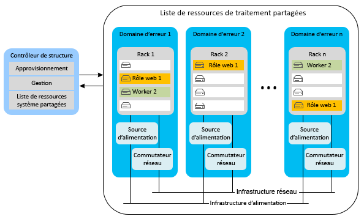
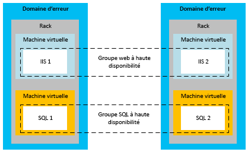
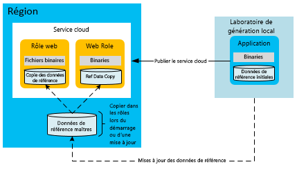
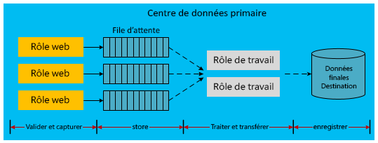

[!INCLUDE [header](../_includes/header.md)]
# Haute disponibilité pour les applications développées sur Microsoft Azure
Une application hautement disponible absorbe les variations de disponibilité, de charge et les défaillances temporaires de services dépendants et de matériel. L’application continue à fonctionner de manière acceptable, tel que défini par les besoins de votre entreprise ou les contrats de niveau de service de l’application.

## Fonctionnalités de haute disponibilité Azure
Azure dispose de nombreuses fonctionnalités intégrées de plateforme qui prennent en charge des applications hautement disponibles. Cette section décrit certaines de ces fonctionnalités clés.

### Contrôleur de structure
Le contrôleur de structure Azure provisionne et surveille l’état des instances de calcul Azure. Le contrôleur de structure surveille l’état du matériel et des logiciels des instances hôtes et de la machine invitée. Quand il détecte une défaillance, il maintient les contrats de niveau de service en déplaçant automatiquement les instances de machines virtuelles. Le concept de domaines d’erreur et de mise à niveau englobe en outre les contrats de niveau de service de calcul.

Quand plusieurs instances de rôle de service cloud sont déployées, Azure les répartit sur différents domaines d’erreur. En fait, une limite de domaine d’erreur est un autre rack matériel de la région. Les domaines d’erreur réduisent la probabilité qu’une défaillance matérielle localisée interrompe le service d’une application. Vous ne pouvez pas gérer le nombre de domaines d’erreur de vos rôles web ou rôles de travail. Le contrôleur de structure sollicite des ressources dédiées qui sont séparées des applications Azure hébergées. Il requiert un temps d’activité de 100 %, dans la mesure où il constitue le noyau du système Azure. Il surveille et gère les instances de rôle au sein des domaines d’erreur.

Le diagramme suivant représente les ressources Azure partagées qui sont déployées et gérées par le contrôleur de structure au sein des différents domaines d’erreur.

Tandis que les domaines d’erreur sont des séparations physiques visant à atténuer une défaillance, les domaines de mise à niveau sont des unités logiques de séparation d’instance qui déterminent les instances d’un service qui doivent être mises à niveau à un moment précis. Par défaut, cinq domaines de mise à niveau sont définis pour votre déploiement de service hébergé. Toutefois, vous pouvez modifier cette valeur dans le fichier de définition de service. Par exemple, si vous avez huit instances de rôle web, il y a deux instances dans trois domaines de mise à niveau et deux instances dans un domaine de mise à niveau. Azure définit la séquence de mise à jour en fonction du nombre de domaines de mise à niveau. Pour plus d’informations, consultez [Mettre à jour un service cloud](/azure/cloud-services/cloud-services-update-azure-service/).

### Fonctionnalités dans d’autres services
En plus des fonctionnalités de plateforme qui prennent en charge une haute disponibilité des ressources de calcul, Azure intègre des fonctionnalités de haute disponibilité à ses autres services. Par exemple, Stockage Azure conserve au moins trois réplicas de toutes les données dans votre compte de stockage Azure. Il permet également la géoréplication pour stocker des copies de vos données dans une région secondaire. Le réseau de distribution de contenu Azure permet la mise en cache d’objets blob dans le monde entier, à des fins de redondance, de scalabilité et de plus faible latence. Azure SQL Database gère également plusieurs réplicas.

Pour plus d’informations sur les fonctionnalités de disponibilité de plateforme Azure, consultez [Guide technique sur la résilience](index.md). Consultez également [Best practices for designing large-scale services on Windows Azure](https://azure.microsoft.com/blog/best-practices-for-designing-large-scale-services-on-windows-azure/) (Bonnes pratiques de conception de services à grande échelle sur Microsoft Azure).

Bien qu’Azure offre de nombreuses fonctionnalités qui prennent en charge la haute disponibilité, il est important de comprendre leurs limitations :

* Pour le calcul, Azure garantit que vos rôles sont disponibles et opérationnels, mais il ne peut pas détecter si votre application est exécutée ou surchargée.
* Pour Azure SQL Database, les données sont répliquées de manière synchrone au sein de la région. Vous pouvez choisir la géoréplication active, qui autorise jusqu’à quatre copies supplémentaires de base de données dans la même région (ou différentes régions). Bien que ces réplicas de base de données ne soient pas des sauvegardes à un point dans le temps, SQL Database fournit des fonctionnalités de sauvegarde à un point dans le temps. Pour plus d’informations, consultez [Récupérer une base de données Azure SQL à l’aide de sauvegardes de données automatisées : restauration à un point dans le temps](/azure/sql-database/sql-database-recovery-using-backups#point-in-time-restore).
* Pour Stockage Azure, les données de tables et les données des objets blob sont répliquées par défaut dans une autre région. Toutefois, vous ne pouvez pas accéder aux réplicas avant que Microsoft ne décide de basculer sur l’autre site. Un basculement de région se produit uniquement pendant l’interruption de service prolongée à l’échelle de la région, et il n’existe aucun contrat de niveau de service dédié au temps de basculement géographique. Il est également important de noter que les altérations de données se propagent rapidement entre les réplicas. Pour ces raisons, vous devez compléter les fonctionnalités de disponibilité de plateforme avec des fonctionnalités de disponibilité spécifiques à l’application, notamment la fonctionnalité de capture instantanée d’objet blob pour créer des sauvegardes de données blob à un point dans le temps.

### Groupes à haute disponibilité pour Machines virtuelles Azure
Ce document est principalement axé sur les services cloud qui utilisent un modèle Platform as a Service (PaaS). Il existe également des fonctions de disponibilité spécifiques pour Machines virtuelles Azure qui utilisent un modèle Infrastructure as a Service (IaaS). Pour atteindre une haute disponibilité avec Machines virtuelles, vous devez utiliser des groupes à haute disponibilité, qui remplissent une fonction similaire pour les domaines d’erreur et de mise à niveau. Au sein d’un groupe à haute disponibilité, Azure positionne les machines virtuelles de manière à ce que les défaillances matérielles localisées et les activités de maintenance ne provoquent pas la panne de toutes les machines de ce groupe. Des groupes à haute disponibilité sont requis pour respecter les contrats de niveau de service dédiés à la disponibilité de Machines virtuelles.

Le diagramme suivant montre deux groupes à haute disponibilité pour les machines virtuelles web et SQL Server, respectivement.

> [!NOTE]
> Dans le diagramme précédent, SQL Server est installé et exécuté sur des machines virtuelles. Cette configuration est différente d’Azure SQL Database, dans laquelle la base de données est fournie en tant que service géré.
> 
> 

## Stratégies d’application pour la haute disponibilité
La plupart des stratégies d’application dédiées à la haute disponibilité impliquent la redondance ou la suppression de dépendances rigides entre les composants applicatifs. La conception des applications doit prendre en charge la tolérance de panne durant les temps d’arrêt sporadiques des services Azure ou tiers. Les sections suivantes décrivent des modèles d’application dédiés à l’amélioration de la disponibilité de vos services cloud.

### Communication asynchrone et files d’attente durables
Pour augmenter la disponibilité dans les applications Azure, pensez à la communication asynchrone intervenant entre des services faiblement couplés. Dans ce modèle, des messages sont écrits dans des files d’attente de stockage ou des files d’attente Azure Service Bus, pour traitement ultérieur. Quand un message est écrit dans la file d’attente, le contrôle revient immédiatement à l’expéditeur. Un autre service de l’application, généralement implémenté en tant que rôle de travail, traite le message. Si le service de traitement arrête de fonctionner, les messages s’accumulent dans la file d’attente, jusqu’à restauration du service de traitement. Il n’existe aucune dépendance directe entre l’expéditeur frontend et le processeur de message. Cela élimine les appels de service synchrones qui peuvent provoquer des goulots d’étranglement dans les applications distribuées.

Une variante de ce modèle stocke les informations relatives aux appels échoués de la base de données dans Stockage Azure (objets blob, tables ou files d’attente) ou les files d’attente Service Bus. Par exemple, un appel synchrone au sein d’une application vers un autre service (comme Azure SQL Database) échoue de façon répétée. Vous pouvez être en mesure de sérialiser cette demande en instances de stockage durable. Ultérieurement, durant la remise en ligne du service ou de la base de données, l’application peut de nouveau envoyer la demande à partir du stockage. Cependant, dans ce modèle, l’emplacement intermédiaire est uniquement utilisé pendant les défaillances, pas en tant que composante régulière du workflow applicatif.

Dans les deux scénarios, une communication asynchrone et un stockage intermédiaire empêchent que la panne d’un service principal n’arrête l’intégralité de l’application. Les files d’attente font office d’intermédiaires logiques. Pour plus d’informations sur la sélection d’un service de file d’attente, consultez [Files d’attente Azure et files d’attente Service Bus &mdash; comparaison et différences](/azure/service-bus-messaging/service-bus-azure-and-service-bus-queues-compared-contrasted/).

### Logique de détection des erreurs et de nouvelle tentative
L’un des aspects clés de la conception d’applications hautement disponibles est la capacité à utiliser une logique de nouvelle tentative au sein du code pour faciliter le traitement d’un service temporairement indisponible. Les versions récentes des SDK pour Stockage Azure et Azure Service Bus prennent en charge les nouvelles tentatives en mode natif. Pour plus d’informations sur la fourniture d’une logique de nouvelle tentative personnalisée pour votre application, consultez [Modèle de nouvelle tentative](../patterns/retry.md).

### Modèle de données de référence pour la haute disponibilité
Les données de référence sont les données en lecture seule d’une application. Ces données fournissent le contexte professionnel au sein duquel l’application génère les données transactionnelles durant une opération commerciale. L’intégrité des données transactionnelles dépend d’un instantané des données de référence au moment où la transaction a été effectuée.

Les données de référence sont nécessaires au bon fonctionnement de l’application. Diverses applications créent et gèrent les données de référence ; les systèmes de gestion des données de référence (MDM, Master Data Management) remplissent souvent cette fonction. Ces systèmes sont responsables du cycle de vie des données de référence. Parmi les données de référence, citons les catalogues de produits, les informations sur les employés, sur les pièces et sur les équipements. Les données de référence peuvent également provenir de l’extérieur de l’organisation, comme les codes postaux ou les taux d’imposition. Les stratégies dédiées à l’augmentation de la disponibilité des données de référence sont généralement moins complexes que celles associées aux données transactionnelles. Les données de référence présentent l’avantage d’être principalement immuables.

Des rôles web et de travail Azure qui consomment de manière autonome des données de référence peuvent être créés pendant l’exécution en déployant ces données de référence avec l’application. Cette approche est idéale si la taille du stockage local permet un déploiement de ce type. Les bases de données SQL intégrées, les bases de données NoSQL ou les fichiers XML déployés localement contribuent à l’autonomie des unités d’échelle de calcul Azure. Toutefois, vous devez disposer d’un mécanisme permettant de mettre à jour les données de chaque rôle sans nécessiter de nouveau déploiement. Pour ce faire, placez les mises à jour des données de référence sur un point de terminaison de stockage cloud (par exemple, le stockage d’objets blob Azure ou une Base de données SQL). Sur chaque rôle, ajoutez un code téléchargeant les mises à jour des données dans les nœuds de calcul lors du démarrage. Sinon, ajoutez un code qui donne les moyens à un administrateur d’effectuer un téléchargement forcé dans les instances de rôle.

Pour augmenter la disponibilité, les rôles doivent également contenir un ensemble de données de référence, à utiliser en cas de défaillance du stockage. Les rôles peuvent démarrer avec un ensemble de base de données de référence, jusqu’à la mise à disposition pour les mises à jour des ressources de stockage.

Avec ce modèle, le démarrage des nouveaux déploiements ou instances de rôle peut prendre plus de temps si vous déployez ou téléchargez de grands volumes de données de référence. Ce compromis peut être acceptable pour l’autonomie, dans la mesure où les données de référence sont immédiatement disponibles à chaque rôle, sans plus dépendre des services de stockage externes.

### Modèle de données transactionnel pour la haute disponibilité
Les données transactionnelles sont les données générées par l’application dans un contexte professionnel. Les données transactionnelles sont une combinaison de l’ensemble de processus d’entreprise implémentés par l’application et des données de référence qui prennent en charge ces processus. Parmi les données transactionnelles, citons les commandes, les avis d’expédition anticipée, les factures et les opportunités de gestion des relations client (CRM, Customer Relationship Management). Les données transactionnelles sont fournies aux systèmes externes à des fins de consignation ou de traitement ultérieur.

Les données de référence peuvent changer au sein des systèmes qui en sont responsables. Ainsi, les données transactionnelles doivent enregistrer le contexte des données de référence ponctuelles pour réduire les dépendances externes, au bénéfice d’une cohérence sémantique. Par exemple, un produit peut être supprimé du catalogue quelques mois après l’exécution d’une commande. Nous vous recommandons de stocker autant de contexte des données de référence que possible avec la transaction. Cette approche préserve la sémantique associée à la transaction, même si une modification des données de référence était prévue une fois la transaction capturée.

Comme mentionné précédemment, les architectures qui valorisent un couplage faible et une communication asynchrone peuvent fournir des niveaux de disponibilité plus élevés. Cela est également vrai pour les données transactionnelles, mais l’implémentation est plus complexe. Pour garantir la transaction, les modèles transactionnels traditionnelles reposent généralement sur la base de données. Lorsque vous introduisez des couches intermédiaires, le code d’application doit traiter correctement les données des différentes couches pour assurer une cohérence et une durabilité suffisantes.

La séquence suivante décrit un workflow qui sépare la capture des données transactionnelles de son traitement :

1. Nœud de calcul Web : présenter les données de référence.
2. Stockage externe : enregistrer les données transactionnelles intermédiaires.
3. Nœud de calcul Web : exécuter la transaction de l’utilisateur final.
4. Nœud de calcul web : envoyer les données transactionnelles complètes avec leur contexte des données de référence vers un stockage durable temporaire garantissant la fourniture d’une réponse prévisible.
5. Nœud de calcul Web : signaler à l’utilisateur final l’exécution de la transaction.
6. Nœud de calcul d’arrière-plan : extraire les données transactionnelles, les traiter davantage si nécessaire et les envoyer vers leur emplacement de stockage final au sein du système actuel.

Le diagramme suivant représente une implémentation possible de cette conception dans un service cloud hébergé Azure.

Les flèches en pointillés du diagramme précédent font état d’un traitement asynchrone. Le rôle web frontal n’a pas connaissance de ce traitement asynchrone. Avec cette configuration, la transaction est stockée à sa destination finale avec une référence au système actuel. En raison de la latence introduite par ce modèle asynchrone, les données transactionnelles ne peuvent pas être immédiatement interrogées. Par conséquent, pour satisfaire aux besoins immédiats de l’interface utilisateur, chaque unité de données transactionnelles doit être enregistrée dans un cache ou une session d’utilisateur.

Le rôle Web est autonome du reste de l’infrastructure. Son profil de disponibilité est une combinaison du rôle web et de la file d’attente Azure, non pas de l’intégralité de l’infrastructure. En plus de la haute disponibilité, cette approche prend en charge la mise à l’échelle horizontale du rôle web, indépendamment du stockage principal. Ce modèle de haute disponibilité peut avoir une incidence sur la rentabilité des opérations. Les composants supplémentaires comme les files d’attente Azure et les rôles de travail peuvent affecter les coûts mensuels d’utilisation.

Le diagramme précédent représente une implémentation de cette approche dissociée des données transactionnelles. Il existe de nombreuses autres implémentations possibles. La liste suivante vous propose quelques alternatives :

* Un rôle de travail peut être placé entre le rôle web et la file d’attente de stockage.
* Une file d’attente Service Bus peut remplacer une file d’attente de stockage Azure.
* La destination finale peut être Stockage Azure ou un autre fournisseur de base de données.
* La fonctionnalité Azure Cache peut être utilisée au niveau de la couche Web pour prendre en charge les besoins immédiats de mise en cache après la transaction.

### Modèles de scalabilité
Il est important de noter que la scalabilité d’un service cloud affecte directement la disponibilité. Si l’accroissement de la charge affecte la réactivité de votre service, l’utilisateur a l’impression que l’application est en panne. Suivez des pratiques de scalabilité éprouvées en fonction des prévisions de charge de votre application et des besoins futurs. L’optimisation de la mise à l’échelle implique de nombreuses questions : faut-il utiliser un ou plusieurs comptes de stockage ? Comment se déroule le partage entre plusieurs bases de données ? Quelles stratégies de mise en cache implémenter ? Pour obtenir des informations détaillées sur ces modèles, consultez [Best practices for designing large-scale services on Microsoft Azure](https://azure.microsoft.com/blog/best-practices-for-designing-large-scale-services-on-windows-azure/) (Bonnes pratiques pour concevoir des services à grande échelle sur Microsoft Azure).

## Étapes suivantes
Cette série de document couvre la récupération d’urgence et la haute disponibilité des applications développées sur Microsoft Azure. Le prochain article de la série est [Récupération d’urgence des applications développées sur Microsoft Azure](disaster-recovery-azure-applications.md).

