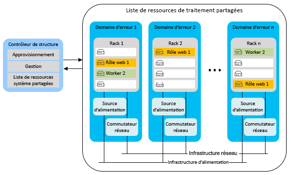
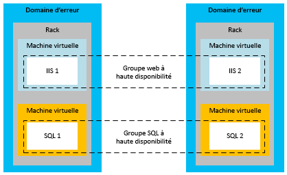
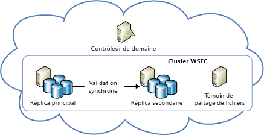
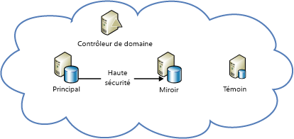

[!INCLUDE [header](../_includes/header.md)]

# Guide technique de la résilience Azure - Récupération suite à des défaillances locales dans AzureAzure resiliency technical guidance: Recovery from local failures in Azure

Il existe deux menaces principales à la disponibilité des applications :There are two primary threats to application availability:

* La défaillance des appareils, tels que les lecteurs et les serveurs.The failure of devices, such as drives and servers
* L’épuisement des ressources critiques, telles que le calcul dans des conditions de charge maximale.The exhaustion of critical resources, such as compute under peak load conditions

Azure offre une combinaison de gestion des ressources, d’élasticité, d’équilibrage de charge et de partitionnement pour permettre d’obtenir une haute disponibilité dans ces circonstances.Azure provides a combination of resource management, elasticity, load balancing, and partitioning to enable high availability under these circumstances. Certaines de ces fonctionnalités sont exécutées automatiquement pour tous les services Azure.Some of these features are performed automatically for all Azure services. Cependant, dans certains cas, le développeur d’application doit effectuer un travail supplémentaire pour tirer parti de ces fonctionnalités.However, in some cases, the application developer must do some additional work to benefit from them.

## Cloud ServicesCloud Services
Azure Cloud Services se compose de collections d’un ou de plusieurs rôles Web ou de travail.Azure Cloud Services consists of collections of one or more web or worker roles. Une ou plusieurs instances d’un rôle peuvent s’exécuter simultanément.One or more instances of a role can run concurrently. Le nombre d’instances est déterminé par la configuration.The configuration determines the number of instances. Les instances de rôle sont surveillées et gérées à l’aide d’un composant appelé le contrôleur de structure.Role instances are monitored and managed through a component called the fabric controller. Le contrôleur de structure détecte automatiquement les défaillances logicielles et matérielles, et y répond.The fabric controller detects and responds to both software and hardware failures automatically.

Chaque instance de rôle s’exécute dans sa propre machine virtuelle et communique avec son contrôleur de structure par le biais d’un agent invité.Every role instance runs in its own virtual machine (VM) and communicates with its fabric controller through a guest agent. L’agent invité collecte les métriques de ressource et de nœud, y compris l’utilisation des machines virtuelles, les états, les journaux, l’utilisation des ressources, les exceptions et les conditions de défaillance.The guest agent collects resource and node metrics, including VM usage, status, logs, resource usage, exceptions, and failure conditions. Le contrôleur de structure interroge l’agent invité à des intervalles configurables, et redémarre la machine virtuelle si l’agent invité ne répond pas.The fabric controller queries the guest agent at configurable intervals, and it restarts the VM if the guest agent fails to respond. En cas de défaillance matérielle, le contrôleur de structure associé déplace toutes les instances de rôle affectées vers un nouveau nœud de matériel et reconfigure le réseau pour y acheminer le trafic.In the event of hardware failure, the associated fabric controller moves all affected role instances to a new hardware node and reconfigures the network to route traffic there.

Pour tirer parti de ces fonctionnalités, les développeurs doivent s’assurer que tous les rôles de service évitent de stocker l’état sur les instances de rôle.To benefit from these features, developers should ensure that all service roles avoid storing state on the role instances. Au lieu de cela, toutes les données persistantes doivent être accessibles à partir d’un stockage durable, tels que Stockage Azure ou Azure SQL Database.Instead, all persistent data should be accessed from durable storage, such as Azure Storage or Azure SQL Database. Ainsi, tous les rôles sont en mesure de gérer les demandes.This allows any roles to handle requests. Cela signifie également que les instances de rôle peuvent tomber en panne à tout moment sans créer d’incohérences dans l’état temporaire ou permanent du service.It also means that role instances can go down at any time without creating inconsistencies in the transient or persistent state of the service.

La nécessité de stocker l’état en dehors des rôles présente plusieurs implications.The requirement to store state externally to the roles has several implications. Par exemple, cela implique que toutes les modifications associées à une table Azure Storage doivent être effectuées dans une seule transaction de groupe d’entités, si possible.It implies, for example, that all related changes to an Azure Storage table should be changed in a single entity-group transaction, if possible. Bien entendu, il n’est pas toujours possible d’apporter toutes les modifications dans une transaction unique.Of course, it isn't always possible to make all changes in a single transaction. Vous devez tout particulièrement veiller à garantir que les défaillances d’instances de rôle ne provoquent aucun problème lorsqu’elles interrompent des opérations de longue durée qui englobent un minimum de deux mises à jour de l’état permanent du service.You must take special care to ensure that role instance failures do not cause problems when they interrupt long-running operations that span two or more updates to the persistent state of the service. Si un autre rôle tente à nouveau une telle opération, il doit anticiper les situations pour lesquelles le travail a été partiellement effectué, et les gérer efficacement.If another role attempts to retry such an operation, it should anticipate and handle the case where the work was partially completed.

Par exemple, imaginons un service qui partitionne les données dans plusieurs magasins.For example, consider a service that partitions data across multiple stores. Si un rôle de travail tombe en panne pendant le déplacement d’une partition, le déplacement de la partition peut ne pas aboutir.If a worker role goes down while it's relocating a shard, the relocation of the shard might not finish. Ou bien, le déplacement peut être répété depuis le début par un autre rôle de travail, ce qui peut éventuellement générer des données orphelines ou corrompre des données.Or the relocation might be repeated from its inception by a different worker role, potentially causing orphaned data or data corruption. Pour éviter ces problèmes, les opérations de longue durée doivent être du même type que l’une ou l’ensemble des opérations suivantes :To prevent problems, long-running operations must be one or both of the following:

* *Idempotente*: répétable sans effet secondaire.*Idempotent*: Repeatable without side effects. Pour être idempotente, une opération de longue durée doit présenter un effet identique dans toutes ses itérations, même lorsqu’elle est interrompue pendant l’exécution.To be idempotent, a long-running operation should have the same effect no matter how many times it's executed, even when it's interrupted during execution.
* *Redémarrable de façon incrémentielle*: en mesure de continuer à partir du point de défaillance le plus récent.*Incrementally restartable*: Able to continue from the most recent point of failure. Pour être redémarrable de façon incrémentielle, une opération de longue durée doit se composer d’une séquence d’opérations atomiques plus petites.To be incrementally restartable, a long-running operation should consist of a sequence of smaller atomic operations. Elle doit également enregistrer sa progression dans le stockage durable, de façon à ce que chacun des appels ultérieurs reprenne là où son prédécesseur s’est arrêté.It should also record its progress in durable storage, so that each subsequent invocation picks up where its predecessor stopped.

Enfin, toutes les opérations de longue durée doivent être appelées à plusieurs reprises jusqu’à leur réussite.Finally, all long-running operations should be invoked repeatedly until they succeed. Par exemple, une opération d’approvisionnement peut être placée dans une file d’attente Azure, puis supprimée de la file d’attente par un rôle de travail uniquement lorsqu’elle réussit.For example, a provisioning operation might be placed in an Azure queue, and then removed from the queue by a worker role only when it succeeds. Un nettoyage de la mémoire peut être nécessaire afin de nettoyer les données créées par des opérations interrompues.Garbage collection might be necessary to clean up data that interrupted operations create.

### ÉlasticitéElasticity
Le nombre initial d’instances en cours d’exécution pour chaque rôle est déterminé dans la configuration de chaque rôle.The initial number of instances running for each role is determined in each role’s configuration. Les administrateurs doivent initialement configurer chaque rôle pour l’exécution avec deux ou plusieurs instances, en fonction de la charge attendue.Administrators should initially configure each role to run with two or more instances based on expected load. Cependant, vous pouvez facilement monter en puissance ou descendre en puissance les instances de rôle en fonction des variations des modèles d’utilisation.But you can easily scale role instances up or down as usage patterns change. Vous pouvez effectuer cette opération manuellement dans le portail Azure ou automatiser le processus à l’aide de Windows PowerShell, de l’API Gestion des services ou d’outils tiers.You can do this manually in the Azure portal, or you can automate the process by using Windows PowerShell, the Service Management API, or third-party tools. Pour plus d’informations, consultez [Mise à l’échelle automatique d’un service cloud](/azure/cloud-services/cloud-services-how-to-scale/).For more information, see [How to autoscale an application](/azure/cloud-services/cloud-services-how-to-scale/).

### PartitionnementPartitioning
Le contrôleur de structure Azure utilise deux types de partitions :The Azure fabric controller uses two types of partitions:

* Un *domaine de mise à jour* est utilisé pour mettre à niveau les instances d’un rôle de service dans les groupes.An *update domain* is used to upgrade a service’s role instances in groups. Azure déploie les instances de service dans plusieurs domaines de mise à jour.Azure deploys service instances into multiple update domains. Dans le cadre d’une mise à jour sur place, le contrôleur de structure interrompt toutes les instances d’un domaine de mise à jour, les met à jour et les redémarre avant de passer au domaine de mise à jour suivant.For an in-place update, the fabric controller brings down all the instances in one update domain, updates them, and then restarts them before moving to the next update domain. Cette approche prévient toute indisponibilité de l’intégralité du service durant le processus de mise à jour.This approach prevents the entire service from being unavailable during the update process.
* Un *domaine d’erreur* définit les points potentiels de défaillance matérielle ou de réseau.A *fault domain* defines potential points of hardware or network failure. Le contrôleur de structure garantit que les instances d’un rôle en présentant plusieurs sont distribuées entre plusieurs domaines d’erreur pour éviter toute interruption du service par des défaillances matérielles isolées.For any role that has more than one instance, the fabric controller ensures that the instances are distributed across multiple fault domains, to prevent isolated hardware failures from disrupting service. L’exposition aux défaillances de serveur et de cluster est régie par les domaines d’erreur.Fault domains govern all exposure to server and cluster failures.

Le [contrat de niveau de service Azure](https://azure.microsoft.com/support/legal/sla/) garantit que lorsqu’au minimum deux instances de rôles Web sont déployées sur des domaines d’erreur et de mise à niveau différents, elles présentent une connectivité externe au moins 99,95 % du temps.The [Azure service-level agreement (SLA)](https://azure.microsoft.com/support/legal/sla/) guarantees that when two or more web role instances are deployed to different fault and upgrade domains, they'll have external connectivity at least 99.95 percent of the time. Contrairement aux domaines de mise à jour, il n’existe aucun moyen de contrôler le nombre de domaines d’erreur.Unlike update domains, there's no way to control the number of fault domains. Azure alloue automatiquement les domaines d’erreur et distribue les instances de rôle entre elles.Azure automatically allocates fault domains and distributes role instances across them. Les deux premières instances au minimum de chaque rôle sont placées dans des domaines d’erreur et de mise à niveau différents pour garantir que les rôles présentant au moins deux instances satisferont les contrats de niveau de service.At least the first two instances of every role are placed in different fault and upgrade domains to ensure that any role with at least two instances will satisfy the SLA. Cela est représenté dans le diagramme suivant.This is represented in the following diagram.

### Équilibrage de la chargeLoad balancing
Tout le trafic entrant d’un rôle web passe par un équilibreur de charge sans état, qui distribue les demandes des clients entre les instances de rôle.All inbound traffic to a web role passes through a stateless load balancer, which distributes client requests among the role instances. Des instances de rôle isolées n’ont pas d’adresses IP publiques et ne sont pas directement adressables à partir d’Internet.Individual role instances do not have public IP addresses, and they are not directly addressable from the Internet. Les rôles Web sont sans état, ce qui permet de diriger les requêtes des clients vers toute instance de rôle.Web roles are stateless so that any client request can be routed to any role instance. Un événement [StatusCheck](https://msdn.microsoft.com/library/microsoft.windowsazure.serviceruntime.roleenvironment.statuscheck.aspx) est déclenché toutes les 15 secondes.A [StatusCheck](https://msdn.microsoft.com/library/microsoft.windowsazure.serviceruntime.roleenvironment.statuscheck.aspx) event is raised every 15 seconds. Vous pouvez utiliser cet événement pour indiquer si le rôle est prêt à recevoir le trafic, ou s’il est occupé et doit être retiré de la rotation d’équilibrage de charge.You can use this to indicate whether the role is ready to receive traffic, or whether it's busy and should be taken out of the load-balancer rotation.

## Virtual MachinesVirtual Machines
Azure Virtual Machines diffère des rôles de calcul Platform as a Service (PaaS) par plusieurs aspects relatifs à la haute disponibilité.Azure Virtual Machines differs from platform as a service (PaaS) compute roles in several respects in relation to high availability. Dans certains cas, vous devez effectuer des opérations supplémentaires pour garantir une haute disponibilité.In some instances, you must do additional work to ensure high availability.

### Durabilité des disquesDisk durability
Contrairement aux instances de rôle PaaS, les données stockées sur les disques de machines virtuelles demeurent persistantes, même en cas de déplacement des machines virtuelles.Unlike PaaS role instances, data stored on virtual machine drives is persistent even when the virtual machine is relocated. Les machines virtuelles Azure utilisent les disques de machines virtuelles existant en tant qu’objets blob dans Azure Storage.Azure virtual machines use VM disks that exist as blobs in Azure Storage. En raison des caractéristiques de disponibilité d’Azure Storage, les données stockées sur des lecteurs d’une machine virtuelle sont également hautement disponibles.Because of the availability characteristics of Azure Storage, the data stored on a virtual machine’s drives is also highly available.

Notez que le lecteur D (sur les machines virtuelles Windows) fait exception à cette règle.Note that drive D (in Windows VMs) is the exception to this rule. Le lecteur D correspond au stockage physique sur le serveur monté en rack qui héberge la machine virtuelle ; ses données seront perdues en cas de recyclage de la machine virtuelle.Drive D is actually physical storage on the rack server that hosts the VM, and its data will be lost if the VM is recycled. Le lecteur D est dédié au stockage temporaire uniquement.Drive D is intended for temporary storage only. Sous Linux, Azure expose « généralement » (mais pas systématiquement) le disque temporaire local en tant qu’appareil en mode bloc /dev/sdb.In Linux, Azure “usually” (but not always) exposes the local temporary disk as /dev/sdb block device. Il est souvent monté par l’Agent Linux Azure sous forme de point de montage /mnt/resource ou /mnt (configurable via/etc/waagent.conf).It is often mounted by the Azure Linux Agent as /mnt/resource or /mnt mount points (configurable via /etc/waagent.conf).

### PartitionnementPartitioning
Azure comprend de manière native les niveaux d’une application PaaS (rôle Web et rôle de travail), et peut par conséquent les distribuer efficacement entre les domaines d’erreur et de mise à jour.Azure natively understands the tiers in a PaaS application (web role and worker role) and thus can properly distribute them across fault and update domains. En revanche, les niveaux dans une application Infrastructure as a Service (IaaS) doivent être définis manuellement via les groupes à haute disponibilité.In contrast, the tiers in an infrastructure as a service (IaaS) application must be manually defined through availability sets. Des groupes à haute disponibilité sont requis pour les contrats de niveau de service établis sous IaaS.Availability sets are required for an SLA under IaaS.

Dans le diagramme précédent, le niveau Internet Information Services (IIS, qui fonctionne comme un niveau d’application Web) et le niveau SQL (qui fonctionne comme un niveau de données) sont affectés à différents groupes à haute disponibilité.In the preceding diagram, the Internet Information Services (IIS) tier (which works as a web app tier) and the SQL tier (which works as a data tier) are assigned to different availability sets. Cela garantit que toutes les instances de chaque niveau disposent d’une redondance matérielle, en distribuant les machines virtuelles dans les domaines d’erreur, et que les niveaux dans leur intégralité ne sont pas arrêtés pendant une mise à jour.This ensures that all instances of each tier have hardware redundancy by distributing virtual machines across fault domains, and that entire tiers are not taken down during an update.

### Équilibrage de la chargeLoad balancing
Si le trafic est distribué entre les machines virtuelles, vous devez les regrouper dans une application et équilibrer la charge sur un point de terminaison TCP ou UDP spécifique.If the VMs should have traffic distributed across them, you must group the VMs in an application and load balance across a specific TCP or UDP endpoint. Pour plus d’informations, consultez [Équilibrage de charge des machines virtuelles](/azure/virtual-machines/virtual-machines-linux-load-balance/?toc=%2fazure%2fvirtual-machines%2flinux%2ftoc.json).For more information, see [Load balancing virtual machines](/azure/virtual-machines/virtual-machines-linux-load-balance/?toc=%2fazure%2fvirtual-machines%2flinux%2ftoc.json). Si les machines virtuelles sont approvisionnées par une autre source (par exemple, un mécanisme de file d’attente), aucun équilibreur de charge n’est requis.If the VMs receive input from another source (for example, a queuing mechanism), a load balancer is not required. L’équilibreur de charge utilise un contrôle d’intégrité de base pour déterminer si le trafic doit être envoyé au nœud.The load balancer uses a basic health check to determine whether traffic should be sent to the node. Il est également possible de créer vos propres sondes pour implémenter des mesures spécifiques de contrôle d’intégrité de l’application. Le cas échéant, elles déterminent si la machine virtuelle doit recevoir le trafic.It's also possible to create your own probes to implement application-specific health metrics that determine whether the VM should receive traffic.

## StockageStorage
Azure Storage est le service de données durables de ligne de base pour Azure.Azure Storage is the baseline durable data service for Azure. Il fournit des objets blob, des tables, des files d’attente et du stockage sur disque de machine virtuelle.It provides blob, table, queue, and VM disk storage. Il utilise une combinaison de réplication et de gestion des ressources pour assurer la haute disponibilité dans un centre de données unique.It uses a combination of replication and resource management to provide high availability within a single datacenter. Le contrat de niveau de service relatif à la disponibilité d’Azure Storage garantit qu’au moins 99,9 % du temps :The Azure Storage availability SLA guarantees that at least 99.9 percent of the time:

* Des demandes correctement mises en forme pour ajouter, mettre à jour, lire et supprimer des données, sont traitées comme nécessaire.Correctly formatted requests to add, update, read, and delete data will be successfully and correctly processed.
* Les comptes de stockage pourront se connecter à la passerelle Internet.Storage accounts will have connectivity to the Internet gateway.

### RéplicationReplication
Azure Storage simplifie la durabilité des données en conservant plusieurs copies de toutes les données sur des lecteurs différents situés dans des sous-systèmes de stockage physique entièrement indépendants au sein de la région.Azure Storage facilitates data durability by maintaining multiple copies of all data on different drives across fully independent physical storage subsystems within the region. Les données sont répliquées de façon synchrone et toutes les copies sont validées avant la reconnaissance de l’écriture.Data is replicated synchronously, and all copies are committed before the write is acknowledged. Azure Storage est fortement cohérent, ce qui signifie que les lectures correspondent forcément aux écritures les plus récentes.Azure Storage is strongly consistent, meaning that reads are guaranteed to reflect the most recent writes. En outre, les copies de données sont analysées en continu pour détecter et corriger une altération binaire, une menace souvent négligée en matière d’intégrité des données stockées.In addition, copies of data are continually scanned to detect and repair bit rot, an often overlooked threat to the integrity of stored data.

Les services bénéficient de la réplication, simplement par l’utilisation d’Azure Storage.Services benefit from replication just by using Azure Storage. Aucune tâche supplémentaire n’est requise par le développeur de service pour la récupération suite à une défaillance locale.The service developer doesn't need to do additional work to recover from a local failure.

### Gestion des ressourcesResource management
La taille des comptes de stockage créés après le mai 2014 peut être augmentée jusqu’à 500 To (contre 200 To auparavant).Storage accounts created after May 2014, can grow to up to 500 TB (the previous maximum was 200 TB). Si de l’espace supplémentaire est nécessaire, les applications doivent être conçues pour utiliser plusieurs comptes de stockage.If additional space is required, applications must be designed to use multiple storage accounts.

### Disques de machines virtuellesVirtual machine disks
Un disque de machine virtuelle est stocké comme un objet blob de pages dans Azure Storage. Par conséquent, il présente les mêmes propriétés de durabilité et d’extensibilité que le stockage d’objets blob.A virtual machine’s disk is stored as a page blob in Azure Storage, giving it all the same durability and scalability properties as Blob storage. Cette conception rend les données d’un disque de machine virtuelle persistantes, même si le serveur exécutant la machine virtuelle tombe en panne et que la machine virtuelle doit être redémarrée sur un autre serveur.This design makes the data on a virtual machine’s disk persistent, even if the server running the VM fails and the VM must be restarted on another server.

## Base de donnéesDatabase
### Base de données SQLSQL Database
La Base de données SQL Azure fournit une base de données en tant que service.Azure SQL Database provides database as a service. Elle permet aux applications d’effectuer rapidement des opérations d’approvisionnement, d’insérer des données et d’interroger des bases de données relationnelles.It allows applications to quickly provision, insert data into, and query relational databases. Elle offre de nombreuses fonctionnalités communes de SQL Server, tout en vous épargnant la complexité associée au matériel, à la configuration, à la mise à jour corrective et à la résilience.It provides many of the familiar SQL Server features and functionality, while abstracting the burden of hardware, configuration, patching, and resiliency.

> [!NOTE]
> Azure SQL Database ne fournit pas un ensemble de fonctionnalités identique à celui de SQL Server.Azure SQL Database does not provide one-to-one feature parity with SQL Server. Il est conçu pour répondre à une série d’exigences spécifiques aux applications cloud (mise à l’échelle élastique, base de données en tant que service pour réduire les coûts de maintenance et ainsi de suite).It's intended to fulfill a different set of requirements--one that's uniquely suited to cloud applications (elastic scale, database as a service to reduce maintenance costs, and so on). Pour plus d’informations, consultez [Choisir une option SQL Server cloud : Base de données SQL Azure (PaaS) ou SQL Server sur des machines virtuelles Azure (IaaS)](/azure/sql-database/sql-database-paas-vs-sql-server-iaas/).For more information, see [Choose a cloud SQL Server option: Azure SQL (PaaS) Database or SQL Server on Azure VMs (IaaS)](/azure/sql-database/sql-database-paas-vs-sql-server-iaas/).
> 
> 

#### RéplicationReplication
Azure SQL Database fournit la résilience intégrée dédiée aux défaillances au niveau du nœud.Azure SQL Database provides built-in resiliency to node-level failure. Toutes les écritures dans une base de données sont automatiquement répliquées sur au minimum deux nœuds d’arrière-plan via une technique de validation de quorum.All writes into a database are automatically replicated to two or more background nodes through a quorum commit technique. (Le nœud principal et au moins un des nœuds secondaires doivent confirmer que l’activité est écrite dans le journal des transactions avant que la transaction soit considérée comme réussie et qu’elle soit renvoyée.) En cas de défaillance du nœud, la base de données bascule automatiquement vers l’un des réplicas secondaires.(The primary and at least one secondary must confirm that the activity is written to the transaction log before the transaction is deemed successful and returns.) In the case of node failure, the database automatically fails over to one of the secondary replicas. Cela entraîne une interruption de connexion temporaire pour les applications clientes.This causes a transient connection interruption for client applications. Pour cette raison, tous les clients Azure SQL Database doivent implémenter une certaine forme de gestion des connexions temporaires.For this reason, all Azure SQL Database clients must implement some form of transient connection handling. Pour plus d’informations, consultez [Guide spécifique relatif au service de nouvelle tentative](/azure/best-practices-retry-service-specific/).For more information, see [Retry service specific guidance](/azure/best-practices-retry-service-specific/).

#### Gestion des ressourcesResource management
Lors de la création, chaque base de données est configurée avec une limite de taille supérieure.Each database, when created, is configured with an upper size limit. La taille maximale actuellement disponible est de 1 To (les limites de taille varient en fonction de votre niveau de service, consultez la section relative aux [niveaux de service et de performances des bases de données Azure SQL](/azure/sql-database/sql-database-resource-limits/#service-tiers-and-performance-levels).The currently available maximum size is 1 TB (size limits vary based on your service tier, see [service tiers and performance levels of Azure SQL Databases](/azure/sql-database/sql-database-resource-limits/#service-tiers-and-performance-levels). Lorsqu’une base de données atteint sa limite de taille maximale, elle refuse les commandes INSERT ou UPDATE supplémentaires.When a database hits its upper size limit, it rejects additional INSERT or UPDATE commands. (L’interrogation et la suppression des données sont toujours possibles.)(Querying and deleting data is still possible.)

Dans une base de données, Azure SQL Database utilise une structure pour gérer les ressources.Within a database, Azure SQL Database uses a fabric to manage resources. Toutefois, au lieu d’un contrôleur de structure, elle utilise une topologie en anneau pour détecter les erreurs.However, instead of a fabric controller, it uses a ring topology to detect failures. Dans un cluster, chaque réplica a deux voisins et il est chargé de détecter leur mise hors service.Every replica in a cluster has two neighbors and is responsible for detecting when they go down. Lorsqu’un réplica est mis hors service, ses voisins déclenchent un Reconfiguration Agent pour le recréer sur une autre machine.When a replica goes down, its neighbors trigger a reconfiguration agent to re-create it on another machine. La limitation du moteur fournie vous assure qu’un serveur logique n’utilise pas trop de ressources sur une machine ou ne dépasse les limites physiques de la machine.Engine throttling is provided to ensure that a logical server doesn't use too many resources on a machine or exceed the machine’s physical limits.

### ÉlasticitéElasticity
Si l’application nécessite davantage que la limite de base de données de 1 To, elle doit implémenter une approche d’augmentation de la taille des instances.If the application requires more than the 1 TB database limit, it must implement a scale-out approach. Vous augmentez la taille des instances avec Azure SQL Database via un partitionnement manuel des données entre plusieurs bases de données SQL.You scale out with Azure SQL Database by manually partitioning, also known as sharding, data across multiple SQL databases. Cette approche d’augmentation de la taille des instances permet d’obtenir une augmentation quasi linéaire du prix par rapport à la mise à l’échelle.This scale-out approach provides the opportunity to achieve nearly linear cost growth with scale. La croissance élastique ou la capacité à la demande peuvent augmenter avec une tarification incrémentielle en fonction des besoins, car les bases de données sont facturées en fonction de la taille moyenne réelle utilisée chaque jour, pas en fonction de la taille maximale possible.Elastic growth or capacity on demand can grow with incremental costs as needed because databases are billed based on the average actual size used per day, not based on maximum possible size.

## SQL Server sur Virtual MachinesSQL Server on Virtual Machines
En installant SQL Server (version 2014 ou ultérieure) sur Azure Virtual Machines, vous pouvez tirer profit des fonctionnalités traditionnelles de disponibilité de SQL Server.By installing SQL Server (version 2014 or later) on Azure Virtual Machines, you can take advantage of the traditional availability features of SQL Server. Ces fonctionnalités incluent les groupes de disponibilité AlwaysOn et la mise en miroir de bases de données.These features include AlwaysOn Availability Groups and database mirroring. Veuillez noter que les machines virtuelles Azure, le stockage et le réseau ont des caractéristiques opérationnelles différentes de celles d’une infrastructure informatique non virtualisée locale.Note that Azure VMs, storage, and networking have different operational characteristics than an on-premises, non-virtualized IT infrastructure. Pour une implémentation réussie d’une solution de haute disponibilité/de récupération d’urgence SQL Server dans Azure, vous devez comprendre ces différences et concevoir votre solution de façon à les gérer.A successful implementation of a high availability/disaster recovery (HA/DR) SQL Server solution in Azure requires that you understand these differences and design your solution to accommodate them.

### Nœuds haute disponibilité d’un groupe à haute disponibilitéHigh-availability nodes in an availability set
Lorsque vous implémentez une solution de haute disponibilité dans Azure, vous pouvez utiliser le groupe à haute disponibilité dans Azure pour placer les nœuds haute disponibilité dans des domaines d’erreur et des domaines de mise à niveau distincts.When you implement a high-availability solution in Azure, you can use the availability set in Azure to place the high-availability nodes into separate fault domains and upgrade domains. Pour être clair, le groupe à haute disponibilité est un concept Azure.To be clear, the availability set is an Azure concept. Nous vous recommandons de suivre cette meilleure pratique pour vous assurer de la haute disponibilité de vos bases de données, que vous utilisiez des groupes de disponibilité AlwaysOn, la mise en miroir de bases de données ou une autre solution.It's a best practice that you should follow to make sure that your databases are indeed highly available, whether you're using AlwaysOn Availability Groups, database mirroring, or something else. Si vous ne suivez pas cette meilleure pratique, vous pourriez croire, à tort, que votre système est hautement disponible.If you don't follow this best practice, you might be under the false assumption that your system is highly available. Mais en réalité, vos nœuds peuvent tous tomber en panne simultanément, car ils se trouvent dans le même domaine d’erreur de la région Azure.But in reality, your nodes can all fail simultaneously because they happen to be placed in the same fault domain in the Azure region.

Cette recommandation n’est pas applicable avec la copie des journaux de transaction.This recommendation is not as applicable with log shipping. Puisque la copie des journaux de transaction est une fonctionnalité de récupération d’urgence, vous devez vous assurer que les serveurs s’exécutent dans des régions Azure distinctes.As a disaster recovery feature, you should ensure that the servers are running in separate Azure regions. Par définition, ces régions sont des domaines d’erreur distincts.By definition, these regions are separate fault domains.

Pour que les machines virtuelles Azure Cloud Services déployées via le portail classique se trouvent dans le même groupe à haute disponibilité, vous devez les déployer dans le même service cloud.For Azure Cloud Services VMs deployed through the classic portal to be in the same availability set, you must deploy them in the same Cloud Service. Les machines virtuelles déployées via Azure Resource Manager (portail actuel) ne présentent pas cette limite.VMs deployed through Azure Resource Manager (the current portal) do not have this limitation. Pour les machines virtuelles déployées sur le portail classique dans Azure Cloud Service, seuls les nœuds du même service cloud peuvent participer au même groupe à haute disponibilité.For classic portal deployed VMs in Azure Cloud Service, only nodes in the same Cloud Service can participate in the same availability set. En outre, les machines virtuelles Cloud Services doivent se trouver dans le même réseau virtuel pour s’assurer qu’elles conservent leur adresse IP même après la réparation du service.In addition, the Cloud Services VMs should be in the same virtual network to ensure that they maintain their IPs even after service healing. Cela vous permet d’éviter les temps d’interruption de mise à jour DNS.This avoids DNS update disruptions.

### Azure uniquement : solutions de haute disponibilitéAzure-only: High-availability solutions
Vous pouvez disposer d’une solution de haute disponibilité pour vos bases de données SQL Server dans Azure à l’aide des groupes de disponibilité AlwaysOn ou de la mise en miroir de bases de données.You can have a high-availability solution for your SQL Server databases in Azure by using AlwaysOn Availability Groups or database mirroring.

Le diagramme suivant illustre l’architecture des groupes de disponibilité AlwaysOn exécutés dans Azure Virtual Machines.The following diagram demonstrates the architecture of AlwaysOn Availability Groups running on Azure Virtual Machines. Ce diagramme a été extrait de l’article détaillé sur ce sujet, [Haute disponibilité et récupération d’urgence pour SQL Server dans Azure Virtual Machines](/azure/virtual-machines/windows/sql/virtual-machines-windows-sql-high-availability-dr/).This diagram was taken from the in-depth article on this subject, [High availability and disaster recovery for SQL Server on Azure Virtual Machines](/azure/virtual-machines/windows/sql/virtual-machines-windows-sql-high-availability-dr/).

Vous pouvez également approvisionner automatiquement un déploiement de groupe de disponibilité AlwaysOn de bout en bout sur les machines virtuelles Azure, en utilisant le modèle AlwaysOn dans le portail Azure.You can also automatically provision an AlwaysOn Availability Groups deployment end-to-end on Azure VMs by using the AlwaysOn template in the Azure portal. Pour plus d’informations, consultez [Offre AlwaysOn SQL Server dans la galerie du portail Microsoft Azure](https://blogs.technet.microsoft.com/dataplatforminsider/2014/08/25/sql-server-alwayson-offering-in-microsoft-azure-portal-gallery/).For more information, see [SQL Server AlwaysOn Offering in Microsoft Azure Portal Gallery](https://blogs.technet.microsoft.com/dataplatforminsider/2014/08/25/sql-server-alwayson-offering-in-microsoft-azure-portal-gallery/).

Le diagramme suivant illustre l’utilisation de la mise en miroir de bases de données sur Azure Virtual Machines.The following diagram demonstrates the use of database mirroring on Azure Virtual Machines. Il a également été extrait de la rubrique détaillée [Haute disponibilité et récupération d’urgence pour SQL Server sur des machines virtuelles Azure](/azure/virtual-machines/windows/sql/virtual-machines-windows-sql-high-availability-dr/).It was also taken from the in-depth topic [High availability and disaster recovery for SQL Server on Azure Virtual Machines](/azure/virtual-machines/windows/sql/virtual-machines-windows-sql-high-availability-dr/).

> [!NOTE]
> Dans les deux architectures, un contrôleur de domaine est requis.Both architectures require a domain controller. Toutefois, avec la mise en miroir de bases de données, il est possible d’utiliser des certificats de serveur pour éliminer le recours à un contrôleur de domaine.However, with database mirroring, it's possible to use server certificates to eliminate the need for a domain controller.
> 
> 

## Autres services de plateforme AzureOther Azure platform services
Les applications qui reposent sur Azure bénéficient des fonctionnalités de plateforme pour la récupération suite à des défaillances locales.Applications that are built on Azure benefit from platform capabilities to recover from local failures. Dans certains cas, vous pouvez entreprendre des actions spécifiques pour augmenter la disponibilité de votre scénario particulier.In some cases, you can take specific actions to increase availability for your specific scenario.

### Service BusService Bus
Pour éviter une panne temporaire d’Azure Service Bus, envisagez de créer une file d’attente durable côté client.To mitigate against a temporary outage of Azure Service Bus, consider creating a durable client-side queue. Cette fonctionnalité utilise temporairement un autre mécanisme stockage local pour stocker les messages qui ne peuvent pas être ajoutés à la file d’attente Service Bus.This temporarily uses an alternate, local storage mechanism to store messages that cannot be added to the Service Bus queue. L’application peut décider comment traiter les messages temporairement stockés après la restauration du service.The application can decide how to handle the temporarily stored messages after the service is restored. Pour plus d’informations, consultez [Bonnes pratiques relatives aux améliorations des performances dans l’utilisation de la messagerie répartie Service Bus](/azure/service-bus-messaging/service-bus-performance-improvements/) et [Service Bus (récupération d’urgence)](recovery-loss-azure-region.md#other-azure-platform-services).For more information, see [Best practices for performance improvements using Service Bus brokered messaging](/azure/service-bus-messaging/service-bus-performance-improvements/) and [Service Bus (disaster recovery)](recovery-loss-azure-region.md#other-azure-platform-services).

### HDInsightHDInsight
Par défaut, les données associées à Azure HDInsight sont stockées dans Stockage Blob Azure.The data that's associated with Azure HDInsight is stored by default in Azure Blob storage. Azure Storage spécifie les propriétés de haute disponibilité et de durabilité pour le stockage d’objets blob.Azure Storage specifies high-availability and durability properties for Blob storage. Le traitement à plusieurs nœuds associé à des travaux Hadoop MapReduce est effectué sur un système de fichiers HDFS (Hadoop Distributed File System) temporaire, qui est approvisionné quand HDInsight le requiert.The multiple-node processing that's associated with Hadoop MapReduce jobs occurs on a transient Hadoop Distributed File System (HDFS) that is provisioned when HDInsight needs it. Les résultats d’un travail MapReduce sont également stockés par défaut dans le stockage d’objets blob Azure, afin que les données traitées soient durables et demeurent hautement disponibles une fois le cluster Hadoop déprovisionné.Results from a MapReduce job are also stored by default in Azure Blob storage, so that the processed data is durable and remains highly available after the Hadoop cluster is deprovisioned. Pour plus d’informations, consultez la section [HDInsight (récupération d’urgence)](recovery-loss-azure-region.md#other-azure-platform-services).For more information, see [HDInsight (disaster recovery)](recovery-loss-azure-region.md#other-azure-platform-services).

## Listes de contrôle pour les défaillances localesChecklists for local failures
### Cloud ServicesCloud Services
1. Consultez la section Services cloud de ce document.Review the Cloud Services section of this document.
2. Configurez au moins deux instances pour chaque rôle.Configure at least two instances for each role.
3. Rendez l’état persistant dans le stockage durable, mais pas sur les instances de rôle.Persist state in durable storage, not on role instances.
4. Gérez correctement l’événement StatusCheck.Correctly handle the StatusCheck event.
5. Encapsulez les modifications associées dans les transactions lorsque cela est possible.Wrap related changes in transactions when possible.
6. Vérifiez que les tâches du rôle de travail sont idempotentes et redémarrables.Verify that worker role tasks are idempotent and restartable.
7. Continuez à appeler les opérations jusqu’à leur réussite.Continue to invoke operations until they succeed.
8. Envisagez de mettre en place des stratégies de mise à l’échelle automatique.Consider autoscaling strategies.

### Virtual MachinesVirtual Machines
1. Consulter la section Machines virtuelles de ce document.Review the Virtual Machines section of this document.
2. N’utilisez pas le lecteur D pour le stockage persistant.Do not use drive D for persistent storage.
3. Groupez les machines dans un niveau de service d’un groupe à haute disponibilité.Group machines in a service tier into an availability set.
4. Configurez l’équilibrage de charge et les sondes facultatives.Configure load balancing and optional probes.

### StockageStorage
1. Consultez la section Stockage de ce document.Review the Storage section of this document.
2. Utilisez plusieurs comptes de stockage lorsque les données ou la bande passante dépassent les quotas.Use multiple storage accounts when data or bandwidth exceeds quotas.

### Base de données SQLSQL Database
1. Consultez la section Base de données SQL de ce document.Review the SQL Database section of this document.
2. Implémentez une stratégie de nouvelle tentative pour gérer les erreurs temporaires.Implement a retry policy to handle transient errors.
3. Utilisez le partitionnement en tant que stratégie d’augmentation de la taille des instances.Use partitioning/sharding as a scale-out strategy.

### SQL Server sur Virtual MachinesSQL Server on Virtual Machines
1. Consultez la section SQL Server sur Virtual Machines de ce document.Review the SQL Server on Virtual Machines section of this document.
2. Suivez les recommandations précédentes relatives à Virtual Machines.Follow the previous recommendations for Virtual Machines.
3. Utilisez les fonctionnalités de haute disponibilité de SQL Server, telles que AlwaysOn.Use SQL Server high availability features, such as AlwaysOn.

### Service BusService Bus
1. Consultez la section Service Bus de ce document.Review the Service Bus section of this document.
2. Envisagez de créer une file d’attente durable côté client en tant que sauvegarde.Consider creating a durable client-side queue as a backup.

### HDInsightHDInsight
1. Consultez la section HDInsight de ce document.Review the HDInsight section of this document.
2. Aucune tâche supplémentaire de disponibilité requise pour les défaillances locales.No additional availability steps are required for local failures.

