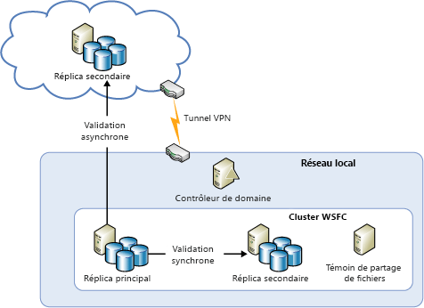
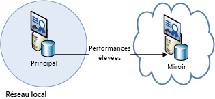
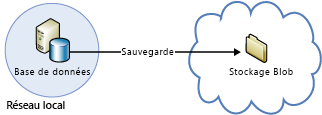

[!INCLUDE [header](../_includes/header.md)]

# Guide technique de la résilience Azure : récupération de l’environnement local vers AzureAzure resiliency technical guidance: Recovery from on-premises to Azure
Azure offre un ensemble complet de services conçus pour étendre un centre de données local vers Azure afin de faciliter la récupération d’urgence et de garantir une haute disponibilité :Azure provides a comprehensive set of services for enabling the extension of an on-premises datacenter to Azure for high availability and disaster recovery purposes:

* **Réseau** : l’utilisation d’un réseau privé virtuel vous permet d’étendre en toute sécurité votre réseau local vers le cloud.**Networking**: With a virtual private network, you securely extend your on-premises network to the cloud.
* **Calcul**: les clients qui utilisent Hyper-V en local peuvent « élever et déplacer » des machines virtuelles existantes vers Azure.**Compute**: Customers using Hyper-V on-premises can “lift and shift” existing virtual machines (VMs) to Azure.
* **Stockage** : StorSimple étend votre système de fichiers à Azure Storage.**Storage**: StorSimple extends your file system to Azure Storage. Le service Azure Backup assure la sauvegarde des fichiers et des bases de données SQL dans Azure Storage.The Azure Backup service provides backup for files and SQL databases to Azure Storage.
* **Réplication de base de données** : grâce aux groupes de disponibilité SQL Server 2014 (ou version ultérieure), vous pouvez garantir la haute disponibilité et la récupération d’urgence de vos données locales.**Database replication**: With SQL Server 2014 (or later) Availability Groups, you can implement high availability and disaster recovery for your on-premises data.

## Mise en réseauNetworking
Vous pouvez utiliser le réseau virtuel Azure pour créer une section isolée logiquement dans Azure et la connecter en toute sécurité à votre centre de données local ou à un seul ordinateur client à l’aide d’une connexion IPsec.You can use Azure Virtual Network to create a logically isolated section in Azure and securely connect it to your on-premises datacenter or a single client machine by using an IPsec connection. Grâce au réseau virtuel, vous pouvez tirer parti de l’infrastructure évolutive et à la demande d’Azure tout en assurant la connectivité aux données et aux applications locales, y compris aux systèmes s’exécutant sur Windows Server, les ordinateurs centraux et les systèmes UNIX.With Virtual Network, you can take advantage of the scalable, on-demand infrastructure in Azure while providing connectivity to data and applications on-premises, including systems running on Windows Server, mainframes, and UNIX. Pour plus d’informations, consultez la [documentation réseau d’Azure](/azure/virtual-network/virtual-networks-overview/) .See [Azure networking documentation](/azure/virtual-network/virtual-networks-overview/) for more information.

## CalculCompute
Si vous utilisez Hyper-V en local, vous pouvez « élever et déplacer » des machines virtuelles existantes vers Azure et vers des fournisseurs de services exécutant Windows Server 2012 (ou version ultérieure), sans avoir à apporter de modifications à la machine virtuelle ni à la convertir dans un autre format.If you're using Hyper-V on-premises, you can “lift and shift” existing virtual machines to Azure and service providers running Windows Server 2012 (or later), without making changes to the VM or converting VM formats. Pour plus d’informations, consultez l’article [À propos des disques et des VHD pour les machines virtuelles Azure](/azure/virtual-machines/virtual-machines-linux-about-disks-vhds/?toc=%2fazure%2fvirtual-machines%2flinux%2ftoc.json).For more information, see [About disks and VHDs for Azure virtual machines](/azure/virtual-machines/virtual-machines-linux-about-disks-vhds/?toc=%2fazure%2fvirtual-machines%2flinux%2ftoc.json).

## Azure Site RecoveryAzure Site Recovery
Si vous souhaitez bénéficier d’une récupération d’urgence en tant que service (DRaaS), vous pouvez utiliser [Azure Site Recovery](https://azure.microsoft.com/services/site-recovery/).If you want disaster recovery as a service (DRaaS), Azure provides [Azure Site Recovery](https://azure.microsoft.com/services/site-recovery/). Azure Site Recovery offre une protection complète pour les serveurs VMware, Hyper-V et physiques.Azure Site Recovery offers comprehensive protection for VMware, Hyper-V, and physical servers. Avec Azure Site Recovery, vous pouvez utiliser un autre serveur local ou Azure comme site de récupération.With Azure Site Recovery, you can use another on-premises server or Azure as your recovery site. Pour plus d’informations sur Azure Site Recovery, consultez la [Documentation d’Azure Site Recovery](https://azure.microsoft.com/documentation/services/site-recovery/).For more information on Azure Site Recovery, see the [Azure Site Recovery documentation](https://azure.microsoft.com/documentation/services/site-recovery/).

## StockageStorage
Pour utiliser Azure comme site de sauvegarde pour les données locales, vous disposez de plusieurs options.There are several options for using Azure as a backup site for on-premises data.

### StorSimpleStorSimple
StorSimple intègre le stockage cloud en toute sécurité et en toute transparence pour les applications locales.StorSimple securely and transparently integrates cloud storage for on-premises applications. Il propose également une appliance unique conçue pour garantir un stockage en local et dans le cloud hiérarchisé et performant, tout en offrant des fonctions d’archivage dynamique, de protection des données dans le cloud et de récupération d’urgence.It also offers a single appliance that delivers high-performance tiered local and cloud storage, live archiving, cloud-based data protection, and disaster recovery. Pour plus d’informations, consultez la [page produit StorSimple](https://azure.microsoft.com/services/storsimple/).For more information, see the [StorSimple product page](https://azure.microsoft.com/services/storsimple/).

### Sauvegarde AzureAzure Backup
Azure Backup exécute des sauvegardes dans le cloud à l’aide des outils de sauvegarde classiques de Windows Server 2012 (ou version ultérieure), de Windows Server 2012 Essentials (ou version ultérieure) et de System Center 2012 Data Protection Manager (ou version ultérieure).Azure Backup enables cloud backups by using the familiar backup tools in Windows Server 2012 (or later), Windows Server 2012 Essentials (or later), and System Center 2012 Data Protection Manager (or later). Ces outils établissent pour la gestion des sauvegarde un workflow totalement indépendant de l’emplacement de stockage des sauvegardes, qu’il s’agisse d’un disque local ou d’Azure Storage.These tools provide a workflow for backup management that is independent of the storage location of the backups, whether a local disk or Azure Storage. Une fois les données sauvegardées dans le cloud, les utilisateurs autorisés peuvent facilement restaurer les sauvegardes sur un serveur.After data is backed up to the cloud, authorized users can easily recover backups to any server.

Avec les sauvegardes incrémentielles, seules les modifications des fichiers sont transférées dans le cloud.With incremental backups, only changes to files are transferred to the cloud. Cela permet d’utiliser efficacement le stockage, de réduire la consommation de bande passante et d’assurer une récupération à tout moment des différentes versions des données.This helps to efficiently use storage space, reduce bandwidth consumption, and support point-in-time recovery of multiple versions of the data. Vous pouvez également choisir d’utiliser des fonctionnalités supplémentaires, telles que les stratégies de rétention des données, la compression des données et la limitation du transfert de données.You can also choose to use additional features, such as data retention policies, data compression, and data transfer throttling. L’utilisation d’Azure comme emplacement de sauvegarde a l’avantage d’offrir des sauvegardes qui sont automatiquement exécutées « hors site ».Using Azure as the backup location has the obvious advantage that the backups are automatically “offsite”. Cette approche vous évite d’avoir à sécuriser et protéger vos supports de sauvegarde sur site.This eliminates the extra requirements to secure and protect on-site backup media.

Pour plus d’informations, consultez [Qu’est-ce qu’Azure Backup ?](/azure/backup/backup-introduction-to-azure-backup/) et [Configuration d’une sauvegarde Azure pour des données DPM](https://technet.microsoft.com/library/jj728752.aspx).For more information, see [What is Azure Backup?](/azure/backup/backup-introduction-to-azure-backup/) and [Configure Azure Backup for DPM data](https://technet.microsoft.com/library/jj728752.aspx).

## Base de donnéesDatabase
Vous pouvez disposer d’une solution de récupération d’urgence pour vos bases de données SQL Server dans un environnement informatique hybride utilisant des groupes de disponibilité AlwaysOn, la mise en miroir de bases de données, la copie des journaux de transaction et la sauvegarde et la restauration avec le stockage d’objets blob Azure.You can have a disaster recovery solution for your SQL Server databases in a hybrid-IT environment by using AlwaysOn Availability Groups, database mirroring, log shipping, and backup and restore with Azure Blob storage. Toutes ces solutions utilisent une implémentation SQL Server exécutée sur Azure Virtual Machines.All of these solutions use SQL Server running on Azure Virtual Machines.

Les groupes de disponibilité AlwaysOn peuvent être utilisés dans un environnement informatique hybride comportant des réplicas de base de données à la fois en local et dans le cloud.AlwaysOn Availability Groups can be used in a hybrid-IT environment where database replicas exist both on-premises and in the cloud. Cette situation est présentée dans le diagramme suivant.This is shown in the following diagram.

La mise en miroir de base de données peut également s’étendre à la fois à des serveurs locaux et au cloud dans une installation basée sur un certificat.Database mirroring can also span on-premises servers and the cloud in a certificate-based setup. Le schéma suivant illustre ce concept.The following diagram illustrates this concept.

L’envoi de journaux peut être utilisé pour synchroniser une base de données locale avec une base de données SQL Server dans une machine virtuelle Azure.Log shipping can be used to synchronize an on-premises database with a SQL Server database in an Azure virtual machine.

Vous pouvez enfin sauvegarder une base de données locale directement dans Azure Blob Storage.Finally, you can back up an on-premises database directly to Azure Blob storage.

Pour plus d’informations, consultez [Haute disponibilité et récupération d’urgence pour SQL Server sur des machines virtuelles Azure](/azure/virtual-machines/windows/sql/virtual-machines-windows-sql-high-availability-dr/) et [Sauvegarde et restauration de SQL Server dans les machines virtuelles Azure](/azure/virtual-machines/windows/sql/virtual-machines-windows-sql-backup-recovery/).For more information, see [High availability and disaster recovery for SQL Server in Azure virtual machines](/azure/virtual-machines/windows/sql/virtual-machines-windows-sql-high-availability-dr/) and [Backup and restore for SQL Server in Azure virtual machines](/azure/virtual-machines/windows/sql/virtual-machines-windows-sql-backup-recovery/).

## Listes de vérification pour la récupération des données locales dans Microsoft AzureChecklists for on-premises recovery in Microsoft Azure
### Mise en réseauNetworking
1. Consultez la section Mise en réseau de ce document.Review the Networking section of this document.
2. Utilisez un réseau virtuel pour connecter en toute sécurité votre environnement local au cloud.Use Virtual Network to securely connect on-premises to the cloud.

### CalculCompute
1. Consultez la section Calcul de ce document.Review the Compute section of this document.
2. Déplacez des machines virtuelles entre Hyper-V et Azure.Relocate VMs between Hyper-V and Azure.

### StockageStorage
1. Consultez la section Stockage de ce document.Review the Storage section of this document.
2. Utilisez les services StorSimple pour tirer parti du stockage cloud.Take advantage of StorSimple services for using cloud storage.
3. Utilisez le service Azure Backup.Use the Azure Backup service.

### Base de donnéesDatabase
1. Consultez la section Base de données de ce document.Review the Database section of this document.
2. Envisagez d’utiliser comme sauvegarde une instance SQL Server exécutée sur des machines virtuelles Azure.Consider using SQL Server on Azure VMs as the backup.
3. Configurez les groupes de disponibilité AlwaysOn.Set up AlwaysOn Availability Groups.
4. Configurez la mise en miroir de base de données basée sur un certificat.Configure certificate-based database mirroring.
5. Utilisez l’envoi de journaux.Use log shipping.
6. Sauvegardez les bases de données locales dans Azure Blob Storage.Back up on-premises databases to Azure Blob storage.

