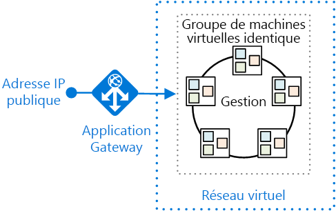
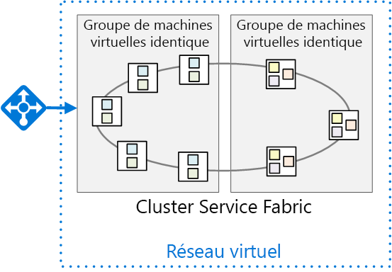

# <a name="migrate-an-azure-cloud-services-application-to-azure-service-fabric"></a>Migrer une application Azure Cloud Services vers Azure Service Fabric 

[ Exemple de code][sample-code]

Cet article explique comment migrer une application à partir d’Azure Cloud Services vers Azure Service Fabric. Il se concentre sur les décisions architecturales et les pratiques recommandées. 

Pour ce projet, nous avons commencé avec une application Cloud Services appelée Surveys que nous avons déplacée dans Service Fabric. L’objectif était de migrer l’application avec le moins de modifications possible. Dans un prochain article, nous optimiserons l’application pour Service Fabric en adoptant une architecture de microservices.

Avant de lire cet article, il sera utile de comprendre les principes fondamentaux de Service Fabric et des architectures de microservices en général. Consultez les articles suivants :

- [Vue d’ensemble d’Azure Service Fabric][sf-overview]
- [Pourquoi adopter une approche de microservices pour la conception d’applications ?][sf-why-microservices]


## <a name="about-the-surveys-application"></a>À propos de l’application Surveys

En 2012, le groupe Patterns & Practices a créé une application appelée Surveys pour un livre appelé [Developing Multi-tenant Applications for the Cloud][tailspin-book] (Développement d’applications multilocataires pour le cloud). Dans cet ouvrage, une société fictive nommée Tailspin conçoit et implémente l’application Surveys.

Surveys est une application multilocataire qui permet aux clients de créer des enquêtes. Une fois qu’un client s’est inscrit à l’application, les membres de l’organisation du client peuvent créer et publier des enquêtes, et collecter les résultats à des fins d’analyse. L’application inclut un site web public sur lequel les utilisateurs peuvent participer à une enquête. Pour en savoir plus sur le scénario Tailspin d’origine, cliquez [ici][tailspin-scenario].

Tailspin souhaite désormais déplacer l’application Surveys vers une architecture de microservices en utilisant une infrastructure Service Fabric exécutée dans Azure. Étant donné que l’application est déjà déployée en tant qu’application Cloud Services, Tailspin adopte une approche en deux phases :

1.  Déplacement des services cloud vers Service Fabric tout en limitant les modifications apportées à l’application.
2.  Optimisation de l’application pour Service Fabric en la déplaçant vers une architecture de microservices.

Cet article décrit la première phase. La deuxième phase fera l’objet d’un prochain article. Dans un projet réel, il est probable que les deux phases se déroulent en même temps. En même temps que vous effectuerez le déplacement vers Service Fabric, vous commencerez à redéfinir l’architecture de l’application en une infrastructure de microservices. Plus tard, vous pourrez continuer à affiner l’infrastructure, par exemple en divisant les services à granularité grossière en services de plus petite taille.  

Le code de l’application est disponible sur [GitHub][sample-code]. Ce référentiel contient à la fois l’application Cloud Services et la version Service Fabric. 

> Le service cloud est une version mise à jour de l’application d’origine présentée dans l’ouvrage *Developing Multi-tenant Applications for the Cloud*.

## <a name="why-microservices"></a>Intérêt des microservices

Si cet article n’aborde pas réellement la question des microservices, vous trouverez néanmoins ci-dessous quelques-uns des avantages dont la société Tailspin espère bénéficier en migrant vers une architecture de microservices :

- **Mises à niveau d’applications**. Les services peuvent être déployés indépendamment, ce qui vous permet de mettre à niveau les applications de manière incrémentielle.
- **Résilience et isolation des erreurs**. Si un service échoue, les autres services continuent de fonctionner.
- **Extensibilité**. Les services peuvent être mis à l’échelle de manière indépendante.
- **Flexibilité**. Les services sont conçus à partir de scénarios spécifiques à l’entreprise et non de piles technologiques, ce qui simplifie la migration des services vers de nouvelles technologies, infrastructures ou banques de données.
- **Développement agile**. Les services individuels ont moins de code qu’une application monolithique, ce qui facilite la compréhension, l’analyse et le test de la base de code.
- **Équipes spécialisées de taille restreinte**. Étant donné que l’application est divisée en de nombreux services de petite taille, chaque service peut être créé par une équipe spécialisée de taille restreinte.

## <a name="why-service-fabric"></a>Pourquoi choisir Service Fabric
      
Service Fabric est la solution idéale pour les architectures de microservices, car la plupart des fonctionnalités nécessaires dans un système distribué sont intégrées à l’infrastructure Service Fabric, notamment :

- **Gestion du cluster**. Service Fabric gère automatiquement le basculement des nœuds, le contrôle d’intégrité et d’autres fonctions de gestion de cluster.
- **Mise à l’échelle horizontale**. Lorsque vous ajoutez des nœuds à un cluster Service Fabric, l’application est automatiquement mise à l’échelle à mesure que les services sont distribués sur les nouveaux nœuds.
- **Détection des services**. Service Fabric propose un service de détection capable d’identifier le point de terminaison pour un service spécifique.
- **Services sans état et avec état**. Les services avec état utilisent des [collections fiables][sf-reliable-collections] qui peuvent remplacer un cache ou une file d’attente, et qui peuvent être partitionnées.
- **Gestion du cycle de vie des applications**. Les services peuvent être mis à niveau de manière indépendante et sans temps d’arrêt de l’application.
- **Service d’orchestration** couvrant un cluster complet de machines.
- **Densité plus élevée** pour optimiser la consommation de ressources. Un seul nœud peut héberger plusieurs services.

Service Fabric est utilisé par différents services Microsoft, notamment Azure SQL Database, Cosmos DB ou encore Azure Event Hubs, ce qui en fait une plateforme éprouvée pour la conception d’applications cloud distribuées. 

## <a name="comparing-cloud-services-with-service-fabric"></a>Cloud Services vs. Service Fabric

Le tableau suivant présente quelques-unes des principales différences entre les applications Cloud Services et les applications Service Fabric. Pour en savoir plus, consultez l’article [Découvrez les différences entre les services cloud et Service Fabric avant de migrer les applications][sf-compare-cloud-services].

|        | Cloud Services | Service Fabric |
|--------|---------------|----------------|
| Composition de l’application | contrôleur| Services |
| Densité |Une instance de rôle par machine virtuelle | Plusieurs services par nœud |
| Nombre minimal de nœuds | 2 par rôle | 5 par cluster, pour les déploiements de production |
| Gestion de l'état | Sans état | Sans état ou avec état* |
| Hébergement | Azure | Cloud ou local |
| Hébergement web | IIS** | Auto-hébergement |
| Modèle de déploiement | [Modèle de déploiement classique][azure-deployment-models] | [Gestionnaire des ressources][azure-deployment-models]  |
| Packaging | Package de fichiers de services cloud | Packages d’application et de service |
| Mise à jour d’application | Échange d’adresses IP virtuelles ou mise à jour propagée | Mise à jour propagée |
| Mise à l’échelle automatique | [Service intégré][cloud-service-autoscale] | VM Scale Sets pour la mise à l’échelle automatique |
| Débogage | Émulateur local | Cluster local |


\* Les services avec état utilisent des [collections fiables][sf-reliable-collections] pour stocker l’état des différents réplicas. Ainsi, toutes les lectures s’effectuent localement au niveau des nœuds du cluster. Les écritures sont répliquées sur plusieurs nœuds pour offrir une meilleure fiabilité. Les services sans état peuvent avoir un état externe via l’utilisation d’une base de données ou d’un autre support de stockage externe.

** Les rôles de travail peuvent également auto-héberger l’API Web ASP.NET à l’aide d’un hôte OWIN.

## <a name="the-surveys-application-on-cloud-services"></a>L’application Surveys dans Cloud Services

Le diagramme suivant illustre l’architecture de l’application Surveys en cours d’exécution dans Cloud Services. 


L’application se compose de deux rôles web et d’un rôle de travail.

- Le rôle web **Tailspin.Web** héberge un site web ASP.NET que les clients de Tailspin utilisent pour créer et gérer des enquêtes. Les clients utilisent également ce site web pour s’inscrire à l’application et gérer leurs abonnements. Enfin, les administrateurs de Tailspin peuvent utiliser ce site web pour afficher la liste des locataires et gérer les données associées. 

- Le rôle web **Tailspin.Web.Survey.Public** héberge un site web ASP.NET sur lequel les utilisateurs peuvent répondre aux enquêtes publiées par les clients de Tailspin. 

- Le rôle de travail **Tailspin.Workers.Survey** est chargé du traitement en arrière-plan. Les rôles web placent les éléments de travail dans une file d’attente, et le rôle de travail traite les éléments. Deux tâches en arrière-plan sont définies : export des réponses de l’enquête dans la base de données SQL Azure, et calcul des statistiques relatives aux réponses de l’enquête.

Outre Cloud Services, l’application Surveys utilise d’autres services Azure :

- **Le stockage Azure** pour stocker les enquêtes, les réponses des enquêtes et les informations sur les locataires.

- **Le cache Redis Azure** pour mettre en cache certaines des données qui sont stockées dans le stockage Azure pour accélérer l’accès en lecture. 

- **Azure Active Directory** (Azure AD) pour authentifier les clients et les administrateurs de Tailspin.

- **SQL Azure Database** pour stocker les réponses de l’enquête en vue de leur analyse. 

## <a name="moving-to-service-fabric"></a>Migrer vers Service Fabric

Comme indiqué précédemment, l’objectif de cette phase était d’opérer une migration vers Service Fabric avec le moins de modifications possible. Pour ce faire, nous avons créé des services sans état correspondant à chaque rôle du service cloud dans l’application d’origine :


Intentionnellement, cette architecture est très similaire à l’application d’origine. Toutefois, le schéma masque certaines différences importantes. Ces différences seront abordées dans la suite de cet article. 


## <a name="converting-the-cloud-service-roles-to-services"></a>Convertir les rôles de service cloud en services

Comme mentionné précédemment, nous avons migré chaque rôle de service cloud vers un service Service Fabric. Étant donné que les rôles de service cloud sont sans état, il était logique, à ce stade, de créer des services sans état dans Service Fabric. 

Pour la migration, nous avons suivi les étapes décrites dans le [Guide de conversion des rôles web et de travail en services sans état Service Fabric][sf-migration]. 

### <a name="creating-the-web-front-end-services"></a>Création des services web frontaux

Dans Service Fabric, un service s’exécute au sein d’un processus créé par le runtime Service Fabric. Pour un serveur web frontal, cela signifie que le service n’est pas exécuté au sein d’IIS. Au lieu de cela, le service doit héberger un serveur web. Cette approche est appelée *auto-hébergement*, car le code qui s’exécute au sein du processus joue le rôle de l’hôte du serveur web. 

Cette nécessité d’auto-hébergement signifie qu’un service Service Fabric ne peut pas utiliser ASP.NET MVC ou ASP.NET Web Forms, car ces infrastructures nécessitent IIS et ne prennent pas en charge l’auto-hébergement. Voici quelques options d’auto-hébergement :

- [ASP.NET Core][aspnet-core], auto-hébergé à l’aide du serveur web [Kestrel][kestrel]. 
- [API Web ASP.NET][aspnet-webapi], auto-hébergée à l’aide d’un hôte [OWIN][owin].
- Infrastructures tierces telles que [Nancy](http://nancyfx.org/).

L’application Surveys d’origine utilise ASP.NET MVC. Étant donné qu’ASP.NET MVC ne peut pas être auto-hébergé dans Service Fabric, nous avons envisagé les options de migration suivantes :

- Déplacement des rôles web vers l’infrastructure ASP.NET Core qui peut être auto-hébergée.
- Conversion du site web en une application à page unique appelant une API web implémentée à l’aide de l’API Web ASP.NET. Cela aurait demandé une refonte complète du serveur web frontal.
- Conservation du code ASP.NET MVC existant et déploiement d’IIS au sein d’un conteneur Windows Server sur Service Fabric. Cette approche ne nécessite que peu ou pas de modifications de code. 

La première option a été de déplacer vers ASP.NET Core. Elle nous a permis de tirer parti des dernières fonctionnalités dans ASP.NET Core. Pour procéder à la conversion, nous avons suivi les étapes décrites dans l’article [Migrating From ASP.NET MVC to ASP.NET Core MVC][aspnet-migration] (Migration de ASP.NET MVC vers ASP.NET Core MVC). 

> [!NOTE]
> Pour des raisons de sécurité, lorsque vous utilisez ASP.NET Core avec Kestrel, vous devez placer un proxy inversé en amont du serveur Kestrel pour gérer le trafic en provenance d’Internet. Pour plus d’informations, consultez [Kestrel web server implementation in ASP.NET Core][kestrel] (Implémentation du serveur web Kestrel dans ASP.NET Core). La section [Déploiement de l’application](#deploying-the-application) décrit un déploiement Azure recommandé.

### <a name="http-listeners"></a>Écouteurs HTTP

Dans Cloud Services, un rôle web ou de travail expose un point de terminaison HTTP en le déclarant dans le [fichier de définition de service][cloud-service-endpoints]. Le rôle web doit avoir au moins un point de terminaison.

```xml
<!-- Cloud service endpoint -->
<Endpoints>
    <InputEndpoint name="HttpIn" protocol="http" port="80" />
</Endpoints>
```

De même, les points de terminaison Service Fabric sont déclarés dans un manifeste de service : 

```xml
<!-- Service Fabric endpoint -->
<Endpoints>
    <Endpoint Protocol="http" Name="ServiceEndpoint" Type="Input" Port="8002" />
</Endpoints>
```

Toutefois, à la différence d’un rôle de service cloud, les services Service Fabric peuvent être colocalisés dans le même nœud. Par conséquent, chaque service doit écouter sur un port distinct. Plus loin dans cet article, nous expliquerons comment les requêtes des clients sur le port 80 ou 443 sont acheminées vers le port approprié pour le service.

Un service doit créer explicitement des écouteurs pour chaque point de terminaison. Cela s’explique par le fait que Service Fabric est indépendant en matière de piles de communication. Pour en savoir plus, consultez l’article [Créer un service web frontal pour votre application à l’aide d’ASP.NET Core][sf-aspnet-core].

## <a name="packaging-and-configuration"></a>Packaging et configuration

 Un service cloud contient les fichiers de configuration et de package suivants :

| Fichier | Description |
|------|-------------|
| Définition de service (.csdef) | Paramètres utilisés par Azure pour configurer le service cloud. Définit les rôles, les points de terminaison, les tâches de démarrage et les noms des paramètres de configuration. |
| Configuration de service (.cscfg) | Paramètres spécifiques à chaque déploiement, y compris le nombre d’instances de rôle, les numéros de port de point de terminaison et les valeurs des paramètres de configuration. 
| Package de service (.cspkg) | Contient le code d’application, les configurations et le fichier de définition de service.  |

Il existe un fichier .csdef pour l’ensemble de l’application. Vous pouvez avoir plusieurs fichiers .cscfg pour différents environnements, par exemple pour un environnement local, de test ou de production. Lorsque le service est en cours d’exécution, vous pouvez mettre à jour les fichiers .cscfg, mais pas le fichier .csdef. Pour plus d’informations, consultez [Qu’est-ce que le modèle Cloud Service, et comment en créer un package ?][cloud-service-config]

Service Fabric présente une répartition similaire entre la *définition* et les *paramètres* de service, mais la structure est plus granulaire. Pour comprendre le modèle de configuration de Service Fabric, vous devez comprendre comment une application Service Fabric est empaquetée. Voici la structure :

```
Application package
  - Service packages
    - Code package
    - Configuration package
    - Data package (optional)
```

Le package d’application est ce que vous déployez. Il contient un ou plusieurs packages de service. Un package de service contient les packages de code, de configuration et de données. Le package de code contient les fichiers binaires pour les services, et le package de configuration contient les paramètres de configuration. Ce modèle vous permet de mettre à niveau des services individuels sans avoir à redéployer toute l’application. Il vous permet également de mettre à jour uniquement les paramètres de configuration, sans redéployer le code ou redémarrer le service.

Une application Service Fabric contient les fichiers de configuration suivants :

| Fichier | Lieu | Description |
|------|----------|-------------|
| ApplicationManifest.xml | Package d’application | Définit les services qui composent l’application. |
| ServiceManifest.xml | Package de service| Décrit un ou plusieurs services. |
| Settings.xml | Package de configuration | Contient les paramètres de configuration pour les services définis dans le package de service. |

Pour plus d’informations, consultez [Modéliser une application dans Service Fabric][sf-application-model].

Pour prendre en charge les paramètres de configuration pour plusieurs environnements, utilisez l’approche suivante, décrite dans la section [Gestion des paramètres d’application pour plusieurs environnements][sf-multiple-environments] :

1. Définissez le paramètre dans le fichier Setting.xml pour le service.
2. Dans le manifeste d’application, définissez un remplacement pour le paramètre.
3. Placez les paramètres spécifiques à l’environnement dans les fichiers de paramètres d’application.


## <a name="deploying-the-application"></a>Déploiement de l’application

Alors qu’Azure Cloud Services est un service managé, Service Fabric est un runtime. Vous pouvez créer des clusters Service Fabric dans de nombreux environnements, notamment dans Azure ou dans un environnement local. Dans cet article, nous nous concentrons sur le déploiement dans Azure. 

Le schéma suivant présente un déploiement recommandé :



Le cluster Service Fabric est déployé sur un [groupe de machines virtuelles identiques][vm-scale-sets]. Les groupes de machines virtuelles identiques sont des ressources Azure Compute que vous pouvez utiliser pour déployer et gérer un ensemble de machines virtuelles identiques. 

Comme indiqué, le serveur web Kestrel nécessite un proxy inversé pour des raisons de sécurité. Ce schéma illustre la [passerelle d’application Azure][application-gateway], qui est un service Azure fournissant diverses fonctionnalités d’équilibrage de charge de couche 7. Il agit comme un service de proxy inversé, qui met fin à la connexion du client et transfère les requêtes vers les points de terminaison principaux. Vous pouvez utiliser une autre solution de proxy inversé telle que nginx.  

### <a name="layer-7-routing"></a>Routage de couche 7

Dans [l’application Surveys d’origine](https://msdn.microsoft.com/library/hh534477.aspx#sec21), un rôle web écoutait sur le port 80 et l’autre rôle web écoutait sur le port 443. 

| Site public | Site de gestion d’enquête |
|-------------|------------------------|
| `http://tailspin.cloudapp.net` | `https://tailspin.cloudapp.net` |

L’autre possibilité consiste à utiliser le routage de couche 7. Avec cette approche, différents chemins d’accès à l’URL sont acheminés vers différents numéros de ports sur le serveur principal. Par exemple, le site public peut utiliser des chemins d’accès commençant par `/public/`. 

Les options pour le routage de couche 7 sont les suivantes :

- Utilisation d’Application Gateway. 

- Utilisation d’une appliance réseau virtuelle telle que nginx.

- Écriture d’une passerelle personnalisée sous la forme d’un service sans état.

Envisagez cette approche si vous disposez de deux ou plusieurs services avec des points de terminaison HTTP publics, mais que vous souhaitez faire apparaître sous la forme d’un site avec un nom de domaine unique.

> Une approche que nous *ne recommandons pas* est d’autoriser les clients externes à envoyer des demandes via le [proxy inversé][sf-reverse-proxy] Service Fabric. Bien que cela soit possible, le proxy inversé est prévu pour les communications de service à service. Ouvrir ce proxy à des clients externes expose *tout* service en cours d’exécution dans le cluster disposant d’un point de terminaison HTTP.

### <a name="node-types-and-placement-constraints"></a>Types de nœud et contraintes de placement

Dans le déploiement illustré ci-dessus, tous les services s’exécutent sur l’ensemble des nœuds. Toutefois, vous pouvez également regrouper des services, afin que certains services s’exécutent uniquement sur certains nœuds du cluster. Avantages de cette approche :

- Exécutez des services sur différents types de machine virtuelle. Par exemple, certains services peuvent consommer beaucoup de ressources système ou nécessiter des GPU. Vous pouvez avoir différents types de machine virtuelle dans votre cluster Service Fabric.
- Isolez les services frontaux des services principaux pour des raisons de sécurité. Tous les services frontaux seront exécutés sur un ensemble de nœuds unique, et les services principaux seront exécutés sur différents nœuds dans le même cluster.
- Répondez à différents besoins de mise à l’échelle. Certains services devront peut-être être exécutés sur davantage de nœuds que d’autres services. Par exemple, si vous définissez des nœuds frontaux et des nœuds principaux, chaque ensemble peut être mis à l’échelle de manière indépendante.

Le schéma suivant illustre un cluster qui sépare les services frontaux et les services principaux :



Pour implémenter cette approche :

1.  Lorsque vous créez le cluster, définissez deux ou plusieurs types de nœuds. 
2.  Pour chaque service, utilisez [les contraintes de placement][sf-placement-constraints] pour affecter le service à un type de nœud.

Lorsque vous déployez dans Azure, chaque type de nœud est déployé sur un groupe de machines virtuelles identiques distinct. Le cluster Service Fabric s’étend sur tous les types de nœuds. Pour en savoir plus, consultez [Relation entre les types de nœuds Service Fabric et les groupes de machines virtuelles identiques][sf-node-types].

> Si un cluster a plusieurs types de nœud, un type de nœud est désigné comme type de nœud *principal*. Les services d’exécution Service Fabric, tels que le service de gestion de cluster, s’exécutent sur le type de nœud principal. Provisionnez au moins 5 nœuds pour le type de nœud principal dans un environnement de production. L’autre type de nœud doit avoir au moins 2 nœuds.

## <a name="configuring-and-managing-the-cluster"></a>Configuration et gestion du cluster

Vous devez sécuriser vos clusters pour empêcher les utilisateurs non autorisés de s’y connecter. Il est recommandé d’utiliser Azure AD pour authentifier les clients et les certificats X.509 afin de garantir la sécurité de nœud à nœud. Pour plus d’informations, consultez [Scénarios de sécurité d’un cluster Service Fabric][sf-security].

Pour configurer un point de terminaison HTTPS public, consultez [Spécifier des ressources dans un manifeste de service][sf-manifest-resources].

Vous pouvez faire évoluer l’application en ajoutant des machines virtuelles au cluster. Les groupes de machines virtuelles identiques prennent en charge la mise à l’échelle automatique à l’aide de règles de mise à l’échelle automatique basées sur les compteurs de performance. Pour plus d’informations, consultez l’article [Augmenter ou diminuer la taille des instances d’un cluster Service Fabric à l’aide de règles de mise à l’échelle automatique][sf-auto-scale].

Lorsque le cluster est en cours d’exécution, vous devez collecter les journaux à partir de tous les nœuds dans un emplacement central. Pour plus d’informations, consultez [Collecte des journaux avec Azure Diagnostics][sf-logs].   


## <a name="conclusion"></a>Conclusion

Déplacer l’application Surveys vers Service Fabric était relativement simple. Pour résumer, nous avons procédé comme suit :

- Conversion des rôles en services sans état.
- Conversion des serveurs web frontaux vers ASP.NET Core.
- Modification des fichiers de package et de configuration pour le modèle Service Fabric.

En outre, le déploiement Cloud Services a été remplacé par un cluster Service Fabric s’exécutant dans un groupe de machines virtuelles identiques.

## <a name="next-steps"></a>Étapes suivantes

Maintenant que l’application Surveys a été correctement déplacée, Tailspin souhaite tirer parti des fonctionnalités de l’infrastructure de Service Fabric telles que le déploiement de services indépendants et le contrôle de version. Découvrez comment Tailspin décompose ces services en une architecture plus granulaire pour tirer parti de ces fonctionnalités de Service Fabric dans [Refactoriser une application Azure Service Fabric migrée depuis Azure Cloud Services][refactor-surveys]

<!-- links -->

[application-gateway]: /azure/application-gateway/
[aspnet-core]: /aspnet/core/
[aspnet-webapi]: https://www.asp.net/web-api
[aspnet-migration]: /aspnet/core/migration/mvc
[aspnet-hosting]: /aspnet/core/fundamentals/hosting
[aspnet-webapi]: https://www.asp.net/web-api
[azure-deployment-models]: /azure/azure-resource-manager/resource-manager-deployment-model
[cloud-service-autoscale]: /azure/cloud-services/cloud-services-how-to-scale-portal
[cloud-service-config]: /azure/cloud-services/cloud-services-model-and-package
[cloud-service-endpoints]: /azure/cloud-services/cloud-services-enable-communication-role-instances#worker-roles-vs-web-roles
[kestrel]: https://docs.microsoft.com/aspnet/core/fundamentals/servers/kestrel
[lb-probes]: /azure/load-balancer/load-balancer-custom-probe-overview
[owin]: https://www.asp.net/aspnet/overview/owin-and-katana
[refactor-surveys]: refactor-migrated-app.md
[sample-code]: https://github.com/mspnp/cloud-services-to-service-fabric
[sf-application-model]: /azure/service-fabric/service-fabric-application-model
[sf-aspnet-core]: /azure/service-fabric/service-fabric-add-a-web-frontend
[sf-auto-scale]: /azure/service-fabric/service-fabric-cluster-scale-up-down
[sf-compare-cloud-services]: /azure/service-fabric/service-fabric-cloud-services-migration-differences
[sf-connect-and-communicate]: /azure/service-fabric/service-fabric-connect-and-communicate-with-services
[sf-containers]: /azure/service-fabric/service-fabric-containers-overview
[sf-logs]: /azure/service-fabric/service-fabric-diagnostics-how-to-setup-wad
[sf-manifest-resources]: /azure/service-fabric/service-fabric-service-manifest-resources
[sf-migration]: /azure/service-fabric/service-fabric-cloud-services-migration-worker-role-stateless-service
[sf-multiple-environments]: /azure/service-fabric/service-fabric-manage-multiple-environment-app-configuration
[sf-node-types]: /azure/service-fabric/service-fabric-cluster-nodetypes
[sf-overview]: /azure/service-fabric/service-fabric-overview
[sf-placement-constraints]: /azure/service-fabric/service-fabric-cluster-resource-manager-cluster-description
[sf-reliable-collections]: /azure/service-fabric/service-fabric-reliable-services-reliable-collections
[sf-reliable-services]: /azure/service-fabric/service-fabric-reliable-services-introduction
[sf-reverse-proxy]: /azure/service-fabric/service-fabric-reverseproxy
[sf-security]: /azure/service-fabric/service-fabric-cluster-security
[sf-why-microservices]: /azure/service-fabric/service-fabric-overview-microservices
[tailspin-book]: https://msdn.microsoft.com/library/ff966499.aspx
[tailspin-scenario]: https://msdn.microsoft.com/library/hh534482.aspx
[unity]: https://msdn.microsoft.com/library/ff647202.aspx
[vm-scale-sets]: /azure/virtual-machine-scale-sets/virtual-machine-scale-sets-overview
