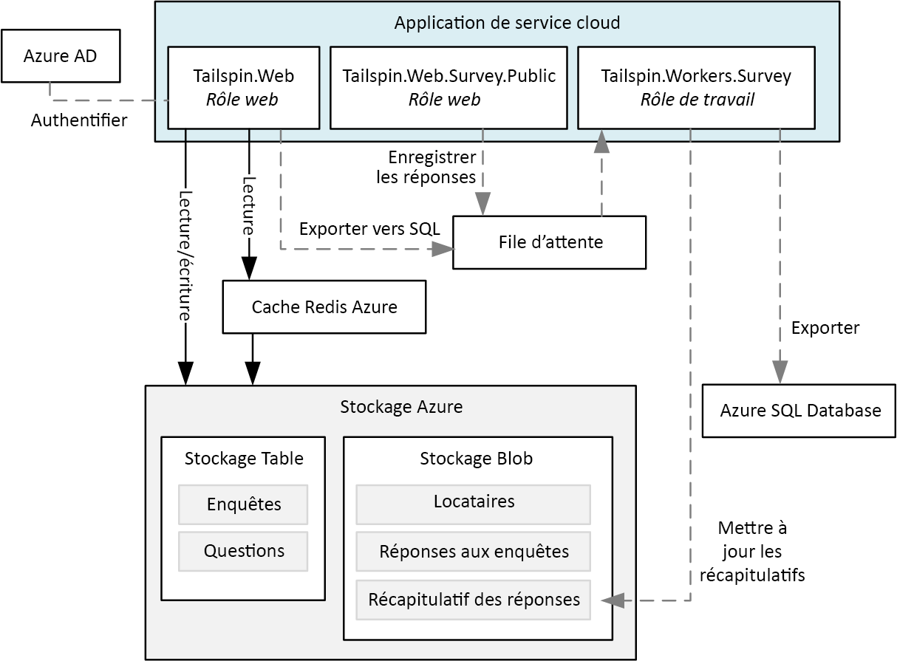
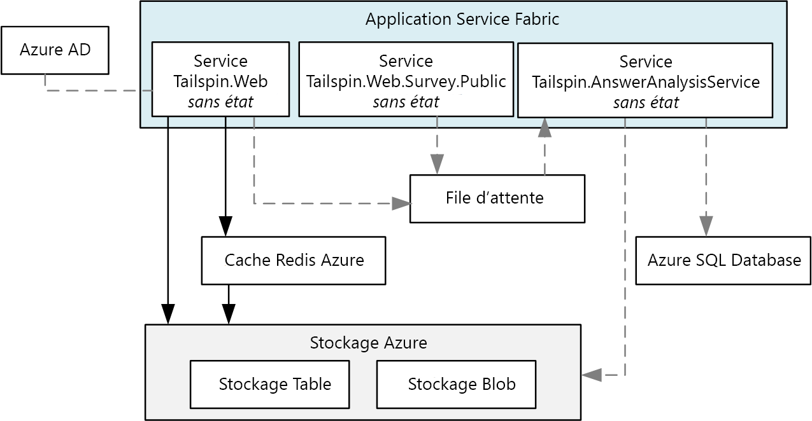

# <a name="migrate-an-azure-cloud-services-application-to-azure-service-fabric"></a><span data-ttu-id="6ece6-103">Migrer une application Azure Cloud Services vers Azure Service Fabric</span><span class="sxs-lookup"><span data-stu-id="6ece6-103">Migrate an Azure Cloud Services application to Azure Service Fabric</span></span> 

<span data-ttu-id="6ece6-104">[ Exemple de code][sample-code]</span><span class="sxs-lookup"><span data-stu-id="6ece6-104">[ Sample code][sample-code]</span></span>

<span data-ttu-id="6ece6-105">Cet article explique comment migrer une application à partir d’Azure Cloud Services vers Azure Service Fabric.</span><span class="sxs-lookup"><span data-stu-id="6ece6-105">This article describes migrating an application from Azure Cloud Services to Azure Service Fabric.</span></span> <span data-ttu-id="6ece6-106">Il se concentre sur les décisions architecturales et les pratiques recommandées.</span><span class="sxs-lookup"><span data-stu-id="6ece6-106">It focuses on architectural decisions and recommended practices.</span></span> 

<span data-ttu-id="6ece6-107">Pour ce projet, nous avons commencé avec une application Cloud Services appelée Surveys que nous avons déplacée dans Service Fabric.</span><span class="sxs-lookup"><span data-stu-id="6ece6-107">For this project, we started with a Cloud Services application called Surveys and ported it to Service Fabric.</span></span> <span data-ttu-id="6ece6-108">L’objectif était de migrer l’application avec le moins de modifications possible.</span><span class="sxs-lookup"><span data-stu-id="6ece6-108">The goal was to migrate the application with as few changes as possible.</span></span> <span data-ttu-id="6ece6-109">Dans un prochain article, nous optimiserons l’application pour Service Fabric en adoptant une architecture de microservices.</span><span class="sxs-lookup"><span data-stu-id="6ece6-109">In a later article, we will optimize the application for Service Fabric by adopting a microservices architecture.</span></span>

<span data-ttu-id="6ece6-110">Avant de lire cet article, il sera utile de comprendre les principes fondamentaux de Service Fabric et des architectures de microservices en général.</span><span class="sxs-lookup"><span data-stu-id="6ece6-110">Before reading this article, it will be useful to understand the basics of Service Fabric and microservices architectures in general.</span></span> <span data-ttu-id="6ece6-111">Consultez les articles suivants :</span><span class="sxs-lookup"><span data-stu-id="6ece6-111">See the following articles:</span></span>

- <span data-ttu-id="6ece6-112">[Vue d’ensemble d’Azure Service Fabric][sf-overview]</span><span class="sxs-lookup"><span data-stu-id="6ece6-112">[Overview of Azure Service Fabric][sf-overview]</span></span>
- <span data-ttu-id="6ece6-113">[Pourquoi adopter une approche de microservices pour la conception d’applications ?][sf-why-microservices]</span><span class="sxs-lookup"><span data-stu-id="6ece6-113">[Why a microservices approach to building applications?][sf-why-microservices]</span></span>


## <a name="about-the-surveys-application"></a><span data-ttu-id="6ece6-114">À propos de l’application Surveys</span><span class="sxs-lookup"><span data-stu-id="6ece6-114">About the Surveys application</span></span>

<span data-ttu-id="6ece6-115">En 2012, le groupe Patterns & Practices a créé une application appelée Surveys pour un livre appelé [Developing Multi-tenant Applications for the Cloud][tailspin-book] (Développement d’applications multilocataires pour le cloud).</span><span class="sxs-lookup"><span data-stu-id="6ece6-115">In 2012, the patterns & practices group created an application called Surveys, for a book called [Developing Multi-tenant Applications for the Cloud][tailspin-book].</span></span> <span data-ttu-id="6ece6-116">Dans cet ouvrage, une société fictive nommée Tailspin conçoit et implémente l’application Surveys.</span><span class="sxs-lookup"><span data-stu-id="6ece6-116">The book describes a fictitious company named Tailspin that designs and implements the Surveys application.</span></span>

<span data-ttu-id="6ece6-117">Surveys est une application multilocataire qui permet aux clients de créer des enquêtes.</span><span class="sxs-lookup"><span data-stu-id="6ece6-117">Surveys is a multitenant application that allows customers to create surveys.</span></span> <span data-ttu-id="6ece6-118">Une fois qu’un client s’est inscrit à l’application, les membres de l’organisation du client peuvent créer et publier des enquêtes, et collecter les résultats à des fins d’analyse.</span><span class="sxs-lookup"><span data-stu-id="6ece6-118">After a customer signs up for the application,  members of the customer's organization can create and publish surveys, and collect the results for analysis.</span></span> <span data-ttu-id="6ece6-119">L’application inclut un site web public sur lequel les utilisateurs peuvent participer à une enquête.</span><span class="sxs-lookup"><span data-stu-id="6ece6-119">The application includes a public website where people can take a survey.</span></span> <span data-ttu-id="6ece6-120">Pour en savoir plus sur le scénario Tailspin d’origine, cliquez [ici][tailspin-scenario].</span><span class="sxs-lookup"><span data-stu-id="6ece6-120">Read more about the original Tailspin scenario [here][tailspin-scenario].</span></span>

<span data-ttu-id="6ece6-121">Tailspin souhaite désormais déplacer l’application Surveys vers une architecture de microservices en utilisant une infrastructure Service Fabric exécutée dans Azure.</span><span class="sxs-lookup"><span data-stu-id="6ece6-121">Now Tailspin wants to move the Surveys application to a microservices architecture, using Service Fabric running on Azure.</span></span> <span data-ttu-id="6ece6-122">Étant donné que l’application est déjà déployée en tant qu’application Cloud Services, Tailspin adopte une approche en deux phases :</span><span class="sxs-lookup"><span data-stu-id="6ece6-122">Because the application is already deployed as a Cloud Services application, Tailspin adopts a multi-phase approach:</span></span>

1.  <span data-ttu-id="6ece6-123">Déplacement des services cloud vers Service Fabric tout en limitant les modifications apportées à l’application.</span><span class="sxs-lookup"><span data-stu-id="6ece6-123">Port the cloud services to Service Fabric, while minimizing changes to the application.</span></span>
2.  <span data-ttu-id="6ece6-124">Optimisation de l’application pour Service Fabric en la déplaçant vers une architecture de microservices.</span><span class="sxs-lookup"><span data-stu-id="6ece6-124">Optimize the application for Service Fabric, by moving to a microservices architecture.</span></span>

<span data-ttu-id="6ece6-125">Cet article décrit la première phase.</span><span class="sxs-lookup"><span data-stu-id="6ece6-125">This article describes the first phase.</span></span> <span data-ttu-id="6ece6-126">La deuxième phase fera l’objet d’un prochain article.</span><span class="sxs-lookup"><span data-stu-id="6ece6-126">A later article will describe the second phase.</span></span> <span data-ttu-id="6ece6-127">Dans un projet réel, il est probable que les deux phases se déroulent en même temps.</span><span class="sxs-lookup"><span data-stu-id="6ece6-127">In a real-world project, it's likely that both stages would overlap.</span></span> <span data-ttu-id="6ece6-128">En même temps que vous effectuerez le déplacement vers Service Fabric, vous commencerez à redéfinir l’architecture de l’application en une infrastructure de microservices.</span><span class="sxs-lookup"><span data-stu-id="6ece6-128">While porting to Service Fabric, you would also start to re-architect the application into micro-services.</span></span> <span data-ttu-id="6ece6-129">Plus tard, vous pourrez continuer à affiner l’infrastructure, par exemple en divisant les services à granularité grossière en services de plus petite taille.</span><span class="sxs-lookup"><span data-stu-id="6ece6-129">Later you might refine the architecture further, perhaps dividing coarse-grained services into smaller services.</span></span>  

<span data-ttu-id="6ece6-130">Le code de l’application est disponible sur [GitHub][sample-code].</span><span class="sxs-lookup"><span data-stu-id="6ece6-130">The application code is available on [GitHub][sample-code].</span></span> <span data-ttu-id="6ece6-131">Ce référentiel contient à la fois l’application Cloud Services et la version Service Fabric.</span><span class="sxs-lookup"><span data-stu-id="6ece6-131">This repo contains both the Cloud Services application and the Service Fabric version.</span></span> 

> <span data-ttu-id="6ece6-132">Le service cloud est une version mise à jour de l’application d’origine présentée dans l’ouvrage *Developing Multi-tenant Applications for the Cloud*.</span><span class="sxs-lookup"><span data-stu-id="6ece6-132">The cloud service is an updated version of the original application from the *Developing Multi-tenant Applications* book.</span></span>

## <a name="why-microservices"></a><span data-ttu-id="6ece6-133">Intérêt des microservices</span><span class="sxs-lookup"><span data-stu-id="6ece6-133">Why Microservices?</span></span>

<span data-ttu-id="6ece6-134">Si cet article n’aborde pas réellement la question des microservices, vous trouverez néanmoins ci-dessous quelques-uns des avantages dont la société Tailspin espère bénéficier en migrant vers une architecture de microservices :</span><span class="sxs-lookup"><span data-stu-id="6ece6-134">An in-depth discussion of microservices is beyond scope of this article, but here are some of the benefits that Tailspin hopes to get by moving to a microservices architecture:</span></span>

- <span data-ttu-id="6ece6-135">**Mises à niveau d’applications**.</span><span class="sxs-lookup"><span data-stu-id="6ece6-135">**Application upgrades**.</span></span> <span data-ttu-id="6ece6-136">Les services peuvent être déployés indépendamment, ce qui vous permet de mettre à niveau les applications de manière incrémentielle.</span><span class="sxs-lookup"><span data-stu-id="6ece6-136">Services can be deployed independently, so you can take an incremental approach to upgrading an application.</span></span>
- <span data-ttu-id="6ece6-137">**Résilience et isolation des erreurs**.</span><span class="sxs-lookup"><span data-stu-id="6ece6-137">**Resiliency and fault isolation**.</span></span> <span data-ttu-id="6ece6-138">Si un service échoue, les autres services continuent de fonctionner.</span><span class="sxs-lookup"><span data-stu-id="6ece6-138">If a service fails, other services continue to run.</span></span>
- <span data-ttu-id="6ece6-139">**Extensibilité**.</span><span class="sxs-lookup"><span data-stu-id="6ece6-139">**Scalability**.</span></span> <span data-ttu-id="6ece6-140">Les services peuvent être mis à l’échelle de manière indépendante.</span><span class="sxs-lookup"><span data-stu-id="6ece6-140">Services can be scaled independently.</span></span>
- <span data-ttu-id="6ece6-141">**Flexibilité**.</span><span class="sxs-lookup"><span data-stu-id="6ece6-141">**Flexibility**.</span></span> <span data-ttu-id="6ece6-142">Les services sont conçus à partir de scénarios spécifiques à l’entreprise et non de piles technologiques, ce qui simplifie la migration des services vers de nouvelles technologies, infrastructures ou banques de données.</span><span class="sxs-lookup"><span data-stu-id="6ece6-142">Services are designed around business scenarios, not technology stacks, making it easier to migrate services to new technologies, frameworks, or data stores.</span></span>
- <span data-ttu-id="6ece6-143">**Développement agile**.</span><span class="sxs-lookup"><span data-stu-id="6ece6-143">**Agile development**.</span></span> <span data-ttu-id="6ece6-144">Les services individuels ont moins de code qu’une application monolithique, ce qui facilite la compréhension, l’analyse et le test de la base de code.</span><span class="sxs-lookup"><span data-stu-id="6ece6-144">Individual services have less code than a monolithic application, making the code base easier to understand, reason about, and test.</span></span>
- <span data-ttu-id="6ece6-145">**Équipes spécialisées de taille restreinte**.</span><span class="sxs-lookup"><span data-stu-id="6ece6-145">**Small, focused teams**.</span></span> <span data-ttu-id="6ece6-146">Étant donné que l’application est divisée en de nombreux services de petite taille, chaque service peut être créé par une équipe spécialisée de taille restreinte.</span><span class="sxs-lookup"><span data-stu-id="6ece6-146">Because the application is broken down into many small services, each service can be built by a small focused team.</span></span>

## <a name="why-service-fabric"></a><span data-ttu-id="6ece6-147">Pourquoi choisir Service Fabric</span><span class="sxs-lookup"><span data-stu-id="6ece6-147">Why Service Fabric?</span></span>
      
<span data-ttu-id="6ece6-148">Service Fabric est la solution idéale pour les architectures de microservices, car la plupart des fonctionnalités nécessaires dans un système distribué sont intégrées à l’infrastructure Service Fabric, notamment :</span><span class="sxs-lookup"><span data-stu-id="6ece6-148">Service Fabric is a good fit for a microservices architecture, because most of the features needed in a distributed system are built into Service Fabric, including:</span></span>

- <span data-ttu-id="6ece6-149">**Gestion du cluster**.</span><span class="sxs-lookup"><span data-stu-id="6ece6-149">**Cluster management**.</span></span> <span data-ttu-id="6ece6-150">Service Fabric gère automatiquement le basculement des nœuds, le contrôle d’intégrité et d’autres fonctions de gestion de cluster.</span><span class="sxs-lookup"><span data-stu-id="6ece6-150">Service Fabric automatically handles node failover, health monitoring, and other cluster management functions.</span></span>
- <span data-ttu-id="6ece6-151">**Mise à l’échelle horizontale**.</span><span class="sxs-lookup"><span data-stu-id="6ece6-151">**Horizontal scaling**.</span></span> <span data-ttu-id="6ece6-152">Lorsque vous ajoutez des nœuds à un cluster Service Fabric, l’application est automatiquement mise à l’échelle à mesure que les services sont distribués sur les nouveaux nœuds.</span><span class="sxs-lookup"><span data-stu-id="6ece6-152">When you add nodes to a Service Fabric cluster, the application automatically scales, as services are distributed across the new nodes.</span></span>
- <span data-ttu-id="6ece6-153">**Détection des services**.</span><span class="sxs-lookup"><span data-stu-id="6ece6-153">**Service discovery**.</span></span> <span data-ttu-id="6ece6-154">Service Fabric propose un service de détection capable d’identifier le point de terminaison pour un service spécifique.</span><span class="sxs-lookup"><span data-stu-id="6ece6-154">Service Fabric provides a discovery service that can resolve the endpoint for a named service.</span></span>
- <span data-ttu-id="6ece6-155">**Services sans état et avec état**.</span><span class="sxs-lookup"><span data-stu-id="6ece6-155">**Stateless and stateful services**.</span></span> <span data-ttu-id="6ece6-156">Les services avec état utilisent des [collections fiables][sf-reliable-collections] qui peuvent remplacer un cache ou une file d’attente, et qui peuvent être partitionnées.</span><span class="sxs-lookup"><span data-stu-id="6ece6-156">Stateful services use [reliable collections][sf-reliable-collections], which can take the place of a cache or queue, and can be partitioned.</span></span>
- <span data-ttu-id="6ece6-157">**Gestion du cycle de vie des applications**.</span><span class="sxs-lookup"><span data-stu-id="6ece6-157">**Application lifecycle management**.</span></span> <span data-ttu-id="6ece6-158">Les services peuvent être mis à niveau de manière indépendante et sans temps d’arrêt de l’application.</span><span class="sxs-lookup"><span data-stu-id="6ece6-158">Services can be upgraded independently and without application downtime.</span></span>
- <span data-ttu-id="6ece6-159">**Service d’orchestration** couvrant un cluster complet de machines.</span><span class="sxs-lookup"><span data-stu-id="6ece6-159">**Service orchestration** across a cluster of machines.</span></span>
- <span data-ttu-id="6ece6-160">**Densité plus élevée** pour optimiser la consommation de ressources.</span><span class="sxs-lookup"><span data-stu-id="6ece6-160">**Higher density** for optimizing resource consumption.</span></span> <span data-ttu-id="6ece6-161">Un seul nœud peut héberger plusieurs services.</span><span class="sxs-lookup"><span data-stu-id="6ece6-161">A single node can host multiple services.</span></span>

<span data-ttu-id="6ece6-162">Service Fabric est utilisé par différents services Microsoft, notamment Azure SQL Database, Cosmos DB ou encore Azure Event Hubs, ce qui en fait une plateforme éprouvée pour la conception d’applications cloud distribuées.</span><span class="sxs-lookup"><span data-stu-id="6ece6-162">Service Fabric is used by various Microsoft services, including Azure SQL Database, Cosmos DB, Azure Event Hubs, and others, making it a proven platform for building distributed cloud applications.</span></span> 

## <a name="comparing-cloud-services-with-service-fabric"></a><span data-ttu-id="6ece6-163">Cloud Services vs. Service Fabric</span><span class="sxs-lookup"><span data-stu-id="6ece6-163">Comparing Cloud Services with Service Fabric</span></span>

<span data-ttu-id="6ece6-164">Le tableau suivant présente quelques-unes des principales différences entre les applications Cloud Services et les applications Service Fabric.</span><span class="sxs-lookup"><span data-stu-id="6ece6-164">The following table summarizes some of the important differences between Cloud Services and Service Fabric applications.</span></span> <span data-ttu-id="6ece6-165">Pour en savoir plus, consultez l’article [Découvrez les différences entre les services cloud et Service Fabric avant de migrer les applications][sf-compare-cloud-services].</span><span class="sxs-lookup"><span data-stu-id="6ece6-165">For a more in-depth discussion, see [Learn about the differences between Cloud Services and Service Fabric before migrating applications][sf-compare-cloud-services].</span></span>

|        | <span data-ttu-id="6ece6-166">Cloud Services</span><span class="sxs-lookup"><span data-stu-id="6ece6-166">Cloud Services</span></span> | <span data-ttu-id="6ece6-167">Service Fabric</span><span class="sxs-lookup"><span data-stu-id="6ece6-167">Service Fabric</span></span> |
|--------|---------------|----------------|
| <span data-ttu-id="6ece6-168">Composition de l’application</span><span class="sxs-lookup"><span data-stu-id="6ece6-168">Application composition</span></span> | <span data-ttu-id="6ece6-169">contrôleur</span><span class="sxs-lookup"><span data-stu-id="6ece6-169">Roles</span></span>| <span data-ttu-id="6ece6-170">Services</span><span class="sxs-lookup"><span data-stu-id="6ece6-170">Services</span></span> |
| <span data-ttu-id="6ece6-171">Densité</span><span class="sxs-lookup"><span data-stu-id="6ece6-171">Density</span></span> |<span data-ttu-id="6ece6-172">Une instance de rôle par machine virtuelle</span><span class="sxs-lookup"><span data-stu-id="6ece6-172">One role instance per VM</span></span> | <span data-ttu-id="6ece6-173">Plusieurs services par nœud</span><span class="sxs-lookup"><span data-stu-id="6ece6-173">Multiple services in a single node</span></span> |
| <span data-ttu-id="6ece6-174">Nombre minimal de nœuds</span><span class="sxs-lookup"><span data-stu-id="6ece6-174">Minimum number of nodes</span></span> | <span data-ttu-id="6ece6-175">2 par rôle</span><span class="sxs-lookup"><span data-stu-id="6ece6-175">2 per role</span></span> | <span data-ttu-id="6ece6-176">5 par cluster, pour les déploiements de production</span><span class="sxs-lookup"><span data-stu-id="6ece6-176">5 per cluster, for production deployments</span></span> |
| <span data-ttu-id="6ece6-177">Gestion de l'état</span><span class="sxs-lookup"><span data-stu-id="6ece6-177">State management</span></span> | <span data-ttu-id="6ece6-178">Sans état</span><span class="sxs-lookup"><span data-stu-id="6ece6-178">Stateless</span></span> | <span data-ttu-id="6ece6-179">Sans état ou avec état\*</span><span class="sxs-lookup"><span data-stu-id="6ece6-179">Stateless or stateful\*</span></span> |
| <span data-ttu-id="6ece6-180">Hébergement</span><span class="sxs-lookup"><span data-stu-id="6ece6-180">Hosting</span></span> | <span data-ttu-id="6ece6-181">Azure</span><span class="sxs-lookup"><span data-stu-id="6ece6-181">Azure</span></span> | <span data-ttu-id="6ece6-182">Cloud ou local</span><span class="sxs-lookup"><span data-stu-id="6ece6-182">Cloud or on-premises</span></span> |
| <span data-ttu-id="6ece6-183">Hébergement web</span><span class="sxs-lookup"><span data-stu-id="6ece6-183">Web hosting</span></span> | <span data-ttu-id="6ece6-184">IIS**</span><span class="sxs-lookup"><span data-stu-id="6ece6-184">IIS**</span></span> | <span data-ttu-id="6ece6-185">Auto-hébergement</span><span class="sxs-lookup"><span data-stu-id="6ece6-185">Self-hosting</span></span> |
| <span data-ttu-id="6ece6-186">Modèle de déploiement</span><span class="sxs-lookup"><span data-stu-id="6ece6-186">Deployment model</span></span> | <span data-ttu-id="6ece6-187">[Modèle de déploiement classique][azure-deployment-models]</span><span class="sxs-lookup"><span data-stu-id="6ece6-187">[Classic deployment model][azure-deployment-models]</span></span> | <span data-ttu-id="6ece6-188">[Gestionnaire des ressources][azure-deployment-models]</span><span class="sxs-lookup"><span data-stu-id="6ece6-188">[Resource Manager][azure-deployment-models]</span></span>  |
| <span data-ttu-id="6ece6-189">Packaging</span><span class="sxs-lookup"><span data-stu-id="6ece6-189">Packaging</span></span> | <span data-ttu-id="6ece6-190">Package de fichiers de services cloud</span><span class="sxs-lookup"><span data-stu-id="6ece6-190">Cloud service package files (.cspkg)</span></span> | <span data-ttu-id="6ece6-191">Packages d’application et de service</span><span class="sxs-lookup"><span data-stu-id="6ece6-191">Application and service packages</span></span> |
| <span data-ttu-id="6ece6-192">Mise à jour d’application</span><span class="sxs-lookup"><span data-stu-id="6ece6-192">Application update</span></span> | <span data-ttu-id="6ece6-193">Échange d’adresses IP virtuelles ou mise à jour propagée</span><span class="sxs-lookup"><span data-stu-id="6ece6-193">VIP swap or rolling update</span></span> | <span data-ttu-id="6ece6-194">Mise à jour propagée</span><span class="sxs-lookup"><span data-stu-id="6ece6-194">Rolling update</span></span> |
| <span data-ttu-id="6ece6-195">Mise à l’échelle automatique</span><span class="sxs-lookup"><span data-stu-id="6ece6-195">Auto-scaling</span></span> | <span data-ttu-id="6ece6-196">[Service intégré][cloud-service-autoscale]</span><span class="sxs-lookup"><span data-stu-id="6ece6-196">[Built-in service][cloud-service-autoscale]</span></span> | <span data-ttu-id="6ece6-197">VM Scale Sets pour la mise à l’échelle automatique</span><span class="sxs-lookup"><span data-stu-id="6ece6-197">VM Scale Sets for auto scale out</span></span> |
| <span data-ttu-id="6ece6-198">Débogage</span><span class="sxs-lookup"><span data-stu-id="6ece6-198">Debugging</span></span> | <span data-ttu-id="6ece6-199">Émulateur local</span><span class="sxs-lookup"><span data-stu-id="6ece6-199">Local emulator</span></span> | <span data-ttu-id="6ece6-200">Cluster local</span><span class="sxs-lookup"><span data-stu-id="6ece6-200">Local cluster</span></span> |


<span data-ttu-id="6ece6-201">\* Les services avec état utilisent des [collections fiables][sf-reliable-collections] pour stocker l’état des différents réplicas. Ainsi, toutes les lectures s’effectuent localement au niveau des nœuds du cluster.</span><span class="sxs-lookup"><span data-stu-id="6ece6-201">\* Stateful services use [reliable collections][sf-reliable-collections] to store state across replicas, so that all reads are local to the nodes in the cluster.</span></span> <span data-ttu-id="6ece6-202">Les écritures sont répliquées sur plusieurs nœuds pour offrir une meilleure fiabilité.</span><span class="sxs-lookup"><span data-stu-id="6ece6-202">Writes are replicated across nodes for reliability.</span></span> <span data-ttu-id="6ece6-203">Les services sans état peuvent avoir un état externe via l’utilisation d’une base de données ou d’un autre support de stockage externe.</span><span class="sxs-lookup"><span data-stu-id="6ece6-203">Stateless services can have external state, using a database or other external storage.</span></span>

<span data-ttu-id="6ece6-204">** Les rôles de travail peuvent également auto-héberger l’API Web ASP.NET à l’aide d’un hôte OWIN.</span><span class="sxs-lookup"><span data-stu-id="6ece6-204">** Worker roles can also self-host ASP.NET Web API using OWIN.</span></span>

## <a name="the-surveys-application-on-cloud-services"></a><span data-ttu-id="6ece6-205">L’application Surveys dans Cloud Services</span><span class="sxs-lookup"><span data-stu-id="6ece6-205">The Surveys application on Cloud Services</span></span>

<span data-ttu-id="6ece6-206">Le diagramme suivant illustre l’architecture de l’application Surveys en cours d’exécution dans Cloud Services.</span><span class="sxs-lookup"><span data-stu-id="6ece6-206">The following diagram shows the architecture of the Surveys application running on Cloud Services.</span></span> 



<span data-ttu-id="6ece6-207">L’application se compose de deux rôles web et d’un rôle de travail.</span><span class="sxs-lookup"><span data-stu-id="6ece6-207">The application consists of two web roles and a worker role.</span></span>

- <span data-ttu-id="6ece6-208">Le rôle web **Tailspin.Web** héberge un site web ASP.NET que les clients de Tailspin utilisent pour créer et gérer des enquêtes.</span><span class="sxs-lookup"><span data-stu-id="6ece6-208">The **Tailspin.Web** web role hosts an ASP.NET website that Tailspin customers use to create and manage surveys.</span></span> <span data-ttu-id="6ece6-209">Les clients utilisent également ce site web pour s’inscrire à l’application et gérer leurs abonnements.</span><span class="sxs-lookup"><span data-stu-id="6ece6-209">Customers also use this website to sign up for the application and manage their subscriptions.</span></span> <span data-ttu-id="6ece6-210">Enfin, les administrateurs de Tailspin peuvent utiliser ce site web pour afficher la liste des locataires et gérer les données associées.</span><span class="sxs-lookup"><span data-stu-id="6ece6-210">Finally, Tailspin administrators can use it to see the list of tenants and manage tenant data.</span></span> 

- <span data-ttu-id="6ece6-211">Le rôle web **Tailspin.Web.Survey.Public** héberge un site web ASP.NET sur lequel les utilisateurs peuvent répondre aux enquêtes publiées par les clients de Tailspin.</span><span class="sxs-lookup"><span data-stu-id="6ece6-211">The **Tailspin.Web.Survey.Public** web role hosts an ASP.NET website where people can take the surveys that Tailspin customers publish.</span></span> 

- <span data-ttu-id="6ece6-212">Le rôle de travail **Tailspin.Workers.Survey** est chargé du traitement en arrière-plan.</span><span class="sxs-lookup"><span data-stu-id="6ece6-212">The **Tailspin.Workers.Survey** worker role does background processing.</span></span> <span data-ttu-id="6ece6-213">Les rôles web placent les éléments de travail dans une file d’attente, et le rôle de travail traite les éléments.</span><span class="sxs-lookup"><span data-stu-id="6ece6-213">The web roles put work items onto a queue, and the worker role processes the items.</span></span> <span data-ttu-id="6ece6-214">Deux tâches en arrière-plan sont définies : export des réponses de l’enquête dans la base de données SQL Azure, et calcul des statistiques relatives aux réponses de l’enquête.</span><span class="sxs-lookup"><span data-stu-id="6ece6-214">Two background tasks are defined: Exporting survey answers to Azure SQL Database, and calculating statistics for survey answers.</span></span>

<span data-ttu-id="6ece6-215">Outre Cloud Services, l’application Surveys utilise d’autres services Azure :</span><span class="sxs-lookup"><span data-stu-id="6ece6-215">In addition to Cloud Services, the Surveys application uses some other Azure services:</span></span>

- <span data-ttu-id="6ece6-216">**Le stockage Azure** pour stocker les enquêtes, les réponses des enquêtes et les informations sur les locataires.</span><span class="sxs-lookup"><span data-stu-id="6ece6-216">**Azure Storage** to store surveys, surveys answers, and tenant information.</span></span>

- <span data-ttu-id="6ece6-217">**Le cache Redis Azure** pour mettre en cache certaines des données qui sont stockées dans le stockage Azure pour accélérer l’accès en lecture.</span><span class="sxs-lookup"><span data-stu-id="6ece6-217">**Azure Redis Cache** to cache some of the data that is stored in Azure Storage, for faster read access.</span></span> 

- <span data-ttu-id="6ece6-218">**Azure Active Directory** (Azure AD) pour authentifier les clients et les administrateurs de Tailspin.</span><span class="sxs-lookup"><span data-stu-id="6ece6-218">**Azure Active Directory** (Azure AD) to authenticate customers and Tailspin administrators.</span></span>

- <span data-ttu-id="6ece6-219">**SQL Azure Database** pour stocker les réponses de l’enquête en vue de leur analyse.</span><span class="sxs-lookup"><span data-stu-id="6ece6-219">**Azure SQL Database** to store the survey answers for analysis.</span></span> 

## <a name="moving-to-service-fabric"></a><span data-ttu-id="6ece6-220">Migrer vers Service Fabric</span><span class="sxs-lookup"><span data-stu-id="6ece6-220">Moving to Service Fabric</span></span>

<span data-ttu-id="6ece6-221">Comme indiqué précédemment, l’objectif de cette phase était d’opérer une migration vers Service Fabric avec le moins de modifications possible.</span><span class="sxs-lookup"><span data-stu-id="6ece6-221">As mentioned, the goal of this phase was migrating to Service Fabric with the minimum necessary changes.</span></span> <span data-ttu-id="6ece6-222">Pour ce faire, nous avons créé des services sans état correspondant à chaque rôle du service cloud dans l’application d’origine :</span><span class="sxs-lookup"><span data-stu-id="6ece6-222">To that end, we created stateless services corresponding to each cloud service role in the original application:</span></span>



<span data-ttu-id="6ece6-223">Intentionnellement, cette architecture est très similaire à l’application d’origine.</span><span class="sxs-lookup"><span data-stu-id="6ece6-223">Intentionally, this architecture is very similar to the original application.</span></span> <span data-ttu-id="6ece6-224">Toutefois, le schéma masque certaines différences importantes.</span><span class="sxs-lookup"><span data-stu-id="6ece6-224">However, the diagram hides some important differences.</span></span> <span data-ttu-id="6ece6-225">Ces différences seront abordées dans la suite de cet article.</span><span class="sxs-lookup"><span data-stu-id="6ece6-225">In the rest of this article, we'll explore those differences.</span></span> 


## <a name="converting-the-cloud-service-roles-to-services"></a><span data-ttu-id="6ece6-226">Convertir les rôles de service cloud en services</span><span class="sxs-lookup"><span data-stu-id="6ece6-226">Converting the cloud service roles to services</span></span>

<span data-ttu-id="6ece6-227">Comme mentionné précédemment, nous avons migré chaque rôle de service cloud vers un service Service Fabric.</span><span class="sxs-lookup"><span data-stu-id="6ece6-227">As mentioned, we migrated each cloud service role to a Service Fabric service.</span></span> <span data-ttu-id="6ece6-228">Étant donné que les rôles de service cloud sont sans état, il était logique, à ce stade, de créer des services sans état dans Service Fabric.</span><span class="sxs-lookup"><span data-stu-id="6ece6-228">Because cloud service roles are stateless, for this phase it made sense to create stateless services in Service Fabric.</span></span> 

<span data-ttu-id="6ece6-229">Pour la migration, nous avons suivi les étapes décrites dans le [Guide de conversion des rôles web et de travail en services sans état Service Fabric][sf-migration].</span><span class="sxs-lookup"><span data-stu-id="6ece6-229">For the migration, we followed the steps outlined in [Guide to converting Web and Worker Roles to Service Fabric stateless services][sf-migration].</span></span> 

### <a name="creating-the-web-front-end-services"></a><span data-ttu-id="6ece6-230">Création des services web frontaux</span><span class="sxs-lookup"><span data-stu-id="6ece6-230">Creating the web front-end services</span></span>

<span data-ttu-id="6ece6-231">Dans Service Fabric, un service s’exécute au sein d’un processus créé par le runtime Service Fabric.</span><span class="sxs-lookup"><span data-stu-id="6ece6-231">In Service Fabric, a service runs inside a process created by the Service Fabric runtime.</span></span> <span data-ttu-id="6ece6-232">Pour un serveur web frontal, cela signifie que le service n’est pas exécuté au sein d’IIS.</span><span class="sxs-lookup"><span data-stu-id="6ece6-232">For a web front end, that means the service is not running inside IIS.</span></span> <span data-ttu-id="6ece6-233">Au lieu de cela, le service doit héberger un serveur web.</span><span class="sxs-lookup"><span data-stu-id="6ece6-233">Instead, the service must host a web server.</span></span> <span data-ttu-id="6ece6-234">Cette approche est appelée *auto-hébergement*, car le code qui s’exécute au sein du processus joue le rôle de l’hôte du serveur web.</span><span class="sxs-lookup"><span data-stu-id="6ece6-234">This approach is called *self-hosting*, because the code that runs inside the process acts as the web server host.</span></span> 

<span data-ttu-id="6ece6-235">Cette nécessité d’auto-hébergement signifie qu’un service Service Fabric ne peut pas utiliser ASP.NET MVC ou ASP.NET Web Forms, car ces infrastructures nécessitent IIS et ne prennent pas en charge l’auto-hébergement.</span><span class="sxs-lookup"><span data-stu-id="6ece6-235">The requirement to self-host means that a Service Fabric service can't use ASP.NET MVC or ASP.NET Web Forms, because those frameworks require IIS and do not support self-hosting.</span></span> <span data-ttu-id="6ece6-236">Voici quelques options d’auto-hébergement :</span><span class="sxs-lookup"><span data-stu-id="6ece6-236">Options for self-hosting include:</span></span>

- <span data-ttu-id="6ece6-237">[ASP.NET Core][aspnet-core], auto-hébergé à l’aide du serveur web [Kestrel][kestrel].</span><span class="sxs-lookup"><span data-stu-id="6ece6-237">[ASP.NET Core][aspnet-core], self-hosted using the [Kestrel][kestrel] web server.</span></span> 
- <span data-ttu-id="6ece6-238">[API Web ASP.NET][aspnet-webapi], auto-hébergée à l’aide d’un hôte [OWIN][owin].</span><span class="sxs-lookup"><span data-stu-id="6ece6-238">[ASP.NET Web API][aspnet-webapi], self-hosted using [OWIN][owin].</span></span>
- <span data-ttu-id="6ece6-239">Infrastructures tierces telles que [Nancy](http://nancyfx.org/).</span><span class="sxs-lookup"><span data-stu-id="6ece6-239">Third-party frameworks such as [Nancy](http://nancyfx.org/).</span></span>

<span data-ttu-id="6ece6-240">L’application Surveys d’origine utilise ASP.NET MVC.</span><span class="sxs-lookup"><span data-stu-id="6ece6-240">The original Surveys application uses ASP.NET MVC.</span></span> <span data-ttu-id="6ece6-241">Étant donné qu’ASP.NET MVC ne peut pas être auto-hébergé dans Service Fabric, nous avons envisagé les options de migration suivantes :</span><span class="sxs-lookup"><span data-stu-id="6ece6-241">Because ASP.NET MVC cannot be self-hosted in Service Fabric, we considered the following migration options:</span></span>

- <span data-ttu-id="6ece6-242">Déplacement des rôles web vers l’infrastructure ASP.NET Core qui peut être auto-hébergée.</span><span class="sxs-lookup"><span data-stu-id="6ece6-242">Port the web roles to ASP.NET Core, which can be self-hosted.</span></span>
- <span data-ttu-id="6ece6-243">Conversion du site web en une application à page unique appelant une API web implémentée à l’aide de l’API Web ASP.NET.</span><span class="sxs-lookup"><span data-stu-id="6ece6-243">Convert the web site into a single-page application (SPA) that calls a web API implemented using ASP.NET Web API.</span></span> <span data-ttu-id="6ece6-244">Cela aurait demandé une refonte complète du serveur web frontal.</span><span class="sxs-lookup"><span data-stu-id="6ece6-244">This would have required a complete redesign of the web front end.</span></span>
- <span data-ttu-id="6ece6-245">Conservation du code ASP.NET MVC existant et déploiement d’IIS au sein d’un conteneur Windows Server sur Service Fabric.</span><span class="sxs-lookup"><span data-stu-id="6ece6-245">Keep the existing ASP.NET MVC code and deploy IIS in a Windows Server container to Service Fabric.</span></span> <span data-ttu-id="6ece6-246">Cette approche ne nécessite que peu ou pas de modifications de code.</span><span class="sxs-lookup"><span data-stu-id="6ece6-246">This approach would require little or no code change.</span></span> <span data-ttu-id="6ece6-247">Toutefois, la [prise en charge des conteneurs][sf-containers] dans Service Fabric n’est actuellement disponible que dans la préversion.</span><span class="sxs-lookup"><span data-stu-id="6ece6-247">However, [container support][sf-containers] in Service Fabric is currently still in preview.</span></span>

<span data-ttu-id="6ece6-248">En tenant compte de toutes ces données, nous avons sélectionné la première option, à savoir le déplacement vers ASP.NET Core.</span><span class="sxs-lookup"><span data-stu-id="6ece6-248">Based on these considerations, we selected the first option, porting to ASP.NET Core.</span></span> <span data-ttu-id="6ece6-249">Pour ce faire, nous avons suivi les étapes décrites dans l’article [Migrating From ASP.NET MVC to ASP.NET Core MVC][aspnet-migration] (Migration de ASP.NET MVC vers ASP.NET Core MVC).</span><span class="sxs-lookup"><span data-stu-id="6ece6-249">To do so, we followed the steps described in [Migrating From ASP.NET MVC to ASP.NET Core MVC][aspnet-migration].</span></span> 

> [!NOTE]
> <span data-ttu-id="6ece6-250">Pour des raisons de sécurité, lorsque vous utilisez ASP.NET Core avec Kestrel, vous devez placer un proxy inversé en amont du serveur Kestrel pour gérer le trafic en provenance d’Internet.</span><span class="sxs-lookup"><span data-stu-id="6ece6-250">When using ASP.NET Core with Kestrel, you should place a reverse proxy in front of Kestrel to handle traffic from the Internet, for security reasons.</span></span> <span data-ttu-id="6ece6-251">Pour plus d’informations, consultez [Kestrel web server implementation in ASP.NET Core][kestrel] (Implémentation du serveur web Kestrel dans ASP.NET Core).</span><span class="sxs-lookup"><span data-stu-id="6ece6-251">For more information, see [Kestrel web server implementation in ASP.NET Core][kestrel].</span></span> <span data-ttu-id="6ece6-252">La section [Déploiement de l’application](#deploying-the-application) décrit un déploiement Azure recommandé.</span><span class="sxs-lookup"><span data-stu-id="6ece6-252">The section [Deploying the application](#deploying-the-application) describes a recommended Azure deployment.</span></span>

### <a name="http-listeners"></a><span data-ttu-id="6ece6-253">Écouteurs HTTP</span><span class="sxs-lookup"><span data-stu-id="6ece6-253">HTTP listeners</span></span>

<span data-ttu-id="6ece6-254">Dans Cloud Services, un rôle web ou de travail expose un point de terminaison HTTP en le déclarant dans le [fichier de définition de service][cloud-service-endpoints].</span><span class="sxs-lookup"><span data-stu-id="6ece6-254">In Cloud Services, a web or worker role exposes an HTTP endpoint by declaring it in the [service definition file][cloud-service-endpoints].</span></span> <span data-ttu-id="6ece6-255">Le rôle web doit avoir au moins un point de terminaison.</span><span class="sxs-lookup"><span data-stu-id="6ece6-255">A web role must have at least one endpoint.</span></span>

```xml
<!-- Cloud service endpoint -->
<Endpoints>
    <InputEndpoint name="HttpIn" protocol="http" port="80" />
</Endpoints>
```

<span data-ttu-id="6ece6-256">De même, les points de terminaison Service Fabric sont déclarés dans un manifeste de service :</span><span class="sxs-lookup"><span data-stu-id="6ece6-256">Similarly, Service Fabric endpoints are declared in a service manifest:</span></span> 

```xml
<!-- Service Fabric endpoint -->
<Endpoints>
    <Endpoint Protocol="http" Name="ServiceEndpoint" Type="Input" Port="8002" />
</Endpoints>
```

<span data-ttu-id="6ece6-257">Toutefois, à la différence d’un rôle de service cloud, les services Service Fabric peuvent être colocalisés dans le même nœud.</span><span class="sxs-lookup"><span data-stu-id="6ece6-257">Unlike a cloud service role, however, Service Fabric services can be co-located within the same node.</span></span> <span data-ttu-id="6ece6-258">Par conséquent, chaque service doit écouter sur un port distinct.</span><span class="sxs-lookup"><span data-stu-id="6ece6-258">Therefore, every service must listen on a distinct port.</span></span> <span data-ttu-id="6ece6-259">Plus loin dans cet article, nous expliquerons comment les requêtes des clients sur le port 80 ou 443 sont acheminées vers le port approprié pour le service.</span><span class="sxs-lookup"><span data-stu-id="6ece6-259">Later in this article, we'll discuss how client requests on port 80 or port 443 get routed to the correct port for the service.</span></span>

<span data-ttu-id="6ece6-260">Un service doit créer explicitement des écouteurs pour chaque point de terminaison.</span><span class="sxs-lookup"><span data-stu-id="6ece6-260">A service must explicitly create listeners for each endpoint.</span></span> <span data-ttu-id="6ece6-261">Cela s’explique par le fait que Service Fabric est indépendant en matière de piles de communication.</span><span class="sxs-lookup"><span data-stu-id="6ece6-261">The reason is that Service Fabric is agnostic about communication stacks.</span></span> <span data-ttu-id="6ece6-262">Pour en savoir plus, consultez l’article [Créer un service web frontal pour votre application à l’aide d’ASP.NET Core][sf-aspnet-core].</span><span class="sxs-lookup"><span data-stu-id="6ece6-262">For more information, see [Build a web service front end for your application using ASP.NET Core][sf-aspnet-core].</span></span>

## <a name="packaging-and-configuration"></a><span data-ttu-id="6ece6-263">Packaging et configuration</span><span class="sxs-lookup"><span data-stu-id="6ece6-263">Packaging and configuration</span></span>

 <span data-ttu-id="6ece6-264">Un service cloud contient les fichiers de configuration et de package suivants :</span><span class="sxs-lookup"><span data-stu-id="6ece6-264">A cloud service contains the following configuration and package files:</span></span>

| <span data-ttu-id="6ece6-265">Fichier</span><span class="sxs-lookup"><span data-stu-id="6ece6-265">File</span></span> | <span data-ttu-id="6ece6-266">DESCRIPTION</span><span class="sxs-lookup"><span data-stu-id="6ece6-266">Description</span></span> |
|------|-------------|
| <span data-ttu-id="6ece6-267">Définition de service (.csdef)</span><span class="sxs-lookup"><span data-stu-id="6ece6-267">Service definition (.csdef)</span></span> | <span data-ttu-id="6ece6-268">Paramètres utilisés par Azure pour configurer le service cloud.</span><span class="sxs-lookup"><span data-stu-id="6ece6-268">Settings used by Azure to configure the cloud service.</span></span> <span data-ttu-id="6ece6-269">Définit les rôles, les points de terminaison, les tâches de démarrage et les noms des paramètres de configuration.</span><span class="sxs-lookup"><span data-stu-id="6ece6-269">Defines the roles, endpoints, startup tasks, and the names of configuration settings.</span></span> |
| <span data-ttu-id="6ece6-270">Configuration de service (.cscfg)</span><span class="sxs-lookup"><span data-stu-id="6ece6-270">Service configuration (.cscfg)</span></span> | <span data-ttu-id="6ece6-271">Paramètres spécifiques à chaque déploiement, y compris le nombre d’instances de rôle, les numéros de port de point de terminaison et les valeurs des paramètres de configuration.</span><span class="sxs-lookup"><span data-stu-id="6ece6-271">Per-deployment settings, including the number of role instances, endpoint port numbers, and the values of configuration settings.</span></span> 
| <span data-ttu-id="6ece6-272">Package de service (.cspkg)</span><span class="sxs-lookup"><span data-stu-id="6ece6-272">Service package (.cspkg)</span></span> | <span data-ttu-id="6ece6-273">Contient le code d’application, les configurations et le fichier de définition de service.</span><span class="sxs-lookup"><span data-stu-id="6ece6-273">Contains the application code and configurations, and the service definition file.</span></span>  |

<span data-ttu-id="6ece6-274">Il existe un fichier .csdef pour l’ensemble de l’application.</span><span class="sxs-lookup"><span data-stu-id="6ece6-274">There is one .csdef file for the entire application.</span></span> <span data-ttu-id="6ece6-275">Vous pouvez avoir plusieurs fichiers .cscfg pour différents environnements, par exemple pour un environnement local, de test ou de production.</span><span class="sxs-lookup"><span data-stu-id="6ece6-275">You can have multiple .cscfg files for different environments, such as local, test, or production.</span></span> <span data-ttu-id="6ece6-276">Lorsque le service est en cours d’exécution, vous pouvez mettre à jour les fichiers .cscfg, mais pas le fichier .csdef.</span><span class="sxs-lookup"><span data-stu-id="6ece6-276">When the service is running, you can update the .cscfg but not the .csdef.</span></span> <span data-ttu-id="6ece6-277">Pour plus d’informations, consultez [Qu’est-ce que le modèle Cloud Service, et comment en créer un package ?][cloud-service-config]</span><span class="sxs-lookup"><span data-stu-id="6ece6-277">For more information, see [What is the Cloud Service model and how do I package it?][cloud-service-config]</span></span>

<span data-ttu-id="6ece6-278">Service Fabric présente une répartition similaire entre la *définition* et les *paramètres* de service, mais la structure est plus granulaire.</span><span class="sxs-lookup"><span data-stu-id="6ece6-278">Service Fabric has a similar division between a service *definition* and service *settings*, but the structure is more granular.</span></span> <span data-ttu-id="6ece6-279">Pour comprendre le modèle de configuration de Service Fabric, vous devez comprendre comment une application Service Fabric est empaquetée.</span><span class="sxs-lookup"><span data-stu-id="6ece6-279">To understand Service Fabric's configuration model, it helps to understand how a Service Fabric application is packaged.</span></span> <span data-ttu-id="6ece6-280">Voici la structure :</span><span class="sxs-lookup"><span data-stu-id="6ece6-280">Here is the structure:</span></span>

```
Application package
  - Service packages
    - Code package
    - Configuration package
    - Data package (optional)
```

<span data-ttu-id="6ece6-281">Le package d’application est ce que vous déployez.</span><span class="sxs-lookup"><span data-stu-id="6ece6-281">The application package is what you deploy.</span></span> <span data-ttu-id="6ece6-282">Il contient un ou plusieurs packages de service.</span><span class="sxs-lookup"><span data-stu-id="6ece6-282">It contains one or more service packages.</span></span> <span data-ttu-id="6ece6-283">Un package de service contient les packages de code, de configuration et de données.</span><span class="sxs-lookup"><span data-stu-id="6ece6-283">A service package contains code, configuration, and data packages.</span></span> <span data-ttu-id="6ece6-284">Le package de code contient les fichiers binaires pour les services, et le package de configuration contient les paramètres de configuration.</span><span class="sxs-lookup"><span data-stu-id="6ece6-284">The code package contains the binaries for the services, and the configuration package contains configuration settings.</span></span> <span data-ttu-id="6ece6-285">Ce modèle vous permet de mettre à niveau des services individuels sans avoir à redéployer toute l’application.</span><span class="sxs-lookup"><span data-stu-id="6ece6-285">This model allows you to upgrade individual services without redeploying the entire application.</span></span> <span data-ttu-id="6ece6-286">Il vous permet également de mettre à jour uniquement les paramètres de configuration, sans redéployer le code ou redémarrer le service.</span><span class="sxs-lookup"><span data-stu-id="6ece6-286">It also lets you update just the configuration settings, without redeploying the code or restarting the service.</span></span>

<span data-ttu-id="6ece6-287">Une application Service Fabric contient les fichiers de configuration suivants :</span><span class="sxs-lookup"><span data-stu-id="6ece6-287">A Service Fabric application contains the following configuration files:</span></span>

| <span data-ttu-id="6ece6-288">Fichier</span><span class="sxs-lookup"><span data-stu-id="6ece6-288">File</span></span> | <span data-ttu-id="6ece6-289">Lieu</span><span class="sxs-lookup"><span data-stu-id="6ece6-289">Location</span></span> | <span data-ttu-id="6ece6-290">DESCRIPTION</span><span class="sxs-lookup"><span data-stu-id="6ece6-290">Description</span></span> |
|------|----------|-------------|
| <span data-ttu-id="6ece6-291">ApplicationManifest.xml</span><span class="sxs-lookup"><span data-stu-id="6ece6-291">ApplicationManifest.xml</span></span> | <span data-ttu-id="6ece6-292">Package d’application</span><span class="sxs-lookup"><span data-stu-id="6ece6-292">Application package</span></span> | <span data-ttu-id="6ece6-293">Définit les services qui composent l’application.</span><span class="sxs-lookup"><span data-stu-id="6ece6-293">Defines the services that compose the application.</span></span> |
| <span data-ttu-id="6ece6-294">ServiceManifest.xml</span><span class="sxs-lookup"><span data-stu-id="6ece6-294">ServiceManifest.xml</span></span> | <span data-ttu-id="6ece6-295">Package de service</span><span class="sxs-lookup"><span data-stu-id="6ece6-295">Service package</span></span>| <span data-ttu-id="6ece6-296">Décrit un ou plusieurs services.</span><span class="sxs-lookup"><span data-stu-id="6ece6-296">Describes one or more services.</span></span> |
| <span data-ttu-id="6ece6-297">Settings.xml</span><span class="sxs-lookup"><span data-stu-id="6ece6-297">Settings.xml</span></span> | <span data-ttu-id="6ece6-298">Package de configuration</span><span class="sxs-lookup"><span data-stu-id="6ece6-298">Configuration package</span></span> | <span data-ttu-id="6ece6-299">Contient les paramètres de configuration pour les services définis dans le package de service.</span><span class="sxs-lookup"><span data-stu-id="6ece6-299">Contains configuration settings for the services defined in the service package.</span></span> |

<span data-ttu-id="6ece6-300">Pour plus d’informations, consultez [Modéliser une application dans Service Fabric][sf-application-model].</span><span class="sxs-lookup"><span data-stu-id="6ece6-300">For more information, see [Model an application in Service Fabric][sf-application-model].</span></span>

<span data-ttu-id="6ece6-301">Pour prendre en charge les paramètres de configuration pour plusieurs environnements, utilisez l’approche suivante, décrite dans la section [Gestion des paramètres d’application pour plusieurs environnements][sf-multiple-environments] :</span><span class="sxs-lookup"><span data-stu-id="6ece6-301">To support different configuration settings for multiple environments, use the following approach, described in [Manage application parameters for multiple environments][sf-multiple-environments]:</span></span>

1. <span data-ttu-id="6ece6-302">Définissez le paramètre dans le fichier Setting.xml pour le service.</span><span class="sxs-lookup"><span data-stu-id="6ece6-302">Define the setting in the Setting.xml file for the service.</span></span>
2. <span data-ttu-id="6ece6-303">Dans le manifeste d’application, définissez un remplacement pour le paramètre.</span><span class="sxs-lookup"><span data-stu-id="6ece6-303">In the application manifest, define an override for the setting.</span></span>
3. <span data-ttu-id="6ece6-304">Placez les paramètres spécifiques à l’environnement dans les fichiers de paramètres d’application.</span><span class="sxs-lookup"><span data-stu-id="6ece6-304">Put environment-specific settings into application parameter files.</span></span>


## <a name="deploying-the-application"></a><span data-ttu-id="6ece6-305">Déploiement de l’application</span><span class="sxs-lookup"><span data-stu-id="6ece6-305">Deploying the application</span></span>

<span data-ttu-id="6ece6-306">Alors qu’Azure Cloud Services est un service managé, Service Fabric est un runtime.</span><span class="sxs-lookup"><span data-stu-id="6ece6-306">Whereas Azure Cloud Services is a managed service, Service Fabric is a runtime.</span></span> <span data-ttu-id="6ece6-307">Vous pouvez créer des clusters Service Fabric dans de nombreux environnements, notamment dans Azure ou dans un environnement local.</span><span class="sxs-lookup"><span data-stu-id="6ece6-307">You can create Service Fabric clusters in many environments, including Azure and on premises.</span></span> <span data-ttu-id="6ece6-308">Dans cet article, nous nous concentrons sur le déploiement dans Azure.</span><span class="sxs-lookup"><span data-stu-id="6ece6-308">In this article, we focus on deploying to Azure.</span></span> 

<span data-ttu-id="6ece6-309">Le schéma suivant présente un déploiement recommandé :</span><span class="sxs-lookup"><span data-stu-id="6ece6-309">The following diagram shows a recommended deployment:</span></span>


<span data-ttu-id="6ece6-310">Le cluster Service Fabric est déployé sur un [groupe de machines virtuelles identiques][vm-scale-sets].</span><span class="sxs-lookup"><span data-stu-id="6ece6-310">The Service Fabric cluster is deployed to a [VM scale set][vm-scale-sets].</span></span> <span data-ttu-id="6ece6-311">Les groupes de machines virtuelles identiques sont des ressources Azure Compute que vous pouvez utiliser pour déployer et gérer un ensemble de machines virtuelles identiques.</span><span class="sxs-lookup"><span data-stu-id="6ece6-311">Scale sets are an Azure Compute resource that can be used to deploy and manage a set of identical VMs.</span></span> 

<span data-ttu-id="6ece6-312">Comme indiqué, le serveur web Kestrel nécessite un proxy inversé pour des raisons de sécurité.</span><span class="sxs-lookup"><span data-stu-id="6ece6-312">As mentioned, the Kestrel web server requires a reverse proxy for security reasons.</span></span> <span data-ttu-id="6ece6-313">Ce schéma illustre la [passerelle d’application Azure][application-gateway], qui est un service Azure fournissant diverses fonctionnalités d’équilibrage de charge de couche 7.</span><span class="sxs-lookup"><span data-stu-id="6ece6-313">This diagram shows [Azure Application Gateway][application-gateway], which is an Azure service that offers various layer 7 load balancing capabilities.</span></span> <span data-ttu-id="6ece6-314">Il agit comme un service de proxy inversé, qui met fin à la connexion du client et transfère les requêtes vers les points de terminaison principaux.</span><span class="sxs-lookup"><span data-stu-id="6ece6-314">It acts as a reverse-proxy service, terminating the client connection and forwarding requests to back-end endpoints.</span></span> <span data-ttu-id="6ece6-315">Vous pouvez utiliser une autre solution de proxy inversé telle que nginx.</span><span class="sxs-lookup"><span data-stu-id="6ece6-315">You might use a different reverse proxy solution, such as nginx.</span></span>  

### <a name="layer-7-routing"></a><span data-ttu-id="6ece6-316">Routage de couche 7</span><span class="sxs-lookup"><span data-stu-id="6ece6-316">Layer 7 routing</span></span>

<span data-ttu-id="6ece6-317">Dans [l’application Surveys d’origine](https://msdn.microsoft.com/en-us/library/hh534477.aspx#sec21), un rôle web écoutait sur le port 80 et l’autre rôle web écoutait sur le port 443.</span><span class="sxs-lookup"><span data-stu-id="6ece6-317">In the [original Surveys application](https://msdn.microsoft.com/en-us/library/hh534477.aspx#sec21), one web role listened on port 80, and the other web role listened on port 443.</span></span> 

| <span data-ttu-id="6ece6-318">Site public</span><span class="sxs-lookup"><span data-stu-id="6ece6-318">Public site</span></span> | <span data-ttu-id="6ece6-319">Site de gestion d’enquête</span><span class="sxs-lookup"><span data-stu-id="6ece6-319">Survey management site</span></span> |
|-------------|------------------------|
| `http://tailspin.cloudapp.net` | `https://tailspin.cloudapp.net` |

<span data-ttu-id="6ece6-320">L’autre possibilité consiste à utiliser le routage de couche 7.</span><span class="sxs-lookup"><span data-stu-id="6ece6-320">Another option is to use layer 7 routing.</span></span> <span data-ttu-id="6ece6-321">Avec cette approche, différents chemins d’accès à l’URL sont acheminés vers différents numéros de ports sur le serveur principal.</span><span class="sxs-lookup"><span data-stu-id="6ece6-321">In this approach, different URL paths get routed to different port numbers on the back end.</span></span> <span data-ttu-id="6ece6-322">Par exemple, le site public peut utiliser des chemins d’accès commençant par `/public/`.</span><span class="sxs-lookup"><span data-stu-id="6ece6-322">For example, the public site might use URL paths starting with `/public/`.</span></span> 

<span data-ttu-id="6ece6-323">Les options pour le routage de couche 7 sont les suivantes :</span><span class="sxs-lookup"><span data-stu-id="6ece6-323">Options for layer 7 routing include:</span></span>

- <span data-ttu-id="6ece6-324">Utilisation d’Application Gateway.</span><span class="sxs-lookup"><span data-stu-id="6ece6-324">Use Application Gateway.</span></span> 

- <span data-ttu-id="6ece6-325">Utilisation d’une appliance réseau virtuelle telle que nginx.</span><span class="sxs-lookup"><span data-stu-id="6ece6-325">Use a network virtual appliance (NVA), such as nginx.</span></span>

- <span data-ttu-id="6ece6-326">Écriture d’une passerelle personnalisée sous la forme d’un service sans état.</span><span class="sxs-lookup"><span data-stu-id="6ece6-326">Write a custom gateway as a stateless service.</span></span>

<span data-ttu-id="6ece6-327">Envisagez cette approche si vous disposez de deux ou plusieurs services avec des points de terminaison HTTP publics, mais que vous souhaitez faire apparaître sous la forme d’un site avec un nom de domaine unique.</span><span class="sxs-lookup"><span data-stu-id="6ece6-327">Consider this approach if you have two or more services with public HTTP endpoints, but want them to appear as one site with a single domain name.</span></span>

> <span data-ttu-id="6ece6-328">Une approche que nous *ne recommandons pas* est d’autoriser les clients externes à envoyer des demandes via le [proxy inversé][sf-reverse-proxy] Service Fabric.</span><span class="sxs-lookup"><span data-stu-id="6ece6-328">One approach that we *don't* recommend is allowing external clients to send requests through the Service Fabric [reverse proxy][sf-reverse-proxy].</span></span> <span data-ttu-id="6ece6-329">Bien que cela soit possible, le proxy inversé est prévu pour les communications de service à service.</span><span class="sxs-lookup"><span data-stu-id="6ece6-329">Although this is possible, the reverse proxy is intended for service-to-service communication.</span></span> <span data-ttu-id="6ece6-330">Ouvrir ce proxy à des clients externes expose *tout* service en cours d’exécution dans le cluster disposant d’un point de terminaison HTTP.</span><span class="sxs-lookup"><span data-stu-id="6ece6-330">Opening it to external clients exposes *any* service running in the cluster that has an HTTP endpoint.</span></span>

### <a name="node-types-and-placement-constraints"></a><span data-ttu-id="6ece6-331">Types de nœud et contraintes de placement</span><span class="sxs-lookup"><span data-stu-id="6ece6-331">Node types and placement constraints</span></span>

<span data-ttu-id="6ece6-332">Dans le déploiement illustré ci-dessus, tous les services s’exécutent sur l’ensemble des nœuds.</span><span class="sxs-lookup"><span data-stu-id="6ece6-332">In the deployment shown above, all the services run on all the nodes.</span></span> <span data-ttu-id="6ece6-333">Toutefois, vous pouvez également regrouper des services, afin que certains services s’exécutent uniquement sur certains nœuds du cluster.</span><span class="sxs-lookup"><span data-stu-id="6ece6-333">However, you can also group services, so that certain services run only on particular nodes within the cluster.</span></span> <span data-ttu-id="6ece6-334">Avantages de cette approche :</span><span class="sxs-lookup"><span data-stu-id="6ece6-334">Reasons to use this approach include:</span></span>

- <span data-ttu-id="6ece6-335">Exécutez des services sur différents types de machine virtuelle.</span><span class="sxs-lookup"><span data-stu-id="6ece6-335">Run some services on different VM types.</span></span> <span data-ttu-id="6ece6-336">Par exemple, certains services peuvent consommer beaucoup de ressources système ou nécessiter des GPU.</span><span class="sxs-lookup"><span data-stu-id="6ece6-336">For example, some services might be compute-intensive or require GPUs.</span></span> <span data-ttu-id="6ece6-337">Vous pouvez avoir différents types de machine virtuelle dans votre cluster Service Fabric.</span><span class="sxs-lookup"><span data-stu-id="6ece6-337">You can have a mix of VM types in your Service Fabric cluster.</span></span>
- <span data-ttu-id="6ece6-338">Isolez les services frontaux des services principaux pour des raisons de sécurité.</span><span class="sxs-lookup"><span data-stu-id="6ece6-338">Isolate front-end services from back-end services, for security reasons.</span></span> <span data-ttu-id="6ece6-339">Tous les services frontaux seront exécutés sur un ensemble de nœuds unique, et les services principaux seront exécutés sur différents nœuds dans le même cluster.</span><span class="sxs-lookup"><span data-stu-id="6ece6-339">All the front-end services will run on one set of nodes, and the back-end services will run on different nodes in the same cluster.</span></span>
- <span data-ttu-id="6ece6-340">Répondez à différents besoins de mise à l’échelle.</span><span class="sxs-lookup"><span data-stu-id="6ece6-340">Different scale requirements.</span></span> <span data-ttu-id="6ece6-341">Certains services devront peut-être être exécutés sur davantage de nœuds que d’autres services.</span><span class="sxs-lookup"><span data-stu-id="6ece6-341">Some services might need to run on more nodes than other services.</span></span> <span data-ttu-id="6ece6-342">Par exemple, si vous définissez des nœuds frontaux et des nœuds principaux, chaque ensemble peut être mis à l’échelle de manière indépendante.</span><span class="sxs-lookup"><span data-stu-id="6ece6-342">For example, if you define front-end nodes and back-end nodes, each set can be scaled independently.</span></span>

<span data-ttu-id="6ece6-343">Le schéma suivant illustre un cluster qui sépare les services frontaux et les services principaux :</span><span class="sxs-lookup"><span data-stu-id="6ece6-343">The following diagram shows a cluster that separates front-end and back-end services:</span></span>


<span data-ttu-id="6ece6-344">Pour implémenter cette approche :</span><span class="sxs-lookup"><span data-stu-id="6ece6-344">To implement this approach:</span></span>

1.  <span data-ttu-id="6ece6-345">Lorsque vous créez le cluster, définissez deux ou plusieurs types de nœuds.</span><span class="sxs-lookup"><span data-stu-id="6ece6-345">When you create the cluster, define two or more node types.</span></span> 
2.  <span data-ttu-id="6ece6-346">Pour chaque service, utilisez [les contraintes de placement][sf-placement-constraints] pour affecter le service à un type de nœud.</span><span class="sxs-lookup"><span data-stu-id="6ece6-346">For each service, use [placement constraints][sf-placement-constraints] to assign the service to a node type.</span></span>

<span data-ttu-id="6ece6-347">Lorsque vous déployez dans Azure, chaque type de nœud est déployé sur un groupe de machines virtuelles identiques distinct.</span><span class="sxs-lookup"><span data-stu-id="6ece6-347">When you deploy to Azure, each node type is deployed to a separate VM scale set.</span></span> <span data-ttu-id="6ece6-348">Le cluster Service Fabric s’étend sur tous les types de nœuds.</span><span class="sxs-lookup"><span data-stu-id="6ece6-348">The Service Fabric cluster spans all node types.</span></span> <span data-ttu-id="6ece6-349">Pour en savoir plus, consultez [Relation entre les types de nœuds Service Fabric et les groupes de machines virtuelles identiques][sf-node-types].</span><span class="sxs-lookup"><span data-stu-id="6ece6-349">For more information, see [The relationship between Service Fabric node types and Virtual Machine Scale Sets][sf-node-types].</span></span>

> <span data-ttu-id="6ece6-350">Si un cluster a plusieurs types de nœud, un type de nœud est désigné comme type de nœud *principal*.</span><span class="sxs-lookup"><span data-stu-id="6ece6-350">If a cluster has multiple node types, one node type is designated as the *primary* node type.</span></span> <span data-ttu-id="6ece6-351">Les services d’exécution Service Fabric, tels que le service de gestion de cluster, s’exécutent sur le type de nœud principal.</span><span class="sxs-lookup"><span data-stu-id="6ece6-351">Service Fabric runtime services, such as the Cluster Management Service, run on the primary node type.</span></span> <span data-ttu-id="6ece6-352">Provisionnez au moins 5 nœuds pour le type de nœud principal dans un environnement de production.</span><span class="sxs-lookup"><span data-stu-id="6ece6-352">Provision at least 5 nodes for the primary node type in a production environment.</span></span> <span data-ttu-id="6ece6-353">L’autre type de nœud doit avoir au moins 2 nœuds.</span><span class="sxs-lookup"><span data-stu-id="6ece6-353">The other node type should have at least 2 nodes.</span></span>

## <a name="configuring-and-managing-the-cluster"></a><span data-ttu-id="6ece6-354">Configuration et gestion du cluster</span><span class="sxs-lookup"><span data-stu-id="6ece6-354">Configuring and managing the cluster</span></span>

<span data-ttu-id="6ece6-355">Vous devez sécuriser vos clusters pour empêcher les utilisateurs non autorisés de s’y connecter.</span><span class="sxs-lookup"><span data-stu-id="6ece6-355">Clusters must be secured to prevent unauthorized users from connecting to your cluster.</span></span> <span data-ttu-id="6ece6-356">Il est recommandé d’utiliser Azure AD pour authentifier les clients et les certificats X.509 afin de garantir la sécurité de nœud à nœud.</span><span class="sxs-lookup"><span data-stu-id="6ece6-356">It is recommended to use Azure AD to authenticate clients, and X.509 certificates for node-to-node security.</span></span> <span data-ttu-id="6ece6-357">Pour plus d’informations, consultez [Scénarios de sécurité d’un cluster Service Fabric][sf-security].</span><span class="sxs-lookup"><span data-stu-id="6ece6-357">For more information, see [Service Fabric cluster security scenarios][sf-security].</span></span>

<span data-ttu-id="6ece6-358">Pour configurer un point de terminaison HTTPS public, consultez [Spécifier des ressources dans un manifeste de service][sf-manifest-resources].</span><span class="sxs-lookup"><span data-stu-id="6ece6-358">To configure a public HTTPS endpoint, see [Specify resources in a service manifest][sf-manifest-resources].</span></span>

<span data-ttu-id="6ece6-359">Vous pouvez faire évoluer l’application en ajoutant des machines virtuelles au cluster.</span><span class="sxs-lookup"><span data-stu-id="6ece6-359">You can scale out the application by adding VMs to the cluster.</span></span> <span data-ttu-id="6ece6-360">Les groupes de machines virtuelles identiques prennent en charge la mise à l’échelle automatique à l’aide de règles de mise à l’échelle automatique basées sur les compteurs de performance.</span><span class="sxs-lookup"><span data-stu-id="6ece6-360">VM scale sets support auto-scaling using auto-scale rules based on performance counters.</span></span> <span data-ttu-id="6ece6-361">Pour plus d’informations, consultez l’article [Augmenter ou diminuer la taille des instances d’un cluster Service Fabric à l’aide de règles de mise à l’échelle automatique][sf-auto-scale].</span><span class="sxs-lookup"><span data-stu-id="6ece6-361">For more information, see [Scale a Service Fabric cluster in or out using auto-scale rules][sf-auto-scale].</span></span>

<span data-ttu-id="6ece6-362">Lorsque le cluster est en cours d’exécution, vous devez collecter les journaux à partir de tous les nœuds dans un emplacement central.</span><span class="sxs-lookup"><span data-stu-id="6ece6-362">While the cluster is running, you should collect logs from all the nodes in a central location.</span></span> <span data-ttu-id="6ece6-363">Pour plus d’informations, consultez [Collecte des journaux avec Azure Diagnostics][sf-logs].</span><span class="sxs-lookup"><span data-stu-id="6ece6-363">For more information, see [Collect logs by using Azure Diagnostics][sf-logs].</span></span>   


## <a name="conclusion"></a><span data-ttu-id="6ece6-364">Conclusion</span><span class="sxs-lookup"><span data-stu-id="6ece6-364">Conclusion</span></span>

<span data-ttu-id="6ece6-365">Déplacer l’application Surveys vers Service Fabric était relativement simple.</span><span class="sxs-lookup"><span data-stu-id="6ece6-365">Porting the Surveys application to Service Fabric was fairly straightforward.</span></span> <span data-ttu-id="6ece6-366">Pour résumer, nous avons procédé comme suit :</span><span class="sxs-lookup"><span data-stu-id="6ece6-366">To summarize, we did the following:</span></span>

- <span data-ttu-id="6ece6-367">Conversion des rôles en services sans état.</span><span class="sxs-lookup"><span data-stu-id="6ece6-367">Converted the roles to stateless services.</span></span>
- <span data-ttu-id="6ece6-368">Conversion des serveurs web frontaux vers ASP.NET Core.</span><span class="sxs-lookup"><span data-stu-id="6ece6-368">Converted the web front ends to ASP.NET Core.</span></span>
- <span data-ttu-id="6ece6-369">Modification des fichiers de package et de configuration pour le modèle Service Fabric.</span><span class="sxs-lookup"><span data-stu-id="6ece6-369">Changed the packaging and configuration files to the Service Fabric model.</span></span>

<span data-ttu-id="6ece6-370">En outre, le déploiement Cloud Services a été remplacé par un cluster Service Fabric s’exécutant dans un groupe de machines virtuelles identiques.</span><span class="sxs-lookup"><span data-stu-id="6ece6-370">In addition, the deployment changed from Cloud Services to a Service Fabric cluster running in a VM Scale Set.</span></span>

## <a name="next-steps"></a><span data-ttu-id="6ece6-371">étapes suivantes</span><span class="sxs-lookup"><span data-stu-id="6ece6-371">Next steps</span></span>

<span data-ttu-id="6ece6-372">Maintenant que l’application Surveys a été correctement déplacée, Tailspin souhaite tirer parti des fonctionnalités de l’infrastructure de Service Fabric telles que le déploiement de services indépendants et le contrôle de version.</span><span class="sxs-lookup"><span data-stu-id="6ece6-372">Now that the Surveys application has been successfully ported, Tailspin wants to take advantage of Service Fabric features such as independent service deployment and versioning.</span></span> <span data-ttu-id="6ece6-373">Découvrez comment Tailspin décompose ces services en une architecture plus granulaire pour tirer parti de ces fonctionnalités de Service Fabric dans [Refactoriser une application Azure Service Fabric migrée depuis Azure Cloud Services][refactor-surveys]</span><span class="sxs-lookup"><span data-stu-id="6ece6-373">Learn how Tailspin decomposed these services to a more granular architecture to take advantage of these Service Fabric features in [Refactor an Azure Service Fabric Application migrated from Azure Cloud Services][refactor-surveys]</span></span>

<!-- links -->

[application-gateway]: /azure/application-gateway/
[aspnet-core]: /aspnet/core/
[aspnet-webapi]: https://www.asp.net/web-api
[aspnet-migration]: /aspnet/core/migration/mvc
[aspnet-hosting]: /aspnet/core/fundamentals/hosting
[aspnet-webapi]: https://www.asp.net/web-api
[azure-deployment-models]: /azure/azure-resource-manager/resource-manager-deployment-model
[cloud-service-autoscale]: /azure/cloud-services/cloud-services-how-to-scale-portal
[cloud-service-config]: /azure/cloud-services/cloud-services-model-and-package
[cloud-service-endpoints]: /azure/cloud-services/cloud-services-enable-communication-role-instances#worker-roles-vs-web-roles
[kestrel]: https://docs.microsoft.com/aspnet/core/fundamentals/servers/kestrel
[lb-probes]: /azure/load-balancer/load-balancer-custom-probe-overview
[owin]: https://www.asp.net/aspnet/overview/owin-and-katana
[refactor-surveys]: refactor-migrated-app.md
[sample-code]: https://github.com/mspnp/cloud-services-to-service-fabric
[sf-application-model]: /azure/service-fabric/service-fabric-application-model
[sf-aspnet-core]: /azure/service-fabric/service-fabric-add-a-web-frontend
[sf-auto-scale]: /azure/service-fabric/service-fabric-cluster-scale-up-down
[sf-compare-cloud-services]: /azure/service-fabric/service-fabric-cloud-services-migration-differences
[sf-connect-and-communicate]: /azure/service-fabric/service-fabric-connect-and-communicate-with-services
[sf-containers]: /azure/service-fabric/service-fabric-containers-overview
[sf-logs]: /azure/service-fabric/service-fabric-diagnostics-how-to-setup-wad
[sf-manifest-resources]: /azure/service-fabric/service-fabric-service-manifest-resources
[sf-migration]: /azure/service-fabric/service-fabric-cloud-services-migration-worker-role-stateless-service
[sf-multiple-environments]: /azure/service-fabric/service-fabric-manage-multiple-environment-app-configuration
[sf-node-types]: /azure/service-fabric/service-fabric-cluster-nodetypes
[sf-overview]: /azure/service-fabric/service-fabric-overview
[sf-placement-constraints]: /azure/service-fabric/service-fabric-cluster-resource-manager-cluster-description
[sf-reliable-collections]: /azure/service-fabric/service-fabric-reliable-services-reliable-collections
[sf-reliable-services]: /azure/service-fabric/service-fabric-reliable-services-introduction
[sf-reverse-proxy]: /azure/service-fabric/service-fabric-reverseproxy
[sf-security]: /azure/service-fabric/service-fabric-cluster-security
[sf-why-microservices]: /azure/service-fabric/service-fabric-overview-microservices
[tailspin-book]: https://msdn.microsoft.com/en-us/library/ff966499.aspx
[tailspin-scenario]: https://msdn.microsoft.com/en-us/library/hh534482.aspx
[unity]: https://msdn.microsoft.com/en-us/library/ff647202.aspx
[vm-scale-sets]: /azure/virtual-machine-scale-sets/virtual-machine-scale-sets-overview
