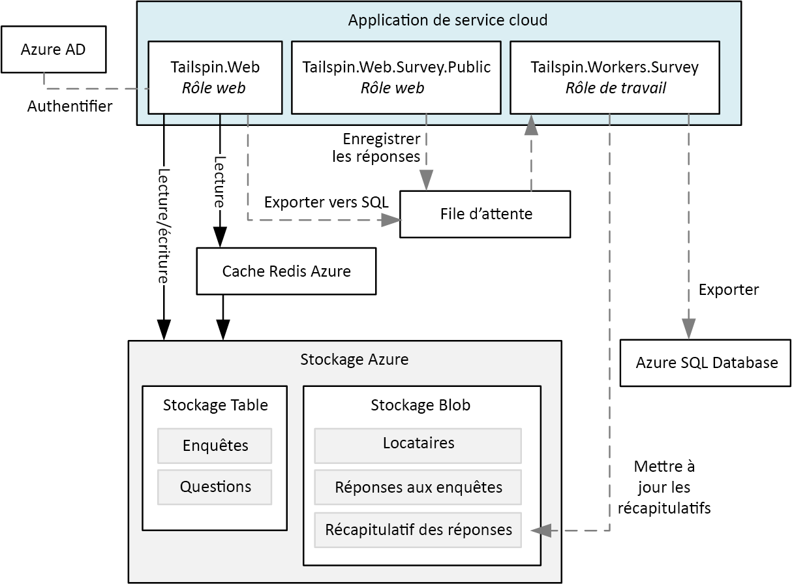
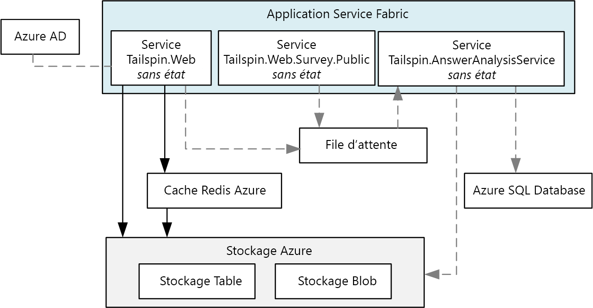
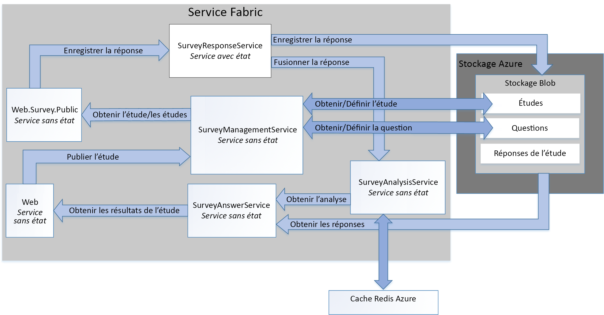

# <a name="refactor-an-azure-service-fabric-application-migrated-from-azure-cloud-services"></a><span data-ttu-id="54cc1-103">Refactoriser une application Azure Service Fabric migrée depuis Azure Cloud Services</span><span class="sxs-lookup"><span data-stu-id="54cc1-103">Refactor an Azure Service Fabric Application migrated from Azure Cloud Services</span></span>

<span data-ttu-id="54cc1-104">[ Exemple de code][sample-code]</span><span class="sxs-lookup"><span data-stu-id="54cc1-104">[ Sample code][sample-code]</span></span>

<span data-ttu-id="54cc1-105">Cet article décrit la refactorisation d’une application Azure Service Fabric existante en une architecture plus granulaire.</span><span class="sxs-lookup"><span data-stu-id="54cc1-105">This article describes refactoring an existing Azure Service Fabric application to a more granular architecture.</span></span> <span data-ttu-id="54cc1-106">Cet article se concentre sur les considérations de conception, d’empaquetage, de performances et de déploiement de l’application Service Fabric refactorisée.</span><span class="sxs-lookup"><span data-stu-id="54cc1-106">This article focuses on the design, packaging, performance, and deployment considerations of the refactored Service Fabric application.</span></span>

## <a name="scenario"></a><span data-ttu-id="54cc1-107">Scénario</span><span class="sxs-lookup"><span data-stu-id="54cc1-107">Scenario</span></span>

<span data-ttu-id="54cc1-108">Comme indiqué dans l’article précédent, [Migration d’une application Azure Cloud Services vers Azure Service Fabric][migrate-from-cloud-services], l’équipe Patterns & Practices a écrit un livre en 2012, décrivant le processus de conception et d’implémentation d’une application Cloud Services dans Azure.</span><span class="sxs-lookup"><span data-stu-id="54cc1-108">As discussed in the previous article, [Migrating an Azure Cloud Services application to Azure Service Fabric][migrate-from-cloud-services], the patterns & practices team authored a book in 2012 that documented the process for designing and implementing a Cloud Services application in Azure.</span></span> <span data-ttu-id="54cc1-109">Ce manuel décrit une société fictive nommée Tailspin souhaitant créer une application Cloud Services nommée **Surveys**.</span><span class="sxs-lookup"><span data-stu-id="54cc1-109">The book describes a fictitious company named Tailspin that wants to create a Cloud Services application named **Surveys**.</span></span> <span data-ttu-id="54cc1-110">L’application Surveys permet aux utilisateur de créer et de publier des enquêtes auxquelles le public peut répondre.</span><span class="sxs-lookup"><span data-stu-id="54cc1-110">The Surveys application allows users to create and publish surveys that can be answered by the public.</span></span> <span data-ttu-id="54cc1-111">Le diagramme suivant illustre l’architecture de cette version de l’application Surveys :</span><span class="sxs-lookup"><span data-stu-id="54cc1-111">The following diagram shows the architecture of this version of the Surveys application:</span></span>



<span data-ttu-id="54cc1-112">Le rôle web **Tailspin.Web** héberge un site ASP.NET MVC que les clients de Tailspin utilisent pour :</span><span class="sxs-lookup"><span data-stu-id="54cc1-112">The **Tailspin.Web** web role hosts an ASP.NET MVC site that Tailspin customers use to:</span></span>
* <span data-ttu-id="54cc1-113">s’inscrire à l’application Surveys,</span><span class="sxs-lookup"><span data-stu-id="54cc1-113">sign up for the Surveys application,</span></span>
* <span data-ttu-id="54cc1-114">créer ou supprimer une enquête unique,</span><span class="sxs-lookup"><span data-stu-id="54cc1-114">create or delete a single survey,</span></span>
* <span data-ttu-id="54cc1-115">voir les résultats d’une enquête unique,</span><span class="sxs-lookup"><span data-stu-id="54cc1-115">view results for a single survey,</span></span>
* <span data-ttu-id="54cc1-116">demander que les résultats d’enquête soient exportés en SQL, et</span><span class="sxs-lookup"><span data-stu-id="54cc1-116">request that survey results be exported to SQL, and</span></span>
* <span data-ttu-id="54cc1-117">afficher l’analyse et les résultats d’enquête agrégés.</span><span class="sxs-lookup"><span data-stu-id="54cc1-117">view aggregated survey results and analysis.</span></span>

<span data-ttu-id="54cc1-118">Le rôle web **Tailspin.Web.Survey.Public** héberge également un site ASP.NET MVC visité par le public pour remplir les enquêtes.</span><span class="sxs-lookup"><span data-stu-id="54cc1-118">The **Tailspin.Web.Survey.Public** web role also hosts an ASP.NET MVC site that the public visits to fill out the surveys.</span></span> <span data-ttu-id="54cc1-119">Ces réponses sont placées dans une file d’attente pour être enregistrées.</span><span class="sxs-lookup"><span data-stu-id="54cc1-119">These responses are put in a queue to be saved.</span></span>

<span data-ttu-id="54cc1-120">Le rôle de travail **Tailspin.Workers.Survey** exécute un traitement en arrière-plan en choisissant les requêtes à partir de plusieurs files d’attente.</span><span class="sxs-lookup"><span data-stu-id="54cc1-120">The **Tailspin.Workers.Survey** worker role performs background processing by picking up requests from multiple queues.</span></span>

<span data-ttu-id="54cc1-121">L’équipe Patterns & Practices a ensuite créé un nouveau projet pour porter cette application sur Azure Service Fabric.</span><span class="sxs-lookup"><span data-stu-id="54cc1-121">The patterns & practices team then created a new project to port this application to Azure Service Fabric.</span></span> <span data-ttu-id="54cc1-122">L’objectif de ce projet était d’effectuer uniquement les modifications de code nécessaires pour permettre l’exécution de l’application dans un cluster Azure Service Fabric.</span><span class="sxs-lookup"><span data-stu-id="54cc1-122">The goal of this project was to make only the necessary code changes to get the application running in an Azure Service Fabric cluster.</span></span> <span data-ttu-id="54cc1-123">Par conséquent, les rôles web et de travail originaux n’ont pas été décomposés en une architecture plus granulaire.</span><span class="sxs-lookup"><span data-stu-id="54cc1-123">As a result, the original web and worker roles were not decomposed into a more granular architecture.</span></span> <span data-ttu-id="54cc1-124">L’architecture obtenue est très similaire à la version Cloud Service de l’application :</span><span class="sxs-lookup"><span data-stu-id="54cc1-124">The resulting architecture is very similar to the Cloud Service version of the application:</span></span>



<span data-ttu-id="54cc1-125">Le service **Tailspin.Web** est porté à partir du rôle web *Tailspin.Web* d’origine.</span><span class="sxs-lookup"><span data-stu-id="54cc1-125">The **Tailspin.Web** service is ported from the original *Tailspin.Web* web role.</span></span>

<span data-ttu-id="54cc1-126">Le service **Tailspin.Web.Survey.Public** est porté à partir du rôle web *Tailspin.Web.Survey.Public* d’origine.</span><span class="sxs-lookup"><span data-stu-id="54cc1-126">The **Tailspin.Web.Survey.Public** service is ported from the original *Tailspin.Web.Survey.Public* web role.</span></span>

<span data-ttu-id="54cc1-127">Le service **Tailspin.AnswerAnalysisService** est porté à partir du rôle de travail *Tailspin.AnswerAnalysisService* d’origine.</span><span class="sxs-lookup"><span data-stu-id="54cc1-127">The **Tailspin.AnswerAnalysisService** service is ported from the original *Tailspin.Workers.Survey* worker role.</span></span>

> [!NOTE] 
> <span data-ttu-id="54cc1-128">Alors que les modifications apportées au code des rôles web et de travail ont été minimes, **Tailspin.Web** et **Tailspin.Web.Survey.Public** ont été modifiés pour auto-héberger un serveur web [Kestrel].</span><span class="sxs-lookup"><span data-stu-id="54cc1-128">While minimal code changes were made to each of the web and worker roles, **Tailspin.Web** and **Tailspin.Web.Survey.Public** were modified to self-host a [Kestrel] web server.</span></span> <span data-ttu-id="54cc1-129">L’application Surveys antérieure est une application ASP.NET qui était hébergée par Internet Information Services (IIS), mais il est impossible d’exécuter IIS en tant que service dans Service Fabric.</span><span class="sxs-lookup"><span data-stu-id="54cc1-129">The earlier Surveys application is an ASP.NET application that was hosted using Interet Information Services (IIS), but it is not possible to run IIS as a service in Service Fabric.</span></span> <span data-ttu-id="54cc1-130">Par conséquent, n’importe quel serveur web doit pouvoir être auto-hébergé, comme [Kestrel].</span><span class="sxs-lookup"><span data-stu-id="54cc1-130">Therefore, any web server must be capable of being self-hosted, such as [Kestrel].</span></span> <span data-ttu-id="54cc1-131">Dans certaines situations, il est possible d’exécuter IIS à l’intérieur d’un conteneur dans Service Fabric.</span><span class="sxs-lookup"><span data-stu-id="54cc1-131">It is possible to run IIS in a container in Service Fabric in some situations.</span></span> <span data-ttu-id="54cc1-132">Voir [Scénarios d’utilisation des conteneurs][container-scenarios] pour plus d’informations.</span><span class="sxs-lookup"><span data-stu-id="54cc1-132">See [scenarios for using containers][container-scenarios] for more information.</span></span>  

<span data-ttu-id="54cc1-133">Maintenant, Tailspin refactorise l’application Surveys en une architecture plus granulaire.</span><span class="sxs-lookup"><span data-stu-id="54cc1-133">Now, Tailspin is refactoring the Surveys application to a more granular architecture.</span></span> <span data-ttu-id="54cc1-134">La motivation de Tailspin pour la refactorisation est de faciliter le développement, la compilation et le déploiement de l’application Surveys.</span><span class="sxs-lookup"><span data-stu-id="54cc1-134">Tailspin's motivation for refactoring is to make it easier to develop, build, and deploy the Surveys application.</span></span> <span data-ttu-id="54cc1-135">En décomposant les rôles web et de travail en une architecture plus granulaire, Tailspin souhaite supprimer les dépendances de données et les communications existantes étroitement couplées entre ces rôles.</span><span class="sxs-lookup"><span data-stu-id="54cc1-135">By decomposing the existing web and worker roles to a more granular architecture, Tailspin wants to remove the existing tightly coupled communication and data dependencies between these roles.</span></span>

<span data-ttu-id="54cc1-136">Tailspin voit d’autres avantages au passage de l’application Surveys en une architecture plus granulaire :</span><span class="sxs-lookup"><span data-stu-id="54cc1-136">Tailspin sees other benefits in moving the Surveys application to a more granular architecture:</span></span>
* <span data-ttu-id="54cc1-137">Chaque service peut être empaqueté dans des projets indépendants ayant une portée suffisamment petite pour être gérés par une petite équipe.</span><span class="sxs-lookup"><span data-stu-id="54cc1-137">Each service can be packaged into independent projects with a scope small enough to be managed by a small team.</span></span>
* <span data-ttu-id="54cc1-138">Chaque service peut être déployé et faire l’objet d’un contrôle de version indépendamment.</span><span class="sxs-lookup"><span data-stu-id="54cc1-138">Each service can be independently versioned and deployed.</span></span>
* <span data-ttu-id="54cc1-139">Chaque service peut être implémenté à l’aide de la meilleure technologie possible.</span><span class="sxs-lookup"><span data-stu-id="54cc1-139">Each service can be implemented using the best technology for that service.</span></span> <span data-ttu-id="54cc1-140">Par exemple, un cluster Service Fabric peut inclure des services construits à l’aide de différentes versions de .NET Framework, Java ou d’autres langages tels que C ou C++.</span><span class="sxs-lookup"><span data-stu-id="54cc1-140">For example, a service fabric cluster can include services built using different versions of the .Net Frameworks, Java, or other languages such as C or C++.</span></span>
* <span data-ttu-id="54cc1-141">Chaque service peut être mis à l’échelle indépendamment pour répondre aux augmentations et diminutions de charge.</span><span class="sxs-lookup"><span data-stu-id="54cc1-141">Each service can be independently scaled to respond to increases and decreases in load.</span></span>

> [!NOTE] 
> <span data-ttu-id="54cc1-142">La multilocation est hors de portée pour la refactorisation de cette application.</span><span class="sxs-lookup"><span data-stu-id="54cc1-142">Multitenancy is out of scope for the refactoring of this application.</span></span> <span data-ttu-id="54cc1-143">Tailspin dispose de plusieurs options pour prendre en charge la multilocation et peut prendre ces décisions de conception plus tard sans affecter la conception initiale.</span><span class="sxs-lookup"><span data-stu-id="54cc1-143">Tailspin has several options to support multitenancy and can make these design decisions later without affecting the initial design.</span></span> <span data-ttu-id="54cc1-144">Par exemple, Tailspin peut créer des instances de services distinctes pour chaque client au sein d’un cluster ou créer un cluster séparé pour chaque client.</span><span class="sxs-lookup"><span data-stu-id="54cc1-144">For example, Tailspin can create separate instances of the services for each tenant within a cluster or create a separate cluster for each tenant.</span></span>

## <a name="design-considerations"></a><span data-ttu-id="54cc1-145">Remarques relatives à la conception</span><span class="sxs-lookup"><span data-stu-id="54cc1-145">Design considerations</span></span>
 
<span data-ttu-id="54cc1-146">Le diagramme suivant illustre l’architecture de l’application Surveys refactorisée en une architecture plus granulaire :</span><span class="sxs-lookup"><span data-stu-id="54cc1-146">The following diagram shows the architecture of the Surveys application refactored to a more granular architecture:</span></span>



<span data-ttu-id="54cc1-147">**Tailspin.Web** est un service sans état auto-hébergeant une application ASP.NET MVC visitée par les clients de Tailspin pour créer des enquêtes et afficher des résultats d’enquête.</span><span class="sxs-lookup"><span data-stu-id="54cc1-147">**Tailspin.Web** is a stateless service self-hosting an ASP.NET MVC application that Tailspin customers visit to create surveys and view survey results.</span></span> <span data-ttu-id="54cc1-148">Ce service partage la majeure partie de son code avec le service *Tailspin.Web* de l’application Service Fabric migrée.</span><span class="sxs-lookup"><span data-stu-id="54cc1-148">This service shares most of its code with the *Tailspin.Web* service from the ported Service Fabric application.</span></span> <span data-ttu-id="54cc1-149">Comme mentionné précédemment, ce service utilise ASP.NET Core et passe d’une utilisation de Kestrel en tant que serveur web frontal à l’implémentation de WebListener.</span><span class="sxs-lookup"><span data-stu-id="54cc1-149">As mentioned earlier, this service uses ASP.NET core and switches from using Kestrel as web frontend to implementing a WebListener.</span></span>

<span data-ttu-id="54cc1-150">**Tailspin.Web.Survey.Public** est un service sans état qui auto-héberge également un site ASP.NET MVC.</span><span class="sxs-lookup"><span data-stu-id="54cc1-150">**Tailspin.Web.Survey.Public** is a stateless service also self-hosting an ASP.NET MVC site.</span></span> <span data-ttu-id="54cc1-151">Les utilisateurs visitent ce site pour sélectionner des enquêtes depuis une liste et les remplir. Ce service partage la majeure partie de son code avec le service *Tailspin.Web.Survey.Public* de l’application Service Fabric migrée.</span><span class="sxs-lookup"><span data-stu-id="54cc1-151">Users visit this site to select surveys from a list and then fill them out. This service shares most of its code with the *Tailspin.Web.Survey.Public* service from the ported Service Fabric application.</span></span> <span data-ttu-id="54cc1-152">Ce service utilise également ASP.NET Core et passe également d’une utilisation de Kestrel en tant que serveur web frontal à l’implémentation de WebListener.</span><span class="sxs-lookup"><span data-stu-id="54cc1-152">This service also uses ASP.NET Core and also switches from using Kestrel as web frontend to implementing a WebListener.</span></span>

<span data-ttu-id="54cc1-153">**Tailspin.SurveyResponseService** est un service avec état qui stocke les réponses de l’enquête dans le Stockage Blob Azure.</span><span class="sxs-lookup"><span data-stu-id="54cc1-153">**Tailspin.SurveyResponseService** is a stateful service that stores survey answers in Azure Blob Storage.</span></span> <span data-ttu-id="54cc1-154">Il fusionne également les réponses dans des données d’analyse d’enquête.</span><span class="sxs-lookup"><span data-stu-id="54cc1-154">It also merges answers into the survey analysis data.</span></span> <span data-ttu-id="54cc1-155">Le service est implémenté comme un service avec état, car elle utilise un [ReliableConcurrentQueue][reliable-concurrent-queue] pour traiter les réponses d’enquête en lots.</span><span class="sxs-lookup"><span data-stu-id="54cc1-155">The service is implemented as a stateful service because it uses a [ReliableConcurrentQueue][reliable-concurrent-queue] to process survey answers in batches.</span></span> <span data-ttu-id="54cc1-156">Cette fonctionnalité a été initialement implémentée dans le service *Tailspin.AnswerAnalysisService* dans l’application Service Fabric migrée.</span><span class="sxs-lookup"><span data-stu-id="54cc1-156">This functionality was originally implemented in the *Tailspin.AnswerAnalysisService* service in the ported Service Fabric application.</span></span>

<span data-ttu-id="54cc1-157">**Tailspin.SurveyManagementService** est un service sans état qui stocke et récupère les enquêtes et les questions d’enquête.</span><span class="sxs-lookup"><span data-stu-id="54cc1-157">**Tailspin.SurveyManagementService** is a stateless service that stores and retrieves surveys and survey questions.</span></span> <span data-ttu-id="54cc1-158">Le service utilise le Stockage Blob Azure.</span><span class="sxs-lookup"><span data-stu-id="54cc1-158">The service uses Azure Blob storage.</span></span> <span data-ttu-id="54cc1-159">Cette fonctionnalité a également été initialement implémentée dans les composants d’accès aux données des services *Tailspin.Web* et *Tailspin.Web.Survey.Public* de l’application Service Fabric migrée.</span><span class="sxs-lookup"><span data-stu-id="54cc1-159">This functionality was also originally implemented in the data access components of the *Tailspin.Web* and *Tailspin.Web.Survey.Public* services in the ported Service Fabric application.</span></span> <span data-ttu-id="54cc1-160">Tailspin a refactorisé les fonctionnalités d’origine dans ce service pour lui permettre une mise en l’échelle de manière indépendante.</span><span class="sxs-lookup"><span data-stu-id="54cc1-160">Tailspin refactored the original functionality into this service to allow it to scale independently.</span></span>

<span data-ttu-id="54cc1-161">**Tailspin.SurveyAnswerService** est un service sans état qui récupère les réponses d’enquête ainsi qu’une analyse d’enquête.</span><span class="sxs-lookup"><span data-stu-id="54cc1-161">**Tailspin.SurveyAnswerService** is a stateless service that retrieves survey answers and survey analysis.</span></span> <span data-ttu-id="54cc1-162">Le service utilise également le Stockage Blob Azure.</span><span class="sxs-lookup"><span data-stu-id="54cc1-162">The service also uses Azure Blob storage.</span></span> <span data-ttu-id="54cc1-163">Cette fonctionnalité a également été initialement implémentée dans les composants d’accès aux données du service *Tailspin.Web* de l’application Service Fabric migrée.</span><span class="sxs-lookup"><span data-stu-id="54cc1-163">This functionality was also originally implemented in the data access components of the *Tailspin.Web* service in the ported Service Fabric application.</span></span> <span data-ttu-id="54cc1-164">Tailspin a refactorisé la fonctionnalité d’origine dans ce service car il attend une charge moindre et veut utiliser moins d’instances pour conserver les ressources.</span><span class="sxs-lookup"><span data-stu-id="54cc1-164">Tailspin refactored the original functionality into this service because it expects less load and wants to use fewer instances to conserve resources.</span></span>

<span data-ttu-id="54cc1-165">**Tailspin.SurveyAnalysisService** est un service sans état qui conserve les données de résumé des réponses d’enquête dans un cache Redis pour une récupération rapide.</span><span class="sxs-lookup"><span data-stu-id="54cc1-165">**Tailspin.SurveyAnalysisService** is a stateless service that persists survey answer summary data in a Redis cache for quick retrieval.</span></span> <span data-ttu-id="54cc1-166">Ce service est appelé par le *Tailspin.SurveyResponseService* chaque fois qu’une enquête reçoit une réponse et les nouvelles données de réponse d’enquête sont fusionnées dans les données de synthèse.</span><span class="sxs-lookup"><span data-stu-id="54cc1-166">This service is called by the *Tailspin.SurveyResponseService* each time a survey is answered and the new survey answer data is merged in the summary data.</span></span> <span data-ttu-id="54cc1-167">Ce service inclut la fonctionnalité initialement implémentée dans le service *Tailspin.AnswerAnalysisService* dans l’application Service Fabric migrée.</span><span class="sxs-lookup"><span data-stu-id="54cc1-167">This service includes the functionality originally implemented in the *Tailspin.AnswerAnalysisService* service from the ported Service Fabric application.</span></span>

## <a name="stateless-versus-stateful-services"></a><span data-ttu-id="54cc1-168">Services sans état par rapport aux services avec état</span><span class="sxs-lookup"><span data-stu-id="54cc1-168">Stateless versus stateful services</span></span>

<span data-ttu-id="54cc1-169">Azure Service Fabric prend en charge les modèles de programmation suivants :</span><span class="sxs-lookup"><span data-stu-id="54cc1-169">Azure Service Fabric supports the following programming models:</span></span>
* <span data-ttu-id="54cc1-170">Le modèle exécutable invité permet d’empaqueter n’importe quel fichier exécutable comme un service et de le déployer dans un cluster Service Fabric.</span><span class="sxs-lookup"><span data-stu-id="54cc1-170">The guest executable model allows any executable to be packaged as a service and deployed to a Service Fabric cluster.</span></span> <span data-ttu-id="54cc1-171">Service Fabric orchestre et gère l’exécution de l’exécutable invité.</span><span class="sxs-lookup"><span data-stu-id="54cc1-171">Service Fabric orchestrates and manages execution of the guest executable.</span></span>
* <span data-ttu-id="54cc1-172">Le modèle de conteneur permet le déploiement des services dans les images de conteneur.</span><span class="sxs-lookup"><span data-stu-id="54cc1-172">The container model allows for deployment of services in container images.</span></span> <span data-ttu-id="54cc1-173">Service Fabric prend en charge la création et la gestion de conteneurs placés sur des conteneurs de noyau Linux et Windows Server.</span><span class="sxs-lookup"><span data-stu-id="54cc1-173">Service Fabric supports creation and management of containers on top of Linux kernel containers as well as Windows Server containers.</span></span> 
* <span data-ttu-id="54cc1-174">Le modèle de programmation de services fiables permet la création de services sans état ou avec état s’intègrant à toutes les fonctionnalités de la plateforme Service Fabric.</span><span class="sxs-lookup"><span data-stu-id="54cc1-174">The reliable services programming model allows for the creation of stateless or stateful services that integrate with all Service Fabric platform features.</span></span> <span data-ttu-id="54cc1-175">Les services avec état permettent de stocker un état répliqué dans le cluster Service Fabric.</span><span class="sxs-lookup"><span data-stu-id="54cc1-175">Stateful services allow for replicated state to be stored in the Service Fabric cluster.</span></span> <span data-ttu-id="54cc1-176">Les services sans état ne le permettent pas.</span><span class="sxs-lookup"><span data-stu-id="54cc1-176">Stateless services do not.</span></span>
* <span data-ttu-id="54cc1-177">Le modèle de programmation des acteurs fiables permet la création de services qui implémentent le modèle d’acteur virtuel.</span><span class="sxs-lookup"><span data-stu-id="54cc1-177">The reliable actors programming model allows for the creation of services that implement the virtual actor pattern.</span></span>

<span data-ttu-id="54cc1-178">Tous les services de l’application Surveys sont des services sans état fiables, à l’exception du service *Tailspin.SurveyResponseService*.</span><span class="sxs-lookup"><span data-stu-id="54cc1-178">All the services in the Surveys application are stateless reliable services, except for the *Tailspin.SurveyResponseService* service.</span></span> <span data-ttu-id="54cc1-179">Ce service implémente un [ReliableConcurrentQueue][reliable-concurrent-queue] pour traiter les réponses d’enquête une fois reçues.</span><span class="sxs-lookup"><span data-stu-id="54cc1-179">This service implements a [ReliableConcurrentQueue][reliable-concurrent-queue] to process survey answers when they are received.</span></span> <span data-ttu-id="54cc1-180">Les réponses dans le ReliableConcurrentQueue sont enregistrées dans le Stockage Blob Azure et passées au *Tailspin.SurveyAnalysisService* pour analyse.</span><span class="sxs-lookup"><span data-stu-id="54cc1-180">Responses in the ReliableConcurrentQueue are saved into Azure Blob Storage and passed to the *Tailspin.SurveyAnalysisService* for analysis.</span></span> <span data-ttu-id="54cc1-181">Tailspin choisit un ReliableConcurrentQueue, car les réponses ne nécessitent pas un ordre premier entré, premier sorti (FIFO) strict fourni par une file d’attente comme Azure Service Bus.</span><span class="sxs-lookup"><span data-stu-id="54cc1-181">Tailspin chooses a ReliableConcurrentQueue because responses do not require strict first-in-first-out (FIFO) ordering provided by a queue such as Azure Service Bus.</span></span> <span data-ttu-id="54cc1-182">Un ReliableConcurrentQueue est également conçu pour fournir un débit élevé et une faible latence pour les opérations de mise en file d’attente et de retrait.</span><span class="sxs-lookup"><span data-stu-id="54cc1-182">A ReliableConcurrentQueue is also designed to deliver high throughput and low latency for queue and dequeue operations.</span></span>

<span data-ttu-id="54cc1-183">Notez que les opérations pour conserver les éléments retirés d’une file d’attente à partir d’un ReliableConcurrentQueue doivent idéalement être idempotente.</span><span class="sxs-lookup"><span data-stu-id="54cc1-183">Note that operations to persist dequeued items from a ReliableConcurrentQueue should ideally be idempotent.</span></span> <span data-ttu-id="54cc1-184">Si une exception est levée pendant le traitement d’un élément à partir de la file d’attente, le même élément est susceptible d’être traité plusieurs fois.</span><span class="sxs-lookup"><span data-stu-id="54cc1-184">If an exception is thrown during the processing of an item from the queue, the same item may be processed more than once.</span></span> <span data-ttu-id="54cc1-185">Dans l’application Surveys, l’opération de fusion des réponses d’enquête répond que le *Tailspin.SurveyAnalysisService* n’est pas idempotente car Tailspin a décidé que les données d’analyse d’enquête sont seulement une capture instantanée des données d’analyse et n’ont pas besoin d’être cohérentes.</span><span class="sxs-lookup"><span data-stu-id="54cc1-185">In the Surveys application, the operation to merge survey answers to the *Tailspin.SurveyAnalysisService* is not idempotent because Tailspin decided that the survey analysis data is only a current snapshot of the analysis data and does not need to be consistent.</span></span> <span data-ttu-id="54cc1-186">Les réponses d’enquête enregistrées dans le Stockage Blob Azure sont finalement cohérentes, de sorte que l’analyse finale de l’enquête peut toujours être recalculée correctement à partir de ces données.</span><span class="sxs-lookup"><span data-stu-id="54cc1-186">The survey answers saved to Azure Blob Storage are eventually consistent, so the survey final analysis can always be recalculated correctly from this data.</span></span>

## <a name="communication-framework"></a><span data-ttu-id="54cc1-187">Infrastructure de communication</span><span class="sxs-lookup"><span data-stu-id="54cc1-187">Communication framework</span></span>

<span data-ttu-id="54cc1-188">Chaque service dans l’application Surveys communique à l’aide d’une API web RESTful.</span><span class="sxs-lookup"><span data-stu-id="54cc1-188">Each service in the Surveys application communicates using a RESTful web API.</span></span> <span data-ttu-id="54cc1-189">Les API RESTful offre les avantages suivants :</span><span class="sxs-lookup"><span data-stu-id="54cc1-189">RESTful APIs offer the following benefits:</span></span>
* <span data-ttu-id="54cc1-190">Facilité d’utilisation : chaque service est généré à l’aide d’ASP.NET Core MVC, qui prend nativement en charge la création d’API web.</span><span class="sxs-lookup"><span data-stu-id="54cc1-190">Ease of use: each service is built using ASP.NET Core MVC, which natively supports the creation of Web APIs.</span></span>
* <span data-ttu-id="54cc1-191">Sécurité : comme chaque service ne nécessite pas SSL, Tailspin peut demander à chaque service de le demander.</span><span class="sxs-lookup"><span data-stu-id="54cc1-191">Security: While each service does not require SSL, Tailspin could require each service to do so.</span></span> 
* <span data-ttu-id="54cc1-192">Contrôle de version : les clients peuvent être écrits et testés par rapport à une version spécifique d’une API web.</span><span class="sxs-lookup"><span data-stu-id="54cc1-192">Versioning: clients can be written and tested against a specific version of a web API.</span></span>

<span data-ttu-id="54cc1-193">Les services dans l’application Survey peuvent utiliser le [proxy inverse][reverse-proxy] implémenté par Service Fabric.</span><span class="sxs-lookup"><span data-stu-id="54cc1-193">Services in the Survey application make use of the [reverse proxy][reverse-proxy] implemented by Service Fabric.</span></span> <span data-ttu-id="54cc1-194">Le proxy inverse est un service qui s’exécute sur chaque nœud dans le cluster Service Fabric et qui permet la résolution des points de terminaison, les nouvelles tentatives automatiques et gère d’autres types d’échec de connexion.</span><span class="sxs-lookup"><span data-stu-id="54cc1-194">Reverse proxy is a service that runs on each node in the Service Fabric cluster and provides endpoint resolution, automatic retry, and handles other types of connection failures.</span></span> <span data-ttu-id="54cc1-195">Pour utiliser le proxy inverse, chaque appel d’API RESTful vers un service spécifique est effectué à l’aide d’un port de proxy inverse prédéfini.</span><span class="sxs-lookup"><span data-stu-id="54cc1-195">To use the reverse proxy, each RESTful API call to a specific service is made using a predefined reverse proxy port.</span></span>  <span data-ttu-id="54cc1-196">Par exemple, si le port de proxy inverse a été défini sur **19081**, un appel à *Tailspin.SurveyAnswerService* peut être effectué comme suit :</span><span class="sxs-lookup"><span data-stu-id="54cc1-196">For example, if the reverse proxy port has been set to **19081**, a call to the *Tailspin.SurveyAnswerService* can be made as follows:</span></span>

```csharp
static SurveyAnswerService()
{
    httpClient = new HttpClient
    {
        BaseAddress = new Uri("http://localhost:19081/Tailspin/SurveyAnswerService/")
    };
}
```
<span data-ttu-id="54cc1-197">Pour activer le proxy inverse, spécifiez un port de proxy inverse lors de la création du cluster Service Fabric.</span><span class="sxs-lookup"><span data-stu-id="54cc1-197">To enable reverse proxy, specify a reverse proxy port during creation of the Service Fabric cluster.</span></span> <span data-ttu-id="54cc1-198">Pour en savoir plus, consultez [Proxy inverse][reverse-proxy] dans Azure Service Fabric.</span><span class="sxs-lookup"><span data-stu-id="54cc1-198">For more information, see [reverse proxy][reverse-proxy] in Azure Service Fabric.</span></span>

## <a name="performance-considerations"></a><span data-ttu-id="54cc1-199">Considérations relatives aux performances</span><span class="sxs-lookup"><span data-stu-id="54cc1-199">Performance considerations</span></span>

<span data-ttu-id="54cc1-200">Tailspin a créé les services ASP.NET Core pour *Tailspin.Web* et *Tailspin.Web.Surveys.Public* à l’aide de modèles Visual Studio.</span><span class="sxs-lookup"><span data-stu-id="54cc1-200">Tailspin created the ASP.NET Core services for *Tailspin.Web* and *Tailspin.Web.Surveys.Public* using Visual Studio templates.</span></span> <span data-ttu-id="54cc1-201">Par défaut, ces modèles incluent la journalisation dans la console.</span><span class="sxs-lookup"><span data-stu-id="54cc1-201">By default, these templates include logging to the console.</span></span> <span data-ttu-id="54cc1-202">La journalisation dans la console peut être effectuée pendant le développement et le débogage, mais toute la journalisation dans la console doit être supprimée lorsque l’application est déployée en production.</span><span class="sxs-lookup"><span data-stu-id="54cc1-202">Logging to the console may be done during development and debugging, but all logging to the console should be removed when the application is deployed to production.</span></span>

> [!NOTE]
> <span data-ttu-id="54cc1-203">Pour plus d’informations sur la configuration de la surveillance et du diagnostic des applications Service Fabric exécutées en production, consultez [Surveillance et diagnostics][monitoring-diagnostics] pour Azure Service Fabric.</span><span class="sxs-lookup"><span data-stu-id="54cc1-203">For more information about setting up monitoring and diagnostics for Service Fabric applications running in production, see [monitoring and diagnostics][monitoring-diagnostics] for Azure Service Fabric.</span></span>

<span data-ttu-id="54cc1-204">Par exemple, les lignes suivantes dans *startup.cs* pour chaque service web du serveur frontal doivent être COMMENTÉES :</span><span class="sxs-lookup"><span data-stu-id="54cc1-204">For example, the following lines in *startup.cs* for each of the web front end services should be commented out:</span></span>

```csharp
// This method gets called by the runtime. Use this method to configure the HTTP request pipeline.
public void Configure(IApplicationBuilder app, IHostingEnvironment env, ILoggerFactory loggerFactory)
{
    //loggerFactory.AddConsole(Configuration.GetSection("Logging"));
    //loggerFactory.AddDebug();

    app.UseMvc();
}
```

> [!NOTE]
> <span data-ttu-id="54cc1-205">Ces lignes peuvent être exclues de manière conditionnelle lorsque Visual Studio est défini sur «release » lors de la publication.</span><span class="sxs-lookup"><span data-stu-id="54cc1-205">These lines may be conditionally excluded when Visual Studio is set to “release” when publishing.</span></span>

<span data-ttu-id="54cc1-206">Enfin, lorsque Tailspin déploie l’application Tailspin en production, ils basculent Visual Studio en mode **release**.</span><span class="sxs-lookup"><span data-stu-id="54cc1-206">Finally, when Tailspin deploys the Tailspin application to production, they switch Visual Studio to **release** mode.</span></span>

## <a name="deployment-considerations"></a><span data-ttu-id="54cc1-207">Points à prendre en considération pour le déploiement</span><span class="sxs-lookup"><span data-stu-id="54cc1-207">Deployment considerations</span></span>

<span data-ttu-id="54cc1-208">L’application Surveys refactorisée est composée de cinq services sans état et d’un service avec état, afin que la planification du cluster soit limitée à la détermination adéquate de la taille de la machine virtuelle et du nombre de nœuds.</span><span class="sxs-lookup"><span data-stu-id="54cc1-208">The refactored Surveys application is composed of five stateless services and one stateful service, so cluster planning is limited to determining the correct VM size and number of nodes.</span></span> <span data-ttu-id="54cc1-209">Dans le fichier *applicationmanifest.xml* décrivant le cluster, Tailspin définit l’attribut *InstanceCount* de la balise *StatelessService* sur -1 pour chaque service.</span><span class="sxs-lookup"><span data-stu-id="54cc1-209">In the *applicationmanifest.xml* file that describes the cluster, Tailspin sets the *InstanceCount* attribute of the *StatelessService* tag to -1 for each of the services.</span></span> <span data-ttu-id="54cc1-210">La valeur -1 ordonne à Service Fabric de créer une instance du service sur chaque nœud du cluster.</span><span class="sxs-lookup"><span data-stu-id="54cc1-210">A value of -1 directs Service Fabric to create an instance of the service on each node in the cluster.</span></span>

> [!NOTE]
> <span data-ttu-id="54cc1-211">Les services avec état nécessitent une étape supplémentaire de planification du nombre correct de partitions et de réplicas pour leurs données.</span><span class="sxs-lookup"><span data-stu-id="54cc1-211">Stateful services require the additional step of planning the correct number of partitions and replicas for their data.</span></span>

<span data-ttu-id="54cc1-212">Tailspin déploie le cluster à l’aide du portail Azure.</span><span class="sxs-lookup"><span data-stu-id="54cc1-212">Tailspin deploys the cluster using the Azure Portal.</span></span> <span data-ttu-id="54cc1-213">Le type de ressource du cluster Service Fabric déploie toute l’infrastructure nécessaire, y compris les groupes de machines virtuelles identiques et un équilibreur de charge.</span><span class="sxs-lookup"><span data-stu-id="54cc1-213">The Service Fabric Cluster resource type deploys all of the necessary infrastructure, including VM scale sets and a load balancer.</span></span> <span data-ttu-id="54cc1-214">Les tailles recommandées des machines virtuelles sont affichées dans le portail Azure pendant le processus d’approvisionnement pour le cluster Service Fabric.</span><span class="sxs-lookup"><span data-stu-id="54cc1-214">The recommended VM sizes are displayed in the Azure portal during the provisioning process for the Service Fabric cluster.</span></span> <span data-ttu-id="54cc1-215">Notez qu’étant donné que les machines virtuelles sont déployées dans un groupe de machines virtuelles identiques, elles peuvent être mises à l’échelle en fonction de la charge de l’utilisateur.</span><span class="sxs-lookup"><span data-stu-id="54cc1-215">Note that because the VMs are deployed in a VM scale set, they can be both scaled up and out as user load increases.</span></span>

> [!NOTE]
> <span data-ttu-id="54cc1-216">Comme indiqué précédemment, dans la version migrée de l’application Surveys, les deux serveurs web frontaux étaient auto-hébergés à l’aide d’ASP.NET Core et de Kestrel en tant que serveur web.</span><span class="sxs-lookup"><span data-stu-id="54cc1-216">As discussed earlier, in the migrated version of the Surveys application the two web front ends were self-hosted using ASP.NET Core and Kestrel as a web server.</span></span> <span data-ttu-id="54cc1-217">Alors que la version migrée de l’application Surveys n’utilise pas un proxy inverse, il est fortement recommandé d’en utiliser un, comme IIS, Nginx ou Apache.</span><span class="sxs-lookup"><span data-stu-id="54cc1-217">While the migrated version of the Survey application does not use a reverse proxy, it is strongly recommended to use a reverse proxy such as IIS, Nginx, or Apache.</span></span> <span data-ttu-id="54cc1-218">Pour plus d’informations, consultez [Introduction à l’implémentation du serveur web Kestrel dans ASP.NET Core][kestrel-intro].</span><span class="sxs-lookup"><span data-stu-id="54cc1-218">For more information see [introduction to Kestrel web server implementation in ASP.NET core][kestrel-intro].</span></span>
> <span data-ttu-id="54cc1-219">Dans l’application Surveys refactorisée, les deux serveurs web frontaux sont auto-hébergés à l’aide d’ASP.NET Core avec [WebListener][weblistener] en tant que serveur web de sorte que le proxy inverse n’est pas nécessaire.</span><span class="sxs-lookup"><span data-stu-id="54cc1-219">In the refactored Surveys application, the two web front ends are self-hosted using ASP.NET Core with [WebListener][weblistener] as a web server so a reverse proxy is not necessary.</span></span>

## <a name="next-steps"></a><span data-ttu-id="54cc1-220">Étapes suivantes</span><span class="sxs-lookup"><span data-stu-id="54cc1-220">Next steps</span></span>

<span data-ttu-id="54cc1-221">Le code de l’application Surveys est disponible sur [GitHub][sample-code].</span><span class="sxs-lookup"><span data-stu-id="54cc1-221">The Surveys application code is available on [GitHub][sample-code].</span></span>

<span data-ttu-id="54cc1-222">Si vous venez de démarrer avec [Azure Service Fabric][service-fabric], configurez d’abord votre environnement de développement, puis téléchargez la dernière version du [SDK Azure ][azure-sdk] et du [SDK Azure Service Fabric ][service-fabric-sdk].</span><span class="sxs-lookup"><span data-stu-id="54cc1-222">If you are just getting started with [Azure Service Fabric][service-fabric], first set up your development environment then download the latest [Azure SDK][azure-sdk] and the [Azure Service Fabric SDK][service-fabric-sdk].</span></span> <span data-ttu-id="54cc1-223">Le SDK inclut le gestionnaire de clusters OneBox afin que vous puissiez déployer et tester l’application Surveys localement avec le débogage F5 complet.</span><span class="sxs-lookup"><span data-stu-id="54cc1-223">The SDK includes the OneBox cluster manager so you can deploy and test the Surveys application locally with full F5 debugging.</span></span>

<!-- links -->
[azure-sdk]: https://azure.microsoft.com/downloads/archive-net-downloads/
[container-scenarios]: /azure/service-fabric/service-fabric-containers-overview
[kestrel]: https://docs.microsoft.com/aspnet/core/fundamentals/servers/kestrel?tabs=aspnetcore2x
[kestrel-intro]: https://docs.microsoft.com/aspnet/core/fundamentals/servers/kestrel?tabs=aspnetcore1x
[migrate-from-cloud-services]: migrate-from-cloud-services.md
[monitoring-diagnostics]: /azure/service-fabric/service-fabric-diagnostics-overview
[reliable-concurrent-queue]: /azure/service-fabric/service-fabric-reliable-services-reliable-concurrent-queue
[reverse-proxy]: /azure/service-fabric/service-fabric-reverseproxy
[sample-code]: https://github.com/mspnp/cloud-services-to-service-fabric/tree/master/servicefabric-phase-2
[service-fabric]: /azure/service-fabric/service-fabric-get-started
[service-fabric-sdk]: /azure/service-fabric/service-fabric-get-started
[weblistener]: https://docs.microsoft.com/aspnet/core/fundamentals/servers/weblistener
