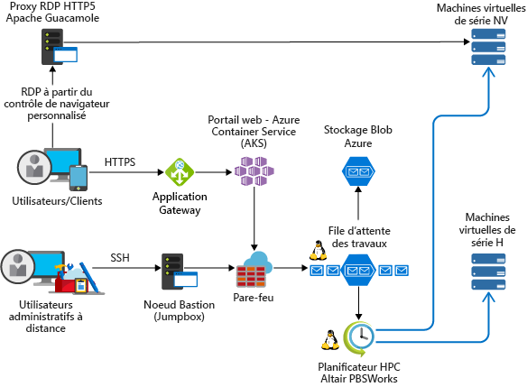

<!-- markdownlint-disable MD033 -->
<!-- markdownlint-disable MD026 -->

# Calcul haute performance (HPC) sur AzureHigh Performance Computing (HPC) on Azure

## Introduction à HPCIntroduction to HPC

<!-- markdownlint-disable MD034 -->

> [!VIDEO https://www.youtube.com/embed/rKURT32faJk]

<!-- markdownlint-enable MD034 -->

HPC (High-Performance Computing, calcul haute performance), également appelé « Big Compute », utilise un grand nombre d’ordinateurs basés sur le processeur ou sur GPU pour résoudre des tâches mathématiques complexes.High Performance Computing (HPC), also called "Big Compute", uses a large number of CPU or GPU-based computers to solve complex mathematical tasks.

De nombreux secteurs d’activité utilisent HPC pour résoudre certains de leurs problèmes les plus complexes.Many industries use HPC to solve some of their most difficult problems.  Ces problèmes incluent notamment des charges de travail telles que les suivantes :These include workloads such as:

- GenomicsGenomics
- Simulations relatives aux hydrocarburesOil and gas simulations
- FinancesFinance
- Conception de semiconducteursSemiconductor design
- IngénierieEngineering
- Modélisation de phénomènes météorologiquesWeather modeling

### En quoi HPC est différent sur le cloud ?How is HPC different on the cloud?

L’une des principales différences entre un système HPC local et un système HPC dans le cloud est la possibilité d’ajouter et de supprimer dynamiquement des ressources en fonction des besoins.One of the primary differences between an on-premise HPC system and one in the cloud is the ability for resources to dynamically be added and removed as they're needed.  La mise à l’échelle dynamique supprime la capacité de calcul comme goulot d’étranglement et, à la place, permet aux clients de trouver la taille adaptée pour leur infrastructure pour satisfaire les exigences de leurs travaux.Dynamic scaling removes compute capacity as a bottleneck and instead allow customers to right size their infrastructure for the requirements of their jobs.

Les articles suivants fournissent davantage de détails sur cette fonctionnalité de mise à l’échelle dynamique.The following articles provide more detail about this dynamic scaling capability.

- [Style d’architecture Big ComputeBig Compute Architecture Style](/azure/architecture/guide/architecture-styles/big-compute?context=/azure/architecture/topics/high-performance-computing/context/hpc-context)
- [Bonnes pratiques concernant la mise à l’échelle automatiqueAutoscaling best practices](/azure/architecture/best-practices/auto-scaling?context=/azure/architecture/topics/high-performance-computing/context/hpc-context)

## Liste de vérification de l’implémentationImplementation checklist

Comme vous cherchez à implémenter votre propre solution HPC sur Azure, vérifiez que vous avez consulté les rubriques suivantes :As you're looking to implement your own HPC solution on Azure, ensure you're reviewed the following topics:

<!-- markdownlint-disable MD032 -->

> [!div class="checklist"]
> - Choisir l’[architecture](#infrastructure) appropriée en fonction de vos exigencesChoose the appropriate [architecture](#infrastructure) based on your requirements
> - Déterminer quelles options de [calcul](#compute) conviennent pour votre charge de travailKnow which [compute](#compute) options is right for your workload
> - Identifier la solution de [stockage](#storage) appropriée qui répond à vos besoinsIdentify the right [storage](#storage) solution that meets your needs
> - Décider comment vous allez [gérer](#management) toutes vos ressourcesDecide how you're going to [manage](#management) all your resources
> - Optimiser votre [application](#hpc-applications) pour le cloudOptimize your [application](#hpc-applications) for the cloud
> - [Sécuriser](#security) votre infrastructure[Secure](#security) your Infrastructure

<!-- markdownlint-enable MD032 -->

## InfrastructureInfrastructure

Un certain nombre de composants d’infrastructure sont nécessaires à la génération d’un système HPC.There are a number of infrastructure components necessary to build an HPC system.  Calcul, stockage et réseau fournissent les composants sous-jacents, quelle que soit la façon dont vous choisissez de gérer vos charges de travail HPC.Compute, Storage, and Networking provide the underlying components, no matter how you choose to manage your HPC workloads.

### Exemples d’architectures HPCExample HPC architectures

Il existe différentes façons de concevoir et d’implémenter votre architecture HPC sur Azure.There are a number of different ways to design and implement your HPC architecture on Azure.  Les applications HPC peuvent être mises à l’échelle pour plusieurs milliers de cœurs de calcul, étendre des clusters locaux ou s’exécuter en tant que solutions natives entièrement dans le cloud.HPC applications can scale to thousands of compute cores, extend on-premises clusters, or run as a 100% cloud native solution.

Les scénarios suivants décrivent quelques-unes des façons courantes de générer des solutions HPC.The following scenarios outline a few of the common ways HPC solutions are built.

<ul class="columns is-multiline has-margin-left-none has-margin-bottom-none has-padding-top-medium">
    <li class="column is-one-third has-padding-top-small-mobile has-padding-bottom-small">
        <a class="is-undecorated is-full-height is-block"
            href="/azure/architecture/example-scenario/apps/hpc-saas?context=/azure/architecture/topics/high-performance-computing/context/hpc-context">
            <article class="card has-outline-hover is-relative is-fullheight">
                    <figure class="image has-margin-right-none has-margin-left-none has-margin-top-none has-margin-bottom-none">
                        
                    </figure>
                

                    

                        <h3 class="is-size-4 has-margin-top-none has-margin-bottom-none has-text-primary">Services d’ingénierie assistée par ordinateur sur AzureComputer-aided engineering services on Azure</h3>
                    

                    

                        
Offrez une plateforme de software as a service (SaaS) pour l’ingénierie assistée par ordinateur (IAO) sur Azure.Provide a software-as-a-service (SaaS) platform for computer-aided engineering (CAE) on Azure.

                    

                

            </article>
        </a>
    </li>
    <li class="column is-one-third has-padding-top-small-mobile has-padding-bottom-small">
        <a class="is-undecorated is-full-height is-block"
            href="/azure/architecture/example-scenario/infrastructure/hpc-cfd?context=/azure/architecture/topics/high-performance-computing/context/hpc-context">
            <article class="card has-outline-hover is-relative is-fullheight">
                    <figure class="image has-margin-right-none has-margin-left-none has-margin-top-none has-margin-bottom-none">
                        
                    </figure>
                

                    

                        <h3 class="is-size-4 has-margin-top-none has-margin-bottom-none has-text-primary">Simulations de diagramme de flux cumulé (CFD) sur AzureComputational fluid dynamics (CFD) simulations on Azure</h3>
                    

                    

                        
Exécutez des simulations de diagramme de flux cumulé (CFD) sur Azure.Execute computational fluid dynamics (CFD) simulations on Azure.

                    

                

            </article>
        </a>
    </li>
    <li class="column is-one-third has-padding-top-small-mobile has-padding-bottom-small">
        <a class="is-undecorated is-full-height is-block"
            href="/azure/architecture/example-scenario/infrastructure/video-rendering?context=/azure/architecture/topics/high-performance-computing/context/hpc-context">
            <article class="card has-outline-hover is-relative is-fullheight">
                    <figure class="image has-margin-right-none has-margin-left-none has-margin-top-none has-margin-bottom-none">
                        
                    </figure>
                

                    

                        <h3 class="is-size-4 has-margin-top-none has-margin-bottom-none has-text-primary">Rendu vidéo 3D sur Azure3D video rendering on Azure</h3>
                    

                    

                        
Exécutez des charges de travail HPC natives dans Azure à l’aide du service Azure Batch.Run native HPC workloads in Azure using the Azure Batch service

                    

                

            </article>
        </a>
    </li>
</ul>

### CalculCompute

Azure propose une gamme de tailles qui sont optimisées pour les charges de travail intensives processeur et GPU.Azure offers a range of sizes that are optimized for both CPU & GPU intensive workloads.

#### Machines virtuelles basées sur le processeurCPU-based virtual machines

- [Machines virtuelles LinuxLinux VMs](/azure/virtual-machines/linux/sizes-hpc?context=/azure/architecture/topics/high-performance-computing/context/hpc-context)
- [Machines virtuelles Windows](/azure/virtual-machines/windows/sizes-hpc?context=/azure/architecture/topics/high-performance-computing/context/hpc-context)[Windows VM's](/azure/virtual-machines/windows/sizes-hpc?context=/azure/architecture/topics/high-performance-computing/context/hpc-context) VMs
  
#### Machines virtuelles compatibles GPUGPU-enabled virtual machines

Les machines virtuelles de série N comportent des processeurs graphiques NVIDIA conçus pour des applications graphiques ou de calcul nécessitant beaucoup de ressources système, y compris la visualisation et l’apprentissage de l’intelligence artificielle (AI).N-series VMs feature NVIDIA GPUs designed for compute-intensive or graphics-intensive applications including artificial intelligence (AI) learning and visualization.

- [Machines virtuelles LinuxLinux VMs](/azure/virtual-machines/linux/sizes-gpu?context=/azure/architecture/topics/high-performance-computing/context/hpc-context)
- [Machines virtuelles WindowsWindows VMs](/azure/virtual-machines/windows/sizes-gpu?context=/azure/architecture/topics/high-performance-computing/context/hpc-context)

### StockageStorage

Les charges de travail HPC et Batch à grande échelle nécessitent un stockage des données et un accès à ces dernières dépassant les capacités des systèmes de fichiers cloud classiques.Large-scale Batch and HPC workloads have demands for data storage and access that exceed the capabilities of traditional cloud file systems.  Un certain nombre de solutions permettent de gérer les besoins de vitesse et de capacité des applications HPC sur AzureThere are a number of solutions to manage both the speed and capacity needs of HPC applications on Azure

- [Avere vFXT](https://azure.microsoft.com/services/storage/avere-vfxt/) pour un stockage de données plus rapide et plus accessible pour un calcul haute performance à la périphérie[Avere vFXT](https://azure.microsoft.com/services/storage/avere-vfxt/) for faster, more accessible data storage for high-performance computing at the edge
- [BeeGFSBeeGFS](https://azure.microsoft.com/resources/implement-glusterfs-on-azure/)
- [Machines virtuelles à stockage optimiséStorage Optimized Virtual Machines](/azure/virtual-machines/windows/sizes-storage?context=/azure/architecture/topics/high-performance-computing/context/hpc-context)
- [Stockage Objet BLOB, Table et File d’attenteBlob, table, and queue storage](/azure/storage/storage-introduction?context=/azure/architecture/topics/high-performance-computing/context/hpc-context)
- [Stockage de fichiers SMB AzureAzure SMB File storage](/azure/storage/files/storage-files-introduction?context=/azure/architecture/topics/high-performance-computing/context/hpc-context)
- [Intel Cloud Edition pour LustreIntel Cloud Edition Lustre](https://azuremarketplace.microsoft.com/marketplace/apps/intel.intel-cloud-edition-gs)

Pour plus d’informations sur la comparaison de Lustre, de GlusterFS et de BeeGFS sur Azure, consultez le [livre électronique Systèmes de fichiers parallèles sur Azure](https://blogs.msdn.microsoft.com/azurecat/2018/06/11/azurecat-ebook-parallel-virtual-file-systems-on-microsoft-azure/)For more information comparing Lustre, GlusterFS, and BeeGFS on Azure, review the [Parallel Files Systems on Azure eBook](https://blogs.msdn.microsoft.com/azurecat/2018/06/11/azurecat-ebook-parallel-virtual-file-systems-on-microsoft-azure/)

### Mise en réseauNetworking

Les machines virtuelles H16r, H16mr, A8 et A9 peuvent se connecter à un réseau RDMA back-end à débit élevé.H16r, H16mr, A8, and A9 VMs can connect to a high throughput back-end RDMA network. Ce réseau peut améliorer les performances d’applications parallèles étroitement liées s’exécutant sous Microsoft MPI ou Intel MPI.This network can improve the performance of tightly coupled parallel applications running under Microsoft MPI or Intel MPI.

- [Instances compatibles RDMARDMA Capable Instances](/azure/virtual-machines/windows/sizes-hpc?context=/azure/architecture/topics/high-performance-computing/context/hpc-context#rdma-capable-instances)
- [Réseau virtuelVirtual Network](/azure/virtual-network/virtual-networks-overview?context=/azure/architecture/topics/high-performance-computing/context/hpc-context)
- [ExpressRouteExpressRoute](/azure/expressroute/expressroute-introduction?context=/azure/architecture/topics/high-performance-computing/context/hpc-context)

## gestionManagement

### À faire soi-mêmeDo-it-yourself

La génération d’un système HPC à partir de zéro sur Azure offre une grande flexibilité, mais elle nécessite souvent beaucoup de maintenance.Building an HPC system from scratch on Azure offers a significant amount of flexibility, but is often very maintenance intensive.  

1. Configurez votre environnement de cluster dans des machines virtuelles Azure ou dans des [groupes de machines virtuelles identiques](/azure/virtual-machine-scale-sets/overview?context=/azure/architecture/topics/high-performance-computing/context/hpc-context).Set up your own cluster environment in Azure virtual machines or [virtual machine scale sets](/azure/virtual-machine-scale-sets/overview?context=/azure/architecture/topics/high-performance-computing/context/hpc-context).
2. Utilisez les modèles Azure Resource Manager pour déployer des [gestionnaires de charge de travail](#workload-managers) principaux, des infrastructures et des [applications](#hpc-applications).Use Azure Resource Manager templates to deploy leading [workload managers](#workload-managers), infrastructure, and [applications](#hpc-applications).
3. Choisissez des [tailles de machine virtuelle](#compute) HPC et GPU qui comprennent du matériel spécialisé et des connexions réseau pour les charges de travail MPI ou GPU.Choose HPC and GPU [VM sizes](#compute) that include specialized hardware and network connections for MPI or GPU workloads.
4. Ajoutez du [stockage de haute performance](#storage) aux charges de travail intensives d’E/S.Add [high performance storage](#storage) for I/O-intensive workloads.

### Éclatement hybride et cloud burstingHybrid and cloud Bursting

Si vous avez un système HPC local existant que vous voulez connecter à Azure, il existe de nombreuses ressources pour vous aider à commencer.If you have an existing on-premise HPC system that you'd like to connect to Azure, there are a number of resources to help get you started.

Tout d’abord, consultez l’article [Options pour la connexion d’un réseau local à Azure](/azure/architecture/reference-architectures/hybrid-networking/?context=/azure/architecture/topics/high-performance-computing/context/hpc-context) de la documentation.First, review the [Options for connecting an on-premises network to Azure](/azure/architecture/reference-architectures/hybrid-networking/?context=/azure/architecture/topics/high-performance-computing/context/hpc-context) article in the documentation.  Alors, vous voudrez peut-être des informations sur les options de connectivité suivantes :From there, you may want information on these connectivity options:

<ul class="columns is-multiline has-margin-left-none has-margin-bottom-none has-padding-top-medium">
    <li class="column is-one-third has-padding-top-small-mobile has-padding-bottom-small">
        <a class="is-undecorated is-full-height is-block"
            href="/azure/architecture/reference-architectures/hybrid-networking/vpn?context=/azure/architecture/topics/high-performance-computing/context/hpc-context">
            <article class="card has-outline-hover is-relative is-fullheight">
                    <figure class="image has-margin-right-none has-margin-left-none has-margin-top-none has-margin-bottom-none">
                        
                    </figure>
                

                    

                        <h3 class="is-size-4 has-margin-top-none has-margin-bottom-none has-text-primary">Connecter un réseau local à Azure à l’aide d’une passerelle VPNConnect an on-premises network to Azure using a VPN gateway</h3>
                    

                    

                        
Cette architecture de référence montre comment étendre un réseau local à Azure à l’aide d’un réseau privé virtuel (VPN) site à site.This reference architecture shows how to extend an on-premises network to Azure, using a site-to-site virtual private network (VPN).

                    

                

            </article>
        </a>
    </li>
    <li class="column is-one-third has-padding-top-small-mobile has-padding-bottom-small">
        <a class="is-undecorated is-full-height is-block"
            href="/azure/architecture/reference-architectures/hybrid-networking/expressroute?context=/azure/architecture/topics/high-performance-computing/context/hpc-context">
            <article class="card has-outline-hover is-relative is-fullheight">
                    <figure class="image has-margin-right-none has-margin-left-none has-margin-top-none has-margin-bottom-none">
                        
                    </figure>
                

                    

                        <h3 class="is-size-4 has-margin-top-none has-margin-bottom-none has-text-primary">Connecter un réseau local à Azure à l’aide d’ExpressRouteConnect an on-premises network to Azure using ExpressRoute</h3>
                    

                    

                        
Les connexions ExpressRoute utilisent une connexion privée et dédiée via un fournisseur de connectivité tiers.ExpressRoute connections use a private, dedicated connection through a third-party connectivity provider. La connexion privée étend votre réseau local à Azure.The private connection extends your on-premises network into Azure.

                    

                

            </article>
        </a>
    </li>
    <li class="column is-one-third has-padding-top-small-mobile has-padding-bottom-small">
        <a class="is-undecorated is-full-height is-block"
            href="/azure/architecture/reference-architectures/hybrid-networking/expressroute-vpn-failover?context=/azure/architecture/topics/high-performance-computing/context/hpc-context">
            <article class="card has-outline-hover is-relative is-fullheight">
                    <figure class="image has-margin-right-none has-margin-left-none has-margin-top-none has-margin-bottom-none">
                        
                    </figure>
                

                    

                        <h3 class="is-size-4 has-margin-top-none has-margin-bottom-none has-text-primary">Connecter un réseau local à Azure à l’aide d’ExpressRoute avec basculement VPNConnect an on-premises network to Azure using ExpressRoute with VPN failover</h3>
                    

                    

                        
Implémentez une architecture réseau de site à site sécurisée et hautement disponible qui s’étend sur un réseau virtuel Azure et un réseau local connecté à l’aide d’ExpressRoute avec basculement de passerelle VPN.Implement a highly available and secure site-to-site network architecture that spans an Azure virtual network and an on-premises network connected using ExpressRoute with VPN gateway failover.

                    

                

            </article>
        </a>
    </li>
</ul>

Une fois la connectivité réseau établie de manière sécurisée, vous pouvez commencer à utiliser des ressources de calcul cloud à la demande avec les fonctionnalités d’éclatement de votre [gestionnaire de charges de travail](#workload-managers) existant.Once network connectivity is securely established, you can start using cloud compute resources on-demand with the bursting capabilities of your existing [workload manager](#workload-managers).

### Solutions de la Place de marchéMarketplace solutions

Un certain nombre de gestionnaires de charges de travail sont proposés dans la [Place de marché Azure](https://azuremarketplace.microsoft.com/marketplace/).There are a number of workload managers offered in the [Azure Marketplace](https://azuremarketplace.microsoft.com/marketplace/).

- [HPC basé sur RogueWave CentOSRogueWave CentOS-based HPC](https://azuremarketplace.microsoft.com/marketplace/apps/RogueWave.CentOSbased73HPC?tab=Overview)
- [SUSE Linux Enterprise Server (SLES)SUSE Linux Enterprise Server for HPC](https://azure.microsoft.com/marketplace/partners/suse/suselinuxenterpriseserver12optimizedforhighperformancecompute/)
- [TIBCO Grid Server EngineTIBCO Grid Server Engine](https://azuremarketplace.microsoft.com/marketplace/apps/tibco-software.gridserverlinuxengine?tab=Overview)
- [Machine virtuelle de science des données Azure pour Windows et LinuxAzure Data Science VM for Windows and Linux](/azure/machine-learning/data-science-virtual-machine/overview?context=/azure/architecture/topics/high-performance-computing/context/hpc-context)
- [D3ViewD3View](https://azuremarketplace.microsoft.com/marketplace/apps/xfinityinc.d3view-v5?tab=Overview)
- [UberCloudUberCloud](https://azure.microsoft.com/search/marketplace/?q=ubercloud)

### Azure BatchAzure Batch

[Azure Batch](/azure/batch/batch-technical-overview?context=/azure/architecture/topics/high-performance-computing/context/hpc-context) est une plateforme qui permet d’exécuter efficacement des applications de calcul haute performance (HPC) en parallèle et à grande échelle dans le cloud.[Azure Batch](/azure/batch/batch-technical-overview?context=/azure/architecture/topics/high-performance-computing/context/hpc-context) is a platform service for running large-scale parallel and high-performance computing (HPC) applications efficiently in the cloud. Azure Batch planifie les travaux nécessitant une grande quantité de ressources système à exécuter sur un pool géré de machines virtuelles. Il peut mettre automatiquement à l’échelle les ressources de calcul pour répondre aux besoins de vos travaux.Azure Batch schedules compute-intensive work to run on a managed pool of virtual machines, and can automatically scale compute resources to meet the needs of your jobs.

Les fournisseurs et développeurs SaaS peuvent utiliser les outils et kits de développement logiciel (SDK) pour intégrer des applications HPC ou des charges de travail de conteneur dans Azure, stocker des données dans Azure et générer des pipelines d’exécution du travail.SaaS providers or developers can use the Batch SDKs and tools to integrate HPC applications or container workloads with Azure, stage data to Azure, and build job execution pipelines.

### Azure CycleCloudAzure CycleCloud

[Azure CycleCloud](/azure/cyclecloud/?context=/azure/architecture/topics/high-performance-computing/context/hpc-context) La manière la plus simple de gérer les charges de travail HPC à l’aide d’un planificateur (tel que Slurm, Grid Engine, HPC Pack, HTCondor, LSF, PBS Pro ou Symphony), sur Azure[Azure CycleCloud](/azure/cyclecloud/?context=/azure/architecture/topics/high-performance-computing/context/hpc-context) Provides the simplest way to manage HPC workloads using any scheduler (like Slurm, Grid Engine, HPC Pack, HTCondor, LSF, PBS Pro, or Symphony), on Azure

CycleCloud vous permet d’effectuer les opérations suivantes :CycleCloud allows you to:

- Déployer des clusters complets et d’autres ressources, notamment le planificateur, les machines virtuelles de calcul, le stockage, la mise en réseau et le cacheDeploy full clusters and other resources, including scheduler, compute VMs, storage, networking, and cache
- Orchestrer des workflows liés aux travaux, aux données et au cloudOrchestrate job, data, and cloud workflows
- Donner aux administrateurs un contrôle total sur les utilisateurs qui peuvent exécuter des travaux, l’emplacement de ces travaux et leur coûtGive admins full control over which users can run jobs, as well as where and at what cost
- Personnaliser et optimiser les clusters par le biais des fonctionnalités de stratégie et de gouvernance avancées, notamment le contrôle des coûts, l’intégration d’Active Directory, la supervision et la création de rapportsCustomize and optimize clusters through advanced policy and governance features, including cost controls, Active Directory integration, monitoring, and reporting
- Utiliser votre planificateur de travaux et vos applications actuels sans modificationUse your current job scheduler and applications without modification
- Tirer parti de la mise à l’échelle automatique intégrée et des architectures de référence testées sur le terrain pour un large éventail de secteurs et de charges de travail HPCTake advantage of built-in autoscaling and battle-tested reference architectures for a wide range of HPC workloads and industries

### Gestionnaires de charges de travailWorkload managers

Voici quelques exemples de cluster et de gestionnaires de charges de travail qui peuvent s’exécuter dans une architecture Azure.The following are examples of cluster and workload managers that can run in Azure infrastructure. Créer des clusters autonomes dans des machines virtuelles Azure ou effectuez un burst dans les machines virtuelles Azure depuis un cluster local.Create stand-alone clusters in Azure VMs or burst to Azure VMs from an on-premises cluster.

- [Alces Flight ComputeAlces Flight Compute](https://azuremarketplace.microsoft.com/marketplace/apps/alces-flight-limited.alces-flight-compute-solo?tab=Overview)
- [TIBCO DataSynapse GridServerTIBCO DataSynapse GridServer](https://azure.microsoft.com/blog/tibco-datasynapse-comes-to-the-azure-marketplace/)
- [Bright Cluster ManagerBright Cluster Manager](http://www.brightcomputing.com/technology-partners/microsoft)
- [IBM Spectrum Symphony and Symphony LSFIBM Spectrum Symphony and Symphony LSF](https://azure.microsoft.com/blog/ibm-and-microsoft-azure-support-spectrum-symphony-and-spectrum-lsf/)
- [PBS ProPBS Pro](http://pbspro.org)
- [AltairAltair](http://www.altair.com/)
- [RescaleRescale](https://www.rescale.com/azure/)
- [Microsoft HPC PackMicrosoft HPC Pack](https://technet.microsoft.com/library/mt744885.aspx)
  - [HPC Pack pour WindowsHPC Pack for Windows](/azure/virtual-machines/windows/hpcpack-cluster-options?context=/azure/architecture/topics/high-performance-computing/context/hpc-context)
  - [HPC Pack pour LinuxHPC Pack for Linux](/azure/virtual-machines/linux/hpcpack-cluster-options?context=/azure/architecture/topics/high-performance-computing/context/hpc-context)

#### ContainersContainers

Les conteneurs peuvent également être utilisés pour gérer certaines charges de travail HPC.Containers can also be used to manage some HPC workloads.  Des services comme Azure Kubernetes Service (AKS) simplifie le déploiement d’un cluster Kubernetes managé dans Azure.Services like the Azure Kubernetes Service (AKS) makes it simple to deploy a managed Kubernetes cluster in Azure.

- [Azure Kubernetes Service (AKS)Azure Kubernetes Service (AKS)](/azure/aks/intro-kubernetes?context=/azure/architecture/topics/high-performance-computing/context/hpc-context)
- [Container RegistryContainer Registry](/azure/container-registry/container-registry-intro?context=/azure/architecture/topics/high-performance-computing/context/hpc-context)

## la gestion des coûts ;Cost management

Il existe différentes manières de gérer vos coûts HPC sur Azure.Managing your HPC cost on Azure can be done through a few different ways.  Vérifiez que vous avez consulté les [options d’achat Azure](https://azure.microsoft.com/pricing/purchase-options/) afin de trouver la méthode qui convient le mieux à votre organisation.Ensure you've reviewed the [Azure purchasing options](https://azure.microsoft.com/pricing/purchase-options/) to find the method that works best for your organization.

Les [machines virtuelles basse priorité](/azure/virtual-machine-scale-sets/virtual-machine-scale-sets-use-low-priority?context=/azure/architecture/topics/high-performance-computing/context/hpc-context) vous permettent de disposer de notre capacité inutilisée en réalisant des économies significatives.[Low priority VMs](/azure/virtual-machine-scale-sets/virtual-machine-scale-sets-use-low-priority?context=/azure/architecture/topics/high-performance-computing/context/hpc-context) allow you to take advantage of our unutilized capacity at a significant cost savings.

## SécuritéSecurity

Pour obtenir une vue d’ensemble des bonnes pratiques de sécurité sur Azure, consultez la [documentation sur la sécurité Azure](/azure/security/azure-security?context=/azure/architecture/topics/high-performance-computing/context/hpc-context).For an overview of security best practices on Azure, review the [Azure Security Documentation](/azure/security/azure-security?context=/azure/architecture/topics/high-performance-computing/context/hpc-context).  

Outre les configurations réseau disponibles dans la section [Cloud bursting](#hybrid-and-cloud-bursting), vous pouvez souhaiter implémenter une configuration hub/spoke pour isoler vos ressources de calcul :In addition to the network configurations available in the [Cloud Bursting](#hybrid-and-cloud-bursting) section, you may want to implement a hub/spoke configuration to isolate your compute resources:

<ul class="columns is-multiline has-margin-left-none has-margin-bottom-none has-padding-top-medium">
    <li class="column is-one-third has-padding-top-small-mobile has-padding-bottom-small">
        <a class="is-undecorated is-full-height is-block"
            href="/azure/architecture/reference-architectures/hybrid-networking/hub-spoke?context=/azure/architecture/topics/high-performance-computing/context/hpc-context">
            <article class="card has-outline-hover is-relative is-fullheight">
                    <figure class="image has-margin-right-none has-margin-left-none has-margin-top-none has-margin-bottom-none">
                        
                    </figure>
                

                    

                        <h3 class="is-size-4 has-margin-top-none has-margin-bottom-none has-text-primary">Implémenter une topologie de réseau hub-and-spoke dans AzureImplement a hub-spoke network topology in Azure</h3>
                    

                    

                        
Le hub est un réseau virtuel (VNet) dans Azure qui centralise la connectivité à votre réseau local.The hub is a virtual network (VNet) in Azure that acts as a central point of connectivity to your on-premises network. Les rayons (spokes) sont des réseaux virtuels qui s’homologuent avec le hub et qui peuvent être utilisés pour isoler les charges de travail.The spokes are VNets that peer with the hub, and can be used to isolate workloads.

                    

                

            </article>
        </a>
    </li>
    <li class="column is-one-third has-padding-top-small-mobile has-padding-bottom-small">
        <a class="is-undecorated is-full-height is-block"
            href="/azure/architecture/reference-architectures/hybrid-networking/shared-services?context=/azure/architecture/topics/high-performance-computing/context/hpc-context">
            <article class="card has-outline-hover is-relative is-fullheight">
                    <figure class="image has-margin-right-none has-margin-left-none has-margin-top-none has-margin-bottom-none">
                        
                    </figure>
                

                    

                        <h3 class="is-size-4 has-margin-top-none has-margin-bottom-none has-text-primary">Implémentation d’une topologie de réseau hub-and-spoke avec des services partagés dans AzureImplement a hub-spoke network topology with shared services in Azure</h3>
                    

                    

                        
Cette architecture de référence s’appuie sur l’architecture de référence hub-and-spoke de manière à inclure dans le hub des services partagés qui peuvent être utilisés par tous les spokes.This reference architecture builds on the hub-spoke reference architecture to include shared services in the hub that can be consumed by all spokes.

                    

                

            </article>
        </a>
    </li>
</ul>

## Applications HPCHPC applications

Exécuter des applications HPC commerciales ou personnalisées dans Azure.Run custom or commercial HPC applications in Azure. Plusieurs exemples dans cette section ont été testés et se montrent efficaces pour la mise à l’échelle avec des machines virtuelles ou des cœurs de calcul supplémentaires.Several examples in this section are benchmarked to scale efficiently with additional VMs or compute cores. Visitez la [Place de marché Azure](https://azuremarketplace.microsoft.com/marketplace) pour obtenir des solutions prêtes au déploiement.Visit the [Azure Marketplace](https://azuremarketplace.microsoft.com/marketplace) for ready-to-deploy solutions.

> [!NOTE]
> Vérifiez auprès du fournisseur de toute application commerciale les questions de licence ou toute autre restriction relative à l’exécution dans le cloud.Check with the vendor of any commercial application for licensing or other restrictions for running in the cloud. Tous les fournisseurs ne proposent pas le paiement à l'utilisation pour les licences.Not all vendors offer pay-as-you-go licensing. Vous aurez peut-être besoin d’un serveur de licences dans le cloud pour votre solution ou de vous connecter à un serveur de licences sur site.You might need a licensing server in the cloud for your solution, or connect to an on-premises license server.

### Applications d’ingénierieEngineering applications

- [Altair RADIOSSAltair RADIOSS](https://azure.microsoft.com/blog/availability-of-altair-radioss-rdma-on-microsoft-azure/)
- [ANSYS CFDANSYS CFD](https://azure.microsoft.com/blog/ansys-cfd-and-microsoft-azure-perform-the-best-hpc-scalability-in-the-cloud/)
- [MATLAB Distributed Computing ServerMATLAB Distributed Computing Server](/azure/virtual-machines/windows/matlab-mdcs-cluster?context=/azure/architecture/topics/high-performance-computing/context/hpc-context)
- [StarCCM +StarCCM+](https://blogs.msdn.microsoft.com/azurecat/2017/07/07/run-star-ccm-in-an-azure-hpc-cluster/)
- [OpenFOAMOpenFOAM](https://simulation.azure.com/casestudies/Team-182-ABB-UC-Final.pdf)

### Graphiques et renduGraphics and rendering

- [Autodesk Maya, 3ds Max et Arnold](/azure/batch/batch-rendering-service?context=/azure/architecture/topics/high-performance-computing/context/hpc-context) sur Azure Batch[Autodesk Maya, 3ds Max, and Arnold](/azure/batch/batch-rendering-service?context=/azure/architecture/topics/high-performance-computing/context/hpc-context) on Azure Batch

### Intelligence artificielle et apprentissage approfondiAI and deep learning

- [Microsoft Cognitive ToolkitMicrosoft Cognitive Toolkit](/cognitive-toolkit/cntk-on-azure)
- [Machine virtuelle d’apprentissage profondDeep Learning VM](https://azuremarketplace.microsoft.com/marketplace/apps/microsoft-ads.dsvm-deep-learning)
- [Recettes Batch Shipyard pour l’apprentissage approfondiBatch Shipyard recipes for deep learning](https://github.com/Azure/batch-shipyard/tree/master/recipes#deeplearning)

### Fournisseurs MPIMPI Providers

- [Microsoft MPIMicrosoft MPI](/message-passing-interface/microsoft-mpi)

## Visualisation à distanceRemote visualization

<ul class="columns is-multiline has-margin-left-none has-margin-bottom-none has-padding-top-medium">
    <li class="column is-one-third has-padding-top-small-mobile has-padding-bottom-small">
        <a class="is-undecorated is-full-height is-block"
            href="/azure/architecture/example-scenario/infrastructure/linux-vdi-citrix?context=/azure/architecture/topics/high-performance-computing/context/hpc-context">
            <article class="card has-outline-hover is-relative is-fullheight">
                    <figure class="image has-margin-right-none has-margin-left-none has-margin-top-none has-margin-bottom-none">
                        
                    </figure>
                

                    

                        <h3 class="is-size-4 has-margin-top-none has-margin-bottom-none has-text-primary">Bureaux virtuels Linux avec CitrixLinux virtual desktops with Citrix</h3>
                    

                    

                        
Générez un environnement VDI pour les bureaux Linux à l’aide de Citrix sur Azure.Build a VDI environment for Linux Desktops using Citrix on Azure.

                    

                

            </article>
        </a>
    </li>
</ul>

## Test d’évaluation des performancesPerformance Benchmarks

- [Test d’évaluation des calculsCompute benchmarks](/azure/virtual-machines/windows/compute-benchmark-scores?context=/azure/architecture/topics/high-performance-computing/context/hpc-context)

## Témoignages clientCustomer stories

Un certain nombre de clients ont connu beaucoup de succès grâce à l’utilisation d’Azure pour leurs charges de travail HPC.There are a number of customers who have seen great success by using Azure for their HPC workloads.  Voici quelques-unes de ces études de cas clients :You can find a few of these customer case studies below:

- [ANEOANEO](https://customers.microsoft.com/story/it-provider-finds-highly-scalable-cloud-based-hpc-redu)
- [AXA Global P&amp;CAXA Global P&C](https://customers.microsoft.com/story/axa-global-p-and-c)
- [AxiomaAxioma](https://customers.microsoft.com/story/axioma-delivers-fintechs-first-born-in-the-cloud-multi-asset-class-enterprise-risk-solution)
- [d3Viewd3View](https://customers.microsoft.com/story/big-data-solution-provider-adopts-new-cloud-gains-thou)
- [EFSEFS](https://customers.microsoft.com/story/efs-professionalservices-azure)
- [Hymans RobertsonHymans Robertson](https://customers.microsoft.com/story/hymans-robertson)
- [MetLifeMetLife](https://enterprise.microsoft.com/customer-story/industries/insurance/metlife/)
- [Microsoft ResearchMicrosoft Research](https://customers.microsoft.com/doclink/fast-lmm-and-windows-azure-put-genetics-research-on-fa)
- [MillimanMilliman](https://customers.microsoft.com/story/actuarial-firm-works-to-transform-insurance-industry-w)
- [Mitsubishi UFJ Securities InternationalMitsubishi UFJ Securities International](https://customers.microsoft.com/story/powering-risk-compute-grids-in-the-cloud)
- [NeuroInitiativeNeuroInitiative](https://customers.microsoft.com/story/neuroinitiative-health-provider-azure)
- [SchlumbergerSchlumberger](https://azure.microsoft.com/blog/big-compute-for-large-engineering-simulations)
- [Towers WatsonTowers Watson](https://customers.microsoft.com/story/insurance-tech-provider-delivers-disruptive-solutions)

## Autres informations importantesOther important information

- Vérifiez que votre [quotas de processeurs virtuels](/azure/virtual-machines/linux/quotas?context=/azure/architecture/topics/high-performance-computing/context/hpc-context) a été augmentée avant de tenter d’exécuter des charges de travail à grande échelle.Ensure your [vCPU quota](/azure/virtual-machines/linux/quotas?context=/azure/architecture/topics/high-performance-computing/context/hpc-context) has been increased before attempting to run large-scale workloads.

## Étapes suivantesNext steps

Pour connaître les dernières annonces, consultez :For the latest announcements, see:

- [Blog de l’équipe Microsoft HPC et BatchMicrosoft HPC and Batch team blog](http://blogs.technet.com/b/windowshpc/)
- Consultez le [blog Azure](https://azure.microsoft.com/blog/tag/hpc/).Visit the [Azure blog](https://azure.microsoft.com/blog/tag/hpc/).

### Exemples Microsoft BatchMicrosoft Batch Examples

Les tutoriels suivants vous fourniront des informations détaillées sur l’exécution d’applications sur Microsoft BatchThese tutorials will provide you with details on running applications on Microsoft Batch

- [Commencer à développer avec BatchGet started developing with Batch](/azure/batch/quick-run-dotnet?context=/azure/architecture/topics/high-performance-computing/context/hpc-context)
- [Utiliser les exemples de code Azure BatchUse Azure Batch code samples](https://github.com/Azure/azure-batch-samples)
- [Utiliser des machines virtuelles de faible priorité avec BatchUse low-priority VMs with Batch](/azure/batch/batch-low-pri-vms?context=/azure/architecture/topics/high-performance-computing/context/hpc-context)
- [Exécuter des charges de travail HPC en conteneur avec Batch ShipyardRun containerized HPC workloads with Batch Shipyard](https://github.com/Azure/batch-shipyard)
- [Exécuter des charges de travail R parallèles sur BatchRun parallel R workloads on Batch](https://github.com/Azure/doAzureParallel)
- [Exécuter des travaux Spark à la demande sur BatchRun on-demand Spark jobs on Batch](https://github.com/Azure/aztk)
- [Utiliser des machines virtuelles nécessitant beaucoup de ressources système dans des pools BatchUse compute-intensive VMs in Batch pools](/azure/batch/batch-pool-compute-intensive-sizes?context=/azure/architecture/topics/high-performance-computing/context/hpc-context)